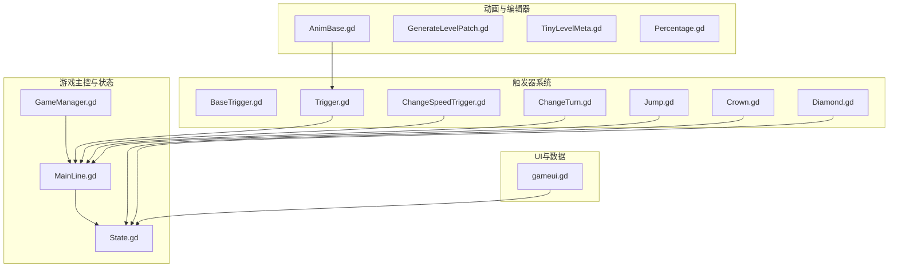
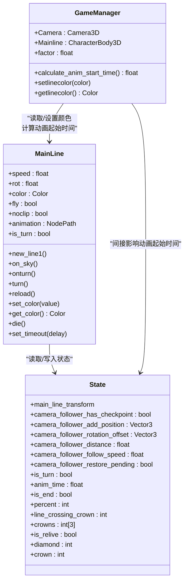
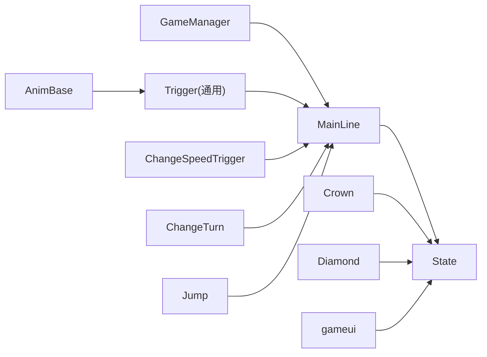
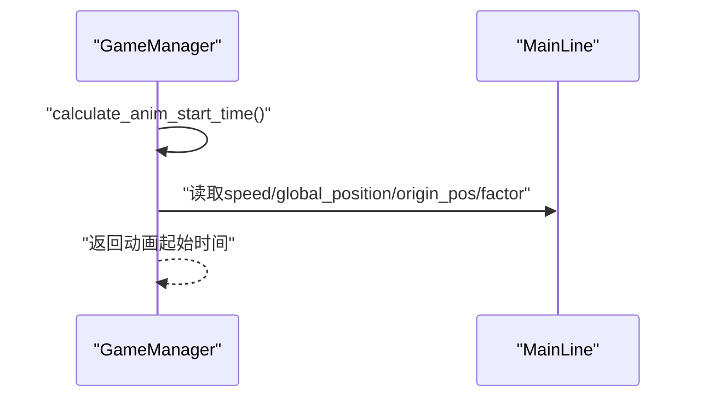
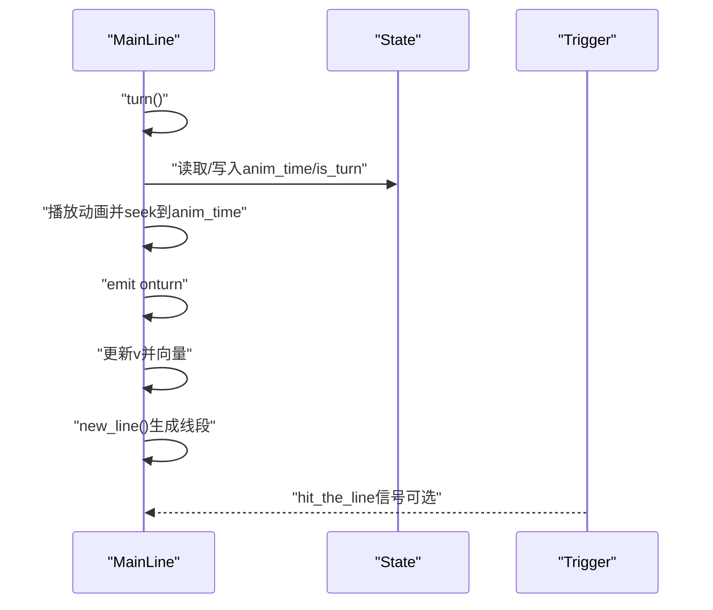
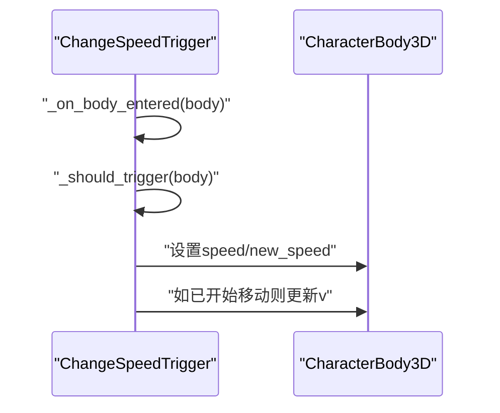
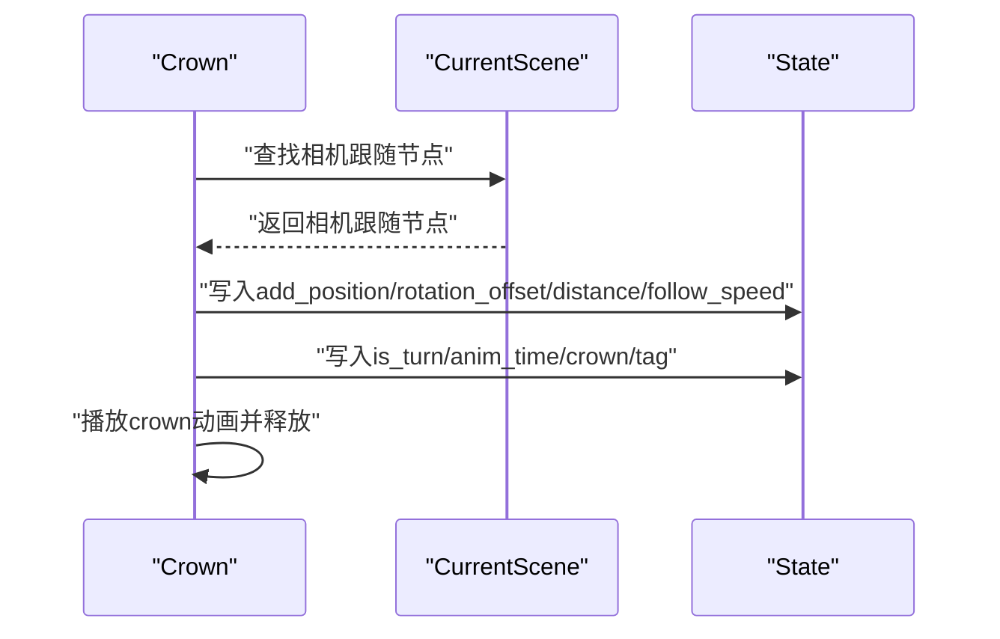

# API参考

<cite>
**本文引用的文件**
- [GameManager.gd](file://#Template/[Scripts]/GameManager.gd)
- [State.gd](file://#Template/[Scripts]/State.gd)
- [MainLine.gd](file://#Template/[Scripts]/MainLine.gd)
- [BaseTrigger.gd](file://#Template/[Scripts]/Trigger/BaseTrigger.gd)
- [Trigger.gd](file://#Template/[Scripts]/Trigger/Trigger.gd)
- [ChangeSpeedTrigger.gd](file://#Template/[Scripts]/Trigger/ChangeSpeedTrigger.gd)
- [ChangeTurn.gd](file://#Template/[Scripts]/Trigger/ChangeTurn.gd)
- [Crown.gd](file://#Template/[Scripts]/Trigger/Crown.gd)
- [Diamond.gd](file://#Template/[Scripts]/Trigger/Diamond.gd)
- [Jump.gd](file://#Template/[Scripts]/Trigger/Jump.gd)
- [AnimBase.gd](file://#Template/[Scripts]/AnimBase.gd)
- [GenerateLevelPatch.gd](file://#Template/[Scripts]/GenerateLevelPatch.gd)
- [TinyLevelMeta.gd](file://#Template/[Scripts]/TinyLevelMeta.gd)
- [Percentage.gd](file://#Template/[Scripts]/Percentage.gd)
- [gameui.gd](file://#Template/[Scripts]/gameui.gd)
</cite>

## 目录
1. [简介](#简介)
2. [项目结构](#项目结构)
3. [核心组件](#核心组件)
4. [架构总览](#架构总览)
5. [详细组件分析](#详细组件分析)
6. [依赖关系分析](#依赖关系分析)
7. [性能考量](#性能考量)
8. [故障排查指南](#故障排查指南)
9. [结论](#结论)
10. [附录](#附录)

## 简介
本API参考面向Godot Line模板的开发者与集成者，系统性梳理核心类与触发器体系的公共接口、信号、属性与行为契约。重点覆盖以下方面：
- 游戏主控与状态：GameManager、State、MainLine
- 触发器系统：BaseTrigger及其派生触发器（速度变更、转向变更、跳跃、皇冠、钻石）
- 动画与编辑器辅助：AnimBase、GenerateLevelPatch、TinyLevelMeta、Percentage
- UI与数据访问：gameui.gd对State的读取与重置
- 信号系统清单与典型使用路径

本参考以“可操作”为目标，既提供类与方法的定义级描述，也给出调用流程图与时序图，帮助快速定位实现细节与集成要点。

## 项目结构
模板采用“脚本集中于#Template/[Scripts]”的组织方式，核心逻辑分布在以下模块：
- 游戏主控与状态：GameManager、State、MainLine
- 触发器：BaseTrigger及若干具体触发器
- 动画与编辑器：AnimBase、GenerateLevelPatch、TinyLevelMeta、Percentage
- UI与数据：gameui.gd

图表来源
- [GameManager.gd:1-47](file://#Template/[Scripts]/GameManager.gd#L1-L47)
- [State.gd:1-21](file://#Template/[Scripts]/State.gd#L1-L21)
- [MainLine.gd:1-224](file://#Template/[Scripts]/MainLine.gd#L1-L224)
- [BaseTrigger.gd:1-102](file://#Template/[Scripts]/Trigger/BaseTrigger.gd#L1-L102)
- [Trigger.gd:1-10](file://#Template/[Scripts]/Trigger/Trigger.gd#L1-L10)
- [ChangeSpeedTrigger.gd:1-15](file://#Template/[Scripts]/Trigger/ChangeSpeedTrigger.gd#L1-L15)
- [ChangeTurn.gd:1-10](file://#Template/[Scripts]/Trigger/ChangeTurn.gd#L1-L10)
- [Jump.gd:1-13](file://#Template/[Scripts]/Trigger/Jump.gd#L1-L13)
- [Crown.gd:1-52](file://#Template/[Scripts]/Trigger/Crown.gd#L1-L52)
- [Diamond.gd:1-17](file://#Template/[Scripts]/Trigger/Diamond.gd#L1-L17)
- [AnimBase.gd:1-82](file://#Template/[Scripts]/AnimBase.gd#L1-L82)
- [GenerateLevelPatch.gd:1-139](file://#Template/[Scripts]/GenerateLevelPatch.gd#L1-L139)
- [TinyLevelMeta.gd:1-7](file://#Template/[Scripts]/TinyLevelMeta.gd#L1-L7)
- [Percentage.gd:1-99](file://#Template/[Scripts]/Percentage.gd#L1-L99)
- [gameui.gd:1-70](file://#Template/[Scripts]/gameui.gd#L1-L70)

章节来源
- [GameManager.gd:1-47](file://#Template/[Scripts]/GameManager.gd#L1-L47)
- [State.gd:1-21](file://#Template/[Scripts]/State.gd#L1-L21)
- [MainLine.gd:1-224](file://#Template/[Scripts]/MainLine.gd#L1-L224)
- [BaseTrigger.gd:1-102](file://#Template/[Scripts]/Trigger/BaseTrigger.gd#L1-L102)
- [Trigger.gd:1-10](file://#Template/[Scripts]/Trigger/Trigger.gd#L1-L10)
- [ChangeSpeedTrigger.gd:1-15](file://#Template/[Scripts]/Trigger/ChangeSpeedTrigger.gd#L1-L15)
- [ChangeTurn.gd:1-10](file://#Template/[Scripts]/Trigger/ChangeTurn.gd#L1-L10)
- [Jump.gd:1-13](file://#Template/[Scripts]/Trigger/Jump.gd#L1-L13)
- [Crown.gd:1-52](file://#Template/[Scripts]/Trigger/Crown.gd#L1-L52)
- [Diamond.gd:1-17](file://#Template/[Scripts]/Trigger/Diamond.gd#L1-L17)
- [AnimBase.gd:1-82](file://#Template/[Scripts]/AnimBase.gd#L1-L82)
- [GenerateLevelPatch.gd:1-139](file://#Template/[Scripts]/GenerateLevelPatch.gd#L1-L139)
- [TinyLevelMeta.gd:1-7](file://#Template/[Scripts]/TinyLevelMeta.gd#L1-L7)
- [Percentage.gd:1-99](file://#Template/[Scripts]/Percentage.gd#L1-L99)
- [gameui.gd:1-70](file://#Template/[Scripts]/gameui.gd#L1-L70)

## 核心组件
本节概述三大核心类的职责与公共API，便于快速检索与集成。

- GameManager
  - 作用：提供编辑器工具按钮与相机/主线关联；计算动画起始时间；封装主线颜色读写。
  - 关键导出属性：Camera、Mainline、factor
  - 关键导出工具按钮：Origin Pos、Get Origin Pos
  - 关键方法：calculate_anim_start_time() -> float、setlinecolor(color)、getlinecolor() -> Color
  - 章节来源
    - [GameManager.gd:1-47](file://#Template/[Scripts]/GameManager.gd#L1-L47)

- State
  - 作用：全局状态容器，保存主线变换、相机跟随参数、转向状态、动画起始时间、关卡统计（钻石、皇冠、百分比）等。
  - 关键字段：main_line_transform、camera_follower_*、is_turn、anim_time、is_end、percent、line_crossing_crown、crowns[]、is_relive、diamond、crown
  - 章节来源
    - [State.gd:1-21](file://#Template/[Scripts]/State.gd#L1-L21)

- MainLine
  - 作用：玩家角色主体，负责物理移动、地面判定、连线绘制、死亡与重生、动画播放与信号发射。
  - 导出属性：speed、rot、color、fly、noclip、animation、is_turn
  - 关键信号：new_line1、on_sky、onturn
  - 关键方法：turn()、reload()、set_color(value)、get_color() -> Color、die()、set_timeout(delay)
  - 章节来源
    - [MainLine.gd:1-224](file://#Template/[Scripts]/MainLine.gd#L1-L224)

## 架构总览
下图展示核心类之间的交互关系与数据流：

图表来源
- [GameManager.gd:1-47](file://#Template/[Scripts]/GameManager.gd#L1-L47)
- [State.gd:1-21](file://#Template/[Scripts]/State.gd#L1-L21)
- [MainLine.gd:1-224](file://#Template/[Scripts]/MainLine.gd#L1-L224)

## 详细组件分析

### GameManager API规范
- 导出组“Node”
  - Camera: Camera3D
  - Mainline: CharacterBody3D
  - factor: float
- 工具按钮
  - “Origin Pos” -> 执行闭包：设置origin_pos为Mainline的global_position，并打印日志
  - “Get Origin Pos” -> 执行闭包：将Mainline的global_position设回origin_pos，并打印日志
- 方法
  - calculate_anim_start_time() -> float
    - 计算方式：忽略Y轴的2D距离差乘以factor，再除以实际速度；若速度为0返回0
    - 依赖：Mainline.speed、Mainline.global_position、origin_pos、factor
  - setlinecolor(color)
    - 若存在Mainline，则调用其set_color(color)
  - getlinecolor() -> Color
    - 若存在Mainline，返回其颜色；否则返回白色

章节来源
- [GameManager.gd:1-47](file://#Template/[Scripts]/GameManager.gd#L1-L47)

### State API规范
- 字段（均为全局状态）
  - main_line_transform
  - camera_follower_has_checkpoint: bool
  - camera_follower_add_position: Vector3
  - camera_follower_rotation_offset: Vector3
  - camera_follower_distance: float
  - camera_follower_follow_speed: float
  - camera_follower_restore_pending: bool
  - is_turn: bool
  - anim_time: float
  - is_end: bool
  - percent: int
  - line_crossing_crown: int
  - crowns: int[3]
  - is_relive: bool
  - diamond: int
  - crown: int

章节来源
- [State.gd:1-21](file://#Template/[Scripts]/State.gd#L1-L21)

### MainLine API规范
- 导出属性
  - speed: float
  - rot: float
  - color: Color（带setter/getter）
  - fly: bool
  - noclip: bool
  - animation: NodePath
  - is_turn: bool
- 信号
  - new_line1()
  - on_sky()
  - onturn()
- 方法
  - turn(): 在地面或飞行状态下播放动画并切换转向，随后更新速度向量并生成新线段
  - reload(): 保存当前transform与相机跟随状态，重载当前场景
  - set_color(value: Color)、get_color() -> Color：通过材质设置/读取颜色
  - die(): 播放音效与粒子，禁用动画，生成碎块
  - set_timeout(delay: float)

章节来源
- [MainLine.gd:1-224](file://#Template/[Scripts]/MainLine.gd#L1-L224)

### 触发器系统

#### BaseTrigger 基类
- 信号
  - triggered(body: Node3D)
- 导出设置
  - one_shot: bool
  - trigger_filter: String（可选值："CharacterBody3D"|"PhysicsBody3D"|"Any"）
  - hide_mesh_in_game: bool
- 调试设置
  - debug_mode: bool
- 方法
  - reset() -> void：重置已使用标记
  - is_used() -> bool：查询是否已触发
  - _on_triggered(_body: Node3D) -> void：抽象方法，子类需实现
  - _should_trigger(body: Node3D) -> bool：根据filter判断是否触发
  - _setup_trigger()、_hide_mesh()、_on_body_entered(body: Node3D)：内部机制

章节来源
- [BaseTrigger.gd:1-102](file://#Template/[Scripts]/Trigger/BaseTrigger.gd#L1-L102)

#### Trigger 通用触发器
- 信号
  - hit_the_line
- 行为
  - 进入触发区域时发射hit_the_line信号

章节来源
- [Trigger.gd:1-10](file://#Template/[Scripts]/Trigger/Trigger.gd#L1-L10)

#### ChangeSpeedTrigger 速度变更触发器
- 导出
  - new_speed: float
- 行为
  - 将进入区域的CharacterBody3D对象的speed设为new_speed，并在必要时立即更新速度向量

章节来源
- [ChangeSpeedTrigger.gd:1-15](file://#Template/[Scripts]/Trigger/ChangeSpeedTrigger.gd#L1-L15)

#### ChangeTurn 转向变更触发器
- 行为
  - 切换进入区域的CharacterBody3D对象的is_turn状态

章节来源
- [ChangeTurn.gd:1-10](file://#Template/[Scripts]/Trigger/ChangeTurn.gd#L1-L10)

#### Jump 跳跃触发器
- 导出
  - height: float
- 行为
  - 对进入区域的CharacterBody3D施加垂直速度，使其向上跳跃

章节来源
- [Jump.gd:1-13](file://#Template/[Scripts]/Trigger/Jump.gd#L1-L13)

#### Crown 皇冠触发器
- 导出
  - speed: float
  - tag: int
- 行为
  - 旋转显示；玩家进入时：
    - 更新State.crown与main_line_transform
    - 从场景查找相机跟随节点，读取add_position、rotation_offset、distance_from_object、follow_speed并写入State
    - 记录State.is_turn与State.anim_time
    - 播放crown动画并释放自身

章节来源
- [Crown.gd:1-52](file://#Template/[Scripts]/Trigger/Crown.gd#L1-L52)

#### Diamond 钻石触发器
- 导出
  - speed: float
- 行为
  - 旋转显示；玩家进入时：
    - 增加State.diamond
    - 播放diamond动画并开启剩余粒子，等待粒子结束后释放自身

章节来源
- [Diamond.gd:1-17](file://#Template/[Scripts]/Trigger/Diamond.gd#L1-L17)

### 动画与编辑器辅助

#### AnimBase 动画基类
- 导出
  - start_value: Vector3、end_offset: Vector3、duration: float
  - TransitionType: Tween.TransitionType、EaseType: Tween.EaseType
  - trigger: Area3D、is_setting_start: bool、is_setting_end: bool
- 信号
  - on_animation_start、on_animation_end
- 工具按钮
  - “Set Start”、“Set End Offset”、“Play”
- 方法
  - play_()：执行Tween动画，回调中发射on_animation_end
  - 抽象方法：_get_value() -> Vector3、_set_value(value: Vector3) -> void、_get_property_name() -> String

章节来源
- [AnimBase.gd:1-82](file://#Template/[Scripts]/AnimBase.gd#L1-L82)

#### GenerateLevelPatch 生成关卡补丁
- 功能
  - 收集LevelPatchMeta资源，批量生成关卡数据资源文件至patches/levels目录
- 关键流程
  - 收集元数据（单个或目录内.tres）
  - 生成LevelData资源内容（含子资源TinyLevelMeta）
  - 写入目标文件并输出生成完成日志

章节来源
- [GenerateLevelPatch.gd:1-139](file://#Template/[Scripts]/GenerateLevelPatch.gd#L1-L139)

#### TinyLevelMeta 关卡片段元数据
- 导出
  - name: string
  - path: 文件路径（*.tscn/*.scn）

章节来源
- [TinyLevelMeta.gd:1-7](file://#Template/[Scripts]/TinyLevelMeta.gd#L1-L7)

#### Percentage 百分比显示（编辑器）
- 导出
  - selected_percent: int（setter会刷新显示）
- 行为
  - 收集子节点中的数字命名MeshInstance3D作为候选显示项
  - 保存前将仅保留当前选中项的拥有者设为场景根，其余置空，保存后恢复

章节来源
- [Percentage.gd:1-99](file://#Template/[Scripts]/Percentage.gd#L1-L99)

### UI与数据访问

#### gameui.gd
- 导出
  - line: CharacterBody3D、levelname: string、crown_no_light: Texture2D
- 行为
  - 在line.is_live为false或State.is_end为true时显示界面
  - 根据State.crown播放不同动画或设置无光纹理
  - 提供返回、重玩、重载场景按钮逻辑，并重置State中的计数与标志位

章节来源
- [gameui.gd:1-70](file://#Template/[Scripts]/gameui.gd#L1-L70)

## 依赖关系分析
- GameManager依赖MainLine进行颜色与动画起始时间计算
- MainLine依赖State存储相机跟随与动画状态，并在turn/reload/die等关键路径中读写State
- 触发器通过Area3D与信号系统与MainLine交互；部分触发器直接修改MainLine属性
- Crown/Diamond直接写入State统计字段
- gameui.gd读取State并在按钮事件中重置State
- AnimBase通过trigger信号与Trigger联动，实现编辑器驱动的动画录制与播放

图表来源
- [GameManager.gd:1-47](file://#Template/[Scripts]/GameManager.gd#L1-L47)
- [MainLine.gd:1-224](file://#Template/[Scripts]/MainLine.gd#L1-L224)
- [State.gd:1-21](file://#Template/[Scripts]/State.gd#L1-L21)
- [Trigger.gd:1-10](file://#Template/[Scripts]/Trigger/Trigger.gd#L1-L10)
- [ChangeSpeedTrigger.gd:1-15](file://#Template/[Scripts]/Trigger/ChangeSpeedTrigger.gd#L1-L15)
- [ChangeTurn.gd:1-10](file://#Template/[Scripts]/Trigger/ChangeTurn.gd#L1-L10)
- [Jump.gd:1-13](file://#Template/[Scripts]/Trigger/Jump.gd#L1-L13)
- [Crown.gd:1-52](file://#Template/[Scripts]/Trigger/Crown.gd#L1-L52)
- [Diamond.gd:1-17](file://#Template/[Scripts]/Trigger/Diamond.gd#L1-L17)
- [AnimBase.gd:1-82](file://#Template/[Scripts]/AnimBase.gd#L1-L82)
- [gameui.gd:1-70](file://#Template/[Scripts]/gameui.gd#L1-L70)

## 性能考量
- MainLine连线绘制
  - 每帧根据位移计算线段位置与缩放，建议在高密度场景中限制线段数量或使用池化策略
- 物理与输入
  - _physics_process中频繁读取is_on_floor/is_on_wall，建议在复杂地形中减少不必要的检测开销
- 触发器过滤
  - BaseTrigger的trigger_filter默认按类型过滤，避免对无关节点产生信号风暴
- 动画播放
  - AnimBase使用Tween，注意同时播放多个动画时的回调与状态复位

## 故障排查指南
- 触发器未生效
  - 检查one_shot是否已使用；确认trigger_filter与目标节点类型匹配；查看debug_mode输出
  - 章节来源
    - [BaseTrigger.gd:54-102](file://#Template/[Scripts]/Trigger/BaseTrigger.gd#L54-L102)
- 速度变更无效
  - 确认进入区域的节点具备speed属性；若已开始移动，需同步更新v向量
  - 章节来源
    - [ChangeSpeedTrigger.gd:8-15](file://#Template/[Scripts]/Trigger/ChangeSpeedTrigger.gd#L8-L15)
- 转向状态异常
  - 确认进入区域的节点具备is_turn属性；检查turn()调用时机
  - 章节来源
    - [ChangeTurn.gd:6-10](file://#Template/[Scripts]/Trigger/ChangeTurn.gd#L6-L10)
- 皇冠/钻石不计数
  - 确认Crown/Diamond的碰撞体与MainLine的碰撞层配置正确；检查State.crown/diamond是否被重置
  - 章节来源
    - [Crown.gd:25-52](file://#Template/[Scripts]/Trigger/Crown.gd#L25-L52)
    - [Diamond.gd:7-17](file://#Template/[Scripts]/Trigger/Diamond.gd#L7-L17)
- 动画播放卡住
  - 检查AnimBase的播放状态与回调；确认trigger信号连接正常
  - 章节来源
    - [AnimBase.gd:55-82](file://#Template/[Scripts]/AnimBase.gd#L55-L82)

## 结论
本API参考为Godot Line模板提供了从游戏主控、状态管理到触发器与动画系统的完整技术蓝图。通过清晰的类与信号边界、明确的状态读写路径以及可扩展的触发器基类，开发者可以快速集成新功能、定制玩法与优化性能。建议在扩展时遵循现有信号与状态契约，保持耦合度可控。

## 附录

### 信号系统清单与使用示例
- MainLine
  - new_line1：连线生成时发射
  - on_sky：离地时发射
  - onturn：转向完成时发射
  - 使用示例路径
    - [MainLine.gd:161](file://#Template/[Scripts]/MainLine.gd#L161)
    - [MainLine.gd:100](file://#Template/[Scripts]/MainLine.gd#L100)
    - [MainLine.gd:177](file://#Template/[Scripts]/MainLine.gd#L177)

- BaseTrigger
  - triggered(body: Node3D)：触发器激活时发射
  - 使用示例路径
    - [BaseTrigger.gd:69](file://#Template/[Scripts]/Trigger/BaseTrigger.gd#L69)

- Trigger
  - hit_the_line：通用触发器发射
  - 使用示例路径
    - [Trigger.gd:9](file://#Template/[Scripts]/Trigger/Trigger.gd#L9)

- AnimBase
  - on_animation_start、on_animation_end：动画播放开始/结束时发射
  - 使用示例路径
    - [AnimBase.gd:62](file://#Template/[Scripts]/AnimBase.gd#L62)
    - [AnimBase.gd:66](file://#Template/[Scripts]/AnimBase.gd#L66)

### 状态管理API与数据访问
- 读取/写入State的关键路径
  - MainLine.turn()：读取State.anim_time并seek动画
  - MainLine.reload()：保存State.main_line_transform等
  - Crown/Diamond：更新State.crown/diamond
  - gameui.gd：读取State.crown并根据is_relive调整结算逻辑
  - 使用示例路径
    - [MainLine.gd:172](file://#Template/[Scripts]/MainLine.gd#L172)
    - [MainLine.gd:114-124](file://#Template/[Scripts]/MainLine.gd#L114-L124)
    - [Crown.gd:26-48](file://#Template/[Scripts]/Trigger/Crown.gd#L26-L48)
    - [Diamond.gd:8](file://#Template/[Scripts]/Trigger/Diamond.gd#L8)
    - [gameui.gd:19-37](file://#Template/[Scripts]/gameui.gd#L19-L37)

### 关键流程时序图

#### 动画起始时间计算（GameManager → MainLine）

图表来源
- [GameManager.gd:23-39](file://#Template/[Scripts]/GameManager.gd#L23-L39)
- [MainLine.gd:33-36](file://#Template/[Scripts]/MainLine.gd#L33-L36)

#### 转向与连线生成（MainLine）

图表来源
- [MainLine.gd:168-184](file://#Template/[Scripts]/MainLine.gd#L168-L184)
- [Trigger.gd:8-9](file://#Template/[Scripts]/Trigger/Trigger.gd#L8-L9)

#### 速度变更触发（ChangeSpeedTrigger）

图表来源
- [ChangeSpeedTrigger.gd:8-15](file://#Template/[Scripts]/Trigger/ChangeSpeedTrigger.gd#L8-L15)

#### 皇冠拾取（Crown）

图表来源
- [Crown.gd:6-52](file://#Template/[Scripts]/Trigger/Crown.gd#L6-L52)