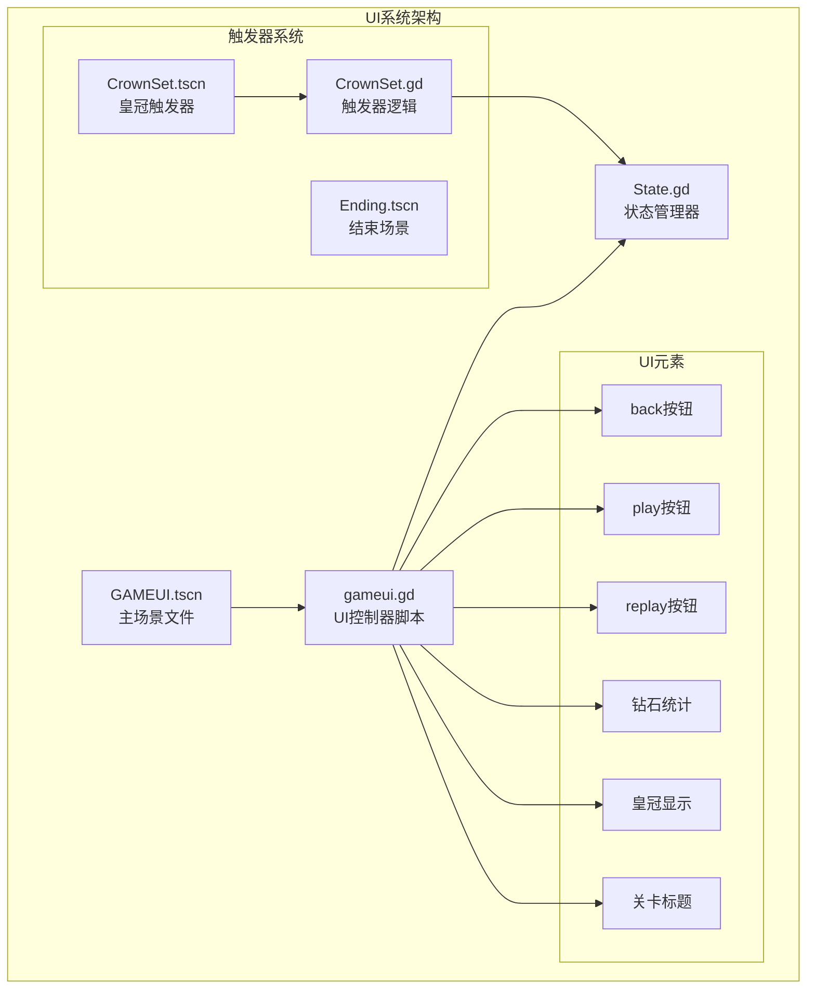
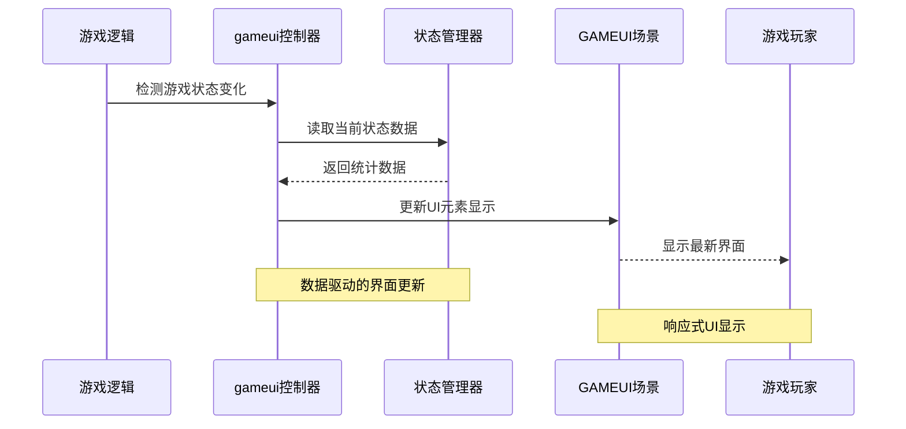
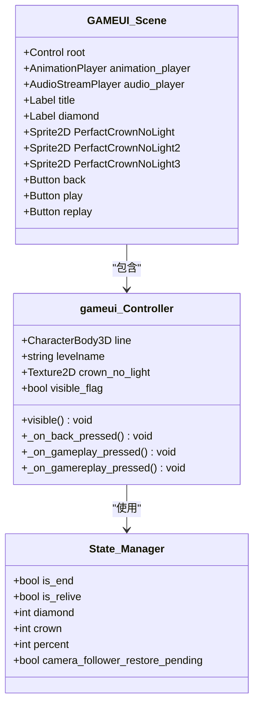
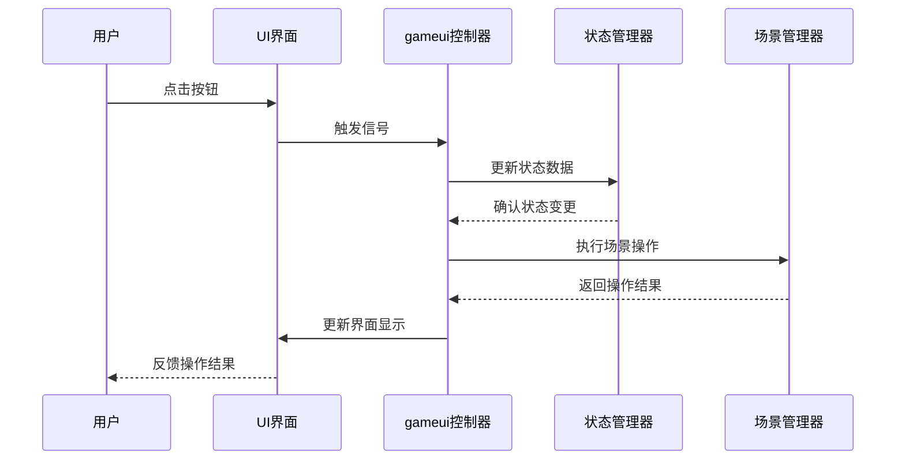
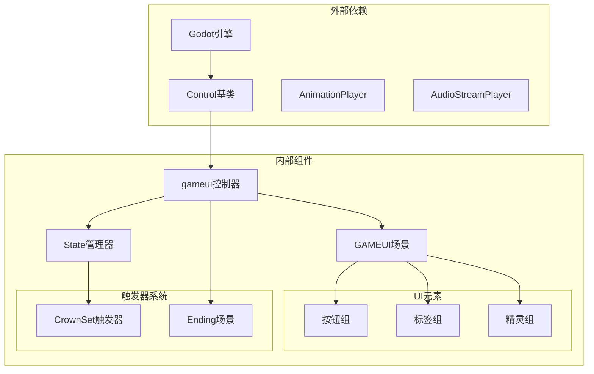

# UI系统API

<cite>
**本文档引用的文件**
- [gameui.gd](file://#Template/[Scripts]/gameui.gd)
- [GAMEUI.tscn](file://#Template/GAMEUI.tscn)
- [State.gd](file://#Template/[Scripts]/State.gd)
- [Ending.tscn](file://#Template/Ending.tscn)
- [CrownSet.tscn](file://#Template/CrownSet.tscn)
- [CrownSet.gd](file://#Template/[Scripts]/Trigger/CrownSet.gd)
- [GameManager.gd](file://#Template/[Scripts]/GameManager.gd)
- [back.png.import](file://#Template/[Resources]/ui/back.png.import)
- [play.png.import](file://#Template/[Resources]/ui/play.png.import)
- [replay.png.import](file://#Template/[Resources]/ui/replay.png.import)
</cite>

## 目录
1. [简介](#简介)
2. [项目结构](#项目结构)
3. [核心组件](#核心组件)
4. [架构概览](#架构概览)
5. [详细组件分析](#详细组件分析)
6. [依赖关系分析](#依赖关系分析)
7. [性能考虑](#性能考虑)
8. [故障排除指南](#故障排除指南)
9. [结论](#结论)

## 简介

UI系统API是Godot项目中的关键组件，负责管理游戏界面的显示控制、统计数据更新和用户交互处理。该系统基于GAMEUI场景构建，提供了完整的用户界面管理功能，包括游戏结束界面、统计信息显示和用户操作响应。

系统采用模块化设计，通过gameui类作为主要的UI控制器，结合State状态管理器实现数据驱动的界面更新。UI元素通过SceneTree进行动态管理和控制，支持响应式布局和样式定制。

## 项目结构

UI系统主要由以下核心文件组成：

**图表来源**
- [GAMEUI.tscn:1-453](file://#Template/GAMEUI.tscn#L1-L453)
- [gameui.gd:1-70](file://#Template/[Scripts]/gameui.gd#L1-L70)
- [State.gd:1-23](file://#Template/[Scripts]/State.gd#L1-L23)

**章节来源**
- [GAMEUI.tscn:1-453](file://#Template/GAMEUI.tscn#L1-L453)
- [gameui.gd:1-70](file://#Template/[Scripts]/gameui.gd#L1-L70)
- [State.gd:1-23](file://#Template/[Scripts]/State.gd#L1-L23)

## 核心组件

### gameui类 - 主要UI控制器

gameui类是UI系统的核心控制器，继承自Control类，负责管理整个UI界面的显示和交互。

**主要功能特性：**
- 自动界面显示控制（基于游戏状态）
- 统计数据实时更新（钻石数量、皇冠数量）
- 用户交互事件处理
- 场景切换和重载机制

**关键属性：**
- `line`: CharacterBody3D类型的导出变量，用于获取游戏对象状态
- `levelname`: 关卡名称字符串
- `crown_no_light`: 无光皇冠纹理资源

**章节来源**
- [gameui.gd:1-70](file://#Template/[Scripts]/gameui.gd#L1-L70)

### GAMEUI场景 - UI容器

GAMEUI场景是所有UI元素的容器，定义了完整的界面布局和资源引用。

**场景结构特点：**
- 包含多个UI元素节点（按钮、标签、精灵等）
- 定义了字体、纹理和音频资源
- 配置了动画播放器和音频播放器
- 设置了节点的布局模式和位置参数

**章节来源**
- [GAMEUI.tscn:1-453](file://#Template/GAMEUI.tscn#L1-L453)

### State状态管理器

State类提供全局状态管理，存储游戏过程中的各种统计数据。

**管理的数据：**
- 游戏相机跟随相关状态
- 游戏进度和完成状态
- 玩家统计数据（钻石、皇冠数量）
- 游戏状态标志（复活状态、结束状态）

**章节来源**
- [State.gd:1-23](file://#Template/[Scripts]/State.gd#L1-L23)

## 架构概览

UI系统采用分层架构设计，实现了清晰的关注点分离：

**图表来源**
- [gameui.gd:10-37](file://#Template/[Scripts]/gameui.gd#L10-L37)
- [State.gd:12-22](file://#Template/[Scripts]/State.gd#L12-L22)

系统架构的关键优势：
- **解耦设计**: UI控制器与游戏逻辑分离
- **数据驱动**: 基于State状态自动更新界面
- **事件驱动**: 通过信号连接实现用户交互
- **资源管理**: 统一的资源加载和管理机制

## 详细组件分析

### UI元素节点接口

GAMEUI场景定义了完整的UI元素层次结构：

**图表来源**
- [GAMEUI.tscn:413-453](file://#Template/GAMEUI.tscn#L413-L453)
- [gameui.gd:1-70](file://#Template/[Scripts]/gameui.gd#L1-L70)
- [State.gd:1-23](file://#Template/[Scripts]/State.gd#L1-L23)

### 用户界面显示控制流程

UI显示控制采用条件触发机制：

**图表来源**
- [gameui.gd:10-37](file://#Template/[Scripts]/gameui.gd#L10-L37)

### 统计信息更新机制

系统通过State管理器实现统计数据的集中管理：

**钻石统计更新：**
- 实时显示格式：`当前数量/10`
- 自动从State.diamond读取数值
- 动态更新UI标签内容

**皇冠统计更新：**
- 支持0-3个皇冠显示
- 通过AnimationPlayer控制动画播放
- 使用不同纹理表示有光/无光状态

**章节来源**
- [gameui.gd:19-37](file://#Template/[Scripts]/gameui.gd#L19-L37)
- [State.gd:21-22](file://#Template/[Scripts]/State.gd#L21-L22)

### 用户交互处理API

UI系统提供完整的用户交互处理接口：

**图表来源**
- [gameui.gd:40-69](file://#Template/[Scripts]/gameui.gd#L40-L69)

**交互按钮功能：**
- **back按钮**: 退出游戏，重置所有状态
- **play按钮**: 重新开始当前关卡，支持复活机制
- **replay按钮**: 重新加载场景，重置状态

**章节来源**
- [gameui.gd:40-69](file://#Template/[Scripts]/gameui.gd#L40-L69)

### 游戏结束界面API规范

游戏结束界面提供完整的结算功能：

**界面元素：**
- 关卡标题显示（可自定义）
- 钻石收集统计（格式化显示）
- 皇冠数量动画（0-3个）
- 操作按钮组（返回、重新开始、重玩）

**显示逻辑：**
- 基于State.is_end状态自动触发
- 结合line.is_live状态判断显示时机
- 支持复活状态下的特殊处理

**章节来源**
- [gameui.gd:10-37](file://#Template/[Scripts]/gameui.gd#L10-L37)
- [GAMEUI.tscn:413-453](file://#Template/GAMEUI.tscn#L413-L453)

## 依赖关系分析

UI系统各组件之间的依赖关系如下：

**图表来源**
- [gameui.gd:1-70](file://#Template/[Scripts]/gameui.gd#L1-L70)
- [State.gd:1-23](file://#Template/[Scripts]/State.gd#L1-L23)
- [GAMEUI.tscn:1-453](file://#Template/GAMEUI.tscn#L1-L453)

**依赖特点：**
- 单向依赖关系，避免循环引用
- 明确的职责分离
- 资源集中管理
- 事件驱动的通信机制

## 性能考虑

UI系统的性能优化策略：

### 内存管理
- 使用延迟加载机制避免不必要的资源加载
- 合理的节点生命周期管理
- 及时释放不再使用的资源引用

### 渲染优化
- 批量更新UI元素减少重绘次数
- 使用合适的纹理压缩格式
- 控制动画播放的频率和复杂度

### 交互响应
- 异步处理用户输入事件
- 避免在UI线程中执行耗时操作
- 使用信号机制实现松耦合通信

## 故障排除指南

### 常见问题及解决方案

**界面不显示问题：**
- 检查State.is_end状态是否正确设置
- 验证line.is_live状态的逻辑判断
- 确认visible()函数的调用时机

**统计数据不更新：**
- 确认State.diamond和State.crown的值更新
- 检查diamond标签的文本格式化
- 验证UI元素的节点路径配置

**按钮无响应：**
- 检查信号连接是否正确建立
- 验证按钮的pressed信号绑定
- 确认回调函数的实现逻辑

**章节来源**
- [gameui.gd:7-37](file://#Template/[Scripts]/gameui.gd#L7-L37)
- [State.gd:12-22](file://#Template/[Scripts]/State.gd#L12-L22)

## 结论

UI系统API提供了完整而灵活的用户界面管理解决方案。通过模块化的架构设计和清晰的接口定义，系统能够有效管理游戏界面的各种需求。

**主要优势：**
- 基于状态驱动的自动界面更新
- 完整的用户交互处理机制  
- 灵活的布局管理和样式定制
- 高效的性能表现和内存管理

**扩展建议：**
- 添加更多UI元素类型支持
- 实现主题系统以支持多套样式
- 增强响应式设计适配不同屏幕尺寸
- 提供更丰富的动画效果和过渡效果

该系统为Godot项目提供了坚实的基础UI框架，可根据具体需求进行进一步的功能扩展和优化。