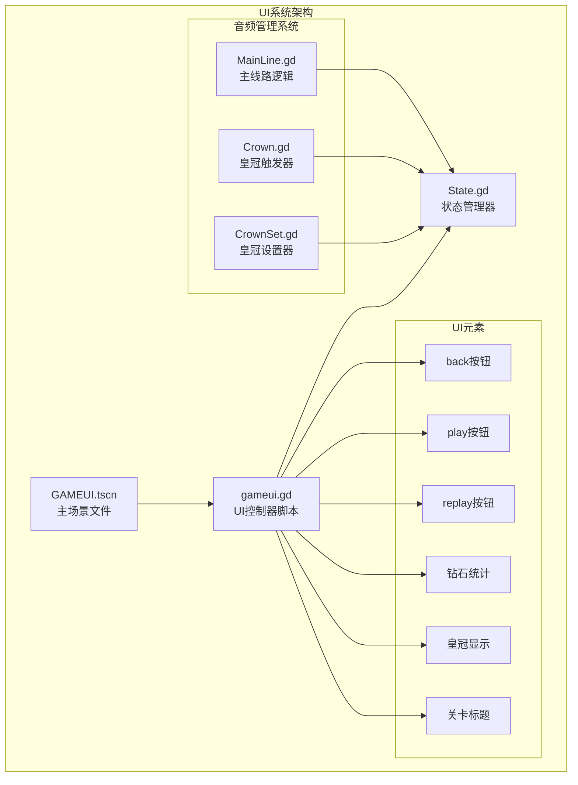
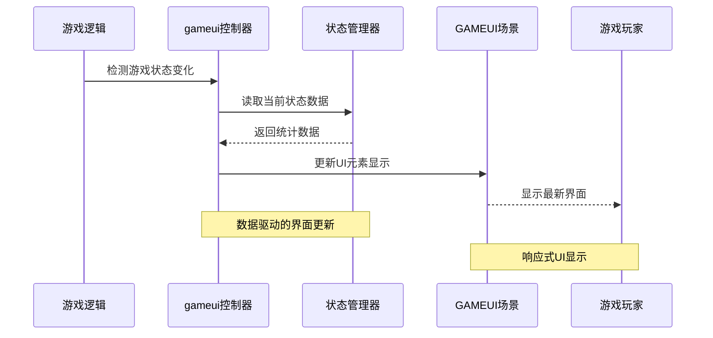
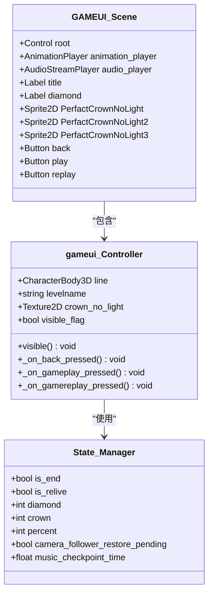
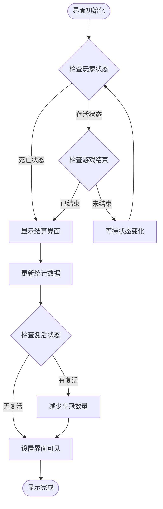
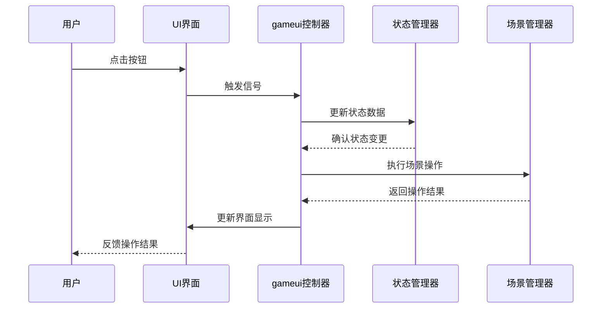
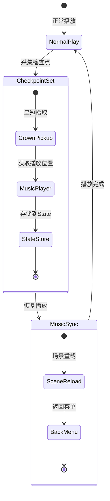
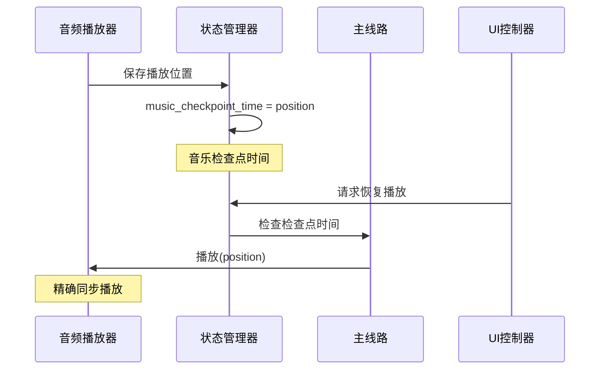
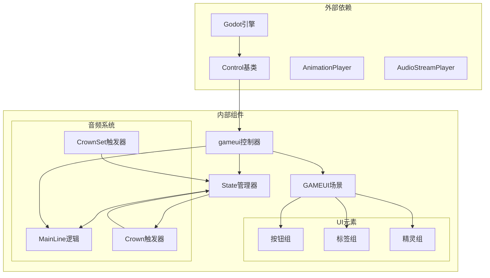

# UI系统API

<cite>
**本文档引用的文件**
- [gameui.gd](file://#Template/[Scripts]/gameui.gd)
- [GAMEUI.tscn](file://#Template/GAMEUI.tscn)
- [State.gd](file://#Template/[Scripts]/State.gd)
- [MainLine.gd](file://#Template/[Scripts]/MainLine.gd)
- [Crown.gd](file://#Template/[Scripts]/Trigger/Crown.gd)
- [CrownSet.gd](file://#Template/[Scripts]/Trigger/CrownSet.gd)
- [GameManager.gd](file://#Template/[Scripts]/GameManager.gd)
- [back.png.import](file://#Template/[Resources]/ui/back.png.import)
- [play.png.import](file://#Template/[Resources]/ui/play.png.import)
- [replay.png.import](file://#Template/[Resources]/ui/replay.png.import)
</cite>

## 更新摘要
**变更内容**
- 更新UI状态管理章节，反映音乐检查点时间重置机制
- 新增音频同步一致性章节，详细说明音乐检查点时间的使用
- 更新用户交互处理API，包含音频同步相关的状态管理
- 增强UI状态管理增强部分，说明返回菜单和重新开始时的音频处理

## 目录
1. [简介](#简介)
2. [项目结构](#项目结构)
3. [核心组件](#核心组件)
4. [架构概览](#架构概览)
5. [详细组件分析](#详细组件分析)
6. [UI状态管理增强](#ui状态管理增强)
7. [音频同步一致性](#音频同步一致性)
8. [依赖关系分析](#依赖关系分析)
9. [性能考虑](#性能考虑)
10. [故障排除指南](#故障排除指南)
11. [结论](#结论)

## 简介

UI系统API是Godot项目中的关键组件，负责管理游戏界面的显示控制、统计数据更新和用户交互处理。该系统基于GAMEUI场景构建，提供了完整的用户界面管理功能，包括游戏结束界面、统计信息显示和用户操作响应。

系统采用模块化设计，通过gameui类作为主要的UI控制器，结合State状态管理器实现数据驱动的界面更新。UI元素通过SceneTree进行动态管理和控制，支持响应式布局和样式定制。

**更新** 新增了UI状态管理增强功能，特别关注音频同步一致性，确保在返回菜单和重新开始时正确重置音乐检查点时间。

## 项目结构

UI系统主要由以下核心文件组成：

**图表来源**
- [GAMEUI.tscn:1-454](file://#Template/GAMEUI.tscn#L1-L454)
- [gameui.gd:1-73](file://#Template/[Scripts]/gameui.gd#L1-L73)
- [State.gd:1-22](file://#Template/[Scripts]/State.gd#L1-L22)

**章节来源**
- [GAMEUI.tscn:1-454](file://#Template/GAMEUI.tscn#L1-L454)
- [gameui.gd:1-73](file://#Template/[Scripts]/gameui.gd#L1-L73)
- [State.gd:1-22](file://#Template/[Scripts]/State.gd#L1-L22)

## 核心组件

### gameui类 - 主要UI控制器

gameui类是UI系统的核心控制器，继承自Control类，负责管理整个UI界面的显示和交互。

**主要功能特性：**
- 自动界面显示控制（基于游戏状态）
- 统计数据实时更新（钻石数量、皇冠数量）
- 用户交互事件处理
- 场景切换和重载机制
- **新增** 音频同步状态管理

**关键属性：**
- `line`: CharacterBody3D类型的导出变量，用于获取游戏对象状态
- `levelname`: 关卡名称字符串
- `crown_no_light`: 无光皇冠纹理资源

**章节来源**
- [gameui.gd:1-73](file://#Template/[Scripts]/gameui.gd#L1-L73)

### GAMEUI场景 - UI容器

GAMEUI场景是所有UI元素的容器，定义了完整的界面布局和资源引用。

**场景结构特点：**
- 包含多个UI元素节点（按钮、标签、精灵等）
- 定义了字体、纹理和音频资源
- 配置了动画播放器和音频播放器
- 设置了节点的布局模式和位置参数

**章节来源**
- [GAMEUI.tscn:1-454](file://#Template/GAMEUI.tscn#L1-L454)

### State状态管理器

State类提供全局状态管理，存储游戏过程中的各种统计数据。

**管理的数据：**
- 游戏相机跟随相关状态
- 游戏进度和完成状态
- 玩家统计数据（钻石、皇冠数量）
- 游戏状态标志（复活状态、结束状态）
- **新增** 音乐检查点时间（music_checkpoint_time）

**章节来源**
- [State.gd:1-22](file://#Template/[Scripts]/State.gd#L1-L22)

## 架构概览

UI系统采用分层架构设计，实现了清晰的关注点分离：

**图表来源**
- [gameui.gd:10-37](file://#Template/[Scripts]/gameui.gd#L10-L37)
- [State.gd:12-22](file://#Template/[Scripts]/State.gd#L12-L22)

系统架构的关键优势：
- **解耦设计**: UI控制器与游戏逻辑分离
- **数据驱动**: 基于State状态自动更新界面
- **事件驱动**: 通过信号连接实现用户交互
- **资源管理**: 统一的资源加载和管理机制
- **音频同步**: 通过音乐检查点时间确保音频一致性

## 详细组件分析

### UI元素节点接口

GAMEUI场景定义了完整的UI元素层次结构：

**图表来源**
- [GAMEUI.tscn:413-454](file://#Template/GAMEUI.tscn#L413-L454)
- [gameui.gd:1-73](file://#Template/[Scripts]/gameui.gd#L1-L73)
- [State.gd:1-22](file://#Template/[Scripts]/State.gd#L1-L22)

### 用户界面显示控制流程

UI显示控制采用条件触发机制：

**图表来源**
- [gameui.gd:10-37](file://#Template/[Scripts]/gameui.gd#L10-L37)

### 统计信息更新机制

系统通过State管理器实现统计数据的集中管理：

**钻石统计更新：**
- 实时显示格式：`当前数量/10`
- 自动从State.diamond读取数值
- 动态更新UI标签内容

**皇冠统计更新：**
- 支持0-3个皇冠显示
- 通过AnimationPlayer控制动画播放
- 使用不同纹理表示有光/无光状态

**章节来源**
- [gameui.gd:19-37](file://#Template/[Scripts]/gameui.gd#L19-L37)
- [State.gd:20-21](file://#Template/[Scripts]/State.gd#L20-L21)

### 用户交互处理API

UI系统提供完整的用户交互处理接口：

**图表来源**
- [gameui.gd:40-73](file://#Template/[Scripts]/gameui.gd#L40-L73)

**交互按钮功能：**
- **back按钮**: 退出游戏，重置所有状态，**新增** 重置音乐检查点时间
- **play按钮**: 重新开始当前关卡，支持复活机制，**新增** 重置音乐检查点时间
- **replay按钮**: 重新加载场景，重置状态，**新增** 重置音乐检查点时间

**章节来源**
- [gameui.gd:40-73](file://#Template/[Scripts]/gameui.gd#L40-L73)

### 游戏结束界面API规范

游戏结束界面提供完整的结算功能：

**界面元素：**
- 关卡标题显示（可自定义）
- 钻石收集统计（格式化显示）
- 皇冠数量动画（0-3个）
- 操作按钮组（返回、重新开始、重玩）

**显示逻辑：**
- 基于State.is_end状态自动触发
- 结合line.is_live状态判断显示时机
- 支持复活状态下的特殊处理

**章节来源**
- [gameui.gd:10-37](file://#Template/[Scripts]/gameui.gd#L10-L37)
- [GAMEUI.tscn:413-454](file://#Template/GAMEUI.tscn#L413-L454)

## UI状态管理增强

**更新** UI系统现在具备增强的状态管理能力，特别关注音频同步一致性。

### 音乐检查点时间管理

系统引入了music_checkpoint_time状态变量，用于精确控制音频播放的同步：

**图表来源**
- [Crown.gd:33-36](file://#Template/[Scripts]/Trigger/Crown.gd#L33-L36)
- [gameui.gd:59](file://#Template/[Scripts]/gameui.gd#L59)
- [gameui.gd:63](file://#Template/[Scripts]/gameui.gd#L63)

### 返回菜单时的音频处理

当用户点击back按钮时，系统会执行以下音频同步处理：

1. **立即重置音乐检查点时间**：将State.music_checkpoint_time设置为0.0
2. **清理所有游戏状态**：重置钻石、皇冠、百分比等统计数据
3. **停止相机跟随状态**：清除相机跟随检查点
4. **确保音频一致性**：防止菜单背景音乐与游戏音频冲突

### 重新开始时的音频处理

当用户选择重新开始（play或replay按钮）时，系统会：

1. **场景重载**：重新加载当前场景
2. **重置音乐检查点**：将State.music_checkpoint_time设置为0.0
3. **清理复活状态**：如果存在复活状态，标记为已复活
4. **重置相机跟随**：设置camera_follower_restore_pending为true
5. **清空统计数据**：重置钻石、皇冠、百分比等所有统计信息

**章节来源**
- [gameui.gd:40-73](file://#Template/[Scripts]/gameui.gd#L40-L73)

## 音频同步一致性

**新增** 系统现在具备完整的音频同步机制，确保音乐播放与游戏状态的一致性。

### 音频同步机制

音频同步通过以下机制实现：

**图表来源**
- [Crown.gd:33-36](file://#Template/[Scripts]/Trigger/Crown.gd#L33-L36)
- [MainLine.gd:187-192](file://#Template/[Scripts]/MainLine.gd#L187-L192)

### 音乐检查点的采集

当玩家拾取皇冠时，系统会自动采集音乐播放位置：

1. **检测音乐播放状态**：确认AudioStreamPlayer正在播放
2. **获取播放位置**：调用get_playback_position()获取当前位置
3. **存储到状态管理器**：将位置保存到State.music_checkpoint_time
4. **更新相机跟随状态**：同时保存相机跟随相关状态

### 音乐恢复播放逻辑

当场景重载或返回菜单后重新进入游戏时：

1. **检查检查点时间**：State.music_checkpoint_time > 0.0
2. **选择播放方式**：使用检查点时间或动画时间
3. **精确播放**：调用$MusicPlayer.play(music_start_time)
4. **确保同步**：避免音频与动画不同步的问题

**章节来源**
- [Crown.gd:33-36](file://#Template/[Scripts]/Trigger/Crown.gd#L33-L36)
- [MainLine.gd:187-192](file://#Template/[Scripts]/MainLine.gd#L187-L192)

## 依赖关系分析

UI系统各组件之间的依赖关系如下：

**图表来源**
- [gameui.gd:1-73](file://#Template/[Scripts]/gameui.gd#L1-L73)
- [State.gd:1-22](file://#Template/[Scripts]/State.gd#L1-L22)
- [GAMEUI.tscn:1-454](file://#Template/GAMEUI.tscn#L1-L454)

**依赖特点：**
- 单向依赖关系，避免循环引用
- 明确的职责分离
- 资源集中管理
- 事件驱动的通信机制
- **新增** 音频同步状态共享

## 性能考虑

UI系统的性能优化策略：

### 内存管理
- 使用延迟加载机制避免不必要的资源加载
- 合理的节点生命周期管理
- 及时释放不再使用的资源引用

### 渲染优化
- 批量更新UI元素减少重绘次数
- 使用合适的纹理压缩格式
- 控制动画播放的频率和复杂度

### 交互响应
- 异步处理用户输入事件
- 避免在UI线程中执行耗时操作
- 使用信号机制实现松耦合通信

### **新增** 音频同步优化
- 音乐检查点时间的高效存储和检索
- 避免重复计算播放位置
- 优化音频播放器的重置和恢复过程

## 故障排除指南

### 常见问题及解决方案

**界面不显示问题：**
- 检查State.is_end状态是否正确设置
- 验证line.is_live状态的逻辑判断
- 确认visible()函数的调用时机

**统计数据不更新：**
- 确认State.diamond和State.crown的值更新
- 检查diamond标签的文本格式化
- 验证UI元素的节点路径配置

**按钮无响应：**
- 检查信号连接是否正确建立
- 验证按钮的pressed信号绑定
- 确认回调函数的实现逻辑

**音频不同步问题：**
- **新增** 检查State.music_checkpoint_time是否正确设置
- 验证Crown.gd中音乐播放位置的采集逻辑
- 确认MainLine.gd中音频恢复播放的实现
- 检查UI控制器中音乐检查点时间的重置逻辑

**章节来源**
- [gameui.gd:7-37](file://#Template/[Scripts]/gameui.gd#L7-L37)
- [State.gd:12-22](file://#Template/[Scripts]/State.gd#L12-L22)

## 结论

UI系统API提供了完整而灵活的用户界面管理解决方案。通过模块化的架构设计和清晰的接口定义，系统能够有效管理游戏界面的各种需求。

**主要优势：**
- 基于状态驱动的自动界面更新
- 完整的用户交互处理机制  
- 灵活的布局管理和样式定制
- 高效的性能表现和内存管理
- **新增** 完整的音频同步一致性保障

**扩展建议：**
- 添加更多UI元素类型支持
- 实现主题系统以支持多套样式
- 增强响应式设计适配不同屏幕尺寸
- 提供更丰富的动画效果和过渡效果
- **新增** 音频同步状态的可视化监控

**更新总结：**
本次更新显著增强了UI系统的音频同步能力，通过music_checkpoint_time状态变量和相应的重置机制，确保了在返回菜单和重新开始时的音频一致性。这一改进解决了音频不同步的潜在问题，提升了整体的游戏体验质量。

该系统为Godot项目提供了坚实的基础UI框架，可根据具体需求进行进一步的功能扩展和优化。