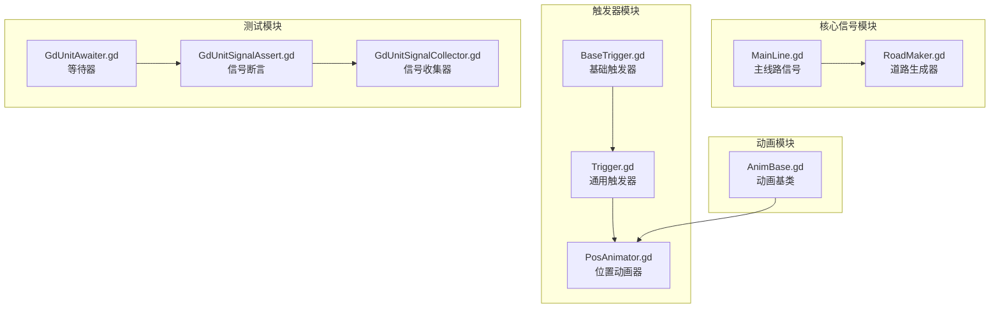
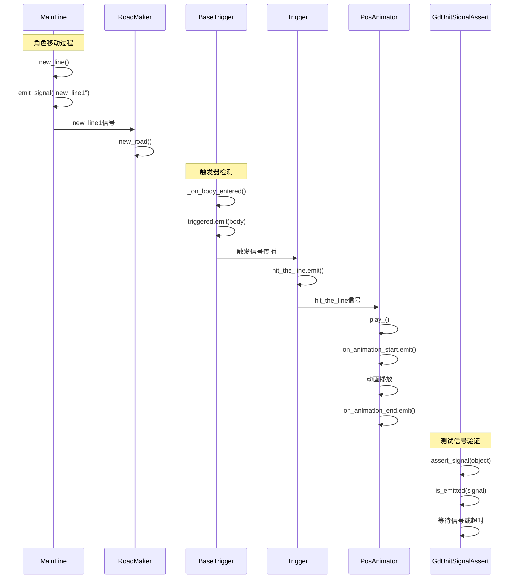
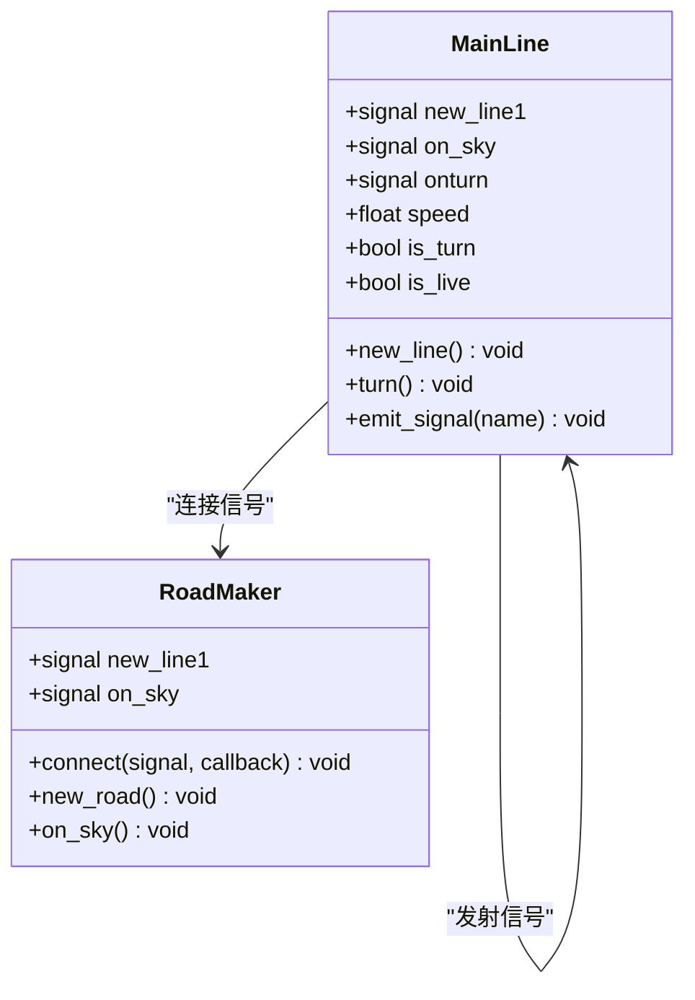
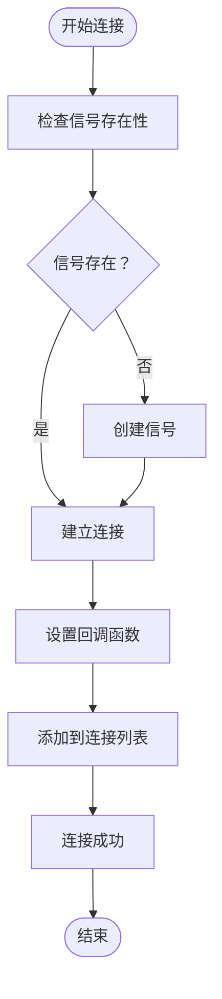
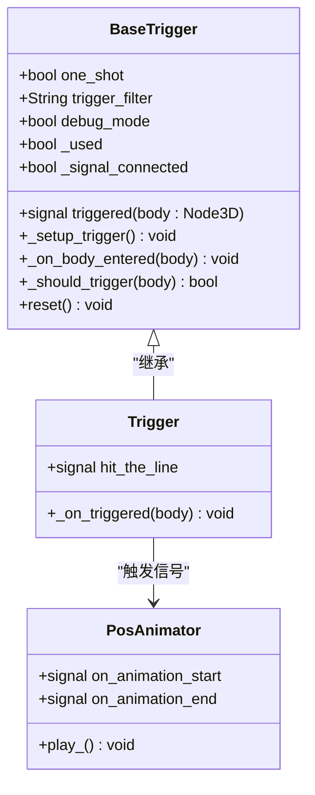
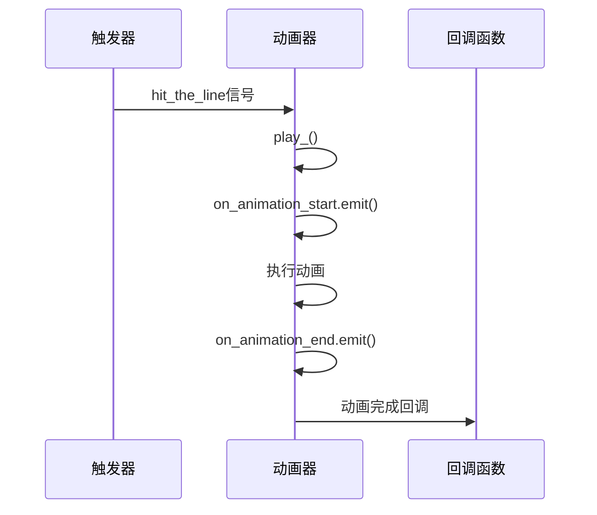
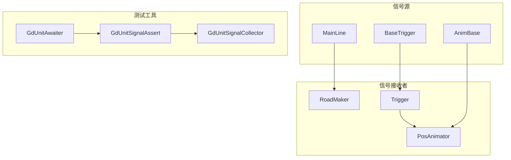

# 信号与事件API

<cite>
**本文档引用的文件**
- [MainLine.gd](file://#Template/[Scripts]/MainLine.gd)
- [RoadMaker.gd](file://#Template/[Scripts]/RoadMaker.gd)
- [AnimBase.gd](file://#Template/[Scripts]/AnimBase.gd)
- [BaseTrigger.gd](file://#Template/[Scripts]/Trigger/BaseTrigger.gd)
- [Trigger.gd](file://#Template/[Scripts]/Trigger/Trigger.gd)
- [PosAnimator.gd](file://#Template/[Scripts]/Trigger/PosAnimator.gd)
- [GdUnitSignalAssert.gd](file://addons/gdUnit4/src/GdUnitSignalAssert.gd)
- [GdUnitSignalCollector.gd](file://addons/gdUnit4/src/core/GdUnitSignalCollector.gd)
- [GdUnitAwaiter.gd](file://addons/gdUnit4/src/GdUnitAwaiter.gd)
- [GdUnitSceneRunner.gd](file://addons/gdUnit4/src/GdUnitSceneRunner.gd)
</cite>

## 目录
1. [简介](#简介)
2. [项目结构](#项目结构)
3. [核心组件](#核心组件)
4. [架构概览](#架构概览)
5. [详细组件分析](#详细组件分析)
6. [依赖关系分析](#依赖关系分析)
7. [性能考虑](#性能考虑)
8. [故障排除指南](#故障排除指南)
9. [结论](#结论)
10. [附录](#附录)

## 简介

Godot Line项目中的信号与事件系统是整个游戏架构的核心通信机制。该系统通过Godot内置的信号系统实现了松耦合的组件间通信，支持游戏逻辑中的各种交互场景，从玩家控制到环境触发器，再到动画播放。

本API文档详细记录了项目中所有自定义信号接口，包括new_line1、on_sky、onturn等核心信号的触发条件和参数格式，提供了完整的信号连接、断开和发射方法的API规范，并深入解析了事件系统的实现机制和异步处理接口。

## 项目结构

项目采用模块化设计，信号系统主要分布在以下模块中：

**图表来源**
- [MainLine.gd:1-224](file://#Template/[Scripts]/MainLine.gd#L1-L224)
- [BaseTrigger.gd:1-102](file://#Template/[Scripts]/Trigger/BaseTrigger.gd#L1-L102)
- [GdUnitSignalAssert.gd:30-112](file://addons/gdUnit4/src/GdUnitSignalAssert.gd#L30-L112)

**章节来源**
- [MainLine.gd:1-224](file://#Template/[Scripts]/MainLine.gd#L1-L224)
- [RoadMaker.gd:1-46](file://#Template/[Scripts]/RoadMaker.gd#L1-L46)
- [BaseTrigger.gd:1-102](file://#Template/[Scripts]/Trigger/BaseTrigger.gd#L1-L102)

## 核心组件

### 主线路信号系统

主线路组件是信号系统的核心，负责产生游戏中的关键事件信号：

| 信号名称 | 参数类型 | 触发条件 | 描述 |
|---------|---------|---------|------|
| new_line1 | 无 | 每当生成新线条段时 | 标识新的线条段创建完成 |
| on_sky | 无 | 当角色离开地面时 | 标识角色进入空中状态 |
| onturn | 无 | 当角色执行转向动作时 | 标识角色完成转向操作 |

### 触发器信号系统

触发器模块提供了灵活的触发机制，支持多种触发条件和过滤器：

| 信号名称 | 参数类型 | 触发条件 | 描述 |
|---------|---------|---------|------|
| triggered | body: Node3D | 当符合条件的物体进入触发区域时 | 标识触发器被激活，传递触发对象 |
| hit_the_line | 无 | 当触发器检测到线条碰撞时 | 通用触发信号，供其他组件监听 |

### 动画信号系统

动画组件提供了标准的动画生命周期信号：

| 信号名称 | 参数类型 | 触发条件 | 描述 |
|---------|---------|---------|------|
| on_animation_start | 无 | 动画开始播放时 | 标识动画播放开始 |
| on_animation_end | 无 | 动画播放结束时 | 标识动画播放完成 |

**章节来源**
- [MainLine.gd:3-6](file://#Template/[Scripts]/MainLine.gd#L3-L6)
- [BaseTrigger.gd:8-9](file://#Template/[Scripts]/Trigger/BaseTrigger.gd#L8-L9)
- [Trigger.gd:6](file://#Template/[Scripts]/Trigger/Trigger.gd#L6)
- [AnimBase.gd:18-19](file://#Template/[Scripts]/AnimBase.gd#L18-L19)

## 架构概览

信号系统采用发布-订阅模式，实现了组件间的松耦合通信：

**图表来源**
- [MainLine.gd:139-161](file://#Template/[Scripts]/MainLine.gd#L139-L161)
- [RoadMaker.gd:22-27](file://#Template/[Scripts]/RoadMaker.gd#L22-L27)
- [BaseTrigger.gd:54-69](file://#Template/[Scripts]/Trigger/BaseTrigger.gd#L54-L69)
- [Trigger.gd:8-9](file://#Template/[Scripts]/Trigger/Trigger.gd#L8-L9)
- [PosAnimator.gd:32-37](file://#Template/[Scripts]/Trigger/PosAnimator.gd#L32-L37)

## 详细组件分析

### MainLine 信号组件

MainLine是信号系统的核心组件，负责产生游戏中的关键事件：

**图表来源**
- [MainLine.gd:1-224](file://#Template/[Scripts]/MainLine.gd#L1-L224)
- [RoadMaker.gd:1-46](file://#Template/[Scripts]/RoadMaker.gd#L1-L46)

#### 信号触发机制

MainLine的信号触发遵循严格的时机控制：

1. **new_line1信号**：在生成新线条段时触发，确保道路生成器能够及时响应
2. **on_sky信号**：当角色离开地面时触发，通知相关组件进行状态切换
3. **onturn信号**：在角色完成转向动作时触发，同步其他组件的状态

#### 信号连接API

**图表来源**
- [MainLine.gd:14-17](file://#Template/[Scripts]/MainLine.gd#L14-L17)
- [RoadMaker.gd:14-17](file://#Template/[Scripts]/RoadMaker.gd#L14-L17)

**章节来源**
- [MainLine.gd:139-184](file://#Template/[Scripts]/MainLine.gd#L139-L184)
- [RoadMaker.gd:12-27](file://#Template/[Scripts]/RoadMaker.gd#L12-L27)

### 触发器系统

触发器系统提供了灵活的事件检测机制：

**图表来源**
- [BaseTrigger.gd:1-102](file://#Template/[Scripts]/Trigger/BaseTrigger.gd#L1-L102)
- [Trigger.gd:1-10](file://#Template/[Scripts]/Trigger/Trigger.gd#L1-L10)
- [PosAnimator.gd:1-44](file://#Template/[Scripts]/Trigger/PosAnimator.gd#L1-L44)

#### 触发器连接流程

触发器的连接过程包含多重安全检查：

1. **信号存在性检查**：确保目标对象支持信号功能
2. **连接状态验证**：避免重复连接同一信号
3. **回调函数绑定**：将触发逻辑与具体处理函数关联
4. **状态标记更新**：维护连接状态的一致性

**章节来源**
- [BaseTrigger.gd:47-51](file://#Template/[Scripts]/Trigger/BaseTrigger.gd#L47-L51)
- [Trigger.gd:8-9](file://#Template/[Scripts]/Trigger/Trigger.gd#L8-L9)

### 动画信号系统

动画组件提供了标准化的动画生命周期管理：

**图表来源**
- [AnimBase.gd:55-71](file://#Template/[Scripts]/AnimBase.gd#L55-L71)
- [PosAnimator.gd:32-37](file://#Template/[Scripts]/Trigger/PosAnimator.gd#L32-L37)

**章节来源**
- [AnimBase.gd:55-71](file://#Template/[Scripts]/AnimBase.gd#L55-L71)
- [PosAnimator.gd:32-37](file://#Template/[Scripts]/Trigger/PosAnimator.gd#L32-L37)

## 依赖关系分析

信号系统各组件之间的依赖关系呈现树状结构：

**图表来源**
- [MainLine.gd:1-224](file://#Template/[Scripts]/MainLine.gd#L1-L224)
- [RoadMaker.gd:1-46](file://#Template/[Scripts]/RoadMaker.gd#L1-L46)
- [BaseTrigger.gd:1-102](file://#Template/[Scripts]/Trigger/BaseTrigger.gd#L1-L102)

**章节来源**
- [GdUnitSignalAssert.gd:30-112](file://addons/gdUnit4/src/GdUnitSignalAssert.gd#L30-L112)
- [GdUnitSignalCollector.gd:1-129](file://addons/gdUnit4/src/core/GdUnitSignalCollector.gd#L1-L129)

## 性能考虑

信号系统的性能优化策略：

### 信号连接优化
- **延迟连接**：使用`call_deferred`避免在信号处理过程中造成递归
- **连接去重**：检查连接状态避免重复连接
- **批量处理**：在`_ready`阶段集中建立信号连接

### 内存管理
- **自动清理**：利用Godot的信号连接生命周期管理
- **弱引用**：避免循环引用导致的内存泄漏
- **资源释放**：在对象销毁时自动断开所有信号连接

### 异步处理
- **帧间隔等待**：使用`yield`或`await`实现非阻塞等待
- **超时机制**：防止无限期等待信号
- **错误恢复**：提供超时和错误处理机制

## 故障排除指南

### 常见信号问题

| 问题类型 | 症状 | 解决方案 |
|---------|------|----------|
| 信号未触发 | 监听器没有收到信号 | 检查信号发射点的调用时机 |
| 信号重复触发 | 同一信号被多次监听 | 使用`one_shot`模式或手动断开连接 |
| 连接失败 | 无法建立信号连接 | 验证对象是否支持信号功能 |
| 内存泄漏 | 对象无法正常销毁 | 检查是否有未断开的信号连接 |

### 调试技巧

1. **启用调试模式**：在触发器中设置`debug_mode=true`查看触发日志
2. **信号监听**：使用`GdUnitSignalAssert`进行信号验证
3. **连接状态检查**：使用`is_connected`方法验证连接状态
4. **错误捕获**：监控信号连接返回的错误代码

**章节来源**
- [BaseTrigger.gd:54-72](file://#Template/[Scripts]/Trigger/BaseTrigger.gd#L54-L72)
- [GdUnitSignalAssert.gd:30-112](file://addons/gdUnit4/src/GdUnitSignalAssert.gd#L30-L112)

## 结论

Godot Line项目的信号与事件系统展现了良好的架构设计，通过合理的信号分层和模块化组织，实现了高内聚、低耦合的组件通信机制。系统支持丰富的信号类型和灵活的触发条件，为游戏逻辑的实现提供了强大的基础设施。

测试模块的集成确保了信号系统的可靠性和可维护性，而异步处理机制则保证了系统的响应性能。整体而言，该信号系统为Godot游戏开发提供了优秀的参考范例。

## 附录

### API参考表

#### 信号定义规范
- **信号声明**：使用`signal`关键字定义
- **参数类型**：支持Godot内置类型和自定义类型
- **命名约定**：使用动词短语描述事件状态

#### 连接方法
- **connect**：建立信号连接
- **disconnect**：断开信号连接  
- **is_connected**：检查连接状态
- **call_deferred**：延迟执行连接操作

#### 异步处理
- **await**：等待信号发射
- **timeout**：设置超时时间
- **wait_until**：等待特定条件满足

### 最佳实践

1. **信号命名**：使用清晰的动词短语描述事件
2. **参数设计**：最小化信号参数数量，提高可读性
3. **连接管理**：及时断开不再使用的信号连接
4. **错误处理**：为信号连接提供适当的错误处理
5. **性能优化**：避免在信号处理中执行耗时操作