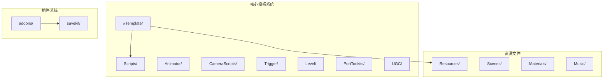
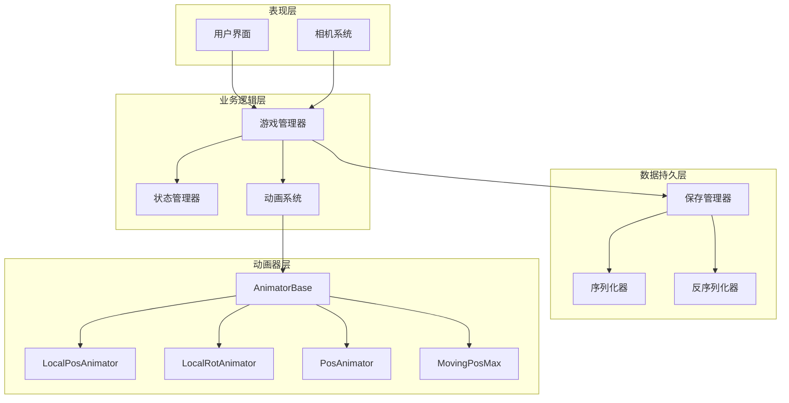
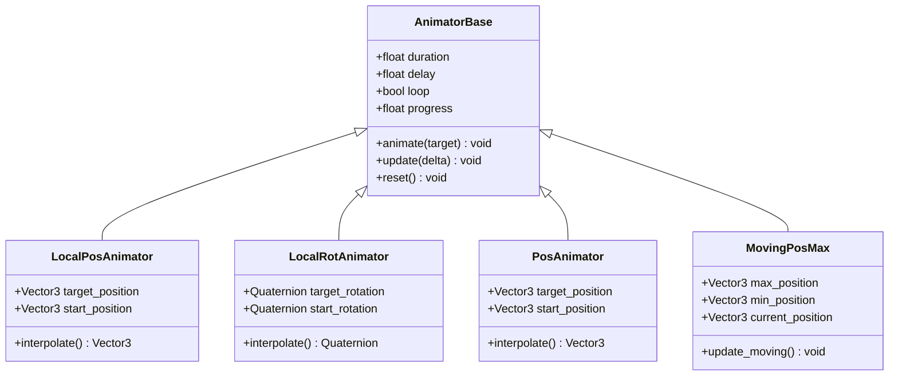
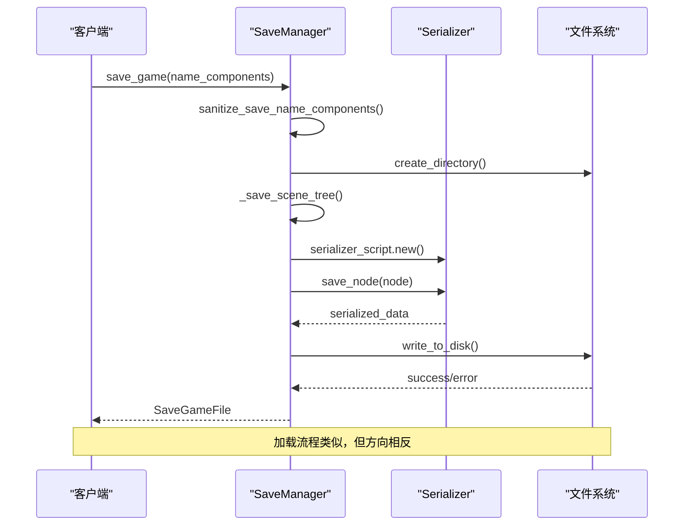
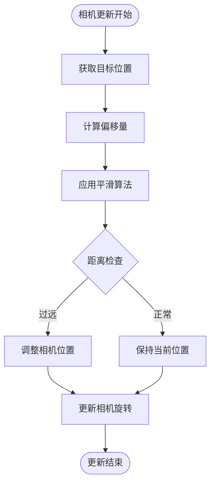
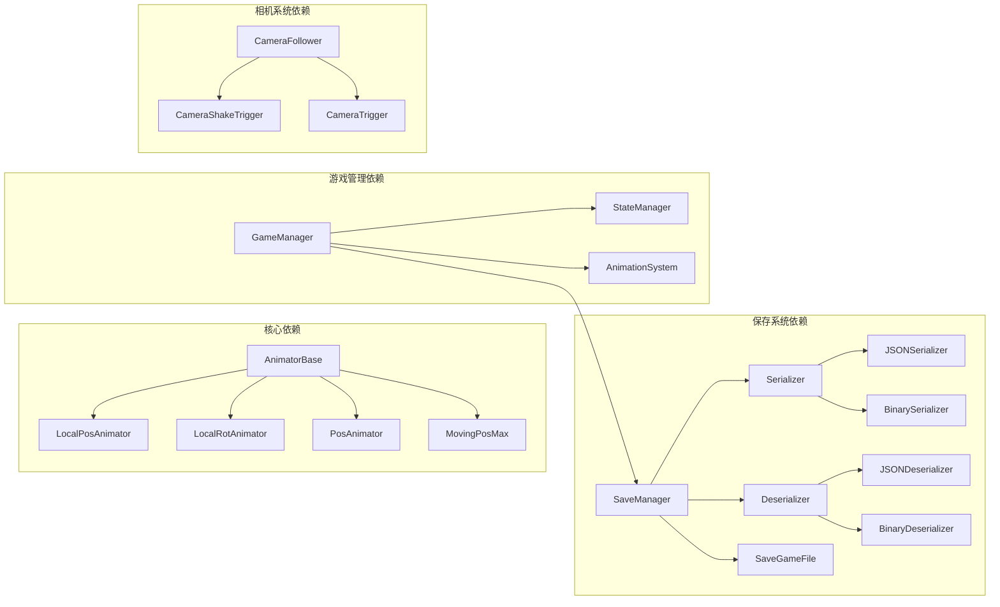

# 动画基础系统

<cite>
**本文档引用的文件**
- [README.md](file://README.md)
- [plugin.gd](file://addons/savekit/plugin.gd)
- [save_manager.gd](file://addons/savekit/save_manager.gd)
- [serializer.gd](file://addons/savekit/serializer.gd)
- [deserializer.gd](file://addons/savekit/deserializer.gd)
- [json_serializer.gd](file://addons/savekit/json_serializer.gd)
- [json_deserializer.gd](file://addons/savekit/json_deserializer.gd)
- [binary_serializer.gd](file://addons/savekit/binary_serializer.gd)
- [binary_deserializer.gd](file://addons/savekit/binary_deserializer.gd)
- [AnimatorBase.gd](file://#Template/[Scripts]/Animator/AnimatorBase.gd)
- [LocalPosAnimator.gd](file://#Template/[Scripts]/Animator/LocalPosAnimator.gd)
- [LocalRotAnimator.gd](file://#Template/[Scripts]/Animator/LocalRotAnimator.gd)
- [PosAnimator.gd](file://#Template/[Scripts]/Animator/PosAnimator.gd)
- [MovingPosMax.gd](file://#Template/[Scripts]/Animator/MovingPosMax.gd)
- [CameraFollower.gd](file://#Template/[Scripts]/CameraScripts/CameraFollower.gd)
- [CameraShakeTrigger.gd](file://#Template/[Scripts]/CameraScripts/CameraShakeTrigger.gd)
- [CameraTrigger.gd](file://#Template/[Scripts]/CameraScripts/CameraTrigger.gd)
- [GameManager.gd](file://#Template/[Scripts]/GameManager.gd)
- [State.gd](file://#Template/[Scripts]/State.gd)
</cite>

## 目录
1. [简介](#简介)
2. [项目结构](#项目结构)
3. [核心组件](#核心组件)
4. [架构概览](#架构概览)
5. [详细组件分析](#详细组件分析)
6. [依赖关系分析](#依赖关系分析)
7. [性能考虑](#性能考虑)
8. [故障排除指南](#故障排除指南)
9. [结论](#结论)

## 简介

动画基础系统是一个基于Godot Engine 4.6开发的Dancing Line游戏模板框架。该项目从ShinnLine项目中抽离出来，旨在降低用户的学习成本，提供一个完整的动画系统解决方案。

该系统的核心特点包括：
- Dancing Line核心玩法的完整实现
- 高兼容性，与冰焰模板3/4对齐
- 模块化设计，清晰的代码结构
- 内置保存/加载系统
- 多种动画器类型支持

## 项目结构

项目采用模块化的文件组织方式，主要分为以下几个部分：

**图表来源**
- [README.md:52-61](file://README.md#L52-L61)

**章节来源**
- [README.md:52-61](file://README.md#L52-L61)

## 核心组件

动画基础系统包含多个核心组件，每个组件都有特定的功能和职责：

### 动画器系统
- **AnimatorBase**: 所有动画器的基础类，提供统一的接口
- **LocalPosAnimator**: 局部位置动画器
- **LocalRotAnimator**: 局部旋转动画器  
- **PosAnimator**: 位置动画器
- **MovingPosMax**: 移动位置最大值动画器

### 相机系统
- **CameraFollower**: 相机跟随器
- **CameraShakeTrigger**: 相机震动触发器
- **CameraTrigger**: 相机触发器

### 游戏管理系统
- **GameManager**: 游戏管理器
- **State**: 状态管理器

### 保存系统
- **SaveManager**: 保存管理器
- **Serializer/Deserializer**: 序列化器/反序列化器

**章节来源**
- [AnimatorBase.gd](file://#Template/[Scripts]/Animator/AnimatorBase.gd)
- [LocalPosAnimator.gd](file://#Template/[Scripts]/Animator/LocalPosAnimator.gd)
- [LocalRotAnimator.gd](file://#Template/[Scripts]/Animator/LocalRotAnimator.gd)
- [CameraFollower.gd](file://#Template/[Scripts]/CameraScripts/CameraFollower.gd)
- [GameManager.gd](file://#Template/[Scripts]/GameManager.gd)
- [save_manager.gd](file://addons/savekit/save_manager.gd)

## 架构概览

系统采用分层架构设计，各组件之间通过明确的接口进行通信：

**图表来源**
- [GameManager.gd](file://#Template/[Scripts]/GameManager.gd)
- [save_manager.gd](file://addons/savekit/save_manager.gd)
- [AnimatorBase.gd](file://#Template/[Scripts]/Animator/AnimatorBase.gd)

## 详细组件分析

### 动画器系统架构

动画器系统采用继承模式设计，所有动画器都继承自AnimatorBase基类：

**图表来源**
- [AnimatorBase.gd](file://#Template/[Scripts]/Animator/AnimatorBase.gd)
- [LocalPosAnimator.gd](file://#Template/[Scripts]/Animator/LocalPosAnimator.gd)
- [LocalRotAnimator.gd](file://#Template/[Scripts]/Animator/LocalRotAnimator.gd)
- [PosAnimator.gd](file://#Template/[Scripts]/Animator/PosAnimator.gd)
- [MovingPosMax.gd](file://#Template/[Scripts]/Animator/MovingPosMax.gd)

### 保存系统工作流程

保存系统提供了完整的序列化和反序列化功能：

**图表来源**
- [save_manager.gd:114-144](file://addons/savekit/save_manager.gd#L114-L144)
- [save_manager.gd:182-200](file://addons/savekit/save_manager.gd#L182-L200)

### 相机跟随系统

相机跟随系统实现了平滑的相机跟随效果：

**图表来源**
- [CameraFollower.gd](file://#Template/[Scripts]/CameraScripts/CameraFollower.gd)

**章节来源**
- [save_manager.gd:71-93](file://addons/savekit/save_manager.gd#L71-L93)
- [save_manager.gd:159-177](file://addons/savekit/save_manager.gd#L159-L177)

## 依赖关系分析

系统中的组件依赖关系如下：

**图表来源**
- [save_manager.gd:67-69](file://addons/savekit/save_manager.gd#L67-L69)
- [plugin.gd:4-8](file://addons/savekit/plugin.gd#L4-L8)

**章节来源**
- [plugin.gd:1-20](file://addons/savekit/plugin.gd#L1-L20)
- [save_manager.gd:1-294](file://addons/savekit/save_manager.gd#L1-L294)

## 性能考虑

动画基础系统在设计时考虑了以下性能优化：

### 动画性能优化
- 使用局部坐标变换减少计算开销
- 支持动画循环避免重复创建对象
- 实现进度缓存机制减少重复计算

### 内存管理
- 及时释放不再使用的动画器实例
- 使用对象池模式管理动画器生命周期
- 避免内存泄漏的资源清理机制

### 序列化性能
- 支持二进制和JSON两种序列化格式
- 内存序列化适合临时存储
- 文件序列化适合长期保存

## 故障排除指南

### 常见问题及解决方案

**保存系统问题**
- 确保存储目录具有写入权限
- 检查文件名是否符合系统要求
- 验证序列化器配置正确性

**动画系统问题**
- 确保动画器正确继承自AnimatorBase
- 检查动画参数设置是否合理
- 验证目标节点是否存在

**相机系统问题**
- 确保相机跟随目标存在
- 检查相机限制设置
- 验证平滑参数配置

**章节来源**
- [save_manager.gd:115-138](file://addons/savekit/save_manager.gd#L115-L138)
- [save_manager.gd:204-214](file://addons/savekit/save_manager.gd#L204-L214)

## 结论

动画基础系统提供了一个完整、模块化的动画解决方案，具有以下优势：

1. **高度模块化**: 组件间耦合度低，易于扩展和维护
2. **性能优化**: 采用多种优化策略确保流畅运行
3. **易用性强**: 提供简单直观的API接口
4. **兼容性好**: 支持多种序列化格式和平台

该系统为Dancing Line游戏开发提供了坚实的基础，开发者可以在此基础上快速构建各种动画效果和交互体验。