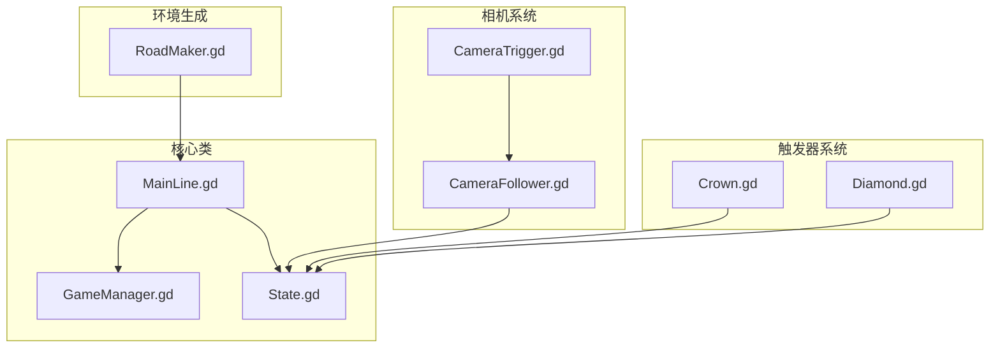
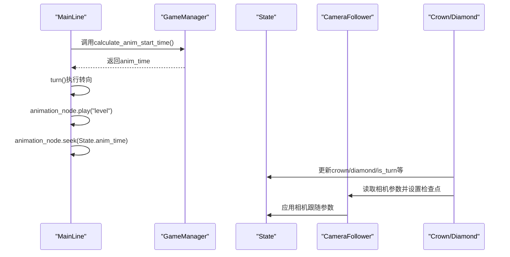
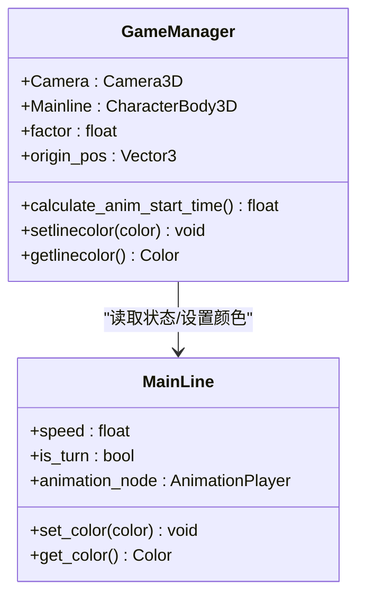
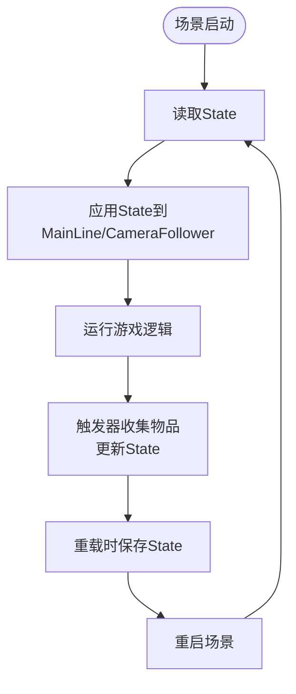
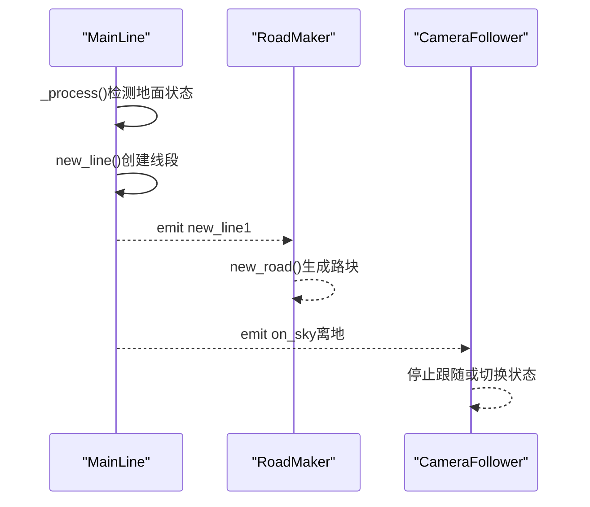
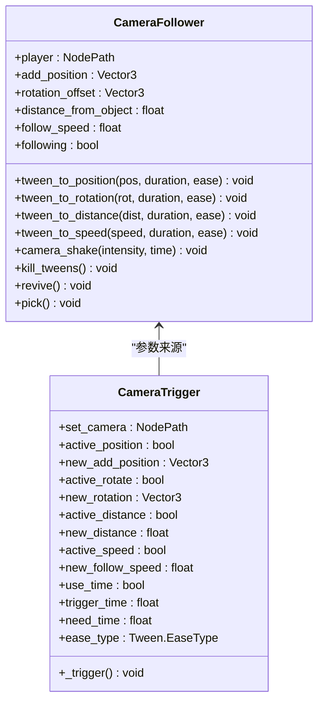
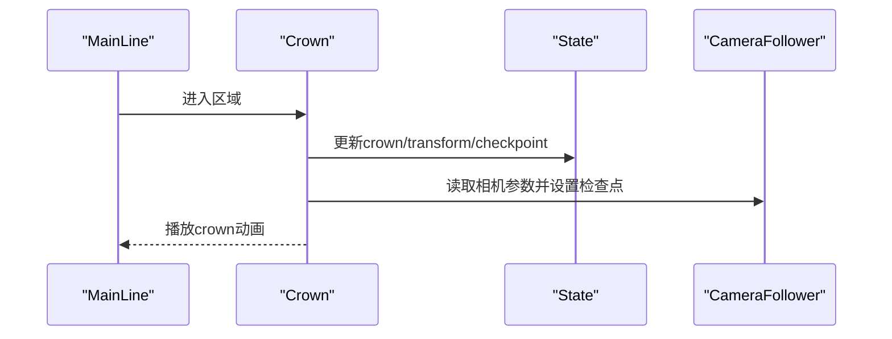
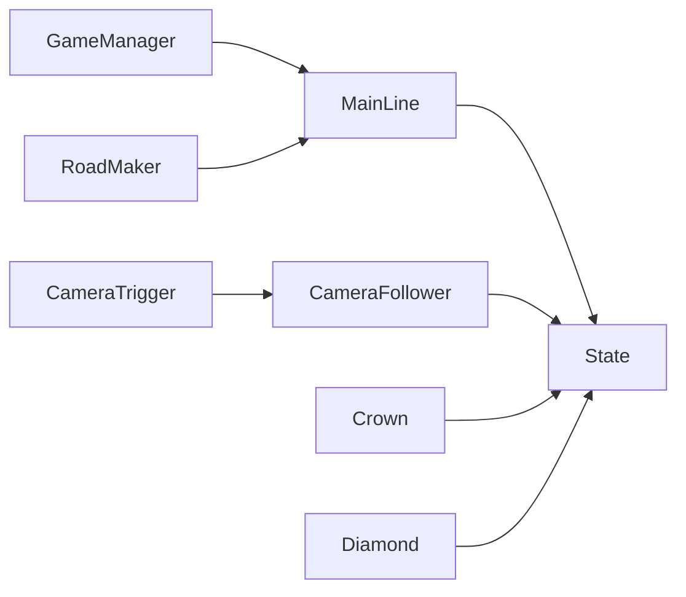

# 核心类API

<cite>
**本文档引用的文件**
- [GameManager.gd](file://#Template/[Scripts]/GameManager.gd)
- [State.gd](file://#Template/[Scripts]/State.gd)
- [MainLine.gd](file://#Template/[Scripts]/MainLine.gd)
- [CameraFollower.gd](file://#Template/[Scripts]/CameraScripts/CameraFollower.gd)
- [CameraTrigger.gd](file://#Template/[Scripts]/CameraScripts/CameraTrigger.gd)
- [Crown.gd](file://#Template/[Scripts]/Trigger/Crown.gd)
- [Diamond.gd](file://#Template/[Scripts]/Trigger/Diamond.gd)
- [RoadMaker.gd](file://#Template/[Scripts]/RoadMaker.gd)
- [MainLine_test.gd](file://Tests/MainLine_test.gd)
</cite>

## 更新摘要
**变更内容**
- 更新MainLine类的API规范，反映最新的优化改进
- 新增音乐同步播放功能的详细说明
- 完善状态管理系统的数据持久化机制
- 增强相机跟随系统的检查点恢复功能

## 目录
1. [简介](#简介)
2. [项目结构](#项目结构)
3. [核心组件](#核心组件)
4. [架构总览](#架构总览)
5. [详细组件分析](#详细组件分析)
6. [依赖关系分析](#依赖关系分析)
7. [性能考量](#性能考量)
8. [故障排查指南](#故障排查指南)
9. [结论](#结论)

## 简介
本文件聚焦于游戏核心类的完整API规范，包括：
- GameManager：动画时间计算、相机控制接口、颜色管理功能
- State：状态管理API、数据持久化方法、全局状态访问接口
- MainLine：角色控制类的物理移动接口、路径生成方法、信号系统

文档提供每个方法的参数说明、返回值类型、使用示例与最佳实践，并附带类之间的调用关系图与集成指导。

## 项目结构
核心脚本位于模板目录下，围绕角色控制、状态管理、相机跟随与触发器系统构建。

**图表来源**
- [GameManager.gd:1-46](file://#Template/[Scripts]/GameManager.gd#L1-L46)
- [State.gd:1-190](file://#Template/[Scripts]/State.gd#L1-L190)
- [MainLine.gd:1-214](file://#Template/[Scripts]/MainLine.gd#L1-L214)
- [CameraFollower.gd:1-139](file://#Template/[Scripts]/CameraScripts/CameraFollower.gd#L1-L139)
- [CameraTrigger.gd:1-75](file://#Template/[Scripts]/CameraScripts/CameraTrigger.gd#L1-L75)
- [Crown.gd:1-22](file://#Template/[Scripts]/Trigger/Crown.gd#L1-L22)
- [Diamond.gd:1-17](file://#Template/[Scripts]/Trigger/Diamond.gd#L1-L17)
- [RoadMaker.gd:1-46](file://#Template/[Scripts]/RoadMaker.gd#L1-L46)

**章节来源**
- [GameManager.gd:1-46](file://#Template/[Scripts]/GameManager.gd#L1-L46)
- [State.gd:1-190](file://#Template/[Scripts]/State.gd#L1-L190)
- [MainLine.gd:1-214](file://#Template/[Scripts]/MainLine.gd#L1-L214)

## 核心组件

### GameManager API规范
- 类型：Node
- 类名：GameManager
- 作用：提供动画起始时间计算、颜色管理、相机控制接口入口

关键导出属性
- Camera: Camera3D
- Mainline: CharacterBody3D
- factor: float（缩放因子，默认1）

公共方法
- calculate_anim_start_time() -> float
  - 功能：根据起点与当前位置计算动画起始时间
  - 参数：无
  - 返回：float（秒）
  - 实现要点：忽略Y轴的距离差乘以factor，除以实际速度；若速度为0或空引用，返回0
  - 使用示例：在MainLine.turn()中用于seek动画起始位置
  - 最佳实践：确保Mainline与origin_pos已正确初始化

- setlinecolor(color)
  - 功能：设置主线条颜色
  - 参数：Color
  - 返回：void
  - 使用示例：GameManager.setlinecolor(Color.RED)

- getlinecolor() -> Color
  - 功能：获取当前主线条颜色
  - 参数：无
  - 返回：Color
  - 使用示例：let currentColor = GameManager.getlinecolor()

**章节来源**
- [GameManager.gd:1-46](file://#Template/[Scripts]/GameManager.gd#L1-L46)

### State API规范
- 类型：RefCounted（全局单例）
- 作用：集中管理全局状态，支持数据持久化与跨场景恢复

状态字段
- main_line_transform: 变换（用于重载时恢复主角色位置）
- is_turn: bool（角色转向状态）
- anim_time: float（动画当前时间）
- music_checkpoint_time: float（音乐检查点时间）
- is_end: bool（关卡结束标志）
- percent: int（进度百分比）
- line_crossing_crown: int（当前穿越的皇冠标签）
- crowns: Array[int]（各阶段皇冠计数数组）
- is_relive: bool（是否复活）
- diamond: int（钻石计数）
- crown: int（皇冠计数）

相机检查点数据
- camera_checkpoint: Dictionary（包含has_checkpoint、add_position、rotation_offset、distance、follow_speed、restore_pending）

数据持久化与恢复
- 重载时保存：MainLine.reload()会将当前状态写入State
- 场景重启后恢复：MainLine._ready()从State读取并应用
- SaveKit集成：支持序列化/反序列化所有状态属性

**章节来源**
- [State.gd:1-190](file://#Template/[Scripts]/State.gd#L1-L190)
- [MainLine.gd:110-115](file://#Template/[Scripts]/MainLine.gd#L110-L115)

### MainLine API规范
- 类型：CharacterBody3D
- 类名：MainLine
- 作用：角色控制、路径生成、物理移动、信号系统

导出属性
- speed: float（移动速度，默认12.0）
- rot: float（转向角度，默认-90）
- color: Color（材质颜色，通过set/get访问器）
- fly: bool（飞行模式）
- noclip: bool（穿透墙体）
- animation: NodePath（动画节点）
- is_turn: bool（转向状态）

内部状态
- level_manager: 关卡管理器引用
- timeout: float（动画播放延迟，默认0.1）
- is_live: bool（存活状态）
- line: MeshInstance3D（当前线段）
- floor_segment_lines: Array[MeshInstance3D]（地面线段列表）
- v: Vector3（速度向量）
- is_start: bool（开始状态）
- tailScale: float（尾部缩放）

信号
- new_line1：生成新线段时发出
- on_sky：离地时发出
- onturn：转向完成时发出

公共方法
- reload() -> void
  - 功能：重载当前场景并保存状态
  - 返回：void
  - 使用示例：在死亡或重置时调用

- new_line() -> void
  - 功能：创建新的线段并加入场景树
  - 返回：void
  - 使用示例：在移动过程中自动调用

- turn() -> void
  - 功能：执行转向动作，播放动画并更新方向
  - 返回：void
  - 使用示例：响应输入事件触发
  - 实现要点：当line_crossing_crown为0时计算动画起始时间，支持音乐同步播放

- set_color(value: Color) -> void
  - 功能：设置材质颜色
  - 参数：Color
  - 返回：void

- get_color() -> Color
  - 功能：获取当前颜色
  - 返回：Color

- set_timeout(delay: float) -> void
  - 功能：设置动画播放延迟
  - 参数：float
  - 返回：void

- die() -> void
  - 功能：角色死亡，播放粒子效果并移除
  - 返回：void

- _get_or_create_player_tail_holder() -> Node3D
  - 功能：获取或创建"PlayerTailHolder"节点
  - 返回：Node3D

- _on_Area_body_entered(_body: Node) -> void
  - 功能：进入区域触发死亡
  - 返回：void

- _on_button_pressed() -> void
  - 功能：保存道路场景
  - 返回：void

**章节来源**
- [MainLine.gd:1-214](file://#Template/[Scripts]/MainLine.gd#L1-L214)

## 架构总览
GameManager作为外部控制器，通过MainLine暴露的接口进行动画时间计算与颜色管理；MainLine负责物理移动与路径生成，并通过信号与其他系统解耦；State作为全局状态中心，贯穿重载与恢复；相机系统通过CameraFollower与CameraTrigger实现动态跟随与过渡；触发器系统（Crown、Diamond）更新State并触发视觉反馈。

**图表来源**
- [GameManager.gd:29-45](file://#Template/[Scripts]/GameManager.gd#L29-L45)
- [MainLine.gd:149-171](file://#Template/[Scripts]/MainLine.gd#L149-L171)
- [Crown.gd:16-21](file://#Template/[Scripts]/Trigger/Crown.gd#L16-L21)
- [CameraFollower.gd:57-73](file://#Template/[Scripts]/CameraScripts/CameraFollower.gd#L57-L73)

## 详细组件分析

### GameManager类分析
- 职责边界：提供与MainLine交互的外部接口，不直接参与物理与渲染
- 复杂度：O(1)，主要为数学计算与属性访问
- 错误处理：对空引用进行保护，速度为0时返回0

**图表来源**
- [GameManager.gd:1-46](file://#Template/[Scripts]/GameManager.gd#L1-L46)
- [MainLine.gd:8-21](file://#Template/[Scripts]/MainLine.gd#L8-L21)

**章节来源**
- [GameManager.gd:1-46](file://#Template/[Scripts]/GameManager.gd#L1-L46)

### State类分析
- 全局状态：集中存储与恢复角色变换、相机跟随参数、游戏进度与收集品数量
- 数据持久化：通过MainLine.reload()写入，场景重启后读取
- 并发注意：多处系统共享同一State实例，需避免竞态
- SaveKit集成：支持完整的序列化/反序列化机制

**图表来源**
- [State.gd:72-85](file://#Template/[Scripts]/State.gd#L72-L85)
- [MainLine.gd:42-51](file://#Template/[Scripts]/MainLine.gd#L42-L51)
- [Crown.gd:16-21](file://#Template/[Scripts]/Trigger/Crown.gd#L16-L21)

**章节来源**
- [State.gd:1-190](file://#Template/[Scripts]/State.gd#L1-L190)

### MainLine类分析
- 物理移动：基于CharacterBody3D，支持重力、墙面碰撞、飞行模式
- 路径生成：每步移动生成线段，地面阶段同步线段高度
- 信号系统：new_line1/on_sky/onturn解耦渲染与逻辑
- 集成点：与GameManager协作计算动画时间，与State协作持久化
- 音乐同步：支持音频播放器与动画同步播放

**图表来源**
- [MainLine.gd:128-142](file://#Template/[Scripts]/MainLine.gd#L128-L142)
- [RoadMaker.gd:22-27](file://#Template/[Scripts]/RoadMaker.gd#L22-L27)
- [CameraFollower.gd:40-56](file://#Template/[Scripts]/CameraScripts/CameraFollower.gd#L40-L56)

**章节来源**
- [MainLine.gd:1-214](file://#Template/[Scripts]/MainLine.gd#L1-L214)
- [RoadMaker.gd:1-46](file://#Template/[Scripts]/RoadMaker.gd#L1-L46)

### 相机控制接口分析
- CameraFollower：实现平滑跟随、参数化过渡、震动效果
- CameraTrigger：基于时间或事件触发相机参数切换
- 与State集成：通过检查点机制恢复相机状态

**图表来源**
- [CameraFollower.gd:1-139](file://#Template/[Scripts]/CameraScripts/CameraFollower.gd#L1-L139)
- [CameraTrigger.gd:1-75](file://#Template/[Scripts]/CameraScripts/CameraTrigger.gd#L1-L75)

**章节来源**
- [CameraFollower.gd:1-139](file://#Template/[Scripts]/CameraScripts/CameraFollower.gd#L1-L139)
- [CameraTrigger.gd:1-75](file://#Template/[Scripts]/CameraScripts/CameraTrigger.gd#L1-L75)

### 触发器系统分析
- Crown：收集时更新State.crown、记录相机参数检查点、更新转向状态与动画时间
- Diamond：收集时更新State.diamond并播放特效

**图表来源**
- [Crown.gd:16-21](file://#Template/[Scripts]/Trigger/Crown.gd#L16-L21)
- [State.gd:46-66](file://#Template/[Scripts]/State.gd#L46-L66)
- [CameraFollower.gd:57-73](file://#Template/[Scripts]/CameraScripts/CameraFollower.gd#L57-L73)

**章节来源**
- [Crown.gd:1-22](file://#Template/[Scripts]/Trigger/Crown.gd#L1-L22)
- [Diamond.gd:1-17](file://#Template/[Scripts]/Trigger/Diamond.gd#L1-L17)

## 依赖关系分析
- MainLine依赖State进行重载恢复与动画时间同步
- GameManager依赖MainLine进行动画时间计算与颜色管理
- CameraFollower依赖State进行检查点恢复
- CameraTrigger依赖CameraFollower进行参数过渡
- 触发器系统（Crown/Diamond）依赖State进行计数与检查点

**图表来源**
- [MainLine.gd:42-51](file://#Template/[Scripts]/MainLine.gd#L42-L51)
- [GameManager.gd:29-45](file://#Template/[Scripts]/GameManager.gd#L29-L45)
- [CameraFollower.gd:34-43](file://#Template/[Scripts]/CameraScripts/CameraFollower.gd#L34-L43)
- [CameraTrigger.gd:1-75](file://#Template/[Scripts]/CameraScripts/CameraTrigger.gd#L1-L75)
- [Crown.gd:16-21](file://#Template/[Scripts]/Trigger/Crown.gd#L16-L21)
- [Diamond.gd:1-17](file://#Template/[Scripts]/Trigger/Diamond.gd#L1-L17)
- [RoadMaker.gd:12-17](file://#Template/[Scripts]/RoadMaker.gd#L12-L17)

**章节来源**
- [MainLine.gd:1-214](file://#Template/[Scripts]/MainLine.gd#L1-L214)
- [GameManager.gd:1-46](file://#Template/[Scripts]/GameManager.gd#L1-L46)
- [CameraFollower.gd:1-139](file://#Template/[Scripts]/CameraScripts/CameraFollower.gd#L1-L139)
- [CameraTrigger.gd:1-75](file://#Template/[Scripts]/CameraScripts/CameraTrigger.gd#L1-L75)
- [Crown.gd:1-22](file://#Template/[Scripts]/Trigger/Crown.gd#L1-L22)
- [Diamond.gd:1-17](file://#Template/[Scripts]/Trigger/Diamond.gd#L1-L17)
- [RoadMaker.gd:1-46](file://#Template/[Scripts]/RoadMaker.gd#L1-L46)

## 性能考量
- 动画时间计算：O(1)，建议在turn()前调用，避免重复计算
- 线段生成：每帧可能创建MeshInstance3D，建议限制线段数量或合并渲染
- 相机跟随：使用slerp插值，follow_speed过大可能导致抖动
- 触发器：Area3D进入/退出事件频繁，建议减少不必要的信号连接
- 音频同步：音乐播放器与动画同步需要考虑音频延迟补偿

## 故障排查指南
- 动画时间异常为0
  - 检查Mainline.speed是否为0或Mainline为空
  - 确认origin_pos已设置且Mainline.global_position有效
- 相机跟随未生效
  - 检查State.camera_checkpoint.has_checkpoint是否为true
  - 确认CameraFollower.player_node指向正确
- 线段不显示
  - 检查PlayerTailHolder是否存在或被正确创建
  - 确认MainLine的mesh/material有效
- 重载后状态未恢复
  - 检查MainLine.reload()是否被调用
  - 确认State中的字段在load_checkpoint_to_main_line等处被读取
- 音频不同步
  - 检查AudioServer.get_time_since_last_mix()和AudioServer.get_output_latency()的使用
  - 确认State.music_checkpoint_time的正确设置

**章节来源**
- [MainLine_test.gd:141-177](file://Tests/MainLine_test.gd#L141-L177)

## 结论
GameManager、State、MainLine三者构成游戏核心控制链：MainLine负责物理与路径，State负责状态持久化，GameManager提供外部接口与颜色管理。相机系统与触发器系统通过State实现解耦集成。遵循本文档的API规范与最佳实践，可确保系统稳定、可维护且易于扩展。