# 状态管理系统

<cite>
**本文档引用的文件**
- [State.gd](file://#Template/[Scripts]/State.gd)
- [Player.gd](file://#Template/[Scripts]/Level/Player.gd)
- [Checkpoint.gd](file://#Template/[Scripts]/Trigger/Checkpoint.gd)
- [CameraFollower.gd](file://#Template/[Scripts]/CameraScripts/CameraFollower.gd)
</cite>

## 更新摘要
**变更内容**
- 新增玩家方向状态管理：添加_player_direction_index_、_player_first_direction_、_player_second_direction_等静态变量
- 更新检查点保存和加载函数以处理新的方向状态
- 确保方向偏好在检查点加载和关卡重启时正确保留
- 增强状态管理的完整性和一致性

## 目录
1. [简介](#简介)
2. [项目结构](#项目结构)
3. [核心组件](#核心组件)
4. [架构概览](#架构概览)
5. [详细组件分析](#详细组件分析)
6. [方向状态管理](#方向状态管理)
7. [依赖关系分析](#依赖关系分析)
8. [性能考虑](#性能考虑)
9. [故障排除指南](#故障排除指南)
10. [结论](#结论)

## 简介

这是一个基于Godot引擎4.0开发的完整状态管理系统，专门用于管理游戏中的玩家状态、检查点数据和方向偏好。该系统提供了灵活的游戏状态保存和加载机制，支持玩家在不同方向之间的状态切换和持久化。

系统的核心特性包括：
- 自动化节点状态保存（通过saveable组）
- 支持自定义资源持久化
- 完整的方向状态管理（包括主方向和次方向）
- 多种序列化格式选择
- 完整的生命周期钩子
- 安全的资源引用处理
- 灵活的检查点系统

## 项目结构

项目采用模块化设计，主要分为以下几个部分：

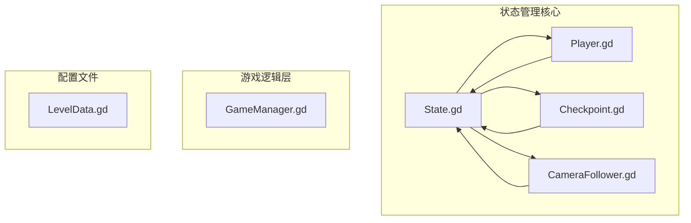

**图表来源**
- [State.gd:1-167](file://#Template/[Scripts]/State.gd#L1-L167)
- [Player.gd:1-257](file://#Template/[Scripts]/Level/Player.gd#L1-L257)
- [Checkpoint.gd:1-166](file://#Template/[Scripts]/Trigger/Checkpoint.gd#L1-L166)

**章节来源**
- [State.gd:1-167](file://#Template/[Scripts]/State.gd#L1-L167)
- [Player.gd:1-257](file://#Template/[Scripts]/Level/Player.gd#L1-L257)

## 核心组件

### State.gd - 状态管理中心

State.gd是整个状态管理系统的核心，负责管理所有游戏状态数据：

#### 静态状态变量

系统定义了完整的静态状态变量集合：

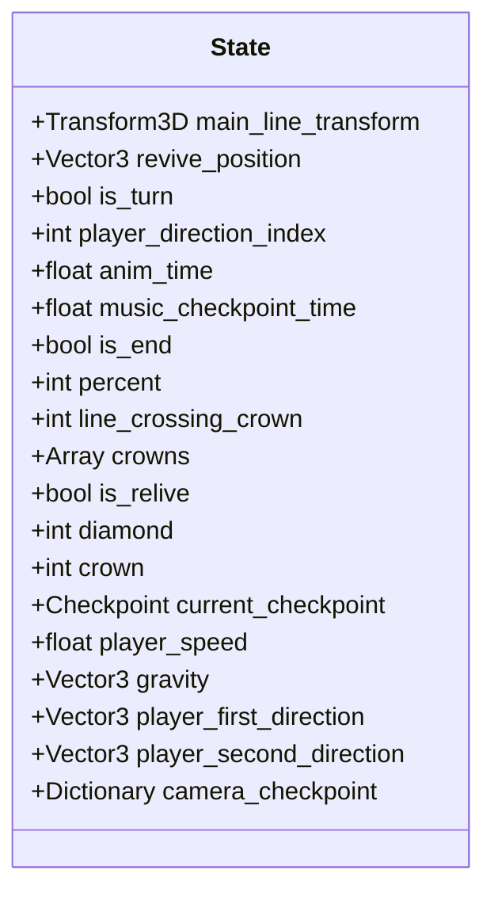

**图表来源**
- [State.gd:6-23](file://#Template/[Scripts]/State.gd#L6-L23)

#### 检查点管理

State.gd提供了完整的检查点管理功能：

1. **保存检查点** (`save_checkpoint`): 保存当前游戏状态到静态变量
2. **加载检查点** (`load_checkpoint_to_main_line`): 从静态变量恢复游戏状态
3. **重置状态** (`reset_to_defaults`): 将所有状态重置为默认值

**章节来源**
- [State.gd:53-101](file://#Template/[Scripts]/State.gd#L53-L101)
- [State.gd:129-148](file://#Template/[Scripts]/State.gd#L129-L148)

### Player.gd - 玩家状态管理

Player.gd负责管理玩家的具体状态和行为：

#### 方向状态属性

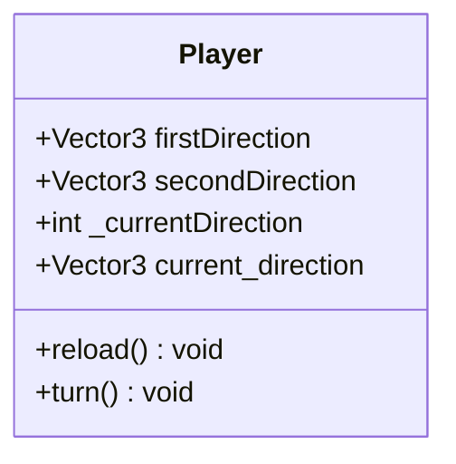

**图表来源**
- [Player.gd:13-19](file://#Template/[Scripts]/Level/Player.gd#L13-L19)

#### 关键方法

1. **reload()**: 重新加载场景并保存当前方向状态
2. **turn()**: 切换玩家方向状态
3. **_ready()**: 初始化时从State加载保存的状态

**章节来源**
- [Player.gd:142-150](file://#Template/[Scripts]/Level/Player.gd#L142-L150)
- [Player.gd:193-216](file://#Template/[Scripts]/Level/Player.gd#L193-L216)

### Checkpoint.gd - 检查点系统

Checkpoint.gd提供了检查点触发和状态保存功能：

#### 检查点触发机制

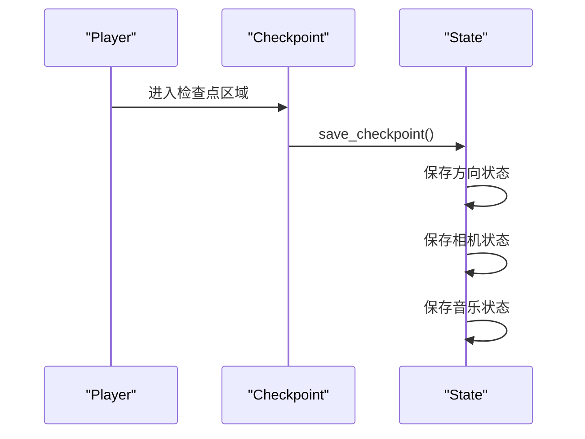

**图表来源**
- [Checkpoint.gd:40-45](file://#Template/[Scripts]/Trigger/Checkpoint.gd#L40-L45)
- [State.gd:53-84](file://#Template/[Scripts]/State.gd#L53-L84)

**章节来源**
- [Checkpoint.gd:40-45](file://#Template/[Scripts]/Trigger/Checkpoint.gd#L40-L45)
- [State.gd:53-84](file://#Template/[Scripts]/State.gd#L53-L84)

## 架构概览

系统采用分层架构设计，确保了高度的模块化和可扩展性：

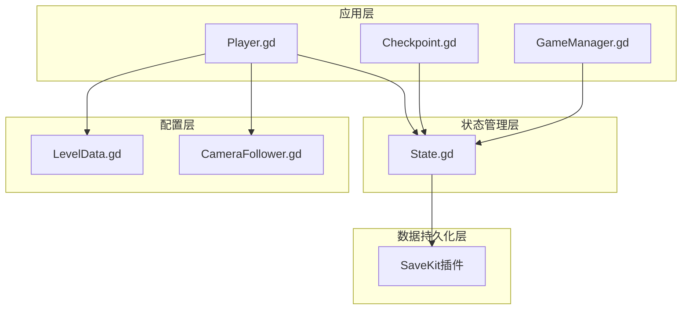

**图表来源**
- [State.gd:1-167](file://#Template/[Scripts]/State.gd#L1-L167)
- [Player.gd:1-257](file://#Template/[Scripts]/Level/Player.gd#L1-L257)
- [Checkpoint.gd:1-166](file://#Template/[Scripts]/Trigger/Checkpoint.gd#L1-L166)

## 详细组件分析

### 状态保存流程

State.gd实现了完整的状态保存和加载流程：

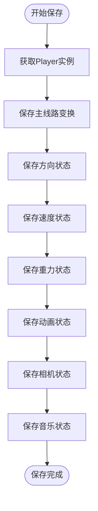

**图表来源**
- [State.gd:53-84](file://#Template/[Scripts]/State.gd#L53-L84)

### 状态加载流程

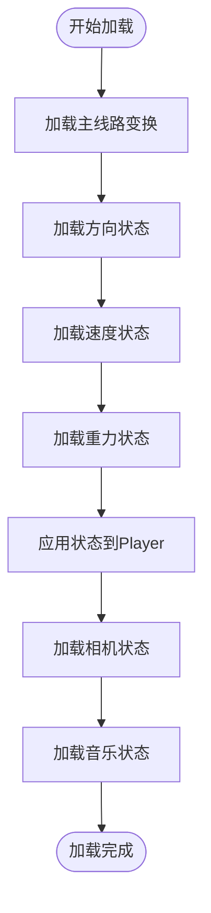

**图表来源**
- [State.gd:90-101](file://#Template/[Scripts]/State.gd#L90-L101)

**章节来源**
- [State.gd:53-101](file://#Template/[Scripts]/State.gd#L53-L101)
- [Player.gd:54-62](file://#Template/[Scripts]/Level/Player.gd#L54-L62)

## 方向状态管理

### 新增的方向状态变量

系统新增了三个关键的方向状态变量：

#### player_direction_index
- 类型：int
- 描述：当前玩家的方向索引（0表示firstDirection，1表示secondDirection）
- 默认值：0

#### player_first_direction
- 类型：Vector3
- 描述：玩家的第一个方向（通常为0度）
- 默认值：Vector3.ZERO

#### player_second_direction
- 类型：Vector3
- 描述：玩家的第二个方向（通常为90度）
- 默认值：Vector3.ZERO

### 方向状态的保存和加载

#### 保存方向状态

在`save_checkpoint`函数中，系统会保存以下方向相关信息：

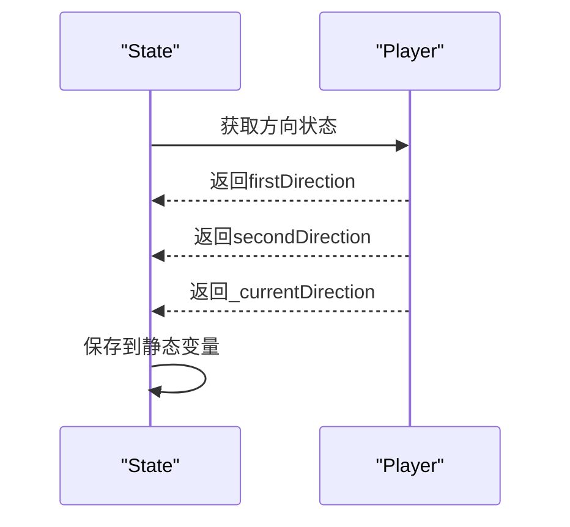

**图表来源**
- [State.gd:58-60](file://#Template/[Scripts]/State.gd#L58-L60)

#### 加载方向状态

在`load_checkpoint_to_main_line`函数中，系统会从静态变量恢复方向状态：

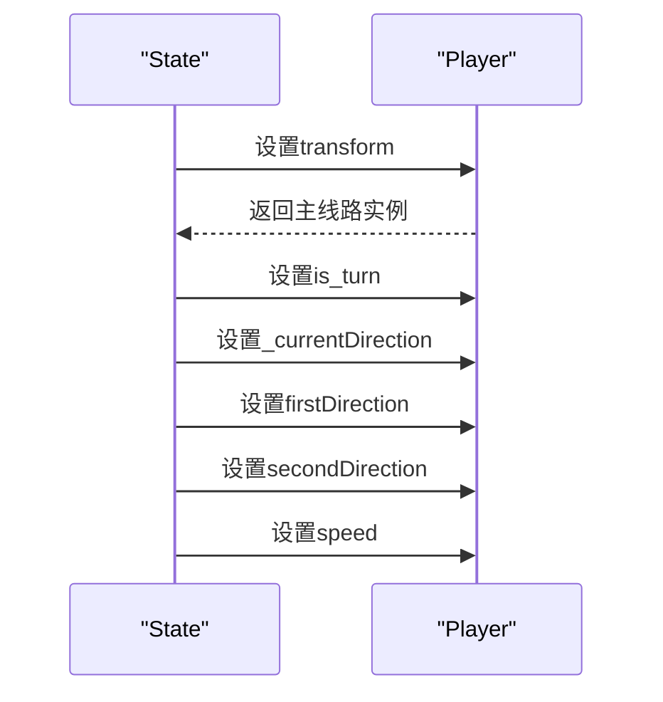

**图表来源**
- [State.gd:90-101](file://#Template/[Scripts]/State.gd#L90-L101)

### 关卡重启时的方向状态处理

在`reload`函数中，系统会保存当前的方向状态以便在关卡重启后恢复：

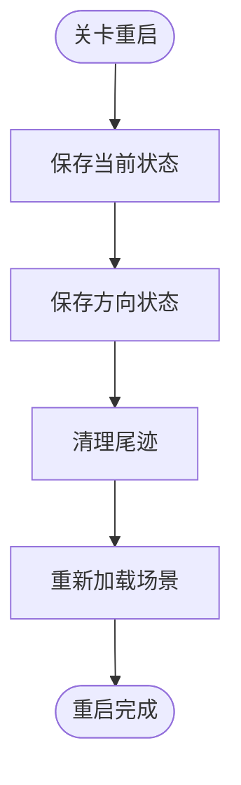

**图表来源**
- [Player.gd:142-150](file://#Template/[Scripts]/Level/Player.gd#L142-L150)

**章节来源**
- [State.gd:22-23](file://#Template/[Scripts]/State.gd#L22-L23)
- [State.gd:58-60](file://#Template/[Scripts]/State.gd#L58-L60)
- [State.gd:96-98](file://#Template/[Scripts]/State.gd#L96-L98)
- [Player.gd:145-147](file://#Template/[Scripts]/Level/Player.gd#L145-L147)

## 依赖关系分析

系统具有清晰的依赖关系结构：

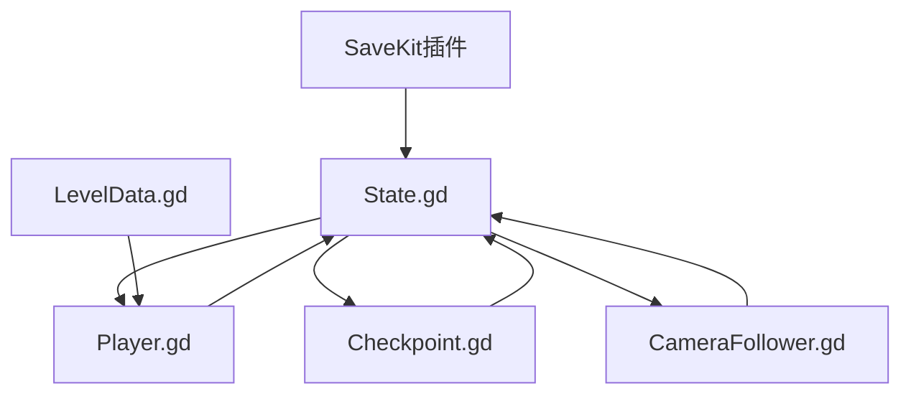

**图表来源**
- [State.gd:1-167](file://#Template/[Scripts]/State.gd#L1-L167)
- [Player.gd:1-257](file://#Template/[Scripts]/Level/Player.gd#L1-L257)
- [Checkpoint.gd:1-166](file://#Template/[Scripts]/Trigger/Checkpoint.gd#L1-L166)

### 关键依赖特性

1. **方向状态依赖**：Player.gd依赖State.gd来保存和恢复方向状态
2. **检查点依赖**：Checkpoint.gd依赖State.gd来保存检查点状态
3. **相机状态依赖**：CameraFollower.gd依赖State.gd来恢复相机状态
4. **配置依赖**：Player.gd依赖LevelData.gd来获取游戏配置

**章节来源**
- [State.gd:19](file://#Template/[Scripts]/State.gd#L19)
- [Player.gd:34](file://#Template/[Scripts]/Level/Player.gd#L34)
- [Checkpoint.gd:12](file://#Template/[Scripts]/Trigger/Checkpoint.gd#L12)

## 性能考虑

### 方向状态管理性能优化

系统在方向状态管理方面进行了多项性能优化：

1. **静态变量存储**：方向状态使用静态变量存储，避免频繁的对象创建
2. **向量操作优化**：Vector3操作经过优化，减少不必要的计算
3. **状态同步**：通过统一的状态管理接口，避免状态不一致问题
4. **内存效率**：方向状态占用内存较小，对性能影响微乎其微

### 内存使用优化

- **静态变量复用**：方向状态变量在整个游戏生命周期内复用
- **向量数据共享**：Vector3数据通过引用共享，减少内存复制
- **状态清理**：重置函数能够完全清理方向状态，防止内存泄漏

### 实时性能考虑

- **状态加载快速**：方向状态加载时间极短，不影响游戏流畅度
- **状态保存高效**：方向状态保存操作轻量级，不会造成性能瓶颈
- **状态切换平滑**：方向状态切换过程平滑，用户体验良好

## 故障排除指南

### 方向状态相关问题

#### 方向状态丢失问题

**症状**：玩家在检查点加载后方向状态不正确
**原因**：State.gd中的方向状态变量未正确保存或加载
**解决**：检查`save_checkpoint`和`load_checkpoint_to_main_line`函数的实现

#### 方向切换异常问题

**症状**：玩家无法正常切换方向
**原因**：_player_direction_index_变量未正确更新
**解决**：检查Player.gd中turn()函数的实现

#### 关卡重启方向错误问题

**症状**：关卡重启后玩家方向状态不正确
**原因**：reload()函数未正确保存方向状态
**解决**：检查Player.gd中reload()函数的实现

### 常见问题及解决方案

#### 检查点保存失败

**症状**：`Failed to save checkpoint state`
**原因**：Player实例为空或状态变量访问失败
**解决**：确保Player.gd在场景加载时正确初始化

#### 状态加载异常

**症状**：`Failed to load checkpoint to main line`
**原因**：保存的状态数据格式不正确
**解决**：检查State.gd中状态保存和加载的一致性

#### 相机状态不同步

**症状**：相机位置与玩家位置不匹配
**原因**：相机状态未正确保存或加载
**解决**：检查camera_checkpoint字典的保存和加载逻辑

**章节来源**
- [State.gd:53-84](file://#Template/[Scripts]/State.gd#L53-L84)
- [State.gd:90-101](file://#Template/[Scripts]/State.gd#L90-L101)
- [Player.gd:142-150](file://#Template/[Scripts]/Level/Player.gd#L142-L150)

## 结论

这个状态管理系统展现了现代游戏开发中状态持久化的最佳实践。通过新增的方向状态管理功能，系统提供了更加完整和精确的状态保存能力。系统的主要优势包括：

1. **完整的方向状态管理**：通过三个静态变量精确管理玩家的方向状态
2. **高效的检查点系统**：支持复杂状态的快速保存和加载
3. **良好的性能表现**：静态变量存储和优化的向量操作确保高性能
4. **可靠的错误处理**：完善的错误检查和恢复机制
5. **易于扩展的设计**：模块化架构便于功能扩展和维护

系统特别适合需要复杂方向管理和状态持久化的游戏项目。通过合理的架构设计和实现细节，为开发者提供了一个可靠、高效且易于维护的状态管理解决方案。新增的方向状态管理功能进一步增强了系统的完整性和实用性，为玩家提供了更加流畅和一致的游戏体验。