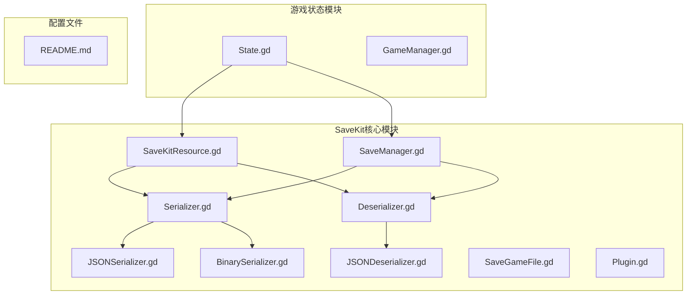
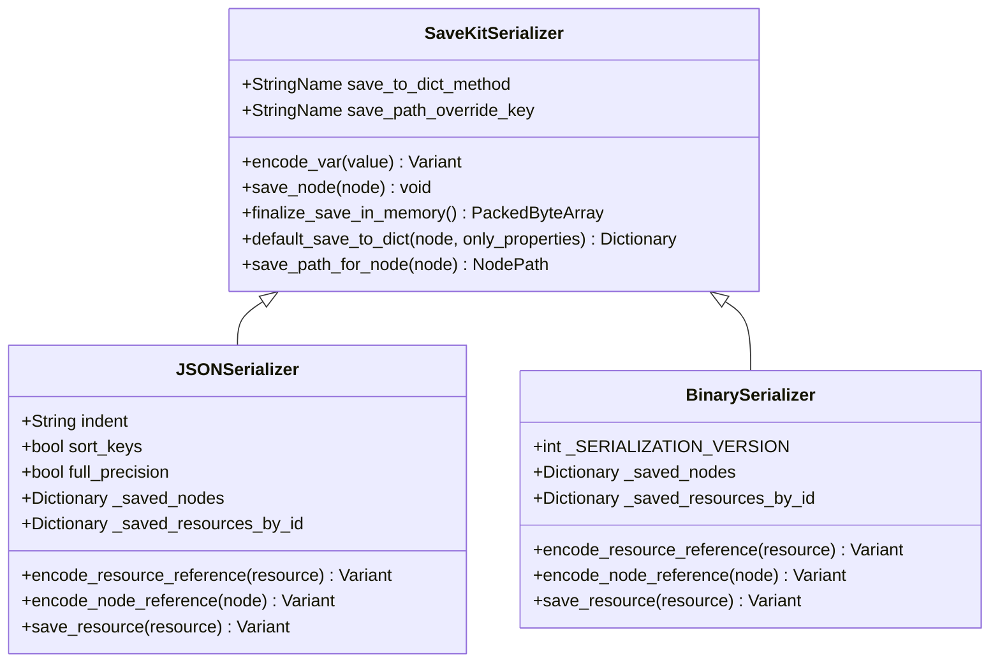
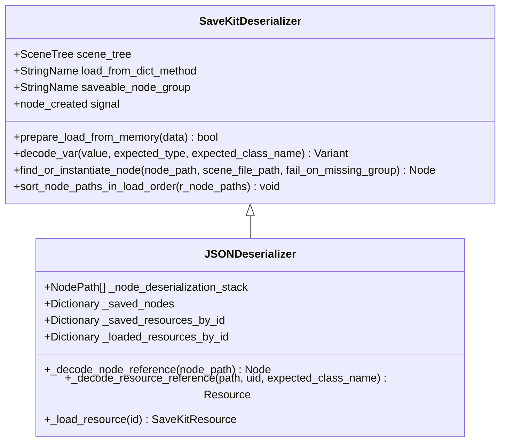
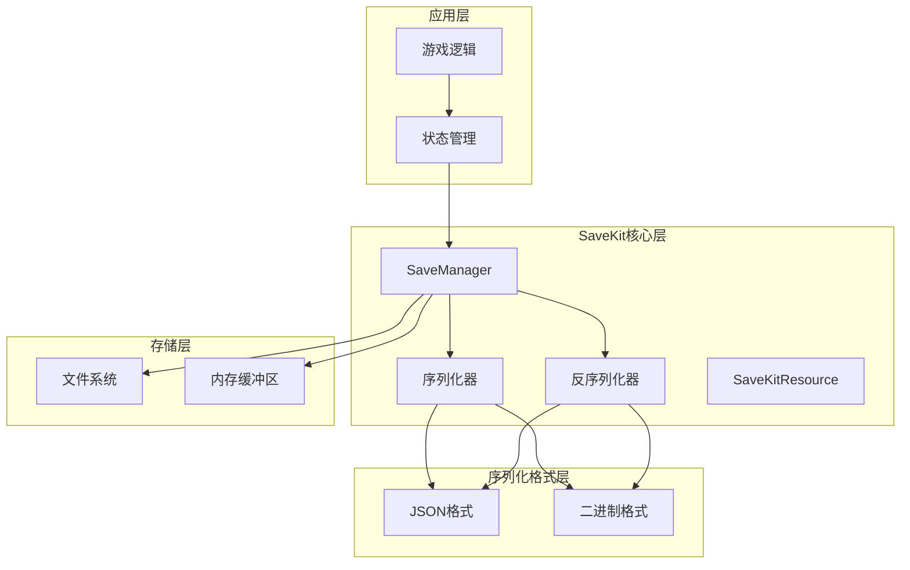
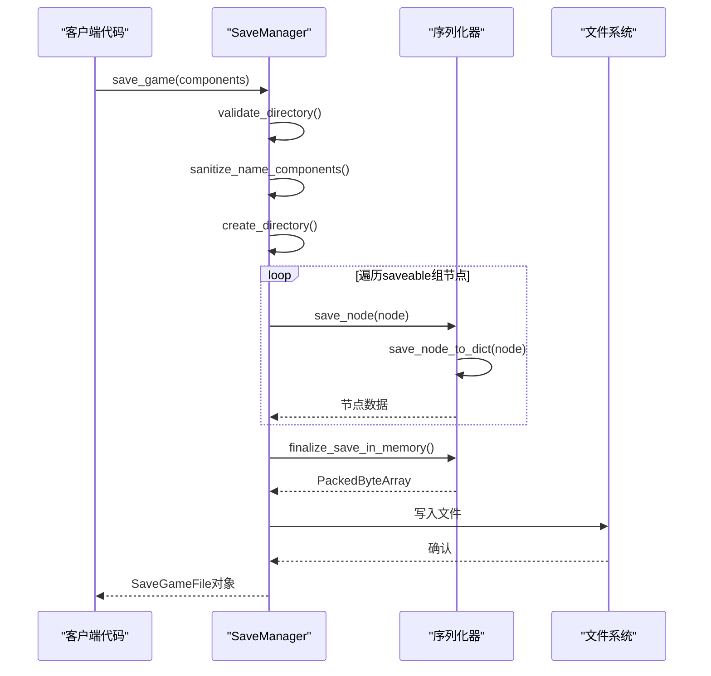
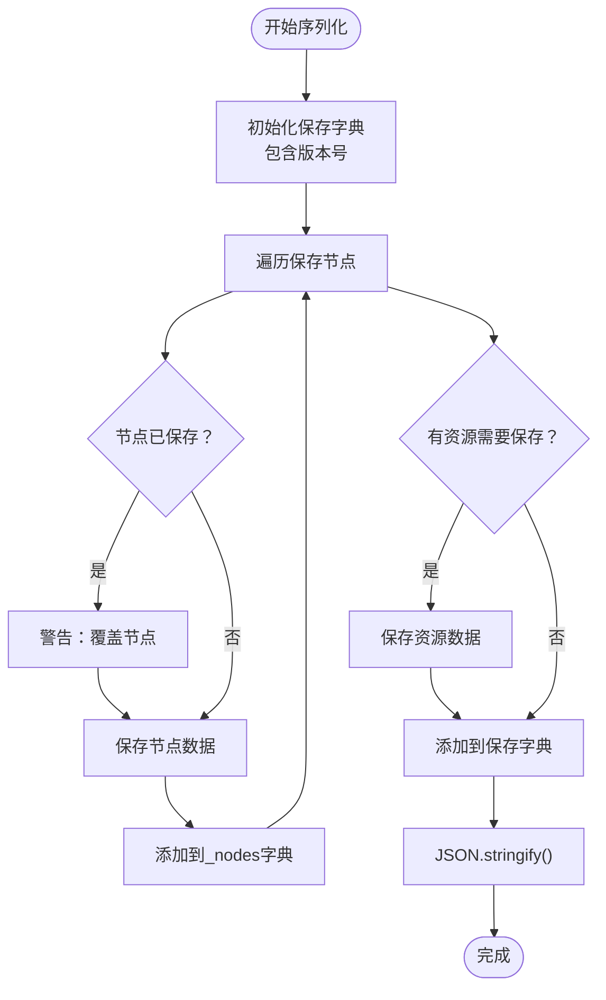
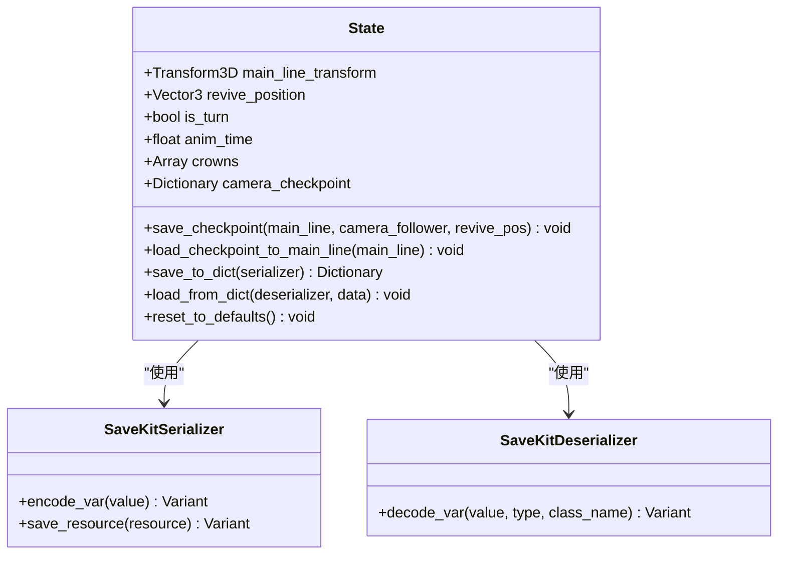
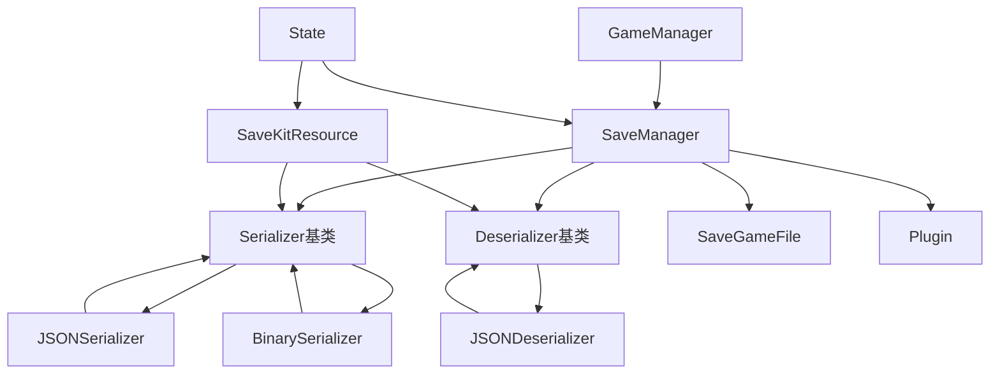

# 状态管理系统

<cite>
**本文档引用的文件**
- [save_manager.gd](file://addons/savekit/save_manager.gd)
- [serializer.gd](file://addons/savekit/serializer.gd)
- [deserializer.gd](file://addons/savekit/deserializer.gd)
- [json_serializer.gd](file://addons/savekit/json_serializer.gd)
- [json_deserializer.gd](file://addons/savekit/json_deserializer.gd)
- [binary_serializer.gd](file://addons/savekit/binary_serializer.gd)
- [resource.gd](file://addons/savekit/resource.gd)
- [save_game_file.gd](file://addons/savekit/save_game_file.gd)
- [plugin.gd](file://addons/savekit/plugin.gd)
- [README.md](file://addons/savekit/README.md)
- [State.gd](file://#Template/[Scripts]/State.gd)
- [GameManager.gd](file://#Template/[Scripts]/GameManager.gd)
</cite>

## 目录
1. [简介](#简介)
2. [项目结构](#项目结构)
3. [核心组件](#核心组件)
4. [架构概览](#架构概览)
5. [详细组件分析](#详细组件分析)
6. [依赖关系分析](#依赖关系分析)
7. [性能考虑](#性能考虑)
8. [故障排除指南](#故障排除指南)
9. [结论](#结论)

## 简介

这是一个基于Godot引擎4.0开发的完整状态管理系统，集成了SaveKit插件和自定义状态管理功能。该系统提供了灵活的游戏状态保存和加载机制，支持多种序列化格式，包括JSON和二进制格式。

系统的核心特性包括：
- 自动化节点状态保存（通过saveable组）
- 支持自定义资源持久化
- 多种序列化格式选择
- 完整的生命周期钩子
- 安全的资源引用处理
- 灵活的检查点系统

## 项目结构

项目采用模块化设计，主要分为以下几个部分：

**图表来源**
- [save_manager.gd:1-294](file://addons/savekit/save_manager.gd#L1-L294)
- [serializer.gd:1-82](file://addons/savekit/serializer.gd#L1-L82)
- [State.gd:1-195](file://#Template/[Scripts]/State.gd#L1-L195)

**章节来源**
- [save_manager.gd:1-294](file://addons/savekit/save_manager.gd#L1-L294)
- [README.md:1-122](file://addons/savekit/README.md#L1-L122)

## 核心组件

### SaveManager - 主要协调器

SaveManager是整个状态管理系统的核心协调器，负责：
- 统一的保存和加载接口
- 场景树遍历和节点分组
- 序列化器和反序列化器的管理
- 文件系统操作
- 生命周期事件信号

### 序列化器层次结构

系统实现了完整的序列化器抽象层次：

**图表来源**
- [serializer.gd:1-82](file://addons/savekit/serializer.gd#L1-L82)
- [json_serializer.gd:1-165](file://addons/savekit/json_serializer.gd#L1-L165)
- [binary_serializer.gd:1-185](file://addons/savekit/binary_serializer.gd#L1-L185)

### 反序列化器层次结构

**图表来源**
- [deserializer.gd:1-146](file://addons/savekit/deserializer.gd#L1-L146)
- [json_deserializer.gd:1-182](file://addons/savekit/json_deserializer.gd#L1-L182)

### 自定义状态管理

State.gd提供了游戏特定的状态管理功能：
- 检查点系统（Crown触发时调用）
- 相机跟随器状态保存
- 游戏进度跟踪
- 音频播放位置保存
- 复活状态管理

**章节来源**
- [State.gd:1-195](file://#Template/[Scripts]/State.gd#L1-L195)
- [serializer.gd:1-82](file://addons/savekit/serializer.gd#L1-L82)
- [deserializer.gd:1-146](file://addons/savekit/deserializer.gd#L1-L146)

## 架构概览

系统采用分层架构设计，确保了高度的模块化和可扩展性：

**图表来源**
- [save_manager.gd:71-200](file://addons/savekit/save_manager.gd#L71-L200)
- [json_serializer.gd:45-56](file://addons/savekit/json_serializer.gd#L45-L56)
- [binary_serializer.gd:114-121](file://addons/savekit/binary_serializer.gd#L114-L121)

## 详细组件分析

### SaveManager工作流程

SaveManager实现了完整的保存和加载工作流程：

**图表来源**
- [save_manager.gd:114-144](file://addons/savekit/save_manager.gd#L114-L144)
- [save_manager.gd:71-93](file://addons/savekit/save_manager.gd#L71-L93)

### JSON序列化过程

JSON序列化器提供了人类可读的保存格式：

**图表来源**
- [json_serializer.gd:45-56](file://addons/savekit/json_serializer.gd#L45-L56)
- [json_serializer.gd:134-145](file://addons/savekit/json_serializer.gd#L134-L145)

### 状态管理集成

State.gd与SaveKit的集成展示了如何保存游戏特定状态：

**图表来源**
- [State.gd:48-156](file://#Template/[Scripts]/State.gd#L48-L156)
- [serializer.gd:24-30](file://addons/savekit/serializer.gd#L24-L30)
- [deserializer.gd:45-51](file://addons/savekit/deserializer.gd#L45-L51)

**章节来源**
- [save_manager.gd:71-200](file://addons/savekit/save_manager.gd#L71-L200)
- [json_serializer.gd:1-165](file://addons/savekit/json_serializer.gd#L1-L165)
- [State.gd:1-195](file://#Template/[Scripts]/State.gd#L1-L195)

## 依赖关系分析

系统具有清晰的依赖关系结构：

**图表来源**
- [save_manager.gd:67-69](file://addons/savekit/save_manager.gd#L67-L69)
- [plugin.gd:4-5](file://addons/savekit/plugin.gd#L4-L5)

### 关键依赖特性

1. **松耦合设计**：通过接口和抽象类实现模块间解耦
2. **可扩展性**：支持自定义序列化器和反序列化器
3. **类型安全**：严格的类型检查和错误处理
4. **资源管理**：智能的资源引用和去重机制

**章节来源**
- [serializer.gd:1-82](file://addons/savekit/serializer.gd#L1-L82)
- [deserializer.gd:1-146](file://addons/savekit/deserializer.gd#L1-L146)
- [resource.gd:1-72](file://addons/savekit/resource.gd#L1-L72)

## 性能考虑

### 序列化性能优化

系统在多个层面进行了性能优化：

1. **资源去重**：二进制序列化器使用实例ID进行资源去重
2. **增量保存**：只保存修改过的节点和资源
3. **内存管理**：及时释放不再使用的资源引用
4. **异步处理**：支持大文件的分块处理

### 内存使用优化

- **延迟加载**：资源引用仅保存必要信息，实际数据按需加载
- **压缩算法**：二进制格式提供更紧凑的数据表示
- **缓存机制**：重复访问的资源使用缓存

### I/O性能优化

- **批量写入**：序列化完成后一次性写入文件
- **目录预创建**：提前创建必要的目录结构
- **错误恢复**：失败时自动清理临时文件

## 故障排除指南

### 常见问题及解决方案

#### 保存失败问题

**症状**：`Failed to save scene tree to disk`
**原因**：目录权限或磁盘空间不足
**解决**：检查`save_games_directory`权限和磁盘空间

#### 加载失败问题

**症状**：`Failed to parse JSON from save data`
**原因**：文件损坏或格式不兼容
**解决**：验证文件完整性，检查序列化版本

#### 资源加载问题

**症状**：`Failed to load scene for node`
**原因**：场景文件缺失或路径错误
**解决**：确保场景文件存在于`res://`路径下

#### 内存泄漏问题

**症状**：长时间运行后内存使用持续增长
**原因**：未正确释放序列化器实例
**解决**：确保在使用完毕后正确销毁序列化器

**章节来源**
- [save_manager.gd:115-138](file://addons/savekit/save_manager.gd#L115-L138)
- [json_deserializer.gd:17-25](file://addons/savekit/json_deserializer.gd#L17-L25)
- [binary_serializer.gd:51-56](file://addons/savekit/binary_serializer.gd#L51-L56)

## 结论

这个状态管理系统展现了现代游戏开发中状态持久化的最佳实践。通过SaveKit插件的强大功能和自定义状态管理的灵活性，系统提供了：

1. **高度模块化**：清晰的组件分离和职责划分
2. **强类型安全**：完整的类型检查和错误处理
3. **性能优化**：多层面的性能考虑和优化策略
4. **易于扩展**：支持自定义序列化格式和扩展功能
5. **用户友好**：简单易用的API和完善的文档

系统特别适合需要复杂状态管理和灵活保存机制的游戏项目。通过合理的架构设计和实现细节，为开发者提供了一个可靠、高效且易于维护的状态管理解决方案。