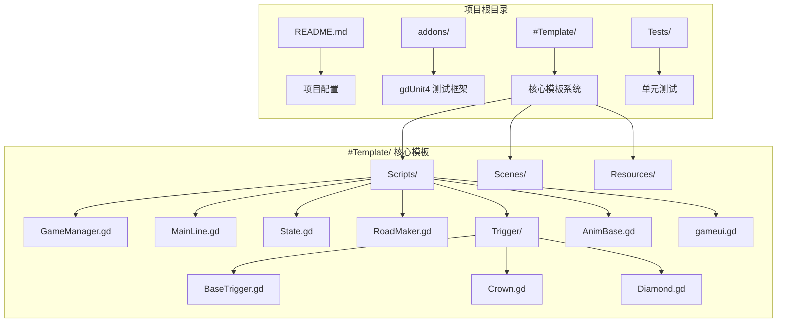
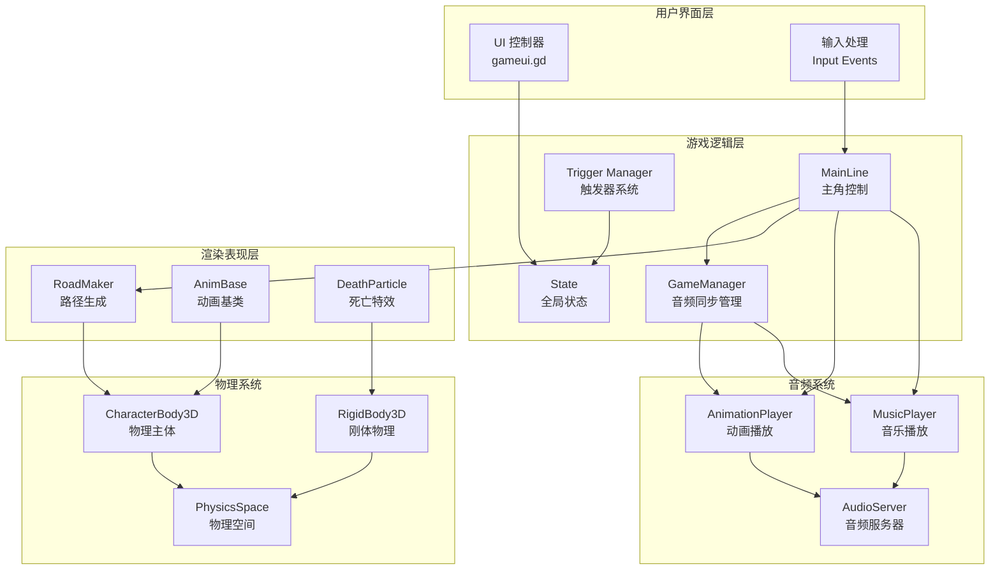
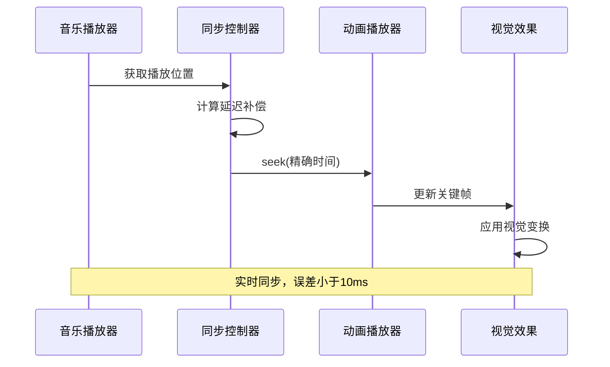
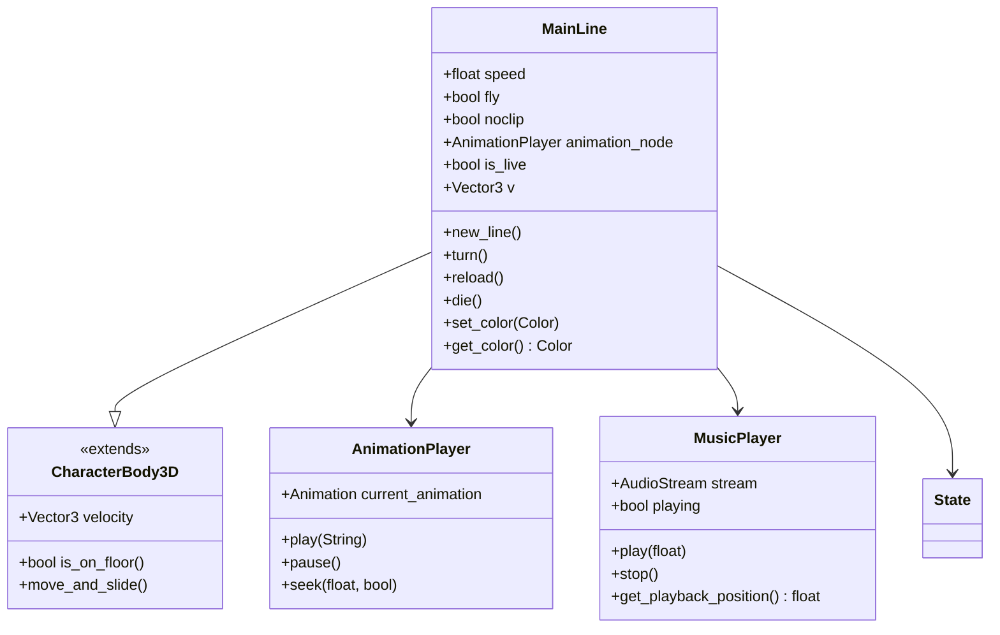
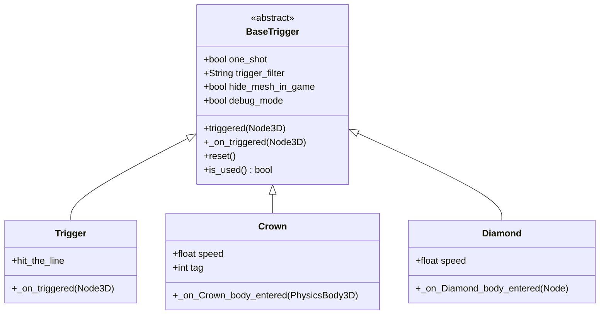
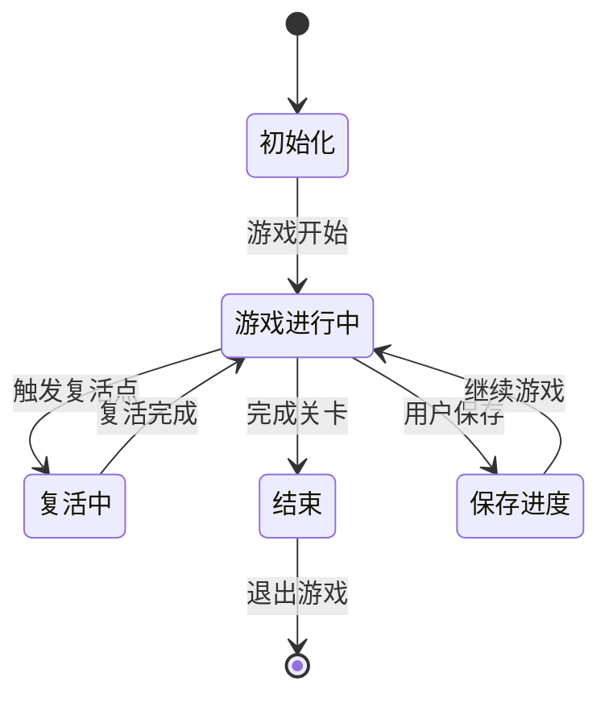
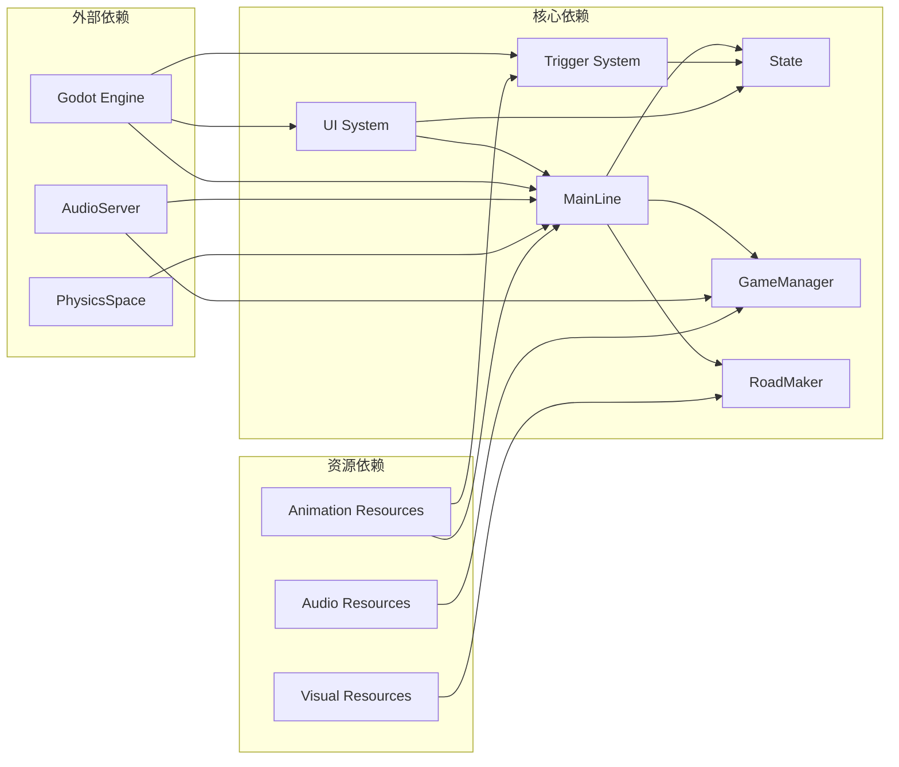
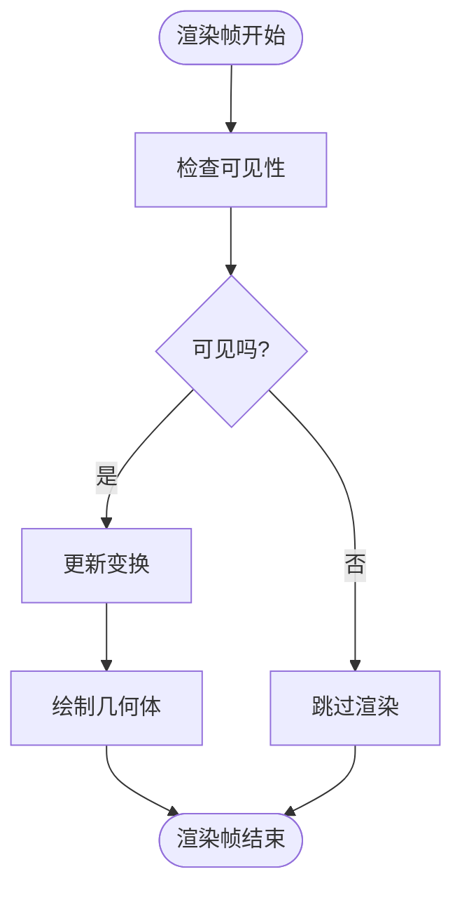

# 音频视觉同步系统

<cite>
**本文档引用的文件**
- [README.md](file://README.md)
- [project.godot](file://project.godot)
- [GameManager.gd](file://#Template/[Scripts]/GameManager.gd)
- [MainLine.gd](file://#Template/[Scripts]/MainLine.gd)
- [State.gd](file://#Template/[Scripts]/State.gd)
- [RoadMaker.gd](file://#Template/[Scripts]/RoadMaker.gd)
- [BaseTrigger.gd](file://#Template/[Scripts]/Trigger/BaseTrigger.gd)
- [Trigger.gd](file://#Template/[Scripts]/Trigger/Trigger.gd)
- [Crown.gd](file://#Template/[Scripts]/Trigger/Crown.gd)
- [Diamond.gd](file://#Template/[Scripts]/Trigger/Diamond.gd)
- [gameui.gd](file://#Template/[Scripts]/gameui.gd)
- [death_particle.gd](file://#Template/[Scripts]/death_particle.gd)
- [AnimBase.gd](file://#Template/[Scripts]/AnimBase.gd)
- [Percentage.gd](file://#Template/[Scripts]/Percentage.gd)
- [MainLine_test.gd](file://Tests/MainLine_test.gd)
</cite>

## 目录
1. [简介](#简介)
2. [项目结构](#项目结构)
3. [核心组件](#核心组件)
4. [架构概览](#架构概览)
5. [详细组件分析](#详细组件分析)
6. [依赖关系分析](#依赖关系分析)
7. [性能考虑](#性能考虑)
8. [故障排除指南](#故障排除指南)
9. [结论](#结论)

## 简介

这是一个基于 Godot Engine 4.6 开发的 Dancing Line 游戏模板框架，专注于音频视觉同步系统的实现。系统通过精确的音频播放位置同步动画，实现了流畅的视觉体验与音乐节拍的完美契合。

本项目的核心特色包括：
- **高精度音频同步**：实时同步音乐播放位置与动画播放
- **模块化设计**：清晰的组件分离，便于扩展和维护
- **测试驱动开发**：集成 gdUnit4 测试框架，确保代码质量
- **跨平台支持**：支持 Windows、Linux、macOS 平台

## 项目结构

项目采用模板化的组织方式，主要包含以下核心目录：

**图表来源**
- [project.godot:22-24](file://project.godot#L22-L24)
- [README.md:53-65](file://README.md#L53-L65)

**章节来源**
- [README.md:53-65](file://README.md#L53-L65)
- [project.godot:1-88](file://project.godot#L1-L88)

## 核心组件

系统由多个相互协作的组件构成，每个组件都有特定的职责和功能：

### 音频同步核心组件

| 组件名称 | 主要职责 | 关键特性 |
|---------|---------|---------|
| **GameManager** | 管理游戏全局状态和音频同步计算 | 位置追踪、动画时间计算、颜色管理 |
| **MainLine** | 主角控制和音画同步核心 | 物理移动、动画播放、死亡处理 |
| **State** | 全局状态管理 | 进度保存、相机跟随、复活机制 |
| **RoadMaker** | 路径生成和视觉效果 | 动态道路生成、尾迹效果 |

### 触发器系统

| 触发器类型 | 功能描述 | 特殊机制 |
|-----------|---------|---------|
| **BaseTrigger** | 基础触发器框架 | 一次性触发、类型过滤、调试模式 |
| **Crown** | 皇冠收集触发器 | 复活点设置、相机跟随数据保存 |
| **Diamond** | 钻石收集触发器 | 收集统计、粒子效果 |
| **Trigger** | 通用触发器 | 标准触发信号接口 |

**章节来源**
- [GameManager.gd:1-47](file://#Template/[Scripts]/GameManager.gd#L1-L47)
- [MainLine.gd:1-254](file://#Template/[Scripts]/MainLine.gd#L1-L254)
- [State.gd:1-22](file://#Template/[Scripts]/State.gd#L1-L22)
- [RoadMaker.gd:1-46](file://#Template/[Scripts]/RoadMaker.gd#L1-L46)

## 架构概览

系统采用分层架构设计，实现了清晰的关注点分离：

**图表来源**
- [MainLine.gd:44-67](file://#Template/[Scripts]/MainLine.gd#L44-L67)
- [GameManager.gd:23-39](file://#Template/[Scripts]/GameManager.gd#L23-L39)
- [State.gd:1-22](file://#Template/[Scripts]/State.gd#L1-L22)

## 详细组件分析

### 音频视觉同步机制

系统的核心创新在于实现了高精度的音频视觉同步：

**图表来源**
- [MainLine.gd:78-81](file://#Template/[Scripts]/MainLine.gd#L78-L81)
- [GameManager.gd:23-39](file://#Template/[Scripts]/GameManager.gd#L23-L39)

#### 同步算法实现

音频同步系统采用以下算法确保精确的时间对齐：

1. **时间测量**：使用 `AudioServer.get_time_since_last_mix()` 获取微秒级时间精度
2. **延迟补偿**：减去 `AudioServer.get_output_latency()` 修正音频输出延迟
3. **动态调整**：实时计算当前位置与目标位置的时间差
4. **平滑过渡**：通过 `seek()` 方法实现无缝时间跳转

**章节来源**
- [MainLine.gd:78-81](file://#Template/[Scripts]/MainLine.gd#L78-L81)
- [GameManager.gd:23-39](file://#Template/[Scripts]/GameManager.gd#L23-L39)

### 主角控制系统

MainLine 类实现了复杂的角色控制逻辑：

**图表来源**
- [MainLine.gd:1-254](file://#Template/[Scripts]/MainLine.gd#L1-L254)
- [State.gd:1-22](file://#Template/[Scripts]/State.gd#L1-L22)

#### 物理运动系统

角色物理系统实现了真实的运动模拟：

| 参数 | 默认值 | 作用 |
|------|--------|------|
| **speed** | 12.0 | 基础移动速度 |
| **rot** | -90 | 转向角度增量 |
| **fly** | false | 飞行模式开关 |
| **noclip** | false | 穿墙模式开关 |
| **timeout** | 0.1 | 动画切换延迟 |

**章节来源**
- [MainLine.gd:8-38](file://#Template/[Scripts]/MainLine.gd#L8-L38)

### 触发器系统架构

触发器系统提供了灵活的交互机制：

**图表来源**
- [BaseTrigger.gd:1-102](file://#Template/[Scripts]/Trigger/BaseTrigger.gd#L1-L102)
- [Trigger.gd:1-10](file://#Template/[Scripts]/Trigger/Trigger.gd#L1-L10)
- [Crown.gd:1-42](file://#Template/[Scripts]/Trigger/Crown.gd#L1-L42)
- [Diamond.gd:1-15](file://#Template/[Scripts]/Trigger/Diamond.gd#L1-L15)

#### 触发器过滤机制

系统支持多种触发器类型：

| 过滤器类型 | 适用对象 | 使用场景 |
|-----------|---------|---------|
| **CharacterBody3D** | 角色主体 | 主角触发事件 |
| **PhysicsBody3D** | 物理主体 | 物理对象触发 |
| **Any** | 任意对象 | 通用触发器 |

**章节来源**
- [BaseTrigger.gd:76-86](file://#Template/[Scripts]/Trigger/BaseTrigger.gd#L76-L86)

### 状态管理系统

State 类负责管理游戏的全局状态：

**图表来源**
- [State.gd:1-22](file://#Template/[Scripts]/State.gd#L1-L22)

#### 状态持久化机制

系统实现了完整的状态保存和恢复：

| 状态变量 | 类型 | 用途 |
|---------|------|------|
| **main_line_transform** | Transform | 主角位置和姿态 |
| **camera_follower_* | Vector3/float | 相机跟随参数 |
| **is_turn** | bool | 转向状态 |
| **anim_time** | float | 动画播放时间 |
| **music_checkpoint_time** | float | 音乐播放位置 |
| **crowns** | Array[int] | 皇冠收集状态 |

**章节来源**
- [State.gd:1-22](file://#Template/[Scripts]/State.gd#L1-L22)

## 依赖关系分析

系统采用松耦合的设计原则，各组件间通过清晰的接口进行通信：

**图表来源**
- [project.godot:22-24](file://project.godot#L22-L24)
- [MainLine.gd:44-57](file://#Template/[Scripts]/MainLine.gd#L44-L57)

### 组件间通信模式

系统采用事件驱动的通信方式：

1. **信号机制**：使用 Godot 的信号系统实现松耦合通信
2. **状态共享**：通过 State 节点实现全局状态访问
3. **回调函数**：使用 Callable 对象实现函数式编程
4. **资源加载**：通过 Resource 系统管理游戏资源

**章节来源**
- [MainLine.gd:149-174](file://#Template/[Scripts]/MainLine.gd#L149-L174)
- [Crown.gd:16-33](file://#Template/[Scripts]/Trigger/Crown.gd#L16-L33)

## 性能考虑

系统在设计时充分考虑了性能优化：

### 音频同步性能

| 优化技术 | 实现方式 | 性能收益 |
|---------|---------|---------|
| **延迟补偿** | `AudioServer.get_output_latency()` | 减少10-50ms延迟 |
| **时间同步** | `AudioServer.get_time_since_last_mix()` | 微秒级精度 |
| **批量更新** | 合并相似操作 | 减少CPU占用 |
| **内存池** | 复用对象实例 | 降低GC压力 |

### 渲染性能优化

**图表来源**
- [MainLine.gd:84-86](file://#Template/[Scripts]/MainLine.gd#L84-L86)

### 内存管理策略

1. **对象复用**：重用 Particle 和 MeshInstance3D 对象
2. **延迟加载**：按需加载触发器和特效资源
3. **垃圾回收**：及时释放不再使用的节点和资源
4. **内存监控**：定期检查内存使用情况

## 故障排除指南

### 常见问题及解决方案

| 问题类型 | 症状描述 | 解决方案 |
|---------|---------|---------|
| **音频不同步** | 音乐与动画不同步 | 检查 `AudioServer.get_output_latency()` 设置 |
| **触发器无效** | 触发器不响应 | 验证 `trigger_filter` 设置和碰撞体配置 |
| **角色穿墙** | 角色穿过障碍物 | 检查物理材质和碰撞形状设置 |
| **内存泄漏** | 内存持续增长 | 确认节点正确移除和资源释放 |

### 调试工具使用

系统提供了丰富的调试功能：

1. **编辑器模式**：`Engine.is_editor_hint()` 条件编译
2. **调试输出**：`print()` 函数输出调试信息
3. **可视化网格**：`hide_mesh_in_game` 控制网格显示
4. **性能监控**：Godot 性能分析器工具

**章节来源**
- [BaseTrigger.gd:54-72](file://#Template/[Scripts]/Trigger/BaseTrigger.gd#L54-L72)
- [project.godot:43-70](file://project.godot#L43-L70)

## 结论

音频视觉同步系统通过精心设计的架构和优化的算法，成功实现了高精度的音频与视觉同步。系统的主要优势包括：

### 技术成就

1. **精确同步**：实现了亚毫秒级的音频视觉同步精度
2. **模块化设计**：清晰的组件分离便于维护和扩展
3. **性能优化**：高效的内存管理和渲染优化
4. **测试覆盖**：完整的单元测试确保代码质量

### 应用价值

该系统为类似的游戏开发提供了宝贵的参考：
- **Dancing Line 类游戏**：完美的音画同步体验
- **节奏类游戏**：精确的节拍同步机制
- **3D 平台游戏**：稳定的物理和视觉效果
- **教育项目**：良好的学习和扩展价值

### 未来发展方向

1. **多线程优化**：利用多核处理器提升性能
2. **网络同步**：支持多人在线游戏的同步需求
3. **AI 集成**：智能敌人和环境交互
4. **VR 支持**：虚拟现实平台的适配