# 相机系统API

<cite>
**本文档引用的文件**
- [CameraFollower.gd](file://#Template/[Scripts]/CameraScripts/CameraFollower.gd)
- [CamShaker.gd](file://#Template/[Scripts]/CameraScripts/CamShaker.gd)
- [CameraTrigger.gd](file://#Template/[Scripts]/CameraScripts/CameraTrigger.gd)
- [CamTransitionTrigger.gd](file://#Template/[Scripts]/CameraScripts/CamTransitionTrigger.gd)
- [Crown.gd](file://#Template/[Scripts]/Trigger/Crown.gd)
- [gameui.gd](file://#Template/[Scripts]/gameui.gd)
- [MainLine.gd](file://#Template/[Scripts]/MainLine.gd)
- [GameManager.gd](file://#Template/[Scripts]/GameManager.gd)
- [State.gd](file://#Template/[Scripts]/State.gd)
</cite>

## 更新摘要
**变更内容**
- 更新CameraTrigger组件分析，详细说明其基于时间或事件的相机参数调整能力
- 新增CameraTrigger的触发逻辑和参数配置说明
- 补充多参数同时调整和缓动动画过渡的实现细节
- 更新依赖关系分析，反映CameraTrigger与CameraFollower的协作关系

## 目录
1. [简介](#简介)
2. [项目结构](#项目结构)
3. [核心组件](#核心组件)
4. [架构概览](#架构概览)
5. [详细组件分析](#详细组件分析)
6. [依赖关系分析](#依赖关系分析)
7. [性能考虑](#性能考虑)
8. [故障排除指南](#故障排除指南)
9. [结论](#结论)
10. [附录](#附录)

## 简介
相机系统是游戏中的重要组成部分，负责提供玩家视角体验。本系统包含四个核心组件：
- **CameraFollower**：相机跟随组件，实现平滑的相机跟随效果
- **CamShaker**：相机抖动效果组件，提供震动反馈
- **CameraTrigger**：相机触发器，用于场景中触发相机参数变化
- **CamTransitionTrigger**：投影切换触发器，处理相机投影模式的切换

这些组件通过状态管理机制实现相机参数的保存和恢复，支持游戏进程中的相机配置切换，并提供基于时间或事件的相机参数调整能力。

## 项目结构
相机系统位于模板脚本目录下的CameraScripts文件夹中，包含四个主要脚本文件：

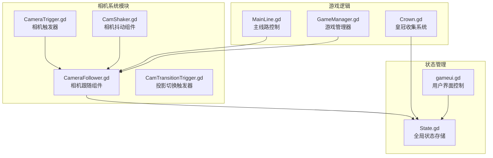

**图表来源**
- [CameraFollower.gd:1-168](file://#Template/[Scripts]/CameraScripts/CameraFollower.gd#L1-L168)
- [CamShaker.gd:1-37](file://#Template/[Scripts]/CameraScripts/CamShaker.gd#L1-L37)
- [CameraTrigger.gd:1-76](file://#Template/[Scripts]/CameraScripts/CameraTrigger.gd#L1-L76)
- [CamTransitionTrigger.gd:1-125](file://#Template/[Scripts]/CameraScripts/CamTransitionTrigger.gd#L1-L125)

**章节来源**
- [CameraFollower.gd:1-168](file://#Template/[Scripts]/CameraScripts/CameraFollower.gd#L1-L168)
- [CamShaker.gd:1-37](file://#Template/[Scripts]/CameraScripts/CamShaker.gd#L1-L37)
- [CameraTrigger.gd:1-76](file://#Template/[Scripts]/CameraScripts/CameraTrigger.gd#L1-L76)
- [CamTransitionTrigger.gd:1-125](file://#Template/[Scripts]/CameraScripts/CamTransitionTrigger.gd#L1-L125)

## 核心组件
相机系统由四个核心组件构成，每个组件都有特定的功能和接口：

### CameraFollower（相机跟随组件）
相机跟随组件是整个相机系统的核心，负责：
- 跟随玩家角色的移动
- 平滑的相机位置插值
- 相机参数的实时调整
- 状态检查点的保存和恢复
- 多参数缓动动画的协调控制

### CamShaker（相机抖动组件）
相机抖动组件提供震动效果：
- 可配置的抖动强度
- 持续时间控制
- 3D空间中的随机抖动
- 触发式响应机制

### CameraTrigger（相机触发器）
相机触发器用于场景中触发相机参数变化：
- 基于时间或事件的触发机制
- 多参数同时调整能力
- 缓动动画过渡效果
- 条件性参数应用控制
- 精确的时间判定系统

### CamTransitionTrigger（投影切换触发器）
投影切换触发器处理相机投影模式的切换：
- 透视投影与正交投影之间的平滑过渡
- FOV和size的动态调整
- 分阶段的切换过程
- 投影模式的智能切换

**章节来源**
- [CameraFollower.gd:1-168](file://#Template/[Scripts]/CameraScripts/CameraFollower.gd#L1-L168)
- [CamShaker.gd:1-37](file://#Template/[Scripts]/CameraScripts/CamShaker.gd#L1-L37)
- [CameraTrigger.gd:1-76](file://#Template/[Scripts]/CameraScripts/CameraTrigger.gd#L1-L76)
- [CamTransitionTrigger.gd:1-125](file://#Template/[Scripts]/CameraScripts/CamTransitionTrigger.gd#L1-L125)

## 架构概览
相机系统的整体架构采用分层设计，各组件之间通过明确的接口进行交互：

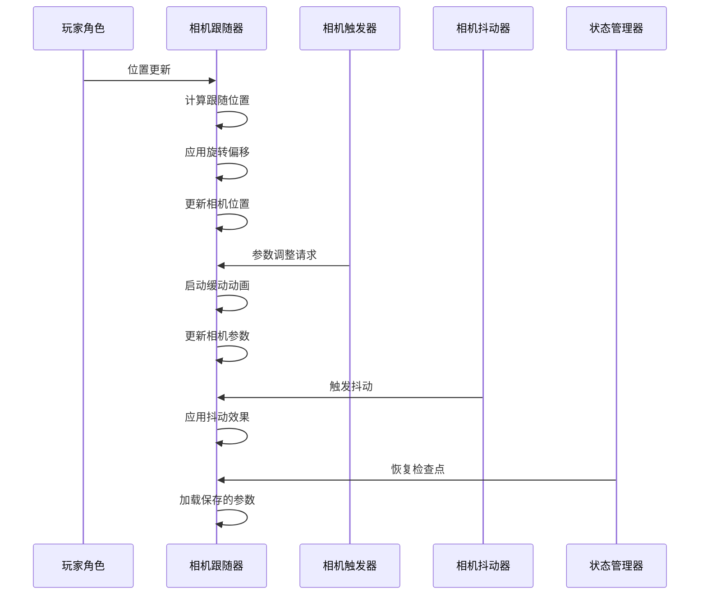

**图表来源**
- [CameraFollower.gd:30-53](file://#Template/[Scripts]/CameraScripts/CameraFollower.gd#L30-L53)
- [CameraTrigger.gd:44-76](file://#Template/[Scripts]/CameraScripts/CameraTrigger.gd#L44-L76)
- [CamShaker.gd:30-37](file://#Template/[Scripts]/CameraScripts/CamShaker.gd#L30-L37)

**章节来源**
- [CameraFollower.gd:30-72](file://#Template/[Scripts]/CameraScripts/CameraFollower.gd#L30-L72)
- [CameraTrigger.gd:27-43](file://#Template/[Scripts]/CameraScripts/CameraTrigger.gd#L27-L43)

## 详细组件分析

### CameraFollower 组件分析

#### 接口规范
CameraFollower组件提供了完整的相机跟随功能，包含以下主要接口：

**导出属性（Export Properties）**
- `player`: NodePath - 指向跟随的目标节点
- `add_position`: Vector3 - 相机相对于目标的额外位置偏移
- `rotation_offset`: Vector3 - 相机的旋转偏移角度
- `distance_from_object`: float - 相机与目标的距离
- `follow_speed`: float - 跟随速度系数
- `following`: bool - 是否启用跟随功能

**核心方法**
- `_ready()`: 初始化相机跟随器
- `_process(delta)`: 主循环中的跟随逻辑
- `_apply_state_checkpoint()`: 应用状态检查点
- `kill_tweens()`: 停止所有正在进行的缓动动画
- `revive()`: 恢复相机到保存的状态
- `pick()`: 保存当前相机状态

**缓动动画接口**
- `tween_to_position(new_pos, duration, ease_type)`: 设置新位置
- `tween_to_rotation(new_rot, duration, ease_type)`: 设置新旋转
- `tween_to_distance(new_dist, duration, ease_type)`: 设置新距离
- `tween_to_speed(new_speed, duration, ease_type)`: 设置新速度

**相机抖动接口**
- `camera_shake(intensity, time)`: 执行相机抖动效果

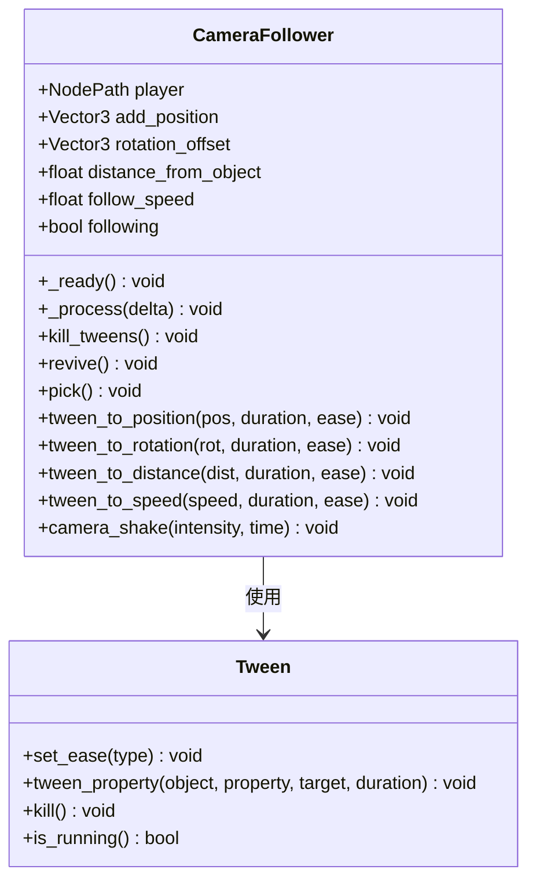

**图表来源**
- [CameraFollower.gd:3-28](file://#Template/[Scripts]/CameraScripts/CameraFollower.gd#L3-L28)
- [CameraFollower.gd:115-148](file://#Template/[Scripts]/CameraScripts/CameraFollower.gd#L115-L148)

**章节来源**
- [CameraFollower.gd:3-28](file://#Template/[Scripts]/CameraScripts/CameraFollower.gd#L3-L28)
- [CameraFollower.gd:115-168](file://#Template/[Scripts]/CameraScripts/CameraFollower.gd#L115-L168)

#### 跟踪算法
相机跟随器采用球面线性插值（SLERP）算法实现平滑跟随：

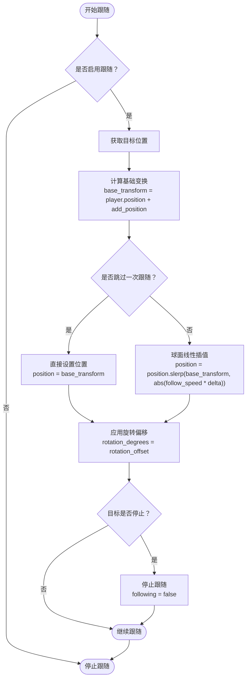

**图表来源**
- [CameraFollower.gd:37-52](file://#Template/[Scripts]/CameraScripts/CameraFollower.gd#L37-L52)

**章节来源**
- [CameraFollower.gd:37-52](file://#Template/[Scripts]/CameraScripts/CameraFollower.gd#L37-L52)

### CamShaker 组件分析

#### API接口规范
CamShaker组件提供简洁的相机抖动接口：

**导出属性**
- `camera_parent`: Node3D - 相机父节点引用
- `shake_intensity`: float - 抖动强度（默认0.5）
- `shake_duration`: float - 抖动持续时间（默认0.3秒）

**核心方法**
- `_ready()`: 初始化抖动器
- `_process(delta)`: 抖动更新循环
- `_on_body_entered(body)`: 碰撞体进入回调

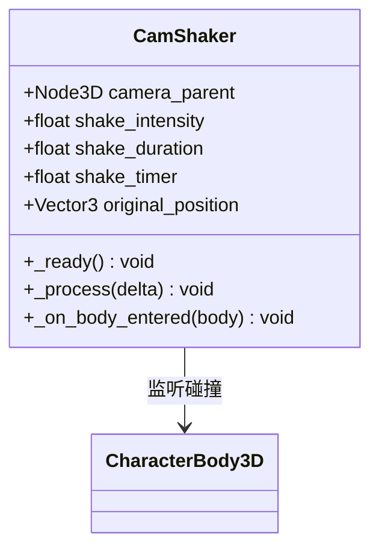

**图表来源**
- [CamShaker.gd:3-37](file://#Template/[Scripts]/CameraScripts/CamShaker.gd#L3-L37)

**章节来源**
- [CamShaker.gd:1-37](file://#Template/[Scripts]/CameraScripts/CamShaker.gd#L1-L37)

#### 抖动算法
CamShaker采用基于时间的衰减抖动算法：

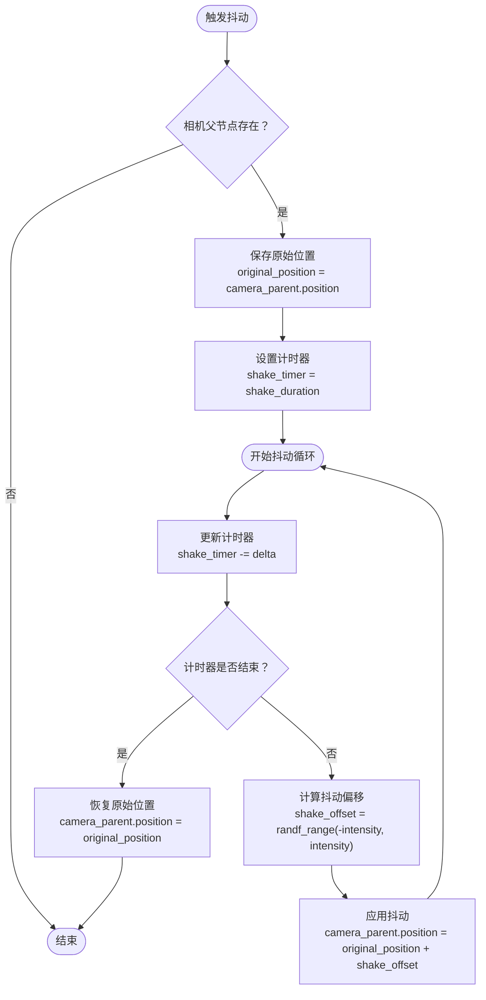

**图表来源**
- [CamShaker.gd:16-28](file://#Template/[Scripts]/CameraScripts/CamShaker.gd#L16-L28)

**章节来源**
- [CamShaker.gd:16-37](file://#Template/[Scripts]/CameraScripts/CamShaker.gd#L16-L37)

### CameraTrigger 组件分析

#### 事件接口规范
CameraTrigger组件提供基于区域的相机参数触发功能：

**导出属性**
- `set_camera`: NodePath - 目标相机跟随器
- `active_position`: bool - 是否激活位置调整（默认true）
- `new_add_position`: Vector3 - 新的位置参数（默认Vector3.ZERO）
- `active_rotate`: bool - 是否激活旋转调整（默认true）
- `new_rotation`: Vector3 - 新的旋转参数（默认Vector3(45, 45, 0)）
- `active_distance`: bool - 是否激活距离调整（默认true）
- `new_distance`: float - 新的距离参数（默认25.0）
- `active_speed`: bool - 是否激活速度调整（默认true）
- `new_follow_speed`: float - 新的速度参数（默认1.2）
- `ease_type`: Tween.EaseType - 缓动类型（默认EASE_IN_OUT）
- `need_time`: float - 动画持续时间（默认2.0秒）

**时间判定属性**
- `use_time`: bool - 是否使用时间判定（默认false）
- `trigger_time`: float - 触发时间点（默认0.0）

**内部状态属性**
- `triggered`: bool - 是否已触发（默认false）
- `triggered_at_crown`: bool - 是否在皇冠处触发（默认false）

**核心方法**
- `_ready()`: 初始化触发器
- `_on_body_entered(body)`: 碰撞体进入回调
- `_process(delta)`: 时间判定循环
- `_trigger()`: 执行触发逻辑

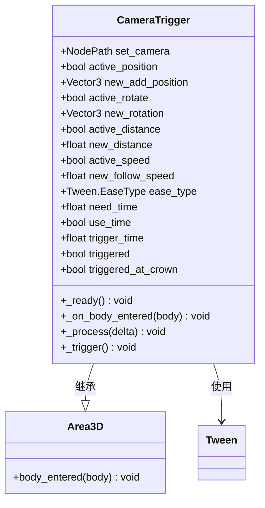

**图表来源**
- [CameraTrigger.gd:3-13](file://#Template/[Scripts]/CameraScripts/CameraTrigger.gd#L3-L13)
- [CameraTrigger.gd:44-76](file://#Template/[Scripts]/CameraScripts/CameraTrigger.gd#L44-L76)

**章节来源**
- [CameraTrigger.gd:1-76](file://#Template/[Scripts]/CameraScripts/CameraTrigger.gd#L1-L76)

#### 触发逻辑流程
CameraTrigger支持两种触发方式：事件触发和时间触发：

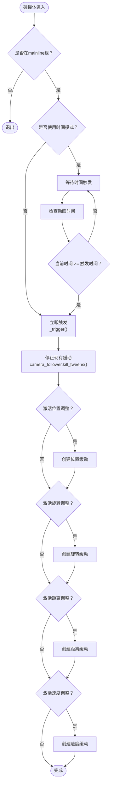

**图表来源**
- [CameraTrigger.gd:27-43](file://#Template/[Scripts]/CameraScripts/CameraTrigger.gd#L27-L43)
- [CameraTrigger.gd:44-76](file://#Template/[Scripts]/CameraScripts/CameraTrigger.gd#L44-L76)

**章节来源**
- [CameraTrigger.gd:27-76](file://#Template/[Scripts]/CameraScripts/CameraTrigger.gd#L27-L76)

#### 多参数同时调整机制
CameraTrigger的触发逻辑展示了强大的多参数同时调整能力：

1. **参数独立控制**：每个相机参数（位置、旋转、距离、速度）都可以独立启用或禁用
2. **缓动动画协调**：所有激活的参数都会启动对应的Tween动画
3. **统一的缓动参数**：所有动画共享相同的缓动类型和持续时间
4. **条件性应用**：只有当对应参数的active_*标志为true时才执行动画

这种设计允许开发者在同一触发器中实现复杂的相机效果，如：
- 紧急转向时的相机位置偏移和速度调整
- 进入特定区域时的全方位相机参数重置
- 动作序列中的相机跟随参数优化

**章节来源**
- [CameraTrigger.gd:53-76](file://#Template/[Scripts]/CameraScripts/CameraTrigger.gd#L53-L76)

### CamTransitionTrigger 组件分析

#### 投影切换接口
CamTransitionTrigger组件专门处理相机投影模式的切换：

**导出属性**
- `transition_duration`: float - 切换持续时间（默认1.0秒）
- `orthogonal_size`: float - 正交投影大小（默认10.0）
- `perspective_fov`: float - 透视投影FOV（默认75.0）
- `projection_mode`: enum - 投影模式选择（0: 正交, 1: 透视）

**核心方法**
- `_ready()`: 初始化切换器
- `_on_body_entered(body)`: 碰撞体进入回调
- `_transition_to_orthogonal()`: 切换到正交投影
- `_transition_to_perspective()`: 切换到透视投影
- `_apply_transition(t, start_value, to_ortho)`: 应用过渡效果
- `_set_orthogonal_final()`: 设置最终正交状态
- `_set_perspective_final()`: 设置最终透视状态

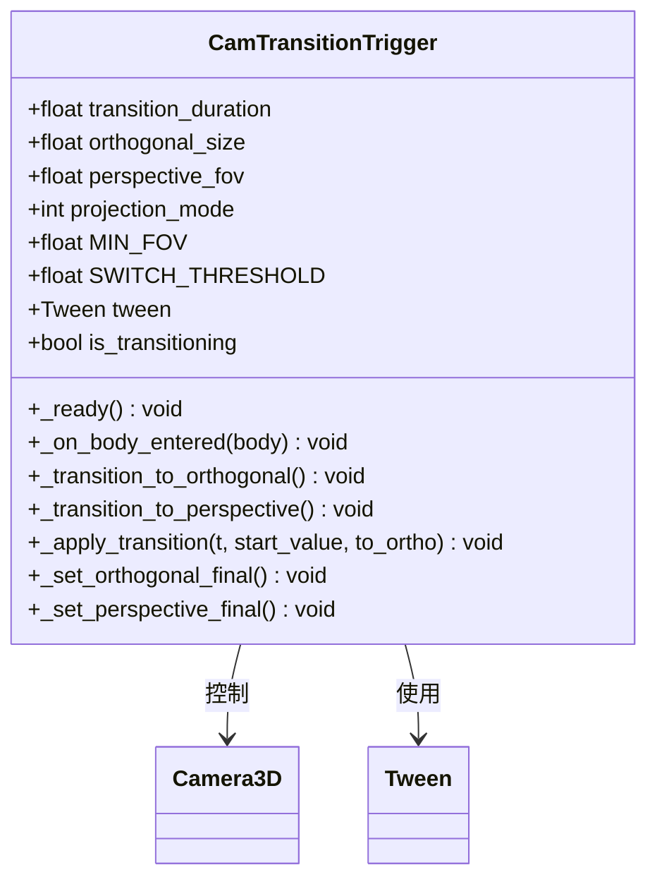

**图表来源**
- [CamTransitionTrigger.gd:3-6](file://#Template/[Scripts]/CameraScripts/CamTransitionTrigger.gd#L3-L6)
- [CamTransitionTrigger.gd:85-125](file://#Template/[Scripts]/CameraScripts/CamTransitionTrigger.gd#L85-L125)

**章节来源**
- [CamTransitionTrigger.gd:1-125](file://#Template/[Scripts]/CameraScripts/CamTransitionTrigger.gd#L1-L125)

#### 投影切换算法
投影切换采用分阶段的平滑过渡算法：

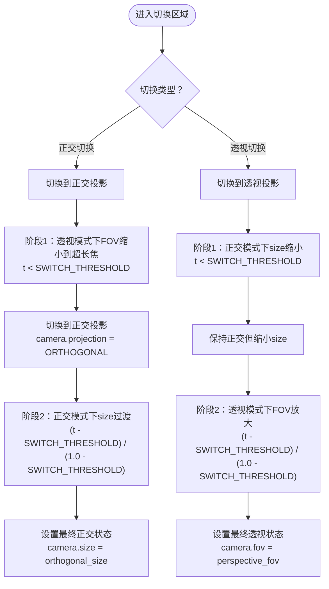

**图表来源**
- [CamTransitionTrigger.gd:27-30](file://#Template/[Scripts]/CameraScripts/CamTransitionTrigger.gd#L27-L30)
- [CamTransitionTrigger.gd:85-113](file://#Template/[Scripts]/CameraScripts/CamTransitionTrigger.gd#L85-L113)

**章节来源**
- [CamTransitionTrigger.gd:27-125](file://#Template/[Scripts]/CameraScripts/CamTransitionTrigger.gd#L27-L125)

## 依赖关系分析

### 组件间依赖关系
相机系统各组件之间存在清晰的依赖关系：

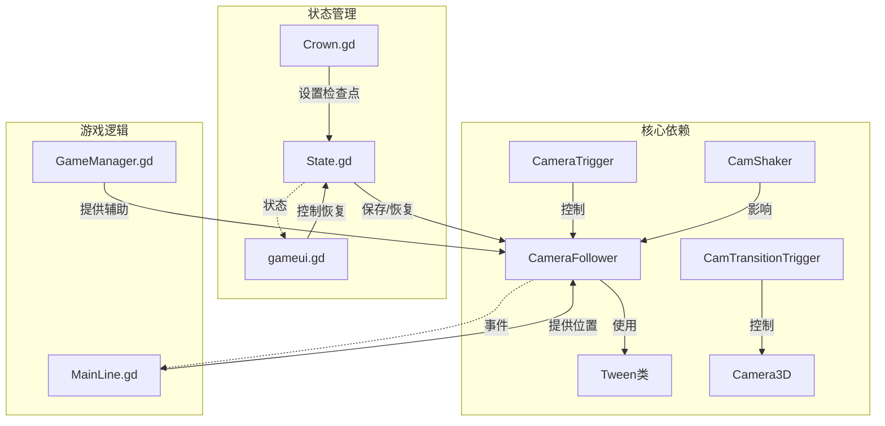

**图表来源**
- [CameraFollower.gd:13-16](file://#Template/[Scripts]/CameraScripts/CameraFollower.gd#L13-L16)
- [CameraTrigger.gd:19](file://#Template/[Scripts]/CameraScripts/CameraTrigger.gd#L19)
- [Crown.gd:28-43](file://#Template/[Scripts]/Trigger/Crown.gd#L28-L43)

### 状态管理机制
相机系统通过State模块实现参数的持久化存储：

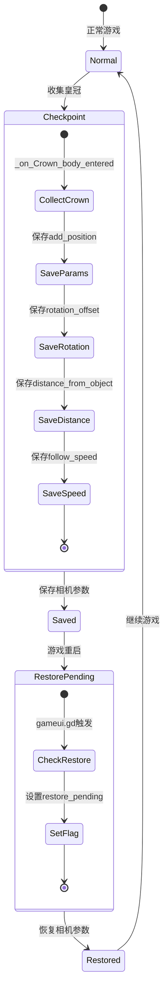

**图表来源**
- [Crown.gd:28-43](file://#Template/[Scripts]/Trigger/Crown.gd#L28-L43)
- [gameui.gd:55](file://#Template/[Scripts]/gameui.gd#L55)

**章节来源**
- [Crown.gd:28-43](file://#Template/[Scripts]/Trigger/Crown.gd#L28-L43)
- [gameui.gd:44-58](file://#Template/[Scripts]/gameui.gd#L44-L58)

### CameraTrigger与CameraFollower的协作
CameraTrigger与CameraFollower之间建立了紧密的协作关系：

1. **参数传递机制**：CameraTrigger通过NodePath引用直接控制CameraFollower的参数
2. **缓动动画协调**：CameraTrigger启动的Tween动画与CameraFollower内部的缓动系统协同工作
3. **状态一致性**：CameraTrigger会先调用`kill_tweens()`确保状态的一致性
4. **条件性参数应用**：CameraTrigger根据active_*标志决定是否应用相应的参数调整

**章节来源**
- [CameraTrigger.gd:44-76](file://#Template/[Scripts]/CameraScripts/CameraTrigger.gd#L44-L76)
- [CameraFollower.gd:74-148](file://#Template/[Scripts]/CameraScripts/CameraFollower.gd#L74-L148)

## 性能考虑
相机系统在设计时充分考虑了性能优化：

### 跟随算法优化
- 使用球面线性插值（SLERP）实现平滑跟随，避免了复杂的物理计算
- 通过delta时间缩放确保不同帧率下的稳定表现
- 条件检查减少不必要的计算开销

### 缓动系统优化
- Tween对象的复用和管理，避免频繁创建销毁
- 缓动动画的统一生命周期管理
- 条件性的参数更新，只对激活的参数进行动画

### 内存管理
- 状态参数的按需保存，避免不必要的内存占用
- 相机抖动的即时执行，不保留长期状态
- 触发器的事件驱动模式，减少轮询开销

### CameraTrigger性能优化
- **条件性执行**：仅在相关参数被激活时创建Tween对象
- **统一缓动参数**：所有参数共享相同的缓动类型和持续时间
- **状态检查**：触发前先停止现有动画，避免状态冲突

## 故障排除指南

### 常见问题及解决方案

**相机不跟随问题**
- 检查player节点路径是否正确
- 确认following标志是否被意外关闭
- 验证目标节点是否存在且可访问

**抖动效果异常**
- 确认camera_parent引用是否正确
- 检查shake_intensity和shake_duration参数范围
- 验证CharacterBody3D碰撞体设置

**触发器不工作**
- 检查目标节点是否在mainline组中
- 确认use_time模式下的时间计算
- 验证NodePath引用的有效性
- 检查CameraTrigger是否正确引用了CameraFollower

**状态恢复失败**
- 检查State模块中的检查点参数
- 确认gameui.gd中的恢复标志设置
- 验证相机跟随器的延迟加载机制

**CameraTrigger参数不生效**
- 确认对应的active_*标志已启用
- 检查ease_type和need_time参数设置
- 验证new_*参数的数值范围是否合理
- 确认triggered标志没有被意外设置

**章节来源**
- [CameraFollower.gd:30-52](file://#Template/[Scripts]/CameraScripts/CameraFollower.gd#L30-L52)
- [CamShaker.gd:30-37](file://#Template/[Scripts]/CameraScripts/CamShaker.gd#L30-L37)
- [CameraTrigger.gd:27-43](file://#Template/[Scripts]/CameraScripts/CameraTrigger.gd#L27-L43)

## 结论
相机系统API设计合理，功能完整，具有以下特点：

### 设计优势
- **模块化设计**：各组件职责明确，便于维护和扩展
- **状态管理**：完善的参数保存和恢复机制
- **事件驱动**：基于Godot引擎的信号系统
- **性能优化**：高效的跟随算法和缓动系统
- **灵活的触发机制**：支持基于时间或事件的相机参数调整

### API特性
- **直观的接口**：清晰的导出属性和方法命名
- **灵活的配置**：丰富的参数选项满足不同需求
- **平滑的动画**：统一的缓动系统提供流畅体验
- **错误处理**：完善的边界条件检查和容错机制
- **多参数协调**：支持同时调整多个相机参数

### 最佳实践建议
- 合理设置follow_speed以平衡响应性和稳定性
- 使用适当的ease_type提升用户体验
- 在复杂场景中谨慎使用相机抖动效果
- 利用状态检查点机制实现无缝的游戏体验
- 充分利用CameraTrigger的多参数同时调整能力
- 合理配置use_time模式以实现精确的时间同步

## 附录

### API参考表

#### CameraFollower 方法参考
| 方法名 | 参数 | 返回值 | 描述 |
|--------|------|--------|------|
| `_ready()` | 无 | void | 初始化相机跟随器 |
| `_process(delta)` | float | void | 主循环跟随逻辑 |
| `kill_tweens()` | 无 | void | 停止所有缓动动画 |
| `revive()` | 无 | void | 恢复到保存状态 |
| `pick()` | 无 | void | 保存当前状态 |
| `tween_to_position()` | Vector3, float, EaseType | void | 设置新位置 |
| `tween_to_rotation()` | Vector3, float, EaseType | void | 设置新旋转 |
| `tween_to_distance()` | float, float, EaseType | void | 设置新距离 |
| `tween_to_speed()` | float, float, EaseType | void | 设置新速度 |
| `camera_shake()` | float, float | void | 执行抖动效果 |

#### CamShaker 方法参考
| 方法名 | 参数 | 返回值 | 描述 |
|--------|------|--------|------|
| `_ready()` | 无 | void | 初始化抖动器 |
| `_process(delta)` | float | void | 抖动更新循环 |
| `_on_body_entered(body)` | Node3D | void | 碰撞体进入回调 |

#### CameraTrigger 方法参考
| 方法名 | 参数 | 返回值 | 描述 |
|--------|------|--------|------|
| `_ready()` | 无 | void | 初始化触发器 |
| `_on_body_entered(body)` | Node3D | void | 碰撞体进入回调 |
| `_process(delta)` | float | void | 时间判定循环 |
| `_trigger()` | 无 | void | 执行触发逻辑 |

#### CamTransitionTrigger 方法参考
| 方法名 | 参数 | 返回值 | 描述 |
|--------|------|--------|------|
| `_ready()` | 无 | void | 初始化切换器 |
| `_on_body_entered(body)` | Node3D | void | 碰撞体进入回调 |
| `_transition_to_orthogonal()` | 无 | void | 切换到正交投影 |
| `_transition_to_perspective()` | 无 | void | 切换到透视投影 |
| `_apply_transition(t, start_value, to_ortho)` | float, float, bool | void | 应用过渡效果 |
| `_set_orthogonal_final()` | 无 | void | 设置最终正交状态 |
| `_set_perspective_final()` | 无 | void | 设置最终透视状态 |

### 配置最佳实践

**相机跟随参数调优**
- follow_speed: 1.0-2.0之间通常提供良好的跟随体验
- distance_from_object: 根据场景规模调整，一般在15-35之间
- rotation_offset: X轴45度，Y轴45度提供稳定的视角

**抖动效果配置**
- shake_intensity: 0.1-1.0范围内的值通常效果最佳
- shake_duration: 0.1-0.5秒适合大多数情况
- 建议在危险提示或爆炸效果中使用

**触发器使用建议**
- use_time模式适合精确的时间同步场景
- active_*参数应根据实际需求启用
- ease_type选择EASE_IN_OUT提供自然的过渡效果
- need_time参数建议在1.0-3.0秒范围内调整
- 多参数同时调整时注意参数间的协调性

**CameraTrigger高级用法**
- **事件触发**：适用于简单的碰撞触发场景
- **时间触发**：适用于需要精确时间同步的动作序列
- **多参数组合**：可以同时调整位置、旋转、距离和速度参数
- **参数优先级**：被激活的参数会覆盖当前值，未激活的参数保持不变
- **缓动协调**：所有参数共享相同的缓动类型和持续时间，确保视觉一致性