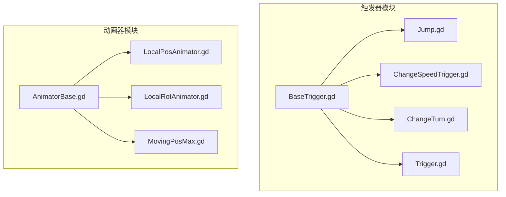
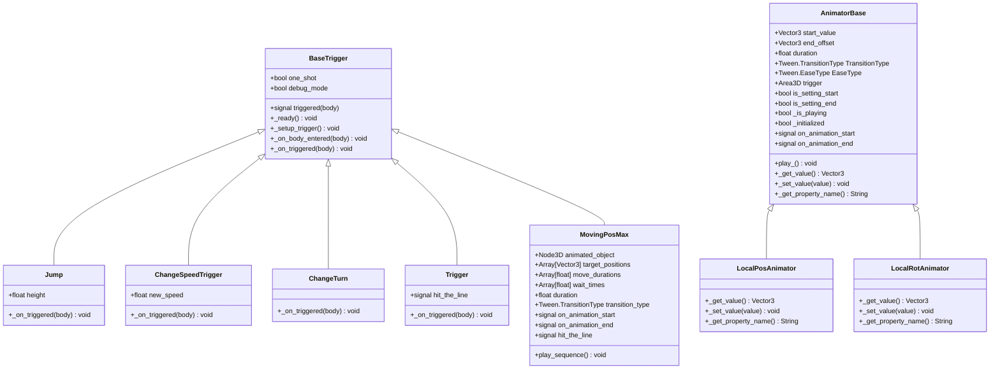
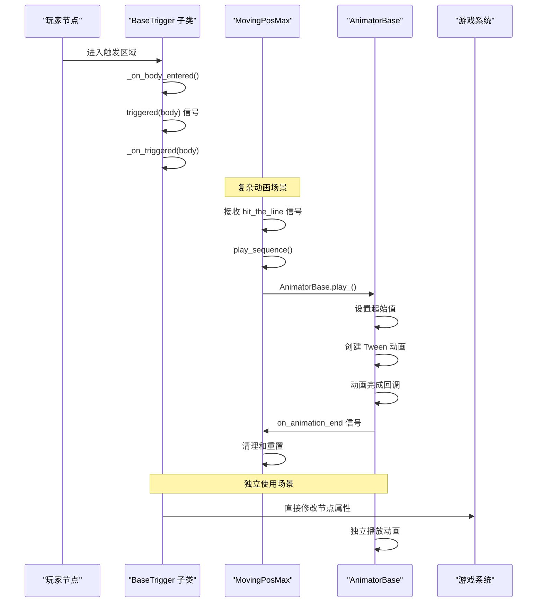

# 触发器系统API

<cite>
**本文档引用的文件**
- [BaseTrigger.gd](file://#Template/[Scripts]/Trigger/BaseTrigger.gd)
- [Jump.gd](file://#Template/[Scripts]/Trigger/Jump.gd)
- [ChangeSpeedTrigger.gd](file://#Template/[Scripts]/Trigger/ChangeSpeedTrigger.gd)
- [ChangeTurn.gd](file://#Template/[Scripts]/Trigger/ChangeTurn.gd)
- [Trigger.gd](file://#Template/[Scripts]/Trigger/Trigger.gd)
- [AnimatorBase.gd](file://#Template/[Scripts]/Animator/AnimatorBase.gd)
- [LocalPosAnimator.gd](file://#Template/[Scripts]/Animator/LocalPosAnimator.gd)
- [LocalRotAnimator.gd](file://#Template/[Scripts]/Animator/LocalRotAnimator.gd)
- [MovingPosMax.gd](file://#Template/[Scripts]/Animator/MovingPosMax.gd)
</cite>

## 目录
1. [简介](#简介)
2. [项目结构](#项目结构)
3. [核心组件](#核心组件)
4. [架构总览](#架构总览)
5. [详细组件分析](#详细组件分析)
6. [动画器系统架构更新](#动画器系统架构更新)
7. [依赖关系分析](#依赖关系分析)
8. [性能考虑](#性能考虑)
9. [故障排查指南](#故障排查指南)
10. [结论](#结论)
11. [附录](#附录)

## 简介
本文件系统性梳理触发器系统API，覆盖基础触发器基类 BaseTrigger 的接口规范与继承要求，并详细说明各类具体触发器（如 Jump、ChangeSpeed、ChangeTurn、Trigger）的API、生命周期方法、参数配置与事件回调机制。同时介绍全新的动画器系统架构，展示从传统 PosAnimator 等组件到统一 AnimatorBase 基类的重构过程。提供触发器与动画器的协同工作机制，以及扩展开发的接口指南与最佳实践，帮助开发者正确集成触发器与游戏系统之间的数据传递。

## 项目结构
触发器相关脚本集中于模板目录下的 Trigger 文件夹，采用"继承基类 + 具体实现"的分层设计：
- 基类：BaseTrigger（统一触发逻辑、一次性触发与信号发射）
- 具体触发器：Jump、ChangeSpeed、ChangeTurn、Trigger（继承 BaseTrigger）
- 动画器系统：AnimatorBase（统一动画基类）及其派生类（LocalPosAnimator、LocalRotAnimator、MovingPosMax）

**图表来源**
- [BaseTrigger.gd:1-38](file://#Template/[Scripts]/Trigger/BaseTrigger.gd#L1-L38)
- [AnimatorBase.gd:1-88](file://#Template/[Scripts]/Animator/AnimatorBase.gd#L1-L88)
- [LocalPosAnimator.gd:1-13](file://#Template/[Scripts]/Animator/LocalPosAnimator.gd#L1-L13)
- [LocalRotAnimator.gd:1-13](file://#Template/[Scripts]/Animator/LocalRotAnimator.gd#L1-L13)
- [MovingPosMax.gd:1-107](file://#Template/[Scripts]/Animator/MovingPosMax.gd#L1-L107)

**章节来源**
- [BaseTrigger.gd:1-38](file://#Template/[Scripts]/Trigger/BaseTrigger.gd#L1-L38)
- [AnimatorBase.gd:1-88](file://#Template/[Scripts]/Animator/AnimatorBase.gd#L1-L88)
- [LocalPosAnimator.gd:1-13](file://#Template/[Scripts]/Animator/LocalPosAnimator.gd#L1-L13)
- [LocalRotAnimator.gd:1-13](file://#Template/[Scripts]/Animator/LocalRotAnimator.gd#L1-L13)
- [MovingPosMax.gd:1-107](file://#Template/[Scripts]/Animator/MovingPosMax.gd#L1-L107)

## 核心组件
本节聚焦 BaseTrigger 基类的接口规范与继承要求，明确子类必须实现的方法、可重写的行为以及公共能力。

- 继承关系
  - 所有具体触发器均继承自 BaseTrigger，复用统一的触发检测与一次性触发逻辑。
  - 动画器系统采用新的 AnimatorBase 基类架构，提供统一的动画控制接口。

- 关键导出属性（@export）
  - one_shot：布尔值，控制触发器是否仅触发一次
  - debug_mode：布尔值，启用后在控制台输出触发日志
  - 说明：BaseTrigger 仅包含触发器相关的导出属性

- 生命周期与事件
  - _ready：建立触发信号连接
  - _on_body_entered：入口触发处理，执行一次性触发检查、发出 triggered 信号、调用子类 _on_triggered
  - triggered(body)：信号，参数为触发该触发器的节点
  - reset()：重置触发状态（适用于 one_shot）
  - is_used()：查询是否已触发

- 可重写方法
  - _on_triggered(body)：子类必须实现，完成具体的触发效果

- 辅助方法
  - _setup_trigger()：确保 body_entered 信号仅连接一次

**章节来源**
- [BaseTrigger.gd:6-11](file://#Template/[Scripts]/Trigger/BaseTrigger.gd#L6-L11)
- [BaseTrigger.gd:15-23](file://#Template/[Scripts]/Trigger/BaseTrigger.gd#L15-L23)
- [BaseTrigger.gd:24-35](file://#Template/[Scripts]/Trigger/BaseTrigger.gd#L24-L35)
- [BaseTrigger.gd:37-38](file://#Template/[Scripts]/Trigger/BaseTrigger.gd#L37-L38)

## 架构总览
触发器系统采用"基类统一 + 子类定制"的架构，确保不同触发器共享一致的生命周期与事件模型，同时允许子类专注于特定效果实现。动画器系统已重构为基于 AnimatorBase 的统一架构，提供更强大的动画控制能力。

**图表来源**
- [BaseTrigger.gd:1-38](file://#Template/[Scripts]/Trigger/BaseTrigger.gd#L1-L38)
- [AnimatorBase.gd:1-88](file://#Template/[Scripts]/Animator/AnimatorBase.gd#L1-L88)
- [LocalPosAnimator.gd:1-13](file://#Template/[Scripts]/Animator/LocalPosAnimator.gd#L1-L13)
- [LocalRotAnimator.gd:1-13](file://#Template/[Scripts]/Animator/LocalRotAnimator.gd#L1-L13)
- [MovingPosMax.gd:1-107](file://#Template/[Scripts]/Animator/MovingPosMax.gd#L1-L107)

## 详细组件分析

### BaseTrigger 基类 API
- 导出属性
  - one_shot：一次性触发开关
  - debug_mode：调试日志开关
- 信号
  - triggered(body)：触发时发出，携带触发者节点
- 生命周期
  - _ready：建立触发信号连接
  - _on_body_entered：一次性触发检查 → 发出信号 → 调用子类处理
- 可重写
  - _on_triggered：子类必须实现的效果逻辑
- 实用方法
  - reset：重置触发状态
  - is_used：查询触发状态

**章节来源**
- [BaseTrigger.gd:6-11](file://#Template/[Scripts]/Trigger/BaseTrigger.gd#L6-L11)
- [BaseTrigger.gd:15-23](file://#Template/[Scripts]/Trigger/BaseTrigger.gd#L15-L23)
- [BaseTrigger.gd:24-35](file://#Template/[Scripts]/Trigger/BaseTrigger.gd#L24-L35)
- [BaseTrigger.gd:37-38](file://#Template/[Scripts]/Trigger/BaseTrigger.gd#L37-L38)

### Jump 跳跃触发器
- 继承：BaseTrigger
- 参数
  - height：跳跃高度（用于计算初始速度）
- 行为
  - 进入触发区域时，对 CharacterBody3D 的速度施加向上分量

**章节来源**
- [Jump.gd:1-13](file://#Template/[Scripts]/Trigger/Jump.gd#L1-L13)

### ChangeSpeedTrigger 速度改变触发器
- 继承：BaseTrigger
- 参数
  - new_speed：新的移动速度值
- 行为
  - 对具备 speed 属性的节点进行赋值
  - 若节点处于"已开始移动"状态，则同步更新速度向量

**章节来源**
- [ChangeSpeedTrigger.gd:1-15](file://#Template/[Scripts]/Trigger/ChangeSpeedTrigger.gd#L1-L15)

### ChangeTurn 转向改变触发器
- 继承：BaseTrigger
- 行为
  - 切换目标节点的转向状态（布尔值取反）

**章节来源**
- [ChangeTurn.gd:1-10](file://#Template/[Scripts]/Trigger/ChangeTurn.gd#L1-L10)

### Trigger 通用触发器
- 继承：BaseTrigger
- 信号
  - hit_the_line：发射给其他节点监听
- 行为
  - 触发时发出通用信号

**章节来源**
- [Trigger.gd:1-10](file://#Template/[Scripts]/Trigger/Trigger.gd#L1-L10)

## 动画器系统架构更新

### AnimatorBase 统一动画基类
动画器系统已完全重构为基于 AnimatorBase 的统一架构，提供以下核心功能：

- 基础属性配置
  - start_value：起始值（Vector3）
  - end_offset：结束偏移值（Vector3）
  - duration：动画持续时间（秒）
  - TransitionType：过渡类型（Tween.TransitionType）
  - EaseType：缓动类型（Tween.EaseType）
  - trigger：触发器关联（Area3D）
  - is_setting_start/is_setting_end：编辑器模式下的设置标志

- 信号系统
  - on_animation_start：动画开始时发出
  - on_animation_end：动画结束时发出

- 核心方法
  - play_()：播放动画的主要方法
  - _get_value()/_set_value()：虚方法，由子类实现具体属性读写
  - _get_property_name()：返回要动画化的属性名称

- 编辑器工具支持
  - Set Start/PlayStart：设置起始值并应用
  - Set End Offset/TransitionEnd：设置结束值并应用
  - Play：播放动画预览

### LocalPosAnimator 本地位置动画器
- 继承：AnimatorBase
- 功能：对节点的本地位置进行动画化
- 特殊方法
  - _get_value()：返回当前 position
  - _set_value()：设置 position
  - _get_property_name()：返回 "position"

### LocalRotAnimator 本地旋转动画器
- 继承：AnimatorBase
- 功能：对节点的本地旋转进行动画化
- 特殊方法
  - _get_value()：返回当前 rotation_degrees
  - _set_value()：设置 rotation_degrees
  - _get_property_name()：返回 "rotation_degrees"

### MovingPosMax 多点路径动画器
- 继承：BaseTrigger
- 功能：支持多路径点序列的复杂动画
- 参数配置
  - animated_object：要动画化的对象（默认为自身）
  - target_positions：路径点数组
  - move_durations：各段移动时间
  - wait_times：各点等待时间
  - duration：默认移动时间
  - transition_type：过渡类型

- 特殊信号
  - on_animation_start/on_animation_end：动画开始/结束信号
  - hit_the_line：触发信号，供外部监听

- 核心方法
  - play_sequence()：执行完整的路径动画序列
  - play_()：简化的播放接口

**章节来源**
- [AnimatorBase.gd:1-88](file://#Template/[Scripts]/Animator/AnimatorBase.gd#L1-L88)
- [LocalPosAnimator.gd:1-13](file://#Template/[Scripts]/Animator/LocalPosAnimator.gd#L1-L13)
- [LocalRotAnimator.gd:1-13](file://#Template/[Scripts]/Animator/LocalRotAnimator.gd#L1-L13)
- [MovingPosMax.gd:1-107](file://#Template/[Scripts]/Animator/MovingPosMax.gd#L1-L107)

## 依赖关系分析
- 触发器与节点类型
  - BaseTrigger 依赖 Area3D 的碰撞体事件（body_entered）
  - Jump/ChangeSpeed/ChangeTurn/Trigger 依赖 CharacterBody3D 或具备特定属性的节点
- 触发器与动画器协作
  - MovingPosMax 作为 BaseTrigger 的子类，可以接收触发信号并播放复杂的路径动画
  - AnimatorBase 可以通过 trigger 属性关联 Area3D 触发器
- 动画器系统独立性
  - LocalPosAnimator/LocalRotAnimator 可以独立使用，不依赖触发器系统

**图表来源**
- [BaseTrigger.gd:24-35](file://#Template/[Scripts]/Trigger/BaseTrigger.gd#L24-L35)
- [MovingPosMax.gd:63-106](file://#Template/[Scripts]/Animator/MovingPosMax.gd#L63-L106)
- [AnimatorBase.gd:61-77](file://#Template/[Scripts]/Animator/AnimatorBase.gd#L61-L77)

**章节来源**
- [BaseTrigger.gd:24-35](file://#Template/[Scripts]/Trigger/BaseTrigger.gd#L24-L35)
- [MovingPosMax.gd:63-106](file://#Template/[Scripts]/Animator/MovingPosMax.gd#L63-L106)
- [AnimatorBase.gd:51-52](file://#Template/[Scripts]/Animator/AnimatorBase.gd#L51-L52)

## 性能考虑
- 一次性触发优化
  - 使用 one_shot 减少重复处理开销，避免频繁修改节点状态
- 信号连接去重
  - BaseTrigger 在首次连接后标记，防止重复连接导致的性能与逻辑问题
- 动画器系统优势
  - AnimatorBase 提供统一的动画控制，支持缓动类型和过渡效果
  - MovingPosMax 支持多路径点序列，减少多个简单动画器的开销
- 编辑器模式优化
  - AnimatorBase 在编辑器模式下提供实时预览和工具按钮，提高开发效率
- 资源管理
  - 动画完成后自动清理，避免内存泄漏

## 故障排查指南
- 触发无效
  - 检查 BaseTrigger 的 one_shot 设置和 debug_mode 日志
  - 确认 CharacterBody3D 节点类型匹配
- 动画器问题
  - 检查 AnimatorBase 的属性配置（start_value、end_offset、duration）
  - 确认 trigger 属性正确关联了 Area3D 触发器
  - 验证 _get_value()、_set_value()、_get_property_name() 方法的正确实现
- MovingPosMax 路径问题
  - 检查 target_positions 数组是否正确设置
  - 确认 move_durations 和 wait_times 数组长度匹配
  - 验证 animated_object 引用的有效性
- 日志定位
  - 启用 debug_mode 查看触发日志
  - AnimatorBase 在编辑器模式下提供详细的属性更新日志

**章节来源**
- [BaseTrigger.gd:24-35](file://#Template/[Scripts]/Trigger/BaseTrigger.gd#L24-L35)
- [AnimatorBase.gd:54-59](file://#Template/[Scripts]/Animator/AnimatorBase.gd#L54-L59)
- [MovingPosMax.gd:67-103](file://#Template/[Scripts]/Animator/MovingPosMax.gd#L67-L103)

## 结论
触发器系统通过 BaseTrigger 提供统一的触发框架，结合具体触发器实现多样化的游戏效果。动画器系统已成功重构为基于 AnimatorBase 的统一架构，提供更强大、更灵活的动画控制能力。MovingPosMax 展示了如何将触发器与动画器系统深度集成，实现复杂的多点路径动画。遵循本文档的接口规范与最佳实践，可快速扩展新触发器和动画器并保证与游戏系统的稳定集成。

## 附录

### 创建、激活、销毁流程规范
- 创建触发器
  - 将触发器脚本挂载至场景中的 Area3D 节点
  - 配置 BaseTrigger 导出参数（one_shot、debug_mode）
- 激活动画器
  - 将 AnimatorBase 派生类挂载至要动画化的节点
  - 配置动画属性（start_value、end_offset、duration、transition_type）
  - 设置 trigger 关联（可选）
- 激活流程
  - 玩家进入触发区域触发 BaseTrigger._on_body_entered
  - 基类执行一次性检查，发出 triggered 信号并调用 _on_triggered
  - 对于 MovingPosMax：发出 hit_the_line 信号，触发路径动画播放
  - 对于 AnimatorBase：调用 play_() 方法开始动画
- 销毁
  - 触发器在完成效果后可选择释放
  - 动画器在动画完成后自动清理

**章节来源**
- [BaseTrigger.gd:15-23](file://#Template/[Scripts]/Trigger/BaseTrigger.gd#L15-L23)
- [BaseTrigger.gd:24-35](file://#Template/[Scripts]/Trigger/BaseTrigger.gd#L24-L35)
- [AnimatorBase.gd:61-77](file://#Template/[Scripts]/Animator/AnimatorBase.gd#L61-L77)
- [MovingPosMax.gd:105-106](file://#Template/[Scripts]/Animator/MovingPosMax.gd#L105-L106)

### 扩展开发接口指南与最佳实践
- 触发器扩展
  - 新触发器应继承 BaseTrigger 并实现 _on_triggered
  - 使用 debug_mode 进行开发调试
  - 合理使用 one_shot 控制触发次数
- 动画器扩展
  - 新动画器应继承 AnimatorBase 并实现三个虚方法
  - 正确实现 _get_property_name() 返回要动画化的属性名
  - 在编辑器模式下提供合适的工具按钮和预览功能
- 触发器与动画器集成
  - 使用 MovingPosMax 实现复杂的路径动画
  - 通过 signal 机制实现触发器与动画器的解耦
  - 考虑使用 trigger 属性实现外部触发
- 性能优化
  - 合理设置动画持续时间和缓动类型
  - 在编辑器模式下使用工具按钮进行可视化配置
  - 避免在动画过程中进行昂贵的操作

**章节来源**
- [BaseTrigger.gd:37-38](file://#Template/[Scripts]/Trigger/BaseTrigger.gd#L37-L38)
- [AnimatorBase.gd:79-87](file://#Template/[Scripts]/Animator/AnimatorBase.gd#L79-L87)
- [MovingPosMax.gd:26-44](file://#Template/[Scripts]/Animator/MovingPosMax.gd#L26-L44)