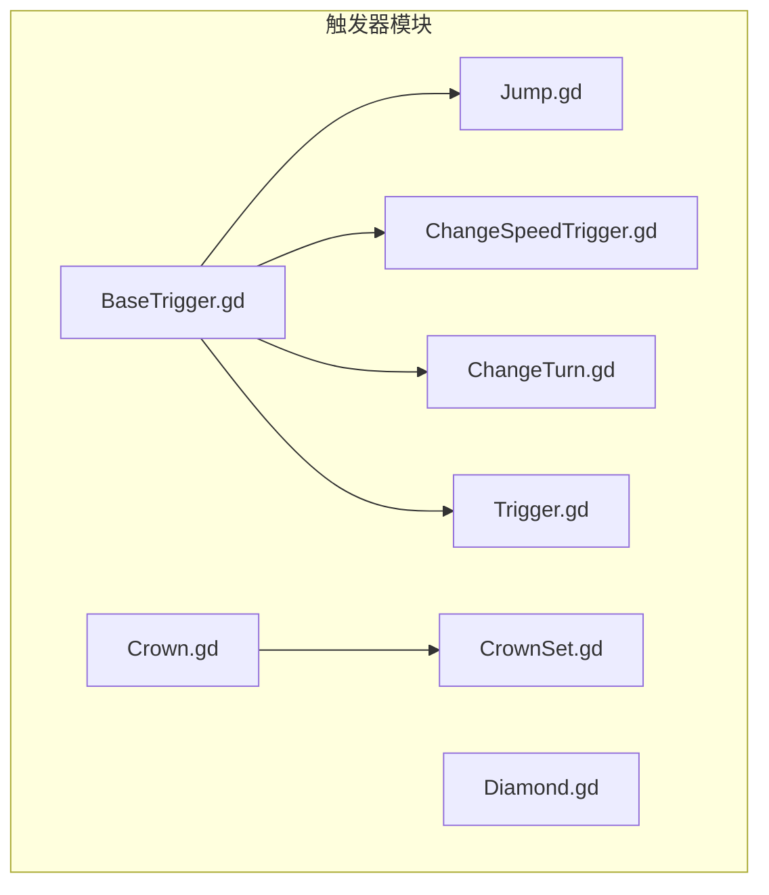
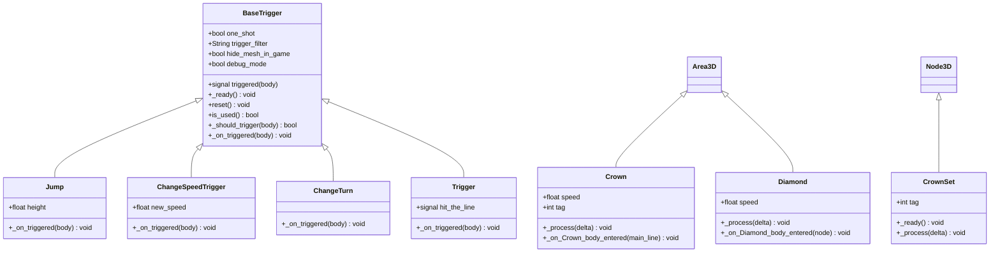
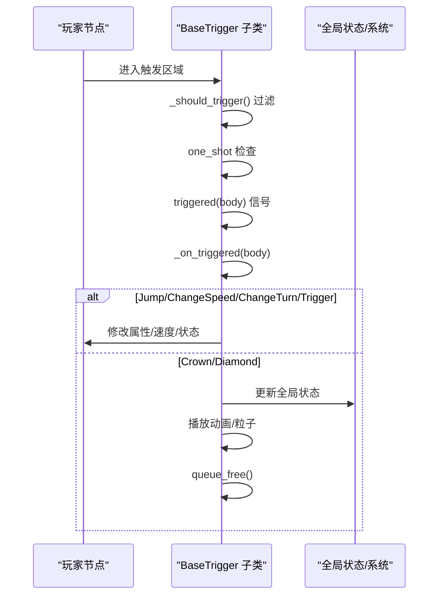

# 触发器系统API

<cite>
**本文档引用的文件**
- [BaseTrigger.gd](file://#Template/[Scripts]/Trigger/BaseTrigger.gd)
- [Jump.gd](file://#Template/[Scripts]/Trigger/Jump.gd)
- [ChangeSpeedTrigger.gd](file://#Template/[Scripts]/Trigger/ChangeSpeedTrigger.gd)
- [ChangeTurn.gd](file://#Template/[Scripts]/Trigger/ChangeTurn.gd)
- [Trigger.gd](file://#Template/[Scripts]/Trigger/Trigger.gd)
- [Crown.gd](file://#Template/[Scripts]/Trigger/Crown.gd)
- [Diamond.gd](file://#Template/[Scripts]/Trigger/Diamond.gd)
- [CrownSet.gd](file://#Template/[Scripts]/Trigger/CrownSet.gd)
</cite>

## 目录
1. [简介](#简介)
2. [项目结构](#项目结构)
3. [核心组件](#核心组件)
4. [架构总览](#架构总览)
5. [详细组件分析](#详细组件分析)
6. [依赖关系分析](#依赖关系分析)
7. [性能考虑](#性能考虑)
8. [故障排查指南](#故障排查指南)
9. [结论](#结论)
10. [附录](#附录)

## 简介
本文件系统性梳理触发器系统API，覆盖基础触发器基类 BaseTrigger 的接口规范与继承要求，并详细说明各类具体触发器（如 Jump、ChangeSpeed、ChangeTurn、Trigger、Crown、Diamond、CrownSet）的API、生命周期方法、参数配置与事件回调机制。同时提供触发器的创建、激活、销毁流程规范，以及扩展开发的接口指南与最佳实践，帮助开发者正确集成触发器与游戏系统之间的数据传递。

## 项目结构
触发器相关脚本集中于模板目录下的 Trigger 文件夹，采用“继承基类 + 具体实现”的分层设计：
- 基类：BaseTrigger（统一触发逻辑、过滤器、一次性触发与信号发射）
- 具体触发器：Jump、ChangeSpeed、ChangeTurn、Trigger（继承 BaseTrigger）
- 场景级触发器：Crown、Diamond（直接继承 Area3D，内部访问全局状态 State）
- 场景联动组件：CrownSet（根据全局状态驱动动画）

图表来源
- [BaseTrigger.gd:1-102](file://#Template/[Scripts]/Trigger/BaseTrigger.gd#L1-L102)
- [Jump.gd:1-13](file://#Template/[Scripts]/Trigger/Jump.gd#L1-L13)
- [ChangeSpeedTrigger.gd:1-15](file://#Template/[Scripts]/Trigger/ChangeSpeedTrigger.gd#L1-L15)
- [ChangeTurn.gd:1-10](file://#Template/[Scripts]/Trigger/ChangeTurn.gd#L1-L10)
- [Trigger.gd:1-10](file://#Template/[Scripts]/Trigger/Trigger.gd#L1-L10)
- [Crown.gd:1-58](file://#Template/[Scripts]/Trigger/Crown.gd#L1-L58)
- [Diamond.gd:1-17](file://#Template/[Scripts]/Trigger/Diamond.gd#L1-L17)
- [CrownSet.gd:1-21](file://#Template/[Scripts]/Trigger/CrownSet.gd#L1-L21)

章节来源
- [BaseTrigger.gd:1-102](file://#Template/[Scripts]/Trigger/BaseTrigger.gd#L1-L102)
- [Jump.gd:1-13](file://#Template/[Scripts]/Trigger/Jump.gd#L1-L13)
- [ChangeSpeedTrigger.gd:1-15](file://#Template/[Scripts]/Trigger/ChangeSpeedTrigger.gd#L1-L15)
- [ChangeTurn.gd:1-10](file://#Template/[Scripts]/Trigger/ChangeTurn.gd#L1-L10)
- [Trigger.gd:1-10](file://#Template/[Scripts]/Trigger/Trigger.gd#L1-L10)
- [Crown.gd:1-58](file://#Template/[Scripts]/Trigger/Crown.gd#L1-L58)
- [Diamond.gd:1-17](file://#Template/[Scripts]/Trigger/Diamond.gd#L1-L17)
- [CrownSet.gd:1-21](file://#Template/[Scripts]/Trigger/CrownSet.gd#L1-L21)

## 核心组件
本节聚焦 BaseTrigger 基类的接口规范与继承要求，明确子类必须实现的方法、可重写的行为以及公共能力。

- 继承关系
  - 所有具体触发器均继承自 BaseTrigger，复用统一的触发检测、信号发射与一次性触发逻辑。
  - 场景级触发器（Crown、Diamond）直接继承 Area3D，通过全局状态 State 与游戏系统交互。

- 关键导出属性（@export）
  - one_shot：布尔值，控制触发器是否仅触发一次
  - trigger_filter：字符串枚举，决定允许触发的节点类型
    - 可选值："CharacterBody3D"、"PhysicsBody3D"、"Any"
  - hide_mesh_in_game：布尔值，运行时隐藏 MeshInstance3D 子节点
  - debug_mode：布尔值，启用后在控制台输出触发日志
  - 说明：trigger_filter 默认行为会回退到 CharacterBody3D 类型校验

- 生命周期与事件
  - _ready：编辑器模式下跳过；运行时隐藏网格并建立触发信号连接
  - _on_body_entered：入口触发处理，执行过滤、一次性触发检查、发出 triggered 信号、调用子类 _on_triggered
  - triggered(body)：信号，参数为触发该触发器的节点
  - reset()：重置触发状态（适用于 one_shot）
  - is_used()：查询是否已触发

- 可重写方法
  - _should_trigger(body)：默认按 trigger_filter 判断，子类可扩展复杂条件
  - _on_triggered(body)：子类必须实现，完成具体的触发效果

- 辅助方法
  - _hide_mesh()：隐藏 MeshInstance3D 子节点
  - _setup_trigger()：确保 body_entered 信号仅连接一次

章节来源
- [BaseTrigger.gd:11-22](file://#Template/[Scripts]/Trigger/BaseTrigger.gd#L11-L22)
- [BaseTrigger.gd:29-39](file://#Template/[Scripts]/Trigger/BaseTrigger.gd#L29-L39)
- [BaseTrigger.gd:41-44](file://#Template/[Scripts]/Trigger/BaseTrigger.gd#L41-L44)
- [BaseTrigger.gd:46-51](file://#Template/[Scripts]/Trigger/BaseTrigger.gd#L46-L51)
- [BaseTrigger.gd:53-73](file://#Template/[Scripts]/Trigger/BaseTrigger.gd#L53-L73)
- [BaseTrigger.gd:74-87](file://#Template/[Scripts]/Trigger/BaseTrigger.gd#L74-L87)
- [BaseTrigger.gd:88-91](file://#Template/[Scripts]/Trigger/BaseTrigger.gd#L88-L91)
- [BaseTrigger.gd:93-101](file://#Template/[Scripts]/Trigger/BaseTrigger.gd#L93-L101)

## 架构总览
触发器系统采用“基类统一 + 子类定制”的架构，确保不同触发器共享一致的生命周期与事件模型，同时允许子类专注于特定效果实现。

图表来源
- [BaseTrigger.gd:1-102](file://#Template/[Scripts]/Trigger/BaseTrigger.gd#L1-L102)
- [Jump.gd:1-13](file://#Template/[Scripts]/Trigger/Jump.gd#L1-L13)
- [ChangeSpeedTrigger.gd:1-15](file://#Template/[Scripts]/Trigger/ChangeSpeedTrigger.gd#L1-L15)
- [ChangeTurn.gd:1-10](file://#Template/[Scripts]/Trigger/ChangeTurn.gd#L1-L10)
- [Trigger.gd:1-10](file://#Template/[Scripts]/Trigger/Trigger.gd#L1-L10)
- [Crown.gd:1-58](file://#Template/[Scripts]/Trigger/Crown.gd#L1-L58)
- [Diamond.gd:1-17](file://#Template/[Scripts]/Trigger/Diamond.gd#L1-L17)
- [CrownSet.gd:1-21](file://#Template/[Scripts]/Trigger/CrownSet.gd#L1-L21)

## 详细组件分析

### BaseTrigger 基类 API
- 导出属性
  - one_shot：一次性触发开关
  - trigger_filter：触发过滤器，支持三类节点类型
  - hide_mesh_in_game：运行时隐藏可视化网格
  - debug_mode：调试日志开关
- 信号
  - triggered(body)：触发时发出，携带触发者节点
- 生命周期
  - _ready：隐藏网格、建立触发信号连接
  - _on_body_entered：过滤判断 → 一次性触发检查 → 发出信号 → 调用子类处理
- 可重写
  - _should_trigger：自定义触发条件
  - _on_triggered：子类必须实现的效果逻辑
- 实用方法
  - reset：重置触发状态
  - is_used：查询触发状态

章节来源
- [BaseTrigger.gd:11-22](file://#Template/[Scripts]/Trigger/BaseTrigger.gd#L11-L22)
- [BaseTrigger.gd:29-39](file://#Template/[Scripts]/Trigger/BaseTrigger.gd#L29-L39)
- [BaseTrigger.gd:53-73](file://#Template/[Scripts]/Trigger/BaseTrigger.gd#L53-L73)
- [BaseTrigger.gd:74-87](file://#Template/[Scripts]/Trigger/BaseTrigger.gd#L74-L87)
- [BaseTrigger.gd:88-91](file://#Template/[Scripts]/Trigger/BaseTrigger.gd#L88-L91)
- [BaseTrigger.gd:93-101](file://#Template/[Scripts]/Trigger/BaseTrigger.gd#L93-L101)

### Jump 跳跃触发器
- 继承：BaseTrigger
- 参数
  - height：跳跃高度（用于计算初始速度）
- 行为
  - 进入触发区域时，对 CharacterBody3D 的速度施加向上分量
- 注意
  - 仅对具备速度属性的节点生效

章节来源
- [Jump.gd:1-13](file://#Template/[Scripts]/Trigger/Jump.gd#L1-L13)

### ChangeSpeedTrigger 速度改变触发器
- 继承：BaseTrigger
- 参数
  - new_speed：新的移动速度值
- 行为
  - 对具备 speed 属性的节点进行赋值
  - 若节点处于“已开始移动”状态，则同步更新速度向量

章节来源
- [ChangeSpeedTrigger.gd:1-15](file://#Template/[Scripts]/Trigger/ChangeSpeedTrigger.gd#L1-L15)

### ChangeTurn 转向改变触发器
- 继承：BaseTrigger
- 行为
  - 切换目标节点的转向状态（布尔值取反）

章节来源
- [ChangeTurn.gd:1-10](file://#Template/[Scripts]/Trigger/ChangeTurn.gd#L1-L10)

### Trigger 通用触发器
- 继承：BaseTrigger
- 信号
  - hit_the_line：发射给其他节点监听
- 行为
  - 触发时发出通用信号

章节来源
- [Trigger.gd:1-10](file://#Template/[Scripts]/Trigger/Trigger.gd#L1-L10)

### Crown 皇冠触发器
- 继承：Area3D
- 参数
  - speed：旋转速度
  - tag：标识（1/2/3），用于区分不同皇冠
- 行为
  - 每帧自旋
  - 玩家接触时：
    - 更新全局状态（如皇冠计数、相机跟随参数、动画时间等）
    - 播放拾取动画并等待结束
    - 自身释放

章节来源
- [Crown.gd:1-58](file://#Template/[Scripts]/Trigger/Crown.gd#L1-L58)

### Diamond 钻石触发器
- 继承：Area3D
- 参数
  - speed：旋转速度
- 行为
  - 每帧自旋（运行时）
  - 玩家接触时：
    - 增加全局钻石计数
    - 播放拾取动画并开启粒子效果
    - 等待粒子结束后释放

章节来源
- [Diamond.gd:1-17](file://#Template/[Scripts]/Trigger/Diamond.gd#L1-L17)

### CrownSet 皇冠集合控制器
- 继承：Node3D
- 参数
  - tag：当前标签
- 行为
  - 在场景就绪时播放重置动画
  - 每帧检查全局状态，当满足条件时播放“皇冠变化”动画并清空标签

章节来源
- [CrownSet.gd:1-21](file://#Template/[Scripts]/Trigger/CrownSet.gd#L1-L21)

## 依赖关系分析
- 触发器与节点类型
  - BaseTrigger 依赖 Area3D 的碰撞体事件（body_entered）
  - Jump/ChangeSpeed/ChangeTurn/Trigger 依赖 CharacterBody3D 或具备特定属性的节点
- 触发器与全局状态
  - Crown/Diamond 直接访问全局状态对象（如 State），用于跨场景数据传递
- 触发器与相机跟随
  - Crown 在拾取时尝试从当前场景查找相机跟随节点并读取其参数，用于后续镜头过渡

图表来源
- [BaseTrigger.gd:53-73](file://#Template/[Scripts]/Trigger/BaseTrigger.gd#L53-L73)
- [Jump.gd:8-12](file://#Template/[Scripts]/Trigger/Jump.gd#L8-L12)
- [ChangeSpeedTrigger.gd:8-14](file://#Template/[Scripts]/Trigger/ChangeSpeedTrigger.gd#L8-L14)
- [ChangeTurn.gd:6-9](file://#Template/[Scripts]/Trigger/ChangeTurn.gd#L6-L9)
- [Trigger.gd:8-9](file://#Template/[Scripts]/Trigger/Trigger.gd#L8-L9)
- [Crown.gd:25-57](file://#Template/[Scripts]/Trigger/Crown.gd#L25-L57)
- [Diamond.gd:7-12](file://#Template/[Scripts]/Trigger/Diamond.gd#L7-L12)

章节来源
- [BaseTrigger.gd:53-73](file://#Template/[Scripts]/Trigger/BaseTrigger.gd#L53-L73)
- [Crown.gd:25-57](file://#Template/[Scripts]/Trigger/Crown.gd#L25-L57)
- [Diamond.gd:7-12](file://#Template/[Scripts]/Trigger/Diamond.gd#L7-L12)

## 性能考虑
- 一次性触发优化
  - 使用 one_shot 减少重复处理开销，避免频繁修改节点状态
- 信号连接去重
  - 基类在首次连接后标记，防止重复连接导致的性能与逻辑问题
- 运行时隐藏网格
  - hide_mesh_in_game 可降低渲染开销，尤其在大量触发器场景中
- 动画与粒子
  - Crown/Diamond 的动画与粒子在触发后才启动，避免常驻资源占用
- 节点查找
  - Crown 在触发时查找相机跟随节点，建议在场景初始化阶段缓存引用以减少每帧查找成本

## 故障排查指南
- 触发无效
  - 检查 trigger_filter 是否与目标节点类型匹配
  - 确认 one_shot 已被使用且未重置
- 效果未生效
  - Jump/ChangeSpeed/ChangeTurn 仅对具备对应属性的节点有效
  - ChangeSpeedTrigger 需要节点处于“已开始移动”状态才能同步速度向量
- 日志定位
  - 启用 debug_mode 查看触发日志
- 资源释放
  - Crown/Diamond/DiamondSet 在动画完成后释放自身，避免内存泄漏

章节来源
- [BaseTrigger.gd:53-73](file://#Template/[Scripts]/Trigger/BaseTrigger.gd#L53-L73)
- [BaseTrigger.gd:93-97](file://#Template/[Scripts]/Trigger/BaseTrigger.gd#L93-L97)
- [Jump.gd:8-12](file://#Template/[Scripts]/Trigger/Jump.gd#L8-L12)
- [ChangeSpeedTrigger.gd:8-14](file://#Template/[Scripts]/Trigger/ChangeSpeedTrigger.gd#L8-L14)
- [ChangeTurn.gd:6-9](file://#Template/[Scripts]/Trigger/ChangeTurn.gd#L6-L9)

## 结论
触发器系统通过 BaseTrigger 提供统一的触发框架，结合具体触发器实现多样化的游戏效果。场景级触发器（Crown、Diamond）与全局状态交互，形成完整的数据流。遵循本文档的接口规范与最佳实践，可快速扩展新触发器并保证与游戏系统的稳定集成。

## 附录

### 创建、激活、销毁流程规范
- 创建
  - 将触发器脚本挂载至场景中的 Area3D 节点
  - 配置导出参数（如 one_shot、trigger_filter、hide_mesh_in_game、debug_mode）
- 激活
  - 玩家进入触发区域触发 _on_body_entered
  - 基类执行过滤与一次性检查，发出 triggered 信号并调用 _on_triggered
- 销毁
  - 场景级触发器在完成动画与粒子后释放自身
  - 通用触发器（如 Trigger）不负责释放，由场景管理

章节来源
- [BaseTrigger.gd:29-39](file://#Template/[Scripts]/Trigger/BaseTrigger.gd#L29-L39)
- [BaseTrigger.gd:53-73](file://#Template/[Scripts]/Trigger/BaseTrigger.gd#L53-L73)
- [Crown.gd:55-57](file://#Template/[Scripts]/Trigger/Crown.gd#L55-L57)
- [Diamond.gd:11-12](file://#Template/[Scripts]/Trigger/Diamond.gd#L11-L12)

### 扩展开发接口指南与最佳实践
- 继承与实现
  - 新触发器应继承 BaseTrigger 并实现 _on_triggered
  - 如需自定义触发条件，重写 _should_trigger
- 参数设计
  - 使用 @export 明确导出项，保持 UI 可配置性
  - 为不同节点类型准备兼容逻辑（如属性存在性检查）
- 事件与状态
  - 优先通过信号与其他节点解耦
  - 场景级交互使用全局状态对象，注意命名与作用域
- 性能与体验
  - 合理使用 one_shot 与 hide_mesh_in_game
  - 动画与粒子在触发后才启动，避免常驻资源
  - 在场景初始化阶段缓存常用节点引用

章节来源
- [BaseTrigger.gd:74-87](file://#Template/[Scripts]/Trigger/BaseTrigger.gd#L74-L87)
- [BaseTrigger.gd:88-91](file://#Template/[Scripts]/Trigger/BaseTrigger.gd#L88-L91)
- [Crown.gd:25-57](file://#Template/[Scripts]/Trigger/Crown.gd#L25-L57)