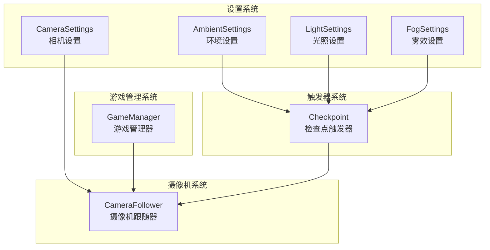
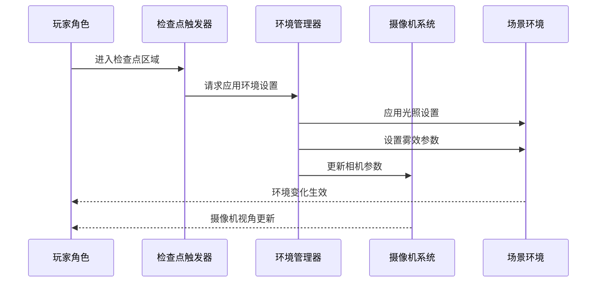
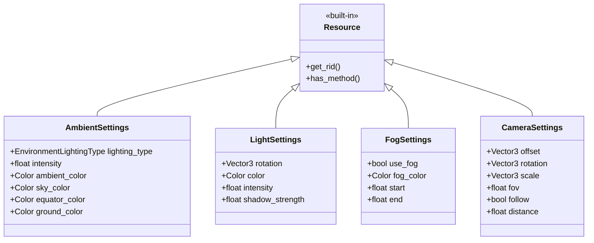
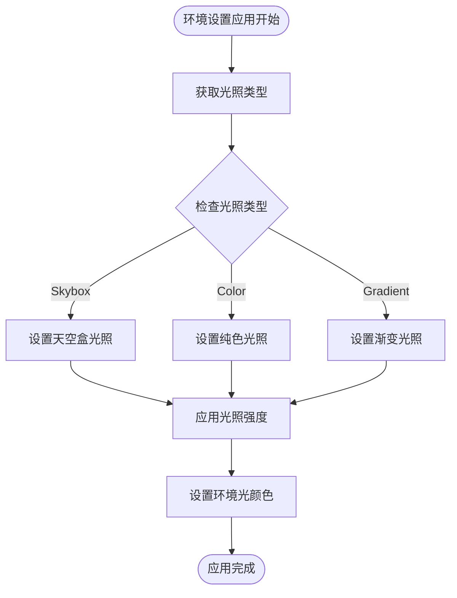
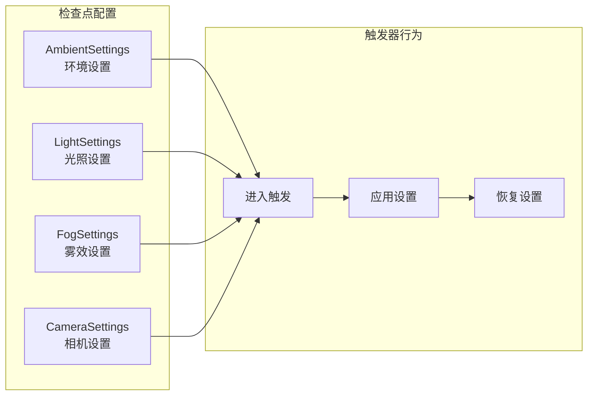
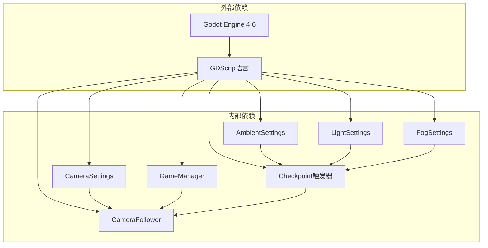

# 环境设置

<cite>
**本文档引用的文件**
- [AmbientSettings.gd](file://#Template/[Scripts]/Settings/AmbientSettings.gd)
- [LightSettings.gd](file://#Template/[Scripts]/Settings/LightSettings.gd)
- [FogSettings.gd](file://#Template/[Scripts]/Settings/FogSettings.gd)
- [CameraSettings.gd](file://#Template/[Scripts]/Settings/CameraSettings.gd)
- [Checkpoint.gd](file://#Template/[Scripts]/Trigger/Checkpoint.gd)
- [CameraFollower.gd](file://#Template/[Scripts]/CameraScripts/CameraFollower.gd)
- [GameManager.gd](file://#Template/[Scripts]/GameManager.gd)
- [README.md](file://README.md)
</cite>

## 目录
1. [简介](#简介)
2. [项目结构](#项目结构)
3. [核心组件](#核心组件)
4. [架构概览](#架构概览)
5. [详细组件分析](#详细组件分析)
6. [依赖关系分析](#依赖关系分析)
7. [性能考虑](#性能考虑)
8. [故障排除指南](#故障排除指南)
9. [结论](#结论)

## 简介

Ambient Settings（环境设置）是Godot Line模板中的一个关键系统，负责管理3D场景的环境光照、雾效和相机参数。该系统提供了统一的资源管理方式，允许开发者通过导出变量在编辑器中直观地调整场景的视觉效果。

本系统基于Godot Engine 4.6开发，采用了模块化的设计模式，将不同的环境参数分离到独立的设置类中，便于维护和扩展。通过Resource基类的继承，这些设置可以被序列化保存，并在运行时动态应用到场景中。

## 项目结构

项目采用分层架构组织，环境设置系统位于Settings目录下，与其他系统如触发器、摄像机脚本等协同工作：

**图表来源**
- [AmbientSettings.gd:1-12](file://#Template/[Scripts]/Settings/AmbientSettings.gd#L1-L12)
- [LightSettings.gd:1-7](file://#Template/[Scripts]/Settings/LightSettings.gd#L1-L7)
- [FogSettings.gd:1-7](file://#Template/[Scripts]/Settings/FogSettings.gd#L1-L7)
- [CameraSettings.gd:1-9](file://#Template/[Scripts]/Settings/CameraSettings.gd#L1-L9)

**章节来源**
- [README.md:52-61](file://README.md#L52-L61)

## 核心组件

环境设置系统由四个主要组件构成，每个组件都继承自Resource基类，提供特定的环境参数控制：

### AmbientSettings（环境设置）
- **职责**：管理场景的整体环境光照和天空盒设置
- **关键属性**：
  - 环境光照类型枚举（Skybox、Color、Gradient）
  - 光照强度调节
  - 环境颜色配置
  - 天空盒颜色渐变设置

### LightSettings（光照设置）
- **职责**：控制场景中的定向光源参数
- **关键属性**：
  - 光源旋转角度
  - 光源颜色
  - 光照强度
  - 阴影强度

### FogSettings（雾效设置）
- **职责**：管理场景的雾化效果
- **关键属性**：
  - 是否启用雾效
  - 雾的颜色
  - 雾的起始距离
  - 雾的结束距离

### CameraSettings（相机设置）
- **职责**：定义相机的变换参数
- **关键属性**：
  - 相机偏移量
  - 相机旋转角度
  - 相机缩放
  - 视场角
  - 跟随模式
  - 距离参数

**章节来源**
- [AmbientSettings.gd:1-12](file://#Template/[Scripts]/Settings/AmbientSettings.gd#L1-L12)
- [LightSettings.gd:1-7](file://#Template/[Scripts]/Settings/LightSettings.gd#L1-L7)
- [FogSettings.gd:1-7](file://#Template/[Scripts]/Settings/FogSettings.gd#L1-L7)
- [CameraSettings.gd:1-9](file://#Template/[Scripts]/Settings/CameraSettings.gd#L1-L9)

## 架构概览

环境设置系统采用事件驱动的架构模式，通过检查点触发器来应用环境变化：

**图表来源**
- [Checkpoint.gd:14-27](file://#Template/[Scripts]/Trigger/Checkpoint.gd#L14-L27)
- [Checkpoint.gd:104-156](file://#Template/[Scripts]/Trigger/Checkpoint.gd#L104-L156)

## 详细组件分析

### 环境设置类结构

**图表来源**
- [AmbientSettings.gd:1-12](file://#Template/[Scripts]/Settings/AmbientSettings.gd#L1-L12)
- [LightSettings.gd:1-7](file://#Template/[Scripts]/Settings/LightSettings.gd#L1-L7)
- [FogSettings.gd:1-7](file://#Template/[Scripts]/Settings/FogSettings.gd#L1-L7)
- [CameraSettings.gd:1-9](file://#Template/[Scripts]/Settings/CameraSettings.gd#L1-L9)

### 环境光照类型处理流程

**图表来源**
- [Checkpoint.gd:104-156](file://#Template/[Scripts]/Trigger/Checkpoint.gd#L104-L156)

### 检查点触发器集成

检查点触发器是环境设置系统的核心协调者，负责在游戏进程中的关键节点应用环境变化：

**图表来源**
- [Checkpoint.gd:14-27](file://#Template/[Scripts]/Trigger/Checkpoint.gd#L14-L27)

**章节来源**
- [Checkpoint.gd:14-27](file://#Template/[Scripts]/Trigger/Checkpoint.gd#L14-L27)
- [Checkpoint.gd:104-156](file://#Template/[Scripts]/Trigger/Checkpoint.gd#L104-L156)

## 依赖关系分析

环境设置系统与其他项目组件存在以下依赖关系：

**图表来源**
- [AmbientSettings.gd:1-12](file://#Template/[Scripts]/Settings/AmbientSettings.gd#L1-L12)
- [Checkpoint.gd:14-27](file://#Template/[Scripts]/Trigger/Checkpoint.gd#L14-L27)
- [CameraFollower.gd:20-90](file://#Template/[Scripts]/CameraScripts/CameraFollower.gd#L20-L90)

**章节来源**
- [GameManager.gd:1-50](file://#Template/[Scripts]/GameManager.gd#L1-L50)
- [CameraFollower.gd:20-90](file://#Template/[Scripts]/CameraScripts/CameraFollower.gd#L20-L90)

## 性能考虑

环境设置系统在设计时充分考虑了性能优化：

### 内存管理
- 所有设置类都继承自Resource，支持Godot的自动内存管理
- 设置对象可以在场景间共享，减少内存占用
- 及时释放不再使用的设置对象

### 渲染优化
- 环境光照类型的选择影响渲染性能
- Skybox光照通常比复杂光照计算更高效
- 雾效的启用会增加片段着色器的计算负担

### 实时更新策略
- 检查点触发时才应用环境变化，避免不必要的实时修改
- 支持渐进式环境过渡，提升用户体验

## 故障排除指南

### 常见问题及解决方案

**环境设置不生效**
- 检查检查点触发器是否正确配置
- 确认环境设置对象已正确赋值给触发器
- 验证场景中是否存在对应的环境节点

**光照显示异常**
- 检查光照强度值是否在有效范围内
- 确认光源方向设置是否合理
- 验证阴影强度设置不会导致过度模糊

**雾效问题**
- 检查起始和结束距离的相对关系
- 确认雾颜色与场景对比度适中
- 验证雾效启用状态

**相机设置错误**
- 检查相机偏移量是否合理
- 确认视场角设置符合预期
- 验证跟随模式配置

**章节来源**
- [Checkpoint.gd:104-156](file://#Template/[Scripts]/Trigger/Checkpoint.gd#L104-L156)

## 结论

Ambient Settings系统为Godot Line模板提供了强大而灵活的环境控制能力。通过模块化的组件设计和事件驱动的应用机制，开发者可以轻松创建丰富的视觉效果体验。

该系统的主要优势包括：
- **模块化设计**：独立的设置类便于维护和扩展
- **可视化编辑**：通过导出变量在编辑器中直观调整
- **事件驱动**：基于检查点的环境切换机制
- **性能优化**：合理的内存管理和渲染优化策略

未来可以考虑的功能增强：
- 添加更多环境效果类型（如体积雾、后处理效果）
- 实现环境设置的平滑过渡动画
- 增加环境参数的动态调整接口
- 支持环境设置的预设管理功能