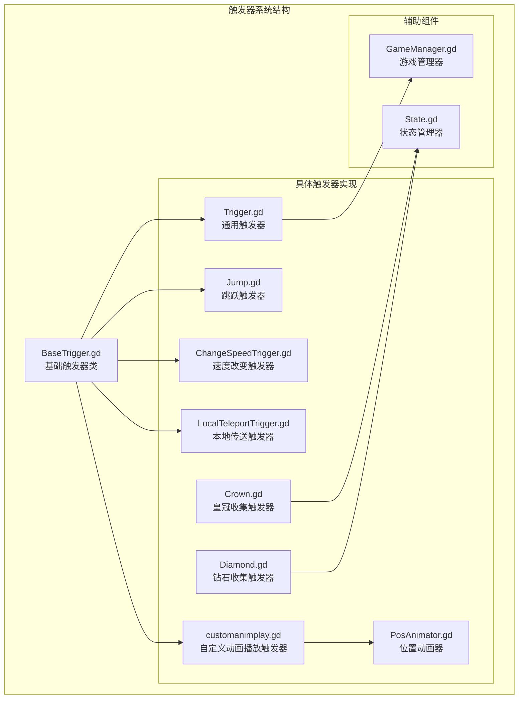
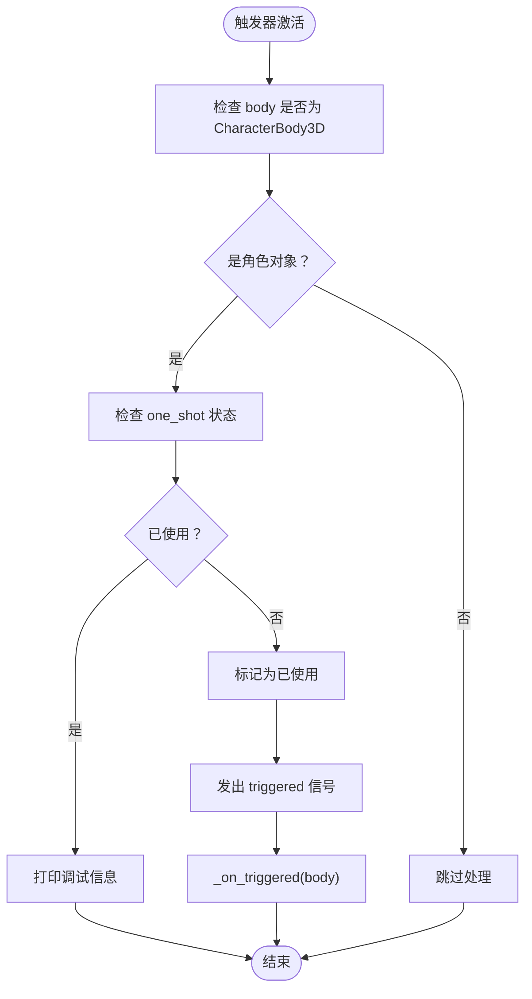
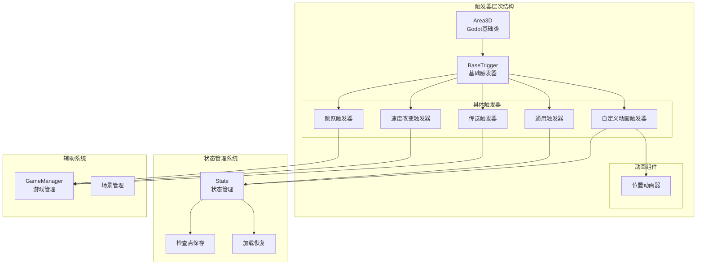
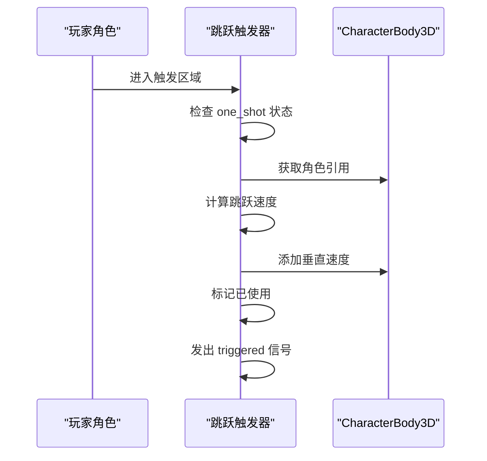
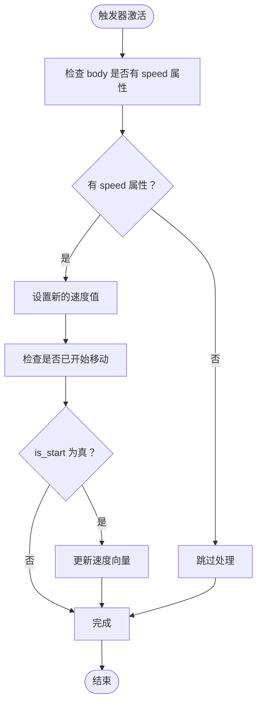
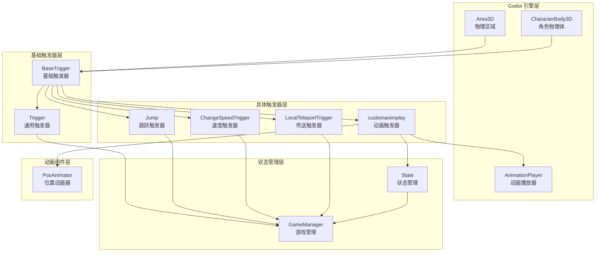
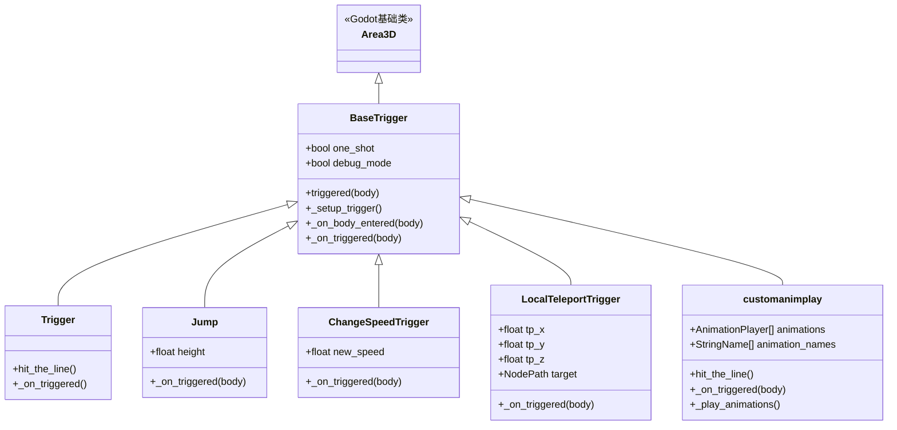

# 基础触发器

<cite>
**本文档引用的文件**
- [BaseTrigger.gd](file://#Template/[Scripts]/Trigger/BaseTrigger.gd)
- [Trigger.gd](file://#Template/[Scripts]/Trigger/Trigger.gd)
- [Jump.gd](file://#Template/[Scripts]/Trigger/Jump.gd)
- [ChangeSpeedTrigger.gd](file://#Template/[Scripts]/Trigger/ChangeSpeedTrigger.gd)
- [LocalTeleportTrigger.gd](file://#Template/[Scripts]/Trigger/LocalTeleportTrigger.gd)
- [customanimplay.gd](file://#Template/[Scripts]/Trigger/customanimplay.gd)
- [PosAnimator.gd](file://#Template/[Scripts]/Trigger/PosAnimator.gd)
- [Crown.gd](file://#Template/[Scripts]/Trigger/Crown.gd)
- [Diamond.gd](file://#Template/[Scripts]/Trigger/Diamond.gd)
- [GameManager.gd](file://#Template/[Scripts]/GameManager.gd)
- [State.gd](file://#Template/[Scripts]/State.gd)
</cite>

## 更新摘要
**所做更改**
- 更新了基础触发器类的简化说明，移除了复杂的过滤逻辑和网格隐藏机制
- 修订了触发器系统架构图，反映简化的继承关系
- 更新了性能考虑部分，强调简化的触发器处理逻辑
- 删除了不再存在的复杂过滤和网格隐藏功能说明

## 目录
1. [简介](#简介)
2. [项目结构](#项目结构)
3. [核心组件](#核心组件)
4. [架构概览](#架构概览)
5. [详细组件分析](#详细组件分析)
6. [依赖关系分析](#依赖关系分析)
7. [性能考虑](#性能考虑)
8. [故障排除指南](#故障排除指南)
9. [结论](#结论)

## 简介

基础触发器（BaseTrigger）是 Godot 游戏项目中的核心触发器系统基础类，为整个游戏的交互机制提供了统一的触发器框架。该系统基于 Area3D 节点构建，采用简化的继承模式设计，BaseTrigger 作为基类提供通用的触发器功能，其他具体触发器类通过继承 BaseTrigger 来实现特定功能。

**更新** 触发器系统已简化，移除了复杂的过滤逻辑和网格隐藏机制，专注于基本的一次性触发功能，提高了系统的可维护性和性能。

触发器系统还集成了状态管理机制，支持游戏进度的保存和恢复，为平台跳跃游戏提供了完整的交互基础设施。

## 项目结构

触发器系统位于项目的 Template Scripts 目录下，包含以下主要文件：

**图表来源**
- [BaseTrigger.gd:1-38](file://#Template/[Scripts]/Trigger/BaseTrigger.gd#L1-L38)
- [Trigger.gd:1-10](file://#Template/[Scripts]/Trigger/Trigger.gd#L1-L10)
- [GameManager.gd:1-50](file://#Template/[Scripts]/GameManager.gd#L1-L50)
- [State.gd:1-190](file://#Template/[Scripts]/State.gd#L1-L190)

**章节来源**
- [BaseTrigger.gd:1-38](file://#Template/[Scripts]/Trigger/BaseTrigger.gd#L1-L38)
- [Trigger.gd:1-10](file://#Template/[Scripts]/Trigger/Trigger.gd#L1-L10)

## 核心组件

### BaseTrigger 基础触发器类

**更新** BaseTrigger 已简化为核心触发器功能，移除了复杂的过滤逻辑和网格隐藏机制，专注于一次性触发功能。

BaseTrigger 是整个触发器系统的核心基础类，继承自 Area3D，提供了简化的触发器功能：

**主要特性：**
- **单次触发控制**：支持 one_shot 参数，防止触发器重复触发
- **调试模式**：提供 debug_mode 参数用于开发调试
- **信号系统**：发出 triggered 信号通知其他节点
- **自动连接**：自动建立与 body_entered 信号的连接

**关键属性：**
- `one_shot`: 布尔值，控制触发器是否只能触发一次
- `debug_mode`: 布尔值，启用调试输出
- `_used`: 内部状态变量，跟踪触发器使用情况
- `_signal_connected`: 内部状态变量，跟踪信号连接状态

**核心方法：**
- `_setup_trigger()`: 设置触发器的信号连接
- `_on_body_entered()`: 处理物体进入触发区域的逻辑，包含一次性触发检查
- `_on_triggered(_body: Node3D)`: 子类重写的方法，执行具体的触发逻辑

**简化逻辑流程：**

**图表来源**
- [BaseTrigger.gd:24-38](file://#Template/[Scripts]/Trigger/BaseTrigger.gd#L24-L38)

**章节来源**
- [BaseTrigger.gd:1-38](file://#Template/[Scripts]/Trigger/BaseTrigger.gd#L1-L38)

### GameManager 游戏管理器

GameManager 提供了游戏运行时的基本功能和工具方法：

**主要功能：**
- **相机管理**：管理 Camera3D 和 CameraFollower 节点
- **位置管理**：提供原点位置设置和获取功能
- **动画计算**：计算动画播放时间
- **导出工具**：提供编辑器工具按钮功能

**关键方法：**
- `get_camera_follower()`: 获取相机跟随器节点
- `calculate_anim_start_time()`: 计算动画开始时间
- 导出工具按钮：Origin Pos、Get Origin Pos

**章节来源**
- [GameManager.gd:1-50](file://#Template/[Scripts]/GameManager.gd#L1-L50)

### State 状态管理器

State 类提供了游戏状态的持久化和管理功能：

**状态分类：**
- **持久化检查点数据**：保存到磁盘的状态信息
- **运行时数据**：仅在场景存活期间有效的状态

**持久化状态包括：**
- 主线变换矩阵和转向状态
- 动画时间和音乐播放位置
- 游戏进度百分比和收集物品数量
- 相机跟随器检查点数据

**核心功能：**
- `save_checkpoint()`: 保存游戏检查点
- `load_checkpoint_to_main_line()`: 加载检查点到主线
- `save_to_dict()` 和 `load_from_dict()`: 序列化和反序列化状态
- `reset_to_defaults()`: 重置状态到默认值

**章节来源**
- [State.gd:1-190](file://#Template/[Scripts]/State.gd#L1-L190)

## 架构概览

**更新** 触发器系统的整体架构已简化，移除了复杂的过滤和网格隐藏机制，采用更直接的继承模式。

触发器系统的整体架构采用了简化的分层设计模式：

**图表来源**
- [BaseTrigger.gd:1-38](file://#Template/[Scripts]/Trigger/BaseTrigger.gd#L1-L38)
- [Trigger.gd:1-10](file://#Template/[Scripts]/Trigger/Trigger.gd#L1-L10)
- [State.gd:1-190](file://#Template/[Scripts]/State.gd#L1-L190)

## 详细组件分析

### 通用触发器 (Trigger)

通用触发器是最简单的触发器实现，继承自 BaseTrigger：

**功能特点：**
- 继承 BaseTrigger 的所有基础功能
- 发出 `hit_the_line` 信号
- 无额外的触发逻辑，主要用于测试和演示

**使用场景：**
- 作为触发器系统的示例
- 用于测试触发器连接
- 作为其他复杂触发器的基础

**章节来源**
- [Trigger.gd:1-10](file://#Template/[Scripts]/Trigger/Trigger.gd#L1-L10)

### 跳跃触发器 (Jump)

跳跃触发器继承自 BaseTrigger，为角色添加垂直跳跃能力：

**核心逻辑：**
- 计算跳跃所需的速度：`jump_speed = sqrt(2 * 9.8 * height)`
- 将跳跃速度添加到角色的垂直速度中
- 支持可配置的跳跃高度

**参数配置：**
- `height`: 跳跃的高度（米）
- 继承 BaseTrigger 的 one_shot 和 debug_mode 参数

**触发流程：**

**图表来源**
- [Jump.gd:1-13](file://#Template/[Scripts]/Trigger/Jump.gd#L1-L13)
- [BaseTrigger.gd:24-38](file://#Template/[Scripts]/Trigger/BaseTrigger.gd#L24-L38)

**章节来源**
- [Jump.gd:1-13](file://#Template/[Scripts]/Trigger/Jump.gd#L1-L13)

### 速度改变触发器 (ChangeSpeedTrigger)

速度改变触发器允许动态修改角色的移动速度：

**核心功能：**
- 修改目标对象的 `speed` 属性
- 立即更新速度向量，如果角色已经开始移动
- 支持条件检查，确保对象具有必要的属性

**触发逻辑：**

**图表来源**
- [ChangeSpeedTrigger.gd:1-15](file://#Template/[Scripts]/Trigger/ChangeSpeedTrigger.gd#L1-L15)

**章节来源**
- [ChangeSpeedTrigger.gd:1-15](file://#Template/[Scripts]/Trigger/ChangeSpeedTrigger.gd#L1-L15)

### 本地传送触发器 (LocalTeleportTrigger)

本地传送触发器提供位置传送功能：

**功能特性：**
- 支持相对坐标传送（tp_x, tp_y, tp_z）
- 可选的目标节点传送
- 调用 `new_line()` 方法重新初始化角色状态

**触发处理：**
- 对 CharacterBody3D 对象应用位置偏移
- 更新角色的新线条状态
- 如果设置了目标节点，同步更新目标位置

**章节来源**
- [LocalTeleportTrigger.gd:1-19](file://#Template/[Scripts]/Trigger/LocalTeleportTrigger.gd#L1-L19)

### 自定义动画播放触发器 (customanimplay.gd)

**更新** 自定义动画播放触发器已简化，移除了复杂的网格隐藏机制，专注于基本的动画播放功能。

自定义动画播放触发器提供了灵活的动画播放机制：

**核心特性：**
- 支持多个 AnimationPlayer 实例
- 可配置动画名称数组
- 编辑器集成的预览功能
- 自动播放当前或第一个可用动画

**动画播放逻辑：**

**图表来源**
- [customanimplay.gd:28-67](file://#Template/[Scripts]/Trigger/customanimplay.gd#L28-L67)

**章节来源**
- [customanimplay.gd:1-67](file://#Template/[Scripts]/Trigger/customanimplay.gd#L1-L67)

### 收集物品触发器

系统包含两种主要的收集物品触发器：皇冠和钻石。

#### 皇冠触发器 (Crown.gd)

**功能特点：**
- 旋转动画效果
- 收集后增加分数
- 调用 State.save_checkpoint() 保存检查点
- 播放收集动画并清理

**状态管理：**
- 增加 State.crown 计数
- 保存相机跟随器状态
- 标记收集的皇冠标签

**章节来源**
- [Crown.gd:1-22](file://#Template/[Scripts]/Trigger/Crown.gd#L1-L22)

#### 钻石触发器 (Diamond.gd)

**功能特点：**
- 旋转动画效果
- 收集后增加分数
- 播放收集动画和粒子效果
- 自动清理

**视觉反馈：**
- AnimationPlayer 播放钻石动画
- ParticleSystem 发射剩余粒子
- 完成后自动销毁

**章节来源**
- [Diamond.gd:1-15](file://#Template/[Scripts]/Trigger/Diamond.gd#L1-L15)

### 位置动画器 (PosAnimator)

位置动画器是一个独立的动画组件，可以与触发器系统配合使用：

**核心功能：**
- 在两个位置之间进行插值动画
- 支持多种过渡类型
- 提供开始和结束位置的编辑器工具
- 发出动画开始和结束信号

**使用方式：**
- 通过触发器的 `hit_the_line` 信号启动
- 支持工具按钮进行位置设置和预览
- 可以与其他动画组件组合使用

**章节来源**
- [PosAnimator.gd:1-44](file://#Template/[Scripts]/Trigger/PosAnimator.gd#L1-L44)

## 依赖关系分析

**更新** 依赖关系已简化，移除了复杂的过滤和网格隐藏机制，采用直接的继承关系。

触发器系统的依赖关系体现了简化的分层架构：

**图表来源**
- [BaseTrigger.gd:1-38](file://#Template/[Scripts]/Trigger/BaseTrigger.gd#L1-L38)
- [State.gd:1-190](file://#Template/[Scripts]/State.gd#L1-L190)
- [GameManager.gd:1-50](file://#Template/[Scripts]/GameManager.gd#L1-L50)

**触发器继承关系：**

**图表来源**
- [BaseTrigger.gd:1-38](file://#Template/[Scripts]/Trigger/BaseTrigger.gd#L1-L38)
- [Trigger.gd:1-10](file://#Template/[Scripts]/Trigger/Trigger.gd#L1-L10)
- [Jump.gd:1-13](file://#Template/[Scripts]/Trigger/Jump.gd#L1-L13)
- [ChangeSpeedTrigger.gd:1-15](file://#Template/[Scripts]/Trigger/ChangeSpeedTrigger.gd#L1-L15)
- [LocalTeleportTrigger.gd:1-19](file://#Template/[Scripts]/Trigger/LocalTeleportTrigger.gd#L1-L19)
- [customanimplay.gd:1-67](file://#Template/[Scripts]/Trigger/customanimplay.gd#L1-L67)

**章节来源**
- [BaseTrigger.gd:1-38](file://#Template/[Scripts]/Trigger/BaseTrigger.gd#L1-L38)
- [Trigger.gd:1-10](file://#Template/[Scripts]/Trigger/Trigger.gd#L1-L10)

## 性能考虑

**更新** 性能考虑已简化，重点关注简化的触发器处理逻辑和内存管理。

触发器系统在设计时考虑了多个性能优化方面：

### 信号连接优化
- BaseTrigger 只在需要时建立信号连接
- 使用 `_signal_connected` 标志避免重复连接
- 在 `_ready()` 中调用 `_setup_trigger()` 确保正确初始化

### 触发器状态管理
- 使用 `_used` 标志跟踪触发器使用状态
- one_shot 模式下避免不必要的处理
- 调试模式仅在启用时输出日志

### 内存管理
- 收集物品触发器在完成后自动调用 `queue_free()`
- AnimationPlayer 实例的有效性检查
- 目标节点引用的空值检查

### 动画性能
- Tween 动画使用 Godot 的内置插值算法
- 编辑器预览功能使用定时器自动复位
- 多个 AnimationPlayer 实例的批量处理

## 故障排除指南

### 常见问题及解决方案

**触发器不响应**
1. 检查触发器是否正确继承 BaseTrigger
2. 确认 one_shot 参数设置是否符合预期
3. 验证 CharacterBody3D 对象是否正确传递

**动画播放问题**
1. 检查 AnimationPlayer 节点是否正确连接
2. 确认动画名称是否存在于 AnimationPlayer 中
3. 验证触发器信号连接是否正常

**状态保存失败**
1. 检查 State.save_checkpoint() 调用参数
2. 确认相机跟随器节点是否存在
3. 验证 MusicPlayer 节点的播放状态

**章节来源**
- [BaseTrigger.gd:24-38](file://#Template/[Scripts]/Trigger/BaseTrigger.gd#L24-L38)
- [State.gd:46-66](file://#Template/[Scripts]/State.gd#L46-L66)

### 调试技巧

**启用调试模式**
- 设置 `debug_mode = true` 查看触发器活动日志
- 监听 triggered 信号进行调试
- 使用编辑器工具按钮验证功能

**性能监控**
- 监控触发器触发频率
- 检查 AnimationPlayer 性能影响
- 监控状态保存操作的执行时间

## 结论

**更新** 结论已更新，反映简化的基础触发器系统。

BaseTrigger 触发器系统为 Godot 游戏项目提供了一个强大而灵活的交互框架。通过简化的分层架构和模块化设计，系统支持多种触发器类型，同时保持了良好的可扩展性和维护性。

**主要优势：**
- **统一接口**：所有触发器共享相同的基类接口
- **易于扩展**：新触发器类型只需继承 BaseTrigger
- **状态管理**：完整的检查点保存和恢复机制
- **可视化编辑**：丰富的编辑器工具支持
- **性能优化**：简化的触发器处理逻辑提高了性能

**应用场景：**
- 平台跳跃游戏的平台触发
- 收集物品的游戏机制
- 场景切换和传送功能
- 动画触发和视觉效果

该系统为游戏开发者提供了一个可靠的触发器基础设施，可以根据具体游戏需求进行定制和扩展。简化的架构使其更加易于理解和维护，同时保持了足够的灵活性来支持各种游戏交互需求。