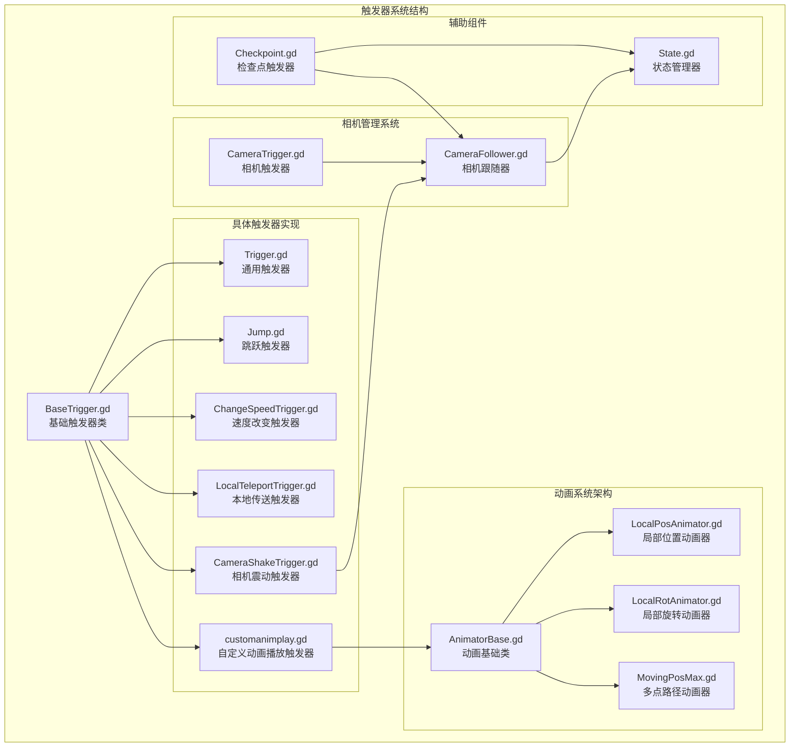
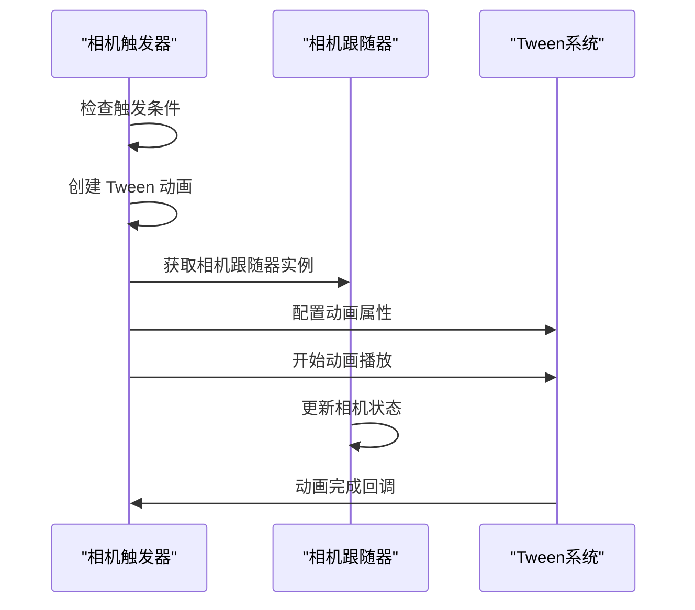
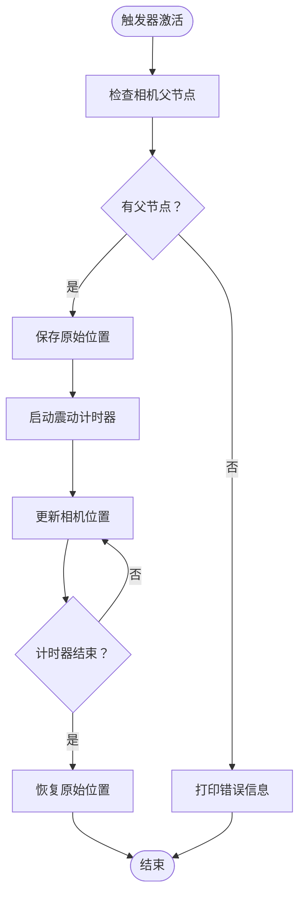
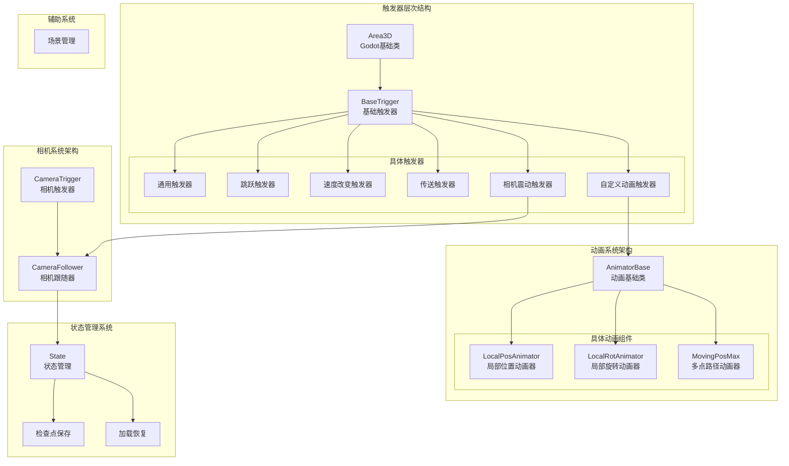
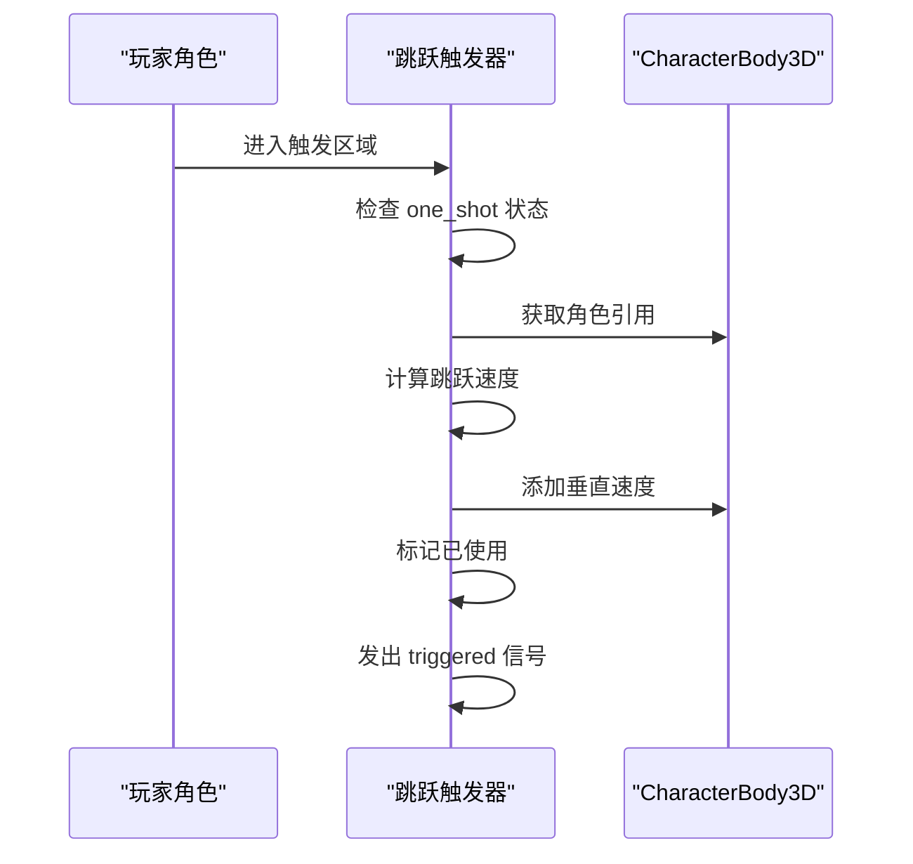
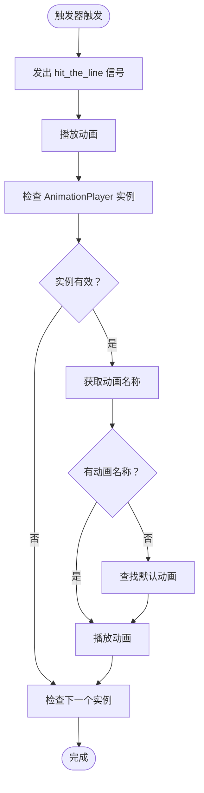
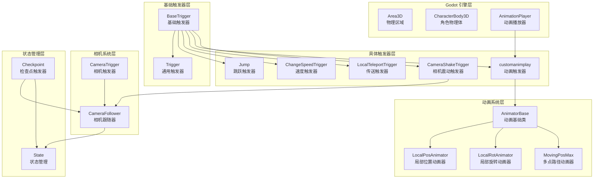
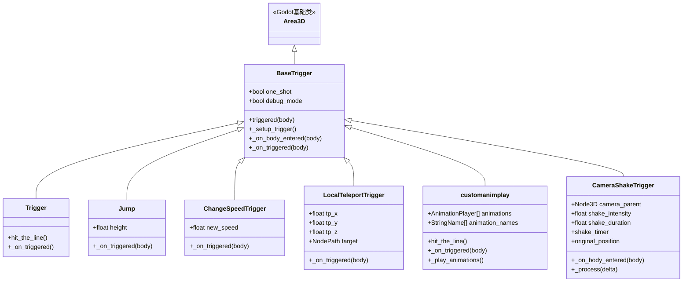
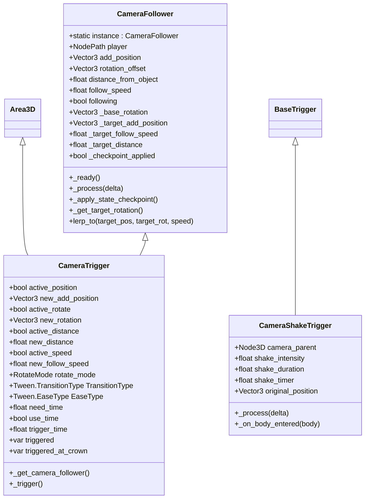
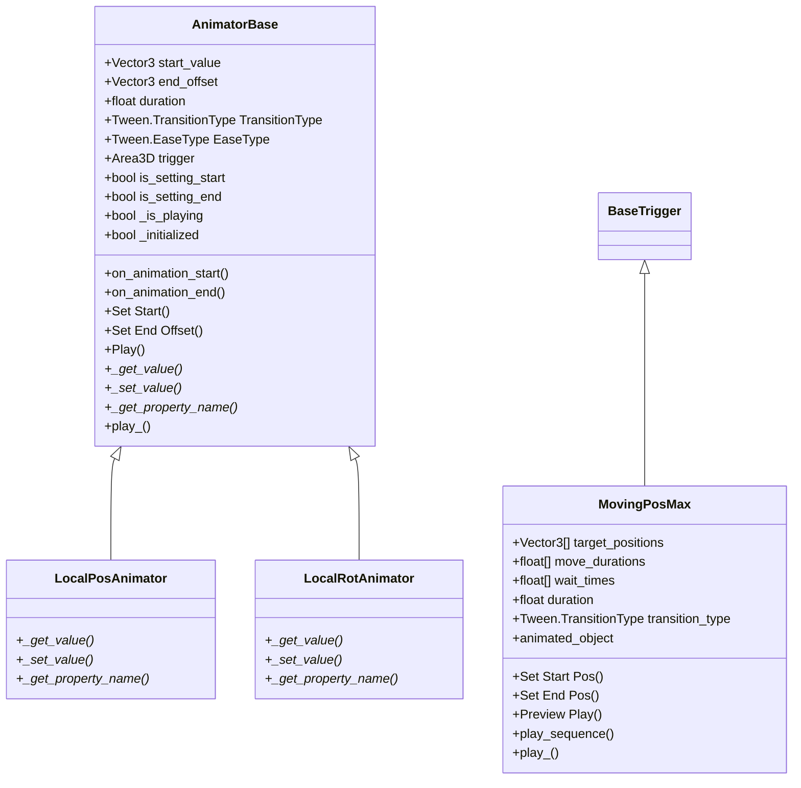

# 基础触发器

<cite>
**本文档引用的文件**
- [BaseTrigger.gd](file://#Template/[Scripts]/Trigger/BaseTrigger.gd)
- [Trigger.gd](file://#Template/[Scripts]/Trigger/Trigger.gd)
- [Jump.gd](file://#Template/[Scripts]/Trigger/Jump.gd)
- [ChangeSpeedTrigger.gd](file://#Template/[Scripts]/Trigger/ChangeSpeedTrigger.gd)
- [LocalTeleportTrigger.gd](file://#Template/[Scripts]/Trigger/LocalTeleportTrigger.gd)
- [customanimplay.gd](file://#Template/[Scripts]/Trigger/customanimplay.gd)
- [animplay.gd](file://#Template/[Scripts]/Trigger/animplay.gd)
- [AnimatorBase.gd](file://#Template/[Scripts]/Animator/AnimatorBase.gd)
- [LocalPosAnimator.gd](file://#Template/[Scripts]/Animator/LocalPosAnimator.gd)
- [LocalRotAnimator.gd](file://#Template/[Scripts]/Animator/LocalRotAnimator.gd)
- [MovingPosMax.gd](file://#Template/[Scripts]/Animator/MovingPosMax.gd)
- [Crown.gd](file://#Template/[Scripts]/Trigger/Crown.gd)
- [Diamond.gd](file://#Template/[Scripts]/Trigger/Diamond.gd)
- [CameraFollower.gd](file://#Template/[Scripts]/CameraScripts/CameraFollower.gd)
- [CameraTrigger.gd](file://#Template/[Scripts]/CameraScripts/CameraTrigger.gd)
- [CameraShakeTrigger.gd](file://#Template/[Scripts]/CameraScripts/CameraShakeTrigger.gd)
- [State.gd](file://#Template/[Scripts]/State.gd)
- [Checkpoint.gd](file://#Template/[Scripts]/Trigger/Checkpoint.gd)
</cite>

## 更新摘要
**所做更改**
- 更新了相机管理架构，从GameManager迁移到CameraFollower类
- 移除了对GameManager的引用，改为直接使用CameraFollower.instance
- 更新了相机检查点保存和恢复机制
- 修订了触发器系统架构图，反映新的相机管理方式
- 更新了性能考虑部分，强调新的相机跟随器架构

## 目录
1. [简介](#简介)
2. [项目结构](#项目结构)
3. [核心组件](#核心组件)
4. [架构概览](#架构概览)
5. [详细组件分析](#详细组件分析)
6. [依赖关系分析](#依赖关系分析)
7. [性能考虑](#性能考虑)
8. [故障排除指南](#故障排除指南)
9. [结论](#结论)

## 简介

基础触发器（BaseTrigger）是 Godot 游戏项目中的核心触发器系统基础类，为整个游戏的交互机制提供了统一的触发器框架。该系统基于 Area3D 节点构建，采用简化的继承模式设计，BaseTrigger 作为基类提供通用的触发器功能，其他具体触发器类通过继承 BaseTrigger 来实现特定功能。

**更新** 触发器系统已简化，移除了复杂的过滤逻辑和网格隐藏机制，专注于基本的一次性触发功能，提高了系统的可维护性和性能。

**更新** 相机管理架构已重构，从传统的GameManager迁移到CameraFollower类，提供更直接和高效的相机控制机制。新的架构通过静态实例管理相机跟随器，简化了相机状态的保存和恢复过程。

触发器系统还集成了状态管理机制，支持游戏进度的保存和恢复，为平台跳跃游戏提供了完整的交互基础设施。

## 项目结构

触发器系统位于项目的 Template Scripts 目录下，包含以下主要文件：

**图表来源**
- [BaseTrigger.gd:1-38](file://#Template/[Scripts]/Trigger/BaseTrigger.gd#L1-L38)
- [Trigger.gd:1-10](file://#Template/[Scripts]/Trigger/Trigger.gd#L1-L10)
- [CameraFollower.gd:1-150](file://#Template/[Scripts]/CameraScripts/CameraFollower.gd#L1-L150)
- [State.gd:1-159](file://#Template/[Scripts]/State.gd#L1-L159)
- [AnimatorBase.gd:1-88](file://#Template/[Scripts]/Animator/AnimatorBase.gd#L1-L88)

**章节来源**
- [BaseTrigger.gd:1-38](file://#Template/[Scripts]/Trigger/BaseTrigger.gd#L1-L38)
- [Trigger.gd:1-10](file://#Template/[Scripts]/Trigger/Trigger.gd#L1-L10)

## 核心组件

### BaseTrigger 基础触发器类

**更新** BaseTrigger 已简化为核心触发器功能，移除了复杂的过滤逻辑和网格隐藏机制，专注于一次性触发功能。

BaseTrigger 是整个触发器系统的核心基础类，继承自 Area3D，提供了简化的触发器功能：

**主要特性：**
- **单次触发控制**：支持 one_shot 参数，防止触发器重复触发
- **调试模式**：提供 debug_mode 参数用于开发调试
- **信号系统**：发出 triggered 信号通知其他节点
- **自动连接**：自动建立与 body_entered 信号的连接

**关键属性：**
- `one_shot`: 布尔值，控制触发器是否只能触发一次
- `debug_mode`: 布尔值，启用调试输出
- `_used`: 内部状态变量，跟踪触发器使用情况
- `_signal_connected`: 内部状态变量，跟踪信号连接状态

**核心方法：**
- `_setup_trigger()`: 设置触发器的信号连接
- `_on_body_entered()`: 处理物体进入触发区域的逻辑，包含一次性触发检查
- `_on_triggered(_body: Node3D)`: 子类重写的方法，执行具体的触发逻辑

**简化逻辑流程：**

**图表来源**
- [BaseTrigger.gd:24-38](file://#Template/[Scripts]/Trigger/BaseTrigger.gd#L24-L38)

**章节来源**
- [BaseTrigger.gd:1-38](file://#Template/[Scripts]/Trigger/BaseTrigger.gd#L1-L38)

### CameraFollower 相机跟随器

**更新** 相机管理架构已重构，CameraFollower类承担了原本由GameManager提供的相机管理功能。

CameraFollower 是新的相机管理系统核心，提供静态实例管理和完整的相机跟随功能：

**核心特性：**
- **静态实例管理**：通过 `instance` 静态变量提供全局访问
- **多模式跟随**：支持快速跟随、平滑跟随等多种跟随模式
- **旋转控制**：支持多种旋转模式，包括最短路径旋转和累加旋转
- **状态管理**：内置检查点状态跟踪和恢复机制
- **Tween 动画**：集成 Tween 动画系统实现平滑过渡

**关键属性：**
- `player`: NodePath，目标玩家节点路径
- `add_position`: Vector3，相机相对于玩家的偏移位置
- `rotation_offset`: Vector3，相机旋转偏移
- `distance_from_object`: float，相机与目标的距离
- `follow_speed`: float，跟随速度
- `following`: bool，是否启用跟随模式
- `_checkpoint_applied`: bool，检查点是否已应用

**核心方法：**
- `_ready()`: 初始化相机跟随器，设置静态实例
- `_process(delta)`: 主循环中的跟随逻辑更新
- `_apply_state_checkpoint()`: 应用状态检查点
- `_get_target_rotation()`: 计算目标旋转角度
- `lerp_to()`: 执行平滑过渡动画

**章节来源**
- [CameraFollower.gd:1-150](file://#Template/[Scripts]/CameraScripts/CameraFollower.gd#L1-L150)

### CameraTrigger 相机触发器

CameraTrigger 继承自 BaseTrigger，专门用于控制相机跟随器的行为：

**核心功能：**
- **相机参数控制**：动态修改相机跟随器的各种参数
- **时间触发**：支持基于游戏时间的触发机制
- **Tween 动画**：集成 Tween 系统实现平滑的相机变换
- **旋转模式支持**：支持多种旋转模式的切换

**触发逻辑：**

**图表来源**
- [CameraTrigger.gd:57-109](file://#Template/[Scripts]/CameraScripts/CameraTrigger.gd#L57-L109)

**章节来源**
- [CameraTrigger.gd:1-109](file://#Template/[Scripts]/CameraScripts/CameraTrigger.gd#L1-L109)

### CameraShakeTrigger 相机震动触发器

CameraShakeTrigger 继承自 BaseTrigger，提供相机震动效果：

**核心特性：**
- **继承 BaseTrigger 功能**：完全继承基础触发器的所有功能
- **震动效果**：通过随机偏移实现相机震动
- **定时控制**：支持震动持续时间和强度配置
- **原位置恢复**：震动结束后自动回到原始位置

**震动实现：**

**图表来源**
- [CameraShakeTrigger.gd:27-33](file://#Template/[Scripts]/CameraScripts/CameraShakeTrigger.gd#L27-L33)

**章节来源**
- [CameraShakeTrigger.gd:1-33](file://#Template/[Scripts]/CameraScripts/CameraShakeTrigger.gd#L1-L33)

### AnimatorBase 动画基础架构

**新增** AnimatorBase 是全新的动画系统基础类，提供统一的动画组件接口和强大的编辑器工具支持。

AnimatorBase 作为所有动画组件的基类，提供了标准化的动画实现框架：

**核心特性：**
- **统一接口**：所有动画组件继承自 AnimatorBase，提供一致的 API
- **编辑器工具按钮**：内置 @export_tool_button 支持，提供直观的编辑器操作
- **状态管理**：内置播放状态跟踪和生命周期管理
- **信号系统**：发出动画开始和结束信号
- **过渡类型支持**：支持多种 Tween 过渡和缓动类型

**关键属性：**
- `start_value`: Vector3，动画起始值
- `end_offset`: Vector3，动画结束偏移量
- `duration`: float，动画持续时间
- `TransitionType`: Tween.TransitionType，过渡类型
- `EaseType`: Tween.EaseType，缓动类型
- `trigger`: Area3D，触发器引用
- `is_setting_start`: 布尔值，标记是否在设置起始值
- `is_setting_end`: 布尔值，标记是否在设置结束值

**核心方法：**
- `_get_value()`: 虚方法，返回当前属性值
- `_set_value(_value: Vector3)`: 虚方法，设置属性值
- `_get_property_name()`: 虚方法，返回属性名称
- `play_()`: 主要播放方法，执行动画序列

**编辑器工具支持：**
- **Set Start**：设置当前值为起始值
- **Set End Offset**：设置当前值为结束值
- **Play**：播放动画

**章节来源**
- [AnimatorBase.gd:1-88](file://#Template/[Scripts]/Animator/AnimatorBase.gd#L1-L88)

### State 状态管理器

State 类提供了游戏状态的持久化和管理功能：

**状态分类：**
- **持久化检查点数据**：保存到磁盘的状态信息
- **运行时数据**：仅在场景存活期间有效的状态
- **相机检查点数据**：整合为字典结构的相机状态

**相机检查点状态包括：**
- 相机偏移位置和旋转状态
- 跟随速度和距离设置
- 旋转模式和基础旋转值
- 目标状态（位置、旋转、速度、距离）

**核心功能：**
- `save_checkpoint()`: 保存游戏检查点，包括相机状态
- `load_checkpoint_to_main_line()`: 加载检查点到主线
- `load_to_camera_follower()`: 加载相机状态到相机跟随器
- `save_to_dict()` 和 `load_from_dict()`: 序列化和反序列化状态
- `reset_to_defaults()`: 重置状态到默认值

**章节来源**
- [State.gd:1-159](file://#Template/[Scripts]/State.gd#L1-L159)

## 架构概览

**更新** 触发器系统的整体架构已简化，移除了复杂的过滤和网格隐藏机制，采用更直接的继承模式。

**更新** 相机管理架构已重构，从GameManager迁移到CameraFollower类，提供更直接和高效的相机控制机制。

触发器系统的整体架构采用了简化的分层设计模式：

**图表来源**
- [BaseTrigger.gd:1-38](file://#Template/[Scripts]/Trigger/BaseTrigger.gd#L1-L38)
- [Trigger.gd:1-10](file://#Template/[Scripts]/Trigger/Trigger.gd#L1-L10)
- [CameraFollower.gd:1-150](file://#Template/[Scripts]/CameraScripts/CameraFollower.gd#L1-L150)
- [AnimatorBase.gd:1-88](file://#Template/[Scripts]/Animator/AnimatorBase.gd#L1-L88)
- [State.gd:1-159](file://#Template/[Scripts]/State.gd#L1-L159)

## 详细组件分析

### 通用触发器 (Trigger)

通用触发器是最简单的触发器实现，继承自 BaseTrigger：

**功能特点：**
- 继承 BaseTrigger 的所有基础功能
- 发出 `hit_the_line` 信号
- 无额外的触发逻辑，主要用于测试和演示

**使用场景：**
- 作为触发器系统的示例
- 用于测试触发器连接
- 作为其他复杂触发器的基础

**章节来源**
- [Trigger.gd:1-10](file://#Template/[Scripts]/Trigger/Trigger.gd#L1-L10)

### 跳跃触发器 (Jump)

跳跃触发器继承自 BaseTrigger，为角色添加垂直跳跃能力：

**核心逻辑：**
- 计算跳跃所需的速度：`jump_speed = sqrt(2 * 9.8 * height)`
- 将跳跃速度添加到角色的垂直速度中
- 支持可配置的跳跃高度

**参数配置：**
- `height`: 跳跃的高度（米）
- 继承 BaseTrigger 的 one_shot 和 debug_mode 参数

**触发流程：**

**图表来源**
- [Jump.gd:1-13](file://#Template/[Scripts]/Trigger/Jump.gd#L1-L13)
- [BaseTrigger.gd:24-38](file://#Template/[Scripts]/Trigger/BaseTrigger.gd#L24-L38)

**章节来源**
- [Jump.gd:1-13](file://#Template/[Scripts]/Trigger/Jump.gd#L1-L13)

### 速度改变触发器 (ChangeSpeedTrigger)

速度改变触发器允许动态修改角色的移动速度：

**核心功能：**
- 修改目标对象的 `speed` 属性
- 立即更新速度向量，如果角色已经开始移动
- 支持条件检查，确保对象具有必要的属性

**触发逻辑：**

**图表来源**
- [ChangeSpeedTrigger.gd:1-15](file://#Template/[Scripts]/Trigger/ChangeSpeedTrigger.gd#L1-L15)

**章节来源**
- [ChangeSpeedTrigger.gd:1-15](file://#Template/[Scripts]/Trigger/ChangeSpeedTrigger.gd#L1-L15)

### 本地传送触发器 (LocalTeleportTrigger)

本地传送触发器提供位置传送功能：

**功能特性：**
- 支持相对坐标传送（tp_x, tp_y, tp_z）
- 可选的目标节点传送
- 调用 `new_line()` 方法重新初始化角色状态

**触发处理：**
- 对 CharacterBody3D 对象应用位置偏移
- 更新角色的新线条状态
- 如果设置了目标节点，同步更新目标位置

**章节来源**
- [LocalTeleportTrigger.gd:1-19](file://#Template/[Scripts]/Trigger/LocalTeleportTrigger.gd#L1-L19)

### 自定义动画播放触发器 (customanimplay.gd)

**更新** 自定义动画播放触发器已简化，移除了复杂的网格隐藏机制，专注于基本的动画播放功能。

自定义动画播放触发器提供了灵活的动画播放机制：

**核心特性：**
- 支持多个 AnimationPlayer 实例
- 可配置动画名称数组
- 编辑器集成的预览功能
- 自动播放当前或第一个可用动画

**动画播放逻辑：**

**图表来源**
- [customanimplay.gd:28-67](file://#Template/[Scripts]/Trigger/customanimplay.gd#L28-L67)

**章节来源**
- [customanimplay.gd:1-67](file://#Template/[Scripts]/Trigger/customanimplay.gd#L1-L67)

### 动画播放器 (animplay.gd)

**新增** 动画播放器是简单的 AnimationPlayer 包装器，直接继承自 AnimationPlayer 类。

**核心功能：**
- 直接继承 AnimationPlayer 的所有功能
- 支持通过 Area3D 触发器连接进行播放
- 简化的播放逻辑，遍历指定的动画列表

**使用方式：**
- 通过触发器的 `hit_the_line` 信号启动
- 支持多个动画的顺序播放
- 自动停止播放器实例

**章节来源**
- [animplay.gd:1-14](file://#Template/[Scripts]/Trigger/animplay.gd#L1-L14)

### 收集物品触发器

系统包含两种主要的收集物品触发器：皇冠和钻石。

#### 皇冠触发器 (Crown.gd)

**功能特点：**
- 旋转动画效果
- 收集后增加分数
- 调用 State.save_checkpoint() 保存检查点
- 播放收集动画并清理

**状态管理：**
- 增加 State.crown 计数
- 保存相机跟随器状态
- 标记收集的皇冠标签

**章节来源**
- [Crown.gd:1-22](file://#Template/[Scripts]/Trigger/Crown.gd#L1-L22)

#### 钻石触发器 (Diamond.gd)

**功能特点：**
- 旋转动画效果
- 收集后增加分数
- 播放收集动画和粒子效果
- 自动清理

**视觉反馈：**
- AnimationPlayer 播放钻石动画
- ParticleSystem 发射剩余粒子
- 完成后自动销毁

**章节来源**
- [Diamond.gd:1-15](file://#Template/[Scripts]/Trigger/Diamond.gd#L1-L15)

### 动画组件系统

**新增** 基于 AnimatorBase 的全新动画组件系统，提供统一的动画实现框架。

#### LocalPosAnimator 局部位置动画器

LocalPosAnimator 继承自 AnimatorBase，专门处理局部位置动画：

**核心功能：**
- 继承 AnimatorBase 的所有基础功能
- 专门处理 Node3D 的 position 属性
- 提供标准化的位置动画接口

**实现细节：**
- `_get_value()`: 返回当前 position 值
- `_set_value(_value: Vector3)`: 设置 position 值
- `_get_property_name()`: 返回 "position" 字符串

**章节来源**
- [LocalPosAnimator.gd:1-13](file://#Template/[Scripts]/Animator/LocalPosAnimator.gd#L1-L13)

#### LocalRotAnimator 局部旋转动画器

LocalRotAnimator 继承自 AnimatorBase，专门处理局部旋转动画：

**核心功能：**
- 继承 AnimatorBase 的所有基础功能
- 专门处理 Node3D 的 rotation_degrees 属性
- 提供标准化的旋转动画接口

**实现细节：**
- `_get_value()`: 返回当前 rotation_degrees 值
- `_set_value(_value: Vector3)`: 设置 rotation_degrees 值
- `_get_property_name()`: 返回 "rotation_degrees" 字符串

**章节来源**
- [LocalRotAnimator.gd:1-13](file://#Template/[Scripts]/Animator/LocalRotAnimator.gd#L1-L13)

#### MovingPosMax 多点路径动画器

MovingPosMax 继承自 BaseTrigger，提供复杂的多点路径动画功能：

**核心特性：**
- 继承 BaseTrigger 的触发器功能
- 支持多个路径点的序列动画
- 可配置每段移动时间和等待时间
- 编辑器集成的路径点管理和预览功能

**路径点管理：**
- `target_positions`: Array[Vector3]，路径点数组
- `move_durations`: Array[float]，每段移动时间
- `wait_times`: Array[float]，每个路径点的等待时间
- `duration`: float，默认移动时间

**编辑器工具：**
- **抓取当前为起点**：将当前位置设置为第一个路径点
- **抓取当前为终点**：添加当前位置到路径点末尾
- **预览播放**：在编辑器中预览动画序列

**章节来源**
- [MovingPosMax.gd:1-107](file://#Template/[Scripts]/Animator/MovingPosMax.gd#L1-L107)

## 依赖关系分析

**更新** 依赖关系已简化，移除了复杂的过滤和网格隐藏机制，采用直接的继承关系。

**更新** 相机管理依赖关系已重构，从GameManager迁移到CameraFollower类，提供更直接的依赖关系。

触发器系统的依赖关系体现了简化的分层架构：

**图表来源**
- [BaseTrigger.gd:1-38](file://#Template/[Scripts]/Trigger/BaseTrigger.gd#L1-L38)
- [State.gd:1-159](file://#Template/[Scripts]/State.gd#L1-L159)
- [CameraFollower.gd:1-150](file://#Template/[Scripts]/CameraScripts/CameraFollower.gd#L1-L150)
- [AnimatorBase.gd:1-88](file://#Template/[Scripts]/Animator/AnimatorBase.gd#L1-L88)

**触发器继承关系：**

**图表来源**
- [BaseTrigger.gd:1-38](file://#Template/[Scripts]/Trigger/BaseTrigger.gd#L1-L38)
- [Trigger.gd:1-10](file://#Template/[Scripts]/Trigger/Trigger.gd#L1-L10)
- [Jump.gd:1-13](file://#Template/[Scripts]/Trigger/Jump.gd#L1-L13)
- [ChangeSpeedTrigger.gd:1-15](file://#Template/[Scripts]/Trigger/ChangeSpeedTrigger.gd#L1-L15)
- [LocalTeleportTrigger.gd:1-19](file://#Template/[Scripts]/Trigger/LocalTeleportTrigger.gd#L1-L19)
- [customanimplay.gd:1-67](file://#Template/[Scripts]/Trigger/customanimplay.gd#L1-L67)
- [CameraShakeTrigger.gd:1-33](file://#Template/[Scripts]/CameraScripts/CameraShakeTrigger.gd#L1-L33)

**相机系统继承关系：**

**图表来源**
- [CameraFollower.gd:1-150](file://#Template/[Scripts]/CameraScripts/CameraFollower.gd#L1-L150)
- [CameraTrigger.gd:1-109](file://#Template/[Scripts]/CameraScripts/CameraTrigger.gd#L1-L109)
- [CameraShakeTrigger.gd:1-33](file://#Template/[Scripts]/CameraScripts/CameraShakeTrigger.gd#L1-L33)

**动画组件继承关系：**

**图表来源**
- [AnimatorBase.gd:1-88](file://#Template/[Scripts]/Animator/AnimatorBase.gd#L1-L88)
- [LocalPosAnimator.gd:1-13](file://#Template/[Scripts]/Animator/LocalPosAnimator.gd#L1-L13)
- [LocalRotAnimator.gd:1-13](file://#Template/[Scripts]/Animator/LocalRotAnimator.gd#L1-L13)
- [MovingPosMax.gd:1-107](file://#Template/[Scripts]/Animator/MovingPosMax.gd#L1-L107)

**章节来源**
- [BaseTrigger.gd:1-38](file://#Template/[Scripts]/Trigger/BaseTrigger.gd#L1-L38)
- [Trigger.gd:1-10](file://#Template/[Scripts]/Trigger/Trigger.gd#L1-L10)

## 性能考虑

**更新** 性能考虑已简化，重点关注简化的触发器处理逻辑和内存管理。

**更新** 相机管理架构提供了多项性能优化特性。

触发器系统在设计时考虑了多个性能优化方面：

### 信号连接优化
- BaseTrigger 只在需要时建立信号连接
- 使用 `_signal_connected` 标志避免重复连接
- 在 `_ready()` 中调用 `_setup_trigger()` 确保正确初始化

### 触发器状态管理
- 使用 `_used` 标志跟踪触发器使用状态
- one_shot 模式下避免不必要的处理
- 调试模式仅在启用时输出日志

### 内存管理
- 收集物品触发器在完成后自动调用 `queue_free()`
- AnimationPlayer 实例的有效性检查
- 目标节点引用的空值检查

### 相机系统性能优化

**更新** 相机跟随器系统包含以下性能优化：

- **静态实例管理**：通过 `instance` 静态变量提供全局访问，避免重复查找
- **状态跟踪**：使用 `_checkpoint_applied` 标志避免重复应用检查点
- **条件更新**：只有在相机状态变化时才更新跟随逻辑
- **Tween 优化**：Godot 内置 Tween 动画系统的高效使用
- **旋转优化**：针对不同旋转模式的优化计算路径
- **延迟应用**：使用 `call_deferred()` 延迟检查点应用，避免帧内冲突

### 动画性能优化

**新增** AnimatorBase 动画系统提供了多项性能优化特性：

- **状态跟踪**：使用 `_is_playing` 标志防止动画重复播放
- **初始化检查**：`_initialized` 标志避免重复初始化
- **编辑器优化**：编辑器模式下的智能值更新，减少不必要的计算
- **Tween 优化**：Godot 内置 Tween 插值算法的高效使用
- **回调管理**：动画完成后的自动状态重置和编辑器值恢复

### 动画系统特性

**新增** AnimatorBase 提供的性能特性：
- **编辑器工具**：内置 @export_tool_button 减少手动配置开销
- **自动连接**：运行时自动连接触发器信号
- **状态管理**：内置播放状态跟踪，避免竞态条件
- **生命周期管理**：自动处理动画开始和结束事件

## 故障排除指南

### 常见问题及解决方案

**触发器不响应**
1. 检查触发器是否正确继承 BaseTrigger
2. 确认 one_shot 参数设置是否符合预期
3. 验证 CharacterBody3D 对象是否正确传递

**相机跟随器问题**
1. 检查 CameraFollower.instance 是否正确初始化
2. 确认 player 节点路径是否正确设置
3. 验证相机跟随器的静态实例是否可用
4. 检查相机检查点状态是否正确保存和恢复

**动画播放问题**
1. 检查 AnimatorBase 子类是否正确实现虚方法
2. 确认动画属性名称是否与 `_get_property_name()` 返回值匹配
3. 验证触发器信号连接是否正常
4. 检查编辑器工具按钮是否正确设置

**状态保存失败**
1. 检查 State.save_checkpoint() 调用参数
2. 确认相机跟随器节点是否存在
3. 验证 MusicPlayer 节点的播放状态

**动画组件问题**
1. 检查 AnimatorBase 的 `trigger` 引用是否正确设置
2. 确认动画属性值范围是否在有效范围内
3. 验证 Tween 过渡类型和缓动类型设置

**章节来源**
- [BaseTrigger.gd:24-38](file://#Template/[Scripts]/Trigger/BaseTrigger.gd#L24-L38)
- [CameraFollower.gd:37-46](file://#Template/[Scripts]/CameraScripts/CameraFollower.gd#L37-L46)
- [AnimatorBase.gd:61-77](file://#Template/[Scripts]/Animator/AnimatorBase.gd#L61-L77)
- [State.gd:52-80](file://#Template/[Scripts]/State.gd#L52-L80)

### 调试技巧

**启用调试模式**
- 设置 `debug_mode = true` 查看触发器活动日志
- 监听 triggered 信号进行调试
- 使用编辑器工具按钮验证功能

**相机系统调试**
1. 启用 CameraFollower 的调试输出查看状态变化
2. 检查静态实例 `CameraFollower.instance` 是否正确设置
3. 监控相机跟随器的状态标志如 `_checkpoint_applied`
4. 使用相机触发器的调试功能验证参数设置

**动画调试**
1. 启用 AnimatorBase 的编辑器模式进行实时调试
2. 使用 Set Start 和 Set End Offset 按钮验证值设置
3. 监听 on_animation_start 和 on_animation_end 信号
4. 检查 `_is_playing` 状态标志

**性能监控**
- 监控触发器触发频率
- 检查 AnimationPlayer 性能影响
- 监控状态保存操作的执行时间
- 跟踪动画播放的内存使用
- 监控相机跟随器的更新频率

## 结论

**更新** 结论已更新，反映简化的基础触发器系统和新增的相机跟随器架构。

BaseTrigger 触发器系统为 Godot 游戏项目提供了一个强大而灵活的交互框架。通过简化的分层架构和模块化设计，系统支持多种触发器类型，同时保持了良好的可扩展性和维护性。

**主要优势：**
- **统一接口**：所有触发器共享相同的基类接口
- **易于扩展**：新触发器类型只需继承 BaseTrigger
- **状态管理**：完整的检查点保存和恢复机制
- **可视化编辑**：丰富的编辑器工具支持
- **性能优化**：简化的触发器处理逻辑提高了性能
- **相机系统**：基于 CameraFollower 的高效相机管理架构
- **动画系统**：基于 AnimatorBase 的统一动画架构，支持多种动画类型

**更新特性：**
- **CameraFollower 架构**：提供静态实例管理和高效的相机控制
- **相机检查点**：完整的相机状态保存和恢复机制
- **相机触发器**：专门的相机参数控制和动画系统
- **相机震动效果**：基于 BaseTrigger 的相机震动实现
- **编辑器工具支持**：内置 @export_tool_button 提供直观操作
- **状态管理集成**：相机播放状态的完整生命周期管理
- **多类型支持**：位置、旋转等多种动画类型的标准化实现

**应用场景：**
- 平台跳跃游戏的平台触发
- 收集物品的游戏机制
- 场景切换和传送功能
- 复杂的多点路径动画序列
- 基础的动画播放功能
- 相机跟随和特效控制
- 相机震动和镜头效果

该系统为游戏开发者提供了一个可靠的触发器基础设施，可以根据具体游戏需求进行定制和扩展。简化的架构使其更加易于理解和维护，同时保持了足够的灵活性来支持各种游戏交互需求。

**更新的相机跟随器系统**进一步增强了系统的功能完整性，为开发者提供了从简单相机跟随到复杂相机控制的全面支持，同时保持了良好的性能和易用性。通过静态实例管理和状态检查点机制，新的相机架构提供了更可靠和高效的相机控制方案。