# 相机设置

<cite>
**本文档引用的文件**
- [CameraSettings.gd](file://#Template/[Scripts]/Settings/CameraSettings.gd)
- [OldCameraSettings.gd](file://#Template/[Scripts]/Settings/OldCameraSettings.gd)
- [CameraFollower.gd](file://#Template/[Scripts]/CameraScripts/CameraFollower.gd)
- [CameraTrigger.gd](file://#Template/[Scripts]/CameraScripts/CameraTrigger.gd)
- [CameraShakeTrigger.gd](file://#Template/[Scripts]/CameraScripts/CameraShakeTrigger.gd)
- [State.gd](file://#Template/[Scripts]/State.gd)
- [GameManager.gd](file://#Template/[Scripts]/GameManager.gd)
- [BaseTrigger.gd](file://#Template/[Scripts]/Trigger/BaseTrigger.gd)
- [Sample.tscn](file://#Template/[Scenes]/Sample.tscn)
- [trigger.tscn](file://#Template/trigger.tscn)
</cite>

## 目录
1. [简介](#简介)
2. [项目结构](#项目结构)
3. [核心组件](#核心组件)
4. [架构概览](#架构概览)
5. [详细组件分析](#详细组件分析)
6. [依赖关系分析](#依赖关系分析)
7. [性能考虑](#性能考虑)
8. [故障排除指南](#故障排除指南)
9. [结论](#结论)

## 简介

相机设置系统是 Godot Line 模板中的核心功能模块，负责管理游戏中的摄像机行为和视觉效果。该系统提供了灵活的相机跟随机制、动态视角切换、镜头震动效果以及检查点恢复功能。

本系统基于 Godot 4.6 开发，采用了模块化设计，将相机相关的所有功能都封装在独立的脚本文件中，便于维护和扩展。

## 项目结构

相机设置相关的文件主要分布在以下目录结构中：

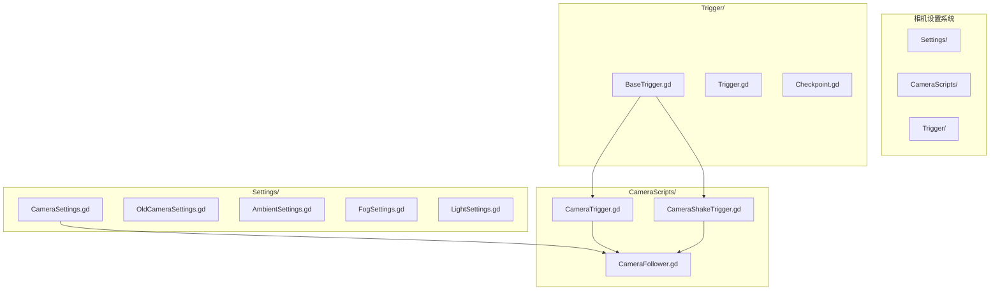

**图表来源**
- [CameraSettings.gd:1-9](file://#Template/[Scripts]/Settings/CameraSettings.gd#L1-L9)
- [CameraFollower.gd:1-150](file://#Template/[Scripts]/CameraScripts/CameraFollower.gd#L1-L150)
- [CameraTrigger.gd:1-109](file://#Template/[Scripts]/CameraScripts/CameraTrigger.gd#L1-L109)

**章节来源**
- [CameraSettings.gd:1-9](file://#Template/[Scripts]/Settings/CameraSettings.gd#L1-L9)
- [CameraFollower.gd:1-150](file://#Template/[Scripts]/CameraScripts/CameraFollower.gd#L1-L150)
- [CameraTrigger.gd:1-109](file://#Template/[Scripts]/CameraScripts/CameraTrigger.gd#L1-L109)

## 核心组件

相机设置系统由以下几个核心组件构成：

### 相机跟随器 (CameraFollower)
负责实现平滑的相机跟随效果，包括位置跟随、旋转跟随和距离控制。

### 相机触发器 (CameraTrigger)
提供动态的相机视角切换功能，支持多种旋转模式和过渡效果。

### 相机震动触发器 (CameraShakeTrigger)
实现镜头震动效果，用于增强游戏体验和特殊事件表现。

### 相机设置资源 (CameraSettings)
定义相机的基本属性和配置参数。

**章节来源**
- [CameraFollower.gd:1-150](file://#Template/[Scripts]/CameraScripts/CameraFollower.gd#L1-L150)
- [CameraTrigger.gd:1-109](file://#Template/[Scripts]/CameraScripts/CameraTrigger.gd#L1-L109)
- [CameraShakeTrigger.gd:1-33](file://#Template/[Scripts]/CameraScripts/CameraShakeTrigger.gd#L1-L33)
- [CameraSettings.gd:1-9](file://#Template/[Scripts]/Settings/CameraSettings.gd#L1-L9)

## 架构概览

相机设置系统的整体架构采用分层设计，各组件之间通过明确的接口进行交互：

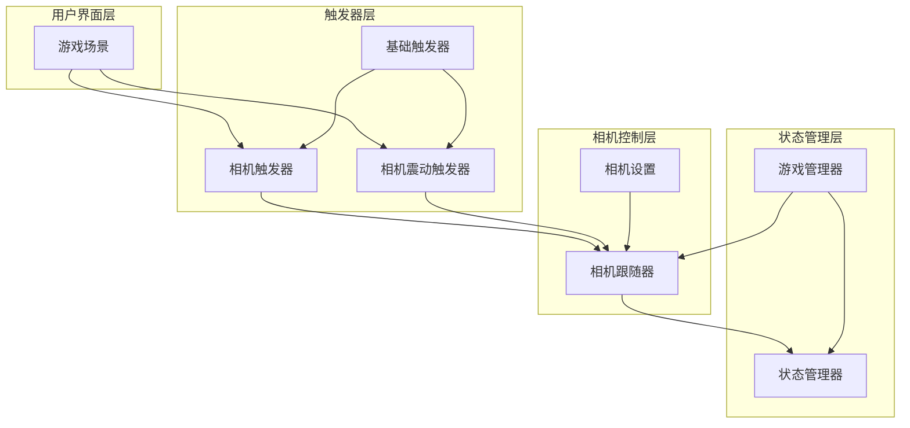

**图表来源**
- [CameraFollower.gd:1-150](file://#Template/[Scripts]/CameraScripts/CameraFollower.gd#L1-L150)
- [CameraTrigger.gd:1-109](file://#Template/[Scripts]/CameraScripts/CameraTrigger.gd#L1-L109)
- [CameraShakeTrigger.gd:1-33](file://#Template/[Scripts]/CameraScripts/CameraShakeTrigger.gd#L1-L33)
- [State.gd:1-159](file://#Template/[Scripts]/State.gd#L1-L159)
- [GameManager.gd:1-50](file://#Template/[Scripts]/GameManager.gd#L1-L50)

## 详细组件分析

### 相机跟随器 (CameraFollower)

相机跟随器是整个相机系统的核心组件，实现了平滑的相机跟随效果。

#### 主要功能特性

1. **多模式跟随**: 支持基于玩家位置的平滑跟随
2. **旋转控制**: 提供多种旋转模式和角度调整
3. **距离管理**: 动态调整相机与玩家的距离
4. **检查点恢复**: 支持游戏进度检查点的相机状态恢复

#### 关键属性说明

| 属性名 | 类型 | 默认值 | 描述 |
|--------|------|--------|------|
| player | NodePath | - | 目标玩家节点路径 |
| add_position | Vector3 | (0,0,0) | 相机相对于玩家的位置偏移 |
| rotation_offset | Vector3 | (45,45,0) | 相机初始旋转角度 |
| distance_from_object | float | 25.0 | 相机与目标的距离 |
| follow_speed | float | 1.2 | 跟随速度系数 |
| following | bool | true | 是否启用跟随 |

#### 旋转模式详解

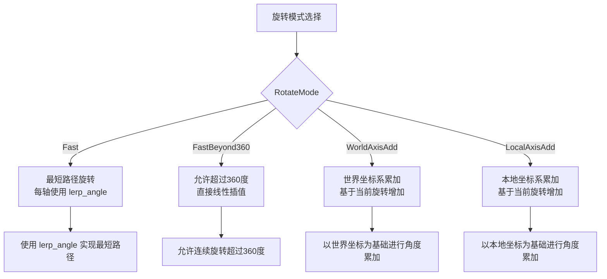

**图表来源**
- [CameraFollower.gd:6-11](file://#Template/[Scripts]/CameraScripts/CameraFollower.gd#L6-L11)
- [CameraFollower.gd:119-132](file://#Template/[Scripts]/CameraScripts/CameraFollower.gd#L119-L132)

#### 核心算法流程

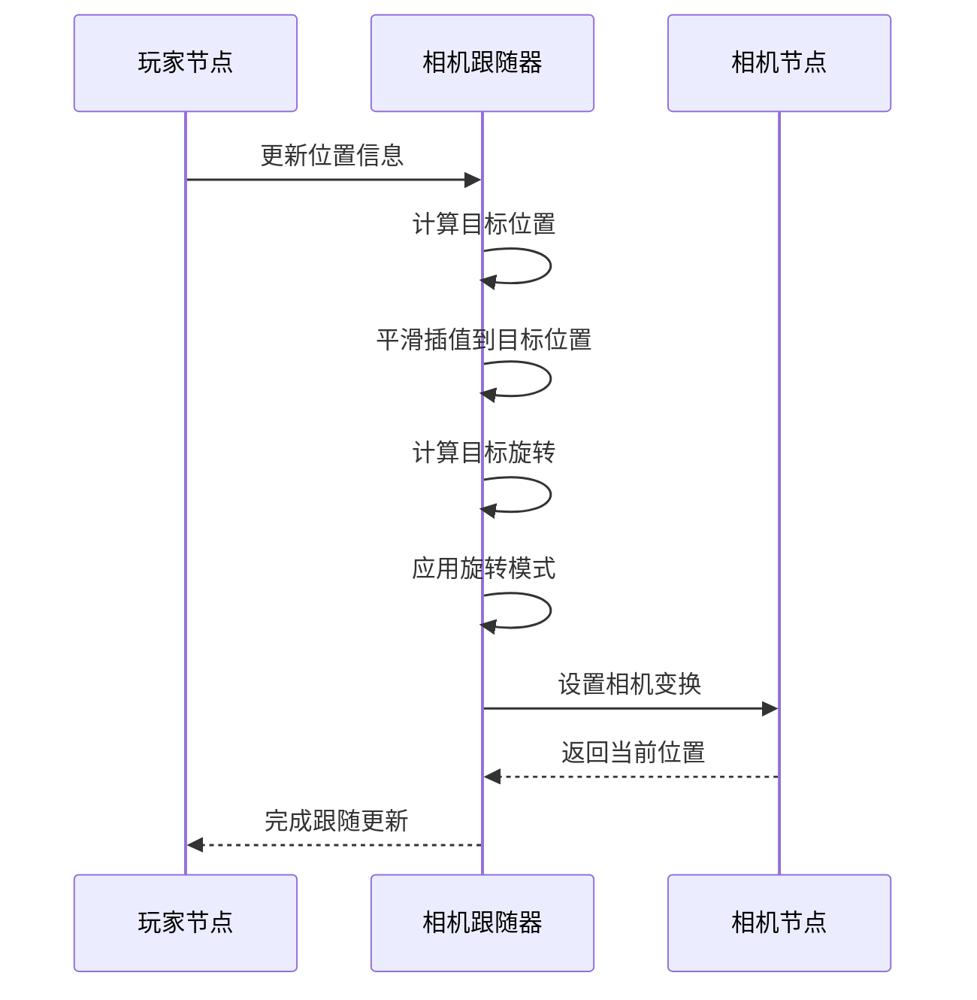

**图表来源**
- [CameraFollower.gd:47-70](file://#Template/[Scripts]/CameraScripts/CameraFollower.gd#L47-L70)

**章节来源**
- [CameraFollower.gd:1-150](file://#Template/[Scripts]/CameraScripts/CameraFollower.gd#L1-L150)

### 相机触发器 (CameraTrigger)

相机触发器提供动态的相机视角切换功能，支持基于时间或事件的相机参数变更。

#### 触发器类型

| 触发器类型 | 属性前缀 | 功能描述 |
|------------|----------|----------|
| 时间触发器 | use_time | 基于游戏时间的触发 |
| 事件触发器 | - | 基于玩家进入区域的触发 |
| 复合触发器 | use_time + one_shot | 结合时间和一次性触发 |

#### 参数配置选项

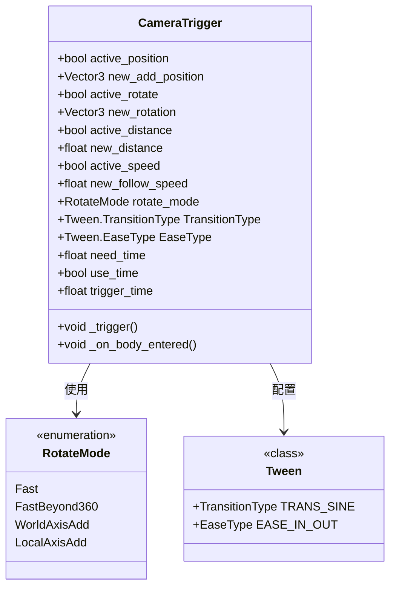

**图表来源**
- [CameraTrigger.gd:1-24](file://#Template/[Scripts]/CameraScripts/CameraTrigger.gd#L1-L24)
- [CameraTrigger.gd:11-17](file://#Template/[Scripts]/CameraScripts/CameraTrigger.gd#L11-L17)

#### 触发流程

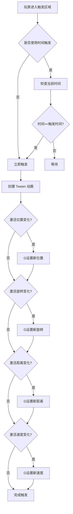

**图表来源**
- [CameraTrigger.gd:40-109](file://#Template/[Scripts]/CameraScripts/CameraTrigger.gd#L40-L109)

**章节来源**
- [CameraTrigger.gd:1-109](file://#Template/[Scripts]/CameraScripts/CameraTrigger.gd#L1-L109)

### 相机震动触发器 (CameraShakeTrigger)

相机震动触发器实现镜头震动效果，用于增强游戏体验和特殊事件表现。

#### 震动参数配置

| 参数名 | 类型 | 默认值 | 描述 |
|--------|------|--------|------|
| camera_parent | Node3D | - | 相机的父节点 |
| shake_intensity | float | 0.5 | 震动强度 |
| shake_duration | float | 0.3 | 震动持续时间 |

#### 震动算法实现

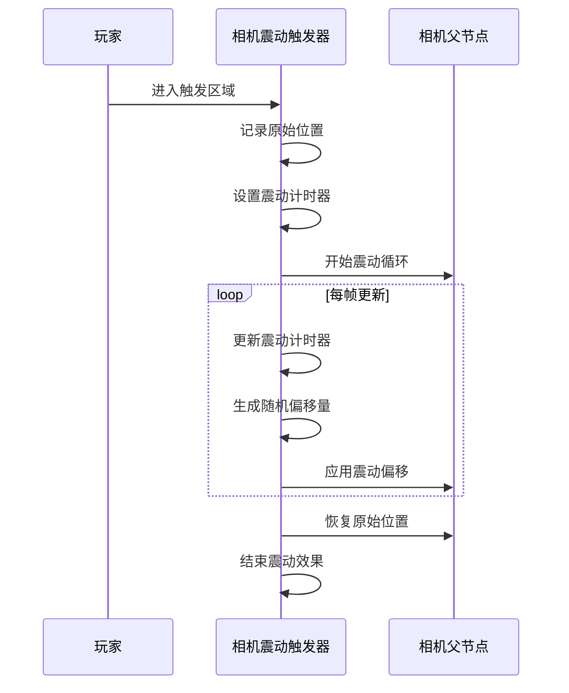

**图表来源**
- [CameraShakeTrigger.gd:13-25](file://#Template/[Scripts]/CameraScripts/CameraShakeTrigger.gd#L13-L25)

**章节来源**
- [CameraShakeTrigger.gd:1-33](file://#Template/[Scripts]/CameraScripts/CameraShakeTrigger.gd#L1-L33)

### 相机设置资源 (CameraSettings)

相机设置资源定义了相机的基本属性和配置参数，支持导出到编辑器中进行可视化配置。

#### 资源属性定义

| 属性名 | 类型 | 默认值 | 描述 |
|--------|------|--------|------|
| offset | Vector3 | (0,0,0) | 相机位置偏移 |
| rotation | Vector3 | (0,0,0) | 相机旋转角度 |
| scale | Vector3 | (1,1,1) | 相机缩放比例 |
| fov | float | 60.0 | 视野角度 |
| follow | bool | true | 是否启用跟随 |
| distance | float | 0.0 | 相机距离 |

#### 资源类关系图

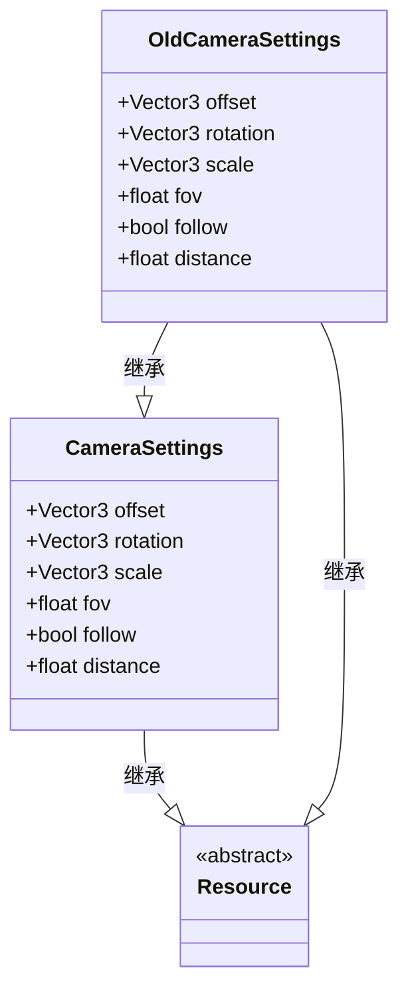

**图表来源**
- [CameraSettings.gd:1-9](file://#Template/[Scripts]/Settings/CameraSettings.gd#L1-L9)
- [OldCameraSettings.gd:1-9](file://#Template/[Scripts]/Settings/OldCameraSettings.gd#L1-L9)

**章节来源**
- [CameraSettings.gd:1-9](file://#Template/[Scripts]/Settings/CameraSettings.gd#L1-L9)
- [OldCameraSettings.gd:1-9](file://#Template/[Scripts]/Settings/OldCameraSettings.gd#L1-L9)

### 状态管理系统

状态管理系统负责相机设置的持久化和恢复，支持游戏检查点功能。

#### 检查点数据结构

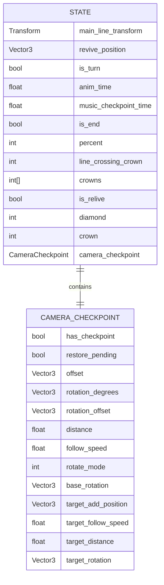

**图表来源**
- [State.gd:24-39](file://#Template/[Scripts]/State.gd#L24-L39)

#### 检查点保存流程

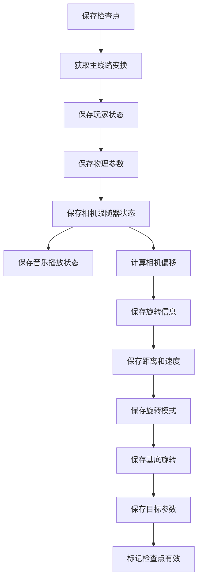

**图表来源**
- [State.gd:52-75](file://#Template/[Scripts]/State.gd#L52-L75)

**章节来源**
- [State.gd:1-159](file://#Template/[Scripts]/State.gd#L1-L159)

## 依赖关系分析

相机设置系统的依赖关系呈现清晰的层次结构：

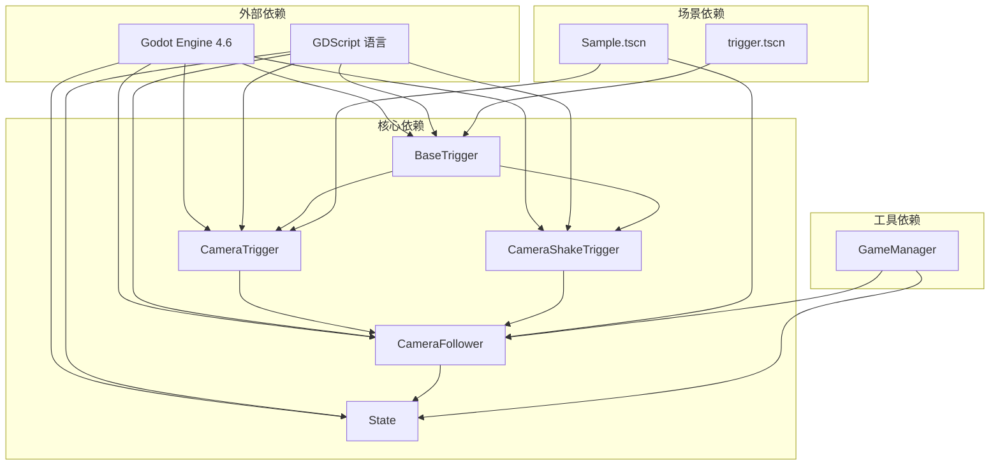

**图表来源**
- [CameraFollower.gd:1-150](file://#Template/[Scripts]/CameraScripts/CameraFollower.gd#L1-L150)
- [CameraTrigger.gd:1-109](file://#Template/[Scripts]/CameraScripts/CameraTrigger.gd#L1-L109)
- [CameraShakeTrigger.gd:1-33](file://#Template/[Scripts]/CameraScripts/CameraShakeTrigger.gd#L1-L33)
- [State.gd:1-159](file://#Template/[Scripts]/State.gd#L1-L159)
- [BaseTrigger.gd:1-38](file://#Template/[Scripts]/Trigger/BaseTrigger.gd#L1-L38)
- [Sample.tscn:53-61](file://#Template/[Scenes]/Sample.tscn#L53-L61)
- [trigger.tscn:9-18](file://#Template/trigger.tscn#L9-L18)

### 组件耦合度分析

| 组件 | 内聚性 | 耦合度 | 依赖关系 |
|------|--------|--------|----------|
| CameraFollower | 高 | 中等 | State, GameManager |
| CameraTrigger | 中等 | 高 | CameraFollower, BaseTrigger |
| CameraShakeTrigger | 中等 | 中等 | BaseTrigger |
| State | 高 | 低 | 所有相机组件 |
| BaseTrigger | 低 | 高 | CameraTrigger, CameraShakeTrigger |

**章节来源**
- [CameraFollower.gd:1-150](file://#Template/[Scripts]/CameraScripts/CameraFollower.gd#L1-L150)
- [CameraTrigger.gd:1-109](file://#Template/[Scripts]/CameraScripts/CameraTrigger.gd#L1-L109)
- [CameraShakeTrigger.gd:1-33](file://#Template/[Scripts]/CameraScripts/CameraShakeTrigger.gd#L1-L33)
- [State.gd:1-159](file://#Template/[Scripts]/State.gd#L1-L159)
- [BaseTrigger.gd:1-38](file://#Template/[Scripts]/Trigger/BaseTrigger.gd#L1-L38)

## 性能考虑

### 相机跟随性能优化

1. **插值算法优化**: 使用 SLERP 和 lerp_angle 实现平滑过渡
2. **帧率适配**: 通过 delta 时间实现帧率无关的移动
3. **条件更新**: 仅在需要时进行相机变换更新

### 内存管理

1. **单例模式**: CameraFollower 使用静态实例避免重复创建
2. **Tween 复用**: 合理管理 Tween 对象的生命周期
3. **检查点数据**: 优化相机状态数据的存储和传输

### 渲染性能

1. **视锥剔除**: 合理设置相机参数避免不必要的渲染
2. **LOD 系统**: 根据距离动态调整模型细节
3. **批量渲染**: 将相似的相机操作合并执行

## 故障排除指南

### 常见问题及解决方案

#### 相机跟随异常

**问题**: 相机跟随不平滑或出现跳跃
**可能原因**: 
- follow_speed 值过大
- player 节点路径错误
- 旋转模式配置不当

**解决方法**:
1. 调整 follow_speed 参数到合理范围 (0.1-2.0)
2. 检查 player NodePath 是否正确指向目标节点
3. 根据需求选择合适的 RotateMode

#### 相机触发器失效

**问题**: 相机触发器无法正常工作
**可能原因**:
- 触发器节点未正确连接
- one_shot 标志导致重复触发被禁用
- use_time 条件不满足

**解决方法**:
1. 确保触发器的 body_entered 信号正确连接
2. 检查 one_shot 设置和使用场景
3. 验证 use_time 的触发条件

#### 相机震动无效果

**问题**: 相机震动触发器没有响应
**可能原因**:
- camera_parent 未正确设置
- 震动计时器未初始化
- 触发区域设置错误

**解决方法**:
1. 确保 camera_parent 指向相机的父节点
2. 检查震动计时器的初始化逻辑
3. 验证触发区域的碰撞形状和大小

**章节来源**
- [CameraFollower.gd:47-70](file://#Template/[Scripts]/CameraScripts/CameraFollower.gd#L47-L70)
- [CameraTrigger.gd:40-56](file://#Template/[Scripts]/CameraScripts/CameraTrigger.gd#L40-L56)
- [CameraShakeTrigger.gd:13-25](file://#Template/[Scripts]/CameraScripts/CameraShakeTrigger.gd#L13-L25)

## 结论

相机设置系统通过模块化的设计和清晰的层次结构，为 Godot Line 模板提供了强大而灵活的摄像机控制能力。系统的主要优势包括：

1. **模块化设计**: 各组件职责明确，便于维护和扩展
2. **灵活性**: 支持多种相机模式和动态配置
3. **性能优化**: 采用帧率无关的算法和合理的内存管理
4. **易用性**: 提供直观的编辑器导出属性和可视化配置

该系统为游戏开发者提供了完整的相机控制解决方案，可以根据具体需求进行定制和扩展。通过检查点机制的支持，系统还能够提供流畅的游戏体验和进度保存功能。