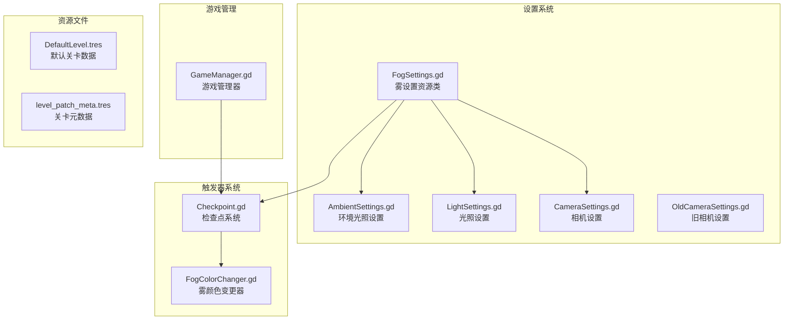
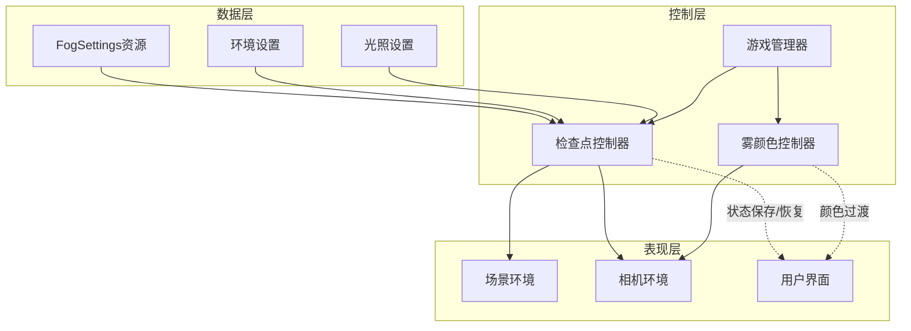
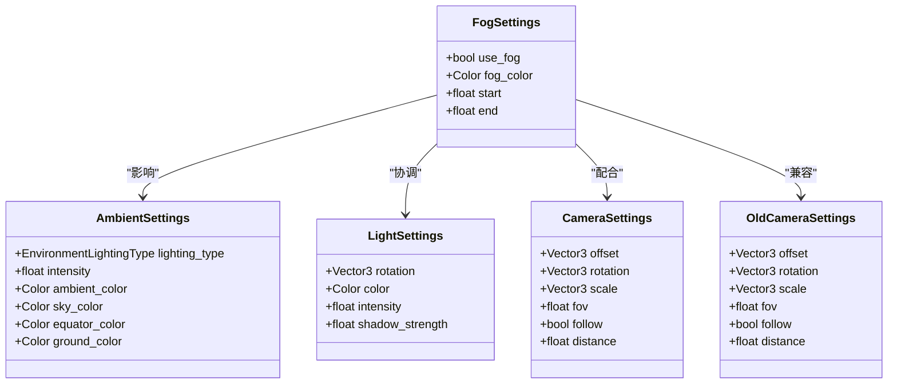
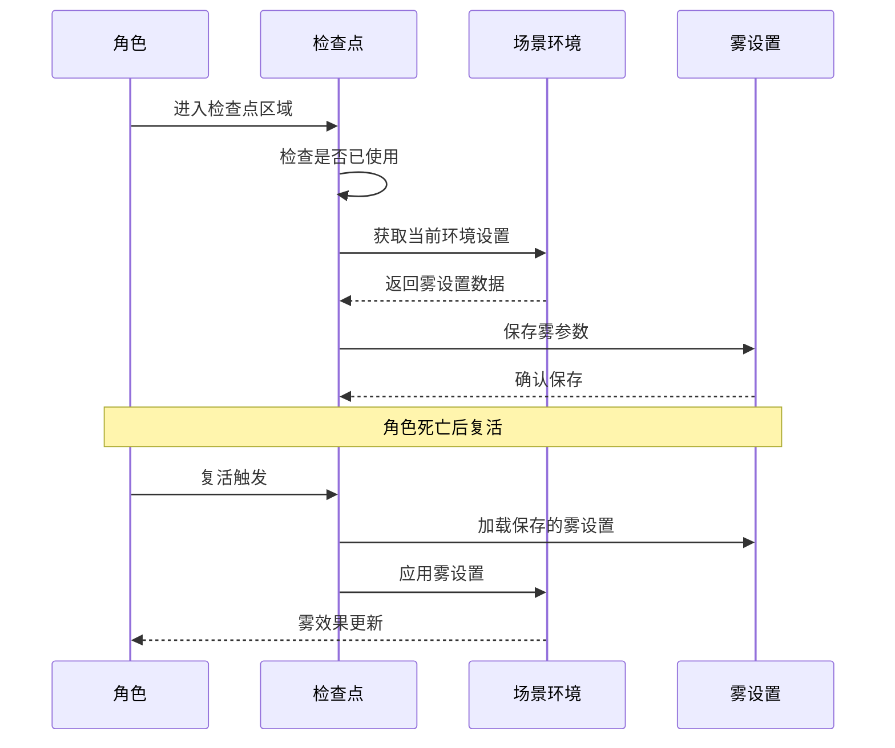
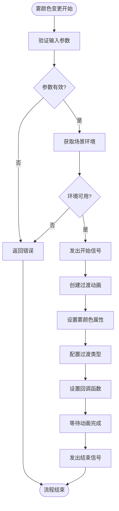
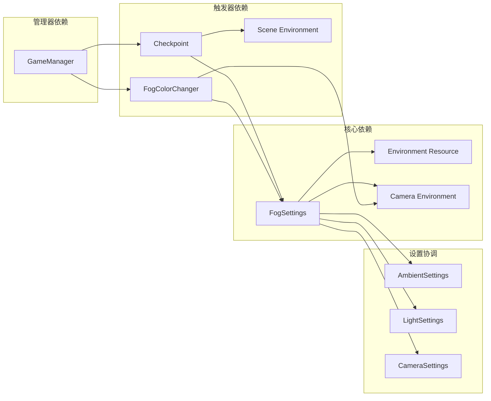

# 雾设置

<cite>
**本文档引用的文件**
- [FogSettings.gd](file://#Template/[Scripts]/Settings/FogSettings.gd)
- [FogColorChanger.gd](file://#Template/[Scripts]/Trigger/FogColorChanger.gd)
- [Checkpoint.gd](file://#Template/[Scripts]/Trigger/Checkpoint.gd)
- [GameManager.gd](file://#Template/[Scripts]/GameManager.gd)
- [AmbientSettings.gd](file://#Template/[Scripts]/Settings/AmbientSettings.gd)
- [LightSettings.gd](file://#Template/[Scripts]/Settings/LightSettings.gd)
- [CameraSettings.gd](file://#Template/[Scripts]/Settings/CameraSettings.gd)
- [OldCameraSettings.gd](file://#Template/[Scripts]/Settings/OldCameraSettings.gd)
- [DefaultLevel.tres](file://#Template/[Resources]/LevelData/DefaultLevel.tres)
- [level_patch_meta.tres](file://#Template/[Resources]/level_patch_meta.tres)
</cite>

## 目录
1. [简介](#简介)
2. [项目结构](#项目结构)
3. [核心组件](#核心组件)
4. [架构概览](#架构概览)
5. [详细组件分析](#详细组件分析)
6. [依赖关系分析](#依赖关系分析)
7. [性能考虑](#性能考虑)
8. [故障排除指南](#故障排除指南)
9. [结论](#结论)

## 简介

雾设置系统是 Godot Line 模板中的一个重要视觉效果组件，负责管理场景中的雾化效果。该系统提供了灵活的雾参数配置、动态颜色过渡以及与游戏状态的集成能力。通过资源化的雾设置类，开发者可以轻松地在不同关卡和场景中实现一致的视觉效果。

## 项目结构

雾设置系统主要分布在以下目录结构中：

**图表来源**
- [FogSettings.gd:1-7](file://#Template/[Scripts]/Settings/FogSettings.gd#L1-L7)
- [Checkpoint.gd:1-218](file://#Template/[Scripts]/Trigger/Checkpoint.gd#L1-L218)
- [FogColorChanger.gd:1-25](file://#Template/[Scripts]/Trigger/FogColorChanger.gd#L1-L25)

**章节来源**
- [FogSettings.gd:1-7](file://#Template/[Scripts]/Settings/FogSettings.gd#L1-L7)
- [Checkpoint.gd:1-218](file://#Template/[Scripts]/Trigger/Checkpoint.gd#L1-L218)
- [FogColorChanger.gd:1-25](file://#Template/[Scripts]/Trigger/FogColorChanger.gd#L1-L25)

## 核心组件

### 雾设置资源类

雾设置资源类是整个系统的数据核心，提供了标准化的雾参数配置：

| 参数名称 | 类型 | 默认值 | 描述 |
|---------|------|--------|------|
| use_fog | bool | true | 是否启用雾效果 |
| fog_color | Color | WHITE | 雾的颜色值 |
| start | float | 25.0 | 雾开始的距离 |
| end | float | 120.0 | 雾结束的距离 |

### 检查点系统集成

检查点系统负责捕获和恢复雾设置状态：

- **捕获功能**：自动保存当前场景的雾设置
- **恢复功能**：在角色复活时恢复之前的雾设置
- **手动控制**：支持手动覆盖默认的雾设置行为

### 雾颜色变更器

提供动态的雾颜色过渡效果：

- **目标颜色**：可配置的目标雾颜色
- **过渡时间**：可调节的动画持续时间
- **缓动类型**：支持多种过渡效果类型

**章节来源**
- [FogSettings.gd:1-7](file://#Template/[Scripts]/Settings/FogSettings.gd#L1-L7)
- [Checkpoint.gd:82-88](file://#Template/[Scripts]/Trigger/Checkpoint.gd#L82-L88)
- [Checkpoint.gd:130-136](file://#Template/[Scripts]/Trigger/Checkpoint.gd#L130-L136)
- [FogColorChanger.gd:17-24](file://#Template/[Scripts]/Trigger/FogColorChanger.gd#L17-L24)

## 架构概览

雾设置系统采用分层架构设计，实现了清晰的关注点分离：

**图表来源**
- [Checkpoint.gd:48-88](file://#Template/[Scripts]/Trigger/Checkpoint.gd#L48-L88)
- [FogColorChanger.gd:17-24](file://#Template/[Scripts]/Trigger/FogColorChanger.gd#L17-L24)
- [GameManager.gd:10-18](file://#Template/[Scripts]/GameManager.gd#L10-L18)

系统的核心交互流程包括：

1. **初始化阶段**：加载雾设置资源并应用到场景环境
2. **运行时阶段**：根据游戏状态动态调整雾效果
3. **状态管理阶段**：在检查点之间保存和恢复雾设置

## 详细组件分析

### 雾设置资源类分析

**图表来源**
- [FogSettings.gd:1-7](file://#Template/[Scripts]/Settings/FogSettings.gd#L1-L7)
- [AmbientSettings.gd:1-12](file://#Template/[Scripts]/Settings/AmbientSettings.gd#L1-L12)
- [LightSettings.gd:1-7](file://#Template/[Scripts]/Settings/LightSettings.gd#L1-L7)
- [CameraSettings.gd:1-9](file://#Template/[Scripts]/Settings/CameraSettings.gd#L1-L9)
- [OldCameraSettings.gd:1-9](file://#Template/[Scripts]/Settings/OldCameraSettings.gd#L1-L9)

### 检查点系统工作流程

**图表来源**
- [Checkpoint.gd:48-88](file://#Template/[Scripts]/Trigger/Checkpoint.gd#L48-L88)
- [Checkpoint.gd:130-136](file://#Template/[Scripts]/Trigger/Checkpoint.gd#L130-L136)

### 雾颜色变更器实现

**图表来源**
- [FogColorChanger.gd:17-24](file://#Template/[Scripts]/Trigger/FogColorChanger.gd#L17-L24)

**章节来源**
- [Checkpoint.gd:48-88](file://#Template/[Scripts]/Trigger/Checkpoint.gd#L48-L88)
- [Checkpoint.gd:130-136](file://#Template/[Scripts]/Trigger/Checkpoint.gd#L130-L136)
- [FogColorChanger.gd:17-24](file://#Template/[Scripts]/Trigger/FogColorChanger.gd#L17-L24)

## 依赖关系分析

雾设置系统与其他组件的依赖关系如下：

**图表来源**
- [Checkpoint.gd:82-88](file://#Template/[Scripts]/Trigger/Checkpoint.gd#L82-L88)
- [Checkpoint.gd:130-136](file://#Template/[Scripts]/Trigger/Checkpoint.gd#L130-L136)
- [FogColorChanger.gd:17-24](file://#Template/[Scripts]/Trigger/FogColorChanger.gd#L17-L24)
- [GameManager.gd:10-18](file://#Template/[Scripts]/GameManager.gd#L10-L18)

**章节来源**
- [Checkpoint.gd:82-88](file://#Template/[Scripts]/Trigger/Checkpoint.gd#L82-L88)
- [Checkpoint.gd:130-136](file://#Template/[Scripts]/Trigger/Checkpoint.gd#L130-L136)
- [FogColorChanger.gd:17-24](file://#Template/[Scripts]/Trigger/FogColorChanger.gd#L17-L24)

## 性能考虑

### 雾渲染性能优化

1. **距离裁剪优化**：合理设置雾的起始和结束距离，避免不必要的渲染计算
2. **颜色缓存**：频繁的颜色变更应使用缓存机制减少重复计算
3. **过渡动画**：长时过渡动画可能影响帧率，需要权衡视觉效果和性能

### 内存管理

- **资源复用**：雾设置资源应在场景间复用，避免重复创建
- **垃圾回收**：及时释放不再使用的雾相关对象
- **批量更新**：多个雾设置同时变更时，使用批量更新机制

## 故障排除指南

### 常见问题及解决方案

| 问题描述 | 可能原因 | 解决方案 |
|---------|---------|---------|
| 雾效果不显示 | use_fog 设置为 false | 检查 FogSettings.use_fog 参数 |
| 雾颜色不正确 | fog_color 配置错误 | 验证 Color 值的有效性 |
| 过渡动画无效 | 相机环境未正确设置 | 确保 Camera.get_environment() 返回有效对象 |
| 检查点状态丢失 | 环境对象为空 | 检查场景环境的初始化顺序 |

### 调试技巧

1. **日志输出**：在关键节点添加调试信息
2. **参数验证**：检查所有导出参数的有效性
3. **状态监控**：实时监控雾设置的状态变化

**章节来源**
- [FogColorChanger.gd:17-24](file://#Template/[Scripts]/Trigger/FogColorChanger.gd#L17-L24)
- [Checkpoint.gd:82-88](file://#Template/[Scripts]/Trigger/Checkpoint.gd#L82-L88)

## 结论

雾设置系统通过其模块化的设计和灵活的配置选项，为 Godot Line 模板提供了强大的视觉效果支持。系统的关键优势包括：

1. **资源化管理**：通过 FogSettings 资源类实现统一的雾参数管理
2. **状态持久化**：检查点系统确保雾效果在游戏进程中的连续性
3. **动态控制**：雾颜色变更器提供流畅的视觉过渡效果
4. **系统集成**：与环境、光照和相机设置的协调工作

该系统为开发者提供了完整的雾效果解决方案，既满足了基本的视觉需求，又保持了良好的扩展性和维护性。通过合理的配置和使用，可以显著提升游戏的视觉质量和玩家体验。