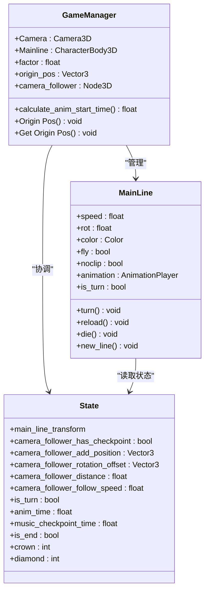
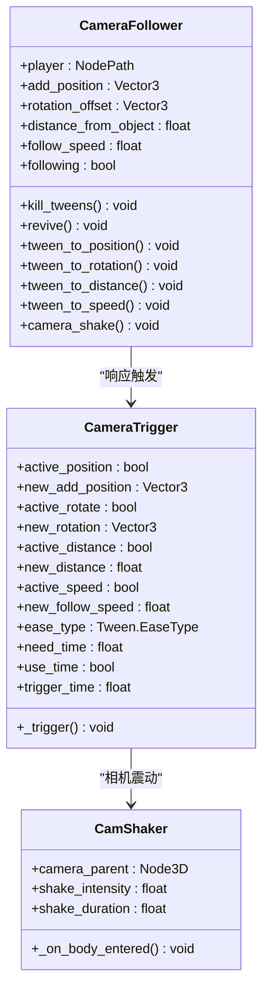
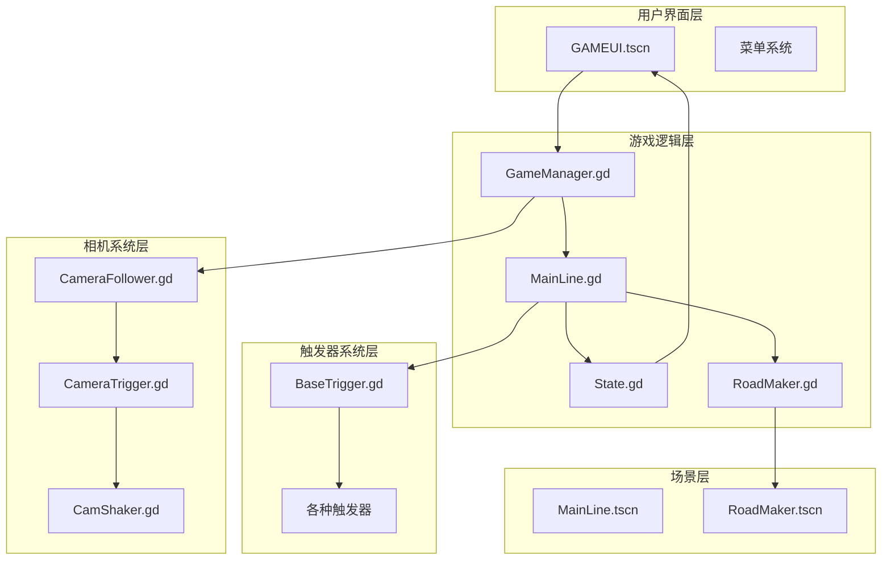
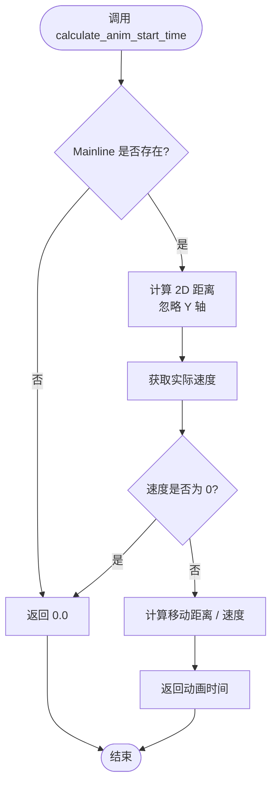
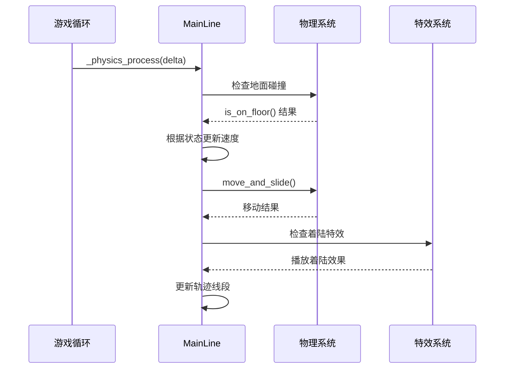
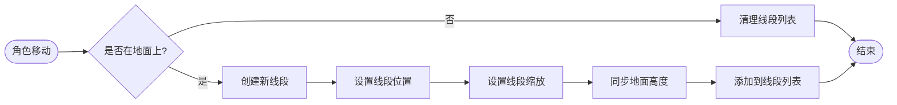
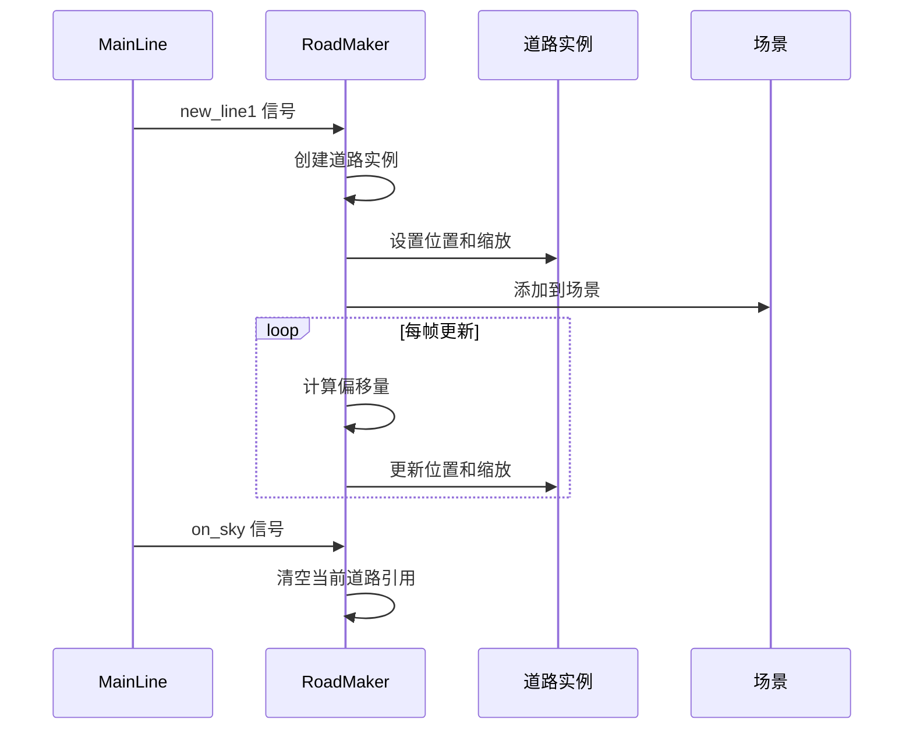
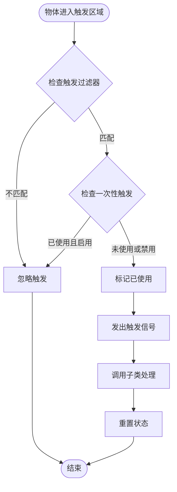
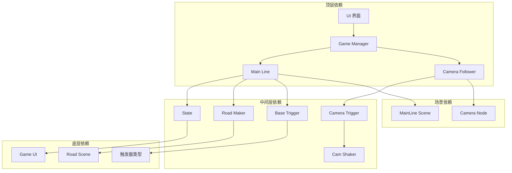

# 游戏管理器

<cite>
**本文档引用的文件**
- [GameManager.gd](file://#Template/[Scripts]/GameManager.gd)
- [MainLine.gd](file://#Template/[Scripts]/MainLine.gd)
- [State.gd](file://#Template/[Scripts]/State.gd)
- [gameui.gd](file://#Template/[Scripts]/gameui.gd)
- [RoadMaker.gd](file://#Template/[Scripts]/RoadMaker.gd)
- [BaseTrigger.gd](file://#Template/[Scripts]/Trigger/BaseTrigger.gd)
- [CameraFollower.gd](file://#Template/[Scripts]/CameraScripts/CameraFollower.gd)
- [CameraTrigger.gd](file://#Template/[Scripts]/CameraScripts/CameraTrigger.gd)
- [CamShaker.gd](file://#Template/[Scripts]/CameraScripts/CamShaker.gd)
- [MainLine.tscn](file://#Template/MainLine.tscn)
- [GAMEUI.tscn](file://#Template/GAMEUI.tscn)
- [RoadMaker.tscn](file://#Template/RoadMaker.tscn)
- [README.md](file://README.md)
</cite>

## 目录
1. [简介](#简介)
2. [项目结构](#项目结构)
3. [核心组件](#核心组件)
4. [架构概览](#架构概览)
5. [详细组件分析](#详细组件分析)
6. [依赖关系分析](#依赖关系分析)
7. [性能考虑](#性能考虑)
8. [故障排除指南](#故障排除指南)
9. [结论](#结论)

## 简介

Game Manager 是一个基于 Godot Engine 4.6 开发的 Dancing Line 游戏模板的核心管理系统。该项目实现了完整的线条游戏机制，包括角色控制、道路生成、相机跟随、触发器系统等核心功能。项目采用模块化设计，提供了高度的可扩展性和兼容性。

本项目的主要特点包括：
- 基于 Dancing Line 核心玩法的完整实现
- 与冰焰模板 3/4 的高兼容性
- 内置完整的测试框架（gdUnit4）
- 跨平台支持（Windows、Linux、macOS）
- 模块化的代码结构，易于扩展和定制

## 项目结构

项目采用清晰的模板化组织结构，主要包含以下核心目录：

```mermaid
graph TB
subgraph "项目根目录"
A[README.md]
B[project.godot]
C[export_presets.cfg]
end
subgraph "#Template/ 模板系统"
D[#Template/[Scripts]/]
E[#Template/[Scenes]/]
F[#Template/[Resources]/]
G[#Template/[Materials]/]
end
subgraph "测试系统"
H[Tests/]
I[addons/gdUnit4/]
end
subgraph "核心脚本"
D1[GameManager.gd]
D2[MainLine.gd]
D3[State.gd]
D4[gameui.gd]
D5[RoadMaker.gd]
end
subgraph "相机系统"
J[CameraScripts/]
K[CameraFollower.gd]
L[CameraTrigger.gd]
M[CamShaker.gd]
end
subgraph "触发器系统"
N[Trigger/]
O[BaseTrigger.gd]
P[各触发器类型]
end
A --> D
D --> D1
D --> D2
D --> D3
D --> D4
D --> D5
D --> J
D --> N
J --> K
J --> L
J --> M
N --> O
```

**图表来源**
- [GameManager.gd:1-46](file://#Template/[Scripts]/GameManager.gd#L1-L46)
- [MainLine.gd:1-251](file://#Template/[Scripts]/MainLine.gd#L1-L251)
- [State.gd:1-22](file://#Template/[Scripts]/State.gd#L1-L22)

**章节来源**
- [README.md:53-65](file://README.md#L53-L65)

## 核心组件

### Game Manager 核心功能

Game Manager 作为整个游戏系统的协调中心，负责管理游戏状态、相机跟随和动画同步等关键功能：



**图表来源**
- [GameManager.gd:1-46](file://#Template/[Scripts]/GameManager.gd#L1-L46)
- [MainLine.gd:1-251](file://#Template/[Scripts]/MainLine.gd#L1-L251)
- [State.gd:1-22](file://#Template/[Scripts]/State.gd#L1-L22)

### 相机跟随系统

相机跟随系统提供了灵活的摄像机控制机制，支持多种参数的动态调整：



**图表来源**
- [CameraFollower.gd:1-168](file://#Template/[Scripts]/CameraScripts/CameraFollower.gd#L1-L168)
- [CameraTrigger.gd:1-85](file://#Template/[Scripts]/CameraScripts/CameraTrigger.gd#L1-L85)
- [CamShaker.gd:1-37](file://#Template/[Scripts]/CameraScripts/CamShaker.gd#L1-L37)

**章节来源**
- [GameManager.gd:1-46](file://#Template/[Scripts]/GameManager.gd#L1-L46)
- [CameraFollower.gd:1-168](file://#Template/[Scripts]/CameraScripts/CameraFollower.gd#L1-L168)
- [CameraTrigger.gd:1-85](file://#Template/[Scripts]/CameraScripts/CameraTrigger.gd#L1-L85)

## 架构概览

游戏的整体架构采用了分层设计，各个组件之间通过清晰的接口进行通信：



**图表来源**
- [GameManager.gd:1-46](file://#Template/[Scripts]/GameManager.gd#L1-L46)
- [MainLine.gd:1-251](file://#Template/[Scripts]/MainLine.gd#L1-L251)
- [State.gd:1-22](file://#Template/[Scripts]/State.gd#L1-L22)
- [CameraFollower.gd:1-168](file://#Template/[Scripts]/CameraScripts/CameraFollower.gd#L1-L168)

## 详细组件分析

### Game Manager 组件详解

Game Manager 是整个游戏系统的核心协调器，负责管理游戏状态和相机跟随：

#### 核心属性和方法

| 属性名 | 类型 | 描述 | 默认值 |
|--------|------|------|--------|
| Camera | Camera3D | 主相机节点 | null |
| Mainline | CharacterBody3D | 主角节点 | null |
| factor | float | 距离计算因子 | 1.0 |
| origin_pos | Vector3 | 起始位置 | Vector3.ZERO |

#### 计算动画起始时间流程



**图表来源**
- [GameManager.gd:29-46](file://#Template/[Scripts]/GameManager.gd#L29-L46)

#### 工具按钮功能

Game Manager 提供了两个重要的工具按钮功能：

1. **Origin Pos 按钮**：设置当前主角位置为起点
2. **Get Origin Pos 按钮**：将主角移动到记录的起点位置

这些功能主要用于关卡编辑和调试目的。

**章节来源**
- [GameManager.gd:1-46](file://#Template/[Scripts]/GameManager.gd#L1-L46)

### MainLine 角色控制系统

MainLine 实现了游戏的核心角色控制逻辑，包括物理运动、动画同步和特效处理：

#### 物理运动系统



**图表来源**
- [MainLine.gd:56-112](file://#Template/[Scripts]/MainLine.gd#L56-L112)

#### 动画同步机制

MainLine 实现了精确的音画同步功能：

1. **音乐播放位置跟踪**：实时获取音乐播放位置
2. **动画节点同步**：将动画播放位置与音乐同步
3. **延迟补偿**：考虑音频混音和输出延迟

#### 轨迹生成系统

当角色在地面上移动时，系统会自动生成轨迹线段：



**图表来源**
- [MainLine.gd:147-169](file://#Template/[Scripts]/MainLine.gd#L147-L169)

**章节来源**
- [MainLine.gd:1-251](file://#Template/[Scripts]/MainLine.gd#L1-L251)

### State 状态管理系统

State 提供了全局游戏状态的集中管理，支持状态持久化和恢复：

#### 状态变量分类

| 分类 | 变量名 | 类型 | 描述 |
|------|--------|------|------|
| 角色状态 | main_line_transform | 变体 | 主角初始变换 |
| | is_live | bool | 角色存活状态 |
| | is_turn | bool | 角色转向状态 |
| 相机状态 | camera_follower_has_checkpoint | bool | 相机检查点存在 |
| | camera_follower_add_position | Vector3 | 相机偏移位置 |
| | camera_follower_rotation_offset | Vector3 | 相机旋转偏移 |
| | camera_follower_distance | float | 相机距离 |
| | camera_follower_follow_speed | float | 相机跟随速度 |
| 游戏进度 | anim_time | float | 动画起始时间 |
| | music_checkpoint_time | float | 音乐检查点时间 |
| | percent | int | 完成百分比 |
| 收集品 | crown | int | 王冠数量 |
| | diamond | int | 钻石数量 |
| | crowns | Array[int] | 三颗王冠状态 |

**章节来源**
- [State.gd:1-22](file://#Template/[Scripts]/State.gd#L1-L22)

### RoadMaker 道路生成系统

RoadMaker 负责动态生成玩家经过路径的物理道路：

#### 道路生成流程



**图表来源**
- [RoadMaker.gd:22-46](file://#Template/[Scripts]/RoadMaker.gd#L22-L46)

**章节来源**
- [RoadMaker.gd:1-46](file://#Template/[Scripts]/RoadMaker.gd#L1-L46)

### 触发器系统

BaseTrigger 提供了统一的触发器基类，支持多种触发条件和过滤器：

#### 触发器工作流程



**图表来源**
- [BaseTrigger.gd:54-102](file://#Template/[Scripts]/Trigger/BaseTrigger.gd#L54-L102)

**章节来源**
- [BaseTrigger.gd:1-102](file://#Template/[Scripts]/Trigger/BaseTrigger.gd#L1-L102)

## 依赖关系分析

游戏系统的组件间依赖关系呈现清晰的层次结构：



**图表来源**
- [GameManager.gd:1-46](file://#Template/[Scripts]/GameManager.gd#L1-L46)
- [MainLine.gd:1-251](file://#Template/[Scripts]/MainLine.gd#L1-L251)
- [State.gd:1-22](file://#Template/[Scripts]/State.gd#L1-L22)

### 关键依赖链

1. **UI → Game Manager**: 用户界面通过 Game Manager 访问游戏状态
2. **Game Manager → MainLine**: 协调角色控制和动画同步
3. **MainLine → State**: 读取和更新游戏状态
4. **Camera Follower → Game Manager**: 通过 Game Manager 获取相机跟随器
5. **Road Maker → MainLine**: 监听角色事件生成道路

**章节来源**
- [GameManager.gd:1-46](file://#Template/[Scripts]/GameManager.gd#L1-L46)
- [MainLine.gd:1-251](file://#Template/[Scripts]/MainLine.gd#L1-L251)
- [State.gd:1-22](file://#Template/[Scripts]/State.gd#L1-L22)

## 性能考虑

### 优化策略

1. **延迟补偿机制**：MainLine 实现了精确的音画同步，通过考虑音频混音和输出延迟来避免同步偏差

2. **状态持久化**：State 系统支持游戏状态的保存和恢复，减少重新开始时的计算开销

3. **相机跟随优化**：CameraFollower 使用球面线性插值（SLERP）实现平滑的相机跟随，同时支持 Tween 动画

4. **内存管理**：RoadMaker 使用延迟添加机制，避免频繁的场景树操作

### 性能监控点

- 音乐播放位置跟踪的精度和性能平衡
- 相机跟随的平滑度和响应速度
- 触发器系统的信号连接和事件处理
- 轨迹线段的动态创建和销毁

## 故障排除指南

### 常见问题及解决方案

#### 相机跟随异常

**问题症状**：相机不跟随角色或跟随不平滑
**可能原因**：
- 相机跟随器未正确设置 player 节点
- State 中的相机状态未正确保存
- 相机触发器配置错误

**解决步骤**：
1. 检查 CameraFollower 的 player 节点路径
2. 验证 State 中的相机状态数据
3. 确认 CameraTrigger 的触发条件

#### 音画不同步

**问题症状**：动画与音乐播放不同步
**可能原因**：
- 音频延迟计算不准确
- 音乐播放器状态异常
- 动画节点未正确同步

**解决步骤**：
1. 检查 MainLine 中的音频延迟补偿
2. 验证音乐播放器的播放状态
3. 确认动画节点的同步逻辑

#### 触发器不工作

**问题症状**：触发器无法正常触发
**可能原因**：
- 触发过滤器设置不当
- 信号连接丢失
- 触发器位置或大小异常

**解决步骤**：
1. 检查 BaseTrigger 的 trigger_filter 设置
2. 验证信号连接状态
3. 调整触发器的碰撞体积

**章节来源**
- [MainLine.gd:74-76](file://#Template/[Scripts]/MainLine.gd#L74-L76)
- [CameraFollower.gd:37-52](file://#Template/[Scripts]/CameraScripts/CameraFollower.gd#L37-L52)
- [BaseTrigger.gd:76-86](file://#Template/[Scripts]/Trigger/BaseTrigger.gd#L76-L86)

## 结论

Game Manager 项目展现了现代游戏开发的最佳实践，通过模块化设计和清晰的架构分离，实现了功能完整且易于维护的游戏系统。项目的主要优势包括：

1. **架构清晰**：分层设计使得各组件职责明确，便于维护和扩展
2. **功能完整**：涵盖了现代线条游戏的所有核心功能
3. **性能优化**：通过多种优化策略确保了良好的运行性能
4. **测试友好**：集成了 gdUnit4 测试框架，保障了代码质量
5. **兼容性强**：与多个模板系统保持高度兼容

该项目为开发者提供了一个坚实的基础，可以在此基础上快速开发和定制自己的 Dancing Line 风格游戏。其模块化的设计理念和完善的测试体系，使得项目具有很高的可扩展性和可持续发展性。