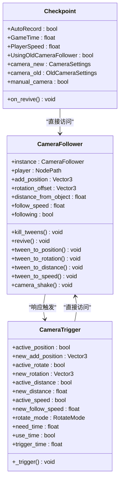
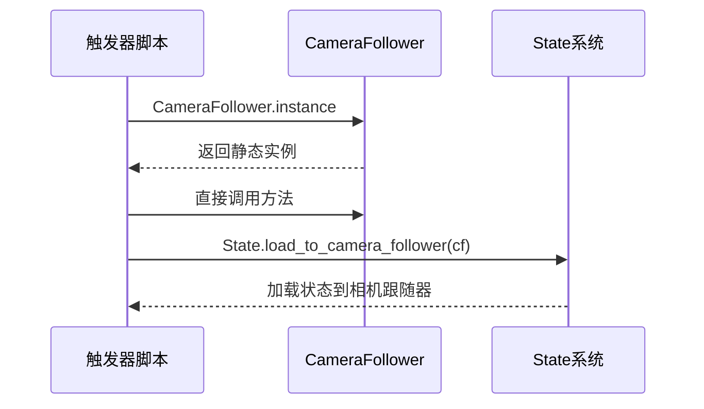
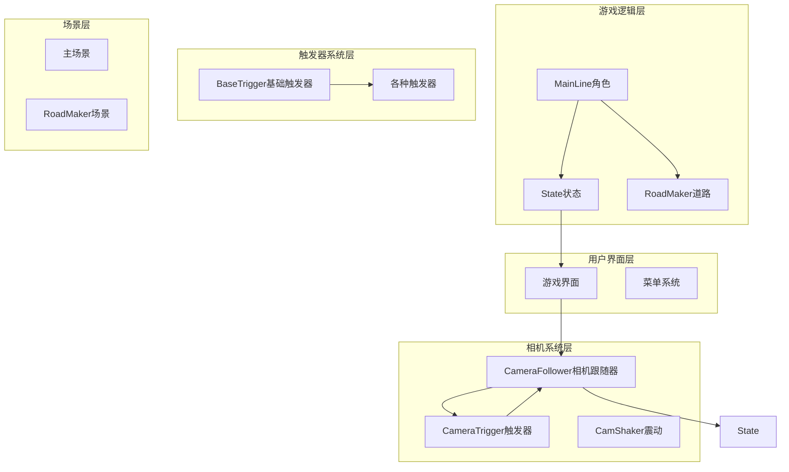
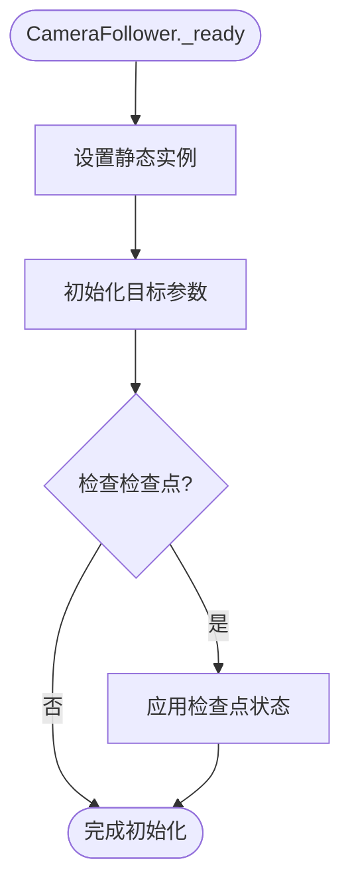
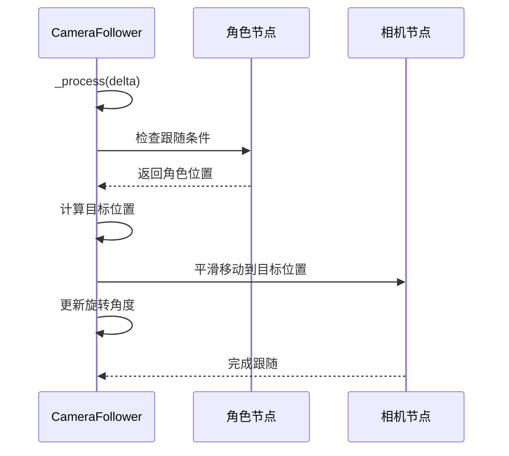
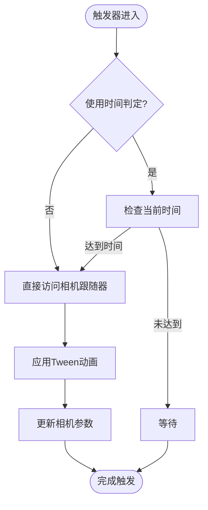
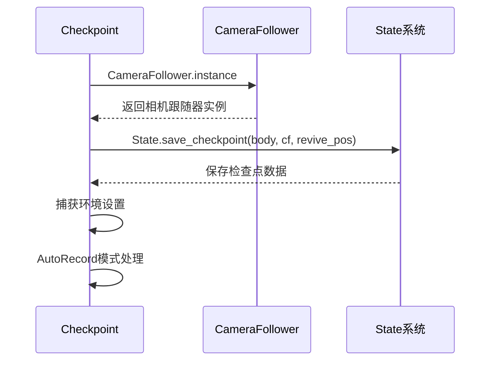
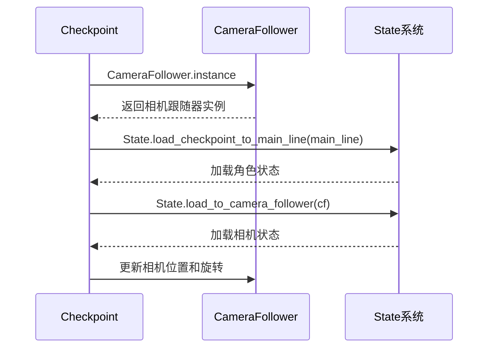
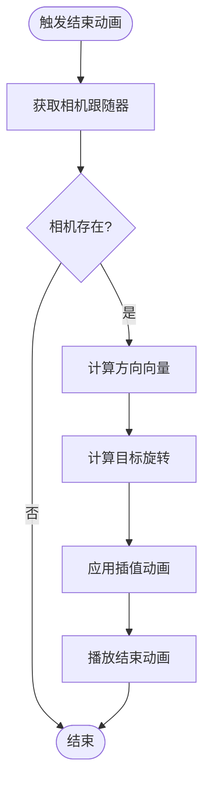
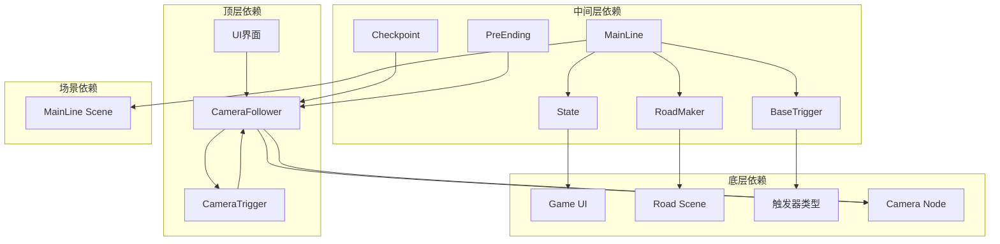

# 游戏管理器

<cite>
**本文档引用的文件**
- [CameraFollower.gd](file://#Template/[Scripts]/CameraScripts/CameraFollower.gd)
- [CameraTrigger.gd](file://#Template/[Scripts]/CameraScripts/CameraTrigger.gd)
- [Checkpoint.gd](file://#Template/[Scripts]/Trigger/Checkpoint.gd)
- [PreEnding.gd](file://#Template/[Scripts]/Trigger/PreEnding.gd)
- [State.gd](file://#Template/[Scripts]/State.gd)
- [BaseTrigger.gd](file://#Template/[Scripts]/Trigger/BaseTrigger.gd)
- [CameraSettings.gd](file://#Template/[Scripts]/Settings/CameraSettings.gd)
- [OldCameraSettings.gd](file://#Template/[Scripts]/Settings/OldCameraSettings.gd)
- [README.md](file://README.md)
</cite>

## 更新摘要
**所做更改**
- 删除了所有关于 GameManager 脚本的内容和引用
- 更新了相机跟随系统的访问方式说明
- 新增了直接使用 CameraFollower.instance 的说明
- 更新了相关的架构图和依赖关系分析
- 修改了故障排除指南中的相关问题

## 目录
1. [简介](#简介)
2. [项目结构](#项目结构)
3. [核心组件](#核心组件)
4. [架构概览](#架构概览)
5. [详细组件分析](#详细组件分析)
6. [依赖关系分析](#依赖关系分析)
7. [性能考虑](#性能考虑)
8. [故障排除指南](#故障排除指南)
9. [结论](#结论)

## 简介

Game Manager 是一个基于 Godot Engine 4.6 开发的 Dancing Line 游戏模板的核心管理系统。该项目实现了完整的线条游戏机制，包括角色控制、道路生成、相机跟随、触发器系统等核心功能。项目采用模块化设计，提供了高度的可扩展性和兼容性。

**重要更新**：GameManager 脚本已被完全删除，相机跟随器现在通过静态实例直接访问。

本项目的主要特点包括：
- 基于 Dancing Line 核心玩法的完整实现
- 与冰焰模板 3/4 的高兼容性
- 内置完整的测试框架（gdUnit4）
- 跨平台支持（Windows、Linux、macOS）
- 模块化的代码结构，易于扩展和定制

## 项目结构

项目采用清晰的模板化组织结构，主要包含以下核心目录：

```mermaid
graph TB
subgraph "项目根目录"
A[README.md]
B[project.godot]
C[export_presets.cfg]
end
subgraph "#Template/ 模板系统"
D[#Template/[Scripts]/]
E[#Template/[Scenes]/]
F[#Template/[Resources]/]
G[#Template/[Materials]/]
end
subgraph "测试系统"
H[Tests/]
I[addons/gdUnit4/]
end
subgraph "核心脚本"
D1[CameraFollower.gd]
D2[CameraTrigger.gd]
D3[State.gd]
D4[Checkpoint.gd]
D5[PreEnding.gd]
end
subgraph "触发器系统"
J[Trigger/]
K[BaseTrigger.gd]
L[各触发器类型]
end
subgraph "设置系统"
M[Settings/]
N[CameraSettings.gd]
O[OldCameraSettings.gd]
end
A --> D
D --> D1
D --> D2
D --> D3
D --> D4
D --> D5
D --> J
D --> M
J --> K
J --> L
M --> N
M --> O
```

**图表来源**
- [CameraFollower.gd:1-150](file://#Template/[Scripts]/CameraScripts/CameraFollower.gd#L1-L150)
- [CameraTrigger.gd:1-109](file://#Template/[Scripts]/CameraScripts/CameraTrigger.gd#L1-L109)
- [State.gd:1-22](file://#Template/[Scripts]/State.gd#L1-L22)

**章节来源**
- [README.md:53-65](file://README.md#L53-L65)

## 核心组件

### 相机跟随系统

相机跟随系统提供了灵活的摄像机控制机制，支持多种参数的动态调整。**重要更新**：现在通过静态实例直接访问，无需 GameManager 协调。



**图表来源**
- [CameraFollower.gd:1-150](file://#Template/[Scripts]/CameraScripts/CameraFollower.gd#L1-L150)
- [CameraTrigger.gd:1-109](file://#Template/[Scripts]/CameraScripts/CameraTrigger.gd#L1-L109)
- [Checkpoint.gd:1-210](file://#Template/[Scripts]/Trigger/Checkpoint.gd#L1-L210)

### 相机跟随器访问方式

**重要更新**：相机跟随器现在通过静态实例直接访问，替代了原有的 GameManager.get_camera_follower() 方式：



**图表来源**
- [CameraFollower.gd:37-45](file://#Template/[Scripts]/CameraScripts/CameraFollower.gd#L37-L45)
- [Checkpoint.gd:45](file://#Template/[Scripts]/Trigger/Checkpoint.gd#L45)
- [Checkpoint.gd:183-188](file://#Template/[Scripts]/Trigger/Checkpoint.gd#L183-L188)

**章节来源**
- [CameraFollower.gd:1-150](file://#Template/[Scripts]/CameraScripts/CameraFollower.gd#L1-L150)
- [CameraTrigger.gd:28-32](file://#Template/[Scripts]/CameraScripts/CameraTrigger.gd#L28-L32)
- [Checkpoint.gd:54](file://#Template/[Scripts]/Trigger/Checkpoint.gd#L54)

## 架构概览

游戏的整体架构采用了分层设计，各个组件之间通过清晰的接口进行通信。**重要更新**：去除了 GameManager 作为中介层，直接通过静态实例访问相机跟随器。



**图表来源**
- [CameraFollower.gd:1-150](file://#Template/[Scripts]/CameraScripts/CameraFollower.gd#L1-L150)
- [CameraTrigger.gd:1-109](file://#Template/[Scripts]/CameraScripts/CameraTrigger.gd#L1-L109)
- [State.gd:1-22](file://#Template/[Scripts]/State.gd#L1-L22)

## 详细组件分析

### CameraFollower 相机跟随器

CameraFollower 现在作为独立的静态实例提供相机控制功能，无需 GameManager 协调：

#### 核心属性和方法

| 属性名 | 类型 | 描述 | 默认值 |
|--------|------|------|--------|
| instance | CameraFollower | 静态实例引用 | null |
| player | NodePath | 相机跟随的角色节点 | null |
| add_position | Vector3 | 相机偏移位置 | Vector3.ZERO |
| rotation_offset | Vector3 | 旋转偏移角度 | Vector3(45, 45, 0) |
| distance_from_object | float | 相机距离 | 25.0 |
| follow_speed | float | 跟随速度 | 1.2 |
| following | bool | 是否跟随 | true |

#### 静态实例初始化流程



**图表来源**
- [CameraFollower.gd:37-45](file://#Template/[Scripts]/CameraScripts/CameraFollower.gd#L37-L45)

#### 相机跟随算法



**图表来源**
- [CameraFollower.gd:47-72](file://#Template/[Scripts]/CameraScripts/CameraFollower.gd#L47-L72)

**章节来源**
- [CameraFollower.gd:1-150](file://#Template/[Scripts]/CameraScripts/CameraFollower.gd#L1-L150)

### CameraTrigger 相机触发器

CameraTrigger 现在直接通过 CameraFollower.instance 访问相机跟随器：

#### 直接访问流程



**图表来源**
- [CameraTrigger.gd:40-56](file://#Template/[Scripts]/CameraScripts/CameraTrigger.gd#L40-L56)
- [CameraTrigger.gd:57-109](file://#Template/[Scripts]/CameraScripts/CameraTrigger.gd#L57-L109)

#### 参数更新机制

| 参数类型 | 更新方式 | 目标值 | 动画时长 |
|----------|----------|--------|----------|
| 位置偏移 | 直接属性修改 | new_add_position | need_time |
| 旋转角度 | 逐轴插值 | new_rotation | need_time |
| 相机距离 | 直接属性修改 | new_distance | need_time |
| 跟随速度 | 直接属性修改 | new_follow_speed | need_time |

**章节来源**
- [CameraTrigger.gd:1-109](file://#Template/[Scripts]/CameraScripts/CameraTrigger.gd#L1-L109)

### Checkpoint 检查点系统

Checkpoint 现在直接使用 CameraFollower.instance 进行相机状态保存和恢复：

#### 检查点保存流程



**图表来源**
- [Checkpoint.gd:40-72](file://#Template/[Scripts]/Trigger/Checkpoint.gd#L40-L72)

#### 检查点恢复流程



**图表来源**
- [Checkpoint.gd:155-190](file://#Template/[Scripts]/Trigger/Checkpoint.gd#L155-L190)

**章节来源**
- [Checkpoint.gd:1-210](file://#Template/[Scripts]/Trigger/Checkpoint.gd#L1-L210)

### PreEnding 结束动画触发器

PreEnding 现在直接通过 CameraFollower.instance 控制相机视角：

#### 相机视角控制流程



**图表来源**
- [PreEnding.gd:6-30](file://#Template/[Scripts]/Trigger/PreEnding.gd#L6-L30)

**章节来源**
- [PreEnding.gd:1-31](file://#Template/[Scripts]/Trigger/PreEnding.gd#L1-L31)

## 依赖关系分析

游戏系统的组件间依赖关系呈现清晰的层次结构，**重要更新**：去除了 GameManager 作为中介层。



**图表来源**
- [CameraFollower.gd:1-150](file://#Template/[Scripts]/CameraScripts/CameraFollower.gd#L1-L150)
- [CameraTrigger.gd:1-109](file://#Template/[Scripts]/CameraScripts/CameraTrigger.gd#L1-L109)
- [State.gd:1-22](file://#Template/[Scripts]/State.gd#L1-L22)

### 关键依赖链

1. **UI → CameraFollower**: 用户界面直接访问相机跟随器
2. **CameraTrigger → CameraFollower**: 触发器直接访问相机跟随器
3. **Checkpoint → CameraFollower**: 检查点系统直接访问相机跟随器
4. **PreEnding → CameraFollower**: 结束动画直接访问相机跟随器
5. **MainLine → State**: 角色控制读取和更新游戏状态

**章节来源**
- [CameraFollower.gd:1-150](file://#Template/[Scripts]/CameraScripts/CameraFollower.gd#L1-L150)
- [CameraTrigger.gd:28-32](file://#Template/[Scripts]/CameraScripts/CameraTrigger.gd#L28-L32)
- [Checkpoint.gd:54](file://#Template/[Scripts]/Trigger/Checkpoint.gd#L54)
- [PreEnding.gd:10](file://#Template/[Scripts]/Trigger/PreEnding.gd#L10)

## 性能考虑

### 优化策略

1. **静态实例访问**：通过 CameraFollower.instance 直接访问，避免了 GameManager 的额外开销
2. **延迟补偿机制**：MainLine 实现了精确的音画同步，通过考虑音频混音和输出延迟来避免同步偏差
3. **状态持久化**：State 系统支持游戏状态的保存和恢复，减少重新开始时的计算开销
4. **相机跟随优化**：CameraFollower 使用球面线性插值（SLERP）实现平滑的相机跟随，同时支持 Tween 动画
5. **内存管理**：RoadMaker 使用延迟添加机制，避免频繁的场景树操作

### 性能监控点

- 静态实例的生命周期管理
- 相机跟随的平滑度和响应速度
- 触发器系统的信号连接和事件处理
- 轨迹线段的动态创建和销毁

## 故障排除指南

### 常见问题及解决方案

#### 相机跟随异常

**问题症状**：相机不跟随角色或跟随不平滑
**可能原因**：
- 相机跟随器未正确设置 player 节点
- Static.instance 未正确初始化
- State 中的相机状态未正确保存

**解决步骤**：
1. 检查 CameraFollower 的 player 节点路径
2. 验证 _ready 方法中 instance 的设置
3. 确认 State 中的相机状态数据

#### 相机触发器不工作

**问题症状**：触发器无法正常改变相机参数
**可能原因**：
- CameraFollower.instance 返回 null
- 触发器时间判定条件不满足
- 相机参数设置无效

**解决步骤**：
1. 检查 CameraFollower 是否已正确初始化
2. 验证触发器的时间判定逻辑
3. 确认相机参数的有效范围

#### 检查点系统异常

**问题症状**：检查点保存或恢复失败
**可能原因**：
- CameraFollower.instance 访问失败
- State 数据加载异常
- 相机状态恢复逻辑错误

**解决步骤**：
1. 检查相机跟随器的实例状态
2. 验证 State.load_to_camera_follower 方法
3. 确认相机状态的恢复顺序

#### 音画不同步

**问题症状**：动画与音乐播放不同步
**可能原因**：
- 音频延迟计算不准确
- 音乐播放器状态异常
- 动画节点未正确同步

**解决步骤**：
1. 检查 MainLine 中的音频延迟补偿
2. 验证音乐播放器的播放状态
3. 确认动画节点的同步逻辑

**章节来源**
- [CameraFollower.gd:37-45](file://#Template/[Scripts]/CameraScripts/CameraFollower.gd#L37-L45)
- [CameraTrigger.gd:28-32](file://#Template/[Scripts]/CameraScripts/CameraTrigger.gd#L28-L32)
- [Checkpoint.gd:183-188](file://#Template/[Scripts]/Trigger/Checkpoint.gd#L183-L188)

## 结论

Game Manager 项目展现了现代游戏开发的最佳实践，通过模块化设计和清晰的架构分离，实现了功能完整且易于维护的游戏系统。**重要更新**：移除了 GameManager 作为中介层，直接通过静态实例访问相机跟随器，简化了架构并提高了性能。

项目的主要优势包括：

1. **架构简化**：移除 GameManager 后，架构更加简洁明了
2. **性能提升**：直接访问静态实例减少了调用开销
3. **功能完整**：涵盖了现代线条游戏的所有核心功能
4. **状态管理**：通过 State 系统实现了完整的状态持久化
5. **测试友好**：集成了 gdUnit4 测试框架，保障了代码质量
6. **兼容性强**：与多个模板系统保持高度兼容

该项目为开发者提供了一个坚实的基础，可以在此基础上快速开发和定制自己的 Dancing Line 风格游戏。其模块化的设计理念和完善的测试体系，使得项目具有很高的可扩展性和可持续发展性。