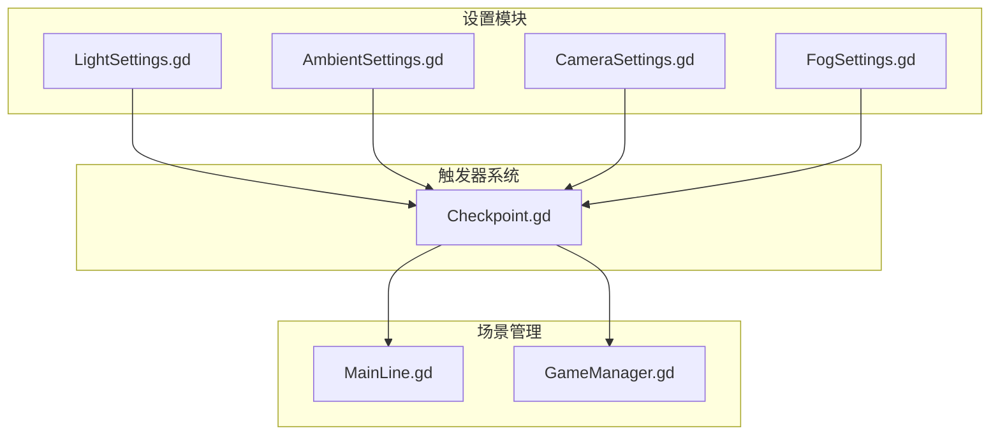
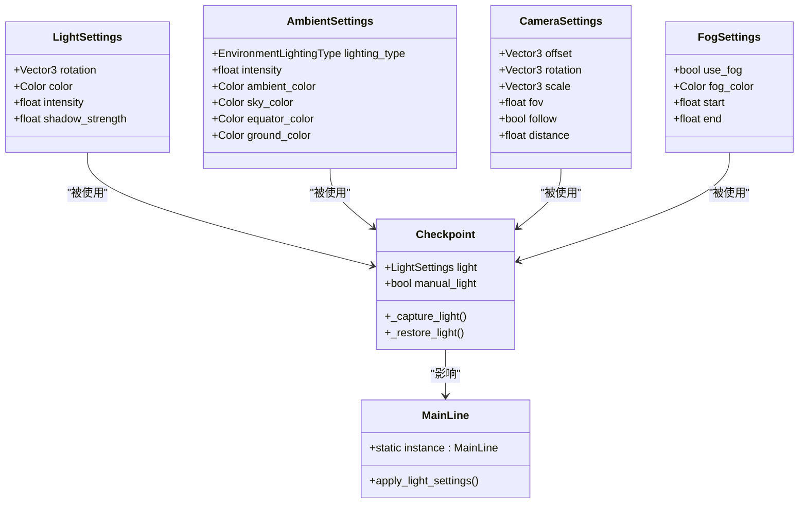
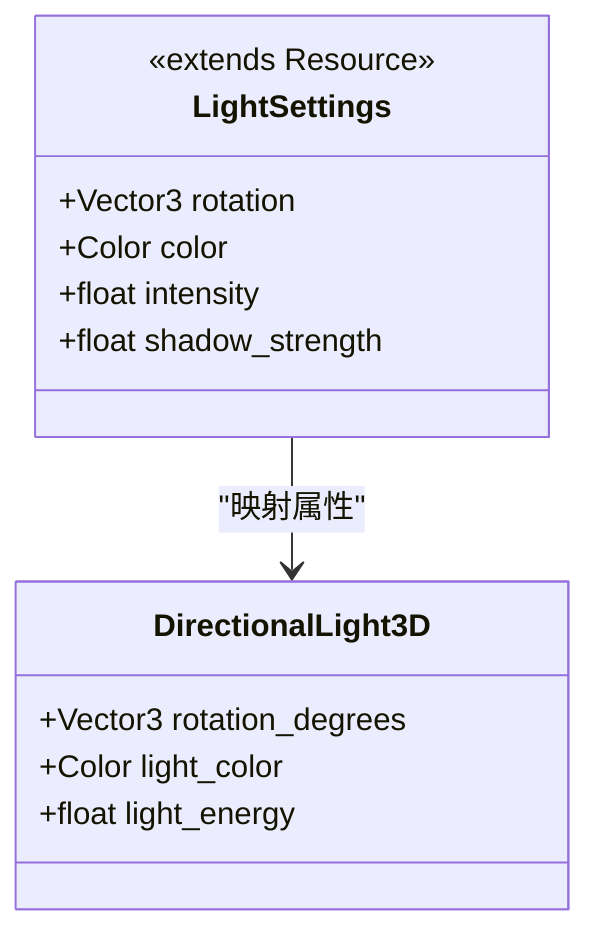
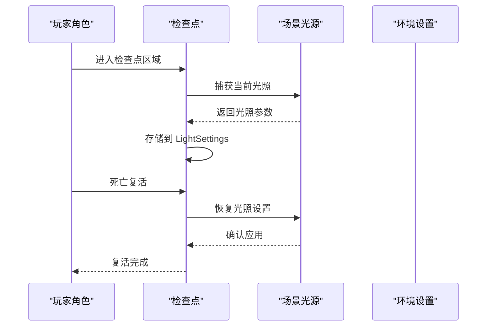
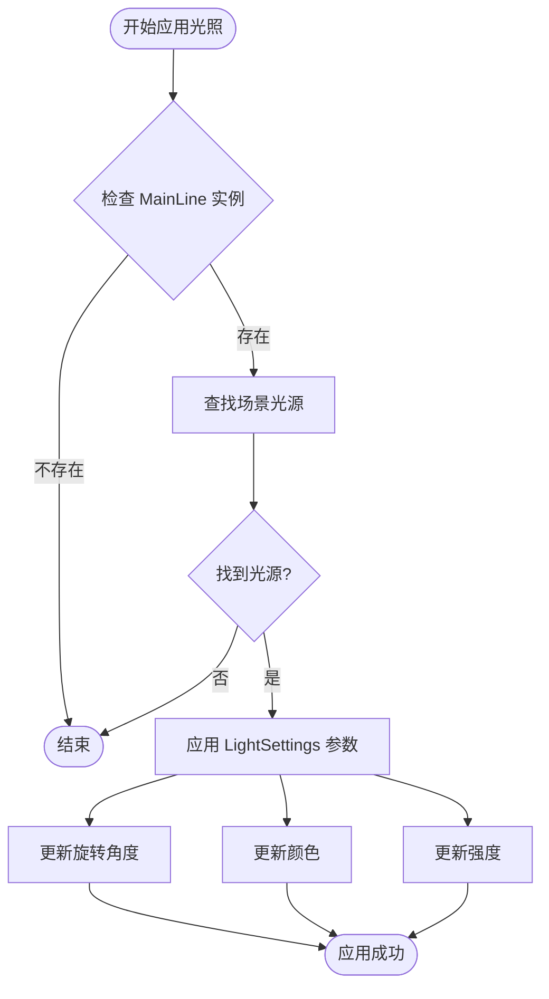
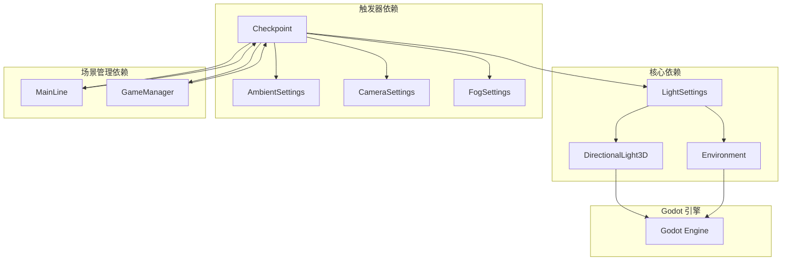

# Light Settings

<cite>
**本文档引用的文件**
- [LightSettings.gd](file://#Template/[Scripts]/Settings/LightSettings.gd)
- [AmbientSettings.gd](file://#Template/[Scripts]/Settings/AmbientSettings.gd)
- [CameraSettings.gd](file://#Template/[Scripts]/Settings/CameraSettings.gd)
- [FogSettings.gd](file://#Template/[Scripts]/Settings/FogSettings.gd)
- [Checkpoint.gd](file://#Template/[Scripts]/Trigger/Checkpoint.gd)
- [MainLine.gd](file://#Template/[Scripts]/Level/MainLine.gd)
- [GameManager.gd](file://#Template/[Scripts]/GameManager.gd)
- [README.md](file://README.md)
</cite>

## 目录
1. [简介](#简介)
2. [项目结构](#项目结构)
3. [核心组件](#核心组件)
4. [架构概览](#架构概览)
5. [详细组件分析](#详细组件分析)
6. [依赖关系分析](#依赖关系分析)
7. [性能考虑](#性能考虑)
8. [故障排除指南](#故障排除指南)
9. [结论](#结论)

## 简介

Light Settings 是 Godot Line 模板中的一个关键组件，负责管理和控制场景中的光照效果。该系统提供了完整的光照参数配置，包括方向光的方向、颜色、强度以及阴影强度等属性。Light Settings 与其他设置组件（如环境光照、雾效、相机设置）协同工作，为游戏提供一致且可定制的视觉体验。

基于 Godot Engine 4.6 开发的 Dancing Line 游戏模板框架，Light Settings 作为核心视觉组件之一，为玩家提供了沉浸式的游戏环境。该系统的设计注重模块化和可扩展性，允许开发者轻松调整和优化游戏的视觉效果。

## 项目结构

Light Settings 系统位于模板项目的设置模块中，与相关的触发器、场景管理器和其他组件紧密集成：

**图表来源**
- [LightSettings.gd:1-7](file://#Template/[Scripts]/Settings/LightSettings.gd#L1-L7)
- [Checkpoint.gd:23-29](file://#Template/[Scripts]/Trigger/Checkpoint.gd#L23-L29)

**章节来源**
- [README.md:52-61](file://README.md#L52-L61)

## 核心组件

Light Settings 系统包含以下核心组件：

### LightSettings 类
LightSettings 是一个继承自 Resource 的类，专门用于存储和管理光照参数。它提供了四个主要属性：
- **rotation**: 方向光的旋转角度（Vector3）
- **color**: 光照颜色（Color）
- **intensity**: 光照强度（float）
- **shadow_strength**: 阴影强度（0.0 到 1.0）

### AmbientSettings 类
环境光照设置，支持多种光照类型（天空盒、纯色、渐变），包含环境光强度和颜色配置。

### CameraSettings 类
相机视角设置，控制相机的位置、旋转、缩放和视野角度。

### FogSettings 类
雾效设置，控制是否启用雾效以及雾的颜色和范围。

**章节来源**
- [LightSettings.gd:1-7](file://#Template/[Scripts]/Settings/LightSettings.gd#L1-L7)
- [AmbientSettings.gd:1-12](file://#Template/[Scripts]/Settings/AmbientSettings.gd#L1-L12)
- [CameraSettings.gd:1-9](file://#Template/[Scripts]/Settings/CameraSettings.gd#L1-L9)
- [FogSettings.gd:1-7](file://#Template/[Scripts]/Settings/FogSettings.gd#L1-L7)

## 架构概览

Light Settings 系统采用模块化架构设计，各个组件之间通过清晰的接口进行交互：

**图表来源**
- [LightSettings.gd:1-7](file://#Template/[Scripts]/Settings/LightSettings.gd#L1-L7)
- [Checkpoint.gd:23-29](file://#Template/[Scripts]/Trigger/Checkpoint.gd#L23-L29)
- [Checkpoint.gd:90-98](file://#Template/[Scripts]/Trigger/Checkpoint.gd#L90-L98)
- [Checkpoint.gd:138-146](file://#Template/[Scripts]/Trigger/Checkpoint.gd#L138-L146)

## 详细组件分析

### LightSettings 组件

LightSettings 类是光照系统的核心，提供了完整的光照参数配置能力：

**图表来源**
- [LightSettings.gd:1-7](file://#Template/[Scripts]/Settings/LightSettings.gd#L1-L7)
- [Checkpoint.gd:90-98](file://#Template/[Scripts]/Trigger/Checkpoint.gd#L90-L98)
- [Checkpoint.gd:138-146](file://#Template/[Scripts]/Trigger/Checkpoint.gd#L138-L146)

#### 属性详解

1. **rotation (Vector3)**: 控制方向光的三维旋转，支持绕 X、Y、Z 轴的独立旋转
2. **color (Color)**: 设置光照的颜色值，支持 RGBA 配置
3. **intensity (float)**: 控制光照的强度，数值越大光线越亮
4. **shadow_strength (float)**: 控制阴影的强度，范围 0.0 到 1.0

**章节来源**
- [LightSettings.gd:4-7](file://#Template/[Scripts]/Settings/LightSettings.gd#L4-L7)

### Checkpoint 触发器中的 LightSettings 使用

Checkpoint 触发器实现了完整的光照捕获和恢复机制：

**图表来源**
- [Checkpoint.gd:48-81](file://#Template/[Scripts]/Trigger/Checkpoint.gd#L48-L81)
- [Checkpoint.gd:90-98](file://#Template/[Scripts]/Trigger/Checkpoint.gd#L90-L98)
- [Checkpoint.gd:138-146](file://#Template/[Scripts]/Trigger/Checkpoint.gd#L138-L146)

#### 捕获流程

当玩家进入检查点时，系统会自动捕获当前场景的光照设置：

1. **获取场景光源**: 查找名为 "scene_light" 的方向光节点
2. **读取光照参数**: 从光源节点读取旋转、颜色和强度信息
3. **存储到 LightSettings**: 将参数保存到检查点的 LightSettings 实例中

#### 恢复流程

当玩家死亡并复活时，系统会恢复之前捕获的光照设置：

1. **获取场景光源**: 再次查找方向光节点
2. **应用光照参数**: 将 LightSettings 中存储的参数应用到光源节点
3. **更新环境**: 确保所有光照变化生效

**章节来源**
- [Checkpoint.gd:90-98](file://#Template/[Scripts]/Trigger/Checkpoint.gd#L90-L98)
- [Checkpoint.gd:138-146](file://#Template/[Scripts]/Trigger/Checkpoint.gd#L138-L146)

### MainLine 场景中的光照应用

MainLine 类提供了光照设置的应用接口：

**图表来源**
- [MainLine.gd:5-6](file://#Template/[Scripts]/Level/MainLine.gd#L5-L6)
- [Checkpoint.gd:138-146](file://#Template/[Scripts]/Trigger/Checkpoint.gd#L138-L146)

**章节来源**
- [MainLine.gd:5-6](file://#Template/[Scripts]/Level/MainLine.gd#L5-L6)

## 依赖关系分析

Light Settings 系统与其他组件之间的依赖关系如下：

**图表来源**
- [Checkpoint.gd:23-29](file://#Template/[Scripts]/Trigger/Checkpoint.gd#L23-L29)
- [Checkpoint.gd:90-98](file://#Template/[Scripts]/Trigger/Checkpoint.gd#L90-L98)
- [Checkpoint.gd:138-146](file://#Template/[Scripts]/Trigger/Checkpoint.gd#L138-L146)

### 直接依赖

1. **DirectionalLight3D**: LightSettings 直接映射到方向光节点的属性
2. **Environment**: 环境光照设置与全局环境参数相关联
3. **Checkpoint**: 触发器系统使用 LightSettings 进行光照状态管理

### 间接依赖

1. **MainLine**: 通过触发器间接使用 LightSettings
2. **GameManager**: 提供场景管理功能支持
3. **Godot 引擎**: 依赖引擎的光照渲染系统

**章节来源**
- [Checkpoint.gd:90-98](file://#Template/[Scripts]/Trigger/Checkpoint.gd#L90-L98)
- [Checkpoint.gd:138-146](file://#Template/[Scripts]/Trigger/Checkpoint.gd#L138-L146)

## 性能考虑

Light Settings 系统在设计时充分考虑了性能优化：

### 内存管理
- LightSettings 继承自 Resource，具有良好的内存管理特性
- 自动垃圾回收机制避免内存泄漏
- 轻量级数据结构减少内存占用

### 渲染优化
- 实时光照参数更新可能影响渲染性能
- 建议在不需要频繁更新时缓存光照设置
- 合理使用阴影强度避免过度的阴影计算

### 更新策略
- 只在必要时更新光照参数
- 批量更新多个参数时使用单次应用
- 避免在渲染循环中频繁创建新的 LightSettings 实例

## 故障排除指南

### 常见问题及解决方案

#### 问题1: 光照设置不生效
**症状**: 修改 LightSettings 后场景光照没有变化
**解决方案**:
1. 确认场景中存在名为 "scene_light" 的方向光节点
2. 检查 LightSettings 是否正确应用到光源节点
3. 验证环境设置中的光照模式

#### 问题2: 阴影质量异常
**症状**: 阴影过于强烈或过于微弱
**解决方案**:
1. 调整 shadow_strength 参数范围 (0.0-1.0)
2. 检查光源的阴影设置
3. 验证场景的阴影质量设置

#### 问题3: 性能下降
**症状**: 应用光照设置后帧率明显下降
**解决方案**:
1. 减少光照参数的更新频率
2. 使用缓存机制避免重复应用
3. 优化场景中的光源数量

**章节来源**
- [Checkpoint.gd:90-98](file://#Template/[Scripts]/Trigger/Checkpoint.gd#L90-L98)
- [Checkpoint.gd:138-146](file://#Template/[Scripts]/Trigger/Checkpoint.gd#L138-L146)

## 结论

Light Settings 系统为 Godot Line 模板提供了强大而灵活的光照管理能力。通过模块化的架构设计，该系统能够与其他设置组件无缝协作，为游戏开发者提供了完整的光照控制解决方案。

系统的主要优势包括：
- **模块化设计**: 清晰的组件分离便于维护和扩展
- **实时应用**: 支持运行时动态调整光照效果
- **性能优化**: 考虑了渲染性能和内存使用
- **易用性**: 简洁的 API 和直观的参数配置

未来可以考虑的功能增强：
- 添加更多光照类型支持（点光源、聚光灯等）
- 实现光照动画和过渡效果
- 增加光照预设管理功能
- 提供光照调试工具和可视化界面

通过持续的优化和扩展，Light Settings 系统将继续为 Dancing Line 游戏模板提供可靠的光照解决方案。