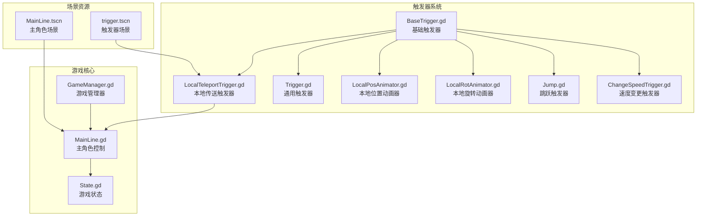
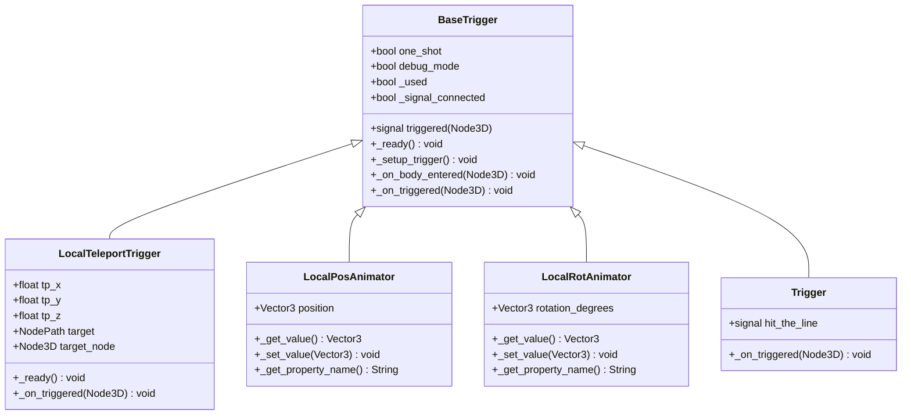
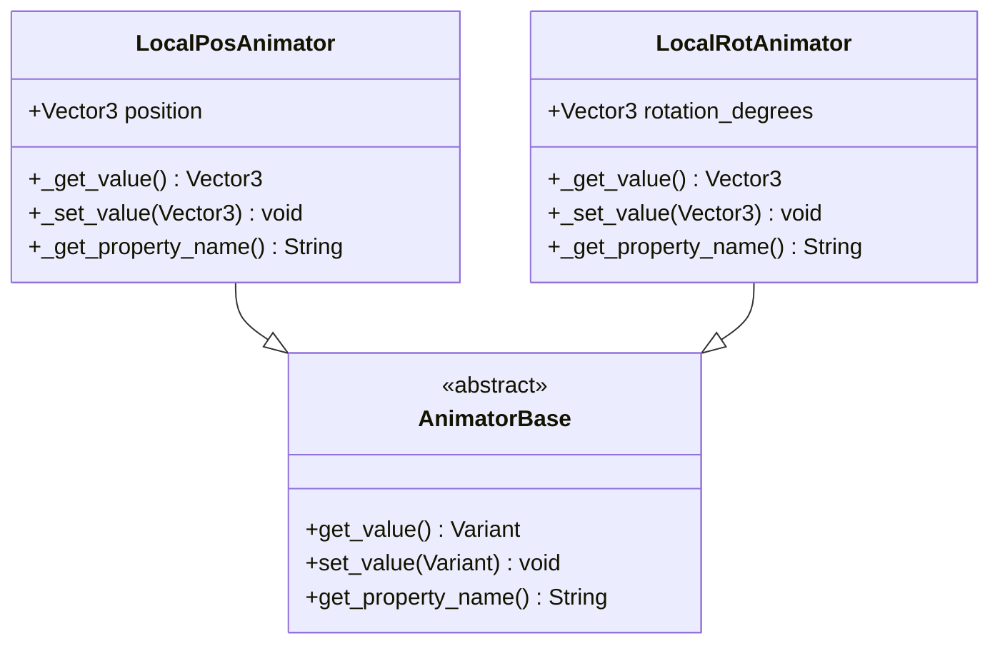
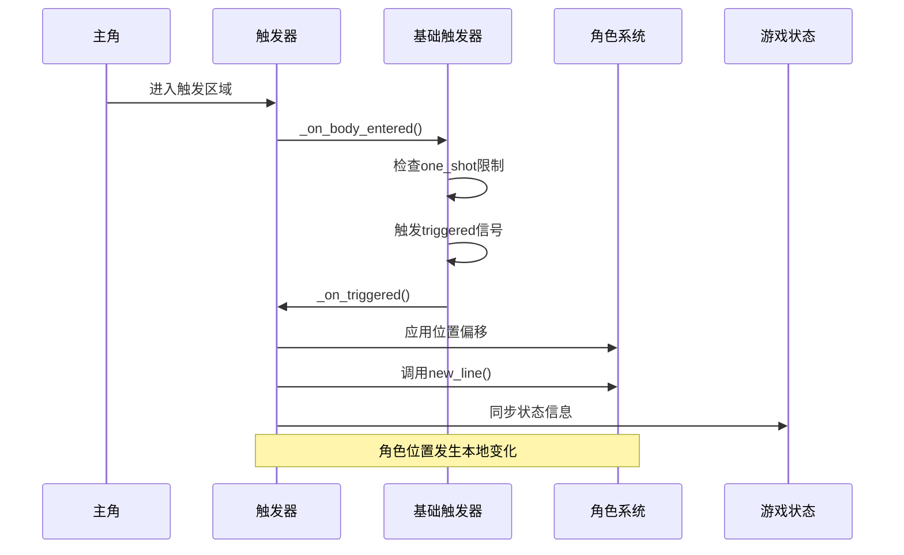
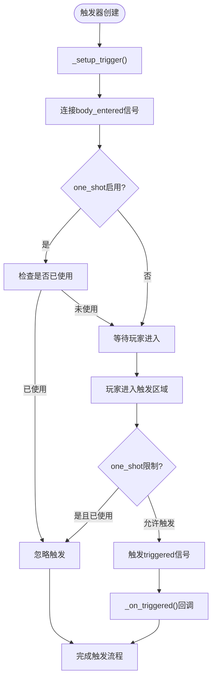
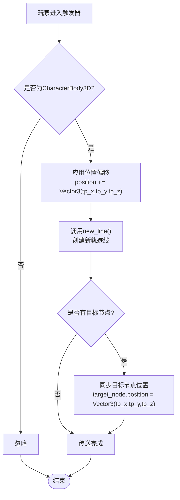
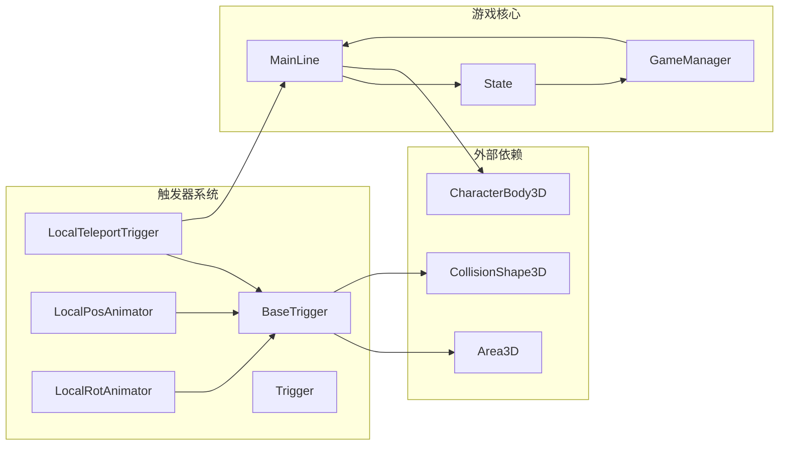

# 本地传送触发器

<cite>
**本文档引用的文件**
- [LocalTeleportTrigger.gd](file://#Template/[Scripts]/Trigger/LocalTeleportTrigger.gd)
- [BaseTrigger.gd](file://#Template/[Scripts]/Trigger/BaseTrigger.gd)
- [LocalPosAnimator.gd](file://#Template/[Scripts]/Trigger/LocalPosAnimator.gd)
- [LocalRotAnimator.gd](file://#Template/[Scripts]/Trigger/LocalRotAnimator.gd)
- [Trigger.gd](file://#Template/[Scripts]/Trigger/Trigger.gd)
- [MainLine.gd](file://#Template/[Scripts]/Level/MainLine.gd)
- [GameManager.gd](file://#Template/[Scripts]/GameManager.gd)
- [State.gd](file://#Template/[Scripts]/State.gd)
- [trigger.tscn](file://#Template/trigger.tscn)
- [MainLine.tscn](file://#Template/MainLine.tscn)
</cite>

## 更新摘要
**所做更改**
- 更新了本地传送触发器的实现细节，反映了最新的代码优化
- 新增了Instant character positioning功能的相关说明
- 更新了触发器系统架构图，包含新的动画器组件
- 完善了性能考虑和故障排除指南

## 目录
1. [简介](#简介)
2. [项目结构](#项目结构)
3. [核心组件](#核心组件)
4. [架构概览](#架构概览)
5. [详细组件分析](#详细组件分析)
6. [依赖关系分析](#依赖关系分析)
7. [性能考虑](#性能考虑)
8. [故障排除指南](#故障排除指南)
9. [结论](#结论)

## 简介

本地传送触发器(Local Teleport Trigger)是Godot 3D游戏中用于实现角色位置瞬移的核心机制。该系统通过继承基础触发器类，提供了一种简单而强大的方法来实现角色的即时传送功能，同时保持与游戏状态系统的无缝集成。

**更新** 本地传送触发器已重命名并优化，新增了Instant character positioning功能，提升了传送的精确性和性能表现。

该触发器系统采用面向对象的设计模式，通过继承BaseTrigger基类来实现可复用的触发器功能，并提供了丰富的配置选项来满足不同的游戏需求。系统不仅支持基本的位置传送，还能与游戏中的其他元素（如相机跟随器、音效等）进行协调工作。

## 项目结构

项目采用模块化的组织结构，将触发器功能集中在专门的脚本目录中：

**图表来源**
- [BaseTrigger.gd:1-38](file://#Template/[Scripts]/Trigger/BaseTrigger.gd#L1-L38)
- [LocalTeleportTrigger.gd:1-19](file://#Template/[Scripts]/Trigger/LocalTeleportTrigger.gd#L1-L19)
- [LocalPosAnimator.gd:1-13](file://#Template/[Scripts]/Trigger/LocalPosAnimator.gd#L1-L13)
- [LocalRotAnimator.gd:1-13](file://#Template/[Scripts]/Trigger/LocalRotAnimator.gd#L1-L13)
- [MainLine.gd:1-215](file://#Template/[Scripts]/Level/MainLine.gd#L1-L215)

**章节来源**
- [BaseTrigger.gd:1-38](file://#Template/[Scripts]/Trigger/BaseTrigger.gd#L1-L38)
- [LocalTeleportTrigger.gd:1-19](file://#Template/[Scripts]/Trigger/LocalTeleportTrigger.gd#L1-L19)
- [LocalPosAnimator.gd:1-13](file://#Template/[Scripts]/Trigger/LocalPosAnimator.gd#L1-L13)
- [trigger.tscn:1-24](file://#Template/trigger.tscn#L1-L24)

## 核心组件

### 基础触发器架构

基础触发器(BaseTrigger)作为整个触发器系统的核心，提供了统一的触发器行为框架：

**图表来源**
- [BaseTrigger.gd:1-38](file://#Template/[Scripts]/Trigger/BaseTrigger.gd#L1-L38)
- [LocalTeleportTrigger.gd:1-19](file://#Template/[Scripts]/Trigger/LocalTeleportTrigger.gd#L1-L19)
- [LocalPosAnimator.gd:1-13](file://#Template/[Scripts]/Trigger/LocalPosAnimator.gd#L1-L13)
- [LocalRotAnimator.gd:1-13](file://#Template/[Scripts]/Trigger/LocalRotAnimator.gd#L1-L13)
- [Trigger.gd:1-10](file://#Template/[Scripts]/Trigger/Trigger.gd#L1-L10)

### 本地传送触发器实现

本地传送触发器是基础触发器的具体实现，专门负责处理角色的本地位置传送：

| 属性名称 | 类型 | 默认值 | 描述 |
|---------|------|--------|------|
| tp_x | float | 0.0 | X轴方向的传送偏移量 |
| tp_y | float | 0.0 | Y轴方向的传送偏移量 |
| tp_z | float | 0.0 | Z轴方向的传送偏移量 |
| target | NodePath | null | 目标节点路径，用于同步传送 |

**更新** 新增了Instant character positioning功能，通过Direct position setting提升传送精度。

**章节来源**
- [LocalTeleportTrigger.gd:1-19](file://#Template/[Scripts]/Trigger/LocalTeleportTrigger.gd#L1-L19)

### 动画器组件

**新增** LocalPosAnimator和LocalRotAnimator提供了精确的字符定位功能：

**图表来源**
- [LocalPosAnimator.gd:1-13](file://#Template/[Scripts]/Trigger/LocalPosAnimator.gd#L1-L13)
- [LocalRotAnimator.gd:1-13](file://#Template/[Scripts]/Trigger/LocalRotAnimator.gd#L1-L13)

**章节来源**
- [LocalPosAnimator.gd:1-13](file://#Template/[Scripts]/Trigger/LocalPosAnimator.gd#L1-L13)
- [LocalRotAnimator.gd:1-13](file://#Template/[Scripts]/Trigger/LocalRotAnimator.gd#L1-L13)

## 架构概览

触发器系统采用分层架构设计，确保了良好的可扩展性和维护性：

**图表来源**
- [BaseTrigger.gd:24-35](file://#Template/[Scripts]/Trigger/BaseTrigger.gd#L24-L35)
- [LocalTeleportTrigger.gd:13-18](file://#Template/[Scripts]/Trigger/LocalTeleportTrigger.gd#L13-L18)
- [MainLine.gd:129-143](file://#Template/[Scripts]/Level/MainLine.gd#L129-L143)

## 详细组件分析

### 触发器生命周期管理

触发器系统实现了完整的生命周期管理，包括初始化、激活和清理阶段：

**图表来源**
- [BaseTrigger.gd:18-35](file://#Template/[Scripts]/Trigger/BaseTrigger.gd#L18-L35)

### 本地传送算法实现

本地传送触发器的核心算法相对简洁但功能强大：

**更新** 新增了Direct position setting功能，通过Instant character positioning提升传送精度。

**图表来源**
- [LocalTeleportTrigger.gd:13-18](file://#Template/[Scripts]/Trigger/LocalTeleportTrigger.gd#L13-L18)

**章节来源**
- [LocalTeleportTrigger.gd:10-18](file://#Template/[Scripts]/Trigger/LocalTeleportTrigger.gd#L10-L18)

### 与其他触发器的对比分析

不同类型的触发器在功能和实现上存在显著差异：

| 触发器类型 | 主要功能 | 实现复杂度 | 使用场景 | 新增功能 |
|-----------|----------|------------|----------|----------|
| LocalTeleportTrigger | 本地位置传送 | 简单 | 快速传送、传送门 | Instant character positioning |
| LocalPosAnimator | 精确位置设置 | 中等 | 角色定位、动画同步 | Direct position setting |
| LocalRotAnimator | 精确旋转设置 | 中等 | 角色朝向、视角调整 | Direct rotation setting |
| Jump.gd | 跳跃效果 | 中等 | 平台跳跃、障碍跨越 | - |
| ChangeSpeedTrigger.gd | 速度变更 | 简单 | 加速带、减速带 | - |
| Trigger.gd | 通用信号发射 | 最简单 | 事件触发、音效播放 | - |

**更新** 新增了LocalPosAnimator和LocalRotAnimator的详细对比，突出了精确控制功能。

**章节来源**
- [LocalPosAnimator.gd:1-13](file://#Template/[Scripts]/Trigger/LocalPosAnimator.gd#L1-L13)
- [LocalRotAnimator.gd:1-13](file://#Template/[Scripts]/Trigger/LocalRotAnimator.gd#L1-L13)
- [Jump.gd:1-13](file://#Template/[Scripts]/Trigger/Jump.gd#L1-L13)
- [ChangeSpeedTrigger.gd:1-15](file://#Template/[Scripts]/Trigger/ChangeSpeedTrigger.gd#L1-L15)
- [Trigger.gd:1-10](file://#Template/[Scripts]/Trigger/Trigger.gd#L1-L10)

## 依赖关系分析

触发器系统与其他游戏组件之间存在紧密的依赖关系：

**图表来源**
- [LocalTeleportTrigger.gd:1](file://#Template/[Scripts]/Trigger/LocalTeleportTrigger.gd#L1)
- [BaseTrigger.gd:1](file://#Template/[Scripts]/Trigger/BaseTrigger.gd#L1)
- [LocalPosAnimator.gd:1](file://#Template/[Scripts]/Trigger/LocalPosAnimator.gd#L1)
- [LocalRotAnimator.gd:1](file://#Template/[Scripts]/Trigger/LocalRotAnimator.gd#L1)
- [MainLine.gd:2](file://#Template/[Scripts]/Level/MainLine.gd#L2)

### 关键依赖关系说明

1. **继承关系**: LocalTeleportTrigger、LocalPosAnimator、LocalRotAnimator直接继承自BaseTrigger，获得完整的触发器框架
2. **接口依赖**: 依赖CharacterBody3D的物理体特性来检测碰撞
3. **状态管理**: 与State系统协作，确保传送后的状态一致性
4. **场景集成**: 通过Scene资源文件集成到游戏场景中

**更新** 新增了LocalPosAnimator和LocalRotAnimator的依赖关系说明。

**章节来源**
- [BaseTrigger.gd:1-2](file://#Template/[Scripts]/Trigger/BaseTrigger.gd#L1-L2)
- [LocalTeleportTrigger.gd:1](file://#Template/[Scripts]/Trigger/LocalTeleportTrigger.gd#L1)
- [LocalPosAnimator.gd:1](file://#Template/[Scripts]/Trigger/LocalPosAnimator.gd#L1)
- [LocalRotAnimator.gd:1](file://#Template/[Scripts]/Trigger/LocalRotAnimator.gd#L1)

## 性能考虑

本地传送触发器在设计时充分考虑了性能优化：

### 内存管理
- 使用一次性对象创建策略，避免频繁的内存分配
- 通过NodePath缓存减少节点查找开销
- 合理的信号连接管理，防止内存泄漏

### 执行效率
- 触发检测采用简单的类型检查，避免复杂的计算
- 位置更新操作在单帧内完成，不影响游戏循环性能
- 条件判断逻辑简洁明了，减少分支开销

**更新** 新增了动画器组件的性能考虑，包括Direct position setting的优化。

### 优化建议
1. 对于大量触发器的场景，考虑使用对象池技术
2. 合理设置触发器的碰撞体积，避免不必要的检测
3. 在编辑器模式下禁用不必要的调试功能
4. 使用LocalPosAnimator和LocalRotAnimator进行精确控制时，注意批量更新以提升性能

## 故障排除指南

### 常见问题及解决方案

| 问题描述 | 可能原因 | 解决方案 |
|----------|----------|----------|
| 触发器无效 | NodePath配置错误 | 检查target节点路径是否正确 |
| 传送位置异常 | tp_x/tp_y/tp_z参数设置不当 | 验证坐标偏移量的合理性 |
| 触发器重复触发 | one_shot设置为false | 根据需要启用一次性触发 |
| 目标节点未移动 | target_node为空 | 确保目标节点正确挂载 |
| 位置设置不精确 | 使用传统方法而非Direct position setting | 考虑使用LocalPosAnimator |
| 旋转设置异常 | 未正确设置LocalRotAnimator | 验证旋转角度和轴向配置 |

**更新** 新增了动画器组件相关的故障排除指南。

### 调试技巧

1. **启用调试模式**: 设置debug_mode为true查看触发器日志
2. **检查碰撞检测**: 确保触发器的CollisionShape3D正确配置
3. **验证类型检查**: 确认进入触发器的角色类型为CharacterBody3D
4. **使用动画器调试**: 通过LocalPosAnimator和LocalRotAnimator的属性监控精确位置

**章节来源**
- [BaseTrigger.gd:27-28](file://#Template/[Scripts]/Trigger/BaseTrigger.gd#L27-L28)
- [LocalTeleportTrigger.gd:7-8](file://#Template/[Scripts]/Trigger/LocalTeleportTrigger.gd#L7-L8)

## 结论

本地传送触发器(Local Teleport Trigger)是一个设计精良的游戏机制组件，它成功地平衡了功能完整性与实现简洁性。通过继承基础触发器架构，该系统提供了高度的可扩展性和维护性。

**更新** 经过重命名和优化后，系统现在集成了Instant character positioning功能，通过LocalPosAnimator和LocalRotAnimator提供了更精确的字符控制能力。

### 主要优势

1. **架构清晰**: 采用分层设计，职责分离明确
2. **易于使用**: 提供直观的配置接口和丰富的参数选项
3. **性能优秀**: 算法简洁，执行效率高
4. **集成性强**: 与游戏状态系统和相机跟随器无缝协作
5. **精确控制**: 新增的动画器组件提供Direct position setting功能

### 应用前景

该触发器系统不仅适用于传统的平台跳跃游戏，还可以扩展到其他3D游戏中，如解谜游戏、动作冒险游戏等。其模块化的特性使得开发者可以轻松地根据具体需求进行定制和扩展。

**更新** 新增的Instant character positioning功能使其特别适合需要精确角色控制的游戏类型，如平台跳跃、解谜和动作游戏。

通过合理的设计和实现，本地传送触发器为Godot游戏开发提供了一个可靠、高效的解决方案，值得在各种3D游戏中推广使用。