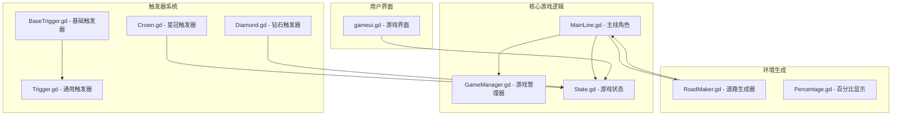
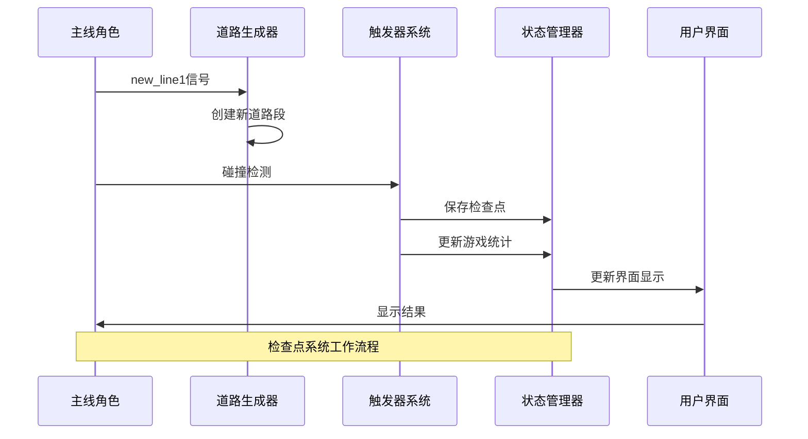
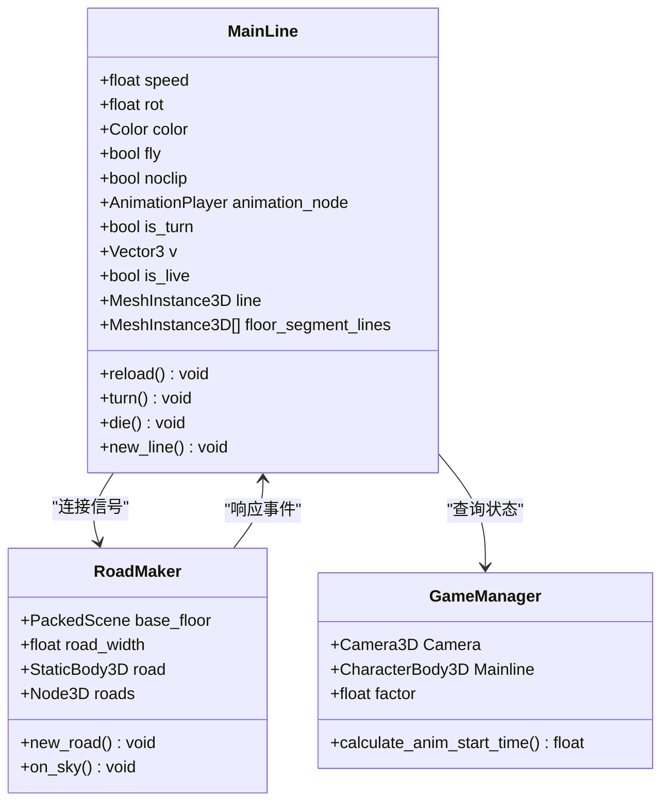
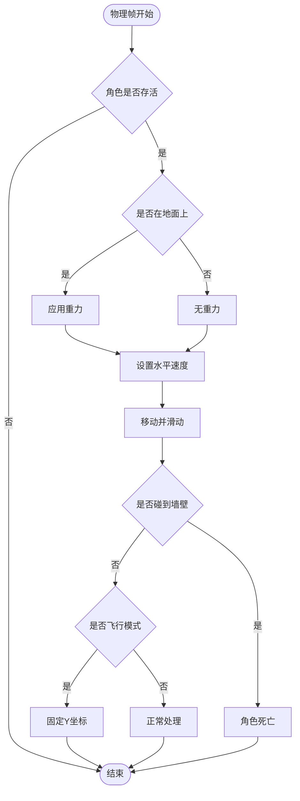
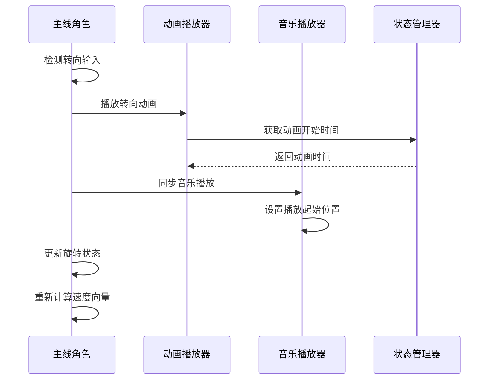
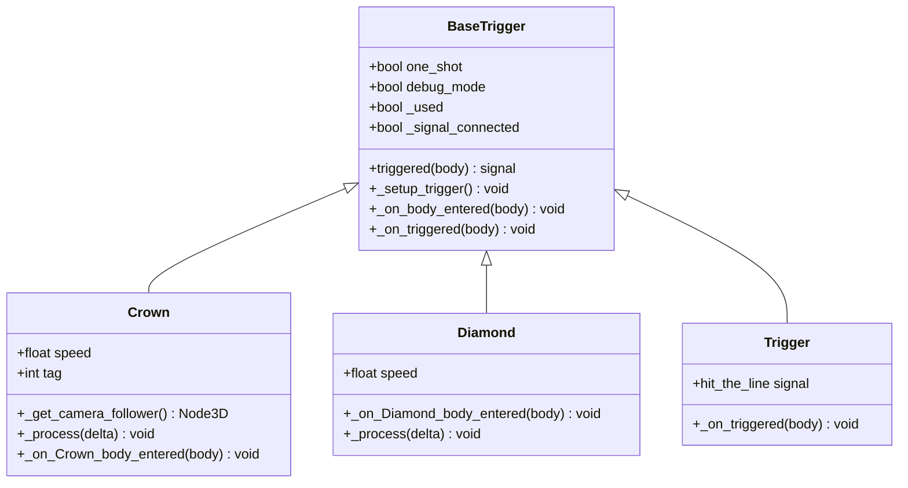
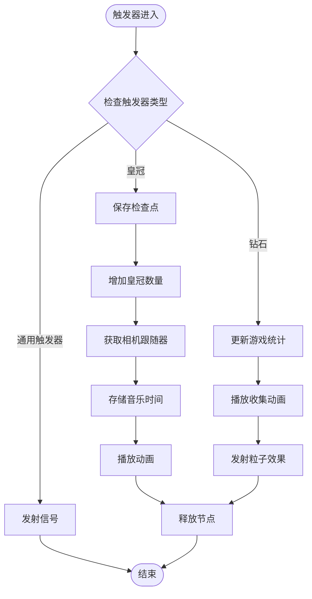
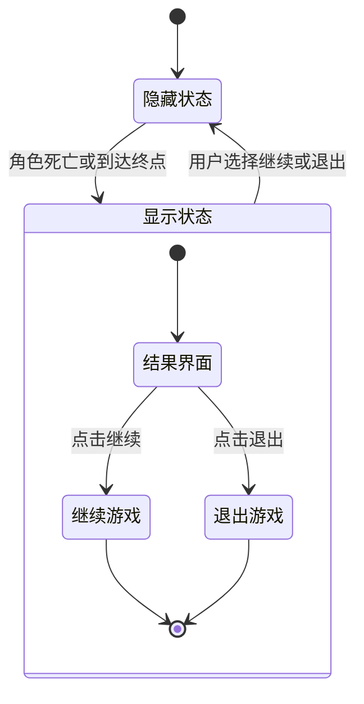
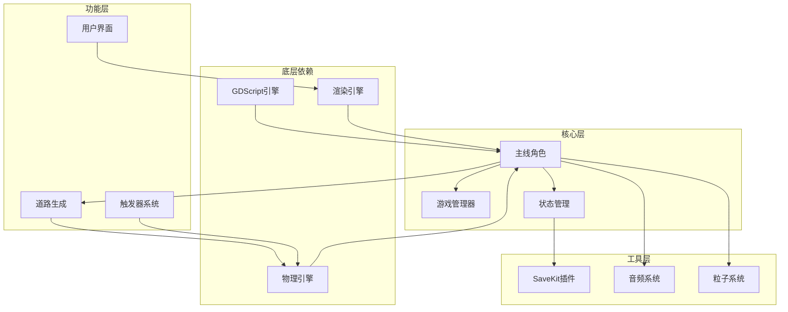

# Mainline Script 文档

<cite>
**本文档中引用的文件**
- [MainLine.gd](file://#Template/[Scripts]/Level/MainLine.gd)
- [GameManager.gd](file://#Template/[Scripts]/GameManager.gd)
- [State.gd](file://#Template/[Scripts]/State.gd)
- [RoadMaker.gd](file://#Template/[Scripts]/Level/RoadMaker.gd)
- [gameui.gd](file://#Template/[Scripts]/Level/gameui.gd)
- [Percentage.gd](file://#Template/[Scripts]/Level/Percentage.gd)
- [BaseTrigger.gd](file://#Template/[Scripts]/Trigger/BaseTrigger.gd)
- [Crown.gd](file://#Template/[Scripts]/Trigger/Crown.gd)
- [Diamond.gd](file://#Template/[Scripts]/Trigger/Diamond.gd)
- [Trigger.gd](file://#Template/[Scripts]/Trigger/Trigger.gd)
</cite>

## 目录
1. [简介](#简介)
2. [项目结构](#项目结构)
3. [核心组件](#核心组件)
4. [架构概览](#架构概览)
5. [详细组件分析](#详细组件分析)
6. [依赖关系分析](#依赖关系分析)
7. [性能考虑](#性能考虑)
8. [故障排除指南](#故障排除指南)
9. [结论](#结论)

## 简介

Mainline Script 是一个基于 Godot 引擎开发的 3D 平台游戏的核心脚本系统。该项目实现了流畅的玩家控制、动态道路生成、检查点系统、动画同步和音效管理等功能。系统采用模块化设计，通过信号机制实现组件间的松耦合通信。

## 项目结构

项目采用分层架构设计，主要包含以下核心模块：

**图表来源**
- [MainLine.gd:1-215](file://#Template/[Scripts]/Level/MainLine.gd#L1-L215)
- [GameManager.gd:1-50](file://#Template/[Scripts]/GameManager.gd#L1-L50)
- [State.gd:1-190](file://#Template/[Scripts]/State.gd#L1-L190)

**章节来源**
- [MainLine.gd:1-215](file://#Template/[Scripts]/Level/MainLine.gd#L1-L215)
- [GameManager.gd:1-50](file://#Template/[Scripts]/GameManager.gd#L1-L50)
- [State.gd:1-190](file://#Template/[Scripts]/State.gd#L1-L190)

## 核心组件

### 主线角色系统 (MainLine)

主线角色是游戏的核心控制器，负责玩家输入处理、物理运动计算、视觉效果管理和检查点保存。

**主要特性：**
- 实时物理模拟和碰撞检测
- 动态轨迹生成和可视化
- 飞行动画和着陆特效
- 死亡处理和粒子效果

### 游戏管理器 (GameManager)

提供全局游戏控制功能，包括相机跟随、位置管理和动画时间计算。

**核心功能：**
- 相机跟随器访问
- 原点位置设置和获取
- 动画开始时间计算
- 因子调节机制

### 状态管理系统 (State)

实现完整的检查点系统，支持游戏进度持久化和恢复。

**存储内容：**
- 主线角色变换矩阵
- 相机跟随器检查点
- 运行时数据缓存
- 游戏统计信息

**章节来源**
- [MainLine.gd:43-117](file://#Template/[Scripts]/Level/MainLine.gd#L43-L117)
- [GameManager.gd:33-49](file://#Template/[Scripts]/GameManager.gd#L33-L49)
- [State.gd:46-66](file://#Template/[Scripts]/State.gd#L46-L66)

## 架构概览

系统采用信号驱动的事件架构，通过松耦合的设计实现模块间的交互。

**图表来源**
- [MainLine.gd:4-7](file://#Template/[Scripts]/Level/MainLine.gd#L4-L7)
- [RoadMaker.gd:14-27](file://#Template/[Scripts]/Level/RoadMaker.gd#L14-L27)
- [Crown.gd:16-21](file://#Template/[Scripts]/Trigger/Crown.gd#L16-L21)

## 详细组件分析

### 主线角色类分析

**图表来源**
- [MainLine.gd:8-41](file://#Template/[Scripts]/Level/MainLine.gd#L8-L41)
- [RoadMaker.gd:3-10](file://#Template/[Scripts]/Level/RoadMaker.gd#L3-L10)
- [GameManager.gd:5-8](file://#Template/[Scripts]/GameManager.gd#L5-L8)

#### 物理处理流程

主线角色的物理处理采用分步算法，确保稳定性和准确性：

**图表来源**
- [MainLine.gd:53-62](file://#Template/[Scripts]/Level/MainLine.gd#L53-L62)
- [MainLine.gd:185-214](file://#Template/[Scripts]/Level/MainLine.gd#L185-L214)

#### 转向机制分析

转向系统实现了流畅的3D旋转和动画同步：

**图表来源**
- [MainLine.gd:150-172](file://#Template/[Scripts]/Level/MainLine.gd#L150-L172)
- [GameManager.gd:33-49](file://#Template/[Scripts]/GameManager.gd#L33-L49)

**章节来源**
- [MainLine.gd:53-104](file://#Template/[Scripts]/Level/MainLine.gd#L53-L104)
- [MainLine.gd:150-172](file://#Template/[Scripts]/Level/MainLine.gd#L150-L172)

### 触发器系统分析

触发器系统采用继承和多态设计，提供灵活的游戏事件处理机制。

**图表来源**
- [BaseTrigger.gd:1-38](file://#Template/[Scripts]/Trigger/BaseTrigger.gd#L1-L38)
- [Crown.gd:1-22](file://#Template/[Scripts]/Trigger/Crown.gd#L1-L22)
- [Diamond.gd:1-15](file://#Template/[Scripts]/Trigger/Diamond.gd#L1-L15)
- [Trigger.gd:1-10](file://#Template/[Scripts]/Trigger/Trigger.gd#L1-L10)

#### 检查点保存流程

**图表来源**
- [Crown.gd:16-21](file://#Template/[Scripts]/Trigger/Crown.gd#L16-L21)
- [Diamond.gd:6-11](file://#Template/[Scripts]/Trigger/Diamond.gd#L6-L11)

**章节来源**
- [BaseTrigger.gd:18-38](file://#Template/[Scripts]/Trigger/BaseTrigger.gd#L18-L38)
- [Crown.gd:16-21](file://#Template/[Scripts]/Trigger/Crown.gd#L16-L21)
- [Diamond.gd:6-11](file://#Template/[Scripts]/Trigger/Diamond.gd#L6-L11)

### 界面系统分析

游戏界面系统提供直观的用户反馈和操作控制。

**图表来源**
- [gameui.gd:13-27](file://#Template/[Scripts]/Level/gameui.gd#L13-L27)
- [gameui.gd:45-68](file://#Template/[Scripts]/Level/gameui.gd#L45-L68)

**章节来源**
- [gameui.gd:13-27](file://#Template/[Scripts]/Level/gameui.gd#L13-L27)
- [gameui.gd:30-43](file://#Template/[Scripts]/Level/gameui.gd#L30-L43)

## 依赖关系分析

系统采用清晰的依赖层次结构，确保模块间的低耦合高内聚。

**图表来源**
- [MainLine.gd:28-31](file://#Template/[Scripts]/Level/MainLine.gd#L28-L31)
- [State.gd:102-117](file://#Template/[Scripts]/State.gd#L102-L117)

**章节来源**
- [MainLine.gd:28-31](file://#Template/[Scripts]/Level/MainLine.gd#L28-L31)
- [State.gd:102-117](file://#Template/[Scripts]/State.gd#L102-L117)

## 性能考虑

### 内存管理优化

系统实现了智能的对象池和资源复用机制：
- 道路段实例化后自动添加到父节点
- 粒子效果使用预加载资源
- 材质和网格资源共享使用

### 渲染性能优化

- 动态轨迹生成采用批量更新策略
- 地面段只在需要时创建和销毁
- 粒子系统使用GPU加速

### 物理计算优化

- 分离式物理处理避免重复计算
- 缓存常用计算结果减少CPU负载
- 优化的碰撞检测算法

## 故障排除指南

### 常见问题及解决方案

**问题1：角色无法转向**
- 检查输入映射配置
- 验证动画播放器状态
- 确认飞行模式设置

**问题2：检查点不生效**
- 验证状态序列化配置
- 检查SaveKit插件版本
- 确认节点所有权设置

**问题3：道路生成异常**
- 检查基础地面场景资源
- 验证主线路线跟踪
- 确认缩放因子设置

**章节来源**
- [MainLine.gd:106-110](file://#Template/[Scripts]/Level/MainLine.gd#L106-L110)
- [State.gd:154-167](file://#Template/[Scripts]/State.gd#L154-L167)
- [RoadMaker.gd:22-27](file://#Template/[Scripts]/Level/RoadMaker.gd#L22-L27)

## 结论

Mainline Script 系统展现了优秀的游戏架构设计，通过模块化组件和信号驱动的事件系统实现了高度的可维护性和扩展性。系统的关键优势包括：

1. **模块化设计**：清晰的职责分离和接口定义
2. **状态持久化**：完整的检查点系统确保游戏体验连续性
3. **性能优化**：智能的资源管理和计算优化
4. **扩展性强**：灵活的触发器系统支持多种游戏元素

该系统为类似3D平台游戏开发提供了良好的参考模板，其设计理念和实现方式值得进一步研究和学习。