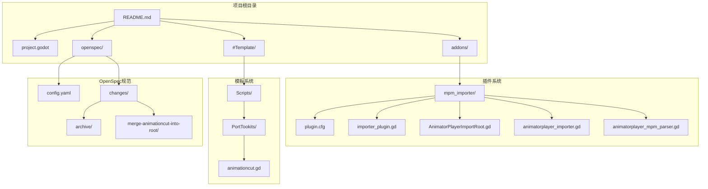
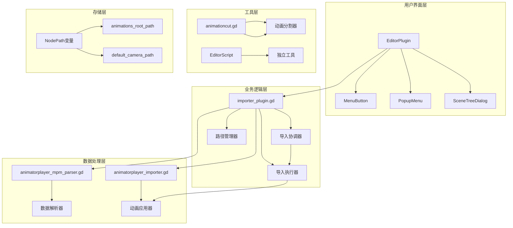
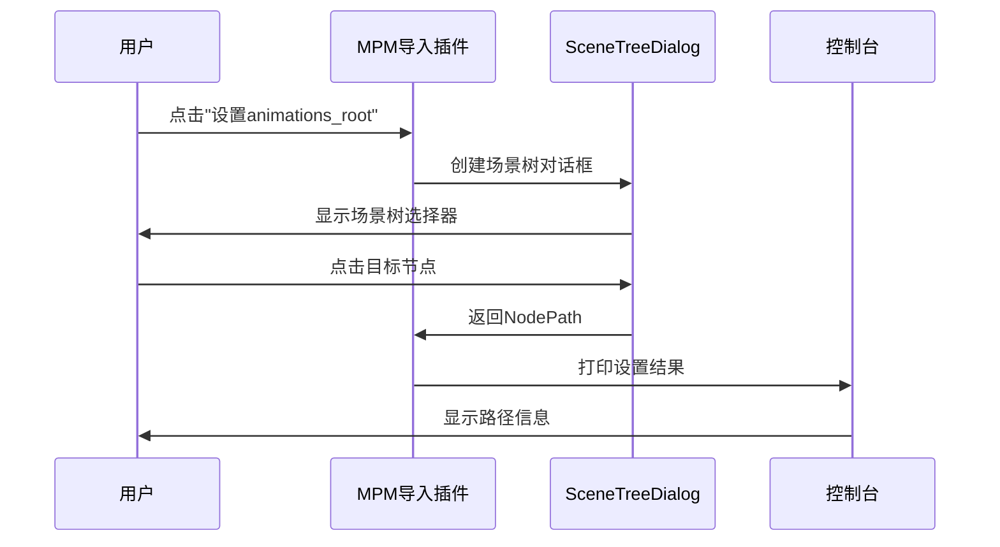
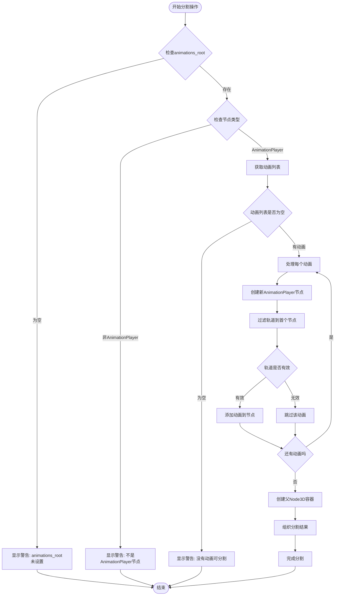

# OpenSpec应用变更技能

<cite>
**本文档引用的文件**
- [README.md](file://README.md)
- [project.godot](file://project.godot)
- [plugin.cfg](file://addons/mpm_importer/plugin.cfg)
- [importer_plugin.gd](file://addons/mpm_importer/importer_plugin.gd)
- [AnimatorPlayerImportRoot.gd](file://addons/mpm_importer/AnimatorPlayerImportRoot.gd)
- [animatorplayer_importer.gd](file://addons/mpm_importer/animatorplayer_importer.gd)
- [animatorplayer_mpm_parser.gd](file://addons/mpm_importer/animatorplayer_mpm_parser.gd)
- [animationcut.gd](file://#Template/[Scripts]/PortTookits/animationcut.gd)
- [config.yaml](file://openspec/config.yaml)
- [spec.md](file://openspec/changes/archive/2026-04-18-use-node-picker-for-paths/specs/node-picker-dialog/spec.md)
- [proposal.md](file://openspec/changes/archive/2026-04-18-use-node-picker-for-paths/proposal.md)
- [design.md](file://openspec/changes/archive/2026-04-18-use-node-picker-for-paths/design.md)
- [tasks.md](file://openspec/changes/archive/2026-04-18-use-node-picker-for-paths/tasks.md)
- [spec.md](file://openspec/changes/merge-animationcut-into-root/specs/animation-split/spec.md)
- [proposal.md](file://openspec/changes/merge-animationcut-into-root/proposal.md)
- [design.md](file://openspec/changes/merge-animationcut-into-root/design.md)
- [tasks.md](file://openspec/changes/merge-animationcut-into-root/tasks.md)
</cite>

## 目录
1. [简介](#简介)
2. [项目结构](#项目结构)
3. [核心组件](#核心组件)
4. [架构概览](#架构概览)
5. [详细组件分析](#详细组件分析)
6. [依赖关系分析](#依赖关系分析)
7. [性能考量](#性能考量)
8. [故障排除指南](#故障排除指南)
9. [结论](#结论)
10. [附录](#附录)

## 简介

OpenSpec应用变更技能是一个基于Godot引擎4.6的Dancing Line游戏模板框架，专注于动画导入和场景管理功能。该项目实现了两个主要的OpenSpec变更技能：

1. **节点选择器对话框技能**：将传统的手动路径输入替换为场景树节点选择器
2. **动画分割合并技能**：将独立的动画分割功能集成到动画导入根节点中

这些技能显著提升了开发者的工作效率和用户体验，减少了手动配置的复杂性和错误率。

## 项目结构

项目采用模块化架构设计，主要包含以下核心目录结构：



**图表来源**
- [project.godot:29-31](file://project.godot#L29-L31)
- [plugin.cfg:1-8](file://addons/mpm_importer/plugin.cfg#L1-L8)

**章节来源**
- [README.md:52-61](file://README.md#L52-L61)
- [project.godot:1-76](file://project.godot#L1-L76)

## 核心组件

### MPM导入插件系统

MPM导入插件是整个系统的核心，提供了完整的动画导入解决方案：

| 组件 | 功能描述 | 关键特性 |
|------|----------|----------|
| **importer_plugin.gd** | 主插件控制器 | 菜单管理、路径设置、导入协调 |
| **AnimatorPlayerImportRoot.gd** | 动画导入根节点 | 直接导入模式、工具按钮集成 |
| **animatorplayer_importer.gd** | 动画导入器 | 节点解析、动画应用、错误处理 |
| **animatorplayer_mpm_parser.gd** | MPM文件解析器 | 数据提取、格式验证、类型转换 |

### OpenSpec变更技能

| 技能名称 | 类型 | 主要功能 | 影响范围 |
|----------|------|----------|----------|
| **节点选择器对话框** | UI改进 | 替换手动路径输入 | importer_plugin.gd |
| **动画分割合并** | 功能集成 | 合并独立分割功能 | AnimatorPlayerImportRoot.gd |

**章节来源**
- [importer_plugin.gd:1-218](file://addons/mpm_importer/importer_plugin.gd#L1-L218)
- [AnimatorPlayerImportRoot.gd:1-83](file://addons/mpm_importer/AnimatorPlayerImportRoot.gd#L1-L83)

## 架构概览

系统采用分层架构设计，确保了良好的模块分离和可维护性：



**图表来源**
- [importer_plugin.gd:13-17](file://addons/mpm_importer/importer_plugin.gd#L13-L17)
- [animatorplayer_importer.gd:6-42](file://addons/mpm_importer/animatorplayer_importer.gd#L6-L42)

## 详细组件分析

### 节点选择器对话框技能

#### 技能概述

该技能将传统的`LineEdit`手动输入方式替换为Godot内置的`SceneTreeDialog`节点选择器，提供了更直观、更可靠的节点路径设置体验。

#### 核心实现流程



**图表来源**
- [design.md:23-34](file://openspec/changes/archive/2026-04-18-use-node-picker-for-paths/design.md#L23-L34)
- [tasks.md:1-12](file://openspec/changes/archive/2026-04-18-use-node-picker-for-paths/tasks.md#L1-L12)

#### 技术实现要点

| 实现要素 | 描述 | 优势 |
|----------|------|------|
| **SceneTreeDialog集成** | 使用Godot内置对话框组件 | 无需自定义UI，减少开发工作量 |
| **事件回调机制** | 一次性连接selected和canceled信号 | 确保资源正确释放 |
| **路径验证** | 控制台输出设置结果 | 提供即时反馈和调试信息 |
| **兼容性保证** | 保持原有菜单结构 | 无缝升级，无破坏性变更 |

**章节来源**
- [design.md:17-46](file://openspec/changes/archive/2026-04-18-use-node-picker-for-paths/design.md#L17-L46)
- [proposal.md:14-16](file://openspec/changes/archive/2026-04-18-use-node-picker-for-paths/proposal.md#L14-L16)

### 动画分割合并技能

#### 技能概述

该技能将独立的`animationcut.gd`脚本功能集成到`AnimatorPlayerImportRoot.gd`中，提供了一键式动画分割功能，每个动画创建独立的AnimationPlayer节点。

#### 核心处理流程



**图表来源**
- [design.md:32-35](file://openspec/changes/merge-animationcut-into-root/design.md#L32-L35)
- [tasks.md:1-12](file://openspec/changes/merge-animationcut-into-root/tasks.md#L1-L12)

#### 技术实现细节

| 处理阶段 | 实现逻辑 | 错误处理 |
|----------|----------|----------|
| **节点验证** | 检查animations_root路径有效性 | 输出具体错误信息 |
| **轨道过滤** | 保留首个动画节点的所有轨道 | 跳过无有效轨道的动画 |
| **节点创建** | 为每个动画创建独立AnimationPlayer | 保持原始节点完整性 |
| **结果组织** | 新节点统一放置在Node3D容器下 | 保持场景树整洁有序 |

**章节来源**
- [design.md:18-35](file://openspec/changes/merge-animationcut-into-root/design.md#L18-L35)
- [animationcut.gd:4-46](file://#Template/[Scripts]/PortTookits/animationcut.gd#L4-L46)

### 插件架构组件

#### 主插件控制器

`importer_plugin.gd`作为整个插件系统的中枢，负责：

- **菜单管理**：创建和管理工具栏菜单
- **路径设置**：提供节点路径设置功能
- **导入协调**：协调各种导入操作
- **状态管理**：维护插件状态和配置

#### 动画导入根节点

`AnimatorPlayerImportRoot.gd`提供了直接导入模式：

- **工具按钮集成**：`@export_tool_button`提供一键导入
- **配置灵活性**：通过`@export var animations_root`配置目标节点
- **批量处理**：支持整个文件夹的批量导入操作

**章节来源**
- [importer_plugin.gd:19-102](file://addons/mpm_importer/importer_plugin.gd#L19-L102)
- [AnimatorPlayerImportRoot.gd:7-13](file://addons/mpm_importer/AnimatorPlayerImportRoot.gd#L7-L13)

## 依赖关系分析

系统采用松耦合的设计原则，各组件间通过明确定义的接口进行交互：

```mermaid
graph LR
subgraph "外部依赖"
A[Godot Editor API] --> B[EditorPlugin]
A --> C[SceneTreeDialog]
A --> D[EditorFileDialog]
end
subgraph "内部组件"
B --> E[importer_plugin.gd]
E --> F[animatorplayer_mpm_parser.gd]
E --> G[animatorplayer_importer.gd]
G --> H[AnimationPlayer]
G --> I[Area3D]
G --> J[CollisionShape3D]
end
subgraph "工具组件"
K[animationcut.gd] --> L[EditorScript]
M[AnimatorPlayerImportRoot.gd] --> N[@export_tool_button]
end
subgraph "配置管理"
O[plugin.cfg] --> P[插件注册]
Q[project.godot] --> R[插件启用]
S[config.yaml] --> T[OpenSpec配置]
end
E --> F
E --> G
G --> H
G --> I
G --> J
```

**图表来源**
- [plugin.cfg:1-8](file://addons/mpm_importer/plugin.cfg#L1-L8)
- [project.godot:29-31](file://project.godot#L29-L31)
- [config.yaml:1-21](file://openspec/config.yaml#L1-L21)

**章节来源**
- [plugin.cfg:1-8](file://addons/mpm_importer/plugin.cfg#L1-L8)
- [project.godot:29-31](file://project.godot#L29-L31)

## 性能考量

### 内存优化策略

1. **一次性对话框连接**：使用`CONNECT_ONE_SHOT`确保事件处理后自动清理
2. **延迟弹窗显示**：通过`popup.call_deferred()`避免阻塞UI线程
2. **资源及时释放**：对话框使用后立即调用`queue_free()`

### 处理效率优化

1. **批量文件处理**：支持单次操作处理多个MPM文件
2. **智能节点查找**：提供模糊匹配和名称规范化功能
3. **错误快速检测**：提前验证节点路径和类型，避免无效操作

## 故障排除指南

### 常见问题及解决方案

| 问题类型 | 症状描述 | 解决方案 | 预防措施 |
|----------|----------|----------|----------|
| **节点路径错误** | "找不到animations_root节点" | 使用场景树选择器重新设置 | 定期检查场景树结构变化 |
| **动画分割失败** | "animations_root不是AnimationPlayer" | 确认目标节点类型正确 | 在Inspector中验证节点类型 |
| **导入文件缺失** | "空文件或无法读取" | 检查MPM文件格式和编码 | 验证文件完整性和权限 |
| **轨道过滤问题** | 分割后动画无效果 | 检查动画轨道配置 | 确保动画包含有效轨道数据 |

### 调试技巧

1. **控制台输出**：利用详细的日志信息追踪问题
2. **节点验证**：在关键步骤检查节点存在性和类型
3. **逐步测试**：先测试单个功能，再组合使用

**章节来源**
- [importer_plugin.gd:185-206](file://addons/mpm_importer/importer_plugin.gd#L185-L206)
- [animatorplayer_importer.gd:248-272](file://addons/mpm_importer/animatorplayer_importer.gd#L248-L272)

## 结论

OpenSpec应用变更技能成功实现了两个重要的功能改进：

1. **用户体验提升**：通过场景树节点选择器大幅降低了配置复杂度
2. **功能集成优化**：将分散的功能整合到统一的工具界面中
3. **开发效率提高**：减少了手动配置和错误处理的工作量

这些技能不仅提升了当前项目的可用性，还为未来的功能扩展奠定了坚实的基础。通过模块化的设计和清晰的接口定义，系统具备了良好的可维护性和可扩展性。

## 附录

### 技能实施清单

#### 节点选择器对话框技能
- [x] 替换`_show_node_path_dialog`为`_show_node_picker_dialog`
- [x] 集成SceneTreeDialog组件
- [x] 更新路径设置回调函数
- [x] 验证控制台输出功能

#### 动画分割合并技能
- [x] 添加`@export_tool_button`工具按钮
- [x] 实现`_split_animations()`方法
- [x] 复制`animationcut.gd`核心逻辑
- [x] 创建Node3D容器组织分割结果

### 最佳实践建议

1. **代码质量**：保持函数职责单一，参数传递清晰
2. **错误处理**：提供具体的错误信息和恢复建议
3. **性能优化**：避免不必要的节点遍历和内存分配
4. **用户体验**：提供即时反馈和进度指示