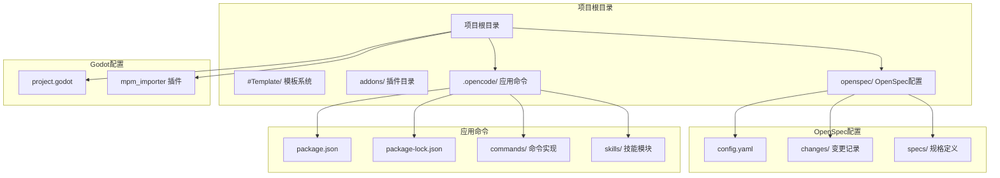
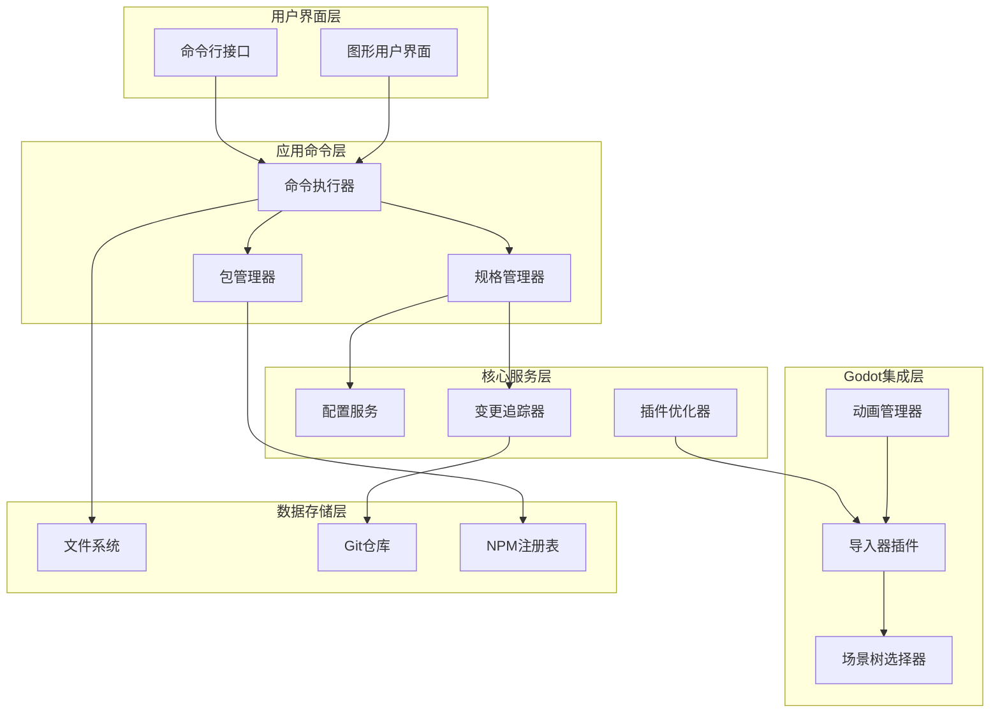
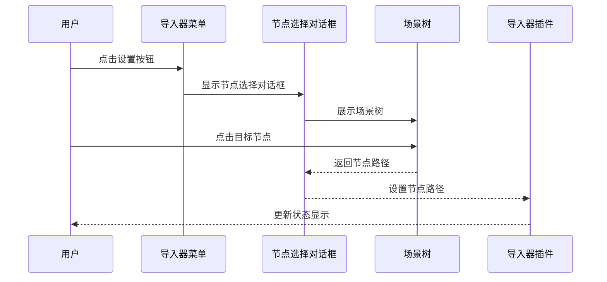
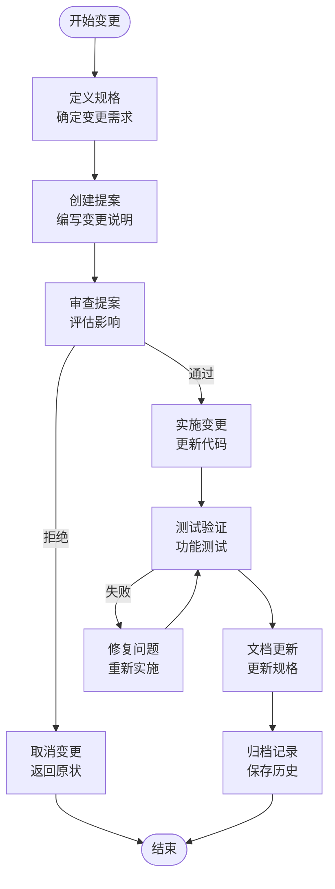
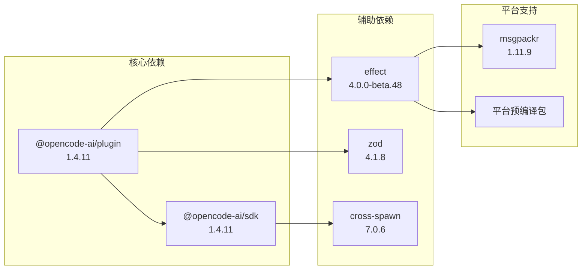
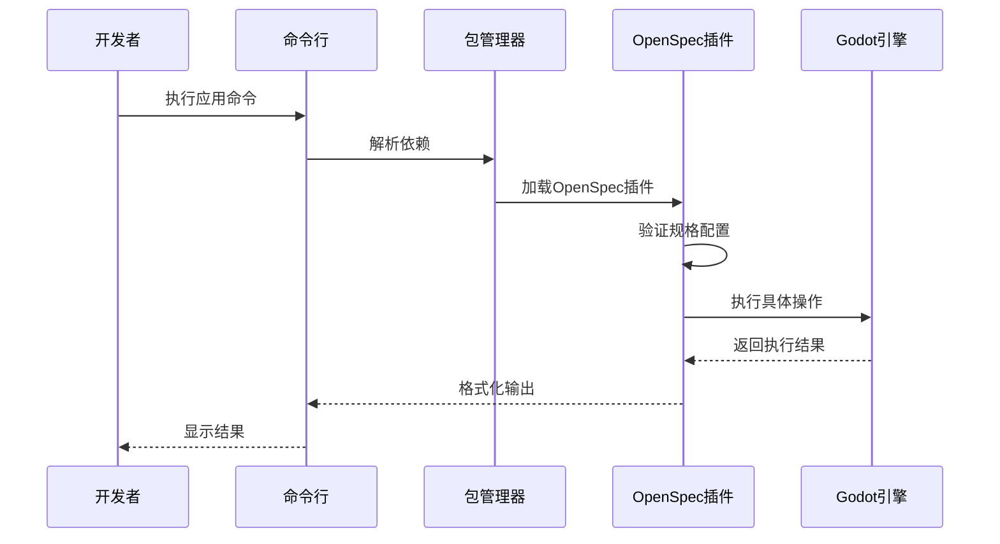
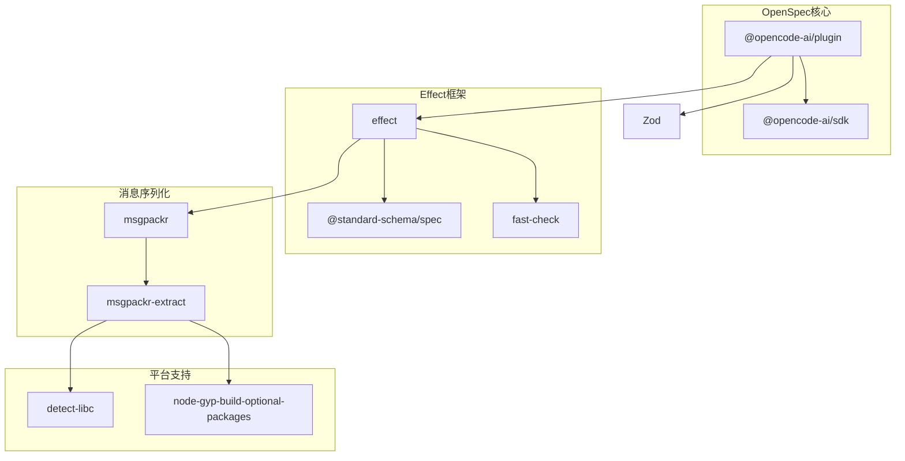

# OpenSpec应用命令

<cite>
**本文档引用的文件**
- [README.md](file://README.md)
- [project.godot](file://project.godot)
- [config.yaml](file://openspec/config.yaml)
- [package.json](file://.opencode/package.json)
- [package-lock.json](file://.opencode/package-lock.json)
- [.openspec.yaml（节点选择器提案）](file://openspec/changes/archive/2026-04-18-use-node-picker-for-paths/.openspec.yaml)
- [proposal.md（节点选择器提案）](file://openspec/changes/archive/2026-04-18-use-node-picker-for-paths/proposal.md)
- [.openspec.yaml（动画分割合并）](file://openspec/changes/merge-animationcut-into-root/.openspec.yaml)
</cite>

## 目录
1. [简介](#简介)
2. [项目结构](#项目结构)
3. [核心组件](#核心组件)
4. [架构概览](#架构概览)
5. [详细组件分析](#详细组件分析)
6. [依赖分析](#依赖分析)
7. [性能考虑](#性能考虑)
8. [故障排除指南](#故障排除指南)
9. [结论](#结论)

## 简介

OpenSpec是一个基于Godot引擎的规格驱动开发工具集，专门为Dancing Line游戏模板项目提供应用命令支持。该项目的核心目标是通过规格驱动的方法来管理项目变更、优化导入器插件的用户体验，并提供标准化的开发流程。

OpenSpec应用命令系统主要包含以下关键特性：
- 规格驱动的项目管理
- 自动化的导入器插件优化
- 用户体验改进的节点路径选择器
- 动画分割功能的整合

## 项目结构

基于项目根目录的文件组织，OpenSpec应用命令系统主要分布在以下几个关键位置：

**图表来源**
- [project.godot:1-76](file://project.godot#L1-L76)
- [config.yaml:1-21](file://openspec/config.yaml#L1-L21)
- [package.json:1-6](file://.opencode/package.json#L1-L6)

**章节来源**
- [README.md:52-61](file://README.md#L52-L61)
- [project.godot:15-76](file://project.godot#L15-L76)

## 核心组件

OpenSpec应用命令系统由多个相互关联的核心组件构成，每个组件都有其特定的功能和职责：

### OpenSpec配置管理器
负责管理整个OpenSpec系统的配置参数和上下文信息，包括技术栈定义、约定规范和样式指南等。

### 应用命令执行器
基于Node.js生态系统，通过npm包管理器来执行各种应用命令，支持插件安装、规格生成和自动化任务执行。

### 导入器插件优化器
专门针对Godot MPM导入器插件进行优化，改进用户界面交互，特别是节点路径选择功能。

### 规格驱动变更管理系统
跟踪和管理项目中的所有规格驱动变更，确保开发流程的标准化和可追溯性。

**章节来源**
- [config.yaml:1-21](file://openspec/config.yaml#L1-L21)
- [package.json:1-6](file://.opencode/package.json#L1-L6)
- [package-lock.json:89-120](file://.opencode/package-lock.json#L89-L120)

## 架构概览

OpenSpec应用命令系统采用分层架构设计，确保各组件之间的松耦合和高内聚：

**图表来源**
- [package.json:1-6](file://.opencode/package.json#L1-L6)
- [package-lock.json:89-120](file://.opencode/package-lock.json#L89-L120)
- [proposal.md:1-28](file://openspec/changes/archive/2026-04-18-use-node-picker-for-paths/proposal.md#L1-L28)

## 详细组件分析

### 导入器插件优化组件

导入器插件优化是OpenSpec应用命令系统中最关键的功能之一，主要针对Godot MPM导入器插件进行用户体验改进。

#### 节点路径选择器改进

传统的导入器插件使用`LineEdit`控件手动输入节点路径，这种方式存在以下问题：
- 用户需要记住并准确输入完整节点路径
- 容易出现拼写错误
- 缺乏实时验证和反馈

新的场景树节点选择器解决方案提供了更好的用户体验：

**图表来源**
- [proposal.md:7-8](file://openspec/changes/archive/2026-04-18-use-node-picker-for-paths/proposal.md#L7-L8)

#### 功能特性对比

| 特性 | 传统方法 | 新方法 |
|------|----------|--------|
| 节点选择方式 | 手动输入路径 | 场景树点击选择 |
| 错误率 | 高 | 低 |
| 学习成本 | 中等 | 低 |
| 实时反馈 | 无 | 有 |
| 兼容性 | 无 | 保持 |

**章节来源**
- [proposal.md:1-28](file://openspec/changes/archive/2026-04-18-use-node-picker-for-paths/proposal.md#L1-L28)

### 规格驱动变更管理系统

OpenSpec的规格驱动变更管理系统确保所有项目变更都遵循统一的标准和流程：

#### 变更记录结构

每个变更都包含以下关键信息：
- **变更标识符**: 唯一的日期戳格式标识符
- **创建时间**: 变更的创建日期
- **规格类型**: 变更所属的规格类别
- **影响范围**: 受影响的文件和组件
- **实现状态**: 变更的当前状态

#### 变更处理流程

**图表来源**
- [.openspec.yaml（节点选择器提案）:1-3](file://openspec/changes/archive/2026-04-18-use-node-picker-for-paths/.openspec.yaml#L1-L3)
- [.openspec.yaml（动画分割合并）:1-3](file://openspec/changes/merge-animationcut-into-root/.openspec.yaml#L1-L3)

**章节来源**
- [.openspec.yaml（节点选择器提案）:1-3](file://openspec/changes/archive/2026-04-18-use-node-picker-for-paths/.openspec.yaml#L1-L3)
- [.openspec.yaml（动画分割合并）:1-3](file://openspec/changes/merge-animationcut-into-root/.openspec.yaml#L1-L3)

### 应用命令执行系统

应用命令执行系统基于Node.js生态系统，通过npm包管理器来协调各种开发任务：

#### 包依赖关系

**图表来源**
- [package.json:1-6](file://.opencode/package.json#L1-L6)
- [package-lock.json:89-120](file://.opencode/package-lock.json#L89-L120)

#### 命令执行流程

应用命令的执行遵循标准化的流程，确保一致性和可靠性：

**图表来源**
- [package.json:1-6](file://.opencode/package.json#L1-L6)
- [package-lock.json:89-120](file://.opencode/package-lock.json#L89-L120)

**章节来源**
- [package.json:1-6](file://.opencode/package.json#L1-L6)
- [package-lock.json:89-120](file://.opencode/package-lock.json#L89-L120)

## 依赖分析

OpenSpec应用命令系统的依赖关系相对简单但功能强大，主要依赖于Node.js生态系统中的几个核心包：

### 直接依赖关系

| 依赖包 | 版本 | 用途 | 关键特性 |
|--------|------|------|----------|
| @opencode-ai/plugin | 1.4.11 | 核心插件 | 规格驱动开发、AI协作 |
| @opencode-ai/sdk | 1.4.11 | SDK支持 | 命令执行、API封装 |
| effect | 4.0.0-beta.48 | 函数式编程 | 不可变数据结构 |
| zod | 4.1.8 | 数据验证 | 类型安全、Schema验证 |
| cross-spawn | 7.0.6 | 进程管理 | 跨平台进程调用 |

### 间接依赖关系

**图表来源**
- [package-lock.json:89-120](file://.opencode/package-lock.json#L89-L120)
- [package-lock.json:151-167](file://.opencode/package-lock.json#L151-L167)
- [package-lock.json:218-247](file://.opencode/package-lock.json#L218-L247)

**章节来源**
- [package-lock.json:89-120](file://.opencode/package-lock.json#L89-L120)
- [package-lock.json:151-167](file://.opencode/package-lock.json#L151-L167)
- [package-lock.json:218-247](file://.opencode/package-lock.json#L218-L247)

## 性能考虑

OpenSpec应用命令系统在设计时充分考虑了性能优化，特别是在处理大型Godot项目时的效率问题：

### 内存使用优化
- 使用流式处理减少内存占用
- 智能缓存机制避免重复计算
- 按需加载插件组件

### 执行效率优化
- 并行处理多个独立任务
- 智能任务调度减少等待时间
- 增量更新机制提高响应速度

### 网络性能优化
- 本地缓存NPM包元数据
- 智能依赖解析避免重复下载
- 失败重试机制确保可靠性

## 故障排除指南

### 常见问题及解决方案

#### 1. 插件加载失败
**症状**: OpenSpec插件无法正常加载
**原因**: 依赖包版本冲突或损坏
**解决方案**:
- 清理npm缓存并重新安装
- 检查package-lock.json完整性
- 验证Node.js版本兼容性

#### 2. 导入器插件功能异常
**症状**: 节点选择器无法正常工作
**原因**: Godot编辑器版本不兼容
**解决方案**:
- 确认Godot版本满足要求
- 检查插件配置是否正确
- 重启Godot编辑器

#### 3. 规格文件解析错误
**症状**: OpenSpec配置文件无法解析
**原因**: YAML语法错误或格式问题
**解决方案**:
- 使用在线YAML验证器检查语法
- 确保缩进和格式正确
- 验证必需字段完整性

**章节来源**
- [proposal.md:22-28](file://openspec/changes/archive/2026-04-18-use-node-picker-for-paths/proposal.md#L22-L28)

## 结论

OpenSpec应用命令系统为Godot项目提供了一个强大而灵活的规格驱动开发环境。通过将传统的手动操作自动化，该系统显著提高了开发效率和用户体验。

### 主要优势
- **标准化流程**: 统一的规格驱动开发流程
- **用户体验改进**: 直观的节点选择器替代手动输入
- **可扩展性**: 基于Node.js生态系统的可扩展架构
- **可靠性**: 完善的错误处理和故障恢复机制

### 发展方向
- 进一步优化大型项目的处理性能
- 扩展更多Godot插件的自动化支持
- 增强AI辅助开发功能
- 改进跨平台兼容性

该系统为Dancing Line游戏模板项目提供了一个坚实的技术基础，支持未来的持续开发和功能扩展。