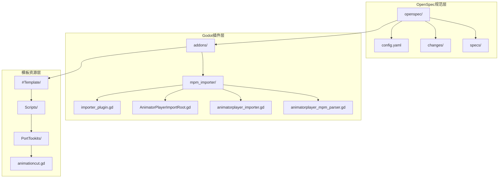
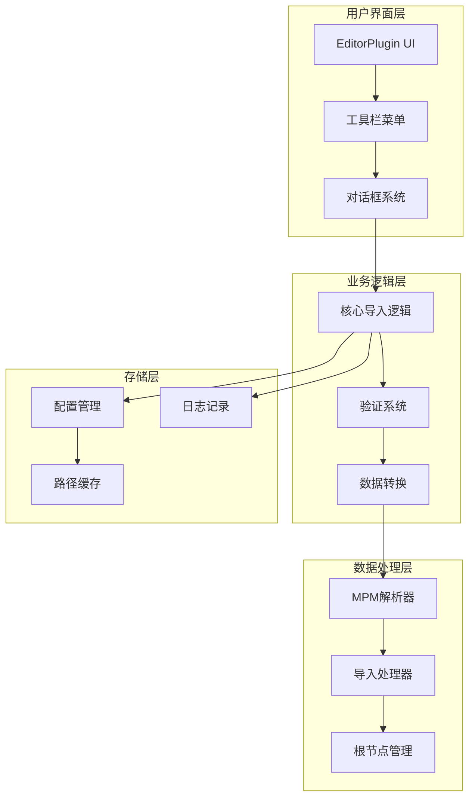
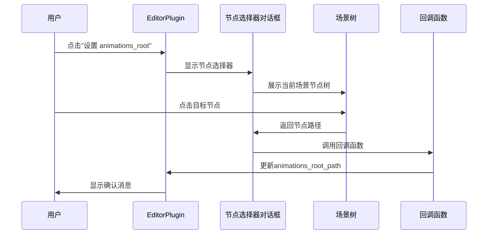
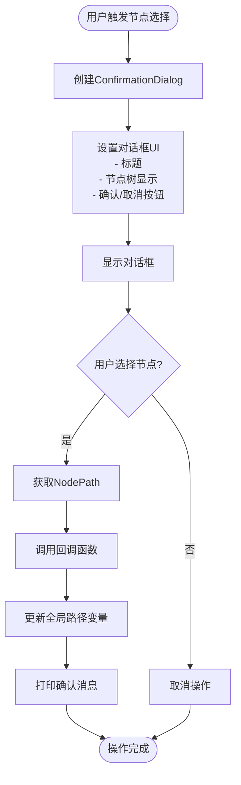
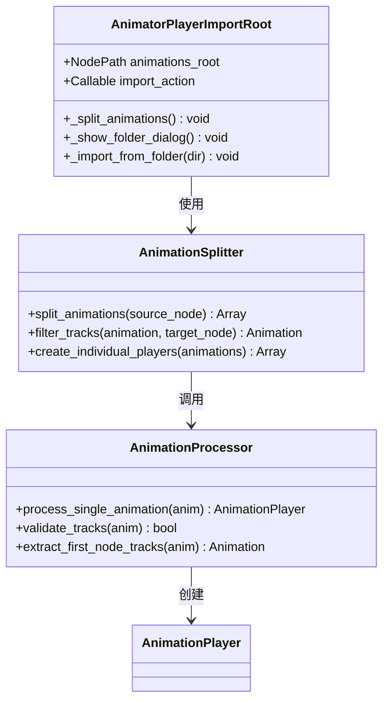
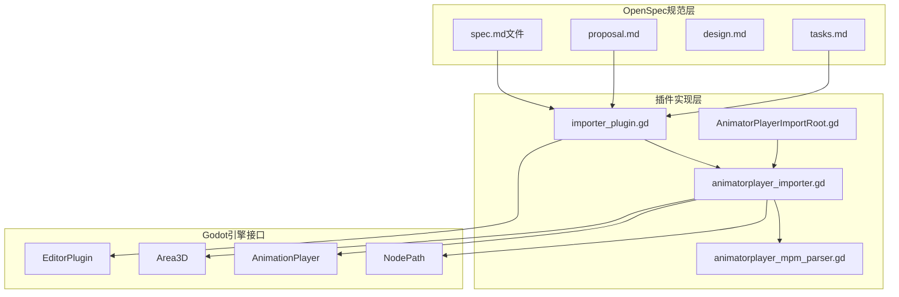

# OpenSpec归档变更技能

<cite>
**本文档引用的文件**
- [openspec/config.yaml](file://openspec/config.yaml)
- [openspec/changes/archive/2026-04-18-use-node-picker-for-paths/specs/node-picker-dialog/spec.md](file://openspec/changes/archive/2026-04-18-use-node-picker-for-paths/specs/node-picker-dialog/spec.md)
- [openspec/changes/merge-animationcut-into-root/specs/animation-split/spec.md](file://openspec/changes/merge-animationcut-into-root/specs/animation-split/spec.md)
- [openspec/changes/archive/2026-04-18-use-node-picker-for-paths/proposal.md](file://openspec/changes/archive/2026-04-18-use-node-picker-for-paths/proposal.md)
- [openspec/changes/merge-animationcut-into-root/proposal.md](file://openspec/changes/merge-animationcut-into-root/proposal.md)
- [addons/mpm_importer/importer_plugin.gd](file://addons/mpm_importer/importer_plugin.gd)
- [addons/mpm_importer/AnimatorPlayerImportRoot.gd](file://addons/mpm_importer/AnimatorPlayerImportRoot.gd)
- [addons/mpm_importer/animatorplayer_importer.gd](file://addons/mpm_importer/animatorplayer_importer.gd)
- [addons/mpm_importer/animatorplayer_mpm_parser.gd](file://addons/mpm_importer/animatorplayer_mpm_parser.gd)
- [project.godot](file://project.godot)
- [README.md](file://README.md)
</cite>

## 目录
1. [简介](#简介)
2. [项目结构](#项目结构)
3. [核心组件](#核心组件)
4. [架构概览](#架构概览)
5. [详细组件分析](#详细组件分析)
6. [依赖关系分析](#依赖关系分析)
7. [性能考虑](#性能考虑)
8. [故障排除指南](#故障排除指南)
9. [结论](#结论)

## 简介

OpenSpec归档变更技能是一个基于OpenSpec规范驱动的项目，专注于Godot引擎中的MPM导入器插件的功能增强。该项目实现了两个主要的归档变更技能：

1. **节点选择器对话框技能**：将原有的手动路径输入替换为场景树节点选择器
2. **动画分割合并技能**：将独立的动画分割功能集成到导入根节点中

这些技能旨在提升Godot编辑器中动画导入的工作流程效率，减少手动输入错误，并提供更直观的用户界面。

## 项目结构

该项目采用模块化的Godot插件架构，主要包含以下关键目录结构：



**图表来源**
- [openspec/config.yaml:1-21](file://openspec/config.yaml#L1-L21)
- [addons/mpm_importer/importer_plugin.gd:1-218](file://addons/mpm_importer/importer_plugin.gd#L1-L218)

**章节来源**
- [README.md:52-61](file://README.md#L52-L61)
- [project.godot:29-31](file://project.godot#L29-L31)

## 核心组件

### OpenSpec配置管理

OpenSpec系统的核心配置位于`openspec/config.yaml`中，定义了规范驱动的项目管理方式：

- **规范模式**：`schema: spec-driven` - 启用规范驱动开发模式
- **项目上下文**：可选的项目技术栈和约定说明
- **工件规则**：针对特定工件的自定义规则配置

### 归档变更技能

系统包含两个主要的归档变更技能，每个都通过完整的OpenSpec流程进行管理：

#### 技能一：节点选择器对话框
- **目标**：替换手动路径输入为场景树节点选择器
- **范围**：`animations_root`和`default_camera`路径设置
- **收益**：提升用户体验，减少输入错误

#### 技能二：动画分割合并
- **目标**：将独立的动画分割功能集成到导入根节点
- **范围**：`AnimatorPlayerImportRoot.gd`中的动画处理
- **收益**：简化工作流程，提高操作效率

**章节来源**
- [openspec/config.yaml:1-21](file://openspec/config.yaml#L1-L21)
- [openspec/changes/archive/2026-04-18-use-node-picker-for-paths/proposal.md:1-28](file://openspec/changes/archive/2026-04-18-use-node-picker-for-paths/proposal.md#L1-L28)
- [openspec/changes/merge-animationcut-into-root/proposal.md:1-26](file://openspec/changes/merge-animationcut-into-root/proposal.md#L1-L26)

## 架构概览

OpenSpec归档变更技能采用分层架构设计，确保功能模块的独立性和可维护性：



**图表来源**
- [addons/mpm_importer/importer_plugin.gd:13-17](file://addons/mpm_importer/importer_plugin.gd#L13-L17)
- [addons/mpm_importer/AnimatorPlayerImportRoot.gd:7-8](file://addons/mpm_importer/AnimatorPlayerImportRoot.gd#L7-L8)

## 详细组件分析

### 节点选择器对话框组件

#### 功能概述
节点选择器对话框技能将原有的`LineEdit`手动输入替换为Godot内置的场景树节点选择器，显著提升了用户体验。

#### 核心实现流程



**图表来源**
- [addons/mpm_importer/importer_plugin.gd:123-151](file://addons/mpm_importer/importer_plugin.gd#L123-L151)
- [openspec/changes/archive/2026-04-18-use-node-picker-for-paths/specs/node-picker-dialog/spec.md:6-24](file://openspec/changes/archive/2026-04-18-use-node-picker-for-paths/specs/node-picker-dialog/spec.md#L6-L24)

#### 数据流分析



**图表来源**
- [addons/mpm_importer/importer_plugin.gd:123-151](file://addons/mpm_importer/importer_plugin.gd#L123-L151)

**章节来源**
- [openspec/changes/archive/2026-04-18-use-node-picker-for-paths/specs/node-picker-dialog/spec.md:1-25](file://openspec/changes/archive/2026-04-18-use-node-picker-for-paths/specs/node-picker-dialog/spec.md#L1-L25)
- [openspec/changes/archive/2026-04-18-use-node-picker-for-paths/proposal.md:14-16](file://openspec/changes/archive/2026-04-18-use-node-picker-for-paths/proposal.md#L14-L16)

### 动画分割合并组件

#### 功能概述
动画分割合并技能将独立的`animationcut.gd`脚本功能集成到`AnimatorPlayerImportRoot.gd`中，提供统一的动画处理工作流程。

#### 核心实现架构



**图表来源**
- [addons/mpm_importer/AnimatorPlayerImportRoot.gd:7-13](file://addons/mpm_importer/AnimatorPlayerImportRoot.gd#L7-L13)
- [openspec/changes/merge-animationcut-into-root/specs/animation-split/spec.md:3-13](file://openspec/changes/merge-animationcut-into-root/specs/animation-split/spec.md#L3-L13)

#### 处理流程分析

```mermaid
flowchart TD
Start([用户点击"Split Animations"]) --> ValidateRoot["验证animations_root设置"]
ValidateRoot --> RootSet{"animations_root已设置?"}
RootSet --> |否| WarnNotSet["显示警告: animations_root not set"]
RootSet --> |是| FindNode["查找目标AnimationPlayer节点"]
FindNode --> NodeExists{"节点存在?"}
NodeExists --> |否| WarnNotFound["显示警告: Missing animations_root"]
NodeExists --> |是| CheckType{"是否为AnimationPlayer?"}
CheckType --> |否| WarnType["显示警告: animations_root is not an AnimationPlayer"]
CheckType --> |是| LoadAnimations["加载所有动画"]
LoadAnimations --> HasAnimations{"有动画吗?"}
HasAnimations --> |否| WarnEmpty["显示警告: No animations to split"]
HasAnimations --> |是| ProcessEach["逐个处理动画"]
ProcessEach --> FilterTracks["过滤轨道到首个节点"]
FilterTracks --> ValidTrack{"有有效轨道?"}
ValidTrack --> |否| SkipAnim["跳过动画并警告"]
ValidTrack --> |是| CreatePlayer["创建新的AnimationPlayer"]
CreatePlayer --> SetName["设置节点名称"]
SetName --> AddChild["添加为父节点子节点"]
AddChild --> NextAnim["处理下一个动画"]
SkipAnim --> NextAnim
NextAnim --> Done([完成])
WarnNotSet --> Done
WarnNotFound --> Done
WarnType --> Done
WarnEmpty --> Done
```

**图表来源**
- [openspec/changes/merge-animationcut-into-root/specs/animation-split/spec.md:7-42](file://openspec/changes/merge-animationcut-into-root/specs/animation-split/spec.md#L7-L42)

**章节来源**
- [openspec/changes/merge-animationcut-into-root/specs/animation-split/spec.md:1-43](file://openspec/changes/merge-animationcut-into-root/specs/animation-split/spec.md#L1-L43)
- [openspec/changes/merge-animationcut-into-root/proposal.md:5-10](file://openspec/changes/merge-animationcut-into-root/proposal.md#L5-L10)

### 导入器核心组件

#### MPM解析器
负责解析`.mpm`文件格式，提取动画相关的元数据信息。

#### 动画导入处理器
将解析后的数据应用到目标场景节点，建立动画关联关系。

#### 场景根节点管理
提供统一的入口点，协调整个导入流程。

**章节来源**
- [addons/mpm_importer/animatorplayer_mpm_parser.gd:4-46](file://addons/mpm_importer/animatorplayer_mpm_parser.gd#L4-L46)
- [addons/mpm_importer/animatorplayer_importer.gd:6-42](file://addons/mpm_importer/animatorplayer_importer.gd#L6-L42)
- [addons/mpm_importer/AnimatorPlayerImportRoot.gd:30-83](file://addons/mpm_importer/AnimatorPlayerImportRoot.gd#L30-L83)

## 依赖关系分析

### 组件间依赖关系



**图表来源**
- [addons/mpm_importer/importer_plugin.gd:1-11](file://addons/mpm_importer/importer_plugin.gd#L1-L11)
- [addons/mpm_importer/AnimatorPlayerImportRoot.gd:4-5](file://addons/mpm_importer/AnimatorPlayerImportRoot.gd#L4-L5)

### 外部依赖分析

项目的主要外部依赖包括：

- **Godot引擎版本**：4.6或更高版本
- **GDScript语言**：用于插件开发
- **EditorPlugin接口**：Godot编辑器扩展接口
- **NodePath系统**：Godot场景树路径管理

**章节来源**
- [project.godot:21-23](file://project.godot#L21-L23)
- [README.md:20-24](file://README.md#L20-L24)

## 性能考虑

### 内存管理
- 使用`@tool`注解确保在编辑器中运行时的性能优化
- 及时释放对话框和临时对象，避免内存泄漏
- 合理使用`CONNECT_ONE_SHOT`连接类型

### 文件I/O优化
- 批量处理MPM文件，减少磁盘访问次数
- 使用`DirAccess`进行高效的目录遍历
- 实现文件内容缓存机制

### 用户界面响应性
- 对话框弹窗使用延迟显示机制
- 长时间操作提供进度反馈
- 错误处理不影响主程序稳定性

## 故障排除指南

### 常见问题及解决方案

#### 节点路径设置失败
**症状**：设置`animations_root`或`default_camera`路径时报错
**原因**：节点不存在或路径不正确
**解决方法**：
1. 使用新的节点选择器对话框重新设置
2. 验证节点在场景树中的存在性
3. 检查节点路径的准确性

#### 动画分割功能异常
**症状**：点击"Split Animations"按钮无响应或报错
**原因**：目标AnimationPlayer节点配置问题
**解决方法**：
1. 确认`animations_root`已正确设置
2. 验证目标节点确实为AnimationPlayer类型
3. 检查动画列表是否为空

#### 插件加载失败
**症状**：Godot启动时插件未加载
**原因**：插件配置或依赖问题
**解决方法**：
1. 检查`plugin.cfg`文件配置
2. 验证所有依赖文件完整性
3. 重启Godot编辑器

**章节来源**
- [addons/mpm_importer/importer_plugin.gd:69-75](file://addons/mpm_importer/importer_plugin.gd#L69-L75)
- [addons/mpm_importer/AnimatorPlayerImportRoot.gd:36-42](file://addons/mpm_importer/AnimatorPlayerImportRoot.gd#L36-L42)

## 结论

OpenSpec归档变更技能为Godot项目提供了系统化的功能增强方案。通过实现节点选择器对话框和动画分割合并两大核心技能，显著提升了动画导入工作的效率和用户体验。

### 主要成就
- **用户体验提升**：从手动输入升级为可视化节点选择
- **工作流程优化**：将分散的功能整合到统一界面
- **错误率降低**：减少手动输入导致的路径错误
- **开发效率提高**：提供更直观的操作方式

### 技术价值
该实现展示了如何在Godot插件中应用OpenSpec规范驱动的方法论，为类似项目提供了可复用的架构模式和最佳实践。

### 未来展望
随着Godot引擎的持续发展，这些归档变更技能可以进一步扩展，支持更多类型的动画导入和处理需求，为开发者提供更加完善的工具链。