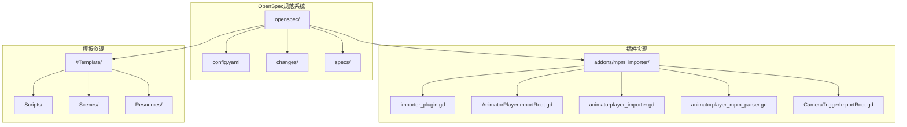
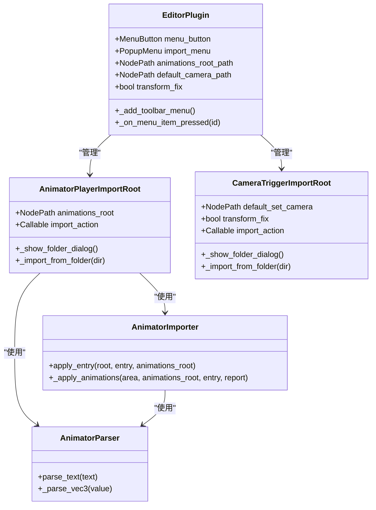
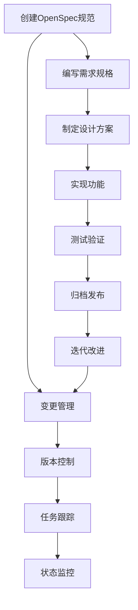
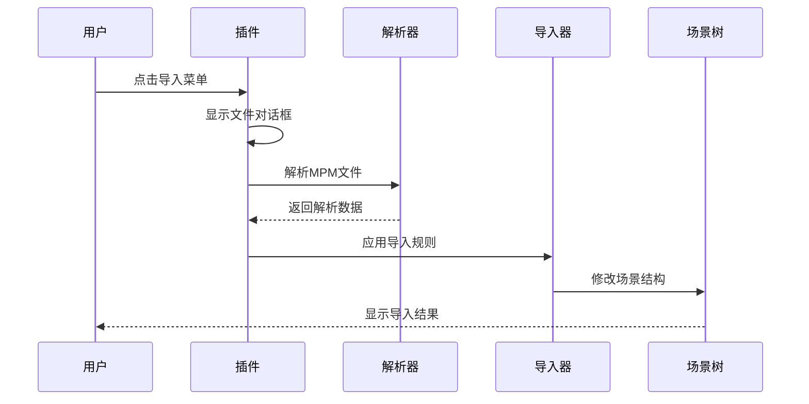
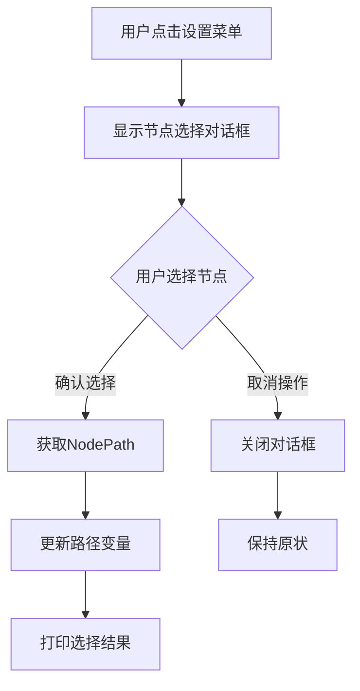
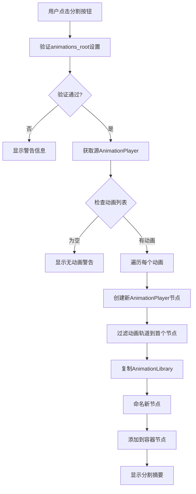
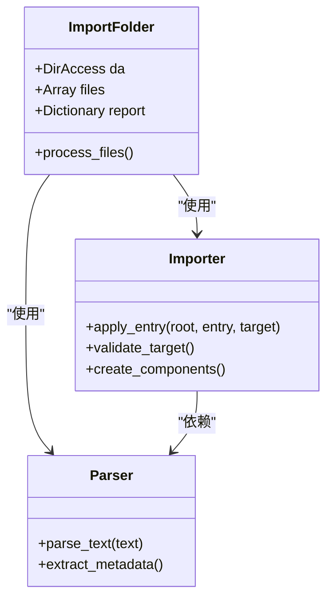
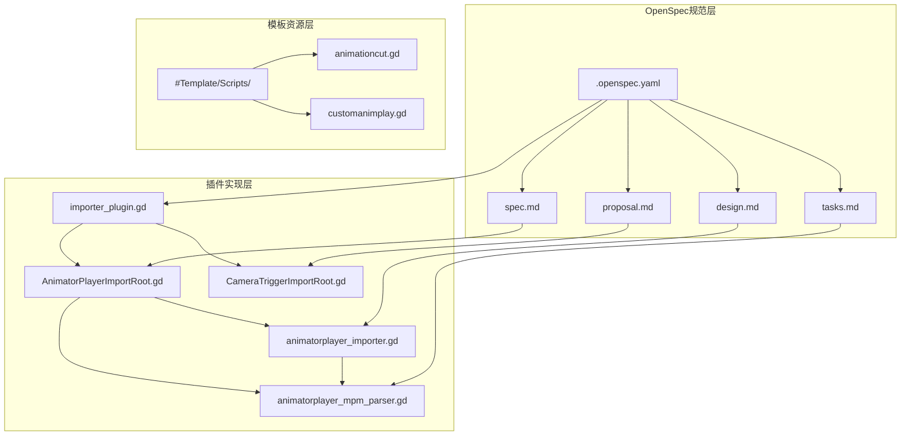

# OpenSpec归档命令

<cite>
**本文档引用的文件**
- [config.yaml](file://openspec/config.yaml)
- [importer_plugin.gd](file://addons/mpm_importer/importer_plugin.gd)
- [AnimatorPlayerImportRoot.gd](file://addons/mpm_importer/AnimatorPlayerImportRoot.gd)
- [animatorplayer_importer.gd](file://addons/mpm_importer/animatorplayer_importer.gd)
- [animatorplayer_mpm_parser.gd](file://addons/mpm_importer/animatorplayer_mpm_parser.gd)
- [CameraTriggerImportRoot.gd](file://addons/mpm_importer/CameraTriggerImportRoot.gd)
- [spec.md](file://openspec/changes/archive/2026-04-18-use-node-picker-for-paths/spec.md)
- [proposal.md](file://openspec/changes/archive/2026-04-18-use-node-picker-for-paths/proposal.md)
- [design.md](file://openspec/changes/archive/2026-04-18-use-node-picker-for-paths/design.md)
- [tasks.md](file://openspec/changes/archive/2026-04-18-use-node-picker-for-paths/tasks.md)
- [.openspec.yaml](file://openspec/changes/archive/2026-04-18-use-node-picker-for-paths/.openspec.yaml)
- [spec.md](file://openspec/changes/merge-animationcut-into-root/spec.md)
- [proposal.md](file://openspec/changes/merge-animationcut-into-root/proposal.md)
- [design.md](file://openspec/changes/merge-animationcut-into-root/design.md)
- [tasks.md](file://openspec/changes/merge-animationcut-into-root/tasks.md)
</cite>

## 目录
1. [简介](#简介)
2. [项目结构](#项目结构)
3. [核心组件](#核心组件)
4. [架构概览](#架构概览)
5. [详细组件分析](#详细组件分析)
6. [依赖关系分析](#依赖关系分析)
7. [性能考虑](#性能考虑)
8. [故障排除指南](#故障排除指南)
9. [结论](#结论)

## 简介

OpenSpec归档命令是Godot引擎中用于管理项目规范文档的系统化方法。该项目展示了如何通过OpenSpec框架实现规范驱动的开发流程，特别是在MPM导入器插件的开发过程中。

OpenSpec的核心理念是将项目的技术规范、设计决策和实现细节以结构化的方式进行管理和归档，确保团队协作的一致性和可追溯性。该系统特别适用于游戏开发项目，如Godot引擎中的动画导入器插件开发。

## 项目结构

项目采用模块化的组织结构，主要包含以下关键目录：

**图表来源**
- [config.yaml](file://openspec/config.yaml)
- [importer_plugin.gd](file://addons/mpm_importer/importer_plugin.gd)

**章节来源**
- [config.yaml](file://openspec/config.yaml)
- [importer_plugin.gd](file://addons/mpm_importer/importer_plugin.gd)

## 核心组件

### OpenSpec配置系统

OpenSpec配置系统通过YAML文件定义项目规范的基本参数和规则：

- **schema**: 指定规范驱动的开发模式
- **context**: 项目上下文信息（可选）
- **rules**: 针对特定工件的自定义规则（可选）

### MPM导入器插件架构

插件系统采用分层架构设计，包含多个专门的组件：

**图表来源**
- [importer_plugin.gd](file://addons/mpm_importer/importer_plugin.gd)
- [AnimatorPlayerImportRoot.gd](file://addons/mpm_importer/AnimatorPlayerImportRoot.gd)
- [animatorplayer_importer.gd](file://addons/mpm_importer/animatorplayer_importer.gd)
- [animatorplayer_mpm_parser.gd](file://addons/mpm_importer/animatorplayer_mpm_parser.gd)

**章节来源**
- [importer_plugin.gd](file://addons/mpm_importer/importer_plugin.gd)
- [AnimatorPlayerImportRoot.gd](file://addons/mpm_importer/AnimatorPlayerImportRoot.gd)
- [animatorplayer_importer.gd](file://addons/mpm_importer/animatorplayer_importer.gd)
- [animatorplayer_mpm_parser.gd](file://addons/mpm_importer/animatorplayer_mpm_parser.gd)

## 架构概览

OpenSpec归档命令的架构基于以下核心原则：

### 规范驱动开发流程

### 插件架构模式

插件系统采用观察者模式和工厂模式的组合：

**图表来源**
- [importer_plugin.gd](file://addons/mpm_importer/importer_plugin.gd)
- [animatorplayer_importer.gd](file://addons/mpm_importer/animatorplayer_importer.gd)

**章节来源**
- [importer_plugin.gd](file://addons/mpm_importer/importer_plugin.gd)
- [animatorplayer_importer.gd](file://addons/mpm_importer/animatorplayer_importer.gd)

## 详细组件分析

### 节点选择对话框系统

#### 设计目标与实现

节点选择对话框系统旨在替代传统的文本输入方式，提供更直观的节点路径设置体验：

**图表来源**
- [design.md](file://openspec/changes/archive/2026-04-18-use-node-picker-for-paths/design.md)

#### 功能特性

- **SceneTreeDialog集成**: 利用Godot编辑器内置的场景树选择器
- **实时路径验证**: 自动验证所选节点的有效性
- **用户友好界面**: 提供直观的节点层次浏览
- **错误处理机制**: 完善的异常情况处理

**章节来源**
- [design.md](file://openspec/changes/archive/2026-04-18-use-node-picker-for-paths/design.md)
- [proposal.md](file://openspec/changes/archive/2026-04-18-use-node-picker-for-paths/proposal.md)

### 动画分割功能

#### 核心功能实现

动画分割功能允许将单个AnimationPlayer中的多个动画分离为独立的AnimationPlayer节点：

**图表来源**
- [spec.md](file://openspec/changes/merge-animationcut-into-root/spec.md)
- [design.md](file://openspec/changes/merge-animationcut-into-root/design.md)

#### 技术实现要点

- **轨道过滤算法**: 确保每个新AnimationPlayer只包含相关节点的动画轨道
- **节点组织结构**: 新创建的AnimationPlayer节点统一放置在新的Node3D容器下
- **错误处理策略**: 对各种异常情况进行适当的错误提示和处理

**章节来源**
- [spec.md](file://openspec/changes/merge-animationcut-into-root/spec.md)
- [design.md](file://openspec/changes/merge-animationcut-into-root/design.md)

### 文件导入流程

#### 导入器架构

导入器系统采用职责分离的设计模式，将解析、验证和应用三个阶段清晰分离：

**图表来源**
- [importer_plugin.gd](file://addons/mpm_importer/importer_plugin.gd)
- [animatorplayer_importer.gd](file://addons/mpm_importer/animatorplayer_importer.gd)

**章节来源**
- [importer_plugin.gd](file://addons/mpm_importer/importer_plugin.gd)
- [animatorplayer_importer.gd](file://addons/mpm_importer/animatorplayer_importer.gd)

## 依赖关系分析

### 组件间依赖关系

**图表来源**
- [.openspec.yaml](file://openspec/changes/archive/2026-04-18-use-node-picker-for-paths/.openspec.yaml)
- [importer_plugin.gd](file://addons/mpm_importer/importer_plugin.gd)
- [AnimatorPlayerImportRoot.gd](file://addons/mpm_importer/AnimatorPlayerImportRoot.gd)

### 数据流依赖

插件系统中的数据流向体现了清晰的单向依赖关系：

1. **配置依赖**: OpenSpec规范文件依赖于具体实现文件
2. **实现依赖**: 插件实现依赖于解析器和导入器组件
3. **运行时依赖**: 导入器依赖于场景树中的目标节点

**章节来源**
- [importer_plugin.gd](file://addons/mpm_importer/importer_plugin.gd)
- [AnimatorPlayerImportRoot.gd](file://addons/mpm_importer/AnimatorPlayerImportRoot.gd)

## 性能考虑

### 优化策略

1. **延迟加载**: 使用`preload`函数延迟加载大型资源文件
2. **内存管理**: 及时释放对话框和临时对象
3. **批量处理**: 对大量文件的导入操作进行批处理优化
4. **缓存机制**: 对解析后的数据进行适当的缓存

### 性能监控

- **导入进度显示**: 实时显示导入进度和状态信息
- **错误统计**: 统计成功、失败、缺失等不同类型的导入结果
- **资源使用**: 监控内存和CPU使用情况

## 故障排除指南

### 常见问题及解决方案

#### 节点路径设置问题

| 问题类型 | 症状 | 解决方案 |
|---------|------|----------|
| 路径无效 | 导入时报错"找不到节点" | 使用场景树对话框重新选择节点 |
| 路径格式错误 | 导入失败但无明确提示 | 检查NodePath格式是否正确 |
| 节点不存在 | 运行时崩溃 | 确保场景中存在指定的节点 |

#### 动画分割问题

| 问题类型 | 症状 | 解决方案 |
|---------|------|----------|
| 分割失败 | 无新节点创建 | 检查animations_root设置和动画数量 |
| 轨道过滤异常 | 动画播放不正确 | 验证轨道过滤算法的正确性 |
| 节点命名冲突 | 警告信息提示 | 手动调整节点名称避免冲突 |

**章节来源**
- [tasks.md](file://openspec/changes/archive/2026-04-18-use-node-picker-for-paths/tasks.md)
- [tasks.md](file://openspec/changes/merge-animationcut-into-root/tasks.md)

## 结论

OpenSpec归档命令系统为Godot项目提供了一套完整的规范管理解决方案。通过将技术规范、设计决策和实现细节进行结构化管理，该系统显著提高了开发效率和代码质量。

### 主要成就

1. **规范驱动开发**: 通过OpenSpec框架实现了规范驱动的开发流程
2. **用户体验优化**: 节点选择对话框大幅改善了用户交互体验
3. **功能集成**: 将动画分割功能无缝集成到导入器插件中
4. **文档标准化**: 建立了完整的变更管理和任务跟踪体系

### 未来发展方向

1. **自动化测试**: 增加更多的自动化测试用例
2. **性能监控**: 实现更完善的性能监控和分析功能
3. **扩展性增强**: 支持更多类型的导入器和解析器
4. **团队协作**: 优化多人协作时的规范同步机制

该系统为类似的游戏开发项目提供了一个优秀的参考模板，展示了如何通过规范化的管理方式提高开发质量和效率。