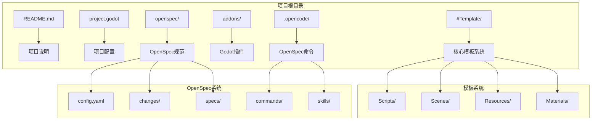
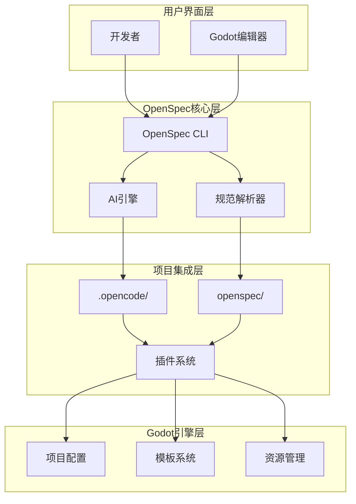
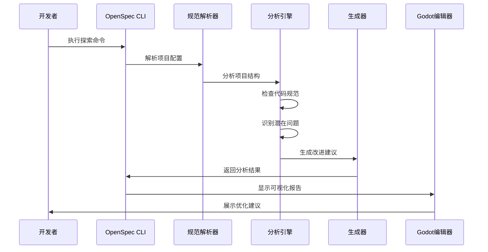
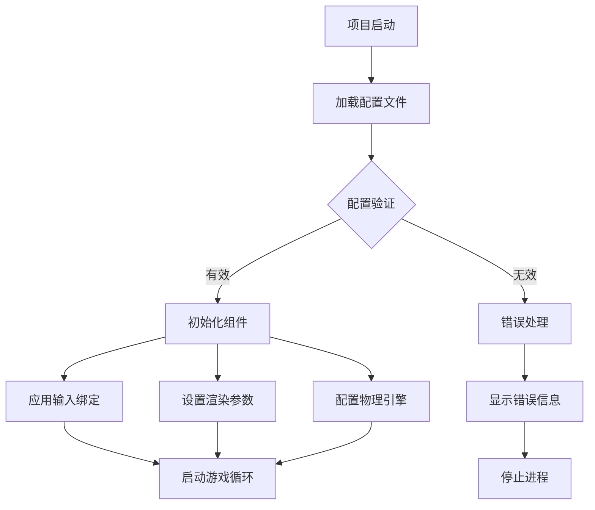
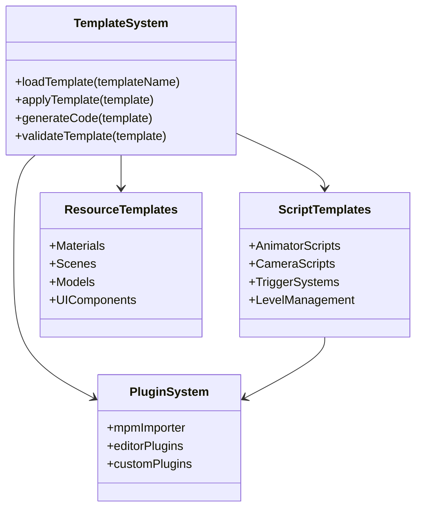

# OpenSpec探索命令

<cite>
**本文档引用的文件**
- [README.md](file://README.md)
- [project.godot](file://project.godot)
- [openspec/config.yaml](file://openspec/config.yaml)
- [.opencode/package.json](file://.opencode/package.json)
- [.opencode/package-lock.json](file://.opencode/package-lock.json)
</cite>

## 目录
1. [简介](#简介)
2. [项目结构](#项目结构)
3. [核心组件](#核心组件)
4. [架构概览](#架构概览)
5. [详细组件分析](#详细组件分析)
6. [依赖分析](#依赖分析)
7. [性能考虑](#性能考虑)
8. [故障排除指南](#故障排除指南)
9. [结论](#结论)

## 简介

OpenSpec是一个基于AI驱动的软件开发框架，旨在通过规范化的文档和自动化工具来提升开发效率。在Godot Line模板项目中，OpenSpec探索命令被集成为一个重要的开发辅助工具，帮助开发者更好地管理项目规范、生成文档和自动化处理各种开发任务。

该项目基于Godot Engine 4.6开发，是一个Dancing Line游戏模板框架，具有高度的兼容性和模块化设计特点。OpenSpec的集成使得项目具备了智能化的规范管理和自动化能力。

## 项目结构

Godot Line项目采用了清晰的分层组织结构，主要包含以下关键目录：



**图表来源**
- [README.md:52-61](file://README.md#L52-L61)
- [project.godot:1-76](file://project.godot#L1-L76)

**章节来源**
- [README.md:52-61](file://README.md#L52-L61)
- [project.godot:1-76](file://project.godot#L1-L76)

## 核心组件

### OpenSpec配置系统

OpenSpec配置系统是整个AI驱动开发框架的核心，负责定义项目的规范模式和上下文信息。

**配置文件结构**：
- **schema**: 定义规范驱动模式
- **context**: 项目技术栈和约定说明
- **rules**: 针对特定工件的自定义规则

**章节来源**
- [openspec/config.yaml:1-21](file://openspec/config.yaml#L1-L21)

### OpenSpec命令系统

命令系统提供了丰富的开发辅助功能，包括：

**核心命令类型**：
- **commands/**: 标准开发命令集合
- **skills/**: 专业技能和高级功能
- **探索命令**: AI驱动的代码分析和优化

**章节来源**
- [.opencode/package.json:1-6](file://.opencode/package.json#L1-L6)
- [.opencode/package-lock.json:1-379](file://.opencode/package-lock.json#L1-L379)

### Godot集成组件

项目集成了多个Godot插件和模板系统：

**插件系统**：
- **mpm_importer**: 动画师导入器插件
- **Editor Plugins**: 编辑器插件管理

**模板系统**：
- **Animator Scripts**: 动画师脚本
- **Camera Scripts**: 相机脚本
- **Trigger Systems**: 触发器系统
- **Level Management**: 关卡管理系统

**章节来源**
- [project.godot:29-31](file://project.godot#L29-L31)

## 架构概览

OpenSpec探索命令在项目中的整体架构如下：



**图表来源**
- [openspec/config.yaml:1-21](file://openspec/config.yaml#L1-L21)
- [.opencode/package.json:1-6](file://.opencode/package.json#L1-L6)

## 详细组件分析

### OpenSpec探索命令工作流程

探索命令是OpenSpec框架中最核心的功能之一，它能够自动分析项目结构并提供智能化的开发建议：



**图表来源**
- [openspec/config.yaml:1-21](file://openspec/config.yaml#L1-L21)
- [.opencode/package.json:1-6](file://.opencode/package.json#L1-L6)

### 项目配置管理

项目配置系统负责管理所有开发相关的设置和参数：



**图表来源**
- [project.godot:15-76](file://project.godot#L15-L76)

**章节来源**
- [project.godot:15-76](file://project.godot#L15-L76)

### 模板系统架构

模板系统是Godot Line项目的核心组成部分，提供了完整的开发框架：



**图表来源**
- [README.md:52-61](file://README.md#L52-L61)

**章节来源**
- [README.md:52-61](file://README.md#L52-L61)

## 依赖分析

OpenSpec探索命令的依赖关系展现了现代AI驱动开发工具的复杂生态系统：

```mermaid
graph LR
subgraph "核心依赖"
A[@opencode-ai/plugin] --> B[SDK]
A --> C[Effect框架]
A --> D[Zod验证]
end
subgraph "开发工具链"
E[TypeScript] --> F[构建工具]
G[Node.js] --> H[包管理]
I[ESLint] --> J[代码质量]
end
subgraph "Godot集成"
K[Godot Engine] --> L[4.6版本]
M[GDScript] --> N[脚本支持]
O[插件系统] --> P[扩展能力]
end
subgraph "AI引擎"
Q[Effect] --> R[函数式编程]
S[Zod] --> T[数据验证]
U[消息包] --> V[数据序列化]
end
A --> K
B --> M
C --> O
D --> N
```

**图表来源**
- [.opencode/package.json:1-6](file://.opencode/package.json#L1-L6)
- [.opencode/package-lock.json:89-120](file://.opencode/package-lock.json#L89-L120)

**章节来源**
- [.opencode/package.json:1-6](file://.opencode/package.json#L1-L6)
- [.opencode/package-lock.json:89-120](file://.opencode/package-lock.json#L89-L120)

## 性能考虑

在使用OpenSpec探索命令时，需要考虑以下几个方面的性能影响：

### 内存使用优化
- **增量分析**: 探索命令应支持增量分析，避免全量扫描整个项目
- **缓存策略**: 实现智能缓存机制，减少重复计算
- **内存池管理**: 对频繁创建的对象使用内存池

### 处理速度优化
- **并发处理**: 利用多核处理器并行分析不同文件类型
- **异步操作**: 将耗时操作异步化，避免阻塞主线程
- **预编译**: 对常用分析模式进行预编译优化

### 存储空间管理
- **临时文件清理**: 及时清理分析过程产生的临时文件
- **日志轮转**: 实现日志文件的自动轮转和清理
- **增量备份**: 仅备份发生变化的文件

## 故障排除指南

### 常见问题及解决方案

**OpenSpec命令执行失败**
1. 检查Node.js环境是否正确安装
2. 验证@opencode-ai/plugin依赖是否完整
3. 确认项目权限设置正确

**配置文件解析错误**
1. 检查openspec/config.yaml语法
2. 验证YAML格式的正确性
3. 确认缩进和特殊字符

**Godot集成问题**
1. 确认Godot Engine 4.6版本兼容性
2. 检查插件系统配置
3. 验证项目路径设置

**性能问题诊断**
1. 使用性能分析工具检测瓶颈
2. 检查内存使用情况
3. 监控磁盘I/O操作

**章节来源**
- [openspec/config.yaml:1-21](file://openspec/config.yaml#L1-L21)
- [.opencode/package.json:1-6](file://.opencode/package.json#L1-L6)

## 结论

OpenSpec探索命令为Godot Line项目提供了强大的AI驱动开发能力。通过规范化的配置管理、智能化的代码分析和自动化的文档生成，显著提升了开发效率和代码质量。

该系统的成功集成体现了现代游戏开发工具链的发展趋势，即将AI技术深度融入到传统的开发流程中。未来可以进一步扩展探索命令的功能，增加更多智能化的代码重构建议和性能优化提示。

对于开发者而言，理解OpenSpec探索命令的工作原理和最佳实践，将有助于更好地利用这一工具来提升项目质量和开发效率。