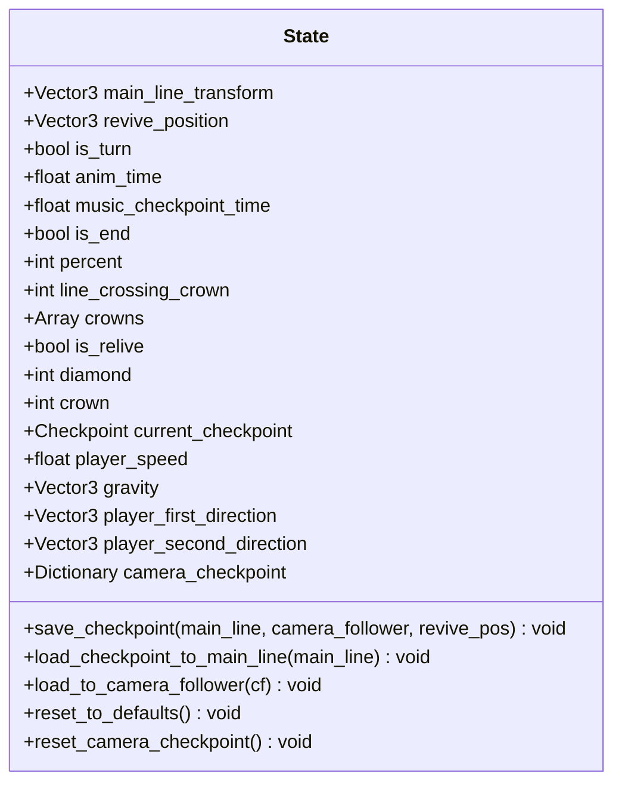
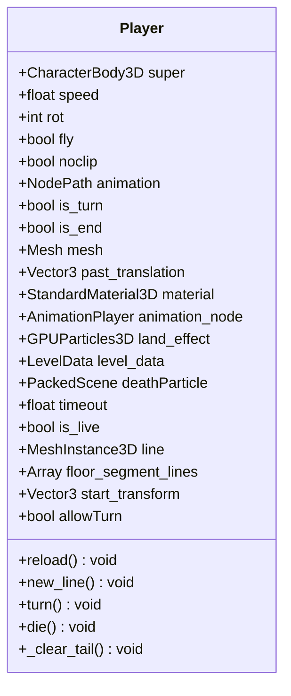
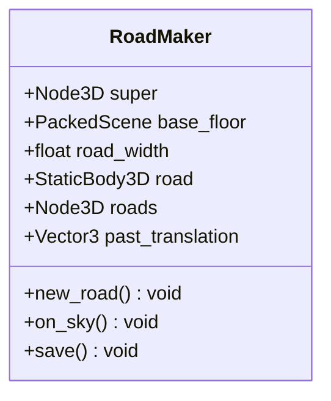
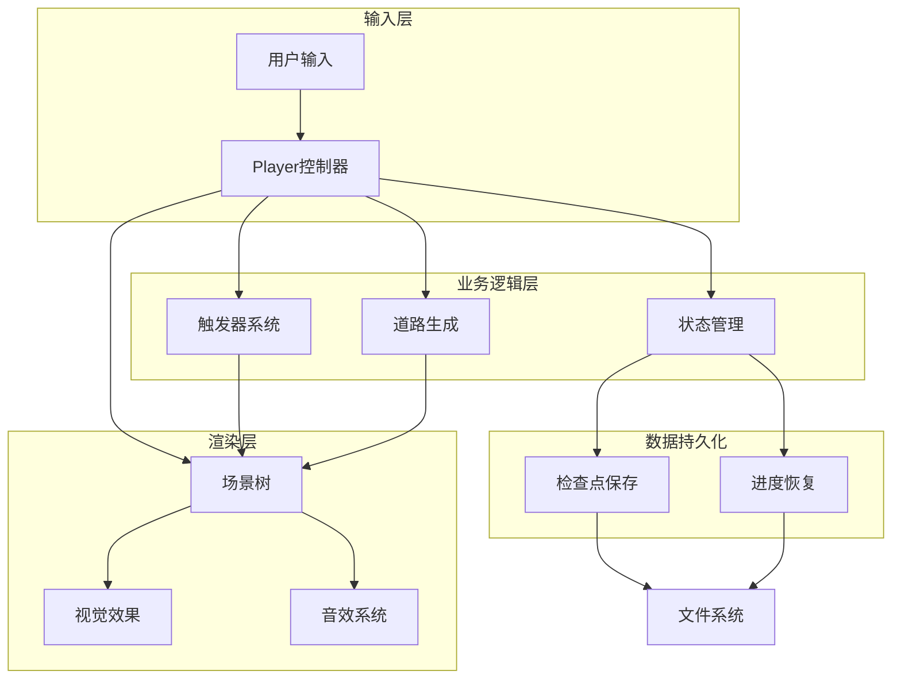
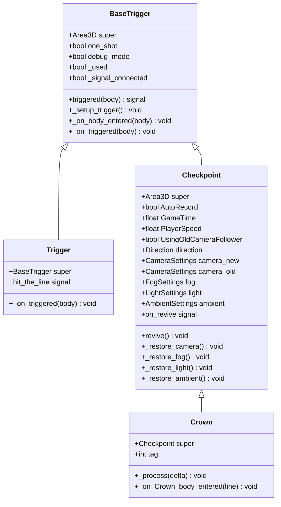
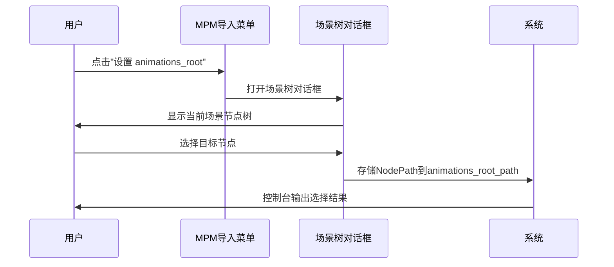
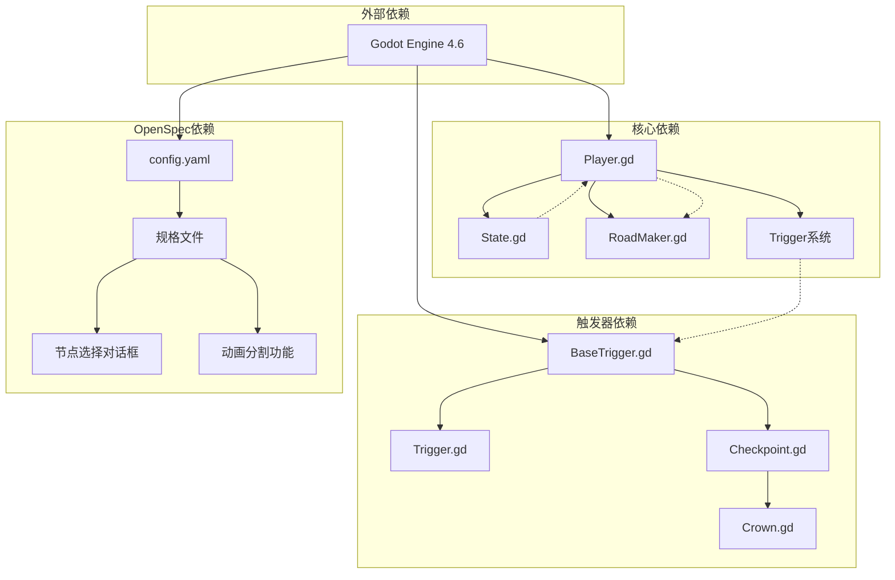

# OpenSpec探索技能

<cite>
**本文档引用的文件**
- [README.md](file://README.md)
- [config.yaml](file://openspec/config.yaml)
- [spec.md](file://openspec/changes/archive/2026-04-18-use-node-picker-for-paths/specs/node-picker-dialog/spec.md)
- [spec.md](file://openspec/changes/merge-animationcut-into-root/specs/animation-split/spec.md)
- [Player.gd](file://#Template/[Scripts]/Level/Player.gd)
- [RoadMaker.gd](file://#Template/[Scripts]/Level/RoadMaker.gd)
- [State.gd](file://#Template/[Scripts]/State.gd)
- [BaseTrigger.gd](file://#Template/[Scripts]/Trigger/BaseTrigger.gd)
- [Trigger.gd](file://#Template/[Scripts]/Trigger/Trigger.gd)
- [Checkpoint.gd](file://#Template/[Scripts]/Trigger/Checkpoint.gd)
- [Crown.gd](file://#Template/[Scripts]/Trigger/Crown.gd)
</cite>

## 目录
1. [简介](#简介)
2. [项目结构](#项目结构)
3. [核心组件](#核心组件)
4. [架构概览](#架构概览)
5. [详细组件分析](#详细组件分析)
6. [依赖关系分析](#依赖关系分析)
7. [性能考虑](#性能考虑)
8. [故障排除指南](#故障排除指南)
9. [结论](#结论)

## 简介

OpenSpec探索技能是一个基于Godot Engine 4.6开发的Dancing Line游戏模板框架。该项目旨在提供一个完整的线条游戏机制实现，具有高兼容性和模块化设计特点。通过OpenSpec探索技能，开发者可以深入理解项目的架构设计、组件关系和数据流。

该项目的核心特色包括：
- Dancing Line核心玩法的完整实现
- 与冰焰模板3/4的高度兼容性
- 开箱即用的完整游戏框架
- 模块化设计，易于扩展和定制
- 跨平台支持（Windows、Linux、macOS）

## 项目结构

项目采用分层组织结构，主要包含以下核心目录：

```mermaid
graph TB
subgraph "项目根目录"
A[README.md] --> B[项目文档]
C[project.godot] --> D[项目配置]
E[export_presets.cfg] --> F[导出预设]
end
subgraph "模板系统"
G[#Template/] --> H[核心模板]
G --> I[资源文件]
G --> J[场景文件]
end
subgraph "OpenSpec系统"
K[openspec/] --> L[配置文件]
K --> M[变更记录]
K --> N[规格说明]
end
subgraph "插件系统"
O[addons/] --> P[MPM导入器]
O --> Q[其他插件]
end
subgraph "核心脚本"
R[#Template/[Scripts]/] --> S[级别系统]
R --> T[触发器系统]
R --> U[动画系统]
R --> V[状态管理]
end
```

**图表来源**
- [README.md:52-61](file://README.md#L52-L61)
- [config.yaml:1-21](file://openspec/config.yaml#L1-L21)

**章节来源**
- [README.md:52-61](file://README.md#L52-L61)
- [README.md:18-51](file://README.md#L18-L51)

## 核心组件

### 状态管理系统

状态管理系统是整个游戏的核心，负责保存和恢复玩家进度。该系统包含持久化检查点数据和相机跟随器检查点数据两大模块。



**图表来源**
- [State.gd:1-159](file://#Template/[Scripts]/State.gd#L1-L159)

### 玩家控制系统

玩家控制系统实现了Dancing Line的核心玩法机制，包括转向、重试、死亡处理等功能。



**图表来源**
- [Player.gd:1-226](file://#Template/[Scripts]/Level/Player.gd#L1-L226)

### 道路生成系统

道路生成系统负责动态创建和维护玩家轨迹，确保道路与玩家移动同步。



**图表来源**
- [RoadMaker.gd:1-46](file://#Template/[Scripts]/Level/RoadMaker.gd#L1-L46)

**章节来源**
- [State.gd:1-159](file://#Template/[Scripts]/State.gd#L1-L159)
- [Player.gd:1-226](file://#Template/[Scripts]/Level/Player.gd#L1-L226)
- [RoadMaker.gd:1-46](file://#Template/[Scripts]/Level/RoadMaker.gd#L1-L46)

## 架构概览

项目采用分层架构设计，各组件之间通过信号和事件进行通信：



**图表来源**
- [Player.gd:45-120](file://#Template/[Scripts]/Level/Player.gd#L45-L120)
- [State.gd:52-80](file://#Template/[Scripts]/State.gd#L52-L80)
- [RoadMaker.gd:12-27](file://#Template/[Scripts]/Level/RoadMaker.gd#L12-L27)

## 详细组件分析

### 触发器系统架构

触发器系统采用基类继承模式，提供了统一的触发机制和扩展接口。



**图表来源**
- [BaseTrigger.gd:1-38](file://#Template/[Scripts]/Trigger/BaseTrigger.gd#L1-L38)
- [Trigger.gd:1-10](file://#Template/[Scripts]/Trigger/Trigger.gd#L1-L10)
- [Checkpoint.gd:1-210](file://#Template/[Scripts]/Trigger/Checkpoint.gd#L1-L210)
- [Crown.gd:1-14](file://#Template/[Scripts]/Trigger/Crown.gd#L1-L14)

### OpenSpec探索技能实现

OpenSpec探索技能通过规格驱动的方法论，实现了以下核心功能：

#### 节点选择对话框功能



**图表来源**
- [spec.md:6-24](file://openspec/changes/archive/2026-04-18-use-node-picker-for-paths/specs/node-picker-dialog/spec.md#L6-L24)

#### 动画分割功能

```mermaid
flowchart TD
A[用户点击"Split Animations"] --> B{验证animations_root}
B --> |未设置| C[打印警告: animations_root not set]
B --> |路径不存在| D[打印警告: Missing animations_root]
B --> |非AnimationPlayer| E[打印警告: animations_root is not an AnimationPlayer]
B --> |有效| F[检查是否有动画]
F --> |无动画| G[打印警告: No animations to split]
F --> |有动画| H[遍历每个动画]
H --> I[过滤轨道到第一个节点]
I --> J[创建新的AnimationPlayer节点]
J --> K[命名新节点为动画名称]
K --> L[打印创建摘要]
```

**图表来源**
- [spec.md:7-42](file://openspec/changes/merge-animationcut-into-root/specs/animation-split/spec.md#L7-L42)

**章节来源**
- [BaseTrigger.gd:1-38](file://#Template/[Scripts]/Trigger/BaseTrigger.gd#L1-L38)
- [Trigger.gd:1-10](file://#Template/[Scripts]/Trigger/Trigger.gd#L1-L10)
- [Checkpoint.gd:1-210](file://#Template/[Scripts]/Trigger/Checkpoint.gd#L1-L210)
- [Crown.gd:1-14](file://#Template/[Scripts]/Trigger/Crown.gd#L1-L14)
- [spec.md:1-25](file://openspec/changes/archive/2026-04-18-use-node-picker-for-paths/specs/node-picker-dialog/spec.md#L1-L25)
- [spec.md:1-43](file://openspec/changes/merge-animationcut-into-root/specs/animation-split/spec.md#L1-L43)

## 依赖关系分析

项目中的组件依赖关系呈现清晰的层次结构：



**图表来源**
- [Player.gd:27-56](file://#Template/[Scripts]/Level/Player.gd#L27-L56)
- [State.gd:86-95](file://#Template/[Scripts]/State.gd#L86-L95)
- [BaseTrigger.gd:18-35](file://#Template/[Scripts]/Trigger/BaseTrigger.gd#L18-L35)

**章节来源**
- [Player.gd:27-56](file://#Template/[Scripts]/Level/Player.gd#L27-L56)
- [State.gd:86-95](file://#Template/[Scripts]/State.gd#L86-L95)
- [BaseTrigger.gd:18-35](file://#Template/[Scripts]/Trigger/BaseTrigger.gd#L18-L35)

## 性能考虑

### 内存管理优化

项目在内存管理方面采用了多项优化策略：

1. **实例复用**：通过单例模式管理Player实例，避免重复创建
2. **延迟加载**：使用call_deferred延迟场景添加，减少主线程压力
3. **对象池模式**：死亡粒子使用队列释放机制
4. **信号连接优化**：避免重复连接，使用_has_signal检查

### 渲染性能优化

1. **批量更新**：道路生成使用批量更新机制
2. **条件渲染**：仅在需要时创建和更新视觉效果
3. **材质共享**：玩家尾迹使用共享材质实例

## 故障排除指南

### 常见问题及解决方案

#### 状态同步问题

**问题描述**：玩家位置与检查点不匹配
**解决方案**：
1. 检查State.save_checkpoint调用时机
2. 验证transform属性的正确性
3. 确认revive_position设置

#### 触发器失效问题

**问题描述**：触发器无法正常工作
**解决方案**：
1. 检查one_shot标志位设置
2. 验证body_entered信号连接
3. 确认触发器区域设置

#### 动画播放问题

**问题描述**：动画无法正常播放或同步
**解决方案**：
1. 检查AnimationPlayer节点路径
2. 验证动画资源完整性
3. 确认时间轴同步机制

**章节来源**
- [State.gd:52-80](file://#Template/[Scripts]/State.gd#L52-L80)
- [BaseTrigger.gd:18-35](file://#Template/[Scripts]/Trigger/BaseTrigger.gd#L18-L35)
- [Player.gd:163-185](file://#Template/[Scripts]/Level/Player.gd#L163-L185)

## 结论

OpenSpec探索技能为Godot游戏开发提供了一个完整的模板框架，通过规格驱动的方法论实现了高度模块化的架构设计。项目的核心优势包括：

1. **架构清晰**：分层设计使得代码结构易于理解和维护
2. **功能完整**：涵盖了Dancing Line游戏的所有核心功能
3. **扩展性强**：模块化设计便于功能扩展和定制
4. **工具完善**：OpenSpec探索技能提供了强大的开发辅助功能

通过深入理解这些组件和它们之间的交互关系，开发者可以更好地利用这个模板框架进行二次开发和功能扩展。项目的文档结构和代码注释也为后续的维护和升级提供了良好的基础。