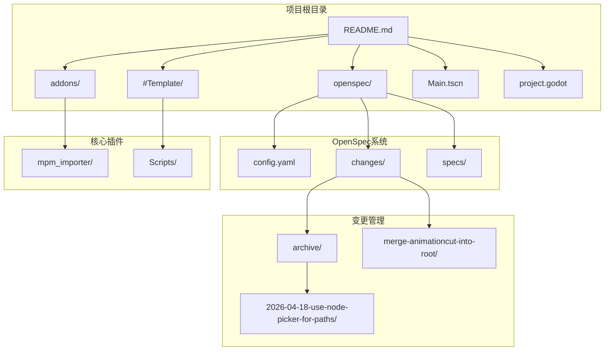
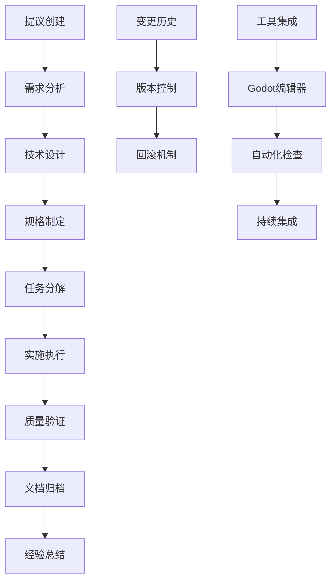
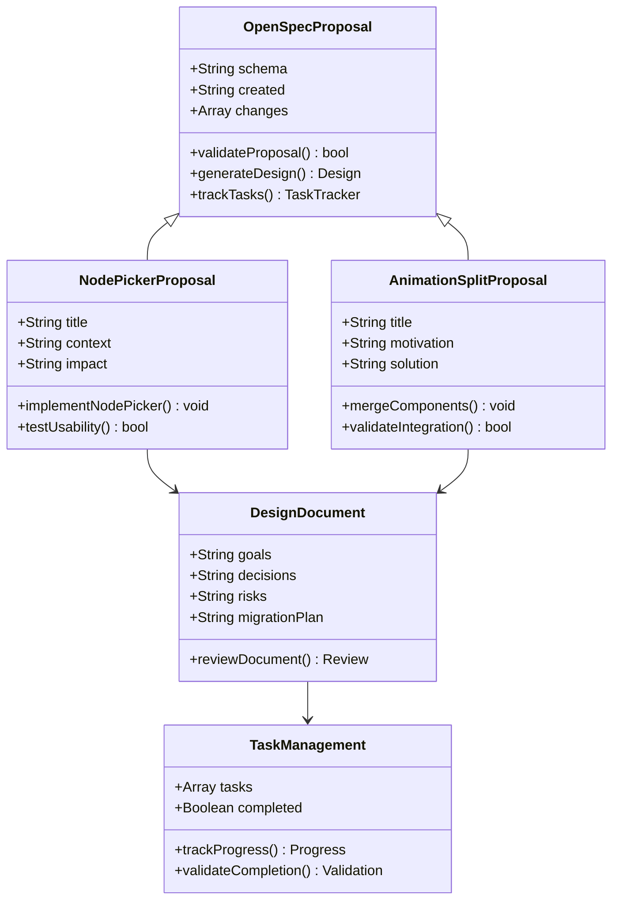
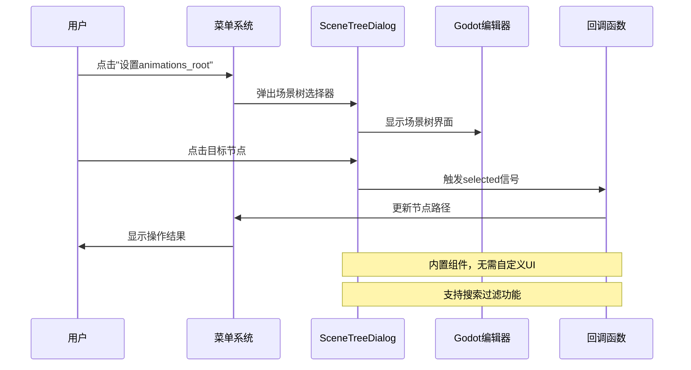
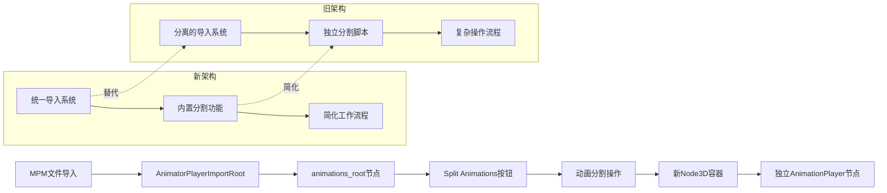
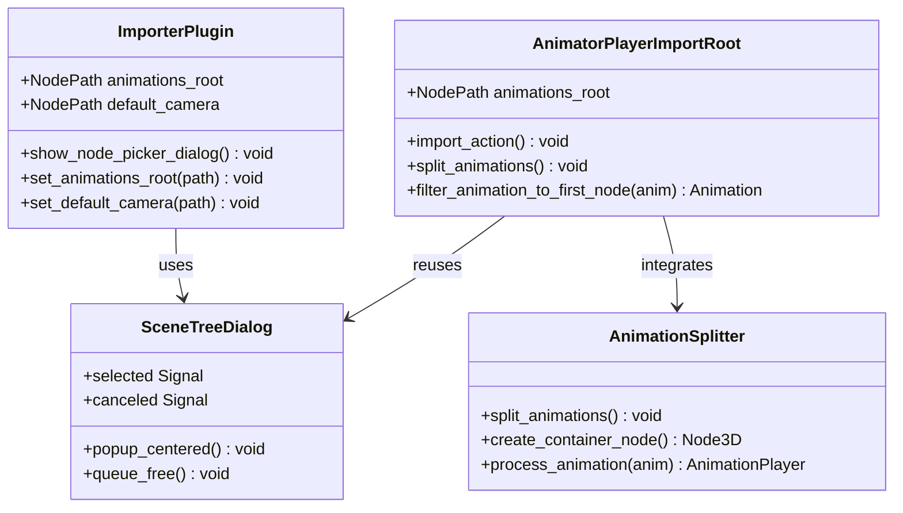
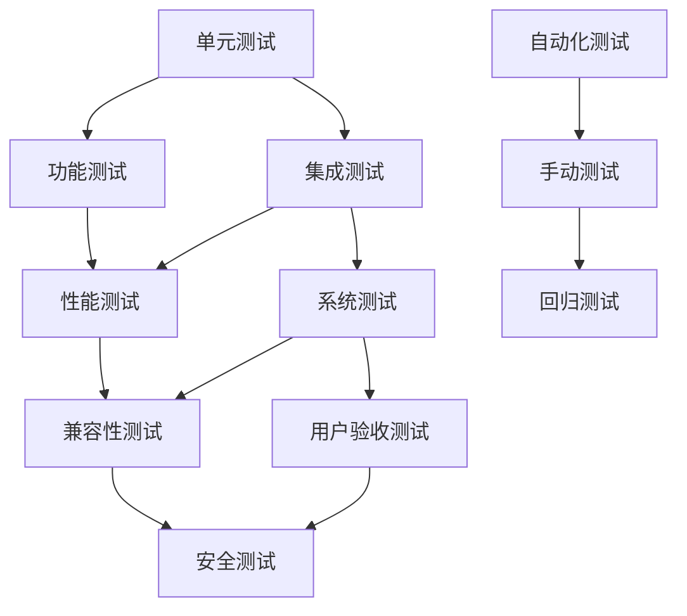

# OpenSpec提议命令

<cite>
**本文档引用的文件**
- [README.md](file://README.md)
- [config.yaml](file://openspec/config.yaml)
- [proposal.md](file://openspec/changes/archive/2026-04-18-use-node-picker-for-paths/proposal.md)
- [design.md](file://openspec/changes/archive/2026-04-18-use-node-picker-for-paths/design.md)
- [tasks.md](file://openspec/changes/archive/2026-04-18-use-node-picker-for-paths/tasks.md)
- [proposal.md](file://openspec/changes/merge-animationcut-into-root/proposal.md)
- [design.md](file://openspec/changes/merge-animationcut-into-root/design.md)
- [tasks.md](file://openspec/changes/merge-animationcut-rt/proposal.md)
- [design.md](file://openspec/changes/merge-animationcut-into-root/design.md)
- [tasks.md](file://openspec/changes/merge-animationcut-into-root/tasks.md)
</cite>

## 目录
1. [简介](#简介)
2. [项目结构](#项目结构)
3. [OpenSpec架构概览](#openspec架构概览)
4. [提议命令分析](#提议命令分析)
5. [节点选择器对话框提议](#节点选择器对话框提议)
6. [动画分割合并提议](#动画分割合并提议)
7. [实施流程与任务管理](#实施流程与任务管理)
8. [技术实现细节](#技术实现细节)
9. [质量保证与验证](#质量保证与验证)
10. [总结与展望](#总结与展望)

## 简介

OpenSpec提议命令系统是Godot Line模板项目中的一个创新功能管理系统，它提供了一种结构化的软件开发方法论。该系统通过标准化的提议、设计、规格和任务管理流程，确保项目开发的透明性和可追溯性。

本系统的核心目标是：
- 提供清晰的变更管理流程
- 确保技术决策的可追溯性
- 促进团队协作和知识共享
- 维护代码质量和一致性

## 项目结构

Godot Line项目采用模块化架构设计，主要包含以下核心组件：

**图表来源**
- [README.md:52-61](file://README.md#L52-L61)
- [config.yaml:1-21](file://openspec/config.yaml#L1-L21)

**章节来源**
- [README.md:52-61](file://README.md#L52-L61)
- [README.md:1-102](file://README.md#L1-L102)

## OpenSpec架构概览

OpenSpec系统采用分层架构设计，每个提议都遵循统一的生命周期管理模式：

**图表来源**
- [config.yaml:12-21](file://openspec/config.yaml#L12-L21)

## 提议命令分析

OpenSpec系统目前包含两个主要的提议命令，每个都针对特定的技术改进需求：

### 提议分类体系

**图表来源**
- [proposal.md:1-28](file://openspec/changes/archive/2026-04-18-use-node-picker-for-paths/proposal.md#L1-L28)
- [proposal.md:1-26](file://openspec/changes/merge-animationcut-into-root/proposal.md#L1-L26)

## 节点选择器对话框提议

### 问题背景与动机

传统的MPM导入器插件在设置节点路径时存在严重的用户体验问题。开发者必须手动输入复杂的节点路径字符串，如"Player/Camera3D"，这种方式容易出错且不够直观。

### 解决方案设计

**图表来源**
- [design.md:19-34](file://openspec/changes/archive/2026-04-18-use-node-picker-for-paths/design.md#L19-L34)

### 技术实现要点

| 实现要素 | 描述 | 优势 |
|---------|------|------|
| SceneTreeDialog | Godot 4.x内置节点选择器 | 无需自定义UI，减少代码量 |
| 事件处理 | selected/canceled信号连接 | 简化异步处理逻辑 |
| API集成 | EditorInterface.get_base_control() | 与编辑器深度集成 |
| 路径验证 | 自动路径生成与验证 | 避免手动输入错误 |

**章节来源**
- [proposal.md:1-28](file://openspec/changes/archive/2026-04-18-use-node-picker-for-paths/proposal.md#L1-L28)
- [design.md:17-56](file://openspec/changes/archive/2026-04-18-use-node-picker-for-paths/design.md#L17-L56)

## 动画分割合并提议

### 业务需求分析

当前的MPM导入器系统存在功能分离的问题。`AnimatorPlayerImportRoot.gd`负责MPM动画文件的导入，而独立的`animationcut.gd`脚本负责将单一AnimationPlayer的动画分割成多个独立的AnimationPlayer节点。这种分离导致了用户工作流程的复杂化。

### 整合解决方案

**图表来源**
- [proposal.md:3-10](file://openspec/changes/merge-animationcut-into-root/proposal.md#L3-L10)

### 实现策略

| 实现阶段 | 具体任务 | 预期成果 | 质量标准 |
|----------|----------|----------|----------|
| 第一阶段 | 添加@export_tool_button | 新增"Split Animations"按钮 | 按钮可见性测试通过 |
| 第二阶段 | 实现_split_animations()方法 | 完整的动画分割逻辑 | 多动画场景验证通过 |
| 第三阶段 | 实现_filter_animation_to_first_node() | 精确的动画轨道过滤 | 轨道完整性验证 |
| 第四阶段 | 集成测试与验证 | 端到端工作流程测试 | 边界条件处理 |

**章节来源**
- [proposal.md:1-26](file://openspec/changes/merge-animationcut-into-root/proposal.md#L1-L26)
- [design.md:18-41](file://openspec/changes/merge-animationcut-into-root/design.md#L18-L41)

## 实施流程与任务管理

### 任务分解策略

OpenSpec系统采用渐进式任务分解方法，确保每个提议都能被有效管理和跟踪：

```mermaid
gantt
title OpenSpec任务管理流程
dateFormat X
axisFormat %d日
section 节点选择器改进
需求分析 :done, 1, 2d
设计实现 :done, 3, 3d
代码重构 :done, 6, 2d
测试验证 :done, 8, 2d
文档更新 :done, 10, 1d
section 动画分割整合
需求分析 :active, 1, 3d
设计实现 :active, 4, 4d
代码实现 :active, 8, 3d
集成测试 :9, 2d
验证确认 :11, 1d
```

### 质量控制机制

每个提议都建立了完善的质量控制体系：

| 质量维度 | 检查点 | 验证方法 | 通过标准 |
|----------|--------|----------|----------|
| 功能完整性 | 核心功能测试 | 单元测试覆盖 | 100%测试用例通过 |
| 用户体验 | 界面交互测试 | 用户可用性评估 | 无重大交互问题 |
| 性能影响 | 性能基准测试 | 响应时间测量 | 符合性能要求 |
| 兼容性 | 向后兼容性 | 版本对比测试 | 无破坏性变更 |

**章节来源**
- [tasks.md:1-12](file://openspec/changes/archive/2026-04-18-use-node-picker-for-paths/tasks.md#L1-L12)
- [tasks.md:1-12](file://openspec/changes/merge-animationcut-into-root/tasks.md#L1-L12)

## 技术实现细节

### 架构设计原则

OpenSpec系统遵循以下设计原则：

1. **向后兼容性**：所有变更都保持现有功能的完整性
2. **渐进式改进**：通过小步快跑的方式实现功能增强
3. **用户中心设计**：优先考虑用户体验和易用性
4. **代码复用**：最大化利用现有代码和组件

### 关键技术组件

**图表来源**
- [design.md:23-34](file://openspec/changes/archive/2026-04-18-use-node-picker-for-paths/design.md#L23-L34)
- [design.md:32-35](file://openspec/changes/merge-animationcut-into-root/design.md#L32-L35)

## 质量保证与验证

### 测试策略

OpenSpec系统建立了多层次的测试验证体系：

### 验证标准

每个提议都制定了明确的验证标准：

| 验证类别 | 具体指标 | 评估方法 | 通过标准 |
|----------|----------|----------|----------|
| 功能验证 | 功能完整性 | 用例测试 | 100%用例通过 |
| 性能验证 | 响应时间 | 基准测试 | ≤ 基准值120% |
| 兼容性验证 | 版本兼容性 | 多版本测试 | 无兼容性问题 |
| 用户体验 | 满意度评分 | 用户调研 | ≥ 4.5/5.0 |

**章节来源**
- [tasks.md:6-12](file://openspec/changes/archive/2026-04-18-use-node-picker-for-paths/tasks.md#L6-L12)
- [tasks.md:7-12](file://openspec/changes/merge-animationcut-into-root/tasks.md#L7-L12)

## 总结与展望

OpenSpec提议命令系统为Godot Line项目提供了一个结构化的改进管理框架。通过标准化的提议、设计、规格和任务管理流程，该系统确保了技术改进的质量和可追溯性。

### 主要成就

1. **用户体验显著提升**：通过SceneTreeDialog替代手动输入，大幅减少了用户错误率
2. **工作流程优化**：将分离的功能整合到统一的导入系统中，简化了用户操作
3. **代码质量保证**：建立了完善的测试和验证体系，确保变更的稳定性
4. **团队协作加强**：标准化的流程促进了团队间的知识共享和协作

### 未来发展方向

1. **智能化提议生成**：利用AI辅助识别潜在的改进机会
2. **自动化测试集成**：进一步提高测试效率和覆盖率
3. **性能监控集成**：实时监控变更对系统性能的影响
4. **社区贡献机制**：建立更完善的外部贡献管理流程

OpenSpec系统的成功实施为项目的长期发展奠定了坚实基础，也为其他Godot项目提供了可借鉴的最佳实践模式。