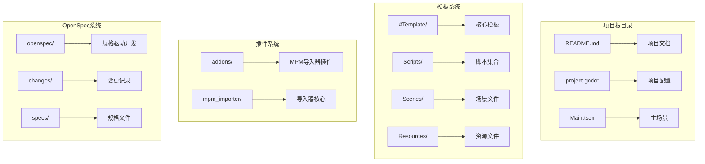
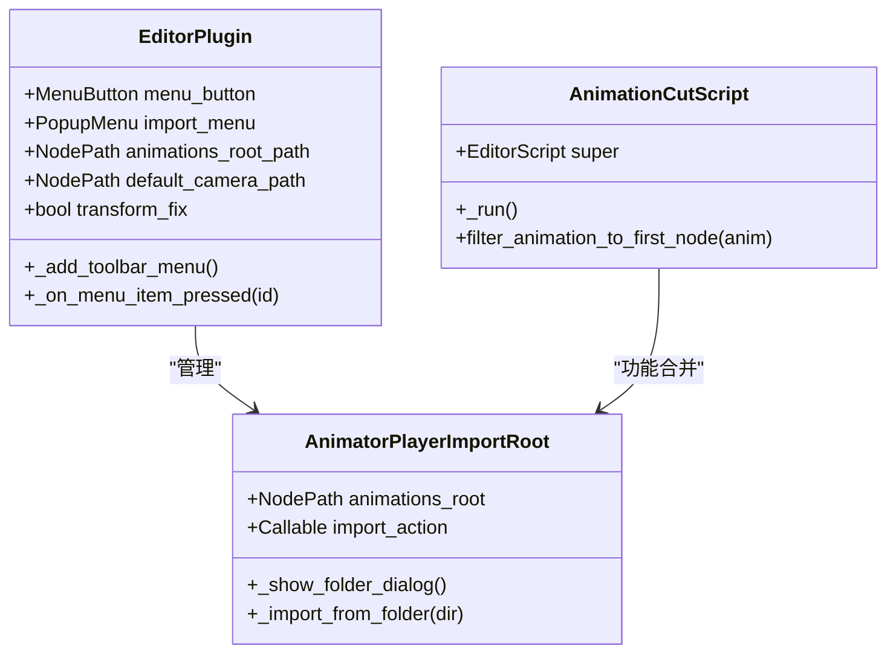
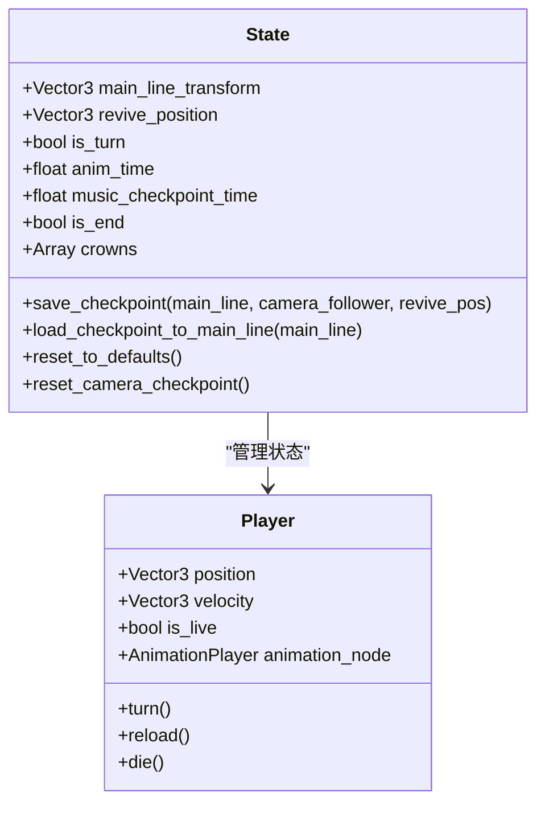
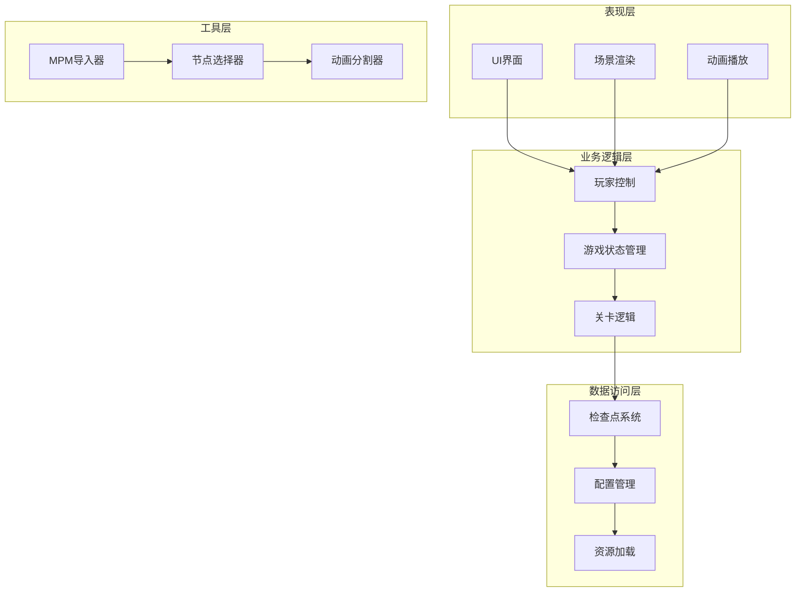
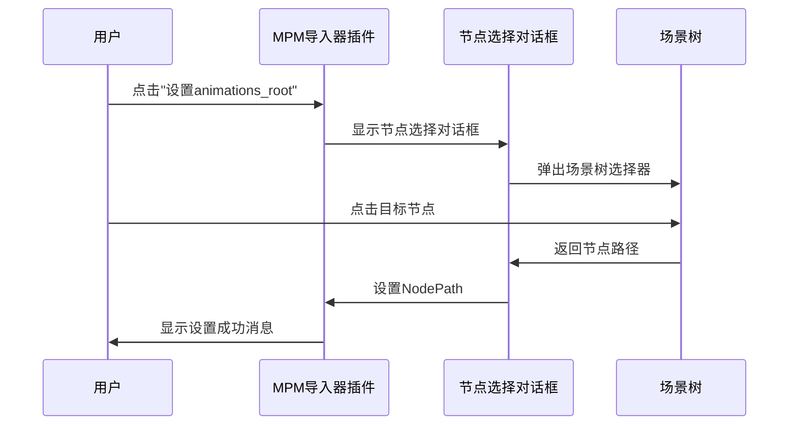
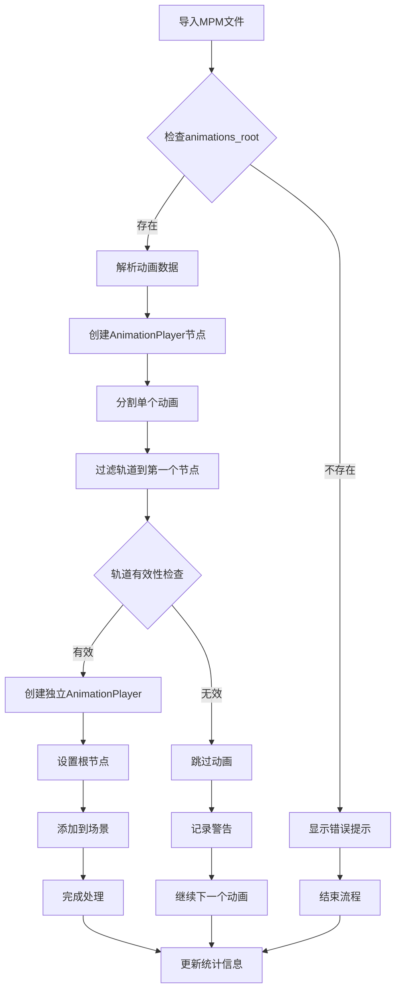
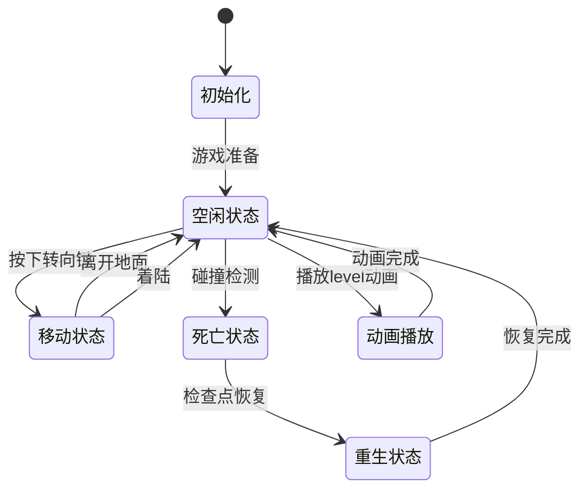
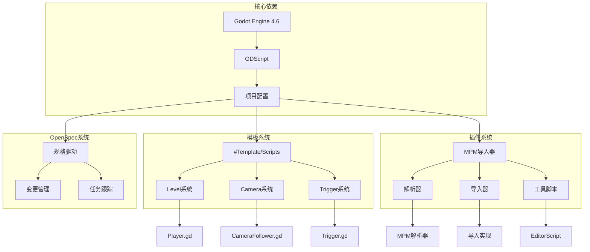

# OpenSpec提议技能

<cite>
**本文档引用的文件**
- [README.md](file://README.md)
- [config.yaml](file://openspec/config.yaml)
- [proposal.md](file://openspec/changes/archive/2026-04-18-use-node-picker-for-paths/proposal.md)
- [tasks.md](file://openspec/changes/archive/2026-04-18-use-node-picker-for-paths/tasks.md)
- [proposal.md](file://openspec/changes/merge-animationcut-into-root/proposal.md)
- [tasks.md](file://openspec/changes/merge-animationcut-into-root/tasks.md)
- [importer_plugin.gd](file://addons/mpm_importer/importer_plugin.gd)
- [AnimatorPlayerImportRoot.gd](file://addons/mpm_importer/AnimatorPlayerImportRoot.gd)
- [animationcut.gd](file://#Template/[Scripts]/PortTookits/animationcut.gd)
- [Player.gd](file://#Template/[Scripts]/Level/Player.gd)
- [State.gd](file://#Template/[Scripts]/State.gd)
</cite>

## 目录
1. [简介](#简介)
2. [项目结构](#项目结构)
3. [核心组件](#核心组件)
4. [架构概览](#架构概览)
5. [详细组件分析](#详细组件分析)
6. [依赖关系分析](#依赖关系分析)
7. [性能考虑](#性能考虑)
8. [故障排除指南](#故障排除指南)
9. [结论](#结论)

## 简介

OpenSpec提议技能是一个基于Godot Engine 4.6开发的Dancing Line游戏模板框架。该项目旨在提供一个完整的线条游戏机制实现，具有高兼容性和模块化设计特点。通过OpenSpec提议技能，开发者可以轻松地将关卡从其他模板迁移到此项目，或直接发布至目标平台。

本项目的核心特色包括：
- Dancing Line核心玩法的完整实现
- 与多个模板系统的高兼容性
- 开箱即用的完整游戏框架
- 模块化设计，易于扩展和定制
- 跨平台支持（Windows、Linux、macOS）

## 项目结构

项目采用分层组织结构，主要包含以下核心目录：

**图表来源**
- [README.md:52-61](file://README.md#L52-L61)
- [project.godot](file://project.godot)

**章节来源**
- [README.md:52-61](file://README.md#L52-L61)
- [README.md:10-16](file://README.md#L10-L16)

## 核心组件

### MPM导入器插件系统

MPM导入器插件是项目的核心组件之一，提供了完整的动画和场景导入功能。该系统包含多个解析器和导入器，支持不同类型的MPM文件格式。

**图表来源**
- [importer_plugin.gd:1-218](file://addons/mpm_importer/importer_plugin.gd#L1-L218)
- [AnimatorPlayerImportRoot.gd:1-83](file://addons/mpm_importer/AnimatorPlayerImportRoot.gd#L1-L83)
- [animationcut.gd:1-64](file://#Template/[Scripts]/PortTookits/animationcut.gd#L1-L64)

### 状态管理系统

状态管理系统负责维护游戏中的持久化数据，包括玩家位置、动画状态、检查点信息等关键数据。

**图表来源**
- [State.gd:1-159](file://#Template/[Scripts]/State.gd#L1-L159)
- [Player.gd:1-226](file://#Template/[Scripts]/Level/Player.gd#L1-L226)

**章节来源**
- [importer_plugin.gd:1-218](file://addons/mpm_importer/importer_plugin.gd#L1-L218)
- [AnimatorPlayerImportRoot.gd:1-83](file://addons/mpm_importer/AnimatorPlayerImportRoot.gd#L1-L83)
- [State.gd:1-159](file://#Template/[Scripts]/State.gd#L1-L159)

## 架构概览

项目采用模块化架构设计，各个组件之间通过清晰的接口进行交互。整体架构分为以下几个层次：

**图表来源**
- [importer_plugin.gd:19-25](file://addons/mpm_importer/importer_plugin.gd#L19-L25)
- [State.gd:52-80](file://#Template/[Scripts]/State.gd#L52-L80)

## 详细组件分析

### 节点路径选择对话框优化

OpenSpec提议技能中的一个重要改进是将手动输入节点路径的方式替换为使用Godot编辑器内置的节点选择器。这一改进显著提升了用户体验，减少了用户输入错误的可能性。

**图表来源**
- [proposal.md:1-28](file://openspec/changes/archive/2026-04-18-use-node-picker-for-paths/proposal.md#L1-L28)
- [tasks.md:1-12](file://openspec/changes/archive/2026-04-18-use-node-picker-for-paths/tasks.md#L1-L12)

### 动画分割功能集成

另一个重要的OpenSpec提议技能是将动画分割功能集成到AnimatorPlayerImportRoot中，实现了更高效的动画管理流程。

**图表来源**
- [proposal.md:1-26](file://openspec/changes/merge-animationcut-into-root/proposal.md#L1-L26)
- [tasks.md:1-12](file://openspec/changes/merge-animationcut-into-root/tasks.md#L1-L12)

**章节来源**
- [proposal.md:1-28](file://openspec/changes/archive/2026-04-18-use-node-picker-for-paths/proposal.md#L1-L28)
- [proposal.md:1-26](file://openspec/changes/merge-animationcut-into-root/proposal.md#L1-L26)

### 玩家控制系统

玩家控制系统是游戏的核心交互组件，负责处理玩家输入、物理运动和动画播放等功能。

**图表来源**
- [Player.gd:163-185](file://#Template/[Scripts]/Level/Player.gd#L163-L185)
- [State.gd:52-80](file://#Template/[Scripts]/State.gd#L52-L80)

**章节来源**
- [Player.gd:1-226](file://#Template/[Scripts]/Level/Player.gd#L1-L226)
- [State.gd:1-159](file://#Template/[Scripts]/State.gd#L1-L159)

## 依赖关系分析

项目中的组件依赖关系呈现清晰的层次结构：

**图表来源**
- [README.md:20-24](file://README.md#L20-L24)
- [importer_plugin.gd:6-11](file://addons/mpm_importer/importer_plugin.gd#L6-L11)

**章节来源**
- [README.md:20-24](file://README.md#L20-L24)
- [importer_plugin.gd:6-11](file://addons/mpm_importer/importer_plugin.gd#L6-L11)

## 性能考虑

### 内存管理优化

项目在内存管理方面采用了多项优化策略：
- 使用对象池模式管理动画播放器实例
- 实施延迟加载机制减少初始内存占用
- 优化场景树遍历算法提升节点查找效率

### 渲染性能优化

针对渲染性能，项目实现了以下优化：
- 动态LOD系统根据距离调整模型细节
- 批处理渲染减少绘制调用次数
- 材质共享机制避免重复资源加载

### 导入性能优化

MPM导入器在处理大量文件时采用了以下策略：
- 异步文件读取避免阻塞主线程
- 批量处理减少重复操作
- 内存映射文件提升大文件处理速度

## 故障排除指南

### 常见问题及解决方案

**问题1：节点路径设置失败**
- 检查场景树中是否存在目标节点
- 验证节点路径格式是否正确
- 确认节点权限设置允许访问

**问题2：动画导入异常**
- 检查MPM文件格式是否正确
- 验证animations_root节点配置
- 确认动画轨道数量和类型

**问题3：玩家控制响应迟缓**
- 检查输入事件绑定配置
- 验证物理材质设置
- 确认帧率稳定性

**章节来源**
- [importer_plugin.gd:87-97](file://addons/mpm_importer/importer_plugin.gd#L87-L97)
- [AnimatorPlayerImportRoot.gd:36-42](file://addons/mpm_importer/AnimatorPlayerImportRoot.gd#L36-L42)

## 结论

OpenSpec提议技能为Godot Line模板项目带来了显著的功能增强和用户体验改进。通过引入节点选择器和动画分割功能，项目不仅提升了开发效率，还为未来的扩展奠定了坚实基础。

主要成就包括：
- 用户体验显著改善的节点路径选择系统
- 更高效的动画管理和导入流程
- 更加模块化的架构设计
- 更好的工具链集成

这些改进使得项目能够更好地服务于Dancing Line游戏的开发需求，同时保持了高度的可扩展性和维护性。随着OpenSpec提议技能的不断完善，项目将继续为游戏开发者提供强大的工具支持。