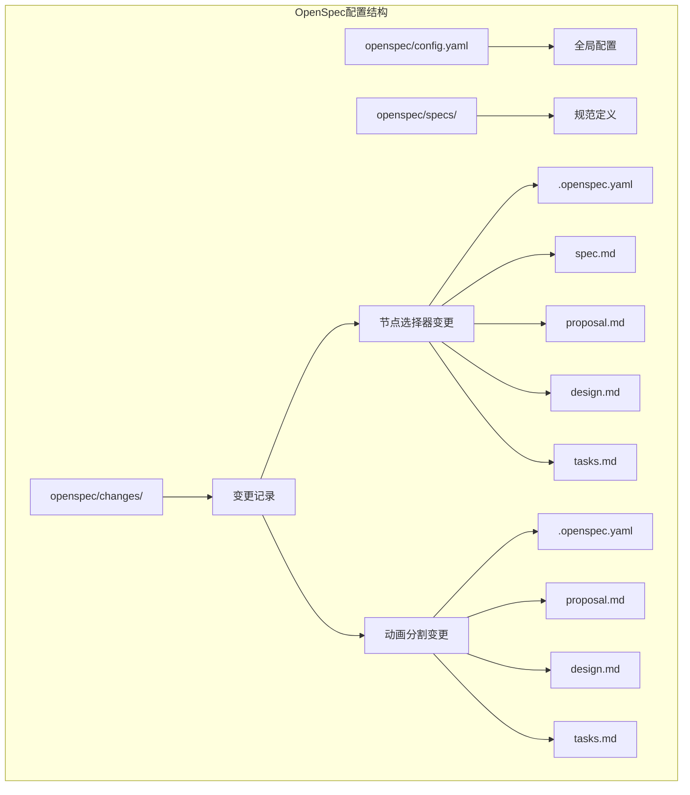
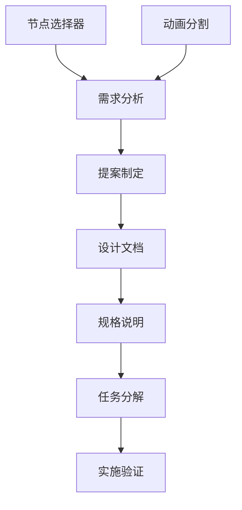
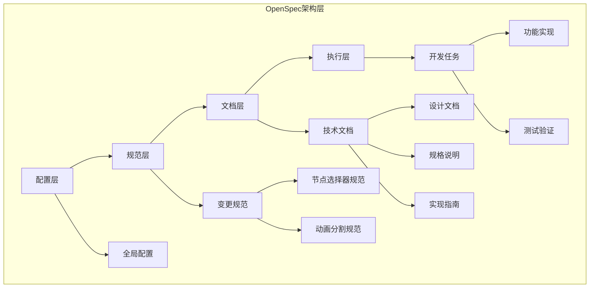
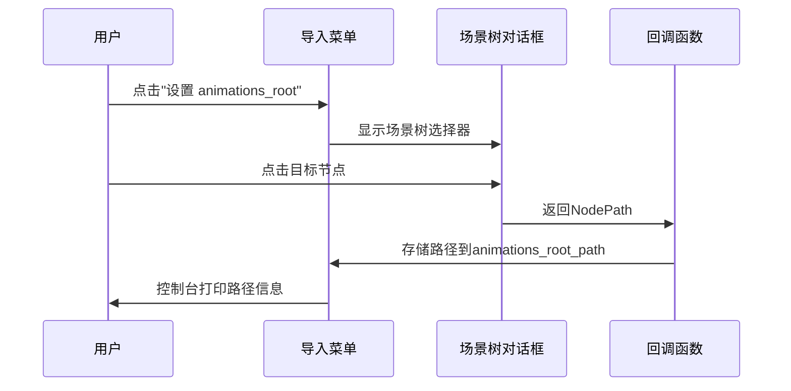
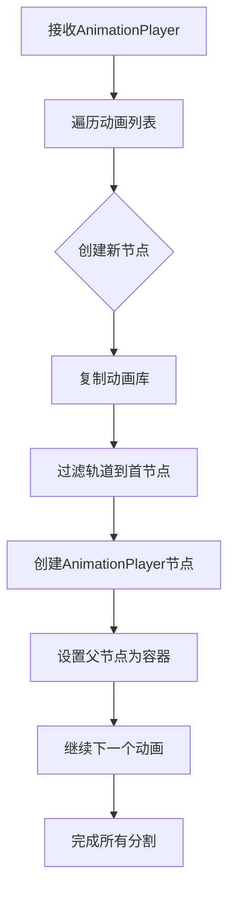
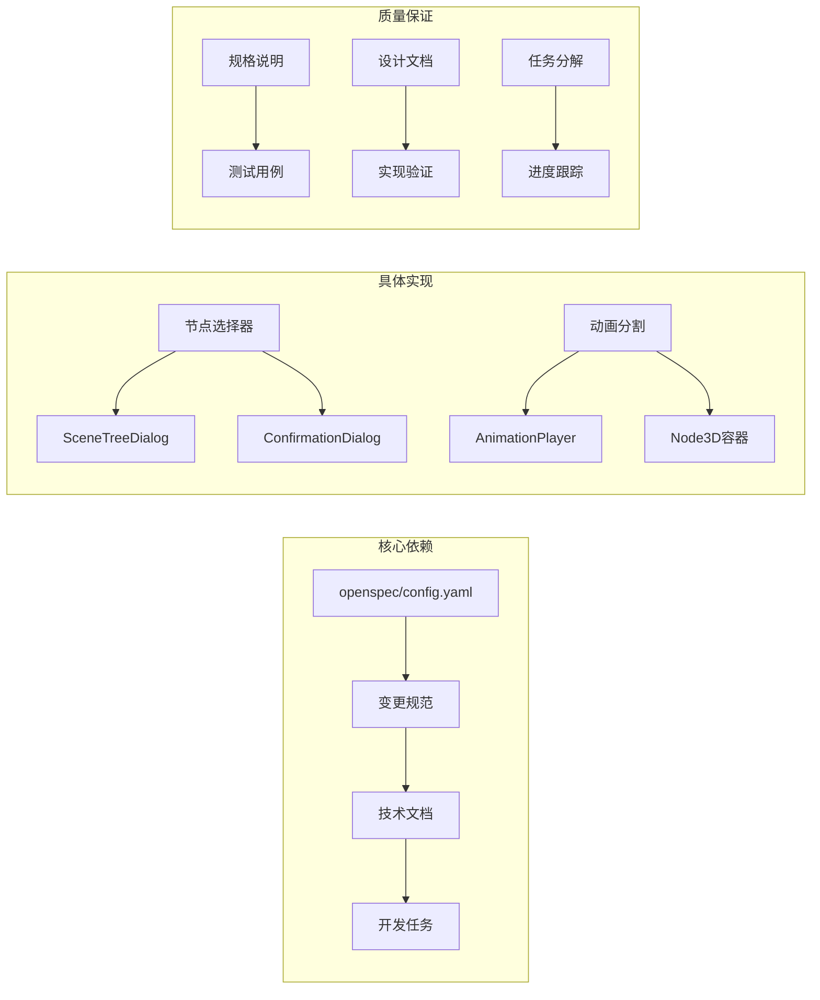
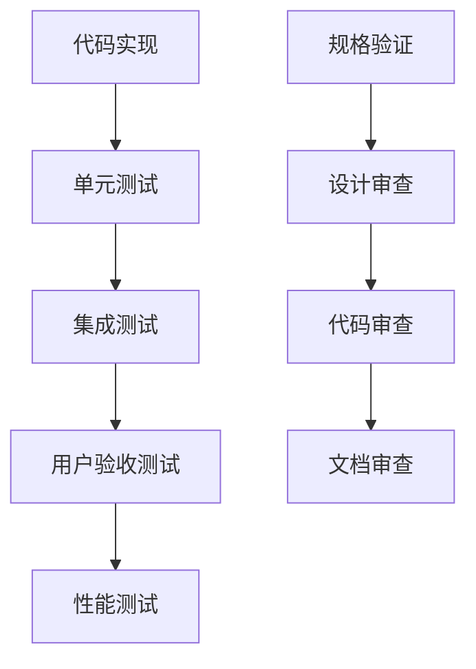

# OpenSpec配置

<cite>
**本文档引用的文件**
- [openspec/config.yaml](file://openspec/config.yaml)
- [.openspec.yaml (节点选择器)](file://openspec/changes/archive/2026-04-18-use-node-picker-for-paths/.openspec.yaml)
- [spec.md (节点选择器)](file://openspec/changes/archive/2026-04-18-use-node-picker-for-paths/spec.md)
- [proposal.md (节点选择器)](file://openspec/changes/archive/2026-04-18-use-node-picker-for-paths/proposal.md)
- [design.md (节点选择器)](file://openspec/changes/archive/2026-04-18-use-node-picker-for-paths/design.md)
- [tasks.md (节点选择器)](file://openspec/changes/archive/2026-04-18-use-node-picker-for-paths/tasks.md)
- [.openspec.yaml (动画分割)](file://openspec/changes/merge-animationcut-into-root/.openspec.yaml)
- [proposal.md (动画分割)](file://openspec/changes/merge-animationcut-into-root/proposal.md)
- [design.md (动画分割)](file://openspec/changes/merge-animationcut-into-root/design.md)
- [tasks.md (动画分割)](file://openspec/changes/merge-animationcut-into-root/tasks.md)
- [README.md](file://README.md)
</cite>

## 目录
1. [简介](#简介)
2. [项目结构](#项目结构)
3. [核心组件](#核心组件)
4. [架构概览](#架构概览)
5. [详细组件分析](#详细组件分析)
6. [依赖关系分析](#依赖关系分析)
7. [性能考虑](#性能考虑)
8. [故障排除指南](#故障排除指南)
9. [结论](#结论)

## 简介

OpenSpec是Godot项目中的规范驱动开发框架，用于管理插件开发流程和文档标准化。本项目展示了如何使用OpenSpec来规范MPM导入器插件的开发过程，包括节点路径选择器和动画分割功能的实现。

该项目基于Godot Engine 4.6开发，是一个Dancing Line游戏模板框架，旨在提供高兼容性和模块化设计。通过OpenSpec配置，开发者可以确保代码质量和开发流程的一致性。

## 项目结构

OpenSpec配置位于项目根目录的`openspec`文件夹中，包含以下关键组件：

**图表来源**
- [openspec/config.yaml:1-21](file://openspec/config.yaml#L1-L21)
- [.openspec.yaml (节点选择器):1-3](file://openspec/changes/archive/2026-04-18-use-node-picker-for-paths/.openspec.yaml#L1-L3)
- [.openspec.yaml (动画分割):1-3](file://openspec/changes/merge-animationcut-into-root/.openspec.yaml#L1-L3)

**章节来源**
- [openspec/config.yaml:1-21](file://openspec/config.yaml#L1-L21)
- [README.md:52-61](file://README.md#L52-L61)

## 核心组件

### 全局配置系统

OpenSpec的全局配置文件定义了项目的基本规范和约束条件：

- **schema**: `spec-driven` - 指定使用规范驱动的开发模式
- **项目上下文**: 可选的项目技术栈和领域知识描述
- **工件规则**: 针对特定工件类型的自定义规则

### 变更管理系统

每个功能变更都通过独立的变更目录进行管理，包含完整的开发文档链：

**图表来源**
- [proposal.md (节点选择器):1-28](file://openspec/changes/archive/2026-04-18-use-node-picker-for-paths/proposal.md#L1-L28)
- [proposal.md (动画分割):1-26](file://openspec/changes/merge-animationcut-into-root/proposal.md#L1-L26)

**章节来源**
- [openspec/config.yaml:12-21](file://openspec/config.yaml#L12-L21)

## 架构概览

OpenSpec架构采用分层设计，确保开发流程的规范化和可追溯性：

**图表来源**
- [design.md (节点选择器):1-60](file://openspec/changes/archive/2026-04-18-use-node-picker-for-paths/design.md#L1-L60)
- [design.md (动画分割):1-41](file://openspec/changes/merge-animationcut-into-root/design.md#L1-L41)

## 详细组件分析

### 节点选择器组件

#### 功能概述
节点选择器组件旨在替换现有的手动节点路径输入方式，提供更直观的用户体验。

#### 规格要求

**图表来源**
- [spec.md (节点选择器):6-25](file://openspec/changes/archive/2026-04-18-use-node-picker-for-paths/spec.md#L6-L25)

#### 技术实现

| 组件 | 功能 | 实现方式 |
|------|------|----------|
| SceneTreeDialog | 场景树节点选择 | 内置Godot编辑器组件 |
| ConfirmationDialog | 确认对话框 | 替代LineEdit输入 |
| _show_node_picker_dialog | 新的对话框方法 | 使用SceneTreeDialog API |
| _set_animations_root | 路径设置回调 | 处理NodePath存储 |

**章节来源**
- [design.md (节点选择器):17-46](file://openspec/changes/archive/2026-04-18-use-node-picker-for-paths/design.md#L17-L46)
- [tasks.md (节点选择器):1-12](file://openspec/changes/archive/2026-04-18-use-node-picker-for-paths/tasks.md#L1-L12)

### 动画分割组件

#### 功能概述
动画分割组件将单个AnimationPlayer中的多个动画分割成独立的AnimationPlayer节点。

#### 核心算法

**图表来源**
- [design.md (动画分割):28-35](file://openspec/changes/merge-animationcut-into-root/design.md#L28-L35)

#### 实现细节

| 组件 | 功能 | 实现方式 |
|------|------|----------|
| @export_tool_button | 分割动画按钮 | 编辑器工具栏按钮 |
| _split_animations | 主要分割方法 | 复制animationcut.gd逻辑 |
| _filter_animation_to_first_node | 轨道过滤方法 | 保持首节点轨道 |
| 新Node3D容器 | 结果组织节点 | 作为分割结果父节点 |

**章节来源**
- [proposal.md (动画分割):5-11](file://openspec/changes/merge-animationcut-into-root/proposal.md#L5-L11)
- [tasks.md (动画分割):1-12](file://openspec/changes/merge-animationcut-into-root/tasks.md#L1-L12)

## 依赖关系分析

OpenSpec配置建立了严格的依赖关系网络：

**图表来源**
- [spec.md (节点选择器):1-25](file://openspec/changes/archive/2026-04-18-use-node-picker-for-paths/spec.md#L1-L25)
- [proposal.md (动画分割):1-26](file://openspec/changes/merge-animationcut-into-root/proposal.md#L1-L26)

**章节来源**
- [design.md (节点选择器):51-60](file://openspec/changes/archive/2026-04-18-use-node-picker-for-paths/design.md#L51-L60)
- [design.md (动画分割):37-41](file://openspec/changes/merge-animationcut-into-root/design.md#L37-L41)

## 性能考虑

OpenSpec配置在性能方面的考虑主要体现在：

### 代码复用优化
- 通过将animationcut.gd的功能集成到AnimatorPlayerImportRoot.gd，避免了重复代码实现
- 使用SceneTreeDialog替代自定义UI组件，减少内存占用和渲染开销

### 用户体验优化
- 场景树选择器提供实时搜索和过滤功能，提升大场景下的选择效率
- 直接的节点点击操作减少了用户输入错误和路径解析时间

### 开发效率优化
- 标准化的文档模板确保开发流程的一致性
- 任务分解机制便于并行开发和进度跟踪

## 故障排除指南

### 常见问题及解决方案

| 问题类型 | 症状 | 解决方案 |
|----------|------|----------|
| 节点选择失败 | SceneTreeDialog无法弹出 | 检查Godot版本兼容性和编辑器接口权限 |
| 动画分割异常 | 分割后的AnimationPlayer为空 | 验证animations_root指向正确的AnimationPlayer节点 |
| 路径设置错误 | NodePath存储失败 | 确认节点存在且路径格式正确 |
| 性能问题 | 大场景下选择缓慢 | 使用SceneTreeDialog的搜索功能快速定位节点 |

### 质量保证措施

**章节来源**
- [tasks.md (节点选择器):6-12](file://openspec/changes/archive/2026-04-18-use-node-picker-for-paths/tasks.md#L6-L12)
- [tasks.md (动画分割):7-12](file://openspec/changes/merge-animationcut-into-root/tasks.md#L7-L12)

## 结论

OpenSpec配置为Godot项目提供了一个完整的规范驱动开发框架。通过节点选择器和动画分割两个核心功能的实现，展示了如何使用OpenSpec来：

1. **标准化开发流程**: 通过统一的文档模板和规范要求，确保开发质量的一致性
2. **提升用户体验**: 从用户角度出发，优化交互方式和操作流程
3. **保证代码质量**: 通过严格的测试验证和质量保证措施，确保功能的可靠性
4. **促进团队协作**: 标准化的文档和流程便于团队成员之间的沟通和协作

这种配置方式不仅适用于当前的MPM导入器插件开发，也可以推广到其他Godot项目的开发中，为类似的功能模块提供标准化的开发指导。