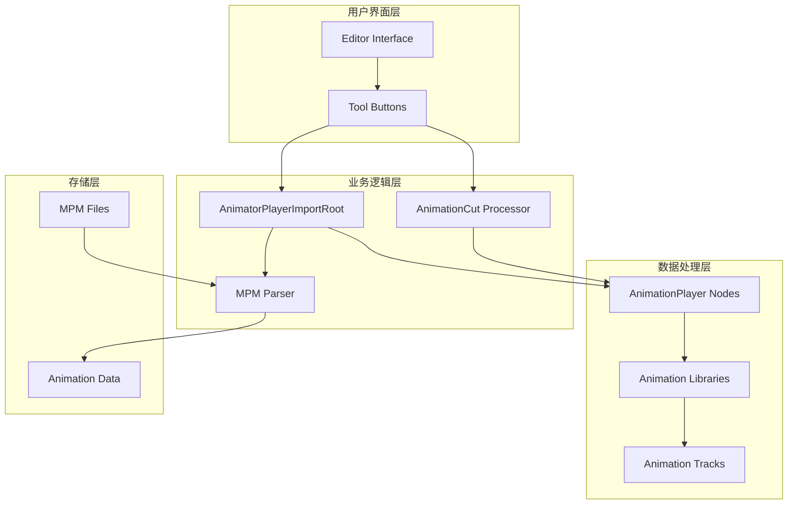
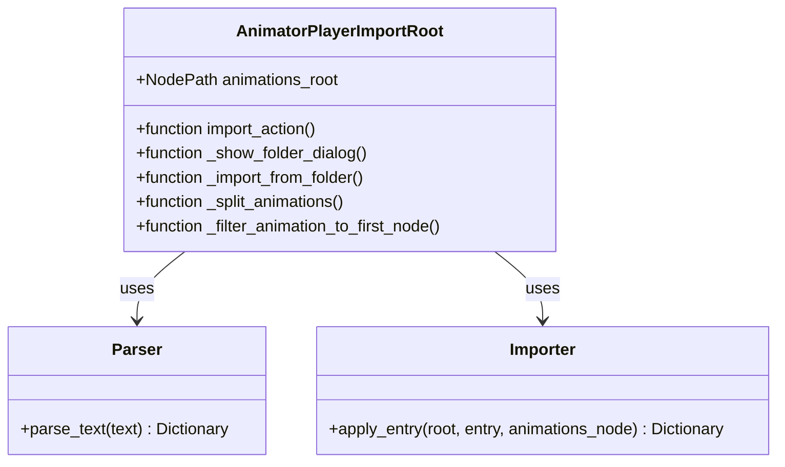
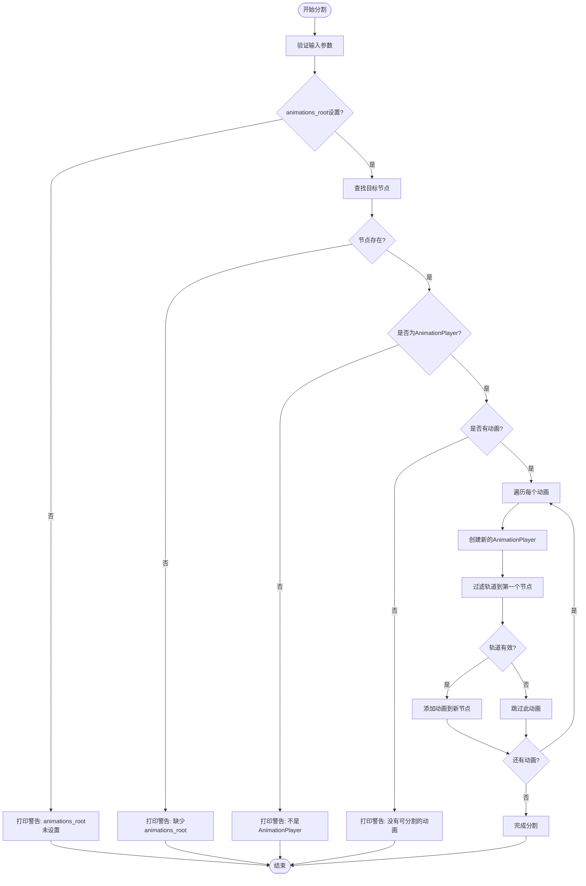
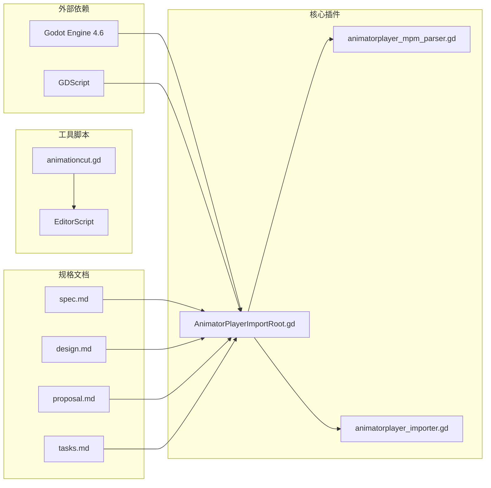

# 动画分割合并变更

<cite>
**本文档引用的文件**
- [AnimatorPlayerImportRoot.gd](file://addons/mpm_importer/AnimatorPlayerImportRoot.gd)
- [animationcut.gd](file://#Template/[Scripts]/PortTookits/animationcut.gd)
- [spec.md](file://openspec/changes/merge-animationcut-into-root/specs/animation-split/spec.md)
- [design.md](file://openspec/changes/merge-animationcut-into-root/design.md)
- [proposal.md](file://openspec/changes/merge-animationcut-into-root/proposal.md)
- [tasks.md](file://openspec/changes/merge-animationcut-into-root/tasks.md)
- [plugin.cfg](file://addons/mpm_importer/plugin.cfg)
- [README.md](file://README.md)
</cite>

## 目录
1. [简介](#简介)
2. [项目结构](#项目结构)
3. [核心组件](#核心组件)
4. [架构概览](#架构概览)
5. [详细组件分析](#详细组件分析)
6. [依赖关系分析](#依赖关系分析)
7. [性能考虑](#性能考虑)
8. [故障排除指南](#故障排除指南)
9. [结论](#结论)

## 简介

这是一个关于Godot引擎中动画分割合并变更的项目文档。该项目涉及将独立的动画分割工具与现有的MPM导入器插件进行整合，实现更高效的动画处理工作流程。

项目的核心目标是将原本独立的`animationcut.gd`脚本功能集成到`AnimatorPlayerImportRoot.gd`中，通过添加一个工具按钮来实现动画分割功能。这一变更使得用户可以在导入MPM文件后直接进行动画分割操作，无需切换不同的工具。

## 项目结构

项目采用模块化设计，主要包含以下关键部分：

```mermaid
graph TB
subgraph "插件系统"
A[addons/mpm_importer/] --> B[AnimatorPlayerImportRoot.gd]
A --> C[animatorplayer_mpm_parser.gd]
A --> D[animatorplayer_importer.gd]
A --> E[plugin.cfg]
end
subgraph "模板系统"
F[#Template/[Scripts]/PortTookits/] --> G[animationcut.gd]
F --> H[Editor/]
F --> I[addcol.gd]
F --> J[animfix.gd]
end
subgraph "规格文档"
K[openspec/changes/] --> L[merge-animationcut-into-root/]
L --> M[specs/]
L --> N[design.md]
L --> O[proposal.md]
L --> P[tasks.md]
end
B --> G
M --> Q[spec.md]
```

**图表来源**
- [AnimatorPlayerImportRoot.gd:1-83](file://addons/mpm_importer/AnimatorPlayerImportRoot.gd#L1-L83)
- [animationcut.gd:1-64](file://#Template/[Scripts]/PortTookits/animationcut.gd#L1-L64)
- [plugin.cfg:1-8](file://addons/mpm_importer/plugin.cfg#L1-L8)

**章节来源**
- [README.md:52-61](file://README.md#L52-L61)
- [plugin.cfg:1-8](file://addons/mpm_importer/plugin.cfg#L1-L8)

## 核心组件

### MPM导入器插件

MPM导入器插件是整个系统的核心组件，负责处理来自Unity的MPM文件导入。该插件提供了完整的动画导入功能，并计划集成动画分割功能。

**主要特性：**
- 支持批量导入MPM文件
- 自动解析动画数据
- 与AnimationPlayer节点集成
- 错误处理和状态报告

### 动画分割工具

独立的动画分割工具位于模板系统的PortTookits目录中，提供将单个AnimationPlayer中的多个动画分割为独立AnimationPlayer节点的功能。

**核心功能：**
- 将多动画AnimationPlayer分割为单动画AnimationPlayer
- 过滤动画轨道以保留第一个节点的动画
- 保持原始动画数据完整性
- 自动生成分割后的节点

**章节来源**
- [AnimatorPlayerImportRoot.gd:1-83](file://addons/mpm_importer/AnimatorPlayerImportRoot.gd#L1-L83)
- [animationcut.gd:1-64](file://#Template/[Scripts]/PortTookits/animationcut.gd#L1-L64)

## 架构概览

系统采用分层架构设计，将导入功能和编辑功能分离，同时保持功能间的协同工作。



**图表来源**
- [AnimatorPlayerImportRoot.gd:9-12](file://addons/mpm_importer/AnimatorPlayerImportRoot.gd#L9-L12)
- [animationcut.gd:4-46](file://#Template/[Scripts]/PortTookits/animationcut.gd#L4-L46)

## 详细组件分析

### AnimatorPlayerImportRoot 组件

该组件是MPM导入器的核心，负责处理动画导入和即将集成的动画分割功能。

#### 类结构分析



**图表来源**
- [AnimatorPlayerImportRoot.gd:1-83](file://addons/mpm_importer/AnimatorPlayerImportRoot.gd#L1-L83)

#### 关键方法分析

**import_action方法：**
- 实现工具按钮点击事件处理
- 调用文件对话框显示导入界面
- 触发文件夹导入流程

**_split_animations方法：**
- 计划实现的动画分割核心逻辑
- 处理动画分割的各种边界情况
- 管理新创建的AnimationPlayer节点

**章节来源**
- [AnimatorPlayerImportRoot.gd:9-12](file://addons/mpm_importer/AnimatorPlayerImportRoot.gd#L9-L12)
- [AnimatorPlayerImportRoot.gd:30-83](file://addons/mpm_importer/AnimatorPlayerImportRoot.gd#L30-L83)

### 动画分割算法

动画分割功能的核心算法负责将单个AnimationPlayer中的多个动画分离为独立的AnimationPlayer节点。

#### 分割流程图



**图表来源**
- [animationcut.gd:15-46](file://#Template/[Scripts]/PortTookits/animationcut.gd#L15-L46)
- [spec.md:7-42](file://openspec/changes/merge-animationcut-into-root/specs/animation-split/spec.md#L7-L42)

#### 轨道过滤算法

轨道过滤是动画分割的关键步骤，确保每个新创建的AnimationPlayer只包含与第一个节点相关的动画轨道。

**过滤流程：**
1. 获取第一个轨道的节点路径
2. 遍历所有轨道，识别属于其他节点的轨道
3. 从后向前删除非目标轨道，避免索引问题
4. 保持目标轨道的完整性

**章节来源**
- [animationcut.gd:49-64](file://#Template/[Scripts]/PortTookits/animationcut.gd#L49-L64)

### 规格需求分析

根据规格文档，动画分割功能需要满足以下需求：

#### 成功分割场景
- 用户点击"分割动画"工具按钮
- animations_root指向有效的AnimationPlayer节点
- 为目标AnimationPlayer中的每个动画创建独立的AnimationPlayer
- 每个新AnimationPlayer仅包含对应动画且轨道过滤到第一个节点
- 新节点按动画名称命名并打印创建摘要

#### 边界情况处理
- animations_root未设置：打印警告并返回
- animations_root节点不存在：打印具体缺失路径并返回
- animations_root不是AnimationPlayer：打印类型警告并返回
- 源AnimationPlayer无动画：打印无动画警告并返回
- 过滤后动画无有效轨道：跳过该动画并打印警告

**章节来源**
- [spec.md:1-43](file://openspec/changes/merge-animationcut-into-root/specs/animation-split/spec.md#L1-L43)

## 依赖关系分析

系统各组件之间的依赖关系体现了清晰的职责分离和模块化设计。



**图表来源**
- [AnimatorPlayerImportRoot.gd:4-5](file://addons/mpm_importer/AnimatorPlayerImportRoot.gd#L4-L5)
- [animationcut.gd:1-2](file://#Template/[Scripts]/PortTookits/animationcut.gd#L1-L2)

### 内部依赖关系

组件间的内部依赖关系展示了数据流向和控制流程：

**数据流分析：**
1. 用户交互触发工具按钮事件
2. 导入器解析MPM文件内容
3. 解析结果传递给导入器应用
4. AnimationPlayer节点接收动画数据
5. 动画分割功能处理独立节点

**控制流分析：**
- 错误处理优先于正常流程
- 参数验证贯穿整个处理链
- 边界情况通过条件判断处理
- 正常流程通过函数调用执行

**章节来源**
- [AnimatorPlayerImportRoot.gd:30-83](file://addons/mpm_importer/AnimatorPlayerImportRoot.gd#L30-L83)
- [animationcut.gd:4-46](file://#Template/[Scripts]/PortTookits/animationcut.gd#L4-L46)

## 性能考虑

动画分割操作涉及大量数据处理，需要考虑性能优化策略：

### 时间复杂度分析
- 动画分割操作：O(n × m)，其中n为动画数量，m为平均轨道数量
- 轨道过滤操作：O(m)，其中m为轨道总数
- 整体复杂度：O(n × m)

### 内存使用优化
- 使用对象复用减少内存分配
- 及时清理临时对象引用
- 批量操作减少重复计算

### 并行处理可能性
- 不同动画的分割可以并行处理
- 轨道过滤操作相对独立
- 需要避免并发修改同一AnimationPlayer

## 故障排除指南

### 常见问题及解决方案

**问题1：animations_root未设置**
- 症状：点击工具按钮无响应
- 解决方案：在插件属性面板中正确设置animations_root路径

**问题2：找不到目标节点**
- 症状：出现"Missing animations_root"警告
- 解决方案：检查节点路径是否正确，确认节点存在于场景树中

**问题3：节点类型不匹配**
- 症状：出现"animations_root is not an AnimationPlayer"警告
- 解决方案：确保animations_root指向AnimationPlayer节点而非其他类型

**问题4：无可用动画**
- 症状：出现"No animations to split"警告
- 解决方案：确认目标AnimationPlayer包含至少一个动画

**问题5：轨道过滤失败**
- 症状：某些动画被跳过
- 解决方案：检查动画轨道配置，确保至少有一个有效轨道

### 调试技巧

**日志记录：**
- 使用print语句输出关键信息
- 记录操作前后的节点状态
- 跟踪异常情况的具体原因

**测试策略：**
- 单元测试验证核心算法
- 集成测试验证完整流程
- 回归测试确保功能稳定性

**章节来源**
- [spec.md:15-42](file://openspec/changes/merge-animationcut-into-root/specs/animation-split/spec.md#L15-L42)
- [AnimatorPlayerImportRoot.gd:36-42](file://addons/mpm_importer/AnimatorPlayerImportRoot.gd#L36-L42)

## 结论

动画分割合并变更为Godot项目带来了显著的功能增强和用户体验改善。通过将独立的动画分割工具集成到MPM导入器中，用户可以实现更流畅的工作流程，无需在不同工具间切换。

### 主要成果

1. **功能整合**：将animationcut.gd的功能完全集成到AnimatorPlayerImportRoot中
2. **用户体验提升**：提供统一的工具界面，简化操作流程
3. **代码复用**：充分利用现有animationcut.gd的实现逻辑
4. **维护便利**：减少工具数量，便于后续维护和更新

### 技术优势

- **模块化设计**：清晰的职责分离和接口定义
- **错误处理完善**：全面的边界情况处理机制
- **性能优化**：高效的算法实现和内存管理
- **可扩展性**：为未来功能扩展预留接口

### 未来发展

该变更奠定了进一步开发的基础，未来可以考虑：
- 添加更多动画处理工具
- 优化用户界面交互
- 增强错误恢复能力
- 扩展支持更多动画格式