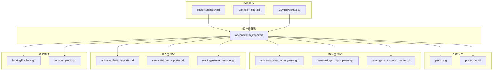
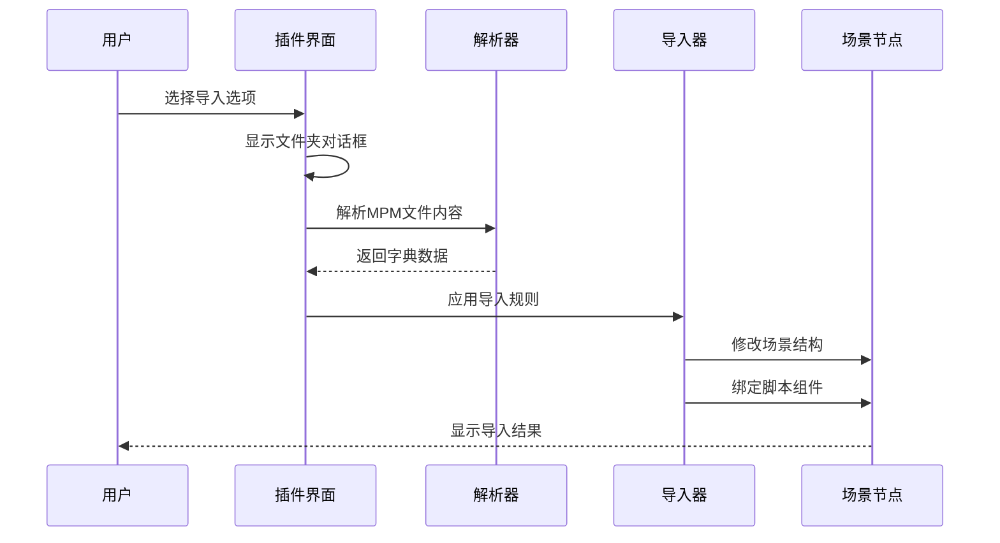
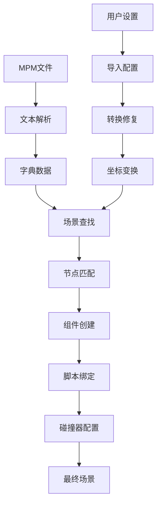
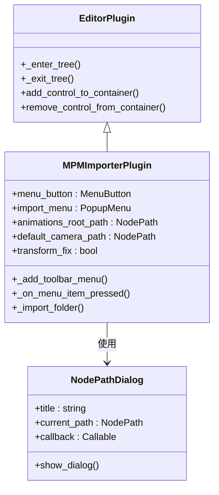
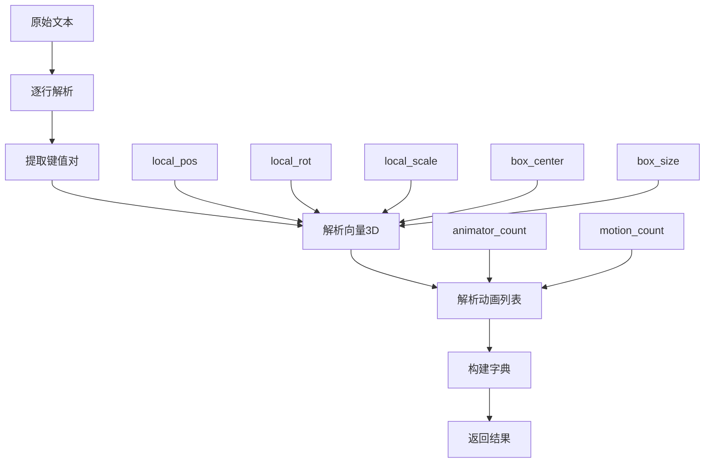
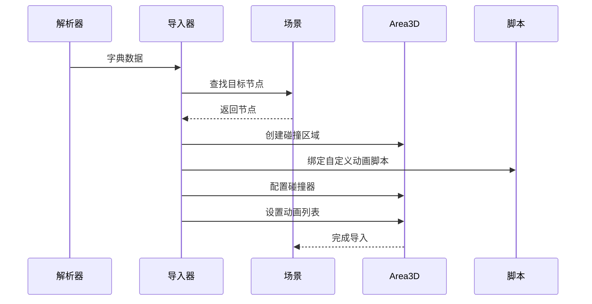
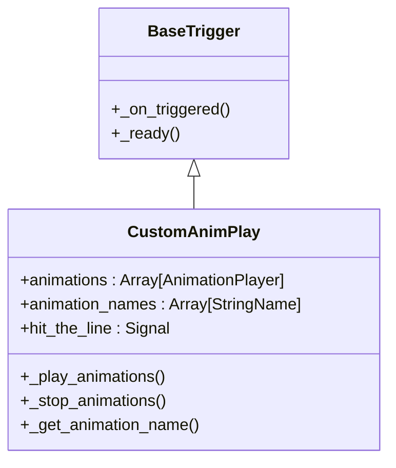
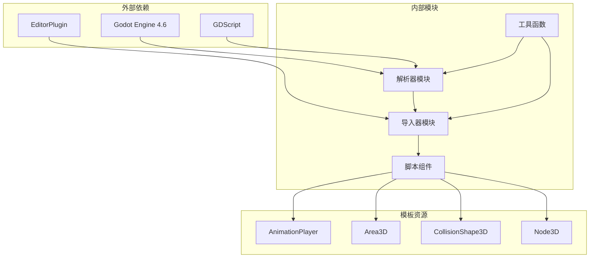

# 动画播放器导入器

<cite>
**本文档引用的文件**
- [plugin.cfg](file://addons/mpm_importer/plugin.cfg)
- [importer_plugin.gd](file://addons/mpm_importer/importer_plugin.gd)
- [animatorplayer_importer.gd](file://addons/mpm_importer/animatorplayer_importer.gd)
- [cameratrigger_importer.gd](file://addons/mpm_importer/cameratrigger_importer.gd)
- [movingposmax_importer.gd](file://addons/mpm_importer/movingposmax_importer.gd)
- [animatorplayer_mpm_parser.gd](file://addons/mpm_importer/animatorplayer_mpm_parser.gd)
- [cameratrigger_mpm_parser.gd](file://addons/mpm_importer/cameratrigger_mpm_parser.gd)
- [movingposmax_mpm_parser.gd](file://addons/mpm_importer/movingposmax_mpm_parser.gd)
- [MovingPosPoint.gd](file://addons/mpm_importer/MovingPosPoint.gd)
- [customanimplay.gd](file://#Template/[Scripts]/Trigger/customanimplay.gd)
- [CameraTrigger.gd](file://#Template/[Scripts]/CameraScripts/CameraTrigger.gd)
- [MovingPosMax.gd](file://#Template/[Scripts]/Animator/MovingPosMax.gd)
- [project.godot](file://project.godot)
- [README.md](file://README.md)
</cite>

## 目录
1. [简介](#简介)
2. [项目结构](#项目结构)
3. [核心组件](#核心组件)
4. [架构概览](#架构概览)
5. [详细组件分析](#详细组件分析)
6. [依赖关系分析](#依赖关系分析)
7. [性能考虑](#性能考虑)
8. [故障排除指南](#故障排除指南)
9. [结论](#结论)

## 简介

动画播放器导入器是一个专为Godot引擎设计的插件，用于从Unity项目中导入MPM（Multi-Property Module）文件。该插件支持三种主要类型的组件导入：

- **AnimatorPlayer**：导入Unity中的Animator组件，创建对应的AnimationPlayer动画播放器
- **CameraTrigger**：导入Unity中的CameraTrigger相机触发器，实现动态相机效果
- **MovingPosMax**：导入Unity中的MovingPosMax移动路径组件，创建序列位置移动触发器

该插件通过解析MPM文件格式，将Unity中的动画和触发器配置转换为Godot可用的场景结构和脚本组件。

## 项目结构

**图表来源**
- [plugin.cfg:1-8](file://addons/mpm_importer/plugin.cfg#L1-L8)
- [importer_plugin.gd:1-218](file://addons/mpm_importer/importer_plugin.gd#L1-L218)

**章节来源**
- [plugin.cfg:1-8](file://addons/mpm_importer/plugin.cfg#L1-L8)
- [project.godot:29-31](file://project.godot#L29-L31)

## 核心组件

### 插件入口点

插件的核心入口是`importer_plugin.gd`文件，它继承自`EditorPlugin`类，负责：

- 创建工具栏菜单按钮
- 管理导入对话框
- 处理用户交互事件
- 协调各个导入器的工作

### 解析器组件

三个专门的解析器负责将MPM文本格式转换为字典数据结构：

- **AnimatorPlayer解析器**：解析动画播放器相关的属性和配置
- **CameraTrigger解析器**：解析相机触发器的参数和行为设置
- **MovingPosMax解析器**：解析移动路径点序列和动画对象信息

### 导入器组件

对应的导入器将解析后的数据应用到Godot场景中：

- **AnimatorPlayer导入器**：创建Area3D区域，设置碰撞器，绑定AnimationPlayer
- **CameraTrigger导入器**：创建相机控制脚本，配置相机参数
- **MovingPosMax导入器**：创建路径点序列，设置移动动画

**章节来源**
- [importer_plugin.gd:19-25](file://addons/mpm_importer/importer_plugin.gd#L19-L25)
- [animatorplayer_mpm_parser.gd:4-46](file://addons/mpm_importer/animatorplayer_mpm_parser.gd#L4-L46)
- [animatorplayer_importer.gd:6-42](file://addons/mpm_importer/animatorplayer_importer.gd#L6-L42)

## 架构概览

**图表来源**
- [importer_plugin.gd:153-212](file://addons/mpm_importer/importer_plugin.gd#L153-L212)
- [animatorplayer_mpm_parser.gd:4-46](file://addons/mpm_importer/animatorplayer_mpm_parser.gd#L4-L46)
- [animatorplayer_importer.gd:6-42](file://addons/mpm_importer/animatorplayer_importer.gd#L6-L42)

### 数据流架构

**图表来源**
- [animatorplayer_mpm_parser.gd:19-46](file://addons/mpm_importer/animatorplayer_mpm_parser.gd#L19-L46)
- [animatorplayer_importer.gd:17-42](file://addons/mpm_importer/animatorplayer_importer.gd#L17-L42)

## 详细组件分析

### 插件管理器分析

插件管理器是整个系统的核心协调者，负责以下关键功能：

#### 菜单系统
- 创建工具栏菜单按钮
- 添加导入选项（AnimatorPlayer、CameraTrigger、MovingPosMax）
- 提供设置功能（animations_root、default_camera、坐标转换修复）

#### 文件处理流程
- 显示文件夹选择对话框
- 批量处理MPM文件
- 错误处理和状态报告

**图表来源**
- [importer_plugin.gd:1-218](file://addons/mpm_importer/importer_plugin.gd#L1-L218)

**章节来源**
- [importer_plugin.gd:27-67](file://addons/mpm_importer/importer_plugin.gd#L27-L67)

### 解析器组件分析

#### AnimatorPlayer解析器
负责解析Unity中Animator组件的配置信息：

**图表来源**
- [animatorplayer_mpm_parser.gd:4-46](file://addons/mpm_importer/animatorplayer_mpm_parser.gd#L4-L46)

#### CameraTrigger解析器
解析相机触发器的复杂参数配置：

- 基础变换参数（位置、旋转、缩放）
- 相机控制参数（位置偏移、旋转、距离）
- 时间控制参数（持续时间、触发时间）
- 缓动类型映射

**章节来源**
- [cameratrigger_mpm_parser.gd:4-42](file://addons/mpm_importer/cameratrigger_mpm_parser.gd#L4-L42)

#### MovingPosMax解析器
处理移动路径点序列：

- 路径点坐标数据
- 移动持续时间
- 等待时间配置
- 缓动类型映射

**章节来源**
- [movingposmax_mpm_parser.gd:4-44](file://addons/mpm_importer/movingposmax_mpm_parser.gd#L4-L44)

### 导入器组件分析

#### AnimatorPlayer导入器
将解析的数据应用到场景中：

**图表来源**
- [animatorplayer_importer.gd:6-42](file://addons/mpm_importer/animatorplayer_importer.gd#L6-L42)

#### CameraTrigger导入器
实现动态相机控制系统：

- 相机跟随逻辑
- 旋转模式控制
- 缓动动画配置
- 时间同步机制

**章节来源**
- [cameratrigger_importer.gd:6-42](file://addons/mpm_importer/cameratrigger_importer.gd#L6-L42)

#### MovingPosMax导入器
创建序列位置移动系统：

- 路径点序列管理
- 移动时间配置
- 等待时间处理
- 缓动类型映射

**章节来源**
- [movingposmax_importer.gd:7-39](file://addons/mpm_importer/movingposmax_importer.gd#L7-L39)

### 脚本组件分析

#### CustomAnimPlay脚本
实现了AnimatorPlayer导入后的动画播放逻辑：

**图表来源**
- [customanimplay.gd:1-67](file://#Template/[Scripts]/Trigger/customanimplay.gd#L1-L67)

#### CameraTrigger脚本
实现了相机触发器的核心功能：

- 相机跟随控制
- 旋转模式切换
- 缓动动画实现
- 时间同步机制

**章节来源**
- [CameraTrigger.gd:1-109](file://#Template/[Scripts]/CameraScripts/CameraTrigger.gd#L1-L109)

#### MovingPosMax脚本
实现了移动路径点序列播放：

- 路径点序列管理
- 移动动画播放
- 等待时间处理
- 缓动类型支持

**章节来源**
- [MovingPosMax.gd:1-107](file://#Template/[Scripts]/Animator/MovingPosMax.gd#L1-L107)

## 依赖关系分析

**图表来源**
- [importer_plugin.gd:6-11](file://addons/mpm_importer/importer_plugin.gd#L6-L11)
- [animatorplayer_importer.gd:4-5](file://addons/mpm_importer/animatorplayer_importer.gd#L4-L5)

### 模块间耦合度分析

| 模块 | 内聚性 | 耦合度 | 说明 |
|------|--------|--------|------|
| 解析器模块 | 高 | 低 | 专注于数据解析，独立性强 |
| 导入器模块 | 中等 | 中等 | 需要解析器输出，但相对独立 |
| 脚本组件 | 高 | 低 | 与模板系统紧密集成 |
| 工具函数 | 中等 | 高 | 被多个模块共享 |

**章节来源**
- [animatorplayer_mpm_parser.gd:1-57](file://addons/mpm_importer/animatorplayer_mpm_parser.gd#L1-L57)
- [animatorplayer_importer.gd:1-272](file://addons/mpm_importer/animatorplayer_importer.gd#L1-L272)

## 性能考虑

### 内存使用优化
- **延迟加载**：脚本资源使用`preload`进行延迟加载
- **对象池**：避免频繁创建和销毁临时对象
- **缓存机制**：缓存解析后的字典数据以减少重复解析

### 处理效率优化
- **批量处理**：支持一次性处理多个MPM文件
- **异步操作**：使用`call_deferred`避免阻塞主线程
- **错误恢复**：单个文件失败不影响整体处理流程

### 内存泄漏防护
- **资源清理**：确保所有创建的节点和资源正确释放
- **循环引用**：避免脚本间的循环引用
- **信号连接**：正确管理信号连接和断开

## 故障排除指南

### 常见问题及解决方案

#### 节点路径解析失败
**症状**：导入时报错"缺少节点"
**原因**：
- animations_root路径未设置
- 目标节点不存在
- 节点名称不匹配

**解决方法**：
1. 检查`animations_root`设置
2. 验证目标节点存在性
3. 使用模糊匹配功能

#### 动画播放器缺失
**症状**：导入成功但动画不播放
**原因**：
- AnimationPlayer节点缺失
- 动画名称不匹配
- 脚本绑定失败

**解决方法**：
1. 确认AnimationPlayer节点存在
2. 检查动画名称配置
3. 重新绑定脚本

#### 相机控制异常
**症状**：相机移动不符合预期
**原因**：
- 坐标转换问题
- 相机跟随设置错误
- 缓动类型配置不当

**解决方法**：
1. 启用坐标转换修复
2. 检查相机跟随设置
3. 调整缓动参数

**章节来源**
- [importer_plugin.gd:70-75](file://addons/mpm_importer/importer_plugin.gd#L70-L75)
- [animatorplayer_importer.gd:12-25](file://addons/mpm_importer/animatorplayer_importer.gd#L12-L25)

### 调试技巧

#### 日志记录
插件会在控制台输出详细的处理信息：
- 导入结果统计
- 错误消息详情
- 节点匹配过程

#### 调试模式
- **编辑器预览**：支持在编辑器中预览动画效果
- **实时调试**：查看节点属性变化
- **错误定位**：精确显示失败的文件和行号

## 结论

动画播放器导入器是一个功能完整、架构清晰的Godot插件系统。它成功地解决了从Unity到Godot的动画和触发器数据迁移问题，具有以下特点：

### 技术优势
- **模块化设计**：解析器、导入器、脚本组件职责明确
- **扩展性强**：支持新的组件类型轻松扩展
- **容错能力**：完善的错误处理和恢复机制
- **性能优化**：高效的批量处理和内存管理

### 应用价值
- **提高效率**：大幅减少手动配置工作量
- **保证质量**：标准化的数据转换流程
- **降低风险**：避免手工配置可能产生的错误
- **促进迁移**：简化从Unity到Godot的项目迁移

### 发展前景
该插件为Godot游戏开发提供了重要的工具支持，特别是在需要处理大量Unity导出数据的场景中。通过持续的功能增强和性能优化，它将成为Godot生态系统的有价值组件。