# MPM导入器插件

<cite>
**本文档引用的文件**
- [plugin.cfg](file://addons/mpm_importer/plugin.cfg)
- [importer_plugin.gd](file://addons/mpm_importer/importer_plugin.gd)
- [animatorplayer_mpm_parser.gd](file://addons/mpm_importer/animatorplayer_mpm_parser.gd)
- [animatorplayer_importer.gd](file://addons/mpm_importer/animatorplayer_importer.gd)
- [cameratrigger_mpm_parser.gd](file://addons/mpm_importer/cameratrigger_mpm_parser.gd)
- [cameratrigger_importer.gd](file://addons/mpm_importer/cameratrigger_importer.gd)
- [movingposmax_mpm_parser.gd](file://addons/mpm_importer/movingposmax_mpm_parser.gd)
- [movingposmax_importer.gd](file://addons/mpm_importer/movingposmax_importer.gd)
- [MovingPosPoint.gd](file://addons/mpm_importer/MovingPosPoint.gd)
- [AnimatorPlayerImportRoot.gd](file://addons/mpm_importer/AnimatorPlayerImportRoot.gd)
- [CameraTriggerImportRoot.gd](file://addons/mpm_importer/CameraTriggerImportRoot.gd)
- [MovingPosMaxImportRoot.gd](file://addons/mpm_importer/MovingPosMaxImportRoot.gd)
- [AnimatorPlayerExport.cs](file://#Template/[Scripts]/PortTookits/Editor/AnimatorPlayerExport.cs)
- [CameraTriggerExport.cs](file://#Template/[Scripts]/PortTookits/Editor/CameraTriggerExport.cs)
- [MovingPosMaxExport.cs](file://#Template/[Scripts]/PortTookits/Editor/MovingPosMaxExport.cs)
- [customanimplay.gd](file://#Template/[Scripts]/Trigger/customanimplay.gd)
- [CameraTrigger.gd](file://#Template/[Scripts]/CameraScripts/CameraTrigger.gd)
- [MovingPosMax.gd](file://#Template/[Scripts]/Animator/MovingPosMax.gd)
- [README.md](file://README.md)
</cite>

## 更新摘要
**所做更改**
- 新增Unity到Godot资产迁移功能章节
- 添加导出器工具介绍和使用说明
- 更新项目结构图以包含导出器组件
- 新增资产迁移工作流程说明
- 更新依赖关系分析以反映双向迁移能力

## 目录
1. [简介](#简介)
2. [项目结构](#项目结构)
3. [核心组件](#核心组件)
4. [架构概览](#架构概览)
5. [详细组件分析](#详细组件分析)
6. [Unity到Godot资产迁移功能](#unity到godot资产迁移功能)
7. [依赖关系分析](#依赖关系分析)
8. [性能考虑](#性能考虑)
9. [故障排除指南](#故障排除指南)
10. [结论](#结论)

## 简介

MPM导入器插件是一个专为Godot引擎设计的Unity MPM文件导入工具，支持将Unity项目中的AnimatorPlayer、CameraTrigger和MovingPosMax组件从MPM格式导入到Godot场景中。该插件提供了完整的编辑器集成，包括工具栏菜单、文件对话框和批量导入功能。

**重要更新**：插件现已支持完整的Unity到Godot资产迁移功能，包括从Unity导出MPM文件和在Godot中导入这些文件的双向迁移能力。

插件的核心功能包括：
- 将Unity的MPM配置文件转换为Godot的Area3D触发器
- 自动创建相应的碰撞体和动画组件
- 支持坐标转换修复以适配不同坐标系
- 提供模糊匹配机制处理节点查找问题
- 批量导入多个MPM文件
- **新增**：从Unity场景导出MPM文件的功能
- **新增**：完整的资产迁移工作流程支持

## 项目结构

```mermaid
graph TB
subgraph "插件根目录"
A[addons/mpm_importer/]
end
subgraph "配置文件"
B[plugin.cfg]
end
subgraph "主插件入口"
C[importer_plugin.gd]
end
subgraph "解析器模块"
D[animatorplayer_mpm_parser.gd]
E[cameratrigger_mpm_parser.gd]
F[movingposmax_mpm_parser.gd]
end
subgraph "导入器模块"
G[animatorplayer_importer.gd]
H[cameratrigger_importer.gd]
I[movingposmax_importer.gd]
end
subgraph "辅助组件"
J[MovingPosPoint.gd]
K[AnimatorPlayerImportRoot.gd]
L[CameraTriggerImportRoot.gd]
M[MovingPosMaxImportRoot.gd]
end
subgraph "导出器工具"
N[AnimatorPlayerExport.cs]
O[CameraTriggerExport.cs]
P[MovingPosMaxExport.cs]
end
A --> B
A --> C
A --> D
A --> E
A --> F
A --> G
A --> H
A --> I
A --> J
A --> K
A --> L
A --> M
A --> N
A --> O
A --> P
```

**图表来源**
- [plugin.cfg:1-8](file://addons/mpm_importer/plugin.cfg#L1-L8)
- [importer_plugin.gd:1-218](file://addons/mpm_importer/importer_plugin.gd#L1-L218)
- [AnimatorPlayerExport.cs:1-208](file://#Template/[Scripts]/PortTookits/Editor/AnimatorPlayerExport.cs#L1-L208)
- [CameraTriggerExport.cs:1-121](file://#Template/[Scripts]/PortTookits/Editor/CameraTriggerExport.cs#L1-L121)
- [MovingPosMaxExport.cs:1-121](file://#Template/[Scripts]/PortTookits/Editor/MovingPosMaxExport.cs#L1-L121)

**章节来源**
- [plugin.cfg:1-8](file://addons/mpm_importer/plugin.cfg#L1-L8)
- [importer_plugin.gd:1-218](file://addons/mpm_importer/importer_plugin.gd#L1-L218)

## 核心组件

### 插件配置管理

插件通过`plugin.cfg`文件进行配置，定义了插件的基本信息和入口脚本：

- **插件名称**: MPM Importer
- **描述**: 支持AnimatorPlayer、CameraTrigger和MovingPosMax组件的Unity MPM文件导入
- **作者**: godot-line
- **版本**: 1.0.0
- **入口脚本**: importer_plugin.gd

### 主插件控制器

`importer_plugin.gd`是插件的核心控制器，负责：
- 创建和管理工具栏菜单
- 处理用户交互事件
- 协调各个导入器模块
- 管理全局设置（animations_root、default_camera、transform_fix）

### 解析器系统

三个专用解析器负责将MPM文本格式转换为字典数据结构：

1. **AnimatorPlayer解析器**: 处理动画播放相关的MPM数据
2. **CameraTrigger解析器**: 处理相机控制相关的MPM数据  
3. **MovingPosMax解析器**: 处理位置移动序列相关的MPM数据

### 导入器系统

对应的导入器模块负责将解析后的数据应用到Godot场景中：

1. **AnimatorPlayer导入器**: 创建CustomAnimPlay触发器
2. **CameraTrigger导入器**: 创建CameraTrigger触发器
3. **MovingPosMax导入器**: 创建MovingPosMax触发器

### Unity导出器系统

**新增**：三个Unity编辑器导出器用于从Unity场景导出MPM文件：

1. **AnimatorPlayerExport**: 导出动画播放器组件数据
2. **CameraTriggerExport**: 导出相机触发器组件数据
3. **MovingPosMaxExport**: 导出移动位置最大值组件数据

**章节来源**
- [plugin.cfg:1-8](file://addons/mpm_importer/plugin.cfg#L1-L8)
- [importer_plugin.gd:1-218](file://addons/mpm_importer/importer_plugin.gd#L1-L218)
- [animatorplayer_mpm_parser.gd:1-57](file://addons/mpm_importer/animatorplayer_mpm_parser.gd#L1-L57)
- [cameratrigger_mpm_parser.gd:1-73](file://addons/mpm_importer/cameratrigger_mpm_parser.gd#L1-L73)
- [movingposmax_mpm_parser.gd:1-55](file://addons/mpm_importer/movingposmax_mpm_parser.gd#L1-L55)
- [AnimatorPlayerExport.cs:1-208](file://#Template/[Scripts]/PortTookits/Editor/AnimatorPlayerExport.cs#L1-L208)
- [CameraTriggerExport.cs:1-121](file://#Template/[Scripts]/PortTookits/Editor/CameraTriggerExport.cs#L1-L121)
- [MovingPosMaxExport.cs:1-121](file://#Template/[Scripts]/PortTookits/Editor/MovingPosMaxExport.cs#L1-L121)

## 架构概览

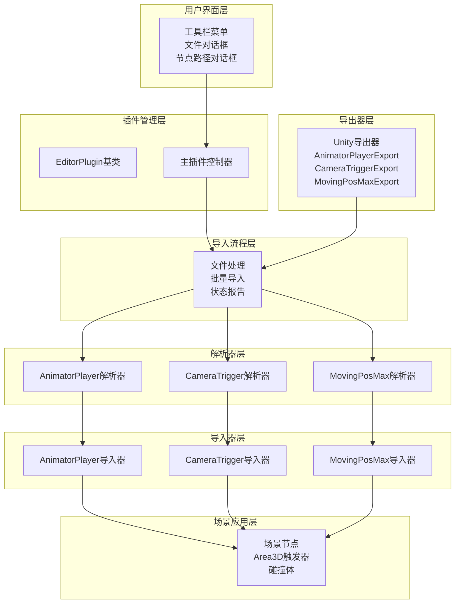

**图表来源**
- [importer_plugin.gd:19-25](file://addons/mpm_importer/importer_plugin.gd#L19-L25)
- [AnimatorPlayerImportRoot.gd:9-13](file://addons/mpm_importer/AnimatorPlayerImportRoot.gd#L9-L13)
- [CameraTriggerImportRoot.gd:10-13](file://addons/mpm_importer/CameraTriggerImportRoot.gd#L10-L13)
- [MovingPosMaxImportRoot.gd:9-12](file://addons/mpm_importer/MovingPosMaxImportRoot.gd#L9-L12)
- [AnimatorPlayerExport.cs:14-104](file://#Template/[Scripts]/PortTookits/Editor/AnimatorPlayerExport.cs#L14-L104)
- [CameraTriggerExport.cs:12-82](file://#Template/[Scripts]/PortTookits/Editor/CameraTriggerExport.cs#L12-82)
- [MovingPosMaxExport.cs:13-82](file://#Template/[Scripts]/PortTookits/Editor/MovingPosMaxExport.cs#L13-82)

## 详细组件分析

### 主插件架构

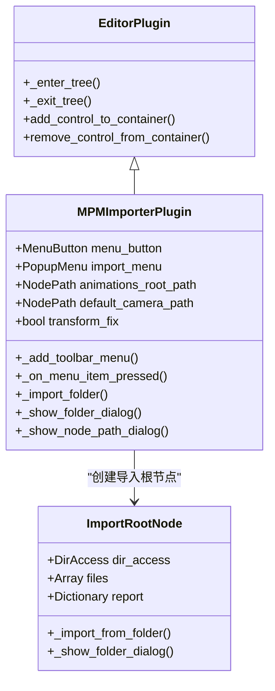

**图表来源**
- [importer_plugin.gd:1-218](file://addons/mpm_importer/importer_plugin.gd#L1-L218)
- [AnimatorPlayerImportRoot.gd:1-83](file://addons/mpm_importer/AnimatorPlayerImportRoot.gd#L1-L83)

#### 工具栏菜单系统

主插件创建了一个功能丰富的工具栏菜单，包含以下功能：

1. **导入选项**:
   - 导入 AnimatorPlayer...
   - 导入 CameraTrigger...
   - 导入 MovingPosMax...

2. **设置选项**:
   - 设置 animations_root
   - 设置 default_camera
   - 坐标转换修复 (check item)

3. **交互机制**:
   - 使用MenuButton和PopupMenu组件
   - 支持图标和快捷键
   - 实时状态显示

#### 文件导入流程

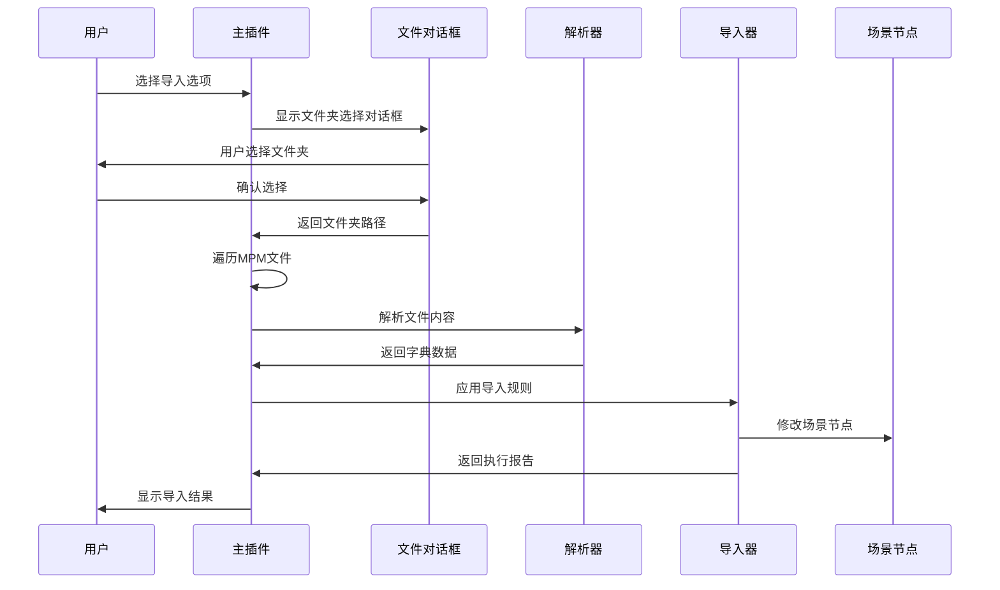

**图表来源**
- [importer_plugin.gd:153-212](file://addons/mpm_importer/importer_plugin.gd#L153-L212)
- [AnimatorPlayerImportRoot.gd:30-83](file://addons/mpm_importer/AnimatorPlayerImportRoot.gd#L30-L83)

**章节来源**
- [importer_plugin.gd:27-102](file://addons/mpm_importer/importer_plugin.gd#L27-L102)
- [importer_plugin.gd:153-212](file://addons/mpm_importer/importer_plugin.gd#L153-L212)

### 解析器组件分析

#### AnimatorPlayer解析器

AnimatorPlayer解析器专门处理动画播放相关的MPM数据：

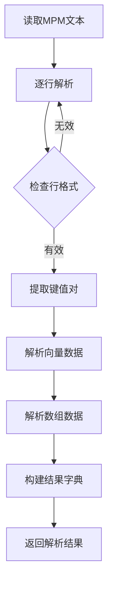

**图表来源**
- [animatorplayer_mpm_parser.gd:4-46](file://addons/mpm_importer/animatorplayer_mpm_parser.gd#L4-L46)

解析器支持的数据字段包括：
- 层级路径 (hierarchy_path)
- 组件索引 (component_index)
- 本地变换 (local_pos, local_rot, local_scale)
- 碰撞盒参数 (box_center, box_size)
- 动画播放列表 (motion_names)

#### CameraTrigger解析器

CameraTrigger解析器处理相机控制相关的MPM数据：

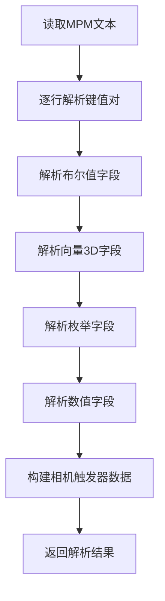

**图表来源**
- [cameratrigger_mpm_parser.gd:4-42](file://addons/mpm_importer/cameratrigger_mpm_parser.gd#L4-L42)

解析器支持的相机控制参数：
- 相机切换路径 (set_camera_path)
- 位置调整激活 (active_position)
- 旋转调整参数 (new_rotation)
- 距离调整参数 (new_distance)
- 跟随速度 (new_follow_speed)
- 缓动类型 (ease_type)
- 时间控制参数 (need_time, use_time, trigger_time)

#### MovingPosMax解析器

MovingPosMax解析器处理位置移动序列相关的MPM数据：

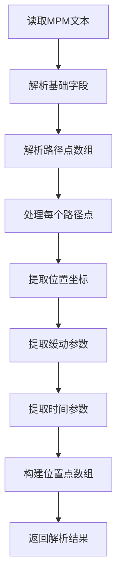

**图表来源**
- [movingposmax_mpm_parser.gd:4-44](file://addons/mpm_importer/movingposmax_mpm_parser.gd#L4-L44)

解析器支持的路径点数据：
- 位置坐标 (pos)
- 缓动类型 (ease, ease_name)
- 移动时间 (postime)
- 等待时间 (waittime)

**章节来源**
- [animatorplayer_mpm_parser.gd:1-57](file://addons/mpm_importer/animatorplayer_mpm_parser.gd#L1-L57)
- [cameratrigger_mpm_parser.gd:1-73](file://addons/mpm_importer/cameratrigger_mpm_parser.gd#L1-L73)
- [movingposmax_mpm_parser.gd:1-55](file://addons/mpm_importer/movingposmax_mpm_parser.gd#L1-L55)

### 导入器组件分析

#### 节点查找和匹配机制

所有导入器都实现了强大的节点查找和模糊匹配功能：

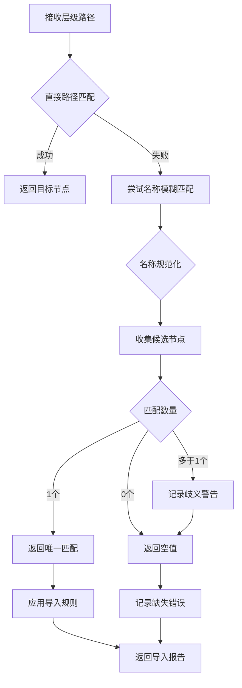

**图表来源**
- [animatorplayer_importer.gd:44-87](file://addons/mpm_importer/animatorplayer_importer.gd#L44-L87)
- [cameratrigger_importer.gd:44-87](file://addons/mpm_importer/cameratrigger_importer.gd#L44-L87)

#### 坐标转换修复系统

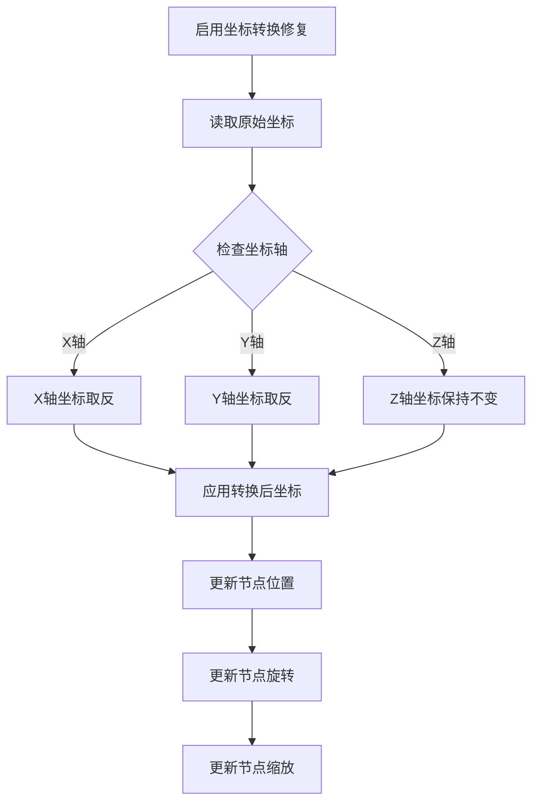

**图表来源**
- [cameratrigger_importer.gd:197-206](file://addons/mpm_importer/cameratrigger_importer.gd#L197-L206)
- [movingposmax_importer.gd:194-203](file://addons/mpm_importer/movingposmax_importer.gd#L194-L203)

#### 动画系统集成

AnimatorPlayer导入器与Godot动画系统的深度集成：

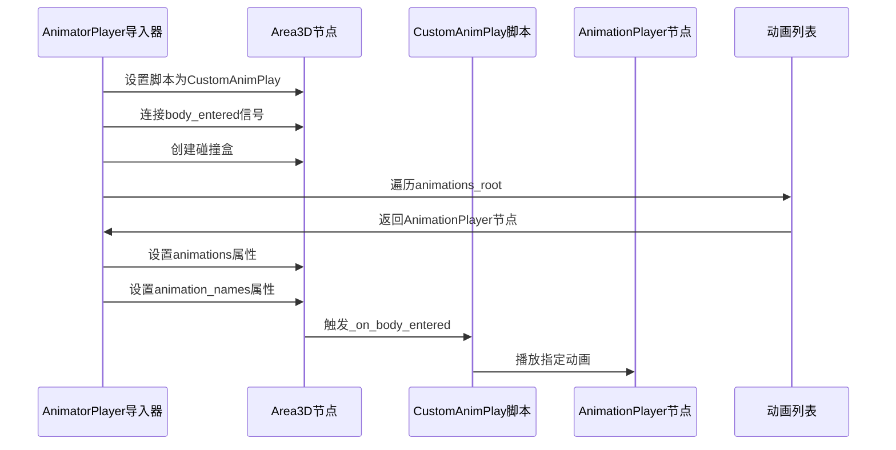

**图表来源**
- [animatorplayer_importer.gd:37-42](file://addons/mpm_importer/animatorplayer_importer.gd#L37-L42)
- [animatorplayer_importer.gd:248-271](file://addons/mpm_importer/animatorplayer_importer.gd#L248-L271)

**章节来源**
- [animatorplayer_importer.gd:1-272](file://addons/mpm_importer/animatorplayer_importer.gd#L1-L272)
- [cameratrigger_importer.gd:1-279](file://addons/mpm_importer/cameratrigger_importer.gd#L1-L279)
- [movingposmax_importer.gd:1-349](file://addons/mpm_importer/movingposmax_importer.gd#L1-L349)

### 数据模型和资源

#### MovingPosPoint数据结构

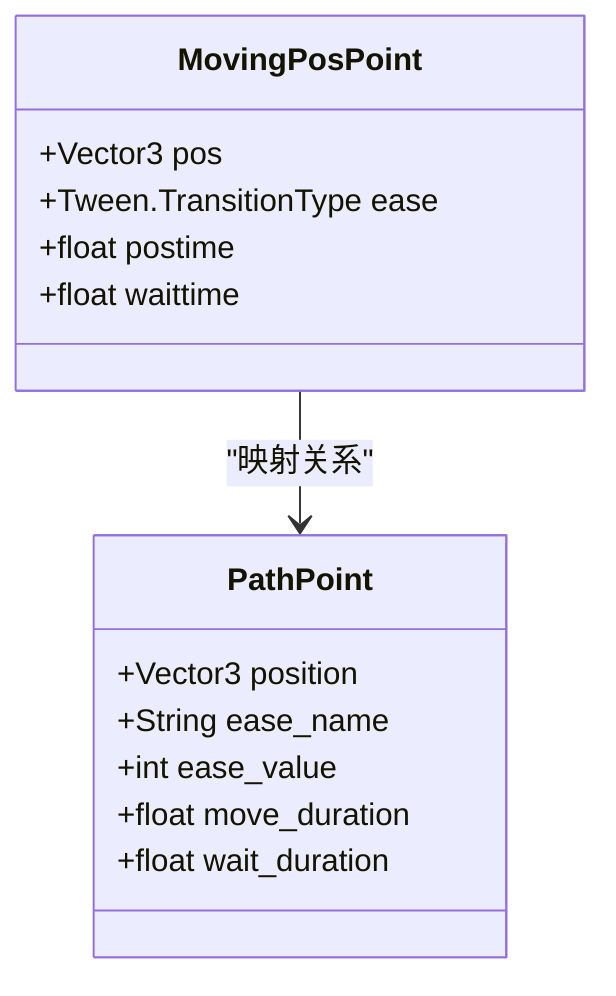

**图表来源**
- [MovingPosPoint.gd:1-9](file://addons/mpm_importer/MovingPosPoint.gd#L1-L9)
- [movingposmax_mpm_parser.gd:33-40](file://addons/mpm_importer/movingposmax_mpm_parser.gd#L33-L40)

#### 导入报告系统

所有导入操作都会生成详细的执行报告：

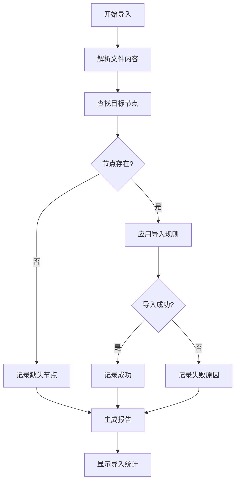

**图表来源**
- [importer_plugin.gd:182-206](file://addons/mpm_importer/importer_plugin.gd#L182-L206)

**章节来源**
- [MovingPosPoint.gd:1-9](file://addons/mpm_importer/MovingPosPoint.gd#L1-L9)
- [importer_plugin.gd:182-212](file://addons/mpm_importer/importer_plugin.gd#L182-L212)

## Unity到Godot资产迁移功能

**新增**：插件现在支持完整的Unity到Godot资产迁移工作流程，包括从Unity导出和在Godot中导入两个方向的功能。

### Unity场景导出器

#### AnimatorPlayer导出器

AnimatorPlayer导出器用于从Unity场景中提取AnimatorPlayer组件数据：

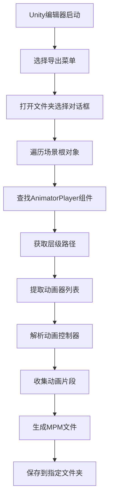

**图表来源**
- [AnimatorPlayerExport.cs:14-104](file://#Template/[Scripts]/PortTookits/Editor/AnimatorPlayerExport.cs#L14-L104)

导出器支持的数据包括：
- 层级路径 (hierarchy_path)
- 组件索引 (component_index)
- 本地变换 (local_pos, local_rot, local_scale)
- 碰撞盒参数 (box_center, box_size)
- 动画器列表 (animator_count, animator_i_name)
- 动画控制器名称 (controller_count, controller_i_name)
- 动画片段列表 (motion_count, motion_i_name)

#### CameraTrigger导出器

CameraTrigger导出器用于从Unity场景中提取CameraTrigger组件数据：

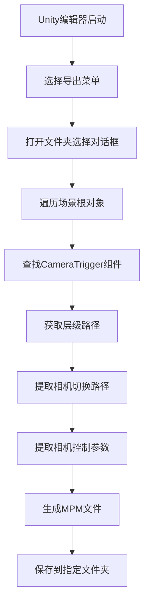

**图表来源**
- [CameraTriggerExport.cs:12-82](file://#Template/[Scripts]/PortTookits/Editor/CameraTriggerExport.cs#L12-82)

导出器支持的相机控制参数：
- 相机切换路径 (set_camera_path)
- 位置调整激活 (active_position)
- 新位置偏移 (new_add_position)
- 旋转调整参数 (active_rotate, new_rotation)
- 距离调整参数 (active_distance, new_distance)
- 跟随速度 (active_speed, new_follow_speed)
- 缓动类型 (ease_type)
- 时间控制参数 (need_time, use_time, trigger_time)

#### MovingPosMax导出器

MovingPosMax导出器用于从Unity场景中提取MovingPosMax组件数据：

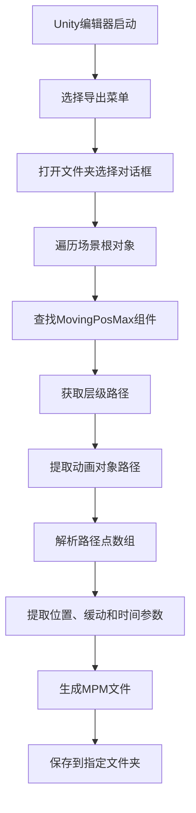

**图表来源**
- [MovingPosMaxExport.cs:13-82](file://#Template/[Scripts]/PortTookits/Editor/MovingPosMaxExport.cs#L13-82)

导出器支持的路径点数据：
- 位置坐标 (position_i_pos)
- 缓动类型 (position_i_ease, position_i_ease_name)
- 移动时间 (position_i_postime)
- 等待时间 (position_i_waittime)

### 资产迁移工作流程

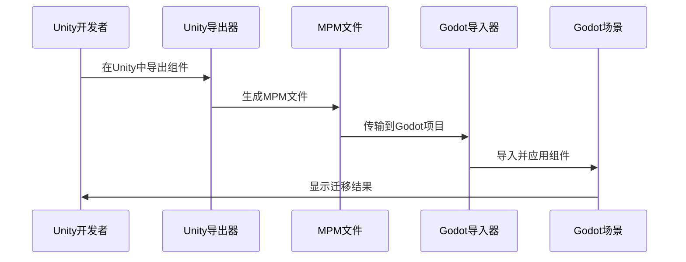

**图表来源**
- [AnimatorPlayerExport.cs:14-104](file://#Template/[Scripts]/PortTookits/Editor/AnimatorPlayerExport.cs#L14-L104)
- [importer_plugin.gd:153-212](file://addons/mpm_importer/importer_plugin.gd#L153-L212)

### 导出器使用指南

#### Unity端设置

1. **安装导出器**：将导出器脚本放置在Unity项目的Editor目录中
2. **准备场景**：确保场景中包含要导出的组件
3. **运行导出器**：在Unity菜单中选择相应导出选项

#### 导出文件格式

导出的MPM文件遵循统一的键值对格式：
- 每行一个键值对，格式为 `key=value`
- 向量数据使用逗号分隔的数值格式
- 数组数据使用带索引的键名格式

#### Godot端导入

1. **设置路径**：在插件设置中配置animations_root和default_camera路径
2. **启用修复**：根据需要启用坐标转换修复功能
3. **执行导入**：选择导出的MPM文件夹并开始导入过程

**章节来源**
- [AnimatorPlayerExport.cs:1-208](file://#Template/[Scripts]/PortTookits/Editor/AnimatorPlayerExport.cs#L1-L208)
- [CameraTriggerExport.cs:1-121](file://#Template/[Scripts]/PortTookits/Editor/CameraTriggerExport.cs#L1-L121)
- [MovingPosMaxExport.cs:1-121](file://#Template/[Scripts]/PortTookits/Editor/MovingPosMaxExport.cs#L1-L121)
- [importer_plugin.gd:153-212](file://addons/mpm_importer/importer_plugin.gd#L153-L212)

## 依赖关系分析

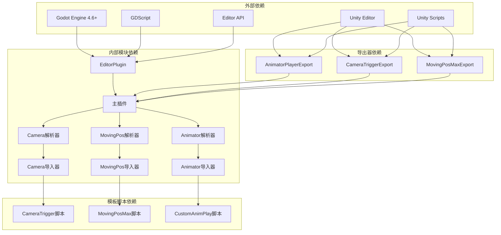

**图表来源**
- [importer_plugin.gd:6-11](file://addons/mpm_importer/importer_plugin.gd#L6-L11)
- [AnimatorPlayerExport.cs:1-11](file://#Template/[Scripts]/PortTookits/Editor/AnimatorPlayerExport.cs#L1-L11)
- [CameraTriggerExport.cs:1-8](file://#Template/[Scripts]/PortTookits/Editor/CameraTriggerExport.cs#L1-L8)
- [MovingPosMaxExport.cs:1-9](file://#Template/[Scripts]/PortTookits/Editor/MovingPosMaxExport.cs#L1-L9)
- [customanimplay.gd:1-67](file://#Template/[Scripts]/Trigger/customanimplay.gd#L1-L67)
- [CameraTrigger.gd:1-109](file://#Template/[Scripts]/CameraScripts/CameraTrigger.gd#L1-L109)
- [MovingPosMax.gd:1-107](file://#Template/[Scripts]/Animator/MovingPosMax.gd#L1-L107)

### 模块耦合分析

插件采用了松耦合的设计模式：

1. **解析器与导入器分离**: 每个组件都有独立的解析和导入职责
2. **模板脚本解耦**: 导入器通过预加载机制使用模板脚本
3. **配置驱动**: 通过NodePath和布尔标志控制行为
4. **错误隔离**: 每个导入操作都有独立的错误报告
5. **双向迁移支持**: Unity导出器和Godot导入器相互独立但遵循相同数据格式

### 循环依赖检测

经过分析，插件不存在循环依赖：
- 解析器只依赖基础数据结构
- 导入器依赖解析器输出和模板脚本
- 主插件协调各模块但不形成循环
- 模板脚本独立存在于#Template目录
- **新增**：导出器独立于导入器，通过标准MPM格式通信

**章节来源**
- [importer_plugin.gd:6-11](file://addons/mpm_importer/importer_plugin.gd#L6-L11)
- [AnimatorPlayerExport.cs:1-11](file://#Template/[Scripts]/PortTookits/Editor/AnimatorPlayerExport.cs#L1-L11)
- [CameraTriggerExport.cs:1-8](file://#Template/[Scripts]/PortTookits/Editor/CameraTriggerExport.cs#L1-L8)
- [MovingPosMaxExport.cs:1-9](file://#Template/[Scripts]/PortTookits/Editor/MovingPosMaxExport.cs#L1-L9)
- [animatorplayer_importer.gd:4-4](file://addons/mpm_importer/animatorplayer_importer.gd#L4-L4)
- [cameratrigger_importer.gd:4-4](file://addons/mpm_importer/cameratrigger_importer.gd#L4-L4)
- [movingposmax_importer.gd:4-5](file://addons/mpm_importer/movingposmax_importer.gd#L4-L5)

## 性能考虑

### 内存使用优化

1. **延迟加载**: 所有模板脚本通过预加载机制按需加载
2. **字符串处理**: 使用高效的字符串分割和替换操作
3. **数组操作**: 最小化临时数组创建，重用现有数据结构
4. **Unity导出器优化**: 使用StringBuilder减少字符串拼接开销

### 文件处理效率

1. **批量处理**: 支持单次操作处理多个MPM文件
2. **增量导入**: 导入过程中的状态持久化避免重复计算
3. **错误恢复**: 部分文件失败不影响整体导入流程
4. **Unity导出器批处理**: 支持一次性导出场景中的所有组件

### 场景修改优化

1. **最小化变更**: 只修改必要的节点属性和脚本
2. **连接管理**: 智能处理信号连接，避免重复连接
3. **资源复用**: 重用现有的碰撞形状和动画播放器
4. **坐标转换优化**: 仅在需要时进行坐标轴转换

## 故障排除指南

### 常见问题诊断

#### 节点查找失败

**症状**: 导入报告显示"Missing node"或"Missing animations_root"

**解决方案**:
1. 检查animations_root路径设置
2. 验证场景中是否存在目标节点
3. 使用模糊匹配功能确认节点名称
4. 检查节点层级路径是否正确

#### 坐标系统不匹配

**症状**: 导入的触发器位置或旋转异常

**解决方案**:
1. 启用坐标转换修复选项
2. 检查Unity和Godot的坐标系差异
3. 验证导入时的transform_fix设置

#### 动画播放问题

**症状**: AnimatorPlayer导入后动画不播放

**解决方案**:
1. 确认animations_root包含正确的AnimationPlayer节点
2. 检查动画名称是否与MPM文件中的名称匹配
3. 验证AnimationPlayer节点的命名规范

#### Unity导出器问题

**症状**: Unity导出器无法找到组件或导出失败

**解决方案**:
1. 确保Unity编辑器已正确安装导出器脚本
2. 检查场景中是否存在目标组件
3. 验证组件的层级路径是否正确
4. 检查Unity版本兼容性

### 错误日志分析

插件提供详细的错误报告系统：

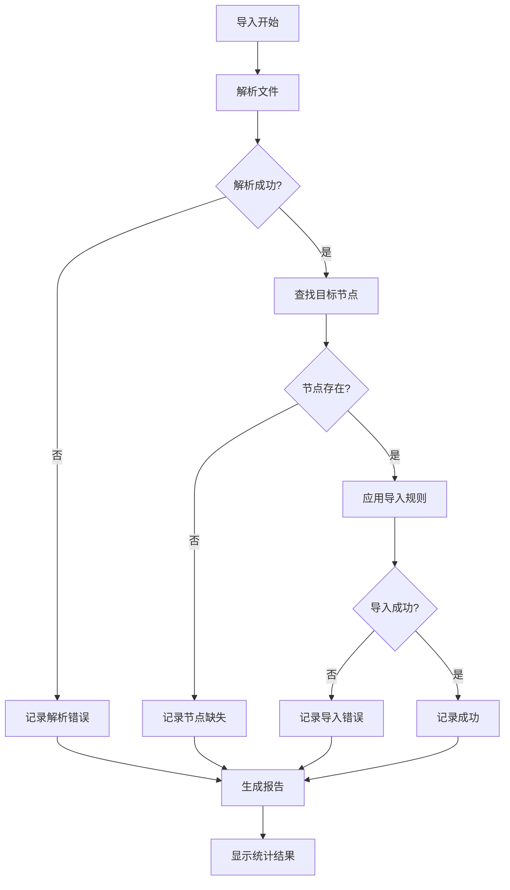

**图表来源**
- [importer_plugin.gd:182-212](file://addons/mpm_importer/importer_plugin.gd#L182-L212)

### 调试技巧

1. **启用详细日志**: 查看控制台输出的详细导入信息
2. **检查中间结果**: 验证解析器输出的字典数据结构
3. **验证场景结构**: 确认目标节点的层级和命名
4. **测试单文件导入**: 排除批量处理中的个别文件问题
5. **Unity导出器调试**: 检查导出器控制台输出的警告信息

**章节来源**
- [importer_plugin.gd:182-212](file://addons/mpm_importer/importer_plugin.gd#L182-L212)
- [AnimatorPlayerImportRoot.gd:30-83](file://addons/mpm_importer/AnimatorPlayerImportRoot.gd#L30-L83)

## 结论

MPM导入器插件是一个功能完整、设计良好的Godot编辑器扩展。它成功解决了Unity MPM文件到Godot场景的转换问题，并且现在支持完整的双向资产迁移功能，具有以下特点：

### 技术优势

1. **模块化设计**: 清晰的解析器-导入器分离架构
2. **容错性强**: 完善的错误处理和模糊匹配机制
3. **用户友好**: 直观的工具栏界面和批量导入功能
4. **可扩展性**: 基于模板脚本的灵活组件系统
5. **双向迁移支持**: 完整的Unity到Godot资产迁移工作流程
6. **高效导出器**: 优化的Unity场景导出功能

### 应用价值

该插件为从Unity向Godot迁移提供了重要的工具支持，特别适用于：
- 现有Unity项目的Godot移植
- 跨平台游戏开发的工具链整合
- 关卡设计师的工作流程自动化
- 资产库的跨引擎共享

### 发展建议

1. **性能优化**: 考虑大场景下的批量处理性能
2. **功能扩展**: 支持更多Unity组件类型的导入
3. **用户界面**: 增强导入进度显示和取消机制
4. **文档完善**: 提供更详细的使用指南和技术文档
5. **自动化测试**: 建立Unity导出器和Godot导入器的自动化测试套件

通过持续改进和社区贡献，MPM导入器插件有望成为Godot生态中重要的工具组件，为跨引擎资产迁移提供标准化的解决方案。