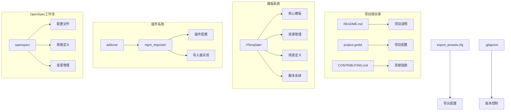
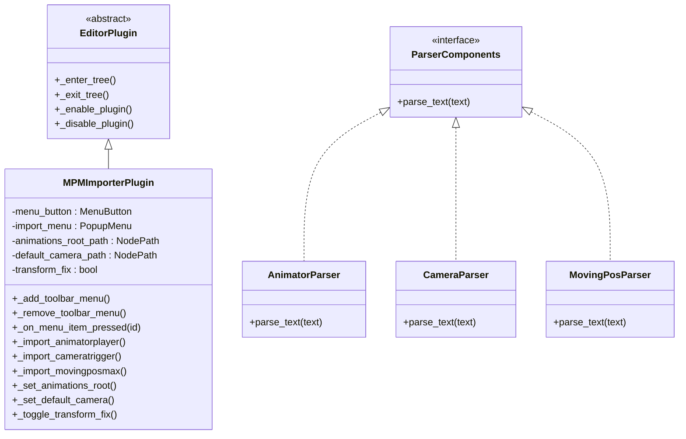
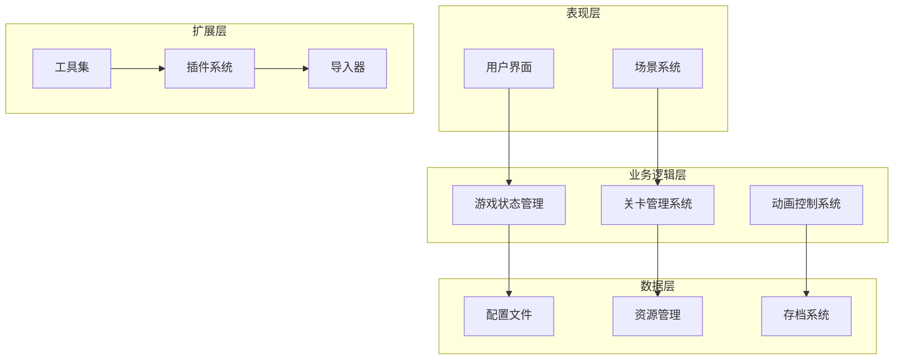
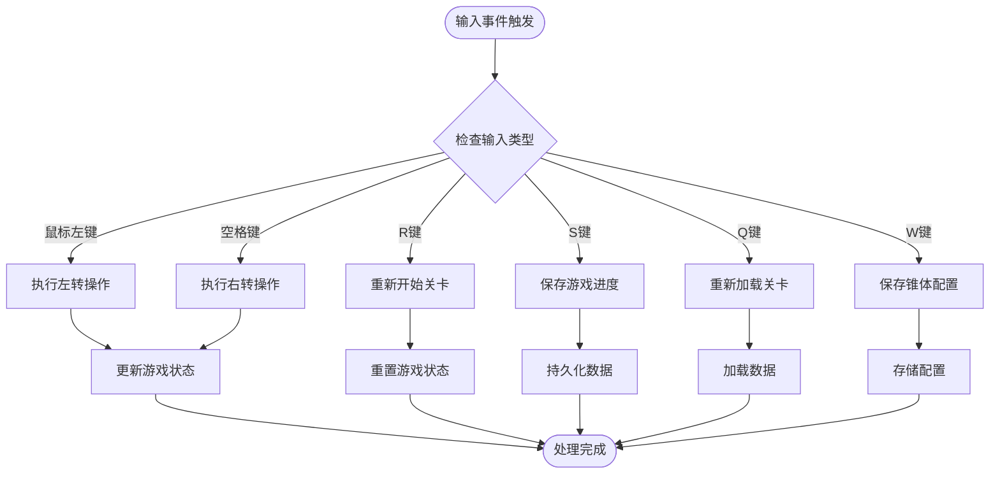
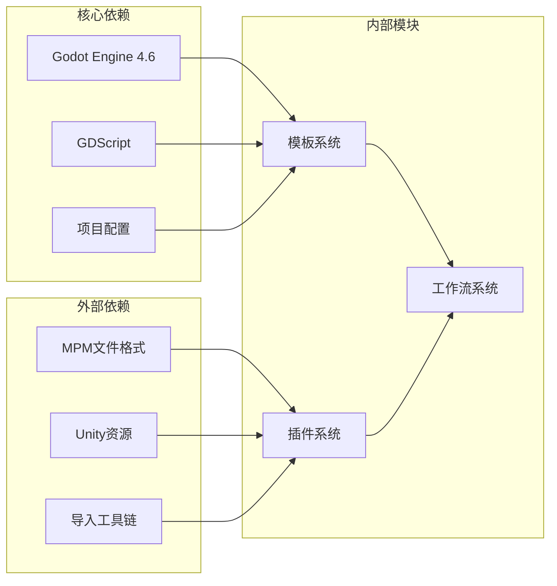

# OpenSpec工作流系统

<cite>
**本文档引用的文件**
- [README.md](file://README.md)
- [project.godot](file://project.godot)
- [CONTRIBUTING.md](file://CONTRIBUTING.md)
- [plugin.cfg](file://addons/mpm_importer/plugin.cfg)
- [importer_plugin.gd](file://addons/mpm_importer/importer_plugin.gd)
- [config.yaml](file://openspec/config.yaml)
</cite>

## 目录
1. [简介](#简介)
2. [项目结构](#项目结构)
3. [核心组件](#核心组件)
4. [架构概览](#架构概览)
5. [详细组件分析](#详细组件分析)
6. [依赖关系分析](#依赖关系分析)
7. [性能考虑](#性能考虑)
8. [故障排除指南](#故障排除指南)
9. [结论](#结论)

## 简介

OpenSpec工作流系统是一个基于Godot Engine 4.6开发的Dancing Line游戏模板框架。该项目从ShinnLine项目抽离而来，旨在降低用户学习成本，提供与冰焰模板3/4的高兼容性，支持关卡从冰焰模板3、4迁移到此模板，或直接发布至ShinnLine。

该系统提供了完整的线条游戏机制实现，具有模块化设计、跨平台支持等特点。项目采用GDScript编程语言，支持Windows、Linux、macOS平台运行。

**章节来源**
- [README.md:1-102](file://README.md#L1-L102)

## 项目结构

项目采用分层组织结构，主要包含以下核心目录：

**图表来源**
- [project.godot:1-76](file://project.godot#L1-L76)
- [plugin.cfg:1-8](file://addons/mpm_importer/plugin.cfg#L1-L8)

项目的主要特点包括：

- **模板系统**：包含完整的游戏模板，涵盖材质、资源、场景和脚本
- **插件架构**：支持第三方插件扩展，如MPM导入器
- **工作流管理**：通过OpenSpec系统管理规格定义和变更流程
- **多平台支持**：配置文件显示支持多种平台

**章节来源**
- [README.md:52-61](file://README.md#L52-L61)

## 核心组件

### MPM导入器插件

MPM导入器是一个重要的编辑器插件，用于从Unity导入MPM文件到Godot。该插件支持AnimatorPlayer、CameraTrigger和MovingPosMax组件的导入。

**图表来源**
- [importer_plugin.gd:1-218](file://addons/mpm_importer/importer_plugin.gd#L1-L218)

### 项目配置系统

项目配置通过project.godot文件管理，包含应用设置、输入映射、物理引擎配置等。

**章节来源**
- [project.godot:15-76](file://project.godot#L15-L76)

## 架构概览

OpenSpec工作流系统采用模块化架构设计，主要由以下几个层次组成：

系统的核心架构特点：

- **分层设计**：清晰的层次分离，便于维护和扩展
- **插件化**：支持第三方插件扩展功能
- **配置驱动**：通过配置文件管理各种设置
- **资源管理**：统一的资源管理和加载机制

## 详细组件分析

### 输入控制系统

系统实现了完整的输入控制映射，支持多种操作方式：

| 操作类型 | 键位映射 | 功能描述 |
|---------|---------|----------|
| 转向 | 鼠标左键 | 控制线条转向 |
| 转向 | 空格键 | 控制线条转向 |
| 重试 | R键 | 重新开始关卡 |
| 保存 | S键 | 保存当前进度 |
| 重载 | Q键 | 重新加载关卡 |
| 保存锥体 | W键 | 保存锥体配置 |

**图表来源**
- [project.godot:33-60](file://project.godot#L33-L60)

### 物理引擎配置

系统使用Jolt Physics作为3D物理引擎，启用了独立线程运行模式以提高性能。

**章节来源**
- [project.godot:68-76](file://project.godot#L68-L76)

### 渲染配置

渲染系统采用移动设备优化的渲染方法，适合跨平台部署。

**章节来源**
- [project.godot:73-76](file://project.godot#L73-L76)

## 依赖关系分析

系统的关键依赖关系：

- **引擎依赖**：严格依赖Godot Engine 4.6及以上版本
- **脚本语言**：使用GDScript进行主要逻辑开发
- **插件生态**：支持第三方插件扩展
- **导入工具**：提供从Unity到Godot的资源导入能力

**章节来源**
- [plugin.cfg:1-8](file://addons/mpm_importer/plugin.cfg#L1-L8)

## 性能考虑

### 物理引擎优化

系统采用Jolt Physics引擎，并启用3D物理独立线程运行模式，这有助于：

- 提高物理计算性能
- 减少主线程负载
- 支持更复杂的物理交互

### 渲染优化

渲染系统针对移动设备进行了优化：

- 使用移动端渲染方法
- 优化纹理和模型资源
- 支持多平台性能调优

### 内存管理

- 合理的资源加载策略
- 及时的垃圾回收
- 资源池化技术

## 故障排除指南

### 常见问题及解决方案

1. **插件加载失败**
   - 检查插件配置文件是否正确
   - 确认插件路径设置
   - 验证GDScript编译状态

2. **输入控制异常**
   - 检查project.godot中的输入映射
   - 验证键盘布局设置
   - 确认输入事件绑定

3. **物理引擎问题**
   - 检查Jolt Physics配置
   - 验证碰撞体设置
   - 确认物理材质参数

**章节来源**
- [CONTRIBUTING.md:6-14](file://CONTRIBUTING.md#L6-L14)

### 调试工具

系统提供了完善的调试支持：

- 编辑器插件调试
- 输入事件监控
- 性能分析工具
- 日志输出系统

## 结论

OpenSpec工作流系统为Godot Engine提供了一个完整的Dancing Line游戏开发框架。系统具有以下优势：

- **高度兼容性**：与冰焰模板3/4对齐，便于关卡迁移
- **模块化设计**：清晰的代码结构，易于扩展和定制
- **强大的插件系统**：支持第三方扩展和资源导入
- **跨平台支持**：统一的配置管理，支持多平台部署

该系统特别适合需要快速开发线条类游戏的开发者，提供了从模板到完整工作流的全套解决方案。通过OpenSpec工作流，开发者可以更好地管理项目规格、控制变更流程，并与其他开发者协作。