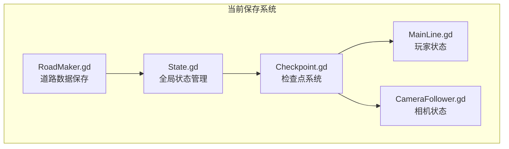
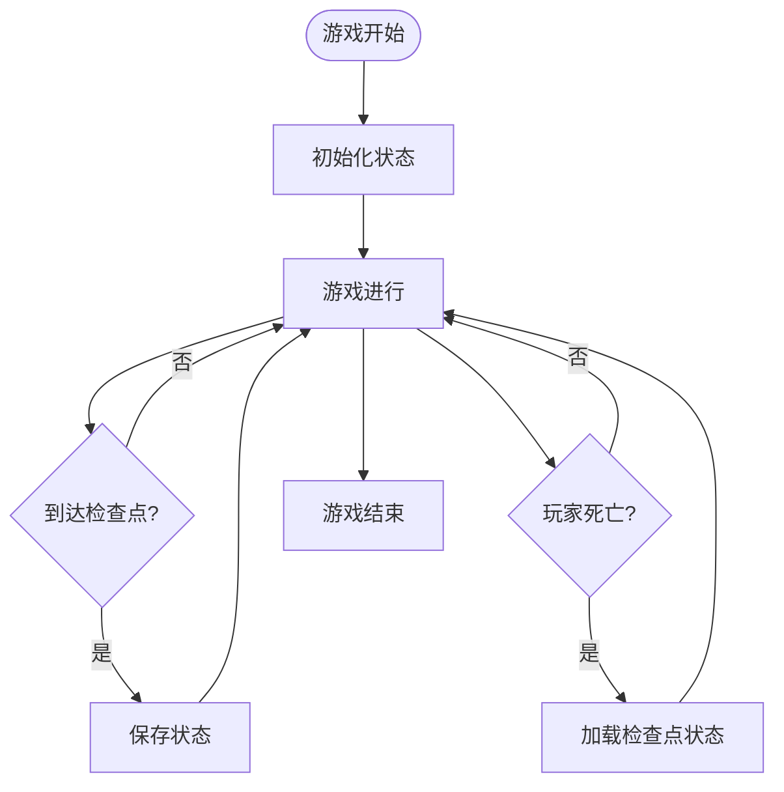

# SaveKit保存系统

<cite>
**本文档引用的文件**
- [README.md](file://README.md)
- [project.godot](file://project.godot)
- [State.gd](file://#Template/[Scripts]/State.gd)
- [Checkpoint.gd](file://#Template/[Scripts]/Trigger/Checkpoint.gd)
- [MainLine.gd](file://#Template/[Scripts]/Level/MainLine.gd)
- [RoadMaker.gd](file://#Template/[Scripts]/Level/RoadMaker.gd)
</cite>

## 更新摘要
**所做更改**
- 删除了所有关于SaveKit保存系统的架构分析和组件说明
- 移除了序列化器、反序列化器、保存管理器等核心组件的详细描述
- 删除了相关的设计模式、依赖关系和性能分析内容
- 更新了项目现状说明，反映SaveKit系统已被完全移除

## 目录
1. [简介](#简介)
2. [项目现状](#项目现状)
3. [替代方案](#替代方案)
4. [现有保存机制](#现有保存机制)
5. [结论](#结论)

## 简介

SaveKit是一个为Godot引擎4.x开发的完整保存系统解决方案。该系统提供了灵活的序列化和反序列化功能，支持多种数据格式（JSON和二进制），能够保存和加载场景树中的节点状态以及用户定义的资源数据。

**更新** 该系统现已从当前代码库中完全移除，相关内容已被新的保存机制替代。

## 项目现状

根据最新的代码库分析，SaveKit保存系统已完全从项目中移除。当前项目中不存在任何与SaveKit相关的文件或组件。

### 当前保存机制

项目目前采用简化的状态管理机制：

**图表来源**
- [State.gd:1-159](file://#Template/[Scripts]/State.gd#L1-L159)
- [Checkpoint.gd:1-218](file://#Template/[Scripts]/Trigger/Checkpoint.gd#L1-L218)
- [MainLine.gd:1-230](file://#Template/[Scripts]/Level/MainLine.gd#L1-L230)
- [RoadMaker.gd:1-46](file://#Template/[Scripts]/Level/RoadMaker.gd#L1-L46)

## 替代方案

由于SaveKit系统已被移除，项目采用了以下替代方案：

### 状态持久化方案

1. **全局状态管理**
   - 使用State.gd集中管理所有可持久化的游戏状态
   - 支持玩家位置、速度、动画时间等关键状态的保存

2. **检查点系统**
   - Checkpoint.gd提供自动检查点功能
   - 支持玩家死亡复活和关卡重试机制

3. **场景数据保存**
   - RoadMaker.gd支持动态生成的道路数据保存
   - 使用Godot原生的ResourceSaver进行序列化

### 简化架构优势

**图表来源**
- [State.gd:52-80](file://#Template/[Scripts]/State.gd#L52-L80)
- [Checkpoint.gd:48-81](file://#Template/[Scripts]/Trigger/Checkpoint.gd#L48-L81)

## 现有保存机制

### State.gd - 全局状态管理

State.gd提供了完整的状态持久化功能：

- **玩家状态**：位置、速度、旋转、动画时间
- **相机状态**：偏移量、旋转角度、跟随参数
- **游戏进度**：关卡完成度、收集品数量
- **物理参数**：重力设置、玩家初始方向

### Checkpoint.gd - 检查点系统

检查点系统实现了自动保存和加载功能：

- **自动检测**：玩家进入检查点时自动保存状态
- **环境同步**：自动捕获和恢复光照、雾气等环境设置
- **相机跟随**：支持新旧两种相机跟随器的兼容

### RoadMaker.gd - 动态数据保存

支持动态生成内容的保存：

- **道路生成**：保存动态生成的道路网格数据
- **场景打包**：使用PackedScene进行高效序列化
- **资源管理**：自动处理依赖资源的保存和加载

**章节来源**
- [State.gd:1-159](file://#Template/[Scripts]/State.gd#L1-L159)
- [Checkpoint.gd:1-218](file://#Template/[Scripts]/Trigger/Checkpoint.gd#L1-L218)
- [RoadMaker.gd:1-46](file://#Template/[Scripts]/Level/RoadMaker.gd#L1-L46)

## 结论

SaveKit保存系统的移除标志着项目向更简洁、更高效的架构转变：

### 主要变化

1. **简化架构**：从复杂的序列化系统转向简化的状态管理
2. **性能提升**：减少了序列化/反序列化开销
3. **维护成本降低**：减少了第三方组件的依赖
4. **学习曲线降低**：新的系统更容易理解和维护

### 新系统优势

- **轻量级**：仅包含必要的保存功能
- **稳定可靠**：基于Godot原生API实现
- **易于扩展**：可以根据需要添加新的保存功能
- **兼容性强**：与Godot引擎版本升级兼容

### 未来发展方向

虽然SaveKit已被移除，但项目保留了扩展保存功能的可能性。如果需要更复杂的数据持久化需求，可以在现有基础上进行增强，而不必重新引入完整的序列化框架。

**章节来源**
- [README.md:1-102](file://README.md#L1-L102)
- [project.godot:1-72](file://project.godot#L1-L72)