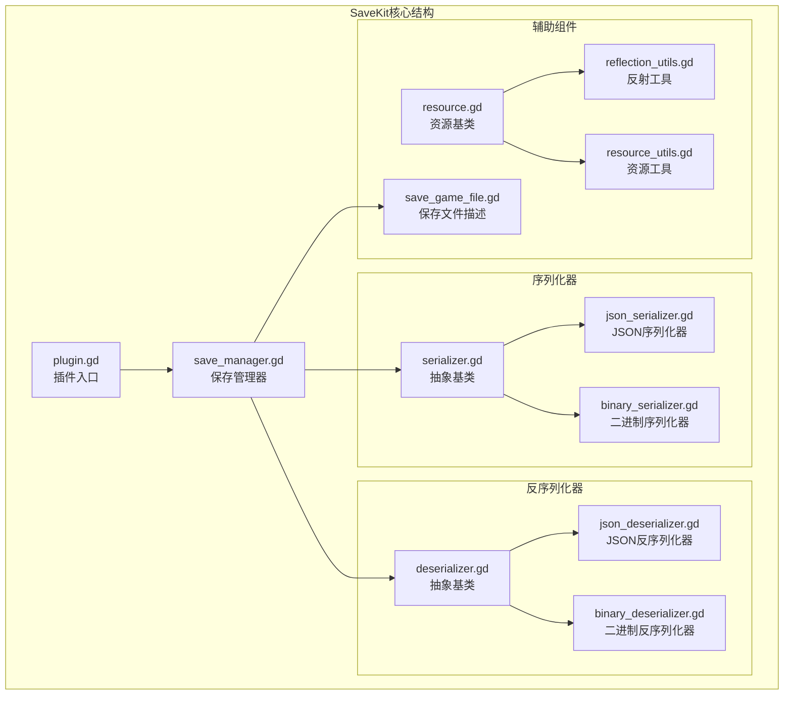
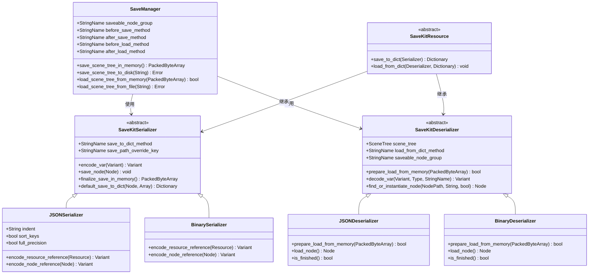
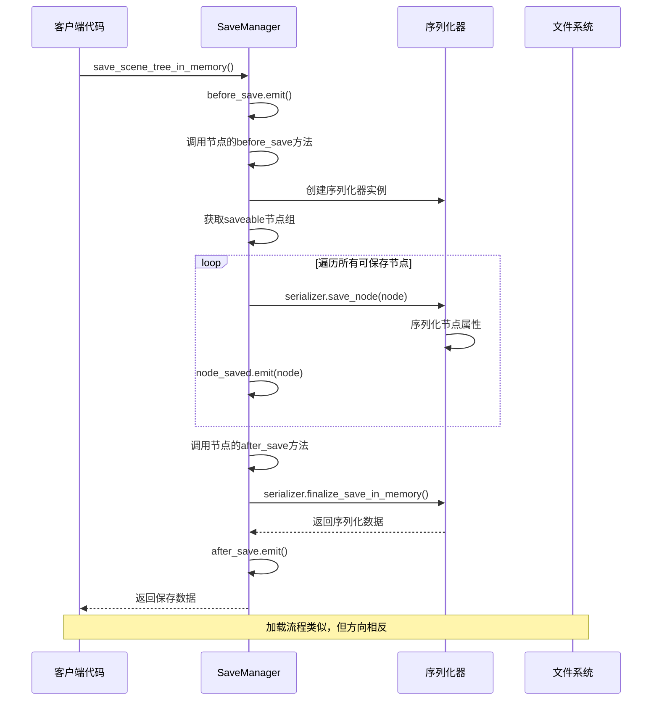
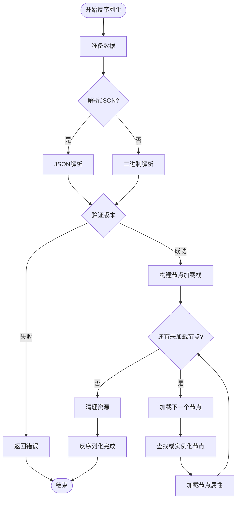
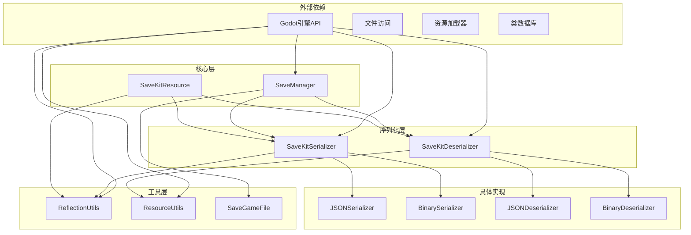

# SaveKit保存系统

<cite>
**本文档引用的文件**
- [plugin.gd](file://addons/savekit/plugin.gd)
- [save_manager.gd](file://addons/savekit/save_manager.gd)
- [save_game_file.gd](file://addons/savekit/save_game_file.gd)
- [resource.gd](file://addons/savekit/resource.gd)
- [serializer.gd](file://addons/savekit/serializer.gd)
- [json_serializer.gd](file://addons/savekit/json_serializer.gd)
- [binary_serializer.gd](file://addons/savekit/binary_serializer.gd)
- [deserializer.gd](file://addons/savekit/deserializer.gd)
- [json_deserializer.gd](file://addons/savekit/json_deserializer.gd)
- [binary_deserializer.gd](file://addons/savekit/binary_deserializer.gd)
- [reflection_utils.gd](file://addons/savekit/reflection_utils.gd)
- [resource_utils.gd](file://addons/savekit/resource_utils.gd)
- [README.md](file://README.md)
</cite>

## 目录
1. [简介](#简介)
2. [项目结构](#项目结构)
3. [核心组件](#核心组件)
4. [架构概览](#架构概览)
5. [详细组件分析](#详细组件分析)
6. [依赖关系分析](#依赖关系分析)
7. [性能考虑](#性能考虑)
8. [故障排除指南](#故障排除指南)
9. [结论](#结论)

## 简介

SaveKit是一个为Godot引擎4.x开发的完整保存系统解决方案。该系统提供了灵活的序列化和反序列化功能，支持多种数据格式（JSON和二进制），能够保存和加载场景树中的节点状态以及用户定义的资源数据。

该系统的核心目标是提供一个简单易用但功能强大的保存/加载机制，支持：
- 场景树节点的状态保存和恢复
- 用户自定义资源的数据持久化
- 多种序列化格式支持
- 安全的资源加载机制
- 灵活的配置选项

## 项目结构

SaveKit插件位于`addons/savekit/`目录下，包含以下主要文件：

**图表来源**
- [plugin.gd:1-20](file://addons/savekit/plugin.gd#L1-L20)
- [save_manager.gd:1-294](file://addons/savekit/save_manager.gd#L1-L294)
- [serializer.gd:1-82](file://addons/savekit/serializer.gd#L1-L82)
- [deserializer.gd:1-146](file://addons/savekit/deserializer.gd#L1-L146)

**章节来源**
- [plugin.gd:1-20](file://addons/savekit/plugin.gd#L1-L20)
- [README.md:1-138](file://README.md#L1-L138)

## 核心组件

### SaveManager - 保存管理器

SaveManager是整个保存系统的核心控制器，负责协调保存和加载操作。它提供了以下主要功能：

- **场景树保存**：遍历标记为可保存的节点组，序列化其状态
- **文件管理**：处理保存文件的创建、读取和列表操作
- **事件系统**：发出保存和加载过程中的各种信号
- **配置灵活性**：允许自定义序列化器、反序列化器和文件路径

### 序列化器体系

系统提供了两种主要的序列化格式：

#### JSON序列化器
- 人类可读的文本格式
- 支持缩进和键排序
- 适合调试和手动编辑
- 包含完整的类型信息

#### 二进制序列化器
- 高效的二进制格式
- 更小的文件体积
- 更快的读写速度
- 适合生产环境

### 资源系统

SaveKit引入了专门的资源基类，用于区分需要持久化的数据和游戏PCK中的静态资源。

**章节来源**
- [save_manager.gd:1-294](file://addons/savekit/save_manager.gd#L1-L294)
- [serializer.gd:1-82](file://addons/savekit/serializer.gd#L1-L82)
- [deserializer.gd:1-146](file://addons/savekit/deserializer.gd#L1-L146)
- [resource.gd:1-72](file://addons/savekit/resource.gd#L1-L72)

## 架构概览

SaveKit采用了分层架构设计，确保了良好的可扩展性和维护性：

**图表来源**
- [save_manager.gd:1-294](file://addons/savekit/save_manager.gd#L1-L294)
- [serializer.gd:1-82](file://addons/savekit/serializer.gd#L1-L82)
- [deserializer.gd:1-146](file://addons/savekit/deserializer.gd#L1-L146)
- [resource.gd:1-72](file://addons/savekit/resource.gd#L1-L72)

## 详细组件分析

### SaveManager工作流程

SaveManager实现了完整的保存/加载生命周期管理：

**图表来源**
- [save_manager.gd:71-93](file://addons/savekit/save_manager.gd#L71-L93)
- [save_manager.gd:159-177](file://addons/savekit/save_manager.gd#L159-L177)

### 序列化器实现细节

#### JSON序列化器特性

JSON序列化器提供了丰富的配置选项：

- **类型安全**：完整的类型信息存储，确保精确的反序列化
- **资源引用**：支持对PCK中资源的引用而非内联存储
- **循环引用处理**：通过实例ID避免资源循环引用问题
- **版本控制**：内置版本号确保兼容性

#### 二进制序列化器优化

二进制序列化器专注于性能和效率：

- **紧凑格式**：最小化的存储空间占用
- **快速解析**：优化的二进制解析算法
- **内存效率**：减少内存分配和垃圾回收压力
- **类型标签**：高效的类型识别机制

### 反序列化器处理逻辑

反序列化器负责将保存的数据转换回运行时对象：

**图表来源**
- [json_deserializer.gd:11-32](file://addons/savekit/json_deserializer.gd#L11-L32)
- [binary_deserializer.gd:11-27](file://addons/savekit/binary_deserializer.gd#L11-L27)

**章节来源**
- [save_manager.gd:71-200](file://addons/savekit/save_manager.gd#L71-L200)
- [json_serializer.gd:1-165](file://addons/savekit/json_serializer.gd#L1-L165)
- [binary_serializer.gd:1-185](file://addons/savekit/binary_serializer.gd#L1-L185)
- [json_deserializer.gd:1-182](file://addons/savekit/json_deserializer.gd#L1-L182)
- [binary_deserializer.gd:1-189](file://addons/savekit/binary_deserializer.gd#L1-L189)

## 依赖关系分析

SaveKit系统展现了清晰的依赖层次结构：

**图表来源**
- [save_manager.gd:67-69](file://addons/savekit/save_manager.gd#L67-L69)
- [serializer.gd:8](file://addons/savekit/serializer.gd#L8)
- [deserializer.gd:28](file://addons/savekit/deserializer.gd#L28)

系统的主要依赖关系特点：

1. **低耦合设计**：核心接口与具体实现分离
2. **单一职责**：每个类都有明确的功能边界
3. **可替换性**：序列化器和反序列化器可以互换使用
4. **安全性**：资源加载通过安全检查机制

**章节来源**
- [reflection_utils.gd:1-55](file://addons/savekit/reflection_utils.gd#L1-L55)
- [resource_utils.gd:1-14](file://addons/savekit/resource_utils.gd#L1-L14)

## 性能考虑

SaveKit在设计时充分考虑了性能因素：

### 内存管理
- **延迟加载**：节点和资源按需加载，避免一次性占用大量内存
- **引用复用**：相同资源只保存一次，通过引用链接避免重复数据
- **缓冲区管理**：序列化器使用高效的缓冲区操作

### 文件I/O优化
- **异步操作**：支持大文件的分块处理
- **压缩选项**：二进制格式相比JSON格式有显著的空间优势
- **缓存机制**：频繁访问的资源数据会被缓存

### 类型处理效率
- **类型标签**：二进制格式使用紧凑的类型标识符
- **批量操作**：数组和字典的序列化采用批量处理策略
- **默认值优化**：只保存非默认值的属性

## 故障排除指南

### 常见问题及解决方案

#### 保存文件路径问题
- **问题**：保存文件路径必须是绝对路径
- **解决**：确保`save_games_directory`配置为绝对路径
- **预防**：使用`_normalized_save_games_directory()`方法

#### 节点组配置错误
- **问题**：节点不在正确的组中导致无法保存
- **解决**：确保所有可保存节点都添加到`saveable`组
- **验证**：检查节点的`add_to_group()`调用

#### 资源加载失败
- **问题**：外部资源无法加载
- **原因**：资源路径不在`res://`范围内或扩展名不受支持
- **解决**：使用`ResourceUtils.safe_load_resource()`进行安全加载

#### 版本兼容性问题
- **问题**：不同版本的保存数据无法兼容
- **解决**：检查序列化版本号并更新代码
- **预防**：在升级时提供数据迁移脚本

### 调试技巧

1. **启用详细日志**：监听`node_saved`、`node_loaded`等信号
2. **检查序列化结果**：验证保存的数据格式和内容
3. **逐步调试**：使用断点跟踪序列化和反序列化过程
4. **内存监控**：监控序列化器和反序列器的内存使用情况

**章节来源**
- [save_manager.gd:115-138](file://addons/savekit/save_manager.gd#L115-L138)
- [json_serializer.gd:40-44](file://addons/savekit/json_serializer.gd#L40-L44)
- [binary_serializer.gd:51-56](file://addons/savekit/binary_serializer.gd#L51-L56)

## 结论

SaveKit保存系统为Godot项目提供了一个强大而灵活的持久化解决方案。其设计特点包括：

### 主要优势
- **高度可配置**：支持多种序列化格式和自定义配置
- **安全可靠**：内置资源加载安全检查机制
- **性能优秀**：提供二进制格式以优化性能
- **易于使用**：简单的API设计，快速集成

### 技术亮点
- **分层架构**：清晰的抽象层次和职责分离
- **类型安全**：完整的类型信息保存和验证
- **资源管理**：智能的资源引用和循环引用处理
- **事件驱动**：丰富的事件系统支持异步操作

### 适用场景
- **独立游戏**：完整的单人游戏进度保存
- **多关卡游戏**：复杂的关卡数据管理和切换
- **沙盒游戏**：动态生成内容的持久化
- **教育项目**：学生作品的保存和分享

SaveKit系统为Godot开发者提供了一个专业级的保存解决方案，既满足了开发者的高级需求，又保持了使用的简洁性。通过合理的配置和使用，可以轻松实现复杂的游戏保存功能。