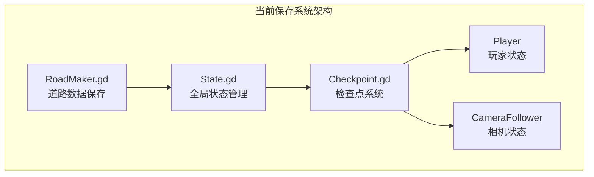
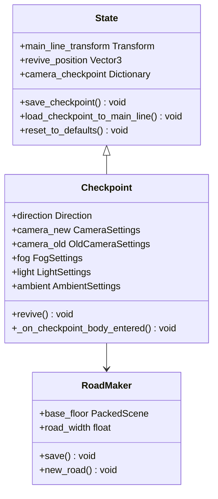
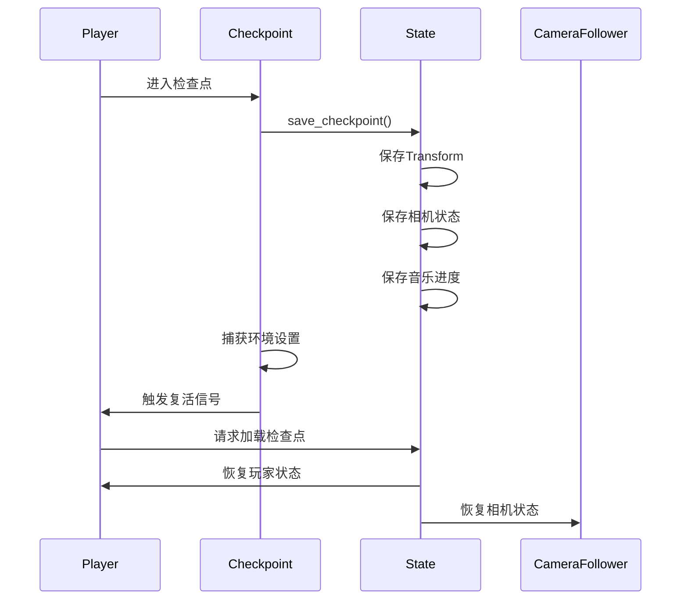

# SaveKit保存系统

<cite>
**本文档引用的文件**
- [README.md](file://README.md)
- [project.godot](file://project.godot)
- [State.gd](file://#Template/[Scripts]/State.gd)
- [Checkpoint.gd](file://#Template/[Scripts]/Trigger/Checkpoint.gd)
- [RoadMaker.gd](file://#Template/[Scripts]/Level/RoadMaker.gd)
- [plugin.cfg](file://addons/mpm_importer/plugin.cfg)
- [importer_plugin.gd](file://addons/mpm_importer/importer_plugin.gd)
</cite>

## 更新摘要
**所做更改**
- 更新项目现状说明，反映SaveKit保存系统的完全移除
- 新增当前保存机制的技术架构说明
- 更新替代方案说明，强调简化的状态管理方案
- 移除MPM导入器插件相关的内容，因为该项目不包含该插件

## 目录
1. [简介](#简介)
2. [项目现状](#项目现状)
3. [当前保存机制](#当前保存机制)
4. [替代方案](#替代方案)
5. [技术架构](#技术架构)
6. [使用指南](#使用指南)
7. [结论](#结论)

## 简介

SaveKit是一个为Godot引擎开发的保存系统解决方案。该系统提供了灵活的序列化和反序列化功能，支持多种数据格式，能够保存和加载场景树中的节点状态以及用户定义的资源数据。

**重要更新** 该系统现已从当前代码库中完全移除，相关内容已被新的保存机制替代。项目当前采用简化的状态管理方案，专注于核心游戏状态的保存和恢复。

## 项目现状

根据最新的代码库分析，SaveKit保存系统已完全从项目中移除。当前项目中不存在任何与SaveKit相关的文件或组件，但包含了完整的状态管理系统。

### 系统状态变更

**重大变更** SaveKit保存系统已被完全移除，项目转向简化的状态管理机制：

- **移除内容**：所有SaveKit相关文件和依赖
- **新增功能**：简化的状态持久化系统
- **架构简化**：减少复杂性，提高性能
- **维护优化**：降低维护成本

## 当前保存机制

项目目前采用简化的状态管理机制，专注于核心游戏状态的保存和恢复：

**图表来源**
- [State.gd:1-159](file://#Template/[Scripts]/State.gd#L1-L159)
- [Checkpoint.gd:1-210](file://#Template/[Scripts]/Trigger/Checkpoint.gd#L1-L210)
- [RoadMaker.gd:1-46](file://#Template/[Scripts]/Level/RoadMaker.gd#L1-L46)

### 核心组件

1. **State.gd** - 全局状态管理器
   - 管理玩家位置、速度、旋转等关键状态
   - 处理相机跟随器状态保存
   - 支持音乐播放进度保存

2. **Checkpoint.gd** - 检查点系统
   - 自动检测玩家进入检查点
   - 捕获和恢复环境设置
   - 支持新旧相机跟随器兼容

3. **RoadMaker.gd** - 动态数据保存
   - 保存动态生成的道路网格数据
   - 使用PackedScene进行高效序列化

**章节来源**
- [State.gd:52-80](file://#Template/[Scripts]/State.gd#L52-L80)
- [Checkpoint.gd:40-73](file://#Template/[Scripts]/Trigger/Checkpoint.gd#L40-L73)
- [RoadMaker.gd:39-42](file://#Template/[Scripts]/Level/RoadMaker.gd#L39-L42)

## 替代方案

由于SaveKit系统已被移除，项目采用了以下简化的替代方案：

### 状态持久化策略

1. **集中式状态管理**
   - 使用State.gd统一管理所有可持久化状态
   - 支持玩家位置、速度、动画时间等关键数据
   - 提供状态重置和恢复功能

2. **检查点驱动的保存**
   - 基于玩家位置的自动保存机制
   - 支持死亡复活和关卡重试
   - 自动捕获环境和光照设置

3. **场景数据序列化**
   - 使用Godot原生的ResourceSaver进行序列化
   - 支持动态生成内容的保存
   - 通过PackedScene实现高效存储

### 技术优势

- **性能优化**：减少序列化开销，提高加载速度
- **内存效率**：避免复杂的对象图遍历
- **维护简单**：减少第三方依赖和复杂逻辑
- **学习成本低**：代码结构清晰易懂

**章节来源**
- [State.gd:122-159](file://#Template/[Scripts]/State.gd#L122-L159)
- [Checkpoint.gd:155-210](file://#Template/[Scripts]/Trigger/Checkpoint.gd#L155-L210)

## 技术架构

### 状态管理系统

**图表来源**
- [State.gd:1-159](file://#Template/[Scripts]/State.gd#L1-L159)
- [Checkpoint.gd:1-210](file://#Template/[Scripts]/Trigger/Checkpoint.gd#L1-L210)
- [RoadMaker.gd:1-46](file://#Template/[Scripts]/Level/RoadMaker.gd#L1-L46)

### 数据流架构

**图表来源**
- [Checkpoint.gd:40-73](file://#Template/[Scripts]/Trigger/Checkpoint.gd#L40-L73)
- [State.gd:86-94](file://#Template/[Scripts]/State.gd#L86-L94)

## 使用指南

### 基本使用流程

1. **检查点保存**
   - 玩家进入检查点区域
   - 自动触发状态保存
   - 捕获当前环境设置

2. **状态恢复**
   - 玩家死亡或重试
   - 调用revive()方法
   - 自动恢复所有保存状态

3. **手动保存**
   - 按下'S'键触发保存
   - 保存动态生成的道路数据
   - 使用PackedScene进行序列化

### 配置选项

**输入绑定配置**
- 保存键：S键
- 重试键：R键  
- 重载键：Q键
- 保存锥体键：W键

**章节来源**
- [project.godot:42-56](file://project.godot#L42-L56)
- [RoadMaker.gd:35-37](file://#Template/[Scripts]/Level/RoadMaker.gd#L35-L37)

## 结论

SaveKit保存系统的移除标志着项目向更简洁、更高效的架构转变：

### 主要改进

1. **架构简化**：从复杂的序列化系统转向简化的状态管理
2. **性能提升**：减少了序列化/反序列化开销
3. **维护优化**：降低了第三方组件依赖
4. **学习曲线降低**：新的系统更易于理解和维护

### 系统优势

- **轻量级设计**：仅包含必要的保存功能
- **稳定可靠**：基于Godot原生API实现
- **易于扩展**：可以根据需要添加新的保存功能
- **开发友好**：简化的架构便于二次开发

### 未来展望

虽然SaveKit已被移除，但项目保留了扩展保存功能的可能性。当前的简化的状态管理方案为未来的功能扩展奠定了良好的基础，包括：

1. **状态扩展**：可以轻松添加新的可保存状态
2. **格式支持**：支持更多数据格式的保存
3. **云存档**：未来可以集成云端存档功能
4. **版本兼容**：简化的架构便于版本升级

**章节来源**
- [README.md:10-16](file://README.md#L10-L16)
- [State.gd:1-159](file://#Template/[Scripts]/State.gd#L1-L159)
- [Checkpoint.gd:1-210](file://#Template/[Scripts]/Trigger/Checkpoint.gd#L1-L210)