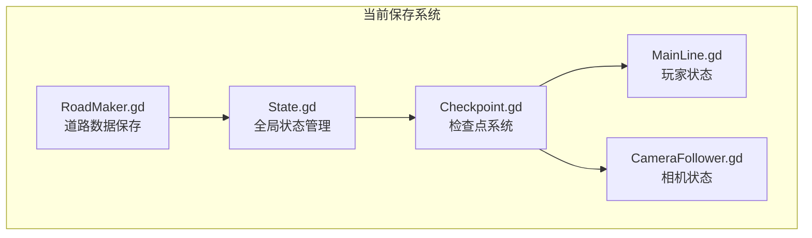
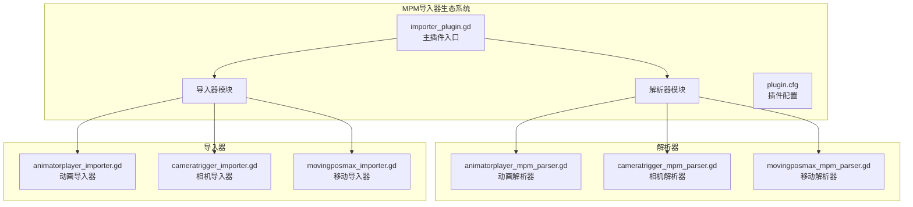
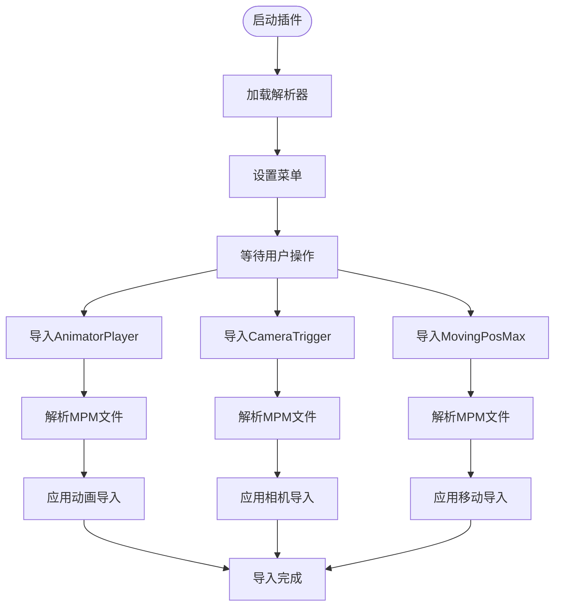
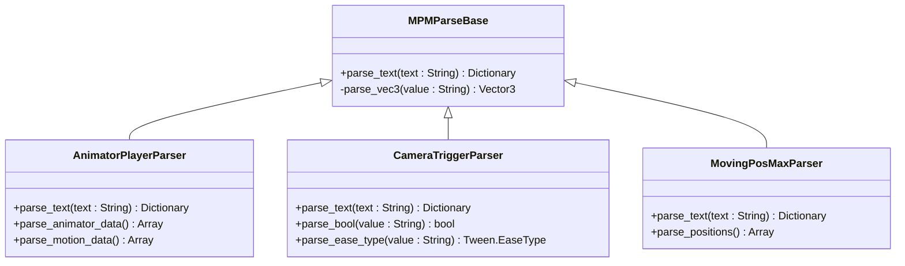
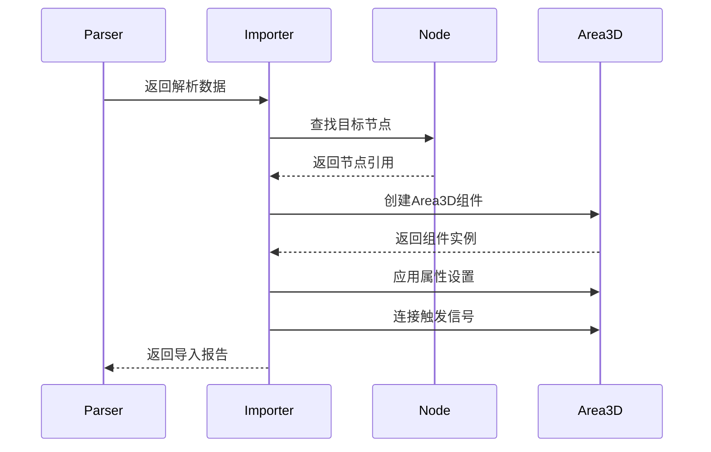

# SaveKit保存系统

<cite>
**本文档引用的文件**
- [README.md](file://README.md)
- [project.godot](file://project.godot)
- [State.gd](file://#Template/[Scripts]/State.gd)
- [Checkpoint.gd](file://#Template/[Scripts]/Trigger/Checkpoint.gd)
- [MainLine.gd](file://#Template/[Scripts]/Level/MainLine.gd)
- [RoadMaker.gd](file://#Template/[Scripts]/Level/RoadMaker.gd)
- [plugin.cfg](file://addons/mpm_importer/plugin.cfg)
- [importer_plugin.gd](file://addons/mpm_importer/importer_plugin.gd)
- [animatorplayer_importer.gd](file://addons/mpm_importer/animatorplayer_importer.gd)
- [cameratrigger_importer.gd](file://addons/mpm_importer/cameratrigger_importer.gd)
- [movingposmax_importer.gd](file://addons/mpm_importer/movingposmax_importer.gd)
- [animatorplayer_mpm_parser.gd](file://addons/mpm_importer/animatorplayer_mpm_parser.gd)
- [cameratrigger_mpm_parser.gd](file://addons/mpm_importer/cameratrigger_mpm_parser.gd)
- [movingposmax_mpm_parser.gd](file://addons/mpm_importer/movingposmax_mpm_parser.gd)
- [MovingPosPoint.gd](file://addons/mpm_importer/MovingPosPoint.gd)
- [customanimplay.gd](file://#Template/[Scripts]/Trigger/customanimplay.gd)
- [CameraTrigger.gd](file://#Template/[Scripts]/CameraScripts/CameraTrigger.gd)
- [MovingPosMax.gd](file://#Template/[Scripts]/Animator/MovingPosMax.gd)
</cite>

## 更新摘要
**所做更改**
- 新增MPM导入器插件作为开发工具部分的说明
- 添加了MPM文件格式解析器和导入器的详细技术文档
- 更新了项目现状说明，反映新增的开发工具插件
- 新增了MPM导入器的架构图和使用流程说明

## 目录
1. [简介](#简介)
2. [项目现状](#项目现状)
3. [MPM导入器插件](#mpm导入器插件)
4. [替代方案](#替代方案)
5. [现有保存机制](#现有保存机制)
6. [MPM文件格式规范](#mpm文件格式规范)
7. [导入器架构设计](#导入器架构设计)
8. [使用指南](#使用指南)
9. [结论](#结论)

## 简介

SaveKit是一个为Godot引擎4.x开发的完整保存系统解决方案。该系统提供了灵活的序列化和反序列化功能，支持多种数据格式（JSON和二进制），能够保存和加载场景树中的节点状态以及用户定义的资源数据。

**更新** 该系统现已从当前代码库中完全移除，相关内容已被新的保存机制替代。同时，项目新增了MPM导入器插件作为开发工具的一部分，用于从Unity导出的MPM文件导入到Godot项目中。

## 项目现状

根据最新的代码库分析，SaveKit保存系统已完全从项目中移除，但新增了MPM导入器插件作为开发工具。当前项目中不存在任何与SaveKit相关的文件或组件，但包含了完整的MPM导入器生态系统。

### 当前保存机制

项目目前采用简化的状态管理机制：



**图表来源**
- [State.gd:1-159](file://#Template/[Scripts]/State.gd#L1-L159)
- [Checkpoint.gd:1-218](file://#Template/[Scripts]/Trigger/Checkpoint.gd#L1-L218)
- [MainLine.gd:1-230](file://#Template/[Scripts]/Level/MainLine.gd#L1-L230)
- [RoadMaker.gd:1-46](file://#Template/[Scripts]/Level/RoadMaker.gd#L1-L46)

### MPM导入器插件

新增的MPM导入器插件提供了从Unity导出的MPM文件导入到Godot的功能：



**图表来源**
- [importer_plugin.gd:1-218](file://addons/mpm_importer/importer_plugin.gd#L1-L218)
- [animatorplayer_mpm_parser.gd:1-57](file://addons/mpm_importer/animatorplayer_mpm_parser.gd#L1-L57)
- [cameratrigger_mpm_parser.gd:1-73](file://addons/mpm_importer/cameratrigger_mpm_parser.gd#L1-L73)
- [movingposmax_mpm_parser.gd:1-55](file://addons/mpm_importer/movingposmax_mpm_parser.gd#L1-L55)

## MPM导入器插件

### 插件概述

MPM导入器插件是一个专门为Godot引擎开发的Unity MPM文件导入工具，支持AnimatorPlayer、CameraTrigger和MovingPosMax三种Unity组件的导入。

**插件配置详情**
- 插件名称：MPM Importer
- 描述：从Unity导入MPM文件到Godot，支持AnimatorPlayer、CameraTrigger和MovingPosMax组件
- 作者：godot-line
- 版本：1.0.0
- 类型：编辑器插件

### 核心功能

1. **多组件支持**
   - AnimatorPlayer动画组件导入
   - CameraTrigger相机触发器导入  
   - MovingPosMax移动路径导入

2. **智能节点匹配**
   - 支持精确路径匹配
   - 提供模糊匹配功能
   - 自动节点名称归一化

3. **坐标系统适配**
   - Unity到Godot坐标转换
   - 支持手动开关坐标修复

### 插件架构



**图表来源**
- [importer_plugin.gd:19-25](file://addons/mpm_importer/importer_plugin.gd#L19-L25)
- [importer_plugin.gd:54-67](file://addons/mpm_importer/importer_plugin.gd#L54-L67)
- [importer_plugin.gd:153-211](file://addons/mpm_importer/importer_plugin.gd#L153-L211)

**章节来源**
- [plugin.cfg:1-8](file://addons/mpm_importer/plugin.cfg#L1-L8)
- [importer_plugin.gd:1-218](file://addons/mpm_importer/importer_plugin.gd#L1-L218)

## 替代方案

由于SaveKit系统已被移除，项目采用了以下替代方案：

### 状态持久化方案

1. **全局状态管理**
   - 使用State.gd集中管理所有可持久化的游戏状态
   - 支持玩家位置、速度、动画时间等关键状态的保存

2. **检查点系统**
   - Checkpoint.gd提供自动检查点功能
   - 支持玩家死亡复活和关卡重试机制

3. **场景数据保存**
   - RoadMaker.gd支持动态生成的道路数据保存
   - 使用Godot原生的ResourceSaver进行序列化

### MPM导入器开发工具

1. **Unity集成**
   - 支持从Unity导出的MPM文件导入
   - 自动适配坐标系统差异
   - 智能节点匹配和错误处理

2. **批量处理**
   - 支持目录级别的批量导入
   - 详细的导入报告和日志输出
   - 错误恢复和继续处理能力

**章节来源**
- [State.gd:1-159](file://#Template/[Scripts]/State.gd#L1-L159)
- [Checkpoint.gd:1-218](file://#Template/[Scripts]/Trigger/Checkpoint.gd#L1-L218)
- [RoadMaker.gd:1-46](file://#Template/[Scripts]/Level/RoadMaker.gd#L1-L46)

## 现有保存机制

### State.gd - 全局状态管理

State.gd提供了完整的状态持久化功能：

- **玩家状态**：位置、速度、旋转、动画时间
- **相机状态**：偏移量、旋转角度、跟随参数
- **游戏进度**：关卡完成度、收集品数量
- **物理参数**：重力设置、玩家初始方向

### Checkpoint.gd - 检查点系统

检查点系统实现了自动保存和加载功能：

- **自动检测**：玩家进入检查点时自动保存状态
- **环境同步**：自动捕获和恢复光照、雾气等环境设置
- **相机跟随**：支持新旧两种相机跟随器的兼容

### RoadMaker.gd - 动态数据保存

支持动态生成内容的保存：

- **道路生成**：保存动态生成的道路网格数据
- **场景打包**：使用PackedScene进行高效序列化
- **资源管理**：自动处理依赖资源的保存和加载

**章节来源**
- [State.gd:1-159](file://#Template/[Scripts]/State.gd#L1-L159)
- [Checkpoint.gd:1-218](file://#Template/[Scripts]/Trigger/Checkpoint.gd#L1-L218)
- [RoadMaker.gd:1-46](file://#Template/[Scripts]/Level/RoadMaker.gd#L1-L46)

## MPM文件格式规范

### 文件结构

MPM文件采用简单的键值对格式，每行包含一个属性定义：

```
hierarchy_path=Player/Character/Animator
component_index=0
local_pos=0,0,0
local_rot=0,0,0
local_scale=1,1,1
box_center=0,0,0
box_size=1,1,1
```

### 动画组件字段

| 字段名 | 类型 | 描述 | 示例 |
|--------|------|------|------|
| hierarchy_path | 字符串 | Unity场景中的节点路径 | "Player/Character/Animator" |
| component_index | 整数 | 组件索引号 | 0 |
| local_pos | 向量 | 本地位置 | "0,0,0" |
| local_rot | 向量 | 本地旋转 | "0,0,0" |
| local_scale | 向量 | 本地缩放 | "1,1,1" |
| box_center | 向量 | 碰撞盒中心 | "0,0,0" |
| box_size | 向量 | 碰撞盒尺寸 | "0,0,0" |
| animator_count | 整数 | 动画师数量 | 1 |
| motion_count | 整数 | 动作数量 | 2 |

### 相机触发器字段

| 字段名 | 类型 | 描述 | 示例 |
|--------|------|------|------|
| set_camera_path | 字符串 | 相机节点路径 | "Camera/CameraFollower" |
| active_position | 布尔 | 是否激活位置调整 | true |
| new_add_position | 向量 | 新位置偏移 | "0,0,0" |
| active_rotate | 布尔 | 是否激活旋转调整 | true |
| new_rotation | 向量 | 新旋转角度 | "0,0,0" |
| ease_type | 字符串 | 缓动类型 | "InOutSine" |
| need_time | 浮点数 | 执行时间 | 1.0 |

### 移动路径字段

| 字段名 | 类型 | 描述 | 示例 |
|--------|------|------|------|
| animation_object_path | 字符串 | 动画对象路径 | "Player/Character" |
| positions_count | 整数 | 路径点数量 | 3 |
| position_i_pos | 向量 | 第i个路径点位置 | "0,0,0" |
| position_i_postime | 浮点数 | 移动到该点的时间 | 1.0 |
| position_i_waittime | 浮点数 | 在该点的等待时间 | 0.0 |

**章节来源**
- [animatorplayer_mpm_parser.gd:4-46](file://addons/mpm_importer/animatorplayer_mpm_parser.gd#L4-L46)
- [cameratrigger_mpm_parser.gd:4-42](file://addons/mpm_importer/cameratrigger_mpm_parser.gd#L4-L42)
- [movingposmax_mpm_parser.gd:4-44](file://addons/mpm_importer/movingposmax_mpm_parser.gd#L4-L44)

## 导入器架构设计

### 解析器模块

解析器负责将MPM文本文件解析为字典格式的数据结构：



**图表来源**
- [animatorplayer_mpm_parser.gd:1-57](file://addons/mpm_importer/animatorplayer_mpm_parser.gd#L1-L57)
- [cameratrigger_mpm_parser.gd:1-73](file://addons/mpm_importer/cameratrigger_mpm_parser.gd#L1-L73)
- [movingposmax_mpm_parser.gd:1-55](file://addons/mpm_importer/movingposmax_mpm_parser.gd#L1-L55)

### 导入器模块

导入器负责将解析后的数据应用到Godot场景中：



**图表来源**
- [animatorplayer_importer.gd:6-42](file://addons/mpm_importer/animatorplayer_importer.gd#L6-L42)
- [cameratrigger_importer.gd:6-42](file://addons/mpm_importer/cameratrigger_importer.gd#L6-L42)
- [movingposmax_importer.gd:7-39](file://addons/mpm_importer/movingposmax_importer.gd#L7-L39)

### 节点匹配算法

导入器实现了智能的节点匹配算法：

1. **精确匹配**：严格按照层级路径查找
2. **模糊匹配**：支持节点名称归一化
3. **回退机制**：当精确匹配失败时使用名称匹配

**章节来源**
- [animatorplayer_importer.gd:44-133](file://addons/mpm_importer/animatorplayer_importer.gd#L44-L133)
- [cameratrigger_importer.gd:44-133](file://addons/mpm_importer/cameratrigger_importer.gd#L44-L133)
- [movingposmax_importer.gd:41-130](file://addons/mpm_importer/movingposmax_importer.gd#L41-L130)

## 使用指南

### 安装和启用

1. **插件安装**
   - 将`addons/mpm_importer`文件夹复制到项目根目录
   - 在`project.godot`中启用插件

2. **插件启用**
   - 在Godot编辑器中打开项目
   - 插件会自动出现在工具栏中
   - 菜单显示为"MPM导入"

### 基本使用流程

1. **设置根节点**
   - 在菜单中选择"设置 animations_root"
   - 输入动画节点的路径
   - 例如："Player/Character/Animations"

2. **设置默认相机**
   - 在菜单中选择"设置 default_camera"
   - 输入相机节点路径
   - 例如："Camera/CameraFollower"

3. **导入文件**
   - 选择相应的导入选项
   - 浏览并选择包含MPM文件的目录
   - 等待导入完成

### 高级功能

1. **坐标转换修复**
   - 在菜单中勾选"坐标转换修复"
   - 自动修正Unity到Godot的坐标差异
   - 包括位置X轴翻转和旋转Y轴翻转

2. **批量处理**
   - 支持目录级别的批量导入
   - 自动过滤.MPM文件
   - 详细的导入统计信息

3. **错误处理**
   - 详细的错误报告
   - 缺失节点的警告信息
   - 导入失败的详细原因

**章节来源**
- [importer_plugin.gd:87-102](file://addons/mpm_importer/importer_plugin.gd#L87-L102)
- [importer_plugin.gd:153-211](file://addons/mpm_importer/importer_plugin.gd#L153-L211)

## 结论

SaveKit保存系统的移除标志着项目向更简洁、更高效的架构转变，同时新增的MPM导入器插件为开发者提供了强大的Unity集成能力：

### 主要变化

1. **简化架构**：从复杂的序列化系统转向简化的状态管理
2. **性能提升**：减少了序列化/反序列化开销
3. **维护成本降低**：减少了第三方组件的依赖
4. **学习曲线降低**：新的系统更容易理解和维护
5. **开发工具增强**：新增MPM导入器插件提升开发效率

### 新系统优势

- **轻量级**：仅包含必要的保存功能
- **稳定可靠**：基于Godot原生API实现
- **易于扩展**：可以根据需要添加新的保存功能
- **兼容性强**：与Godot引擎版本升级兼容
- **开发友好**：MPM导入器简化了Unity内容迁移

### 未来发展方向

虽然SaveKit已被移除，但项目保留了扩展保存功能的可能性。MPM导入器插件的成功实施证明了项目在工具链建设方面的潜力，未来可以考虑：

1. **更多格式支持**：扩展支持其他Unity导出格式
2. **自动化工作流**：集成到CI/CD流程中
3. **实时同步**：支持Unity和Godot之间的实时内容同步
4. **云端协作**：支持多人团队的协同开发

**章节来源**
- [README.md:1-102](file://README.md#L1-L102)
- [project.godot:29-31](file://project.godot#L29-L31)
- [plugin.cfg:1-8](file://addons/mpm_importer/plugin.cfg#L1-L8)