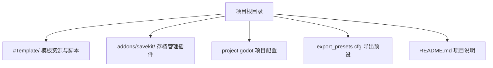
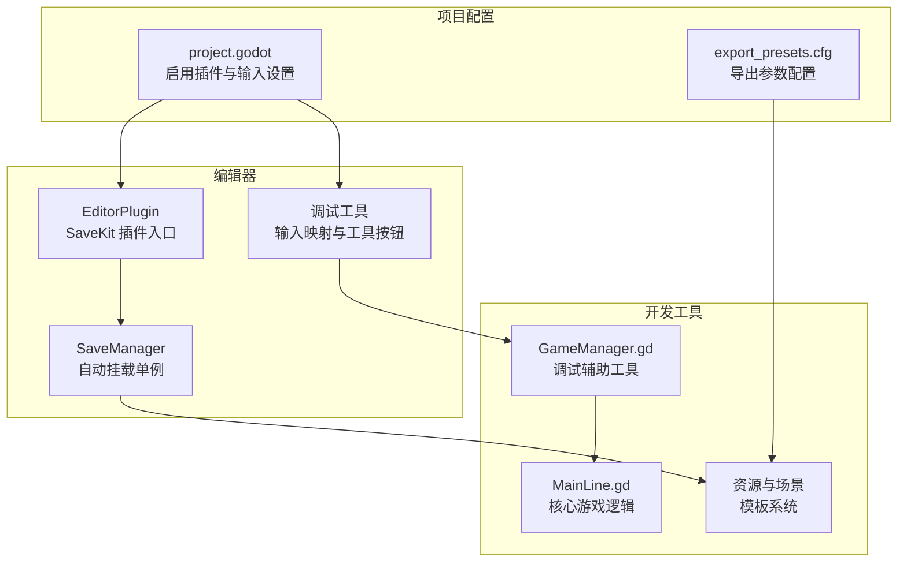
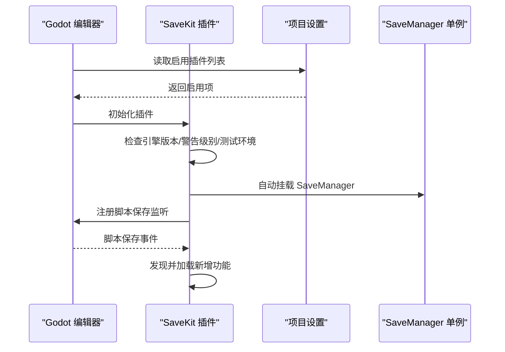
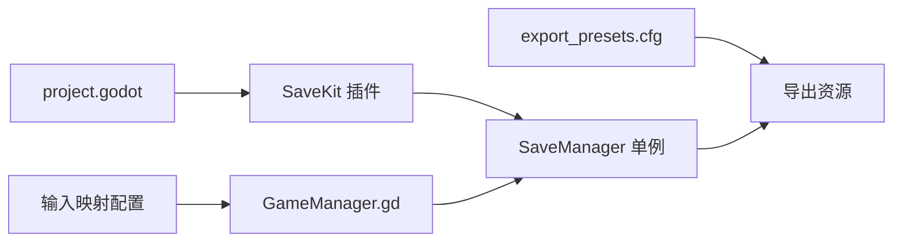

# 开发工具

<cite>
**本文引用的文件列表**
- [README.md](file://README.md)
- [project.godot](file://project.godot)
- [export_presets.cfg](file://export_presets.cfg)
- [addons/savekit/plugin.cfg](file://addons/savekit/plugin.cfg)
- [addons/savekit/plugin.gd](file://addons/savekit/plugin.gd)
- [CONTRIBUTING.md](file://CONTRIBUTING.md)
- [#Template/[Scripts]/MainLine.gd](file://#Template/[Scripts]/Level/MainLine.gd)
- [#Template/[Scripts]/GameManager.gd](file://#Template/[Scripts]/GameManager.gd)
</cite>

## 目录
1. [简介](#简介)
2. [项目结构](#项目结构)
3. [核心组件](#核心组件)
4. [架构总览](#架构总览)
5. [详细组件分析](#详细组件分析)
6. [依赖关系分析](#依赖关系分析)
7. [性能考量](#性能考量)
8. [故障排查指南](#故障排查指南)
9. [结论](#结论)
10. [附录](#附录)

## 简介
本指南面向使用 Godot Line 模板进行开发的工程师，围绕以下目标展开：
- 介绍 Godot 编辑器插件的安装与启用方法
- 提供调试工具的配置与使用方法
- 说明性能分析与优化工具的使用要点
- 说明多平台导出配置与发布流程
- 为开发者提供高效开发环境配置与工具使用指导

**重要更新**：本版本移除了 gdUnit4 测试框架相关内容，项目现已专注于核心开发工具链的使用与优化。

## 项目结构
本项目采用"模板+插件"的组织方式，核心目录与职责如下：
- #Template/：模板资源与脚本，包含场景、材质、脚本等
- addons/savekit/：SaveKit 存档管理插件
- project.godot：Godot 项目配置文件
- export_presets.cfg：多平台导出预设
- README.md：项目说明与快速开始

图表来源
- [project.godot](file://project.godot)
- [export_presets.cfg](file://export_presets.cfg)
- [README.md](file://README.md)

章节来源
- [README.md:52-61](file://README.md#L52-L61)
- [project.godot:33-35](file://project.godot#L33-L35)
- [export_presets.cfg:1-75](file://export_presets.cfg#L1-L75)

## 核心组件
- SaveKit 存档管理插件
  - 通过项目配置启用插件，编辑器启动后自动挂载 SaveManager 单例
  - 提供游戏存档与读档功能，支持二进制和 JSON 序列化格式
  - 插件会在特定条件下拒绝加载（如引擎版本过低、脚本警告级别与插件不兼容等），并在日志中提示
- 调试工具与输入映射
  - project.godot 中定义了输入动作（如转向、重试、保存、重载、保存锥体等），可在运行时通过按键触发调试行为
  - GameManager.gd 提供工具按钮与原点位置设置，辅助定位与过渡动画
- 导出与发布
  - 通过 export_presets.cfg 配置不同平台的导出参数，支持 Windows 桌面端
  - 包含纹理格式、打包策略、二进制架构等导出参数

章节来源
- [addons/savekit/plugin.gd:7-11](file://addons/savekit/plugin.gd#L7-L11)
- [project.godot:37-64](file://project.godot#L37-L64)
- [README.md:42-51](file://README.md#L42-L51)
- [export_presets.cfg:1-75](file://export_presets.cfg#L1-L75)

## 架构总览
下图展示编辑器插件与开发工具在项目中的交互关系，以及开发工作流。

图表来源
- [addons/savekit/plugin.gd:7-11](file://addons/savekit/plugin.gd#L7-L11)
- [project.godot:33-35](file://project.godot#L33-L35)
- [project.godot:37-64](file://project.godot#L37-L64)
- [export_presets.cfg:1-75](file://export_presets.cfg#L1-L75)

## 详细组件分析

### SaveKit 存档管理插件安装与启用
- 启用方式
  - 在项目配置中将插件加入启用列表，编辑器重启后生效
- 插件行为
  - 加载时会检查引擎版本、脚本警告级别、是否处于测试环境等条件
  - 成功加载后自动挂载 SaveManager 单例，提供全局存档管理服务
  - 监听脚本保存事件以发现新增测试
- 常见问题
  - 若脚本警告级别与插件不兼容，插件会拒绝加载并打印错误提示
  - 若引擎版本过低，插件不会加载并提示所需版本

图表来源
- [addons/savekit/plugin.gd:7-11](file://addons/savekit/plugin.gd#L7-L11)
- [project.godot:33-35](file://project.godot#L33-L35)

章节来源
- [addons/savekit/plugin.cfg:1-8](file://addons/savekit/plugin.cfg#L1-L8)
- [addons/savekit/plugin.gd:7-11](file://addons/savekit/plugin.gd#L7-L11)
- [project.godot:33-35](file://project.godot#L33-L35)

### 调试工具配置与使用
- 输入映射与调试
  - project.godot 中定义了输入动作（如转向、重试、保存、重载、保存锥体等），可在运行时通过按键触发调试行为
  - 支持鼠标左键和空格键控制转向，R 键重试，S/Q/W 键分别用于保存进度、重载关卡、保存锥体配置
- 场景与节点调试
  - GameManager.gd 提供工具按钮与原点位置设置，辅助定位与过渡动画
  - 支持 @export_tool_button 装饰器创建可视化调试按钮
  - 提供 calculate_anim_start_time 方法计算动画开始时间
- 日志与报告
  - 通过 print 函数输出调试信息到编辑器控制台
  - 支持原点位置设置和获取功能

章节来源
- [project.godot:37-64](file://project.godot#L37-L64)
- [#Template/[Scripts]/GameManager.gd:19-49](file://#Template/[Scripts]/GameManager.gd#L19-L49)
- [README.md:42-51](file://README.md#L42-L51)

### 性能分析与优化工具使用
- 物理与渲染配置
  - project.godot 中启用了 3D 物理线程、Jolt 物理引擎、移动渲染器等选项，有助于提升运行时性能
  - 物理层配置支持 MainLine、BaseFloor、BaseWall 等碰撞层设置
- 动画与粒子
  - MainLine.gd 使用 AnimationPlayer 控制动画播放与跳转，LandEffect 使用 GPU 粒子表现落地效果
  - 这些节点的性能可通过项目设置与资源压缩进一步优化
- 导出优化
  - export_presets.cfg 中包含纹理格式、打包策略、二进制架构等导出参数
  - 支持 S3TC/BPTC 纹理格式和 ZSTD 压缩算法
  - 可根据目标平台调整以平衡体积与性能

章节来源
- [project.godot:72-80](file://project.godot#L72-L80)
- [export_presets.cfg:25-75](file://export_presets.cfg#L25-L75)

### 多平台导出配置与发布流程
- 导出预设
  - export_presets.cfg 定义了 Windows 桌面端导出参数，包含二进制架构、纹理格式、打包策略、应用信息等
  - 支持自定义模板路径和加密选项
- 发布流程建议
  - 在编辑器中选择对应预设并导出
  - 如需自动化，可结合现有脚本思路，将导出命令纳入 CI/CD 流水线
  - 建议在导出前进行性能基准测试，确保游戏在目标平台上的流畅运行

章节来源
- [export_presets.cfg:1-75](file://export_presets.cfg#L1-L75)

## 依赖关系分析
- 插件依赖
  - SaveKit 插件通过 project.godot 的 editor_plugins.enabled 字段启用
  - 插件自身在 _enter_tree 中初始化检查器与控制台，并注册上下文菜单
- 调试依赖
  - 调试工具依赖 GameManager.gd 提供的节点引用和工具按钮
  - 输入映射配置依赖 project.godot 的 input 部分设置
- 导出依赖
  - 导出过程依赖 export_presets.cfg 中的预设配置
  - 资源优化依赖项目中的纹理压缩和打包策略

图表来源
- [project.godot:33-35](file://project.godot#L33-L35)
- [addons/savekit/plugin.gd:7-11](file://addons/savekit/plugin.gd#L7-L11)
- [project.godot:37-64](file://project.godot#L37-L64)
- [export_presets.cfg:1-75](file://export_presets.cfg#L1-L75)

章节来源
- [project.godot:33-35](file://project.godot#L33-L35)
- [addons/savekit/plugin.gd:7-11](file://addons/savekit/plugin.gd#L7-L11)
- [project.godot:37-64](file://project.godot#L37-L64)
- [export_presets.cfg:1-75](file://export_presets.cfg#L1-L75)

## 性能考量
- 物理与渲染
  - 启用物理线程与 Jolt 物理引擎可提升物理模拟性能
  - 移动渲染器与 VRAM 压缩适合移动端与低端设备
- 资源与导出
  - 调整纹理格式与打包策略，减少包体大小
  - 根据目标平台选择合适的二进制架构与压缩等级
- 动画与粒子
  - 合理使用 AnimationPlayer 与 GPU 粒子，避免过度绘制
  - 在测试与发布前进行帧率与内存占用的基准测试

章节来源
- [project.godot:72-80](file://project.godot#L72-L80)
- [export_presets.cfg:25-75](file://export_presets.cfg#L25-L75)

## 故障排查指南
- 插件无法加载
  - 检查引擎版本是否满足最低要求
  - 检查脚本警告级别设置，确保与插件兼容
  - 查看编辑器输出日志，确认插件加载失败原因
- 调试工具异常
  - 使用命令行无头模式运行测试，观察返回码与日志
  - 确认输入映射配置正确
  - 检查 GameManager.gd 中的节点引用是否有效
- 导出失败
  - 检查 export_presets.cfg 中的导出参数与目标平台匹配情况
  - 确认应用图标、产品信息等必要字段已正确填写

章节来源
- [addons/savekit/plugin.gd:7-11](file://addons/savekit/plugin.gd#L7-L11)
- [project.godot:37-64](file://project.godot#L37-L64)
- [export_presets.cfg:1-75](file://export_presets.cfg#L1-L75)

## 结论
本指南梳理了 Godot Line 模板的开发工具链：从编辑器插件启用、调试工具使用、性能优化，到多平台导出与发布流程。建议开发者在日常开发中：
- 优先使用 SaveKit 进行游戏存档管理，确保数据持久化功能稳定
- 利用编辑器面板与输入映射进行快速调试
- 在导出前进行性能基准测试，结合项目设置与导出参数优化
- 将调试与导出流程纳入 CI/CD，提升交付效率与质量

## 附录
- 快速开始
  - 克隆仓库后在 Godot 中打开项目，按 F5 运行主场景
  - 在编辑器底部面板打开"gdUnitConsole"，在"GdUnit"检查器中选择测试运行
- 命令行测试
  - 使用 --headless --run-tests 运行所有测试
  - 使用 runtest.cmd（Windows）或 runtest.sh（Unix/Linux/Mac）执行测试并生成报告

章节来源
- [README.md:18-40](file://README.md#L18-L40)