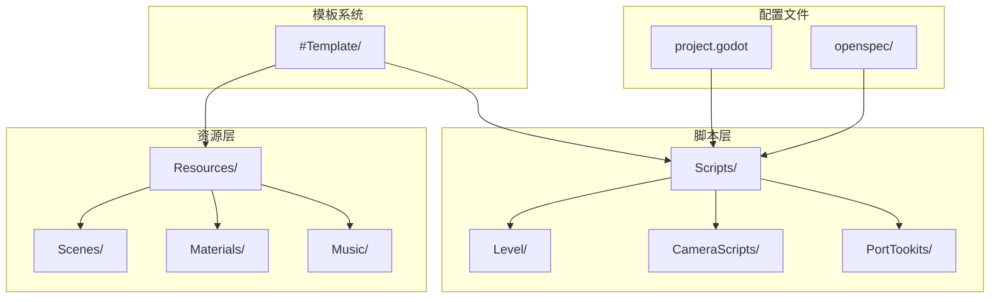
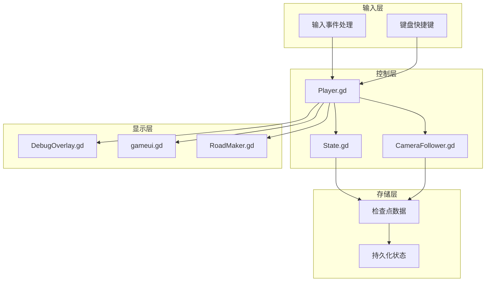
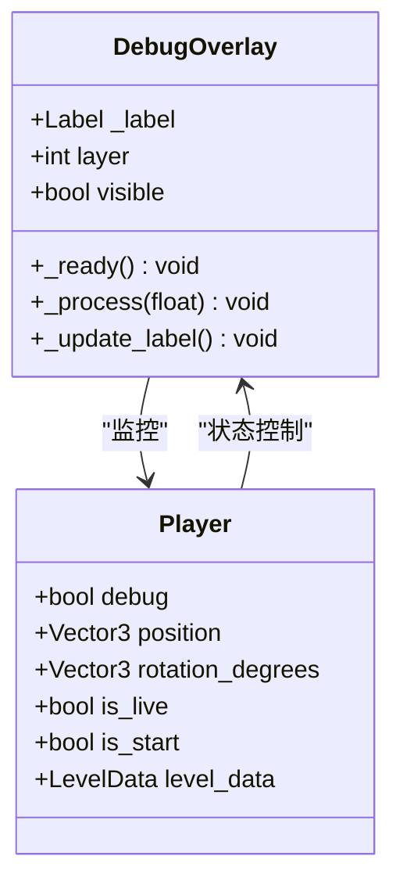
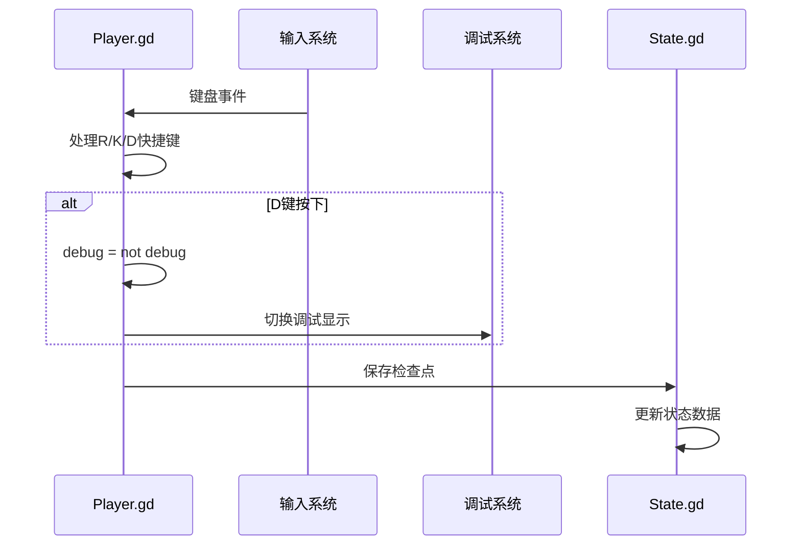
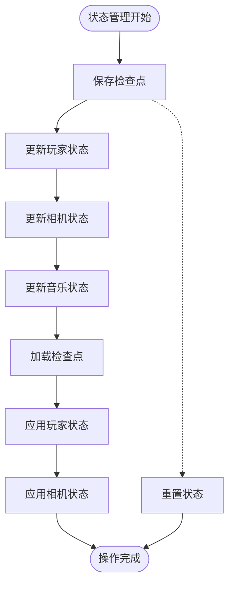
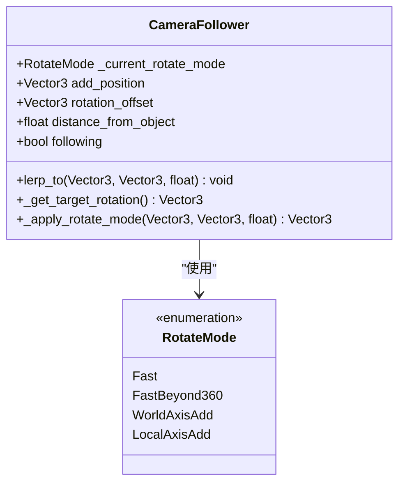
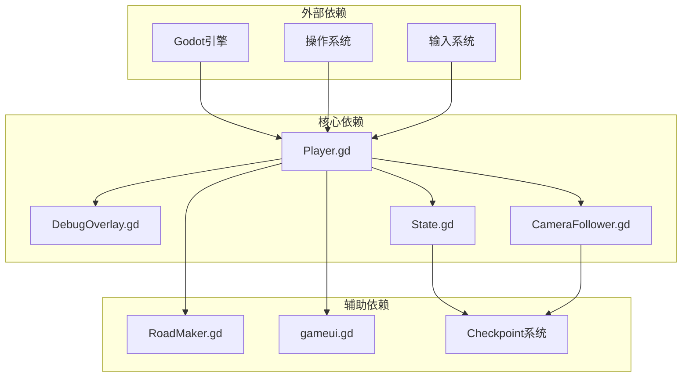

# 调试覆盖系统

<cite>
**本文档引用的文件**
- [README.md](file://README.md)
- [DebugOverlay.gd](file://#Template/[Scripts]/Level/DebugOverlay.gd)
- [Player.gd](file://#Template/[Scripts]/Level/Player.gd)
- [gameui.gd](file://#Template/[Scripts]/Level/gameui.gd)
- [RoadMaker.gd](file://#Template/[Scripts]/Level/RoadMaker.gd)
- [State.gd](file://#Template/[Scripts]/State.gd)
- [CameraFollower.gd](file://#Template/[Scripts]/CameraScripts/CameraFollower.gd)
- [DebugOverlay.tscn](file://#Template/[Resources]/DebugOverlay.tscn)
- [project.godot](file://project.godot)
- [proposal.md](file://openspec/changes/archive/2026-04-18-port-keyboard-shortcuts/proposal.md)
- [tasks.md](file://openspec/changes/archive/2026-04-18-port-keyboard-shortcuts/tasks.md)
- [spec.md](file://openspec/changes/archive/2026-04-18-port-keyboard-shortcuts/specs/keyboard-shortcuts/spec.md)
</cite>

## 目录
1. [简介](#简介)
2. [项目结构](#项目结构)
3. [核心组件](#核心组件)
4. [架构概览](#架构概览)
5. [详细组件分析](#详细组件分析)
6. [依赖关系分析](#依赖关系分析)
7. [性能考虑](#性能考虑)
8. [故障排除指南](#故障排除指南)
9. [结论](#结论)

## 简介

调试覆盖系统是Godot Line模板中的一个关键开发工具，它提供了一个实时的调试界面，帮助开发者监控游戏运行时的状态信息。该系统包括键盘快捷键支持、实时状态显示、检查点系统集成等功能，为游戏开发和测试提供了全面的调试能力。

该系统的设计目标是在不干扰正常游戏体验的前提下，为开发者提供必要的调试信息，同时确保在发布版本中不会影响玩家的游戏体验。

## 项目结构

Godot Line项目采用模块化的组织结构，调试覆盖系统主要分布在以下目录中：

**图表来源**
- [README.md:52-61](file://README.md#L52-L61)
- [project.godot:1-72](file://project.godot#L1-L72)

**章节来源**
- [README.md:52-61](file://README.md#L52-L61)
- [project.godot:1-72](file://project.godot#L1-L72)

## 核心组件

调试覆盖系统由多个相互协作的组件组成，每个组件都有特定的功能和职责：

### 调试覆盖组件

| 组件 | 文件 | 功能描述 |
|------|------|----------|
| 调试覆盖脚本 | DebugOverlay.gd | 实时显示游戏状态信息的CanvasLayer组件 |
| 玩家控制器 | Player.gd | 游戏主控制器，包含调试开关和键盘快捷键处理 |
| 状态管理器 | State.gd | 全局状态管理，支持检查点保存和恢复 |
| 相机跟随器 | CameraFollower.gd | 相机控制系统，支持检查点恢复 |
| UI控制器 | gameui.gd | 用户界面管理，处理游戏结束和复活逻辑 |
| 道路生成器 | RoadMaker.gd | 动态道路生成系统 |

**章节来源**
- [DebugOverlay.gd:1-66](file://#Template/[Scripts]/Level/DebugOverlay.gd#L1-L66)
- [Player.gd:1-246](file://#Template/[Scripts]/Level/Player.gd#L1-L246)
- [State.gd:1-159](file://#Template/[Scripts]/State.gd#L1-L159)
- [CameraFollower.gd:1-150](file://#Template/[Scripts]/CameraScripts/CameraFollower.gd#L1-L150)

## 架构概览

调试覆盖系统的整体架构采用了分层设计，确保各组件之间的松耦合和高内聚：

**图表来源**
- [Player.gd:116-133](file://#Template/[Scripts]/Level/Player.gd#L116-L133)
- [DebugOverlay.gd:20-25](file://#Template/[Scripts]/Level/DebugOverlay.gd#L20-L25)
- [State.gd:52-80](file://#Template/[Scripts]/State.gd#L52-L80)

## 详细组件分析

### 调试覆盖脚本 (DebugOverlay.gd)

DebugOverlay.gd是调试系统的核心组件，负责实时显示各种游戏状态信息：

**图表来源**
- [DebugOverlay.gd:1-66](file://#Template/[Scripts]/Level/DebugOverlay.gd#L1-L66)
- [Player.gd:44-44](file://#Template/[Scripts]/Level/Player.gd#L44-L44)

调试覆盖脚本的主要功能包括：
- 实时显示帧率(FPS)
- 显示关卡进度百分比和时间
- 显示游戏状态(等待/进行中/死亡)
- 显示玩家位置和朝向
- 显示收集物品数量(钻石和皇冠)
- 显示相机相关信息

**章节来源**
- [DebugOverlay.gd:27-65](file://#Template/[Scripts]/Level/DebugOverlay.gd#L27-L65)

### 玩家控制器 (Player.gd)

Player.gd作为游戏的主控制器，集成了调试功能和键盘快捷键支持：

**图表来源**
- [Player.gd:116-133](file://#Template/[Scripts]/Level/Player.gd#L116-L133)
- [Player.gd:134-140](file://#Template/[Scripts]/Level/Player.gd#L134-L140)

Player.gd中的调试相关功能：
- 调试模式切换(D键)
- 场景重启(R键)
- 立即死亡(K键)
- 检查点保存和恢复

**章节来源**
- [Player.gd:116-133](file://#Template/[Scripts]/Level/Player.gd#L116-L133)
- [proposal.md:10-17](file://openspec/changes/archive/2026-04-18-port-keyboard-shortcuts/proposal.md#L10-L17)

### 状态管理系统 (State.gd)

State.gd提供了完整的状态管理功能，支持游戏状态的保存和恢复：

**图表来源**
- [State.gd:52-80](file://#Template/[Scripts]/State.gd#L52-L80)
- [State.gd:86-95](file://#Template/[Scripts]/State.gd#L86-L95)

状态管理的关键功能：
- 玩家变换矩阵保存
- 相机跟随器状态保存
- 音乐播放状态保存
- 检查点数据的序列化和反序列化

**章节来源**
- [State.gd:1-159](file://#Template/[Scripts]/State.gd#L1-L159)

### 相机跟随器 (CameraFollower.gd)

CameraFollower.gd实现了复杂的相机跟随算法，支持多种旋转模式：

**图表来源**
- [CameraFollower.gd:6-11](file://#Template/[Scripts]/CameraScripts/CameraFollower.gd#L6-L11)
- [CameraFollower.gd:135-149](file://#Template/[Scripts]/CameraScripts/CameraFollower.gd#L135-L149)

相机跟随器的旋转模式：
- Fast: 最短路径旋转
- FastBeyond360: 允许超过360度的旋转
- WorldAxisAdd: 世界坐标系基于当前旋转增加
- LocalAxisAdd: 本地坐标系基于当前旋转增加

**章节来源**
- [CameraFollower.gd:1-150](file://#Template/[Scripts]/CameraScripts/CameraFollower.gd#L1-L150)

## 依赖关系分析

调试覆盖系统的依赖关系展现了清晰的层次结构：

**图表来源**
- [Player.gd:60-63](file://#Template/[Scripts]/Level/Player.gd#L60-L63)
- [DebugOverlay.gd:20-25](file://#Template/[Scripts]/Level/DebugOverlay.gd#L20-L25)

**章节来源**
- [Player.gd:60-63](file://#Template/[Scripts]/Level/Player.gd#L60-L63)
- [DebugOverlay.gd:20-25](file://#Template/[Scripts]/Level/DebugOverlay.gd#L20-L25)

## 性能考虑

调试覆盖系统在设计时充分考虑了性能影响，采用了多种优化策略：

### 实时更新优化
- 调试信息仅在调试模式下更新
- 使用高效的字符串拼接方法
- 避免不必要的节点查找操作

### 内存管理
- 使用对象池模式管理调试标签
- 及时清理不再使用的调试数据
- 避免内存泄漏的资源管理

### 渲染优化
- 调试界面使用CanvasLayer，不影响3D渲染
- 仅在需要时创建调试覆盖实例
- 优化字体渲染参数

## 故障排除指南

### 常见问题及解决方案

| 问题 | 症状 | 解决方案 |
|------|------|----------|
| 调试信息不显示 | D键无反应 | 检查是否在调试构建中运行 |
| 键盘快捷键无效 | R/K/D键无响应 | 验证project.godot中的输入映射 |
| 检查点恢复失败 | 场景重载后状态异常 | 检查State.checkpoint数据完整性 |
| 相机跟随异常 | 相机位置不正确 | 验证CameraFollower配置参数 |

### 调试技巧

1. **状态监控**: 使用调试覆盖实时监控关键游戏状态
2. **性能分析**: 通过FPS显示监控游戏性能
3. **位置追踪**: 利用玩家坐标信息调试碰撞检测
4. **相机调试**: 通过相机参数调整视角效果

**章节来源**
- [tasks.md:19-24](file://openspec/changes/archive/2026-04-18-port-keyboard-shortcuts/tasks.md#L19-L24)
- [spec.md:45-52](file://openspec/changes/archive/2026-04-18-port-keyboard-shortcuts/specs/keyboard-shortcuts/spec.md#L45-L52)

## 结论

调试覆盖系统为Godot Line模板提供了完整的开发调试解决方案。通过精心设计的架构和实现，该系统在提供强大调试功能的同时，确保了对游戏性能和用户体验的最小影响。

系统的主要优势包括：
- **模块化设计**: 各组件职责明确，易于维护和扩展
- **性能优化**: 采用多种优化策略减少性能开销
- **用户友好**: 提供直观的调试界面和快捷键支持
- **可靠性**: 完善的错误处理和状态管理机制

该系统为后续的功能扩展和功能增强奠定了坚实的基础，是Godot Line模板的重要组成部分。