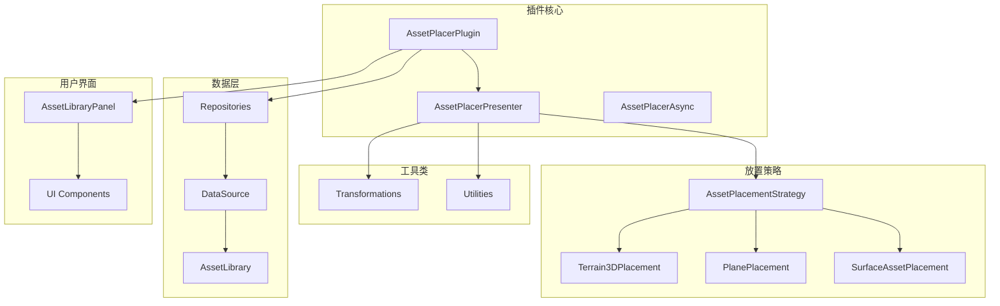
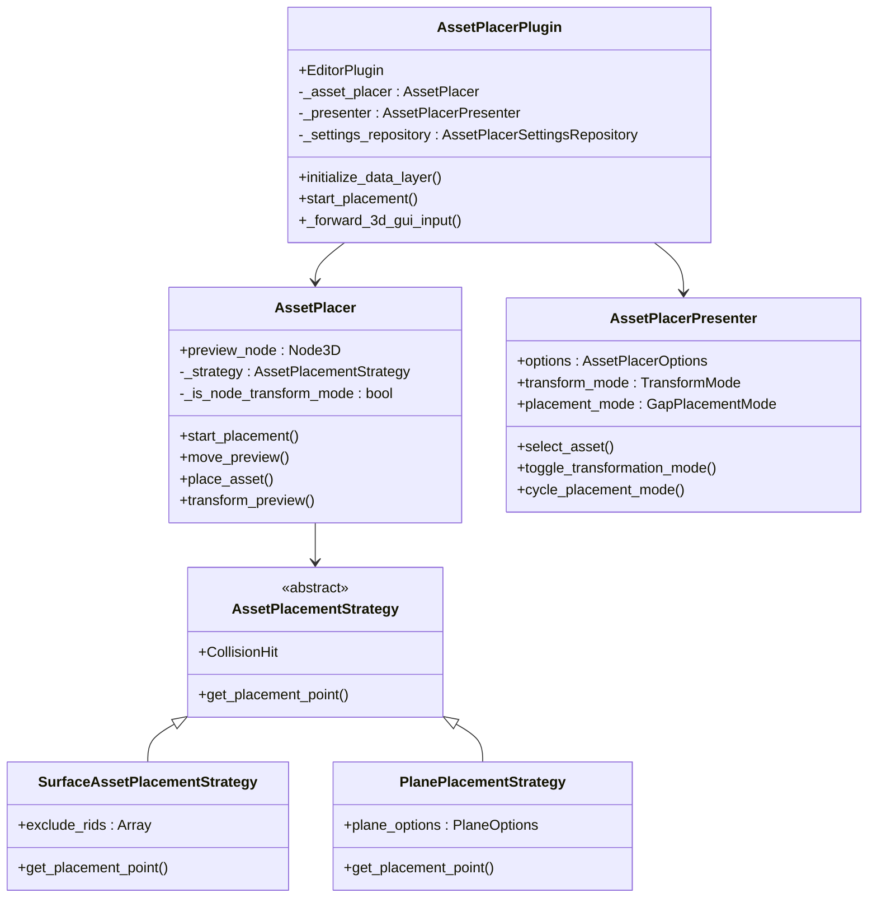
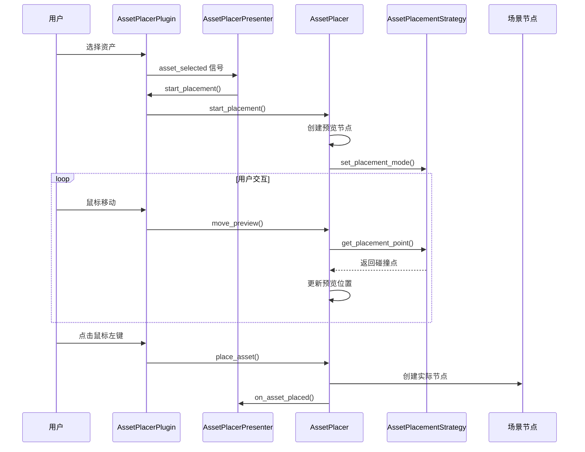
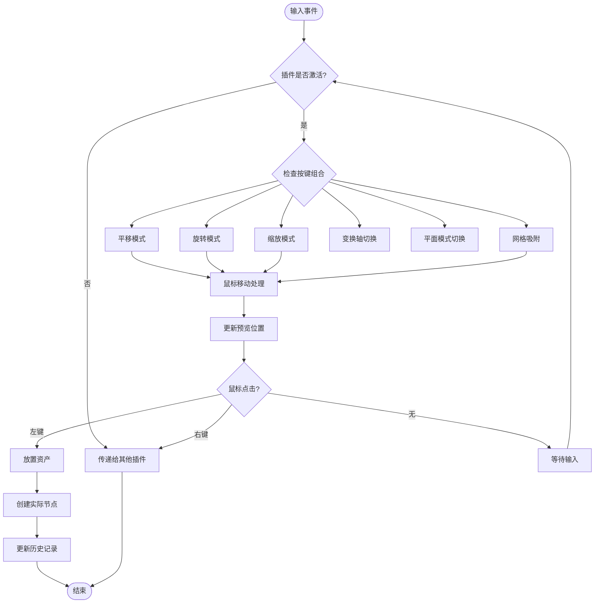
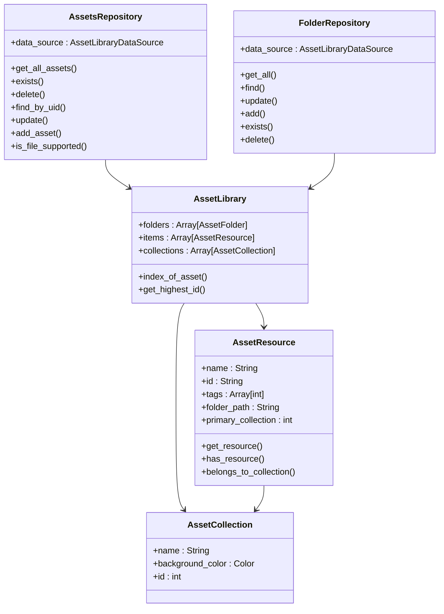
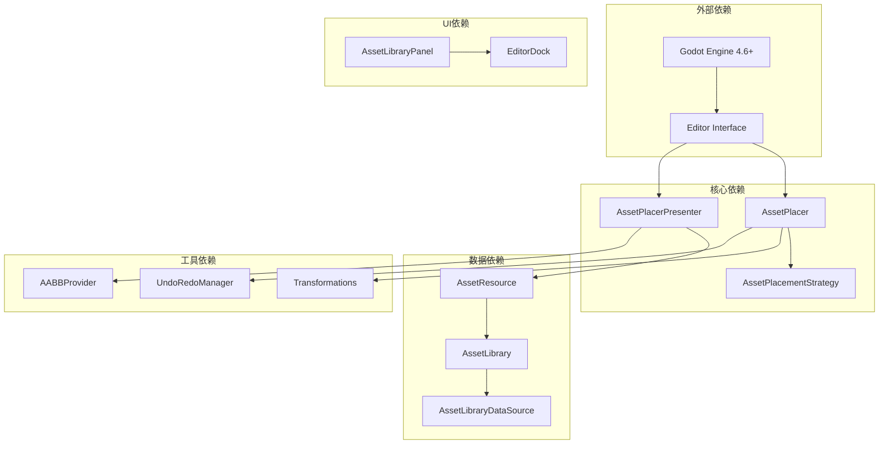

# 资产放置插件

<cite>
**本文档引用的文件**
- [asset_placer_plugin.gd](file://addons/asset_placer/asset_placer_plugin.gd)
- [asset_placer.gd](file://addons/asset_placer/asset_placer.gd)
- [asset_placer_presenter.gd](file://addons/asset_placer/asset_placer_presenter.gd)
- [plugin.cfg](file://addons/asset_placer/plugin.cfg)
- [asset_library.gd](file://addons/asset_placer/data/asset_library.gd)
- [assets_repository.gd](file://addons/asset_placer/data/assets_repository.gd)
- [folder_repository.gd](file://addons/asset_placer/data/folder/folder_repository.gd)
- [asset_resource.gd](file://addons/asset_placer/data/asset_resource.gd)
- [assets_collection.gd](file://addons/asset_placer/data/assets_collection.gd)
- [asset_placement_strategy.gd](file://addons/asset_placer/placement/asset_placement_strategy.gd)
- [plane_placement_strategy.gd](file://addons/asset_placer/placement/plane_placement_strategy.gd)
- [surface_asset_placement_strategy.gd](file://addons/asset_placer/placement/surface_asset_placement_strategy.gd)
- [asset_library_panel.gd](file://addons/asset_placer/ui/asset_library_panel.gd)
- [README.md](file://README.md)
</cite>

## 目录
1. [简介](#简介)
2. [项目结构](#项目结构)
3. [核心组件](#核心组件)
4. [架构概览](#架构概览)
5. [详细组件分析](#详细组件分析)
6. [依赖关系分析](#依赖关系分析)
7. [性能考虑](#性能考虑)
8. [故障排除指南](#故障排除指南)
9. [结论](#结论)

## 简介

Godot 资产放置插件是一个专为 Godot Engine 4.6+ 设计的强大工具，旨在简化 3D 场景中的资产管理和放置过程。该插件提供了直观的界面和丰富的功能，包括：

- **智能资产库管理**：支持多种 3D 资源格式（TSCN、GLB、FBX、OBJ、GLTF、BLEND、SCN）
- **多模式放置策略**：表面贴放、平面放置和地形 3D 放置
- **实时预览系统**：提供透明的资产预览和实时变换
- **高级变换功能**：支持平移、旋转、缩放和网格吸附
- **自动分组和管理**：智能资产分类和组织
- **撤销/重做支持**：完整的编辑历史记录

该插件通过直观的键盘快捷键和鼠标操作，为开发者提供了高效的 3D 场景构建体验。

## 项目结构

插件采用模块化的架构设计，主要分为以下几个核心部分：

**图表来源**
- [asset_placer_plugin.gd:1-291](file://addons/asset_placer/asset_placer_plugin.gd#L1-L291)
- [asset_placer_presenter.gd:1-297](file://addons/asset_placer/asset_placer_presenter.gd#L1-L297)
- [asset_placement_strategy.gd:1-19](file://addons/asset_placer/placement/asset_placement_strategy.gd#L1-L19)

**章节来源**
- [asset_placer_plugin.gd:1-291](file://addons/asset_placer/asset_placer_plugin.gd#L1-L291)
- [plugin.cfg:1-8](file://addons/asset_placer/plugin.cfg#L1-L8)

## 核心组件

### 资产放置器 (AssetPlacer)

AssetPlacer 是插件的核心类，负责处理所有资产放置逻辑：

- **预览系统**：创建透明的资产预览，支持实时变换
- **碰撞检测**：与场景中的 3D 对象进行精确的碰撞检测
- **变换管理**：支持平移、旋转、缩放操作
- **撤销/重做**：完整的编辑历史记录支持

### 资产放置演示器 (AssetPlacerPresenter)

Presenter 类管理用户界面状态和用户交互：

- **变换模式**：切换移动、旋转、缩放模式
- **放置模式**：管理不同的放置策略
- **轴选择**：支持 X、Y、Z 轴的独立变换
- **网格吸附**：提供精确的网格对齐功能

### 数据存储层

插件包含完整的数据存储和管理机制：

- **资产资源**：封装和管理各种类型的 3D 资源
- **文件夹管理**：组织和分类资产文件夹
- **集合系统**：支持资产标签和分类管理
- **同步机制**：自动同步项目中的新资产

**章节来源**
- [asset_placer.gd:1-317](file://addons/asset_placer/asset_placer.gd#L1-L317)
- [asset_placer_presenter.gd:1-297](file://addons/asset_placer/asset_placer_presenter.gd#L1-L297)
- [asset_resource.gd:1-77](file://addons/asset_placer/data/asset_resource.gd#L1-L77)

## 架构概览

插件采用 MVC（模型-视图-控制器）架构模式，实现了清晰的关注点分离：

**图表来源**
- [asset_placer_plugin.gd:1-291](file://addons/asset_placer/asset_placer_plugin.gd#L1-L291)
- [asset_placer.gd:1-317](file://addons/asset_placer/asset_placer.gd#L1-L317)
- [asset_placer_presenter.gd:1-297](file://addons/asset_placer/asset_placer_presenter.gd#L1-L297)
- [asset_placement_strategy.gd:1-19](file://addons/asset_placer/placement/asset_placement_strategy.gd#L1-L19)

## 详细组件分析

### 资产放置流程

**图表来源**
- [asset_placer_plugin.gd:172-176](file://addons/asset_placer/asset_placer_plugin.gd#L172-L176)
- [asset_placer.gd:27-40](file://addons/asset_placer/asset_placer.gd#L27-L40)
- [asset_placer.gd:66-96](file://addons/asset_placer/asset_placer.gd#L66-L96)

### 输入处理机制

插件实现了复杂的输入处理系统，支持多种交互方式：

**图表来源**
- [asset_placer_plugin.gd:201-270](file://addons/asset_placer/asset_placer_plugin.gd#L201-L270)
- [asset_placer.gd:120-151](file://addons/asset_placer/asset_placer.gd#L120-L151)

### 资产库管理系统

**图表来源**
- [asset_library.gd:1-33](file://addons/asset_placer/data/asset_library.gd#L1-L33)
- [assets_repository.gd:1-71](file://addons/asset_placer/data/assets_repository.gd#L1-L71)
- [folder_repository.gd:1-70](file://addons/asset_placer/data/folder/folder_repository.gd#L1-L70)
- [asset_resource.gd:1-77](file://addons/asset_placer/data/asset_resource.gd#L1-L77)
- [assets_collection.gd:1-13](file://addons/asset_placer/data/assets_collection.gd#L1-L13)

**章节来源**
- [asset_library.gd:1-33](file://addons/asset_placer/data/asset_library.gd#L1-L33)
- [assets_repository.gd:1-71](file://addons/asset_placer/data/assets_repository.gd#L1-L71)
- [folder_repository.gd:1-70](file://addons/asset_placer/data/folder/folder_repository.gd#L1-L70)

### 放置策略系统

插件支持三种主要的资产放置策略：

#### 表面贴放策略
- **原理**：使用射线投射与场景中的几何体进行碰撞检测
- **适用场景**：标准的地面或墙面放置
- **特点**：支持法线对齐和表面贴合

#### 平面放置策略
- **原理**：在指定的平面上进行投影计算
- **适用场景**：需要精确控制放置高度的场合
- **特点**：支持动态平面调整和网格对齐

#### 地形 3D 放置策略
- **原理**：结合地形高度数据进行精确放置
- **适用场景**：山地或不规则地形的资产放置
- **特点**：自动适应地形起伏

**章节来源**
- [surface_asset_placement_strategy.gd:1-28](file://addons/asset_placer/placement/surface_asset_placement_strategy.gd#L1-L28)
- [plane_placement_strategy.gd:1-25](file://addons/asset_placer/placement/plane_placement_strategy.gd#L1-L25)
- [asset_placement_strategy.gd:1-19](file://addons/asset_placer/placement/asset_placement_strategy.gd#L1-L19)

## 依赖关系分析

插件的依赖关系体现了清晰的层次结构：

**图表来源**
- [asset_placer_plugin.gd:41-122](file://addons/asset_placer/asset_placer_plugin.gd#L41-L122)
- [asset_placer.gd:23-25](file://addons/asset_placer/asset_placer.gd#L23-L25)

**章节来源**
- [asset_placer_plugin.gd:41-122](file://addons/asset_placer/asset_placer_plugin.gd#L41-L122)
- [asset_placer.gd:153-159](file://addons/asset_placer/asset_placer.gd#L153-L159)

## 性能考虑

### 内存管理
- **预览节点池**：避免频繁创建和销毁预览节点
- **资源缓存**：AssetResource 实现了智能的资源加载缓存
- **碰撞检测优化**：使用 RID 排除列表减少不必要的碰撞检测

### 渲染优化
- **透明材质**：预览使用透明材质不影响场景渲染
- **批量更新**：变换操作采用批量应用减少渲染调用
- **延迟加载**：资产资源采用延迟加载策略

### 输入处理优化
- **事件过滤**：只处理必要的输入事件
- **条件检查**：在插件未激活时完全让渡输入控制
- **异步操作**：支持异步资产同步避免阻塞主线程

## 故障排除指南

### 常见问题及解决方案

#### 资产无法加载
**症状**：资产显示为红色或无法预览
**原因**：资源路径无效或文件损坏
**解决方法**：
1. 检查资产文件是否存在
2. 验证文件格式是否受支持
3. 重新导入资产文件

#### 放置位置异常
**症状**：资产放置位置不正确
**原因**：碰撞检测失败或法线方向错误
**解决方法**：
1. 确保场景中有可碰撞的几何体
2. 检查资产的法线方向
3. 调整网格吸附设置

#### 插件无响应
**症状**：点击插件按钮无反应
**原因**：插件初始化失败或与其他插件冲突
**解决方法**：
1. 重启 Godot 编辑器
2. 检查插件配置文件
3. 禁用可能冲突的其他插件

#### 性能问题
**症状**：预览卡顿或响应迟缓
**原因**：场景过于复杂或资源过大
**解决方法**：
1. 简化场景几何体
2. 优化资产纹理大小
3. 减少同时加载的资产数量

**章节来源**
- [asset_placer.gd:52-64](file://addons/asset_placer/asset_placer.gd#L52-L64)
- [surface_asset_placement_strategy.gd:21-23](file://addons/asset_placer/placement/surface_asset_placement_strategy.gd#L21-L23)

## 结论

Godot 资产放置插件是一个功能完整、架构清晰的工具，为 3D 场景构建提供了强大的支持。其主要优势包括：

**技术优势**：
- 模块化设计便于维护和扩展
- 多种放置策略满足不同需求
- 完善的输入处理系统
- 高效的数据管理机制

**用户体验**：
- 直观的界面设计
- 丰富的快捷键支持
- 实时预览和反馈
- 完整的撤销/重做功能

**未来发展**：
该插件为 Godot 生态系统提供了重要的资产管理工具，其清晰的架构和良好的代码组织为未来的功能扩展奠定了坚实的基础。随着 Godot 引擎的不断发展，该插件也将持续演进以满足开发者的需求。

通过合理使用该插件，开发者可以显著提高 3D 场景构建的效率和质量，为创建精美的游戏和应用提供强有力的支持。