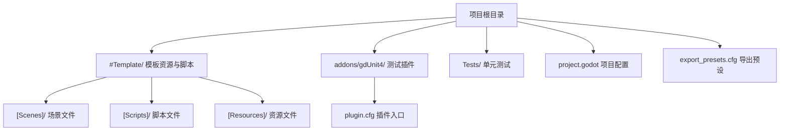
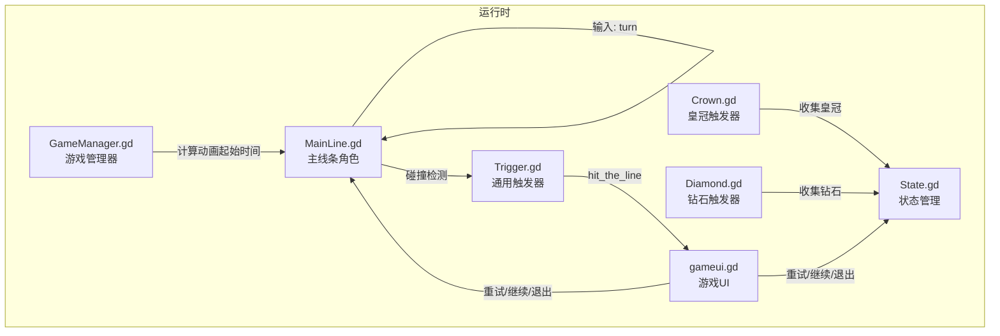
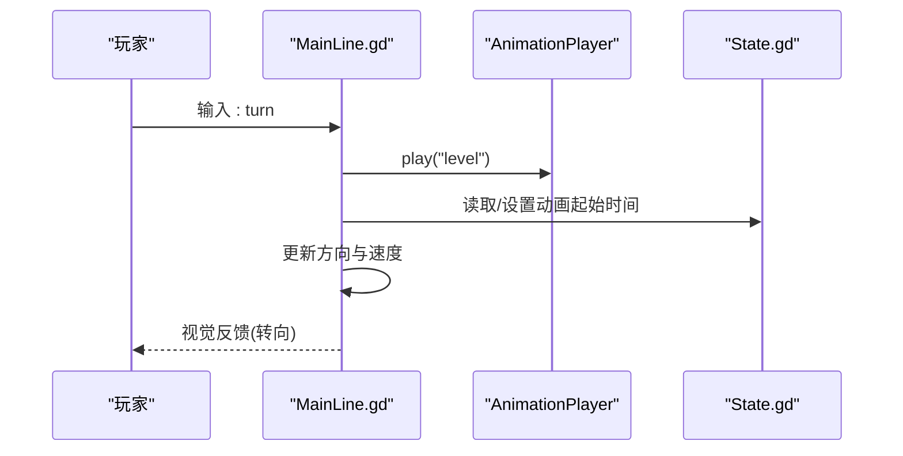
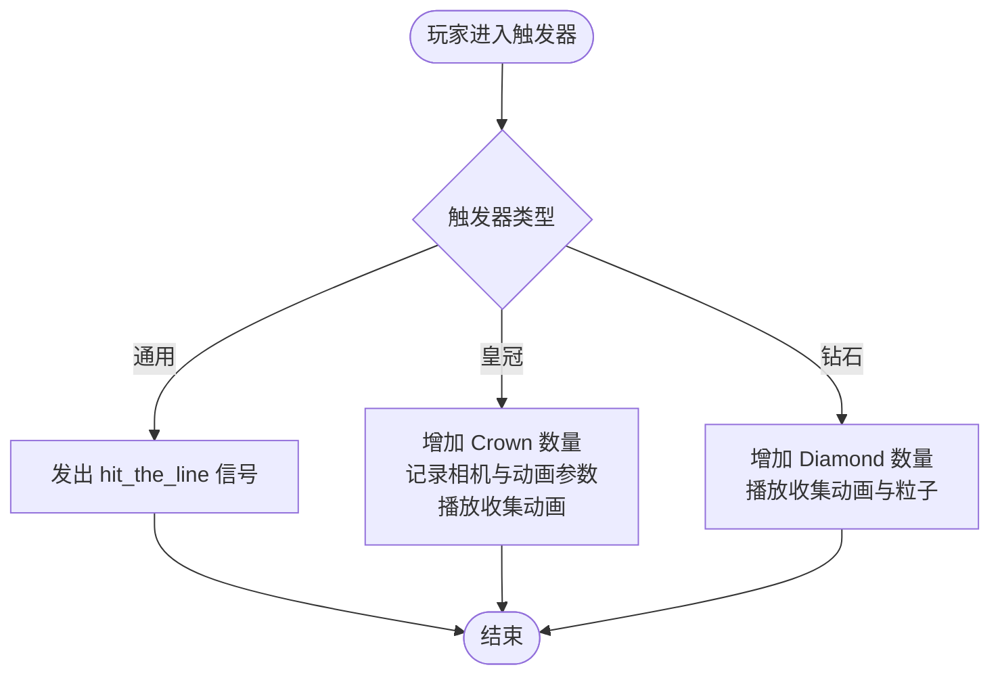
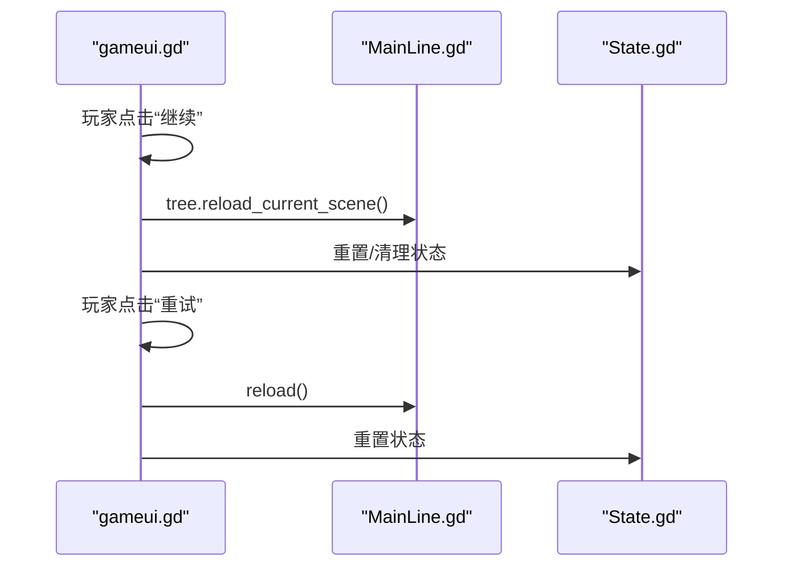
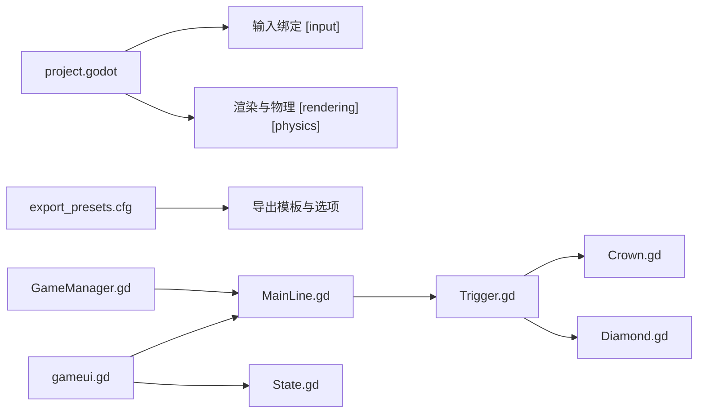

# 快速开始

<cite>
**本文引用的文件**
- [README.md](file://README.md)
- [project.godot](file://project.godot)
- [export_presets.cfg](file://export_presets.cfg)
- [CONTRIBUTING.md](file://CONTRIBUTING.md)
- [addons/gdUnit4/plugin.cfg](file://addons/gdUnit4/plugin.cfg)
- [#Template/[Scripts]/GameManager.gd](file://#Template/[Scripts]/GameManager.gd)
- [#Template/[Scripts]/MainLine.gd](file://#Template/[Scripts]/MainLine.gd)
- [#Template/[Scripts]/State.gd](file://#Template/[Scripts]/State.gd)
- [#Template/MainLine.tscn](file://#Template/MainLine.tscn)
- [#Template/[Scripts]/Trigger/Trigger.gd](file://#Template/[Scripts]/Trigger/Trigger.gd)
- [#Template/[Scripts]/Trigger/Crown.gd](file://#Template/[Scripts]/Trigger/Crown.gd)
- [#Template/[Scripts]/Trigger/Diamond.gd](file://#Template/[Scripts]/Trigger/Diamond.gd)
- [#Template/[Scripts]/gameui.gd](file://#Template/[Scripts]/gameui.gd)
</cite>

## 目录
1. [简介](#简介)
2. [项目结构](#项目结构)
3. [核心组件](#核心组件)
4. [架构总览](#架构总览)
5. [详细组件分析](#详细组件分析)
6. [依赖关系分析](#依赖关系分析)
7. [性能注意事项](#性能注意事项)
8. [故障排除指南](#故障排除指南)
9. [结论](#结论)
10. [附录](#附录)

## 简介
本指南面向希望快速上手 Godot Line 模板的用户，目标是在最短时间内完成环境准备、项目克隆、导入与运行，并掌握基本的游戏控制方式（转向、重试、保存、重载等）。项目基于 Godot Engine 4.6 构建，提供 Dancing Line 核心玩法与模块化脚本体系，适合初学者与进阶开发者。

## 项目结构
项目采用“模板 + 插件 + 测试”的组织方式，核心模板位于 #Template/ 目录，测试框架位于 addons/gdUnit4/，测试用例位于 Tests/。项目配置集中在 project.godot，导出预设位于 export_presets.cfg。

图示来源
- [project.godot:1-88](file://project.godot#L1-L88)
- [export_presets.cfg:1-75](file://export_presets.cfg#L1-L75)

章节来源
- [README.md:53-65](file://README.md#L53-L65)
- [project.godot:15-88](file://project.godot#L15-L88)
- [export_presets.cfg:1-75](file://export_presets.cfg#L1-L75)

## 核心组件
- 游戏管理器：负责相机、主线条、动画起始时间计算等。
- 主线条角色：控制移动、转向、碰撞死亡、粒子效果等。
- 状态管理：保存相机跟随参数、动画时间、通关状态等。
- 触发器系统：通用触发器、皇冠收集、钻石收集等。
- UI 控制：结算界面、返回、重试、继续等交互。

章节来源
- [#Template/[Scripts]/GameManager.gd:1-47](file://#Template/[Scripts]/GameManager.gd#L1-L47)
- [#Template/[Scripts]/MainLine.gd:1-224](file://#Template/[Scripts]/MainLine.gd#L1-L224)
- [#Template/[Scripts]/State.gd:1-21](file://#Template/[Scripts]/State.gd#L1-L21)
- [#Template/[Scripts]/Trigger/Trigger.gd:1-10](file://#Template/[Scripts]/Trigger/Trigger.gd#L1-L10)
- [#Template/[Scripts]/Trigger/Crown.gd:1-52](file://#Template/[Scripts]/Trigger/Crown.gd#L1-L52)
- [#Template/[Scripts]/Trigger/Diamond.gd:1-17](file://#Template/[Scripts]/Trigger/Diamond.gd#L1-L17)
- [#Template/[Scripts]/gameui.gd:1-70](file://#Template/[Scripts]/gameui.gd#L1-L70)

## 架构总览
下图展示了运行时关键组件之间的交互关系：主线条通过输入触发转向，碰撞触发器产生状态变化，UI 根据状态显示并响应用户操作，状态在场景重载时被持久化。

图示来源
- [#Template/[Scripts]/MainLine.gd:105-124](file://#Template/[Scripts]/MainLine.gd#L105-L124)
- [#Template/[Scripts]/Trigger/Trigger.gd:8-10](file://#Template/[Scripts]/Trigger/Trigger.gd#L8-L10)
- [#Template/[Scripts]/Trigger/Crown.gd:25-51](file://#Template/[Scripts]/Trigger/Crown.gd#L25-L51)
- [#Template/[Scripts]/Trigger/Diamond.gd:7-16](file://#Template/[Scripts]/Trigger/Diamond.gd#L7-L16)
- [#Template/[Scripts]/gameui.gd:51-69](file://#Template/[Scripts]/gameui.gd#L51-L69)
- [#Template/[Scripts]/GameManager.gd:23-39](file://#Template/[Scripts]/GameManager.gd#L23-L39)

## 详细组件分析

### 环境要求与安装步骤
- 环境要求
  - Godot Engine 4.6 或更高版本
  - 可选：GDScript 编程基础（用于自定义开发）
- 安装步骤
  1) 克隆仓库
     - 使用命令行执行克隆与进入目录
  2) 在 Godot 中打开项目
     - 启动 Godot 4.6，选择“导入”并定位到项目根目录
     - 等待项目扫描完成
  3) 运行项目
     - 在编辑器中按 F5 运行主场景
     - 或使用 Main.tscn 作为启动场景

章节来源
- [README.md:21-42](file://README.md#L21-L42)

### 基本游戏控制方式
- 转向：鼠标左键 / 空格
- 重试：R
- 保存：S
- 重载：Q
- 保存锥体：W

章节来源
- [README.md:43-52](file://README.md#L43-L52)
- [project.godot:42-69](file://project.godot#L42-L69)

### 输入绑定与场景结构
- 输入绑定
  - turn、retry、save、reload、savetaper 等按键事件在 project.godot 的 [input] 区域定义
- 场景结构
  - 主场景 MainLine.tscn 包含主线条角色、碰撞体、音效与粒子等节点

章节来源
- [project.godot:42-69](file://project.godot#L42-L69)
- [#Template/MainLine.tscn:1-68](file://#Template/MainLine.tscn#L1-L68)

### 主线条行为与动画
- 行为逻辑
  - 物理移动、地板检测、转向、死亡处理、粒子特效播放
- 动画联动
  - 通过 AnimationPlayer 播放转向动画，并根据状态设置动画起始时间
- 死亡与重生
  - 死亡时播放音效与粒子爆炸，支持重试与继续

图示来源
- [#Template/[Scripts]/MainLine.gd:105-184](file://#Template/[Scripts]/MainLine.gd#L105-L184)
- [#Template/[Scripts]/GameManager.gd:23-39](file://#Template/[Scripts]/GameManager.gd#L23-L39)

章节来源
- [#Template/[Scripts]/MainLine.gd:53-124](file://#Template/[Scripts]/MainLine.gd#L53-L124)
- [#Template/[Scripts]/GameManager.gd:11-39](file://#Template/[Scripts]/GameManager.gd#L11-L39)

### 触发器系统
- 通用触发器
  - 触发时发出 hit_the_line 信号，供 UI 或其他节点监听
- 皇冠触发器
  - 收集时增加 Crown 数量，记录相机跟随参数与动画时间，播放收集动画后销毁
- 钻石触发器
  - 收集时增加 Diamond 数量，播放收集动画与粒子后销毁

图示来源
- [#Template/[Scripts]/Trigger/Trigger.gd:8-10](file://#Template/[Scripts]/Trigger/Trigger.gd#L8-L10)
- [#Template/[Scripts]/Trigger/Crown.gd:25-51](file://#Template/[Scripts]/Trigger/Crown.gd#L25-L51)
- [#Template/[Scripts]/Trigger/Diamond.gd:7-16](file://#Template/[Scripts]/Trigger/Diamond.gd#L7-L16)

章节来源
- [#Template/[Scripts]/Trigger/Trigger.gd:1-10](file://#Template/[Scripts]/Trigger/Trigger.gd#L1-L10)
- [#Template/[Scripts]/Trigger/Crown.gd:1-52](file://#Template/[Scripts]/Trigger/Crown.gd#L1-L52)
- [#Template/[Scripts]/Trigger/Diamond.gd:1-17](file://#Template/[Scripts]/Trigger/Diamond.gd#L1-L17)

### UI 与场景控制
- UI 显示
  - 根据 Crown 数量播放对应动画，显示钻石数量与关卡名
- 场景控制
  - 返回：退出游戏并重置状态
  - 继续：重载当前场景并保留部分状态
  - 重试：完全重载当前场景并清空状态

图示来源
- [#Template/[Scripts]/gameui.gd:51-69](file://#Template/[Scripts]/gameui.gd#L51-L69)
- [#Template/[Scripts]/MainLine.gd:114-124](file://#Template/[Scripts]/MainLine.gd#L114-L124)

章节来源
- [#Template/[Scripts]/gameui.gd:1-70](file://#Template/[Scripts]/gameui.gd#L1-L70)

### 测试框架与运行
- 测试框架
  - 集成 gdUnit4，插件入口由 addons/gdUnit4/plugin.cfg 指定
- 运行测试
  - 无头模式：godot --headless --run-tests
  - 编辑器内运行：打开底部面板 gdUnit4 标签页

章节来源
- [addons/gdUnit4/plugin.cfg:1-8](file://addons/gdUnit4/plugin.cfg#L1-L8)
- [README.md:67-79](file://README.md#L67-L79)
- [CONTRIBUTING.md:41-58](file://CONTRIBUTING.md#L41-L58)

## 依赖关系分析
- 项目配置
  - project.godot 定义应用名称、Godot 版本特性、输入绑定、物理与渲染参数
  - export_presets.cfg 定义导出模板与选项
- 插件与测试
  - 启用 gdUnit4 插件，支持单元测试与报告生成
- 场景与脚本
  - MainLine.tscn 与 MainLine.gd 形成角色主体，配合 Trigger、Crown、Diamond 等触发器实现玩法

图示来源
- [project.godot:15-88](file://project.godot#L15-L88)
- [export_presets.cfg:1-75](file://export_presets.cfg#L1-L75)
- [#Template/[Scripts]/GameManager.gd:1-47](file://#Template/[Scripts]/GameManager.gd#L1-L47)
- [#Template/[Scripts]/MainLine.gd:1-224](file://#Template/[Scripts]/MainLine.gd#L1-L224)
- [#Template/[Scripts]/Trigger/Trigger.gd:1-10](file://#Template/[Scripts]/Trigger/Trigger.gd#L1-L10)
- [#Template/[Scripts]/Trigger/Crown.gd:1-52](file://#Template/[Scripts]/Trigger/Crown.gd#L1-L52)
- [#Template/[Scripts]/Trigger/Diamond.gd:1-17](file://#Template/[Scripts]/Trigger/Diamond.gd#L1-L17)
- [#Template/[Scripts]/gameui.gd:1-70](file://#Template/[Scripts]/gameui.gd#L1-L70)
- [#Template/[Scripts]/State.gd:1-21](file://#Template/[Scripts]/State.gd#L1-L21)

章节来源
- [project.godot:15-88](file://project.godot#L15-L88)
- [export_presets.cfg:1-75](file://export_presets.cfg#L1-L75)

## 性能注意事项
- 物理与渲染
  - 已启用 3D 物理独立线程与 Jolt 物理引擎，建议在低端设备上适当降低渲染质量或关闭部分特效
- 动画与粒子
  - 大量粒子与动画同时播放时注意帧率，可通过减少粒子数量或降低动画频率优化
- 导出设置
  - 使用 export_presets.cfg 中的纹理压缩与二进制格式选项以减小包体与提升加载速度

## 故障排除指南
- 无法运行或报错
  - 确认使用 Godot 4.6 或更高版本
  - 在编辑器中重新导入项目并等待扫描完成
- 输入无效
  - 检查 project.godot 的 [input] 区域是否正确映射按键
- 场景重载异常
  - 使用 UI 的“重试/继续”按钮进行场景重载，避免手动切换场景导致状态未重置
- 测试无法运行
  - 确认 gdUnit4 插件已启用，编辑器底部面板可见 gdUnit4 标签页

章节来源
- [README.md:21-42](file://README.md#L21-L42)
- [project.godot:42-69](file://project.godot#L42-L69)
- [#Template/[Scripts]/gameui.gd:51-69](file://#Template/[Scripts]/gameui.gd#L51-L69)
- [addons/gdUnit4/plugin.cfg:1-8](file://addons/gdUnit4/plugin.cfg#L1-L8)

## 结论
通过本快速开始指南，您可以在本地完成环境准备、项目导入与运行，并掌握基本控制方式。模板提供了清晰的角色、触发器与 UI 结构，便于进一步扩展与定制。如需深入学习，可结合 README 中的教程链接与 gdUnit4 测试框架进行实践。

## 附录
- 常用命令
  - 克隆与进入目录：使用命令行执行克隆与进入
  - 无头测试：godot --headless --run-tests
- 快捷键
  - 转向：鼠标左键 / 空格
  - 重试：R
  - 保存：S
  - 重载：Q
  - 保存锥体：W

章节来源
- [README.md:28-42](file://README.md#L28-L42)
- [README.md:71-79](file://README.md#L71-L79)
- [README.md:43-52](file://README.md#L43-L52)
- [project.godot:42-69](file://project.godot#L42-L69)