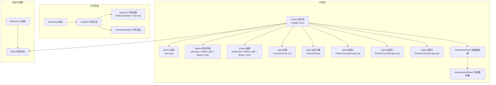
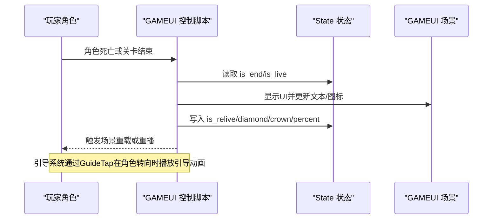
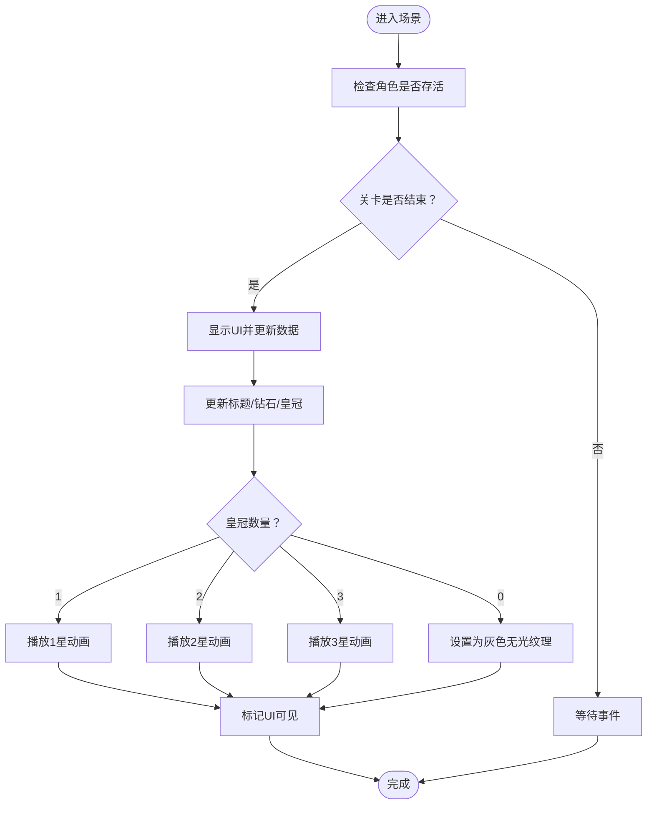
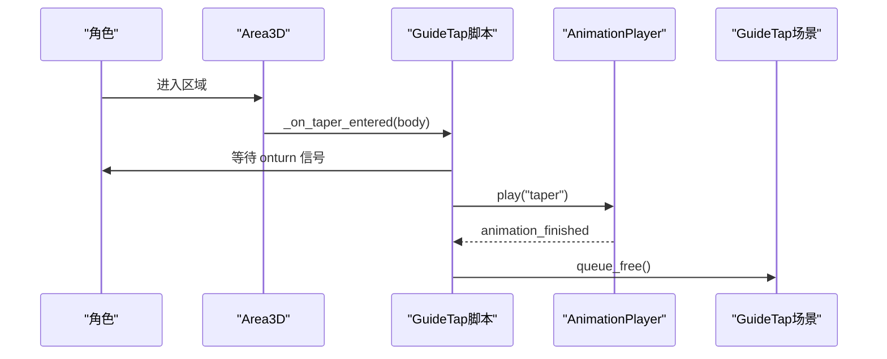
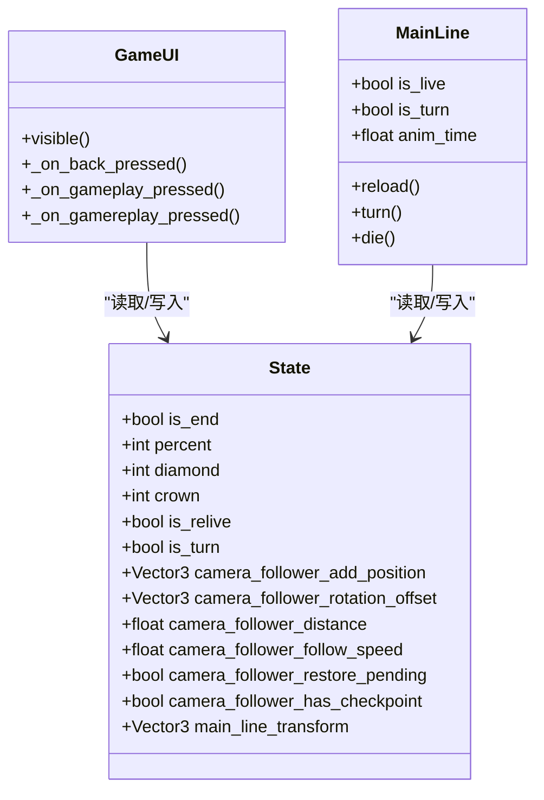
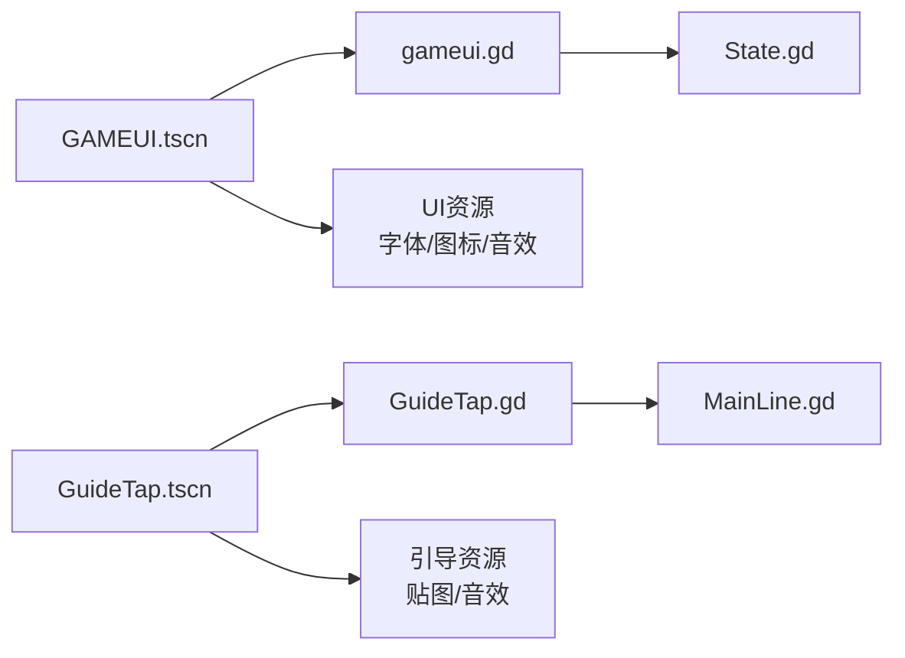

# UI界面定制

<cite>
**本文引用的文件**
- [GAMEUI.tscn](file://#Template/GAMEUI.tscn)
- [gameui.gd](file://#Template/[Scripts]/gameui.gd)
- [GuideTap.tscn](file://#Template/GuideTap.tscn)
- [GuideTap.gd](file://#Template/[Scripts]/GuideLine/GuideTap.gd)
- [State.gd](file://#Template/[Scripts]/State.gd)
- [MainLine.tscn](file://#Template/MainLine.tscn)
- [MainLine.gd](file://#Template/[Scripts]/MainLine.gd)
- [CaviarDreams-1.ttf](file://#Template/[Resources]/CaviarDreams-1.ttf)
- [Button_inner.png](file://#Template/[Resources]/ui/Button_inner.png)
- [Button_side.png](file://#Template/[Resources]/ui/Button_side.png)
- [back.png](file://#Template/[Resources]/ui/back.png)
- [play.png](file://#Template/[Resources]/ui/play.png)
- [replay.png](file://#Template/[Resources]/ui/replay.png)
- [Diamond.png](file://#Template/[Resources]/ui/Diamond.png)
- [PerfactCrownNoLight.png](file://#Template/[Resources]/PerfactCrownNoLight.png)
- [PerfactCrownLight.png](file://#Template/[Resources]/PerfactCrownLight.png)
- [crown_get_1.wav](file://#Template/[Resources]/crown_get_1.wav)
- [crown_get_2.wav](file://#Template/[Resources]/crown_get_2.wav)
- [crown_get_3.wav](file://#Template/[Resources]/crown_get_3.wav)
- [Taper.png](file://#Template/[Resources]/Taper.png)
- [Taper_True.png](file://#Template/[Resources]/Taper_True.png)
</cite>

## 目录
1. [简介](#简介)
2. [项目结构](#项目结构)
3. [核心组件](#核心组件)
4. [架构总览](#架构总览)
5. [详细组件分析](#详细组件分析)
6. [依赖关系分析](#依赖关系分析)
7. [性能考虑](#性能考虑)
8. [故障排查指南](#故障排查指南)
9. [结论](#结论)
10. [附录](#附录)

## 简介
本文件面向Godot Line项目的UI系统，聚焦于GAMEUI场景与gameui.gd脚本的结构与功能，解释引导系统中GuideTap的实现原理与使用方式，并提供UI元素自定义方案（按钮样式、文本显示、图标替换）、UI与游戏状态同步机制与数据绑定方法，以及添加新UI组件（统计面板、设置界面、菜单系统）的实践路径。同时给出响应式设计与跨平台适配建议，帮助开发者快速扩展与定制UI。

## 项目结构
GAMEUI场景位于模板资源中，由Control根节点承载，内部包含背景遮罩、标题文本、钻石计数、皇冠图标、播放/重放/返回按钮及动画播放器等节点；gameui.gd作为控制脚本负责UI可见性、状态同步与交互事件处理；引导系统通过GuideTap场景与脚本实现触发式引导动画与清理。

**图表来源**
- [GAMEUI.tscn](file://#Template/GAMEUI.tscn)
- [GuideTap.tscn](file://#Template/GuideTap.tscn)
- [State.gd](file://#Template/[Scripts]/State.gd)
- [MainLine.tscn](file://#Template/MainLine.tscn)

**章节来源**
- [GAMEUI.tscn](file://#Template/GAMEUI.tscn)
- [GuideTap.tscn](file://#Template/GuideTap.tscn)
- [State.gd](file://#Template/[Scripts]/State.gd)
- [MainLine.tscn](file://#Template/MainLine.tscn)

## 核心组件
- GAMEUI场景与脚本
  - 根节点为Control，采用锚定布局与增长策略，适配全屏覆盖。
  - 包含返回、开始、重播三类按钮，均使用主题图标覆盖实现自定义外观。
  - 文本标签用于显示关卡名与钻石数量，字体与字号通过主题覆盖配置。
  - 三个皇冠Sprite用于显示星级奖励，配合AnimationPlayer播放不同动画库。
  - 脚本负责根据状态切换UI可见性、更新文本与图标、处理按钮事件并重置全局状态。
- 引导系统
  - GuideTap场景包含Area3D碰撞区域、Sprite3D引导贴图与AnimationPlayer。
  - 当玩家进入区域时触发动画并播放音效，完成后释放节点。
- 状态管理
  - State集中存储相机跟随、回合状态、进度百分比、钻石与皇冠数量等全局信息。
  - MainLine在运行时维护角色生命周期与动画时间戳，供UI同步使用。

**章节来源**
- [GAMEUI.tscn](file://#Template/GAMEUI.tscn)
- [gameui.gd](file://#Template/[Scripts]/gameui.gd)
- [GuideTap.tscn](file://#Template/GuideTap.tscn)
- [GuideTap.gd](file://#Template/[Scripts]/GuideLine/GuideTap.gd)
- [State.gd](file://#Template/[Scripts]/State.gd)
- [MainLine.gd](file://#Template/[Scripts]/MainLine.gd)

## 架构总览
UI系统围绕“场景-脚本-状态”三层协作展开：场景负责静态布局与资源引用，脚本负责动态行为与状态同步，状态模块提供全局数据源。引导系统以独立场景注入，通过碰撞事件触发UI反馈。

**图表来源**
- [gameui.gd](file://#Template/[Scripts]/gameui.gd)
- [State.gd](file://#Template/[Scripts]/State.gd)
- [GuideTap.gd](file://#Template/[Scripts]/GuideLine/GuideTap.gd)

## 详细组件分析

### GAMEUI场景与gameui.gd脚本
- 场景节点组织
  - 根节点Control：全屏覆盖，锚定与增长属性确保随窗口变化。
  - 背景遮罩ColorRect：半透明黑色，提升前景UI可读性。
  - 按钮组：back、play、replay，均使用Flat风格与主题图标覆盖，实现无边框按钮外观。
  - 文本标签：title（字体与字号覆盖）、diamond（数字显示）。
  - 图标与动画：三个皇冠Sprite与AnimationPlayer，配合多段动画库实现不同星级效果。
- 脚本功能
  - 可见性控制：监听角色存活与关卡结束状态，自动显示结算UI。
  - 数据绑定：从State读取钻石与皇冠数量，更新UI文本与图标。
  - 交互处理：返回退出、开始重载当前场景、重播重新加载关卡。
  - 状态重置：在按钮事件中清空全局状态，便于下一局开始。
- 扩展方法
  - 新增UI元素：在场景中添加节点并通过脚本引用，注意使用主题覆盖与锚定布局。
  - 自定义样式：通过主题字体、字号、颜色与图标覆盖实现统一风格。
  - 动画联动：利用AnimationPlayer播放预设动画库，结合音效增强体验。

**图表来源**
- [gameui.gd](file://#Template/[Scripts]/gameui.gd)
- [GAMEUI.tscn](file://#Template/GAMEUI.tscn)

**章节来源**
- [GAMEUI.tscn](file://#Template/GAMEUI.tscn)
- [gameui.gd](file://#Template/[Scripts]/gameui.gd)

### 引导系统与GuideTap
- 实现原理
  - GuideTap场景包含Area3D碰撞区域与Sprite3D引导贴图，脚本在角色进入时等待角色转向信号，播放引导动画并淡出，最后释放自身。
  - 动画库包含“taper”引导动画与“RESET”复位动画，分别用于引导反馈与初始状态恢复。
- 使用方法
  - 在关卡中放置GuideTap场景，确保碰撞形状与角色触发条件匹配。
  - 脚本会自动显示并播放动画，完成后清理节点，避免内存泄漏。
- 与主流程集成
  - 主角色MainLine在转向时发出信号，引导系统据此播放动画，形成“触发-反馈-清理”的闭环。

**图表来源**
- [GuideTap.tscn](file://#Template/GuideTap.tscn)
- [GuideTap.gd](file://#Template/[Scripts]/GuideLine/GuideTap.gd)
- [MainLine.gd](file://#Template/[Scripts]/MainLine.gd)

**章节来源**
- [GuideTap.tscn](file://#Template/GuideTap.tscn)
- [GuideTap.gd](file://#Template/[Scripts]/GuideLine/GuideTap.gd)
- [MainLine.gd](file://#Template/[Scripts]/MainLine.gd)

### UI元素自定义方案
- 按钮样式
  - 使用Button的Flat风格与主题图标覆盖，实现无边框按钮外观；可通过Sprite2D叠加边框与内衬实现更丰富的视觉层次。
  - 参考资源：Button_side.png、Button_inner.png、back.png、play.png、replay.png。
- 文本显示
  - 通过Label的主题字体与字号覆盖实现统一风格；标题使用大字号与居中对齐，计数使用较小字号突出数值。
  - 参考资源：CaviarDreams-1.ttf。
- 图标替换
  - 通过主题图标覆盖直接替换按钮图标；也可在Sprite2D上动态切换纹理实现状态变化。
  - 参考资源：Diamond.png、PerfactCrownNoLight.png、PerfactCrownLight.png。
- 动画联动
  - 利用AnimationPlayer播放预设动画库，结合音效播放器实现听觉反馈；动画库包含不同星级与复位状态。
  - 参考资源：crown_get_1.wav、crown_get_2.wav、crown_get_3.wav。

**章节来源**
- [GAMEUI.tscn](file://#Template/GAMEUI.tscn)
- [CaviarDreams-1.ttf](file://#Template/[Resources]/CaviarDreams-1.ttf)
- [Button_side.png](file://#Template/[Resources]/ui/Button_side.png)
- [Button_inner.png](file://#Template/[Resources]/ui/Button_inner.png)
- [back.png](file://#Template/[Resources]/ui/back.png)
- [play.png](file://#Template/[Resources]/ui/play.png)
- [replay.png](file://#Template/[Resources]/ui/replay.png)
- [Diamond.png](file://#Template/[Resources]/ui/Diamond.png)
- [PerfactCrownNoLight.png](file://#Template/[Resources]/PerfactCrownNoLight.png)
- [PerfactCrownLight.png](file://#Template/[Resources]/PerfactCrownLight.png)
- [crown_get_1.wav](file://#Template/[Resources]/crown_get_1.wav)
- [crown_get_2.wav](file://#Template/[Resources]/crown_get_2.wav)
- [crown_get_3.wav](file://#Template/[Resources]/crown_get_3.wav)

### UI与游戏状态的同步机制
- 状态来源
  - State集中保存相机跟随、回合状态、进度百分比、钻石与皇冠数量等全局信息。
  - MainLine在运行时维护角色生命周期与动画时间戳，供UI同步使用。
- 同步策略
  - UI在每帧或事件触发时读取State中的关键字段，更新文本与图标。
  - 按钮事件中重置State，确保下一局开始时状态一致。
- 数据绑定建议
  - 使用常量键访问State字段，避免硬编码；在脚本中集中处理状态变更，减少耦合。

**图表来源**
- [State.gd](file://#Template/[Scripts]/State.gd)
- [MainLine.gd](file://#Template/[Scripts]/MainLine.gd)
- [gameui.gd](file://#Template/[Scripts]/gameui.gd)

**章节来源**
- [State.gd](file://#Template/[Scripts]/State.gd)
- [MainLine.gd](file://#Template/[Scripts]/MainLine.gd)
- [gameui.gd](file://#Template/[Scripts]/gameui.gd)

### 添加新UI组件的实践路径
- 统计面板
  - 在场景中新增Panel容器，内部放置Label与Sprite2D，使用主题覆盖统一风格。
  - 在脚本中通过State读取diamond与crown，动态更新显示内容。
- 设置界面
  - 新增Control节点作为设置容器，使用HBox/VBox组织选项控件（如开关、滑条、下拉框）。
  - 通过信号连接实现选项变更与状态持久化。
- 菜单系统
  - 基于Button组实现主菜单、暂停菜单等，使用Flat风格与图标覆盖保持一致性。
  - 通过动画与过渡效果提升交互体验。

**章节来源**
- [GAMEUI.tscn](file://#Template/GAMEUI.tscn)
- [State.gd](file://#Template/[Scripts]/State.gd)

## 依赖关系分析
- 场景与脚本
  - GAMEUI.tscn通过外部脚本绑定gameui.gd；GuideTap.tscn通过外部脚本绑定GuideTap.gd。
- 资源依赖
  - UI按钮与图标依赖ui资源包中的图片与字体；动画与音效依赖场景中的AnimationPlayer与AudioStreamPlayer。
- 状态耦合
  - gameui.gd与State紧密耦合，负责UI与状态的双向同步；GuideTap.gd与MainLine通过信号耦合，实现引导反馈。

**图表来源**
- [GAMEUI.tscn](file://#Template/GAMEUI.tscn)
- [gameui.gd](file://#Template/[Scripts]/gameui.gd)
- [GuideTap.tscn](file://#Template/GuideTap.tscn)
- [GuideTap.gd](file://#Template/[Scripts]/GuideLine/GuideTap.gd)
- [State.gd](file://#Template/[Scripts]/State.gd)
- [MainLine.gd](file://#Template/[Scripts]/MainLine.gd)

**章节来源**
- [GAMEUI.tscn](file://#Template/GAMEUI.tscn)
- [GuideTap.tscn](file://#Template/GuideTap.tscn)
- [gameui.gd](file://#Template/[Scripts]/gameui.gd)
- [GuideTap.gd](file://#Template/[Scripts]/GuideLine/GuideTap.gd)
- [State.gd](file://#Template/[Scripts]/State.gd)
- [MainLine.gd](file://#Template/[Scripts]/MainLine.gd)

## 性能考虑
- 节点数量与层级
  - 控制场景节点数量，避免深层嵌套；使用Control的锚定与增长属性减少布局计算。
- 动画与音效
  - 合理使用AnimationPlayer与AudioStreamPlayer，避免同时播放过多动画；在不需要时停止播放并释放资源。
- 状态更新频率
  - 将状态更新集中在必要时机（如按钮事件、帧末汇总），避免每帧频繁读取与写入State。
- 字体与图标
  - 复用字体与图标资源，减少重复加载；在切换状态时仅更新需要改变的节点。

## 故障排查指南
- UI不显示或显示异常
  - 检查Control根节点的可见性与锚定设置；确认gameui.gd中visible()调用路径与State状态。
- 按钮无响应
  - 核对场景中的信号连接是否正确；检查脚本中对应事件处理函数是否存在。
- 动画不播放或错位
  - 确认AnimationPlayer的动画库与节点路径；检查音效资源是否正确加载。
- 引导无效
  - 检查Area3D碰撞形状与触发条件；确认MainLine的onturn信号是否正常发出。

**章节来源**
- [gameui.gd](file://#Template/[Scripts]/gameui.gd)
- [GuideTap.gd](file://#Template/[Scripts]/GuideLine/GuideTap.gd)
- [GAMEUI.tscn](file://#Template/GAMEUI.tscn)
- [GuideTap.tscn](file://#Template/GuideTap.tscn)

## 结论
本UI系统以场景-脚本-状态为核心，通过主题覆盖与动画播放器实现高可定制的界面表现；引导系统通过碰撞触发与动画反馈强化了交互体验。遵循本文提供的自定义方案、同步机制与最佳实践，可高效扩展统计面板、设置界面与菜单系统，并在多平台上实现一致的视觉与交互体验。

## 附录
- 跨平台适配建议
  - 使用锚定与增长属性适配不同分辨率；为高DPI屏幕准备更高分辨率的图标与字体。
  - 在移动端优化触摸按钮尺寸与间距，确保易用性。
- 快速参考
  - UI资源：按钮图标、字体、钻石与皇冠图标、音效。
  - 关键脚本：gameui.gd、GuideTap.gd。
  - 状态字段：diamond、crown、is_end、is_relive、percent、camera_follower_*等。

**章节来源**
- [GAMEUI.tscn](file://#Template/GAMEUI.tscn)
- [GuideTap.tscn](file://#Template/GuideTap.tscn)
- [State.gd](file://#Template/[Scripts]/State.gd)
- [MainLine.gd](file://#Template/[Scripts]/MainLine.gd)