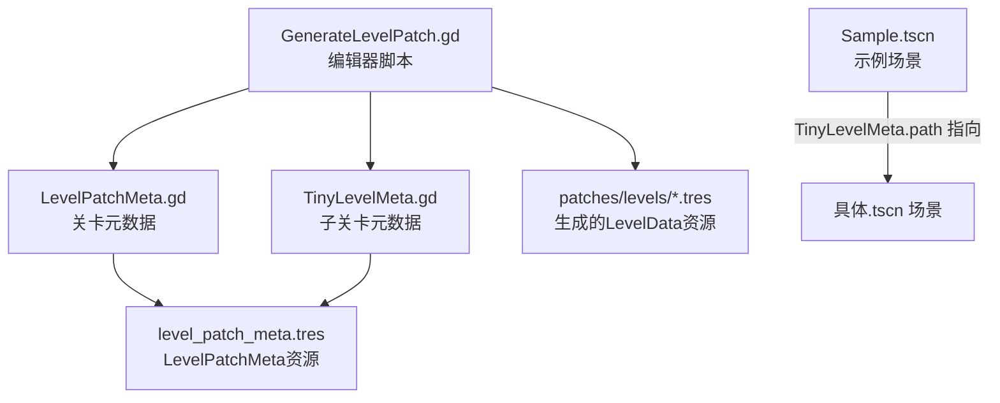
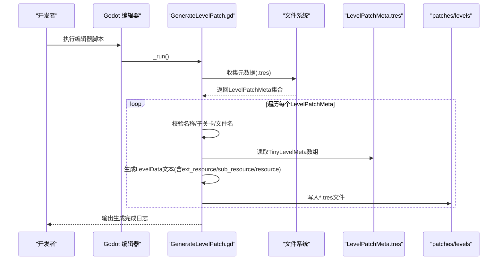
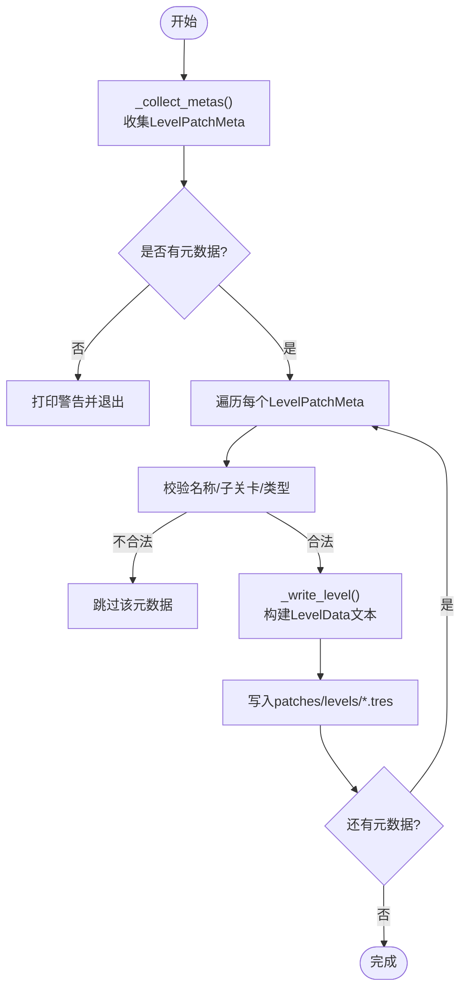
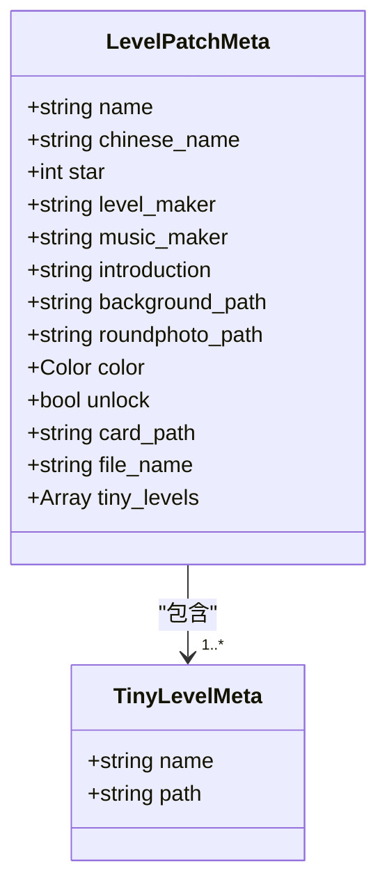
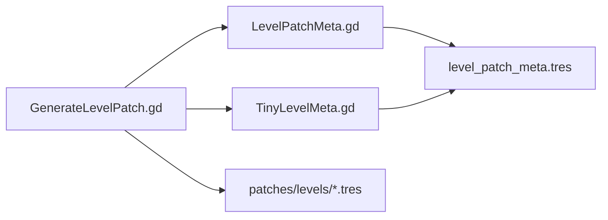

# 场景生成工具

<cite>
**本文引用的文件**
- [GenerateLevelPatch.gd](file://#Template/[Scripts]/GenerateLevelPatch.gd)
- [LevelPatchMeta.gd](file://#Template/[Scripts]/LevelPatchMeta.gd)
- [TinyLevelMeta.gd](file://#Template/[Scripts]/TinyLevelMeta.gd)
- [level_patch_meta.tres](file://#Template/level_patch_meta.tres)
- [Sample.tscn](file://#Template/[Scenes]/Sample.tscn)
- [README.md](file://README.md)
</cite>

## 目录
1. [简介](#简介)
2. [项目结构](#项目结构)
3. [核心组件](#核心组件)
4. [架构总览](#架构总览)
5. [详细组件分析](#详细组件分析)
6. [依赖关系分析](#依赖关系分析)
7. [性能考虑](#性能考虑)
8. [故障排查指南](#故障排查指南)
9. [结论](#结论)
10. [附录](#附录)

## 简介
本文件面向Godot Line的场景生成系统，聚焦“关卡补丁生成器”（GenerateLevelPatch）的工作流程与参数配置，系统性说明LevelPatchMeta与TinyLevelMeta的数据结构与使用方法，解释level_patch_meta.tres资源文件的作用与自定义配置要点，并提供扩展开发指南（新增场景类型、修改生成规则、参数化设计）。同时给出性能优化与内存管理策略，以及若干可直接参考的代码片段路径，帮助开发者快速上手并安全扩展。

## 项目结构
围绕场景生成的核心目录与文件如下：
- #Template/[Scripts]/GenerateLevelPatch.gd：编辑器脚本，负责收集元数据、生成LevelData资源文件。
- #Template/[Scripts]/LevelPatchMeta.gd：关卡补丁元数据资源类，描述关卡基本信息与子关卡列表。
- #Template/[Scripts]/TinyLevelMeta.gd：子关卡元数据资源类，描述单个场景文件路径与显示名。
- #Template/level_patch_meta.tres：LevelPatchMeta资源文件，包含导出字段与子关卡数组。
- #Template/[Scenes]/Sample.tscn：示例场景，展示场景内节点组织、资源引用与实例化方式，有助于理解TinyLevelMeta.path所指向的场景应具备的结构特征。
- README.md：项目总体介绍与结构说明。

图表来源
- [GenerateLevelPatch.gd:1-139](file://#Template/[Scripts]/GenerateLevelPatch.gd#L1-L139)
- [LevelPatchMeta.gd:1-18](file://#Template/[Scripts]/LevelPatchMeta.gd#L1-L18)
- [TinyLevelMeta.gd:1-7](file://#Template/[Scripts]/TinyLevelMeta.gd#L1-L7)
- [level_patch_meta.tres:1-22](file://#Template/level_patch_meta.tres#L1-L22)
- [Sample.tscn:1-147](file://#Template/[Scenes]/Sample.tscn#L1-L147)

章节来源
- [README.md:53-65](file://README.md#L53-L65)

## 核心组件
- GenerateLevelPatch.gd：编辑器脚本，负责扫描元数据资源、遍历子关卡、生成最终的LevelData资源文件。其核心逻辑包括元数据收集、合法性校验、字符串转义与格式化输出、目标目录创建与写入。
- LevelPatchMeta.gd：资源类，定义关卡补丁的导出字段，如名称、星级、作者、背景图、圆形头像、颜色、解锁状态、卡片资源路径、文件名、子关卡数组等。
- TinyLevelMeta.gd：资源类，定义子关卡的导出字段，如显示名与场景文件路径（限定为.tscn/.scn）。
- level_patch_meta.tres：LevelPatchMeta资源文件，作为输入元数据，内部包含一个或多个TinyLevelMeta子资源，以及LevelPatchMeta的导出字段值。

章节来源
- [GenerateLevelPatch.gd:1-139](file://#Template/[Scripts]/GenerateLevelPatch.gd#L1-L139)
- [LevelPatchMeta.gd:1-18](file://#Template/[Scripts]/LevelPatchMeta.gd#L1-L18)
- [TinyLevelMeta.gd:1-7](file://#Template/[Scripts]/TinyLevelMeta.gd#L1-L7)
- [level_patch_meta.tres:1-22](file://#Template/level_patch_meta.tres#L1-L22)

## 架构总览
下图展示了从元数据到生成结果的端到端流程：编辑器脚本读取LevelPatchMeta资源，遍历其中的TinyLevelMeta数组，构造LevelData资源文本内容，写入patches/levels目录。

图表来源
- [GenerateLevelPatch.gd:8-22](file://#Template/[Scripts]/GenerateLevelPatch.gd#L8-L22)
- [GenerateLevelPatch.gd:24-43](file://#Template/[Scripts]/GenerateLevelPatch.gd#L24-L43)
- [GenerateLevelPatch.gd:45-110](file://#Template/[Scripts]/GenerateLevelPatch.gd#L45-L110)
- [level_patch_meta.tres:11-21](file://#Template/level_patch_meta.tres#L11-L21)

## 详细组件分析

### GenerateLevelPatch：场景生成算法与参数配置
- 元数据收集
  - 默认路径：res://#Template/level_patch_meta.tres
  - 备用目录：res://#Template/level_patches（扫描所有.tres文件）
  - 返回类型：LevelPatchMeta数组
- 生成流程
  - 校验：空名称跳过；空子关卡跳过；类型不符跳过
  - 文件名：优先使用file_name，否则对name进行slug化
  - 输出：patches/levels/<file_name>.tres
  - 内容：LevelData资源文本，包含外部脚本引用、子资源（TinyLevelMeta）、主资源（LevelPatchMeta）字段
- 关键函数
  - _collect_metas：扫描默认路径与目录，返回有效元数据数组
  - _write_level：生成LevelData文本并写入文件
  - _join_subresources：拼接子资源引用
  - _slugify/_tres_string/_float：字符串与数值格式化工具

图表来源
- [GenerateLevelPatch.gd:8-22](file://#Template/[Scripts]/GenerateLevelPatch.gd#L8-L22)
- [GenerateLevelPatch.gd:24-43](file://#Template/[Scripts]/GenerateLevelPatch.gd#L24-L43)
- [GenerateLevelPatch.gd:45-110](file://#Template/[Scripts]/GenerateLevelPatch.gd#L45-L110)

章节来源
- [GenerateLevelPatch.gd:1-139](file://#Template/[Scripts]/GenerateLevelPatch.gd#L1-L139)

### LevelPatchMeta：关卡元数据结构与使用
- 字段说明（导出）
  - name/chinese_name：英文与中文名称
  - star：星级（范围0~6）
  - level_maker/music_maker：作者信息
  - introduction：关卡简介
  - background_path/roundphoto_path：背景与圆形头像资源路径
  - color：关卡主题色
  - unlock：是否默认解锁
  - card_path：卡片资源路径（可选）
  - file_name：生成文件名（可选）
  - tiny_levels：子关卡数组（TinyLevelMeta）
- 使用方法
  - 在编辑器中创建level_patch_meta.tres，填写上述字段
  - 将.tscn场景文件路径填入TinyLevelMeta.path，确保文件存在且可被资源系统识别
  - 通过GenerateLevelPatch.gd批量生成LevelData资源

图表来源
- [LevelPatchMeta.gd:5-17](file://#Template/[Scripts]/LevelPatchMeta.gd#L5-L17)
- [TinyLevelMeta.gd:5-6](file://#Template/[Scripts]/TinyLevelMeta.gd#L5-L6)

章节来源
- [LevelPatchMeta.gd:1-18](file://#Template/[Scripts]/LevelPatchMeta.gd#L1-L18)
- [TinyLevelMeta.gd:1-7](file://#Template/[Scripts]/TinyLevelMeta.gd#L1-L7)

### TinyLevelMeta：子关卡元数据结构与使用
- 字段说明（导出）
  - name：子关卡显示名
  - path：场景文件路径（限定.tscn/.scn）
- 使用方法
  - 在LevelPatchMeta.tres中添加多个TinyLevelMeta条目
  - path需指向实际存在的.tscn场景文件，建议位于资源路径下
  - 生成时会将每个TinyLevelMeta转换为LevelData中的子资源

章节来源
- [TinyLevelMeta.gd:1-7](file://#Template/[Scripts]/TinyLevelMeta.gd#L1-L7)

### level_patch_meta.tres：资源文件作用与自定义配置
- 作用
  - 作为GenerateLevelPatch.gd的输入元数据，定义关卡基本信息与子关卡列表
  - 内部包含LevelPatchMeta主资源与若干TinyLevelMeta子资源
- 自定义配置要点
  - 导出字段：name、chinese_name、star、level_maker、music_maker、introduction、background_path、roundphoto_path、color、unlock、card_path、file_name、tiny_levels
  - 子关卡：为每个子关卡填写name与path，确保path指向有效的.tscn场景文件
  - 文件名：若未设置file_name，将根据name进行slug化生成输出文件名
- 示例参考
  - level_patch_meta.tres中已包含一个TinyLevelMeta子资源与LevelPatchMeta主资源的典型字段

章节来源
- [level_patch_meta.tres:1-22](file://#Template/level_patch_meta.tres#L1-L22)

### 示例场景：理解TinyLevelMeta.path的场景结构
- Sample.tscn展示了典型的场景组织方式：根节点包含若干子节点，如MainLine、CameraFollower、AudioStreamPlayer、DirectionalLight3D、多个实例化的子场景（如BaseFloor、BaseWall、Diamond、GuideTap、Trigger、Crown、CrownSet等）
- 该场景可作为TinyLevelMeta.path的目标，用于演示生成器如何将子场景组合为LevelData

章节来源
- [Sample.tscn:1-147](file://#Template/[Scenes]/Sample.tscn#L1-L147)

## 依赖关系分析
- GenerateLevelPatch.gd依赖LevelPatchMeta与TinyLevelMeta两类资源类
- LevelPatchMeta.tres内部通过ext_resource与sub_resource引用对应脚本与子资源
- 生成的LevelData资源文件同样通过ext_resource引用外部脚本与子资源，形成闭环

图表来源
- [GenerateLevelPatch.gd:4-6](file://#Template/[Scripts]/GenerateLevelPatch.gd#L4-L6)
- [level_patch_meta.tres:3-4](file://#Template/level_patch_meta.tres#L3-L4)

章节来源
- [GenerateLevelPatch.gd:1-139](file://#Template/[Scripts]/GenerateLevelPatch.gd#L1-L139)
- [level_patch_meta.tres:1-22](file://#Template/level_patch_meta.tres#L1-L22)

## 性能考虑
- I/O与磁盘写入
  - 批量生成时建议一次性创建输出目录，避免重复mkdir
  - 写入前先拼接完整字符串再一次性写入，减少I/O次数
- 字符串处理
  - _tres_string对引号、换行、反斜杠进行转义，避免.tres解析错误
  - _float以固定精度输出颜色分量，保证一致性
- 资源引用
  - ext_resource与sub_resource的id与引用顺序需严格匹配，避免运行时报错
- 内存管理
  - 生成器仅在内存中构建字符串，不长期持有大型对象
  - 生成完成后立即flush并关闭文件句柄
- 可扩展性
  - 若子关卡数量较多，可考虑分批生成或异步写入，避免主线程阻塞

## 故障排查指南
- 无元数据
  - 现象：提示未找到LevelPatchMeta
  - 处理：在res://#Template/level_patch_meta.tres或res://#Template/level_patches目录放置.tres资源
  - 参考：[GenerateLevelPatch.gd:10-12](file://#Template/[Scripts]/GenerateLevelPatch.gd#L10-L12)
- 元数据类型不支持
  - 现象：提示不支持的元数据类型
  - 处理：确认资源类为LevelPatchMeta
  - 参考：[GenerateLevelPatch.gd:46-48](file://#Template/[Scripts]/GenerateLevelPatch.gd#L46-L48)
- 关卡名称为空
  - 现象：跳过生成
  - 处理：填写name字段
  - 参考：[GenerateLevelPatch.gd:49-51](file://#Template/[Scripts]/GenerateLevelPatch.gd#L49-L51)
- 子关卡列表为空
  - 现象：提示子关卡为空
  - 处理：至少添加一个TinyLevelMeta
  - 参考：[GenerateLevelPatch.gd:52-54](file://#Template/[Scripts]/GenerateLevelPatch.gd#L52-L54)
- 写入失败
  - 现象：无法写入目标文件
  - 处理：检查输出目录权限与路径有效性
  - 参考：[GenerateLevelPatch.gd:104-107](file://#Template/[Scripts]/GenerateLevelPatch.gd#L104-L107)

章节来源
- [GenerateLevelPatch.gd:8-22](file://#Template/[Scripts]/GenerateLevelPatch.gd#L8-L22)
- [GenerateLevelPatch.gd:45-110](file://#Template/[Scripts]/GenerateLevelPatch.gd#L45-L110)

## 结论
GenerateLevelPatch通过标准化的LevelPatchMeta与TinyLevelMeta资源模型，实现了从元数据到LevelData资源的自动化生成。配合level_patch_meta.tres的灵活配置，开发者可以快速构建多关卡的关卡包。通过遵循本文的扩展指南与性能建议，可在保证稳定性的前提下高效扩展新的场景类型与生成规则。

## 附录

### 扩展开发指南：新增场景类型与生成规则
- 新增场景类型
  - 在LevelPatchMeta.tres中为每个子关卡填写name与.tscn路径
  - 确保.tscn场景结构合理，包含必要的节点与资源引用
  - 参考：[level_patch_meta.tres:11-21](file://#Template/level_patch_meta.tres#L11-L21)，[Sample.tscn:1-147](file://#Template/[Scenes]/Sample.tscn#L1-L147)
- 修改生成规则
  - 在GenerateLevelPatch.gd中调整_write_level逻辑，例如增加条件判断、动态拼接字段、引入外部配置
  - 注意保持ext_resource/sub_resource与resource字段的一致性
  - 参考：[GenerateLevelPatch.gd:45-110](file://#Template/[Scripts]/GenerateLevelPatch.gd#L45-L110)
- 参数化场景设计
  - 通过LevelPatchMeta的color、background_path、roundphoto_path等字段实现统一风格
  - 通过TinyLevelMeta.name实现本地化显示
  - 参考：[LevelPatchMeta.gd:5-17](file://#Template/[Scripts]/LevelPatchMeta.gd#L5-L17)

### 代码示例路径（不含具体代码内容）
- 生成器入口与流程
  - [GenerateLevelPatch.gd:8-22](file://#Template/[Scripts]/GenerateLevelPatch.gd#L8-L22)
- 元数据收集
  - [GenerateLevelPatch.gd:24-43](file://#Template/[Scripts]/GenerateLevelPatch.gd#L24-L43)
- LevelData文本生成与写入
  - [GenerateLevelPatch.gd:45-110](file://#Template/[Scripts]/GenerateLevelPatch.gd#L45-L110)
- LevelPatchMeta字段定义
  - [LevelPatchMeta.gd:5-17](file://#Template/[Scripts]/LevelPatchMeta.gd#L5-L17)
- TinyLevelMeta字段定义
  - [TinyLevelMeta.gd:5-6](file://#Template/[Scripts]/TinyLevelMeta.gd#L5-L6)
- 示例场景（参考结构）
  - [Sample.tscn:1-147](file://#Template/[Scenes]/Sample.tscn#L1-L147)