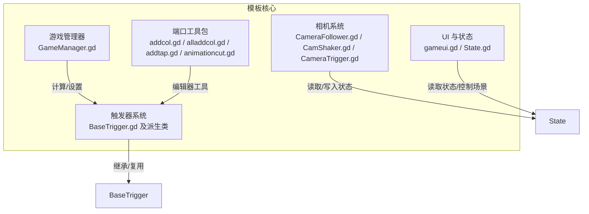
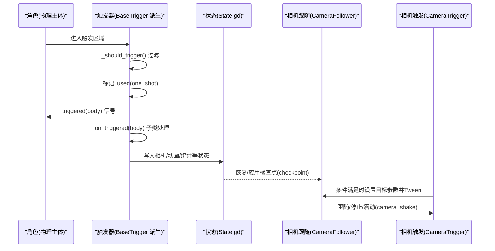
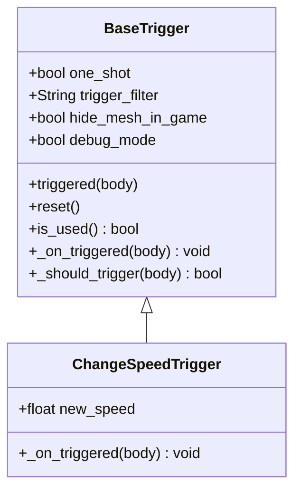
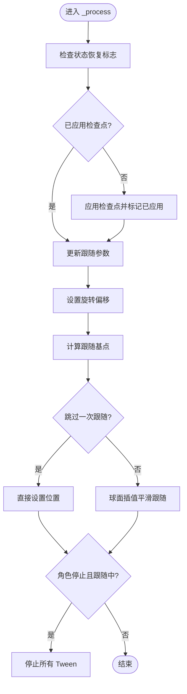
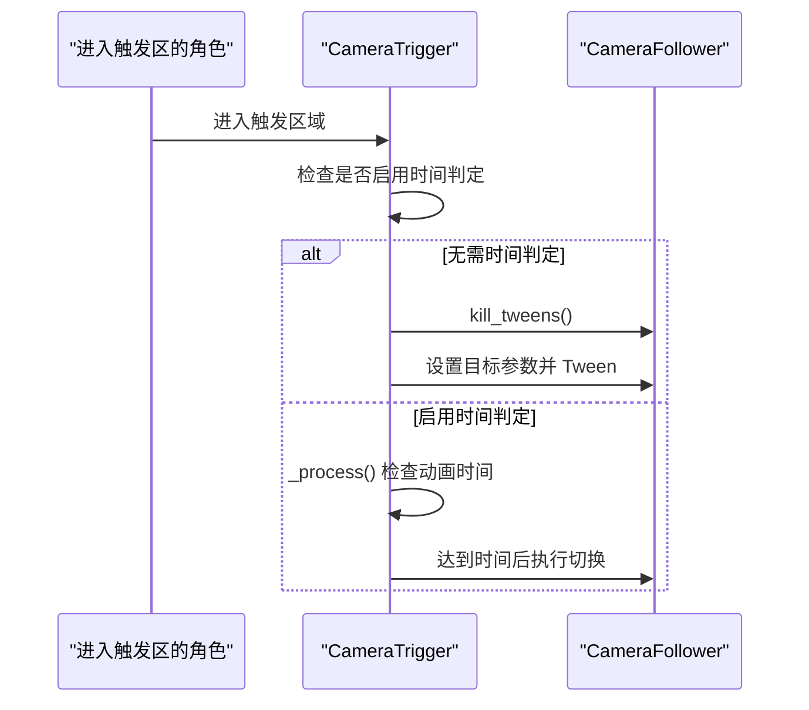
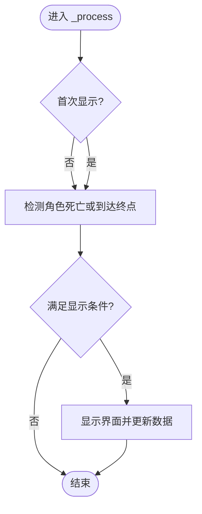
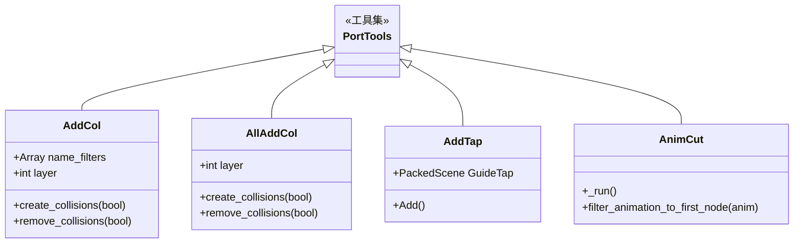
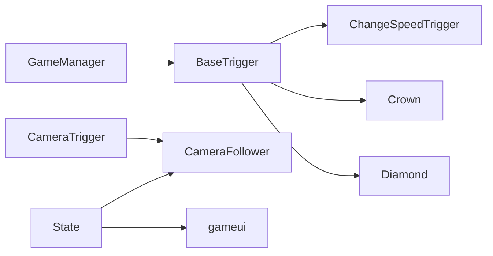

# 扩展开发

<cite>
**本文引用的文件**
- [BaseTrigger.gd](file://#Template/[Scripts]/Trigger/BaseTrigger.gd)
- [ChangeSpeedTrigger.gd](file://#Template/[Scripts]/Trigger/ChangeSpeedTrigger.gd)
- [Crown.gd](file://#Template/[Scripts]/Trigger/Crown.gd)
- [Diamond.gd](file://#Template/[Scripts]/Trigger/Diamond.gd)
- [CameraFollower.gd](file://#Template/[Scripts]/CameraScripts/CameraFollower.gd)
- [CamShaker.gd](file://#Template/[Scripts]/CameraScripts/CamShaker.gd)
- [CameraTrigger.gd](file://#Template/[Scripts]/CameraScripts/CameraTrigger.gd)
- [addcol.gd](file://#Template/[Scripts]/PortTookits/addcol.gd)
- [alladdcol.gd](file://#Template/[Scripts]/PortTookits/alladdcol.gd)
- [addtap.gd](file://#Template/[Scripts]/PortTookits/addtap.gd)
- [animationcut.gd](file://#Template/[Scripts]/PortTookits/animationcut.gd)
- [gameui.gd](file://#Template/[Scripts]/gameui.gd)
- [GameManager.gd](file://#Template/[Scripts]/GameManager.gd)
- [State.gd](file://#Template/[Scripts]/State.gd)
- [README.md](file://README.md)
</cite>

## 目录
1. [简介](#简介)
2. [项目结构](#项目结构)
3. [核心组件](#核心组件)
4. [架构总览](#架构总览)
5. [详细组件分析](#详细组件分析)
6. [依赖关系分析](#依赖关系分析)
7. [性能考虑](#性能考虑)
8. [故障排查指南](#故障排查指南)
9. [结论](#结论)
10. [附录](#附录)

## 简介
本指导文档面向希望在 Godot Line 模板基础上进行扩展开发的开发者，围绕以下主题提供系统化技术指引：
- 如何基于 BaseTrigger 创建新的触发器类型
- 相机效果扩展与 CameraFollower 的定制技巧
- UI 界面定制的实现方案与最佳实践
- 端口工具包（PortTookits）的使用方法与自定义开发思路
- 完整的扩展开发流程与技术要点

## 项目结构
模板采用“模板目录 + 场景/脚本资源”的组织方式，核心扩展点集中在以下目录：
- 触发器系统：#Template/[Scripts]/Trigger/
- 相机系统：#Template/[Scripts]/CameraScripts/
- 端口工具包：#Template/[Scripts]/PortTookits/
- UI 与状态：#Template/[Scripts]/gameui.gd、State.gd
- 其他辅助：GameManager.gd、各资源场景与材质等

图表来源
- [BaseTrigger.gd:1-102](file://#Template/[Scripts]/Trigger/BaseTrigger.gd#L1-L102)
- [CameraFollower.gd:1-168](file://#Template/[Scripts]/CameraScripts/CameraFollower.gd#L1-L168)
- [CamShaker.gd:1-37](file://#Template/[Scripts]/CameraScripts/CamShaker.gd#L1-L37)
- [CameraTrigger.gd:1-76](file://#Template/[Scripts]/CameraScripts/CameraTrigger.gd#L1-L76)
- [addcol.gd:1-121](file://#Template/[Scripts]/PortTookits/addcol.gd#L1-L121)
- [alladdcol.gd:1-108](file://#Template/[Scripts]/PortTookits/alladdcol.gd#L1-L108)
- [addtap.gd:1-27](file://#Template/[Scripts]/PortTookits/addtap.gd#L1-L27)
- [animationcut.gd:1-64](file://#Template/[Scripts]/PortTookits/animationcut.gd#L1-L64)
- [gameui.gd:1-70](file://#Template/[Scripts]/gameui.gd#L1-L70)
- [State.gd:1-21](file://#Template/[Scripts]/State.gd#L1-L21)
- [GameManager.gd:1-47](file://#Template/[Scripts]/GameManager.gd#L1-L47)

章节来源
- [README.md:53-65](file://README.md#L53-L65)

## 核心组件
- BaseTrigger：统一的触发器基类，提供触发信号、过滤器、一次性触发、调试开关与重置能力；子类仅需实现触发后的具体行为。
- CameraFollower：相机跟随逻辑与参数化接口，支持位置/旋转/距离/速度的 Tween 动态调整与相机震动。
- CameraTrigger：基于时间或事件的相机参数切换触发器，配合 CameraFollower 实现镜头切分。
- 端口工具包：编辑器工具集合，覆盖碰撞体批量生成/移除、引导贴图批量放置、动画拆分等。
- UI 与状态：gameui.gd 负责结算/重试/返回等交互；State.gd 提供全局状态共享。

章节来源
- [BaseTrigger.gd:1-102](file://#Template/[Scripts]/Trigger/BaseTrigger.gd#L1-L102)
- [CameraFollower.gd:1-168](file://#Template/[Scripts]/CameraScripts/CameraFollower.gd#L1-L168)
- [CameraTrigger.gd:1-76](file://#Template/[Scripts]/CameraScripts/CameraTrigger.gd#L1-L76)
- [addcol.gd:1-121](file://#Template/[Scripts]/PortTookits/addcol.gd#L1-L121)
- [alladdcol.gd:1-108](file://#Template/[Scripts]/PortTookits/alladdcol.gd#L1-L108)
- [addtap.gd:1-27](file://#Template/[Scripts]/PortTookits/addtap.gd#L1-L27)
- [animationcut.gd:1-64](file://#Template/[Scripts]/PortTookits/animationcut.gd#L1-L64)
- [gameui.gd:1-70](file://#Template/[Scripts]/gameui.gd#L1-L70)
- [State.gd:1-21](file://#Template/[Scripts]/State.gd#L1-L21)

## 架构总览
下图展示了触发器、相机与状态之间的交互关系，以及 UI 与全局状态的联动。

图表来源
- [BaseTrigger.gd:53-91](file://#Template/[Scripts]/Trigger/BaseTrigger.gd#L53-L91)
- [Crown.gd:25-51](file://#Template/[Scripts]/Trigger/Crown.gd#L25-L51)
- [State.gd:1-21](file://#Template/[Scripts]/State.gd#L1-L21)
- [CameraFollower.gd:37-53](file://#Template/[Scripts]/CameraScripts/CameraFollower.gd#L37-L53)
- [CameraTrigger.gd:27-76](file://#Template/[Scripts]/CameraScripts/CameraTrigger.gd#L27-L76)

## 详细组件分析

### 基于 BaseTrigger 的新触发器开发流程
- 继承 BaseTrigger 并重写 _on_triggered(body) 以实现自定义逻辑
- 可选：重写 _should_trigger(body) 以自定义触发条件
- 可选：利用 one_shot、trigger_filter、hide_mesh_in_game、debug_mode 等导出参数
- 可选：调用 reset() 重置一次性触发状态
- 注意：在 _ready() 中不要重复连接信号，BaseTrigger 已在内部管理

图表来源
- [BaseTrigger.gd:11-91](file://#Template/[Scripts]/Trigger/BaseTrigger.gd#L11-L91)
- [ChangeSpeedTrigger.gd:6-15](file://#Template/[Scripts]/Trigger/ChangeSpeedTrigger.gd#L6-L15)

章节来源
- [BaseTrigger.gd:29-102](file://#Template/[Scripts]/Trigger/BaseTrigger.gd#L29-L102)
- [ChangeSpeedTrigger.gd:8-15](file://#Template/[Scripts]/Trigger/ChangeSpeedTrigger.gd#L8-L15)

### 相机效果扩展与 CameraFollower 定制
- 参数化接口：add_position、rotation_offset、distance_from_object、follow_speed
- 动态调整：tween_to_position/rotation/distance/speed 支持缓动与目标值过渡
- 状态恢复：通过 State.gd 的检查点字段在复活/重试时恢复相机参数
- 震动：camera_shake 提供简易抖动实现
- 停止跟随：当角色处于特定状态时自动停止跟随并清理 Tween

图表来源
- [CameraFollower.gd:37-53](file://#Template/[Scripts]/CameraScripts/CameraFollower.gd#L37-L53)
- [CameraFollower.gd:54-72](file://#Template/[Scripts]/CameraScripts/CameraFollower.gd#L54-L72)
- [CameraFollower.gd:115-148](file://#Template/[Scripts]/CameraScripts/CameraFollower.gd#L115-L148)

章节来源
- [CameraFollower.gd:1-168](file://#Template/[Scripts]/CameraScripts/CameraFollower.gd#L1-L168)
- [State.gd:3-9](file://#Template/[Scripts]/State.gd#L3-L9)

### 相机触发器 CameraTrigger 的使用
- 支持即时触发或基于动画时间的触发
- 可选择性地切换位置、旋转、距离、跟随速度
- 通过 CameraFollower 的 kill_tweens 与属性 Tween 实现平滑过渡

图表来源
- [CameraTrigger.gd:27-76](file://#Template/[Scripts]/CameraScripts/CameraTrigger.gd#L27-L76)
- [CameraFollower.gd:74-83](file://#Template/[Scripts]/CameraScripts/CameraFollower.gd#L74-L83)

章节来源
- [CameraTrigger.gd:1-76](file://#Template/[Scripts]/CameraScripts/CameraTrigger.gd#L1-L76)

### UI 界面定制与最佳实践
- gameui.gd 提供失败/胜利结算界面，包含钻石数、皇冠数、标题与按钮交互
- 通过 State.gd 控制显示时机与数据刷新
- 最佳实践
  - 使用 State.crown 与 State.diamond 更新 UI 数值
  - 使用 State.is_end 与 State.is_relive 控制界面显示与按钮行为
  - 重试/回退时清空状态并重载场景

图表来源
- [gameui.gd:10-38](file://#Template/[Scripts]/gameui.gd#L10-L38)
- [gameui.gd:40-70](file://#Template/[Scripts]/gameui.gd#L40-L70)
- [State.gd:12-21](file://#Template/[Scripts]/State.gd#L12-L21)

章节来源
- [gameui.gd:1-70](file://#Template/[Scripts]/gameui.gd#L1-L70)
- [State.gd:1-21](file://#Template/[Scripts]/State.gd#L1-L21)

### 端口工具包使用与自定义开发
- addcol.gd：按名称过滤为 MeshInstance3D 添加凸形碰撞体，支持编辑器一键生成/移除
- alladdcol.gd：对场景内所有 MeshInstance3D 添加静态碰撞体，支持位层掩码
- addtap.gd：在所有子节点位置批量实例化引导贴图（GuideTap），便于布阵与提示
- animationcut.gd：将 AnimationPlayer 的动画拆分为独立的 AnimationPlayer，仅保留首个节点的轨道
- 自定义开发建议
  - 在 @tool 模式下编写编辑器工具，利用 EditorScript/EditorNode 等扩展
  - 通过 get_all_mesh_instances/get_all_static_bodies 递归遍历场景节点
  - 注意设置 owner 与场景树所有权，确保保存生效

图表来源
- [addcol.gd:1-121](file://#Template/[Scripts]/PortTookits/addcol.gd#L1-L121)
- [alladdcol.gd:1-108](file://#Template/[Scripts]/PortTookits/alladdcol.gd#L1-L108)
- [addtap.gd:1-27](file://#Template/[Scripts]/PortTookits/addtap.gd#L1-L27)
- [animationcut.gd:1-64](file://#Template/[Scripts]/PortTookits/animationcut.gd#L1-L64)

章节来源
- [addcol.gd:1-121](file://#Template/[Scripts]/PortTookits/addcol.gd#L1-L121)
- [alladdcol.gd:1-108](file://#Template/[Scripts]/PortTookits/alladdcol.gd#L1-L108)
- [addtap.gd:1-27](file://#Template/[Scripts]/PortTookits/addtap.gd#L1-L27)
- [animationcut.gd:1-64](file://#Template/[Scripts]/PortTookits/animationcut.gd#L1-L64)

## 依赖关系分析
- 触发器依赖 BaseTrigger 的统一信号与生命周期管理
- 相机系统依赖 State.gd 的全局状态进行参数恢复
- UI 依赖 State.gd 的状态变化驱动显示
- 端口工具包在编辑器环境下工作，不参与运行时逻辑

图表来源
- [BaseTrigger.gd:1-102](file://#Template/[Scripts]/Trigger/BaseTrigger.gd#L1-L102)
- [ChangeSpeedTrigger.gd:1-15](file://#Template/[Scripts]/Trigger/ChangeSpeedTrigger.gd#L1-L15)
- [Crown.gd:1-52](file://#Template/[Scripts]/Trigger/Crown.gd#L1-L52)
- [Diamond.gd:1-17](file://#Template/[Scripts]/Trigger/Diamond.gd#L1-L17)
- [State.gd:1-21](file://#Template/[Scripts]/State.gd#L1-L21)
- [CameraFollower.gd:1-168](file://#Template/[Scripts]/CameraScripts/CameraFollower.gd#L1-L168)
- [CameraTrigger.gd:1-76](file://#Template/[Scripts]/CameraScripts/CameraTrigger.gd#L1-L76)
- [GameManager.gd:1-47](file://#Template/[Scripts]/GameManager.gd#L1-L47)

章节来源
- [README.md:53-65](file://README.md#L53-L65)

## 性能考虑
- 触发器
  - 使用 one_shot 减少重复处理
  - 在编辑器模式下避免运行时逻辑（Engine.is_editor_hint）
- 相机
  - 使用球面插值与缓动参数控制平滑度与性能平衡
  - 在角色停止时及时 kill_tweens，避免无效更新
- UI
  - 仅在状态变化时更新文本与纹理，避免频繁重绘
- 端口工具包
  - 批量操作时注意递归遍历的复杂度，必要时限制层级或节点数量

## 故障排查指南
- 触发器无效
  - 检查 trigger_filter 与 _should_trigger 返回值
  - 确认 body_entered 信号连接与 one_shot 状态
- 相机不跟随
  - 检查 player_node 解析与 following 标志
  - 确认 State.checkpoint 已正确写入与恢复
- 相机震动无效
  - 确认 camera_parent 指定与原始位置保存
- UI 不显示
  - 检查 State.is_end/is_relive 与 gameui.visible() 调用时机
- 端口工具包未生效
  - 确保在编辑器模式下执行，且节点拥有 owner

章节来源
- [BaseTrigger.gd:53-91](file://#Template/[Scripts]/Trigger/BaseTrigger.gd#L53-L91)
- [CameraFollower.gd:37-53](file://#Template/[Scripts]/CameraScripts/CameraFollower.gd#L37-L53)
- [CamShaker.gd:16-37](file://#Template/[Scripts]/CameraScripts/CamShaker.gd#L16-L37)
- [gameui.gd:17-38](file://#Template/[Scripts]/gameui.gd#L17-L38)
- [addcol.gd:20-66](file://#Template/[Scripts]/PortTookits/addcol.gd#L20-L66)
- [alladdcol.gd:20-76](file://#Template/[Scripts]/PortTookits/alladdcol.gd#L20-L76)

## 结论
通过以上组件与流程，开发者可以在 Godot Line 模板上快速扩展新的触发器类型、定制相机跟随与触发策略、优化 UI 表现，并借助端口工具包提升关卡制作效率。建议在扩展前先理解 BaseTrigger 的统一机制与 State 的状态契约，确保新功能与现有系统保持一致的交互与性能表现。

## 附录
- 快速开始
  - 在 Godot 4.6 中打开项目，运行主场景体验核心玩法
  - 在编辑器中使用端口工具包进行碰撞体与引导贴图的批量布置
- 命名与文件组织
  - 新触发器建议命名为 XxxTrigger.gd，继承 BaseTrigger
  - 相机相关脚本集中于 CameraScripts 目录
  - UI 与状态脚本位于 Scripts 根目录
- 测试与验证
  - 使用 gdUnit4 进行单元测试，确保扩展逻辑稳定

章节来源
- [README.md:19-87](file://README.md#L19-L87)