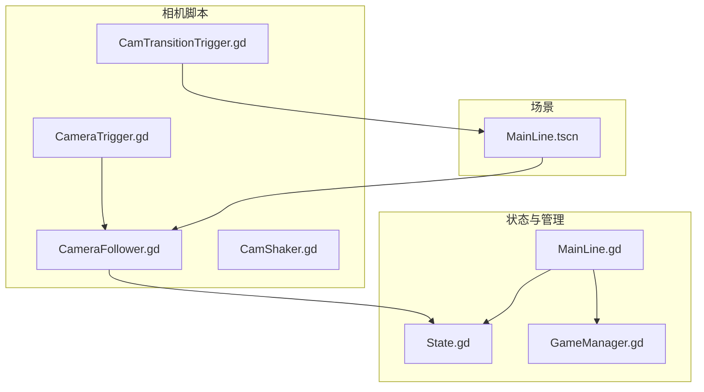
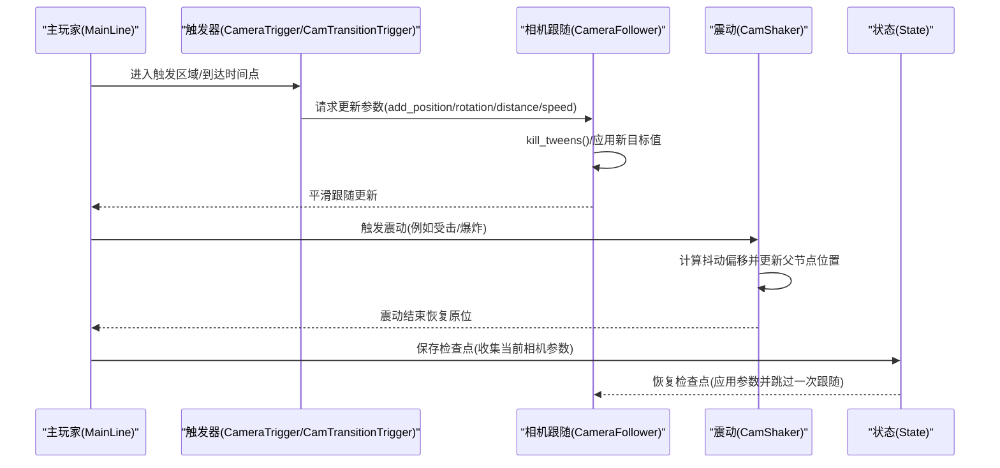
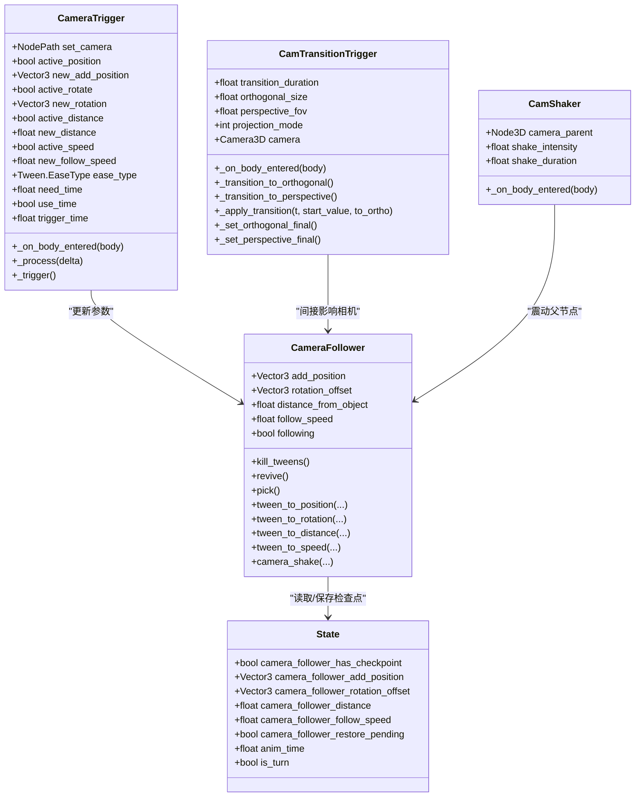

# 相机系统扩展

<cite>
**本文引用的文件**
- [CameraFollower.gd](file://#Template/[Scripts]/CameraScripts/CameraFollower.gd)
- [CamShaker.gd](file://#Template/[Scripts]/CameraScripts/CamShaker.gd)
- [CameraTrigger.gd](file://#Template/[Scripts]/CameraScripts/CameraTrigger.gd)
- [CamTransitionTrigger.gd](file://#Template/[Scripts]/CameraScripts/CamTransitionTrigger.gd)
- [State.gd](file://#Template/[Scripts]/State.gd)
- [GameManager.gd](file://#Template/[Scripts]/GameManager.gd)
- [MainLine.gd](file://#Template/[Scripts]/MainLine.gd)
- [Crown.gd](file://#Template/[Scripts]/Trigger/Crown.gd)
- [MainLine.tscn](file://#Template/MainLine.tscn)
</cite>

## 目录
1. [简介](#简介)
2. [项目结构](#项目结构)
3. [核心组件](#核心组件)
4. [架构总览](#架构总览)
5. [详细组件分析](#详细组件分析)
6. [依赖关系分析](#依赖关系分析)
7. [性能考虑](#性能考虑)
8. [故障排查指南](#故障排查指南)
9. [结论](#结论)
10. [附录](#附录)

## 简介
本指南面向Godot Line项目的相机系统扩展开发者，围绕以下主题提供系统化说明与实操建议：
- CameraFollower的扩展与定制：包括跟随算法的修改思路、相机行为的调整策略，以及状态检查点与恢复机制的使用。
- CamShaker震动效果的扩展与自定义震动模式实现：基于区域触发的震动系统，支持强度与持续时间参数化。
- CameraTrigger与CamTransitionTrigger的触发机制与效果组合：讲解基于时间或进入触发的相机参数过渡，以及投影模式切换的两阶段动画。
- 性能优化建议与最佳实践：针对相机跟随、Tween动画、投影切换等关键路径给出优化方向。
- 具体示例：如何创建新的相机效果（如镜头切换、特殊视角），以及相机与触发器系统的集成与响应机制。

## 项目结构
相机系统相关的核心脚本位于“#Template/[Scripts]/CameraScripts/”目录，配合状态管理State.gd、主玩家控制MainLine.gd、以及场景MainLine.tscn共同构成完整的相机控制链路。

图表来源
- [CameraFollower.gd:1-168](file://#Template/[Scripts]/CameraScripts/CameraFollower.gd#L1-L168)
- [CamShaker.gd:1-37](file://#Template/[Scripts]/CameraScripts/CamShaker.gd#L1-L37)
- [CameraTrigger.gd:1-76](file://#Template/[Scripts]/CameraScripts/CameraTrigger.gd#L1-L76)
- [CamTransitionTrigger.gd:1-125](file://#Template/[Scripts]/CameraScripts/CamTransitionTrigger.gd#L1-L125)
- [State.gd:1-23](file://#Template/[Scripts]/State.gd#L1-L23)
- [GameManager.gd:1-47](file://#Template/[Scripts]/GameManager.gd#L1-L47)
- [MainLine.gd:1-224](file://#Template/[Scripts]/MainLine.gd#L1-L224)
- [MainLine.tscn:1-68](file://#Template/MainLine.tscn#L1-L68)

章节来源
- [CameraFollower.gd:1-168](file://#Template/[Scripts]/CameraScripts/CameraFollower.gd#L1-L168)
- [CamShaker.gd:1-37](file://#Template/[Scripts]/CameraScripts/CamShaker.gd#L1-L37)
- [CameraTrigger.gd:1-76](file://#Template/[Scripts]/CameraScripts/CameraTrigger.gd#L1-L76)
- [CamTransitionTrigger.gd:1-125](file://#Template/[Scripts]/CameraScripts/CamTransitionTrigger.gd#L1-L125)
- [State.gd:1-23](file://#Template/[Scripts]/State.gd#L1-L23)
- [GameManager.gd:1-47](file://#Template/[Scripts]/GameManager.gd#L1-L47)
- [MainLine.gd:1-224](file://#Template/[Scripts]/MainLine.gd#L1-L224)
- [MainLine.tscn:1-68](file://#Template/MainLine.tscn#L1-L68)

## 核心组件
- CameraFollower：负责跟随主体（玩家）的相机节点，支持位置偏移、旋转偏移、距离与跟随速度的动态调整，以及基于Tween的平滑过渡与震动效果。
- CamShaker：基于Area3D的震动触发器，对指定的相机父节点进行随机抖动，适合爆炸、碰撞等冲击反馈。
- CameraTrigger：基于区域触发的相机参数切换器，可按需对位置、旋转、距离、跟随速度进行时间化的过渡。
- CamTransitionTrigger：投影模式切换触发器，支持正交与透视之间的两阶段平滑过渡，包含超长焦模拟与最终模式锁定。
- State：全局状态容器，用于保存相机跟随参数的检查点与恢复标记，以及动画时间、转向状态等。
- GameManager/MainLine：提供动画起始时间计算、主玩家状态与相机绑定等辅助能力。

章节来源
- [CameraFollower.gd:1-168](file://#Template/[Scripts]/CameraScripts/CameraFollower.gd#L1-L168)
- [CamShaker.gd:1-37](file://#Template/[Scripts]/CameraScripts/CamShaker.gd#L1-L37)
- [CameraTrigger.gd:1-76](file://#Template/[Scripts]/CameraScripts/CameraTrigger.gd#L1-L76)
- [CamTransitionTrigger.gd:1-125](file://#Template/[Scripts]/CameraScripts/CamTransitionTrigger.gd#L1-L125)
- [State.gd:1-23](file://#Template/[Scripts]/State.gd#L1-L23)
- [GameManager.gd:1-47](file://#Template/[Scripts]/GameManager.gd#L1-L47)
- [MainLine.gd:1-224](file://#Template/[Scripts]/MainLine.gd#L1-L224)

## 架构总览
相机系统通过CameraFollower作为中枢，接收来自触发器的参数变更请求；同时借助State实现参数检查点与恢复；CamShaker提供即时震动反馈；CamTransitionTrigger负责投影模式的平滑切换。

图表来源
- [CameraTrigger.gd:44-76](file://#Template/[Scripts]/CameraScripts/CameraTrigger.gd#L44-L76)
- [CameraFollower.gd:74-148](file://#Template/[Scripts]/CameraScripts/CameraFollower.gd#L74-L148)
- [CamShaker.gd:16-37](file://#Template/[Scripts]/CameraScripts/CamShaker.gd#L16-L37)
- [State.gd:3-9](file://#Template/[Scripts]/State.gd#L3-L9)

## 详细组件分析

### CameraFollower 扩展与定制
CameraFollower是相机系统的核心，负责将相机跟随主体并处理参数过渡与震动。其关键特性包括：
- 参数导出：player、add_position、rotation_offset、distance_from_object、follow_speed、following。
- 跟随逻辑：每帧根据player位置与偏移计算目标位置，使用球面插值实现平滑移动；支持暂停跟随与一次性跳过。
- 参数过渡：提供tween_to_*系列方法，分别对位置、旋转、距离、速度进行带缓动的过渡。
- 震动：内置camera_shake方法，对子相机节点进行随机抖动，支持强度与持续时间。
- 检查点：通过State保存当前相机参数，重启或复活时可恢复到之前的状态。

扩展建议
- 自定义跟随算法：可在跟随逻辑中加入阻尼、预测位移、分层跟随（多主体）等策略，以适配更复杂的关卡需求。
- 参数过渡策略：结合EaseType与Trans类型，设计更自然的缓动曲线；对不同参数采用差异化过渡时长。
- 震动系统增强：将震动封装为独立模块，支持多源叠加、衰减曲线、方向性震动等。

章节来源
- [CameraFollower.gd:1-168](file://#Template/[Scripts]/CameraScripts/CameraFollower.gd#L1-L168)
- [State.gd:3-9](file://#Template/[Scripts]/State.gd#L3-L9)

### CamShaker 震动效果扩展
CamShaker通过Area3D检测角色进入，对指定的相机父节点进行随机抖动。其关键点：
- 参数：camera_parent、shake_intensity、shake_duration。
- 触发：当CharacterBody3D进入区域时启动计时器，周期内随机偏移父节点位置。
- 结束：计时结束后恢复原位。

扩展建议
- 多震动源：允许多个CamShaker同时生效，叠加随机向量或采用合成强度。
- 方向性震动：允许设定震动方向权重，实现前后左右不同强度。
- 振动曲线：引入衰减曲线（如指数/余弦）替代均匀随机，提升真实感。

章节来源
- [CamShaker.gd:1-37](file://#Template/[Scripts]/CameraScripts/CamShaker.gd#L1-L37)

### CameraTrigger 触发机制与效果组合
CameraTrigger支持两种触发方式：立即触发与基于动画时间的触发。其关键流程：
- 区域触发：当主玩家进入区域时，若未启用时间判定则直接触发。
- 时间判定：若启用use_time，则读取主玩家动画播放进度，达到trigger_time后触发。
- 效果组合：对位置、旋转、距离、速度分别进行Tween过渡，ease_type与need_time可配置。

扩展建议
- 多阶段过渡：在多个触发器之间串联过渡，形成连续的镜头运动。
- 条件组合：结合其他触发器状态（如Crown）决定是否执行过渡。
- 动态参数：根据主玩家速度或状态动态调整need_time与ease_type。

章节来源
- [CameraTrigger.gd:1-76](file://#Template/[Scripts]/CameraScripts/CameraTrigger.gd#L1-L76)
- [MainLine.gd:168-184](file://#Template/[Scripts]/MainLine.gd#L168-L184)

### CamTransitionTrigger 投影切换机制
CamTransitionTrigger负责正交与透视投影之间的平滑切换，采用两阶段过渡：
- 切换模式：枚举选择“切换至正交”或“切换至透视”。
- 两阶段动画：
  - 正交→透视：先将正交视口缩小到超长焦（模拟正交感），再切换透视并放大FOV。
  - 透视→正交：先将透视FOV缩小到超长焦，再切换正交并增大size。
- 完成回调：在Tween完成后锁定最终投影参数。

扩展建议
- 混合模式：在两阶段之间插入淡入淡出或遮罩效果，提升观感。
- 参数化：将MIN_FOV、SWITCH_THRESHOLD等阈值参数化，便于美术与策划微调。
- 与触发器联动：与CameraTrigger组合，实现“到达某区域时切换投影并调整相机参数”。

章节来源
- [CamTransitionTrigger.gd:1-125](file://#Template/[Scripts]/CameraScripts/CamTransitionTrigger.gd#L1-L125)

### 相机与触发器系统的集成与响应
- 主玩家(MainLine)与相机绑定：场景中通过NodePath将MainLine与Camera绑定，相机跟随主体移动。
- 状态驱动：Crown等触发器会将当前相机参数写入State，CameraFollower在重启时恢复这些参数。
- 动画时间：GameManager提供calculate_anim_start_time，用于根据主玩家移动距离与速度推导动画起始时间，供触发器与相机联动。

章节来源
- [MainLine.tscn:48-58](file://#Template/MainLine.tscn#L48-L58)
- [Crown.gd:25-57](file://#Template/[Scripts]/Trigger/Crown.gd#L25-L57)
- [GameManager.gd:23-39](file://#Template/[Scripts]/GameManager.gd#L23-L39)
- [MainLine.gd:168-184](file://#Template/[Scripts]/MainLine.gd#L168-L184)

## 依赖关系分析
相机系统内部依赖清晰，耦合度较低，便于扩展与维护。

图表来源
- [CameraFollower.gd:1-168](file://#Template/[Scripts]/CameraScripts/CameraFollower.gd#L1-L168)
- [CamShaker.gd:1-37](file://#Template/[Scripts]/CameraScripts/CamShaker.gd#L1-L37)
- [CameraTrigger.gd:1-76](file://#Template/[Scripts]/CameraScripts/CameraTrigger.gd#L1-L76)
- [CamTransitionTrigger.gd:1-125](file://#Template/[Scripts]/CameraScripts/CamTransitionTrigger.gd#L1-L125)
- [State.gd:1-23](file://#Template/[Scripts]/State.gd#L1-L23)

## 性能考虑
- 跟随更新频率：CameraFollower在每帧进行球面插值，建议根据设备性能调整follow_speed与distance_from_object，避免过度频繁的插值。
- Tween复用：优先复用已存在的Tween实例，减少创建销毁开销；必要时调用kill_tweens()中断旧动画。
- 抖动渲染：CamShaker在每帧生成随机偏移，建议限制shake_intensity与shake_duration，避免高频次的相机变换导致GPU压力。
- 投影切换：CamTransitionTrigger的两阶段过渡使用Tween与lerp，建议合理设置transition_duration，避免过短导致画面闪烁。
- 状态访问：State为全局节点，频繁读写时注意避免在热路径中重复查找节点，可通过缓存引用降低开销。

## 故障排查指南
- 相机不跟随或跳变
  - 检查following标志位与player_node是否正确赋值。
  - 若启用检查点恢复，确认State中的camera_follower_restore_pending被置为false。
  - 参考路径：[CameraFollower.gd:37-72](file://#Template/[Scripts]/CameraScripts/CameraFollower.gd#L37-L72)
- 参数过渡无效
  - 确认CameraTrigger中active_*开关与目标值设置正确，且未被后续触发覆盖。
  - 参考路径：[CameraTrigger.gd:44-76](file://#Template/[Scripts]/CameraScripts/CameraTrigger.gd#L44-L76)
- 震动无效果
  - 确认camera_parent已正确赋值，且CamShaker区域被CharacterBody3D进入。
  - 参考路径：[CamShaker.gd:16-37](file://#Template/[Scripts]/CameraScripts/CamShaker.gd#L16-L37)
- 投影切换异常
  - 检查camera引用是否有效，projection_mode枚举值是否正确。
  - 参考路径：[CamTransitionTrigger.gd:21-125](file://#Template/[Scripts]/CameraScripts/CamTransitionTrigger.gd#L21-L125)
- 状态恢复失败
  - 确认State中has_checkpoint与restore_pending标志位，以及相机参数字段是否完整写入。
  - 参考路径：[State.gd:3-9](file://#Template/[Scripts]/State.gd#L3-L9)，[Crown.gd:25-48](file://#Template/[Scripts]/Trigger/Crown.gd#L25-L48)

章节来源
- [CameraFollower.gd:37-72](file://#Template/[Scripts]/CameraScripts/CameraFollower.gd#L37-L72)
- [CameraTrigger.gd:44-76](file://#Template/[Scripts]/CameraScripts/CameraTrigger.gd#L44-L76)
- [CamShaker.gd:16-37](file://#Template/[Scripts]/CameraScripts/CamShaker.gd#L16-L37)
- [CamTransitionTrigger.gd:21-125](file://#Template/[Scripts]/CameraScripts/CamTransitionTrigger.gd#L21-L125)
- [State.gd:3-9](file://#Template/[Scripts]/State.gd#L3-L9)
- [Crown.gd:25-48](file://#Template/[Scripts]/Trigger/Crown.gd#L25-L48)

## 结论
Godot Line的相机系统以CameraFollower为核心，结合触发器与状态管理实现了灵活的参数过渡与投影切换。通过本文档的扩展指南与最佳实践，开发者可以快速实现新的相机效果（如镜头切换、特殊视角），并保持良好的性能与可维护性。

## 附录

### 新相机效果实现示例（步骤说明）
- 镜头切换
  - 使用CamTransitionTrigger在特定区域触发投影切换，结合CameraTrigger在切换前后调整add_position/rotation/distance/speed，形成“进入区域→切换投影→调整视角”的组合效果。
  - 参考路径：[CamTransitionTrigger.gd:27-125](file://#Template/[Scripts]/CameraScripts/CamTransitionTrigger.gd#L27-L125)，[CameraTrigger.gd:44-76](file://#Template/[Scripts]/CameraScripts/CameraTrigger.gd#L44-L76)
- 特殊视角
  - 在CameraTrigger中设置新的rotation_offset与distance_from_object，配合tween_to_*方法实现平滑过渡；若需要震动反馈，可在同一区域中叠加CamShaker。
  - 参考路径：[CameraFollower.gd:115-148](file://#Template/[Scripts]/CameraScripts/CameraFollower.gd#L115-L148)，[CamShaker.gd:16-37](file://#Template/[Scripts]/CameraScripts/CamShaker.gd#L16-L37)
- 与触发器系统集成
  - 在Crown等触发器中调用State保存相机参数，CameraFollower在重启时恢复；或在CameraTrigger中读取主玩家动画进度，实现基于时间的精确触发。
  - 参考路径：[Crown.gd:25-48](file://#Template/[Scripts]/Trigger/Crown.gd#L25-L48)，[GameManager.gd:23-39](file://#Template/[Scripts]/GameManager.gd#L23-L39)，[MainLine.gd:168-184](file://#Template/[Scripts]/MainLine.gd#L168-L184)