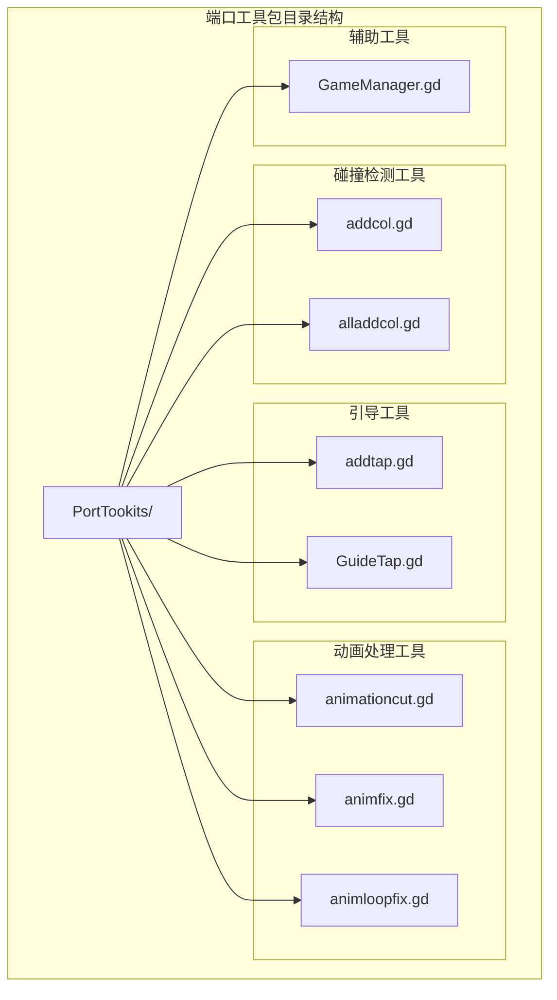
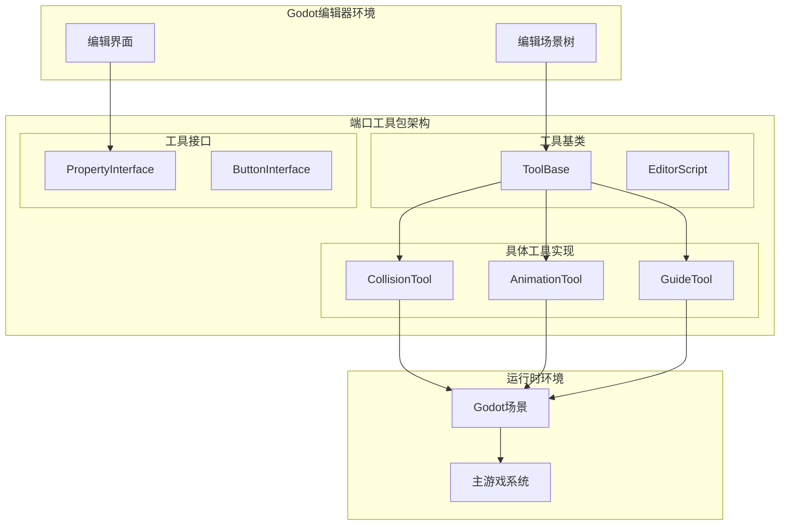
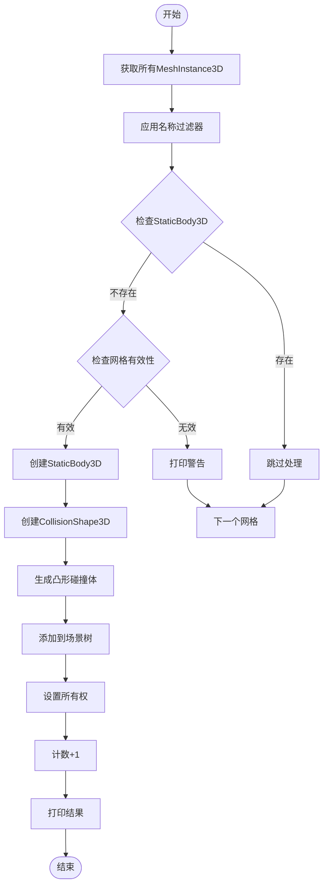
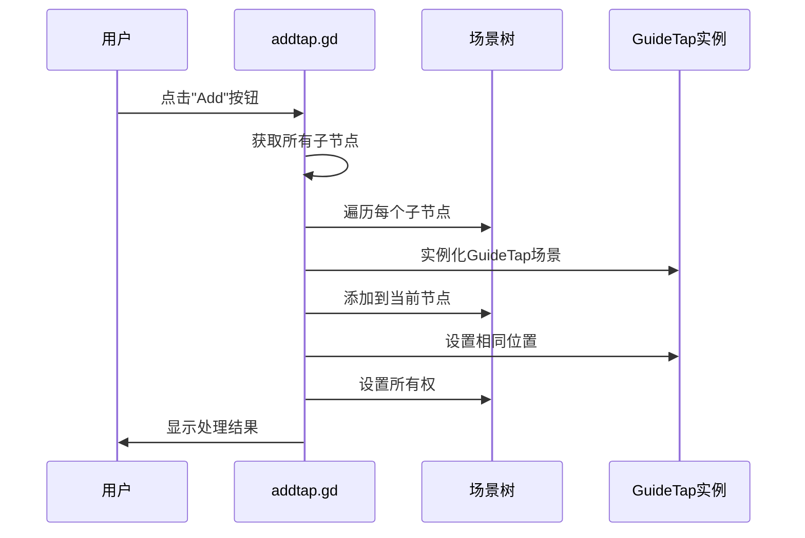
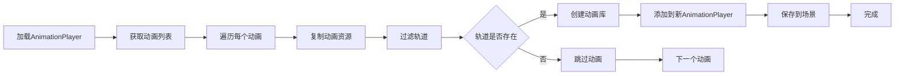
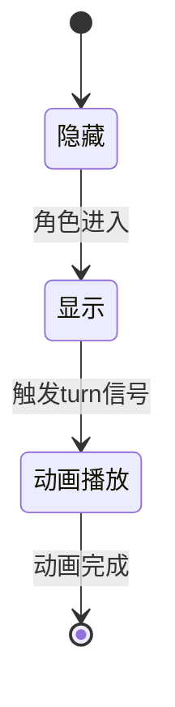
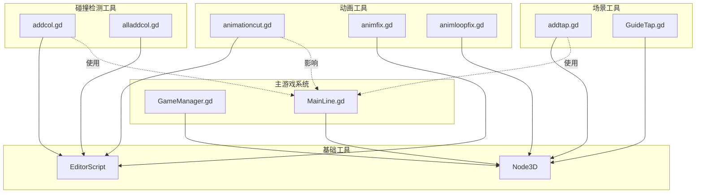

# 端口工具包开发

<cite>
**本文档引用的文件**
- [addcol.gd](file://#Template/[Scripts]/PortTookits/addcol.gd)
- [addtap.gd](file://#Template/[Scripts]/PortTookits/addtap.gd)
- [alladdcol.gd](file://#Template/[Scripts]/PortTookits/alladdcol.gd)
- [animationcut.gd](file://#Template/[Scripts]/PortTookits/animationcut.gd)
- [animfix.gd](file://#Template/[Scripts]/PortTookits/animfix.gd)
- [animloopfix.gd](file://#Template/[Scripts]/PortTookits/animloopfix.gd)
- [GuideTap.gd](file://#Template/[Scripts]/GuideLine/GuideTap.gd)
- [GameManager.gd](file://#Template/[Scripts]/GameManager.gd)
- [MainLine.gd](file://#Template/[Scripts]/MainLine.gd)
- [MainLine_test.gd](file://Tests/MainLine_test.gd)
- [Crown_test.gd](file://Tests/Crown_test.gd)
</cite>

## 目录
1. [简介](#简介)
2. [项目结构](#项目结构)
3. [核心组件](#核心组件)
4. [架构概览](#架构概览)
5. [详细组件分析](#详细组件分析)
6. [依赖关系分析](#依赖关系分析)
7. [性能考虑](#性能考虑)
8. [故障排除指南](#故障排除指南)
9. [结论](#结论)
10. [附录](#附录)

## 简介

Godot Line的端口工具包是一套用于游戏开发过程中的实用工具集合，主要服务于场景编辑、动画处理和碰撞检测等任务。这些工具通过Godot的@tool注解在编辑器环境中运行，提供了强大的自动化功能来简化开发流程。

端口工具包的核心价值在于：
- **自动化场景构建**：快速生成碰撞体和引导工具
- **动画批量处理**：统一管理动画资源和播放行为
- **开发效率提升**：减少重复性工作，提高开发速度
- **质量保证**：通过测试套件确保工具的可靠性

## 项目结构

端口工具包位于`#Template/[Scripts]/PortTookits/`目录下，包含多个专门用途的工具脚本：

**图表来源**
- [addcol.gd:1-121](file://#Template/[Scripts]/PortTookits/addcol.gd#L1-L121)
- [alladdcol.gd:1-108](file://#Template/[Scripts]/PortTookits/alladdcol.gd#L1-L108)
- [addtap.gd:1-27](file://#Template/[Scripts]/PortTookits/addtap.gd#L1-L27)

**章节来源**
- [addcol.gd:1-121](file://#Template/[Scripts]/PortTookits/addcol.gd#L1-L121)
- [alladdcol.gd:1-108](file://#Template/[Scripts]/PortTookits/alladdcol.gd#L1-L108)
- [addtap.gd:1-27](file://#Template/[Scripts]/PortTookits/addtap.gd#L1-L27)

## 核心组件

端口工具包包含以下主要组件：

### 碰撞检测工具组
- **addcol.gd**：基于名称过滤的智能碰撞体生成器
- **alladdcol.gd**：无条件处理所有网格实例的碰撞体生成器

### 引导工具组
- **addtap.gd**：批量添加引导工具的工具
- **GuideTap.gd**：单个引导工具的实现逻辑

### 动画处理工具组
- **animationcut.gd**：动画分割和库化工具
- **animfix.gd**：动画路径修复工具
- **animloopfix.gd**：动画循环模式批量设置工具

### 辅助工具
- **GameManager.gd**：游戏管理器，提供工具按钮和辅助功能

**章节来源**
- [animationcut.gd:1-64](file://#Template/[Scripts]/PortTookits/animationcut.gd#L1-L64)
- [animfix.gd:1-55](file://#Template/[Scripts]/PortTookits/animfix.gd#L1-L55)
- [animloopfix.gd:1-100](file://#Template/[Scripts]/PortTookits/animloopfix.gd#L1-L100)

## 架构概览

端口工具包采用模块化设计，每个工具都是独立的GDScript类，通过Godot的@tool系统在编辑器中运行：

**图表来源**
- [addcol.gd:1-121](file://#Template/[Scripts]/PortTookits/addcol.gd#L1-L121)
- [animationcut.gd:1-64](file://#Template/[Scripts]/PortTookits/animationcut.gd#L1-L64)
- [addtap.gd:1-27](file://#Template/[Scripts]/PortTookits/addtap.gd#L1-L27)

## 详细组件分析

### addcol.gd - 智能碰撞体生成器

addcol.gd是一个基于名称过滤的智能碰撞体生成工具，具有以下特性：

#### 核心功能
- **名称过滤机制**：通过name_filters数组精确控制处理范围
- **动态创建**：在编辑器中实时创建StaticBody3D和CollisionShape3D
- **所有权管理**：正确设置场景树所有权以确保保存

#### 实现原理

**图表来源**
- [addcol.gd:20-66](file://#Template/[Scripts]/PortTookits/addcol.gd#L20-L66)

#### 扩展机制
- **过滤器扩展**：支持多关键词过滤
- **层管理**：可配置碰撞层
- **批量操作**：支持创建和删除操作

**章节来源**
- [addcol.gd:1-121](file://#Template/[Scripts]/PortTookits/addcol.gd#L1-L121)

### alladdcol.gd - 全局碰撞体生成器

alladdcol.gd是addcol.gd的增强版本，提供更灵活的配置选项：

#### 主要改进
- **位掩码层管理**：使用1<<layer的位运算实现精确层控制
- **简化逻辑**：移除名称过滤，直接处理所有网格
- **错误处理**：改进的网格有效性检查

#### 性能优化
- **递归遍历**：高效的场景树遍历算法
- **内存管理**：及时释放不需要的对象引用

**章节来源**
- [alladdcol.gd:1-108](file://#Template/[Scripts]/PortTookits/alladdcol.gd#L1-L108)

### addtap.gd - 引导工具批量添加器

addtap.gd专注于批量添加引导工具，简化了场景构建流程：

#### 工作流程

**图表来源**
- [addtap.gd:5-26](file://#Template/[Scripts]/PortTookits/addtap.gd#L5-L26)

**章节来源**
- [addtap.gd:1-27](file://#Template/[Scripts]/PortTookits/addtap.gd#L1-L27)

### animationcut.gd - 动画分割工具

animationcut.gd实现了动画资源的智能分割和库化：

#### 核心算法
- **轨道分析**：识别动画中的主要目标节点
- **轨道过滤**：仅保留第一个节点的动画轨道
- **资源复制**：安全地复制动画资源

#### 实现细节

**图表来源**
- [animationcut.gd:4-46](file://#Template/[Scripts]/PortTookits/animationcut.gd#L4-L46)

**章节来源**
- [animationcut.gd:1-64](file://#Template/[Scripts]/PortTookits/animationcut.gd#L1-L64)

### animfix.gd - 动画路径修复工具

animfix.gd专门解决动画路径中的点号问题：

#### 修复策略
- **路径转换**：将"."替换为"_"
- **数据备份**：完整备份轨道属性和关键帧数据
- **安全恢复**：重建轨道并恢复所有属性

#### 关键技术
- **逆序遍历**：避免删除轨道时的索引问题
- **属性映射**：精确复制轨道类型、插值和启用状态
- **数据完整性**：确保关键帧时间和值的准确性

**章节来源**
- [animfix.gd:1-55](file://#Template/[Scripts]/PortTookits/animfix.gd#L1-L55)

### animloopfix.gd - 动画循环模式批量设置

animloopfix.gd提供了强大的批量动画管理功能：

#### 核心功能
- **模式匹配**：支持通配符的节点名称筛选
- **批量设置**：自动设置autoplay和循环模式
- **实时测试**：提供播放和停止测试功能

#### 高级特性
- **编辑器集成**：完整的编辑器操作界面
- **运行时支持**：游戏运行时自动应用设置
- **场景标记**：自动标记场景为未保存状态

**章节来源**
- [animloopfix.gd:1-100](file://#Template/[Scripts]/PortTookits/animloopfix.gd#L1-L100)

### GuideTap.gd - 单个引导工具实现

GuideTap.gd是addtap.gd创建的引导工具的具体实现：

#### 交互逻辑
- **可见性控制**：进入触发区域时显示
- **事件响应**：处理CharacterBody3D的进入事件
- **动画协调**：与主游戏系统的动画同步

#### 状态管理

**图表来源**
- [GuideTap.gd:1-11](file://#Template/[Scripts]/GuideLine/GuideTap.gd#L1-L11)

**章节来源**
- [GuideTap.gd:1-11](file://#Template/[Scripts]/GuideLine/GuideTap.gd#L1-L11)

## 依赖关系分析

端口工具包内部的依赖关系体现了清晰的层次结构：

**图表来源**
- [addcol.gd:1-121](file://#Template/[Scripts]/PortTookits/addcol.gd#L1-L121)
- [addtap.gd:1-27](file://#Template/[Scripts]/PortTookits/addtap.gd#L1-L27)
- [animationcut.gd:1-64](file://#Template/[Scripts]/PortTookits/animationcut.gd#L1-L64)

**章节来源**
- [GameManager.gd:1-47](file://#Template/[Scripts]/GameManager.gd#L1-L47)
- [MainLine.gd:1-224](file://#Template/[Scripts]/MainLine.gd#L1-L224)

## 性能考虑

### 内存管理
- **对象池化**：合理使用queue_free()释放不再需要的对象
- **延迟加载**：仅在需要时创建和销毁工具对象
- **缓存策略**：避免重复计算和查询

### 算法优化
- **早期退出**：在条件满足时立即返回，避免不必要的计算
- **批量操作**：合并相似的操作以减少场景树变更次数
- **增量更新**：只处理发生变化的部分

### 编辑器性能
- **异步处理**：避免阻塞编辑器UI线程
- **进度反馈**：提供处理进度和状态信息
- **错误恢复**：优雅处理异常情况而不影响编辑器稳定性

## 故障排除指南

### 常见问题及解决方案

#### 碰撞体生成失败
**问题症状**：工具无法为某些网格创建碰撞体
**可能原因**：
- 网格实例没有有效的Mesh资源
- 名称过滤器阻止了处理
- 已经存在StaticBody3D子节点

**解决步骤**：
1. 检查网格实例的Mesh属性
2. 验证名称过滤器设置
3. 确认没有重复的碰撞体

#### 动画处理异常
**问题症状**：动画分割或修复后出现播放问题
**可能原因**：
- 轨道路径包含特殊字符
- 动画库配置错误
- 目标节点路径不匹配

**解决步骤**：
1. 检查动画资源的完整性
2. 验证目标节点的存在性
3. 确认动画播放器的配置

#### 引导工具不响应
**问题症状**：GuideTap实例不显示或不触发
**可能原因**：
- 角色碰撞体配置错误
- 触发区域设置不当
- 动画播放器配置问题

**解决步骤**：
1. 检查角色的CollisionObject3D设置
2. 验证Area3D的配置
3. 确认动画播放器的命名

**章节来源**
- [MainLine_test.gd:1-250](file://Tests/MainLine_test.gd#L1-L250)
- [Crown_test.gd:1-178](file://Tests/Crown_test.gd#L1-L178)

## 结论

Godot Line的端口工具包提供了一套完整而强大的开发辅助工具集，通过模块化设计和清晰的架构实现了高度的可扩展性和易用性。

### 主要优势
- **功能全面**：覆盖场景构建、动画管理和工具集成的各个方面
- **易于使用**：直观的编辑器界面和明确的用户指导
- **可扩展性强**：标准化的工具接口便于添加新功能
- **性能可靠**：经过测试验证的稳定实现

### 发展建议
- **文档完善**：为每个工具添加详细的使用说明和最佳实践
- **错误处理**：增强工具的错误恢复和用户反馈机制
- **性能监控**：添加性能指标和使用统计功能
- **社区贡献**：建立工具开发规范和贡献指南

## 附录

### 自定义端口工具开发流程

#### 第一步：需求分析
1. 确定工具的具体功能和目标用户
2. 分析现有工具的不足和改进空间
3. 设计工具的输入输出接口

#### 第二步：架构设计
1. 选择合适的基类（Node3D或EditorScript）
2. 定义工具的配置参数和导出属性
3. 规划工具的生命周期和状态管理

#### 第三步：核心实现
1. 实现主要业务逻辑
2. 添加错误处理和边界条件检查
3. 确保与Godot引擎的兼容性

#### 第四步：用户界面
1. 设计直观的编辑器界面
2. 添加工具按钮和快捷操作
3. 提供清晰的状态反馈

#### 第五步：测试验证
1. 编写单元测试覆盖核心功能
2. 进行集成测试验证工具链
3. 收集用户反馈并迭代改进

### 开发最佳实践

#### 代码组织
- 使用清晰的函数分离关注点
- 保持单一职责原则
- 合理使用常量和配置参数

#### 错误处理
- 始终检查空值和无效状态
- 提供有意义的错误消息
- 实现优雅的降级策略

#### 性能优化
- 避免不必要的场景树操作
- 使用缓存减少重复计算
- 实现增量更新机制

#### 用户体验
- 提供进度指示和状态反馈
- 支持撤销和重做操作
- 包含详细的帮助文档和示例