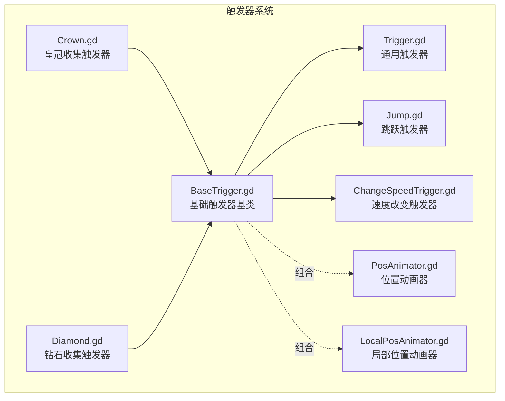
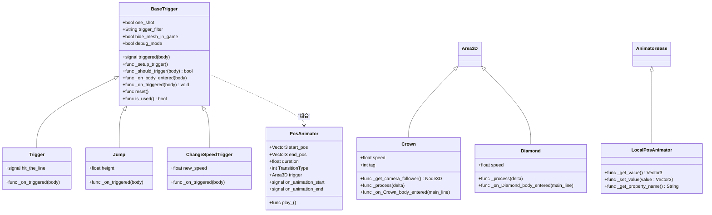
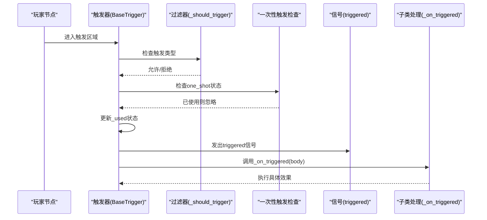
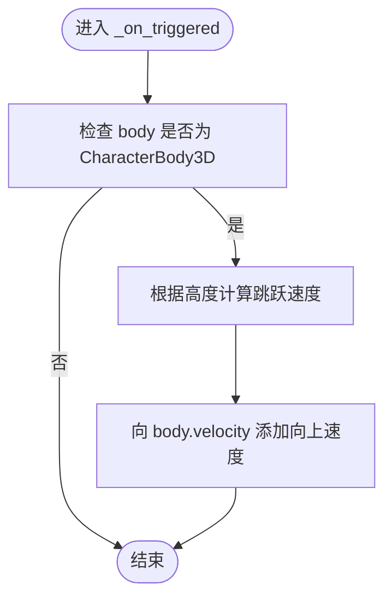
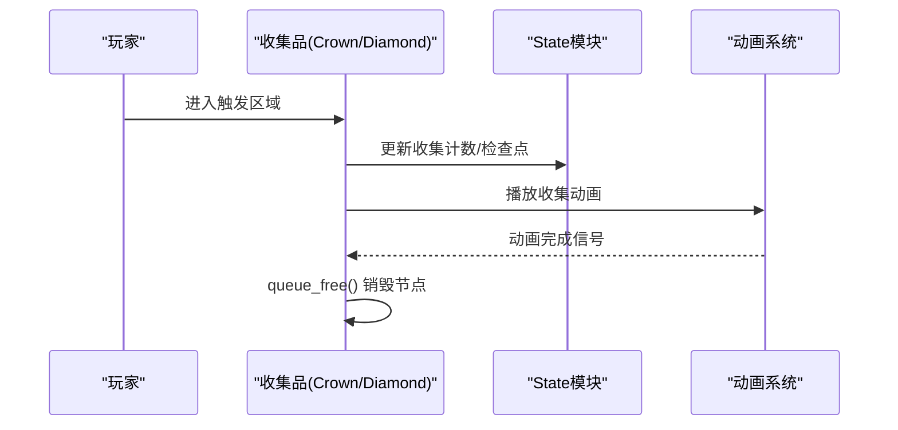
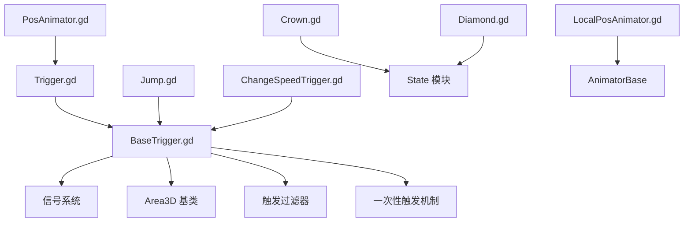

# 触发器扩展开发

<cite>
**本文档引用的文件**
- [BaseTrigger.gd](file://#Template/[Scripts]/Trigger/BaseTrigger.gd)
- [Trigger.gd](file://#Template/[Scripts]/Trigger/Trigger.gd)
- [Jump.gd](file://#Template/[Scripts]/Trigger/Jump.gd)
- [ChangeSpeedTrigger.gd](file://#Template/[Scripts]/Trigger/ChangeSpeedTrigger.gd)
- [Crown.gd](file://#Template/[Scripts]/Trigger/Crown.gd)
- [Diamond.gd](file://#Template/[Scripts]/Trigger/Diamond.gd)
- [PosAnimator.gd](file://#Template/[Scripts]/Trigger/PosAnimator.gd)
- [LocalPosAnimator.gd](file://#Template/[Scripts]/Trigger/LocalPosAnimator.gd)
- [Crown_test.gd](file://Tests/Crown_test.gd)
- [Diamond_test.gd](file://Tests/Diamond_test.gd)
</cite>

## 目录
1. [简介](#简介)
2. [项目结构](#项目结构)
3. [核心组件](#核心组件)
4. [架构概览](#架构概览)
5. [详细组件分析](#详细组件分析)
6. [依赖关系分析](#依赖关系分析)
7. [性能考虑](#性能考虑)
8. [故障排除指南](#故障排除指南)
9. [结论](#结论)
10. [附录](#附录)

## 简介
本文件为 Godot Line 项目的触发器系统提供详细的扩展开发文档。重点阐述 BaseTrigger 基类的设计理念与继承模式，指导开发者如何基于 BaseTrigger 创建自定义触发器类型。文档涵盖触发器生命周期管理、信号系统使用、一次性触发(one-shot)机制实现，并提供完整的自定义触发器开发流程，从类继承到参数配置。同时包含具体示例展示不同类型触发器效果的实现思路，如收集品触发器、特殊效果触发器等，并解释触发器过滤器的工作原理及自定义触发条件的实现方法。

## 项目结构
触发器系统主要位于模板脚本目录下的 Trigger 文件夹中，采用继承与组合相结合的方式构建。BaseTrigger 作为抽象基类提供统一的触发逻辑、过滤器与一次性触发支持；具体触发器通过继承 BaseTrigger 并重写触发处理函数来实现特定效果。

**图表来源**
- [BaseTrigger.gd:1-102](file://#Template/[Scripts]/Trigger/BaseTrigger.gd#L1-L102)
- [Trigger.gd:1-10](file://#Template/[Scripts]/Trigger/Trigger.gd#L1-L10)
- [Jump.gd:1-13](file://#Template/[Scripts]/Trigger/Jump.gd#L1-L13)
- [ChangeSpeedTrigger.gd:1-15](file://#Template/[Scripts]/Trigger/ChangeSpeedTrigger.gd#L1-L15)
- [Crown.gd:1-52](file://#Template/[Scripts]/Trigger/Crown.gd#L1-L52)
- [Diamond.gd:1-17](file://#Template/[Scripts]/Trigger/Diamond.gd#L1-L17)
- [PosAnimator.gd:1-44](file://#Template/[Scripts]/Trigger/PosAnimator.gd#L1-L44)
- [LocalPosAnimator.gd:1-13](file://#Template/[Scripts]/Trigger/LocalPosAnimator.gd#L1-L13)

**章节来源**
- [BaseTrigger.gd:1-102](file://#Template/[Scripts]/Trigger/BaseTrigger.gd#L1-L102)
- [Trigger.gd:1-10](file://#Template/[Scripts]/Trigger/Trigger.gd#L1-L10)
- [Jump.gd:1-13](file://#Template/[Scripts]/Trigger/Jump.gd#L1-L13)
- [ChangeSpeedTrigger.gd:1-15](file://#Template/[Scripts]/Trigger/ChangeSpeedTrigger.gd#L1-L15)
- [Crown.gd:1-52](file://#Template/[Scripts]/Trigger/Crown.gd#L1-L52)
- [Diamond.gd:1-17](file://#Template/[Scripts]/Trigger/Diamond.gd#L1-L17)
- [PosAnimator.gd:1-44](file://#Template/[Scripts]/Trigger/PosAnimator.gd#L1-L44)
- [LocalPosAnimator.gd:1-13](file://#Template/[Scripts]/Trigger/LocalPosAnimator.gd#L1-L13)

## 核心组件
本节深入解析 BaseTrigger 基类的设计原理与继承模式，帮助开发者理解如何基于该基类扩展自定义触发器。

- 设计理念
  - 统一触发逻辑：通过 Area3D 的 body_entered 信号捕获触发事件，集中处理触发判断与状态管理。
  - 过滤器机制：支持按节点类型过滤触发源，确保只有符合条件的节点能激活触发器。
  - 一次性触发(one-shot)：内置状态标记，防止重复触发，适用于一次性事件。
  - 信号系统：对外发出 triggered 信号，便于其他节点订阅与响应。
  - 生命周期管理：在 _ready 中完成初始化，包括网格隐藏与信号连接设置。

- 关键接口与属性
  - 触发信号：triggered(body: Node3D)
  - 导出参数：
    - one_shot: bool，是否仅触发一次
    - trigger_filter: String，触发过滤器，可选值："CharacterBody3D"、"PhysicsBody3D"、"Any"
    - hide_mesh_in_game: bool，运行时隐藏 MeshInstance3D
    - debug_mode: bool，启用调试输出
  - 内部状态：
    - _used: bool，标记是否已触发
    - _signal_connected: bool，标记信号连接状态

- 核心方法
  - _setup_trigger(): 设置 body_entered 信号连接，避免重复连接
  - _should_trigger(body): 根据过滤器判断是否允许触发
  - _on_body_entered(body): 主触发入口，执行一次性触发检查、状态更新、信号发射与子类回调
  - _on_triggered(body): 子类必须实现的虚方法，用于具体触发效果
  - reset(): 重置触发状态，适用于需要重新激活的 one-shot 触发器
  - is_used(): 查询触发器是否已被使用

**章节来源**
- [BaseTrigger.gd:1-102](file://#Template/[Scripts]/Trigger/BaseTrigger.gd#L1-L102)

## 架构概览
触发器系统的整体架构围绕 BaseTrigger 基类展开，具体触发器通过继承获得统一行为，同时通过重写虚方法实现差异化效果。部分触发器还与其他组件(如动画器)组合使用，形成更复杂的效果链路。

**图表来源**
- [BaseTrigger.gd:1-102](file://#Template/[Scripts]/Trigger/BaseTrigger.gd#L1-L102)
- [Trigger.gd:1-10](file://#Template/[Scripts]/Trigger/Trigger.gd#L1-L10)
- [Jump.gd:1-13](file://#Template/[Scripts]/Trigger/Jump.gd#L1-L13)
- [ChangeSpeedTrigger.gd:1-15](file://#Template/[Scripts]/Trigger/ChangeSpeedTrigger.gd#L1-L15)
- [Crown.gd:1-52](file://#Template/[Scripts]/Trigger/Crown.gd#L1-L52)
- [Diamond.gd:1-17](file://#Template/[Scripts]/Trigger/Diamond.gd#L1-L17)
- [PosAnimator.gd:1-44](file://#Template/[Scripts]/Trigger/PosAnimator.gd#L1-L44)
- [LocalPosAnimator.gd:1-13](file://#Template/[Scripts]/Trigger/LocalPosAnimator.gd#L1-L13)

## 详细组件分析

### BaseTrigger 基类分析
BaseTrigger 提供了触发器的核心骨架，包括生命周期管理、过滤器与一次性触发机制。其设计遵循“继承扩展”的原则，子类只需关注自身特有的触发效果。

- 生命周期管理
  - _ready(): 在运行时隐藏可视化网格并建立触发信号连接
  - _hide_mesh(): 隐藏 MeshInstance3D 子节点，减少运行时渲染开销
  - _setup_trigger(): 安全地连接 body_entered 信号，避免重复连接

- 触发过滤器
  - _should_trigger(body): 支持三种过滤模式
    - "CharacterBody3D": 仅允许 CharacterBody3D 类型节点触发
    - "PhysicsBody3D": 允许 PhysicsBody3D 及其子类触发
    - "Any": 允许任意节点触发
  - 默认行为：若过滤器值无效，则回退到 CharacterBody3D 检查

- 一次性触发机制
  - _used 内部状态：记录是否已触发
  - _on_body_entered 中的检查：若 one_shot 且已使用则直接返回
  - reset(): 将 _used 置为 false，允许重新触发

- 信号系统
  - triggered(body): 向外部发出触发信号，携带触发者节点
  - 子类通过 _on_triggered 实现具体逻辑

**图表来源**
- [BaseTrigger.gd:54-91](file://#Template/[Scripts]/Trigger/BaseTrigger.gd#L54-L91)

**章节来源**
- [BaseTrigger.gd:1-102](file://#Template/[Scripts]/Trigger/BaseTrigger.gd#L1-L102)

### 通用触发器 Trigger 分析
Trigger 是最简单的 BaseTrigger 子类，主要用于发射 hit_the_line 信号，供其他节点监听。

- 功能特性
  - 继承 BaseTrigger 的所有通用能力
  - 重写 _on_triggered 以发出 hit_the_line 信号
  - 可通过 one_shot 控制是否仅触发一次
  - 可通过 trigger_filter 限制触发源类型

- 使用场景
  - 作为事件网关，将触发器事件传播给其他系统
  - 与其他组件(如动画器)配合，实现联动效果

**章节来源**
- [Trigger.gd:1-10](file://#Template/[Scripts]/Trigger/Trigger.gd#L1-L10)

### 跳跃触发器 Jump 分析
JumpTrigger 展示了如何在 _on_triggered 中对 CharacterBody3D 进行类型转换并修改其物理属性。

- 功能特性
  - 继承 BaseTrigger 的过滤器与一次性触发机制
  - 重写 _on_triggered：对 CharacterBody3D 节点施加垂直速度
  - 通过高度参数计算跳跃速度

- 实现要点
  - 类型检查：确保 body 是 CharacterBody3D
  - 物理参数：向向上方向添加速度分量
  - 与物理引擎协同：依赖 CharacterBody3D 的速度更新机制

**图表来源**
- [Jump.gd:8-12](file://#Template/[Scripts]/Trigger/Jump.gd#L8-L12)

**章节来源**
- [Jump.gd:1-13](file://#Template/[Scripts]/Trigger/Jump.gd#L1-L13)

### 速度改变触发器 ChangeSpeedTrigger 分析
ChangeSpeedTrigger 展示了如何动态修改目标节点的移动速度属性。

- 功能特性
  - 继承 BaseTrigger 的过滤器与一次性触发机制
  - 重写 _on_triggered：修改 body 的 speed 属性
  - 若目标节点已开始移动(is_start)，则同步更新速度向量

- 实现要点
  - 属性检查：确认 body 具备 speed 属性
  - 条件更新：仅在节点处于启动状态时同步速度向量
  - 与主线路系统的协作：利用 is_start 等标志位

**章节来源**
- [ChangeSpeedTrigger.gd:1-15](file://#Template/[Scripts]/Trigger/ChangeSpeedTrigger.gd#L1-L15)

### 收集品触发器 Crown 与 Diamond 分析
Crown 与 Diamond 展示了非 BaseTrigger 继承的触发器实现方式，它们通过 Area3D 的碰撞回调实现收集效果。

- 共同特性
  - 继承 Area3D，使用 _on_*_body_entered 回调处理碰撞
  - 通过 State 模块更新全局状态(如收集数量、检查点标记)
  - 播放动画并等待动画完成后再销毁节点

- Crown 特性
  - 旋转动画：在 _process 中根据 speed 参数调整旋转速度
  - 相机跟随参数：从场景中的相机跟随节点读取配置并写入 State
  - 检查点标记：设置 line_crossing_crown 标志

- Diamond 特性
  - 旋转动画：同样在 _process 中根据 speed 参数调整旋转
  - 粒子效果：收集时播放粒子并等待发射完成

**图表来源**
- [Crown.gd:25-51](file://#Template/[Scripts]/Trigger/Crown.gd#L25-L51)
- [Diamond.gd:7-12](file://#Template/[Scripts]/Trigger/Diamond.gd#L7-L12)

**章节来源**
- [Crown.gd:1-52](file://#Template/[Scripts]/Trigger/Crown.gd#L1-L52)
- [Diamond.gd:1-17](file://#Template/[Scripts]/Trigger/Diamond.gd#L1-L17)

### 位置动画器 PosAnimator 与 LocalPosAnimator 分析
位置动画器展示了如何将触发器与动画系统结合，实现基于触发器的平滑动画过渡。

- PosAnimator 特性
  - 继承 Node3D，提供位置插值动画
  - 通过导出参数配置起始/结束位置、持续时间与缓动类型
  - 与触发器关联：当触发器发出 hit_the_line 信号时开始播放动画
  - 发出动画开始/结束信号，便于进一步联动

- LocalPosAnimator 特性
  - 继承 AnimatorBase，专门用于局部位置属性的动画化
  - 提供 _get_value/_set_value/_get_property_name 等接口，简化属性绑定

**章节来源**
- [PosAnimator.gd:1-44](file://#Template/[Scripts]/Trigger/PosAnimator.gd#L1-L44)
- [LocalPosAnimator.gd:1-13](file://#Template/[Scripts]/Trigger/LocalPosAnimator.gd#L1-L13)

## 依赖关系分析
触发器系统内部的依赖关系清晰，遵循单一职责与组合优于继承的原则。

**图表来源**
- [BaseTrigger.gd:1-102](file://#Template/[Scripts]/Trigger/BaseTrigger.gd#L1-L102)
- [Trigger.gd:1-10](file://#Template/[Scripts]/Trigger/Trigger.gd#L1-L10)
- [Jump.gd:1-13](file://#Template/[Scripts]/Trigger/Jump.gd#L1-L13)
- [ChangeSpeedTrigger.gd:1-15](file://#Template/[Scripts]/Trigger/ChangeSpeedTrigger.gd#L1-L15)
- [Crown.gd:1-52](file://#Template/[Scripts]/Trigger/Crown.gd#L1-L52)
- [Diamond.gd:1-17](file://#Template/[Scripts]/Trigger/Diamond.gd#L1-L17)
- [PosAnimator.gd:1-44](file://#Template/[Scripts]/Trigger/PosAnimator.gd#L1-L44)
- [LocalPosAnimator.gd:1-13](file://#Template/[Scripts]/Trigger/LocalPosAnimator.gd#L1-L13)

**章节来源**
- [BaseTrigger.gd:1-102](file://#Template/[Scripts]/Trigger/BaseTrigger.gd#L1-L102)
- [Trigger.gd:1-10](file://#Template/[Scripts]/Trigger/Trigger.gd#L1-L10)
- [Jump.gd:1-13](file://#Template/[Scripts]/Trigger/Jump.gd#L1-L13)
- [ChangeSpeedTrigger.gd:1-15](file://#Template/[Scripts]/Trigger/ChangeSpeedTrigger.gd#L1-L15)
- [Crown.gd:1-52](file://#Template/[Scripts]/Trigger/Crown.gd#L1-L52)
- [Diamond.gd:1-17](file://#Template/[Scripts]/Trigger/Diamond.gd#L1-L17)
- [PosAnimator.gd:1-44](file://#Template/[Scripts]/Trigger/PosAnimator.gd#L1-L44)
- [LocalPosAnimator.gd:1-13](file://#Template/[Scripts]/Trigger/LocalPosAnimator.gd#L1-L13)

## 性能考虑
- 信号连接优化
  - BaseTrigger 在 _setup_trigger 中检查并避免重复连接，减少不必要的信号绑定开销
- 可视化网格隐藏
  - 运行时隐藏 MeshInstance3D 子节点，降低渲染压力
- 一次性触发检查
  - one_shot 机制避免重复处理，提升事件处理效率
- 动画器延迟销毁
  - 通过等待动画完成再销毁节点，避免资源泄漏与不一致状态

## 故障排除指南
- 触发器未生效
  - 检查 one_shot 状态：若已触发且未调用 reset()，将被忽略
  - 验证 trigger_filter 设置：确保触发源节点类型符合过滤器要求
  - 确认信号连接：检查 _signal_connected 标志与 _setup_trigger 调用
- 触发器重复触发
  - 确认 one_shot 选项设置
  - 在适当场景调用 reset() 重置状态
- 收集品不消失
  - 检查动画播放与 finished 信号等待
  - 确认 queue_free() 调用时机
- 动画器不播放
  - 验证触发器信号连接：PosAnimator 依赖 Trigger 的 hit_the_line 信号
  - 检查导出参数：start_pos/end_pos/duration/TransitionType 是否正确配置

**章节来源**
- [BaseTrigger.gd:54-91](file://#Template/[Scripts]/Trigger/BaseTrigger.gd#L54-L91)
- [PosAnimator.gd:27-37](file://#Template/[Scripts]/Trigger/PosAnimator.gd#L27-L37)

## 结论
Godot Line 的触发器系统通过 BaseTrigger 基类实现了统一的触发逻辑与生命周期管理，结合信号系统与一次性触发机制，为扩展开发提供了清晰的框架。开发者可以基于 BaseTrigger 快速创建各种类型的触发器，也可以采用 Area3D 的碰撞回调模式实现特定的收集品效果。通过合理使用过滤器与动画器，能够构建复杂而流畅的游戏体验。

## 附录

### 自定义触发器开发流程
1. 选择继承模式
   - 若需统一触发逻辑与信号系统：继承 BaseTrigger
   - 若仅需简单碰撞处理：继承 Area3D 并实现 _on_*_body_entered 回调
2. 定义导出参数
   - one_shot：是否仅触发一次
   - trigger_filter：触发过滤器类型
   - 自定义参数：如高度(height)、新速度(new_speed)、旋转速度(speed)等
3. 实现触发处理
   - 继承 BaseTrigger：重写 _on_triggered(body)
   - Area3D 方式：在 _on_*_body_entered 中实现效果
4. 集成与测试
   - 将触发器集成到关卡场景
   - 使用测试用例验证行为与状态变更

### 触发器过滤器工作原理
- 过滤器类型
  - CharacterBody3D：仅允许 CharacterBody3D 及其子类触发
  - PhysicsBody3D：允许 PhysicsBody3D 及其子类触发
  - Any：允许任意节点触发
- 默认行为：无效值回退到 CharacterBody3D 检查

### 自定义触发条件实现
- 扩展 _should_trigger：在子类中重写以实现更复杂的触发条件
- 状态检查：结合全局状态(State)或其他节点状态进行判断
- 多条件组合：支持同时检查节点类型、状态标志与环境条件

**章节来源**
- [BaseTrigger.gd:74-86](file://#Template/[Scripts]/Trigger/BaseTrigger.gd#L74-L86)
- [Crown_test.gd:1-178](file://Tests/Crown_test.gd#L1-L178)
- [Diamond_test.gd:1-167](file://Tests/Diamond_test.gd#L1-L167)