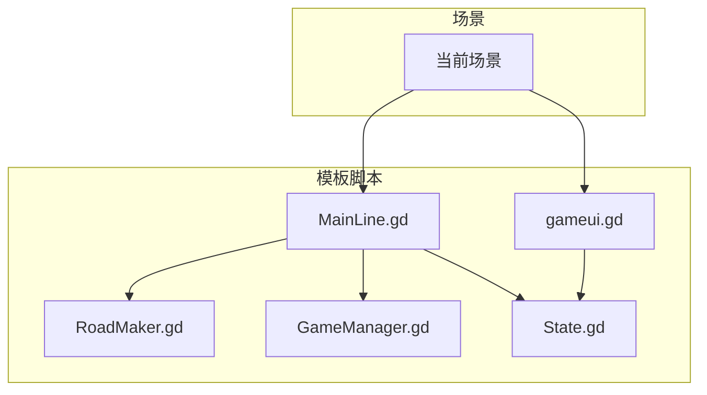
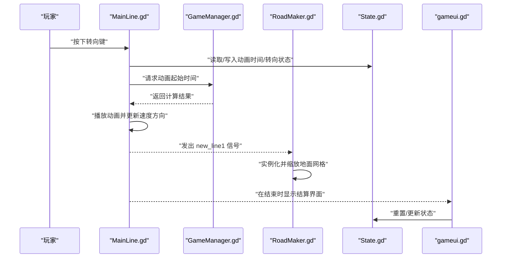
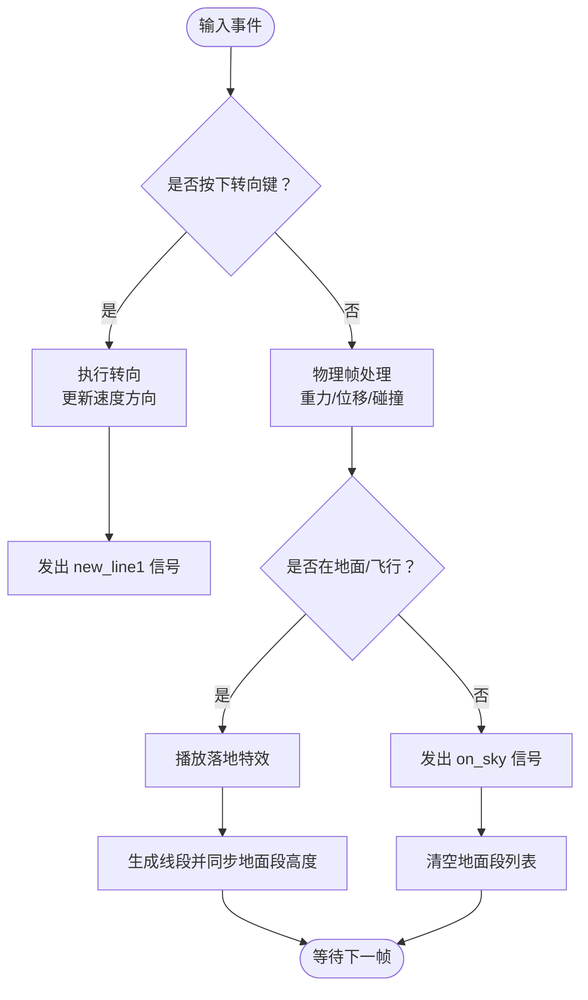
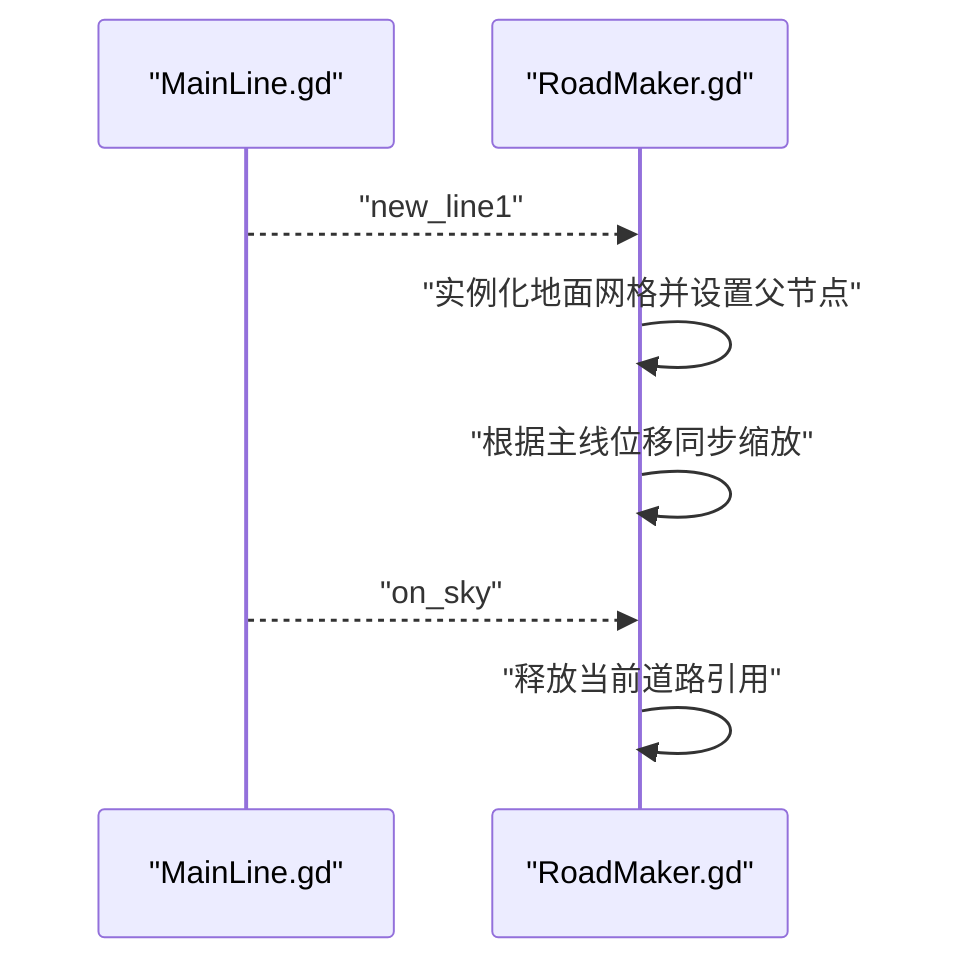
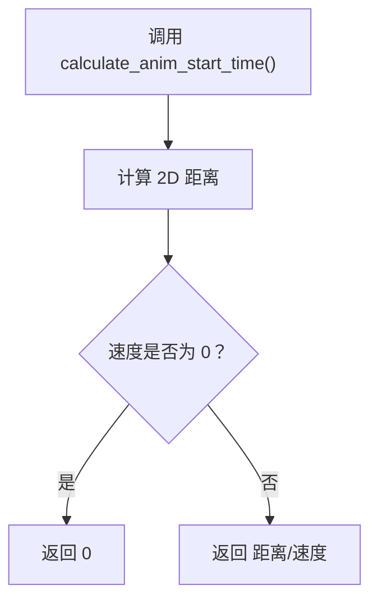
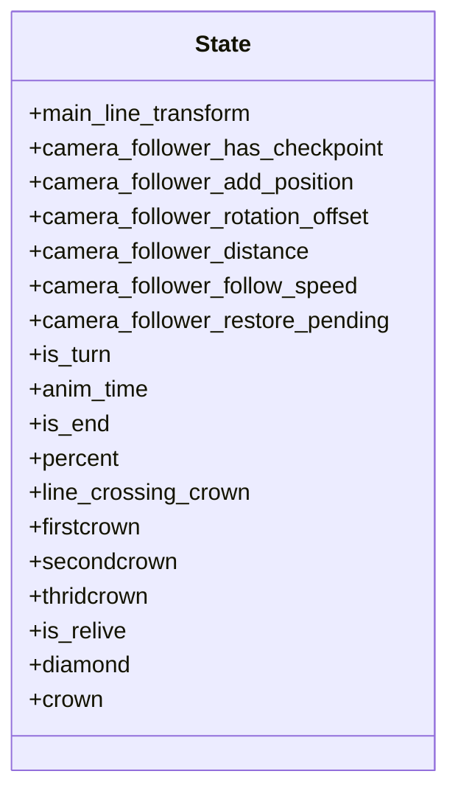
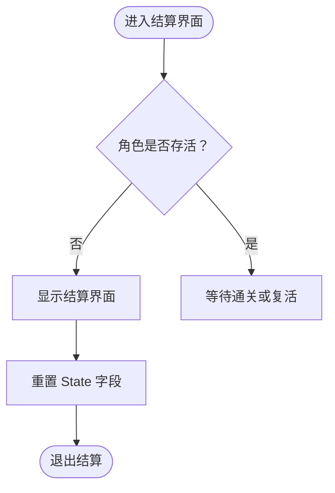
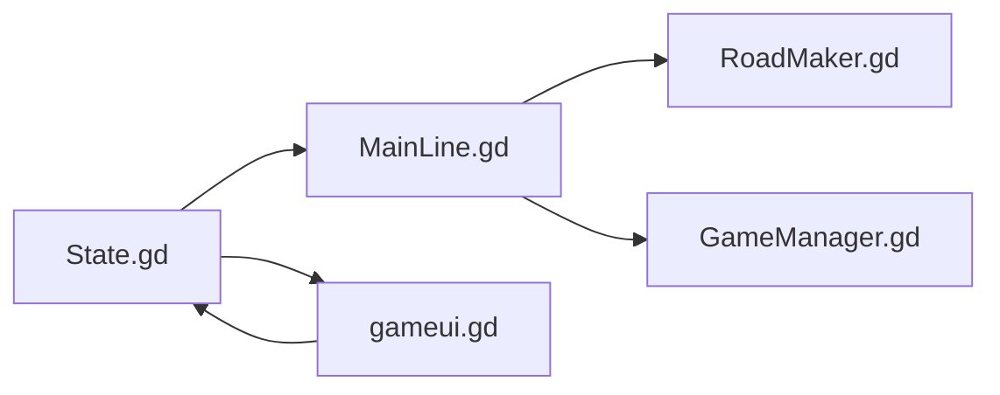

# 数据流架构

<cite>
**本文引用的文件**
- [MainLine.gd](file://#Template/[Scripts]/MainLine.gd)
- [GameManager.gd](file://#Template/[Scripts]/GameManager.gd)
- [State.gd](file://#Template/[Scripts]/State.gd)
- [RoadMaker.gd](file://#Template/[Scripts]/RoadMaker.gd)
- [gameui.gd](file://#Template/[Scripts]/gameui.gd)
- [README.md](file://README.md)
</cite>

## 目录
1. [简介](#简介)
2. [项目结构](#项目结构)
3. [核心组件](#核心组件)
4. [架构总览](#架构总览)
5. [详细组件分析](#详细组件分析)
6. [依赖关系分析](#依赖关系分析)
7. [性能考量](#性能考量)
8. [故障排查指南](#故障排查指南)
9. [结论](#结论)
10. [附录](#附录)

## 简介
本文件面向开发者，系统化梳理 Godot Line 的数据流架构，覆盖从玩家输入到最终渲染输出的完整路径。重点解释信号系统、状态管理与事件处理在不同层级之间的数据传递机制，并提供数据流向图与时序图，帮助快速理解系统运行机制与调试方法。

## 项目结构
- 项目以场景与脚本为核心组织，模板目录包含关卡生成、触发器、UI、相机跟随等模块。
- 关键运行时脚本位于模板的 Scripts 子目录，其中 MainLine.gd 是玩家控制的主体角色，RoadMaker.gd 负责根据主线移动动态生成道路，GameManager.gd 提供动画起始时间计算与颜色设置，State.gd 作为全局状态容器，gameui.gd 负责结算界面与状态复位。

图表来源
- [MainLine.gd:1-224](file://#Template/[Scripts]/MainLine.gd#L1-L224)
- [RoadMaker.gd:1-46](file://#Template/[Scripts]/RoadMaker.gd#L1-L46)
- [GameManager.gd:1-47](file://#Template/[Scripts]/GameManager.gd#L1-L47)
- [State.gd:1-23](file://#Template/[Scripts]/State.gd#L1-L23)
- [gameui.gd:1-70](file://#Template/[Scripts]/gameui.gd#L1-L70)

章节来源
- [README.md:53-65](file://README.md#L53-L65)

## 核心组件
- 主线角色 MainLine.gd
  - 处理物理移动、转向、死亡与粒子效果；通过信号 new_line1/on_sky/onturn 与场景其他对象解耦联动。
  - 使用 State 共享动画起始时间与相机跟随状态，支持重载与恢复。
- 道路生成 RoadMaker.gd
  - 订阅 MainLine 的信号，动态实例化并调整地面网格，保持与主线位置同步。
- 全局管理 GameManager.gd
  - 提供动画起始时间计算（基于 2D 距离与速度），以及颜色设置接口。
- 全局状态 State.gd
  - 存储相机跟随、动画时间、通关状态、收集品数量与复活标记等。
- 游戏 UI gameui.gd
  - 监控角色存活与通关状态，展示结算界面并重置状态。

章节来源
- [MainLine.gd:1-224](file://#Template/[Scripts]/MainLine.gd#L1-L224)
- [RoadMaker.gd:1-46](file://#Template/[Scripts]/RoadMaker.gd#L1-L46)
- [GameManager.gd:1-47](file://#Template/[Scripts]/GameManager.gd#L1-L47)
- [State.gd:1-23](file://#Template/[Scripts]/State.gd#L1-L23)
- [gameui.gd:1-70](file://#Template/[Scripts]/gameui.gd#L1-L70)

## 架构总览
下图展示了从输入到渲染的关键数据流路径：玩家输入经 MainLine 处理，触发转向与动画播放；同时通过信号通知 RoadMaker 动态生成道路；GameManager 提供动画起始时间；State 在各组件间共享状态；gameui 响应结束与复活状态进行 UI 切换。

图表来源
- [MainLine.gd:105-184](file://#Template/[Scripts]/MainLine.gd#L105-L184)
- [RoadMaker.gd:14-27](file://#Template/[Scripts]/RoadMaker.gd#L14-L27)
- [GameManager.gd:23-39](file://#Template/[Scripts]/GameManager.gd#L23-L39)
- [gameui.gd:10-37](file://#Template/[Scripts]/gameui.gd#L10-L37)
- [State.gd:1-23](file://#Template/[Scripts]/State.gd#L1-L23)

## 详细组件分析

### 主线角色 MainLine：输入、逻辑与信号
- 输入处理
  - 监听“转向”动作，调用转向逻辑，更新速度方向并生成新线段。
- 物理与状态
  - 在物理帧中应用重力、同步速度与位移；在地面/飞行状态下分别处理特效与线段生成。
- 信号与联动
  - 发出 new_line1/on_sky/onturn 等信号，驱动 RoadMaker 与 UI 行为。
- 状态与重载
  - 通过 State 共享动画起始时间与相机跟随状态；提供 reload 以恢复场景与状态。

图表来源
- [MainLine.gd:105-109](file://#Template/[Scripts]/MainLine.gd#L105-L109)
- [MainLine.gd:53-62](file://#Template/[Scripts]/MainLine.gd#L53-L62)
- [MainLine.gd:78-103](file://#Template/[Scripts]/MainLine.gd#L78-L103)
- [MainLine.gd:168-184](file://#Template/[Scripts]/MainLine.gd#L168-L184)

章节来源
- [MainLine.gd:105-184](file://#Template/[Scripts]/MainLine.gd#L105-L184)
- [MainLine.gd:195-224](file://#Template/[Scripts]/MainLine.gd#L195-L224)

### 道路生成 RoadMaker：基于信号的动态构建
- 信号订阅
  - 订阅 MainLine 的 new_line1/on_sky 信号，在新线段出现时实例化地面网格并随主线移动同步缩放。
- 场景挂载
  - 将道路节点树延迟添加到场景根，避免生命周期冲突。

图表来源
- [RoadMaker.gd:14-27](file://#Template/[Scripts]/RoadMaker.gd#L14-L27)
- [RoadMaker.gd:29-33](file://#Template/[Scripts]/RoadMaker.gd#L29-L33)
- [RoadMaker.gd:44-46](file://#Template/[Scripts]/RoadMaker.gd#L44-L46)

章节来源
- [RoadMaker.gd:1-46](file://#Template/[Scripts]/RoadMaker.gd#L1-L46)

### 全局管理 GameManager：动画时间与颜色
- 动画起始时间计算
  - 基于原点 2D 距离与当前速度计算动画播放起点，保证视觉连贯。
- 颜色接口
  - 提供设置/获取颜色的方法，委托给 MainLine 实现。

图表来源
- [GameManager.gd:23-39](file://#Template/[Scripts]/GameManager.gd#L23-L39)

章节来源
- [GameManager.gd:1-47](file://#Template/[Scripts]/GameManager.gd#L1-L47)

### 全局状态 State：跨组件共享
- 状态字段
  - 包含相机跟随、动画时间、通关与收集品状态、复活标记等。
- 使用方式
  - MainLine 读取/写入动画时间与转向状态；gameui 在结算时读取并重置状态。

图表来源
- [State.gd:1-23](file://#Template/[Scripts]/State.gd#L1-L23)

章节来源
- [State.gd:1-23](file://#Template/[Scripts]/State.gd#L1-L23)

### UI gameui：状态驱动的界面切换
- 生命周期
  - 在角色死亡或通关时显示结算界面。
- 结算逻辑
  - 根据 State.crown 播放不同动画；根据复活标记扣减星数；重置全局状态以便重开。

图表来源
- [gameui.gd:10-37](file://#Template/[Scripts]/gameui.gd#L10-L37)
- [gameui.gd:40-69](file://#Template/[Scripts]/gameui.gd#L40-L69)

章节来源
- [gameui.gd:1-70](file://#Template/[Scripts]/gameui.gd#L1-L70)

## 依赖关系分析
- 组件耦合
  - MainLine 与 RoadMaker 通过信号弱耦合；MainLine 与 GameManager 通过函数调用交互；UI 与 State 通过状态读写交互。
- 状态一致性
  - State 作为唯一真相源，确保 UI、MainLine、相机跟随等模块的状态一致。
- 外部依赖
  - 依赖 Godot 的信号系统、动画播放器与场景树管理。

图表来源
- [MainLine.gd:44-51](file://#Template/[Scripts]/MainLine.gd#L44-L51)
- [RoadMaker.gd:14-17](file://#Template/[Scripts]/RoadMaker.gd#L14-L17)
- [GameManager.gd:23-39](file://#Template/[Scripts]/GameManager.gd#L23-L39)
- [gameui.gd:14-15](file://#Template/[Scripts]/gameui.gd#L14-L15)

章节来源
- [MainLine.gd:42-51](file://#Template/[Scripts]/MainLine.gd#L42-L51)
- [RoadMaker.gd:12-20](file://#Template/[Scripts]/RoadMaker.gd#L12-L20)
- [gameui.gd:7-8](file://#Template/[Scripts]/gameui.gd#L7-L8)

## 性能考量
- 信号触发频率
  - new_line1 与 on_sky 信号在主线移动与离地时触发，建议避免在信号回调中执行重型操作。
- 场景树挂载
  - RoadMaker 使用延迟添加到场景根，减少帧内分配压力。
- 动画时间计算
  - GameManager 的计算为纯数学运算，开销极低；注意速度为 0 时直接返回 0，避免除零风险。
- 粒子与特效
  - 死亡粒子在帧内批量创建，建议限制数量或使用对象池以降低峰值开销。

## 故障排查指南
- 转向无效
  - 检查输入映射与“转向”动作是否正确绑定；确认 MainLine 的输入处理未被编辑器模式屏蔽。
- 线段不生成
  - 确认 MainLine 已发出 new_line1 信号；检查 RoadMaker 是否成功订阅并实例化地面网格。
- 动画不同步
  - 核对 GameManager 返回的动画起始时间；检查 State.anim_time 是否被正确写入与读取。
- 结算界面不显示
  - 确认 gameui 监测到角色死亡或 State.is_end 为真；检查 State 重置逻辑是否执行。
- 场景重载异常
  - 确认 State 中的主线路由与相机跟随状态在 reload 后被正确恢复。

章节来源
- [MainLine.gd:105-109](file://#Template/[Scripts]/MainLine.gd#L105-L109)
- [RoadMaker.gd:14-27](file://#Template/[Scripts]/RoadMaker.gd#L14-L27)
- [GameManager.gd:23-39](file://#Template/[Scripts]/GameManager.gd#L23-L39)
- [gameui.gd:10-16](file://#Template/[Scripts]/gameui.gd#L10-L16)
- [MainLine.gd:114-124](file://#Template/[Scripts]/MainLine.gd#L114-L124)

## 结论
本数据流架构以信号与状态为核心，将输入处理、逻辑更新与渲染输出解耦，形成清晰的分层与职责边界。通过 State 统一状态源，配合 GameManager 的动画时间计算与 RoadMaker 的动态构建，实现了流畅的游玩体验。建议在扩展新功能时遵循现有模式，优先通过信号与状态进行组件通信，确保系统可维护性与可测试性。

## 附录
- 输入控制
  - 转向：鼠标左键/空格
  - 重试：R
  - 保存：S
  - 重载：Q
  - 保存锥体：W

章节来源
- [README.md:43-52](file://README.md#L43-L52)